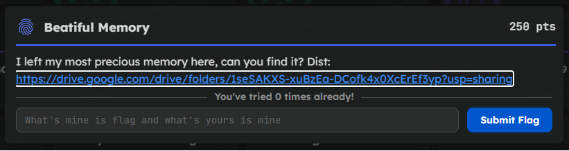
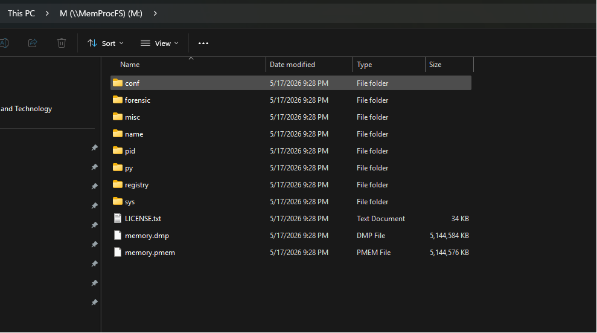
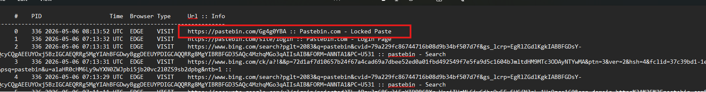
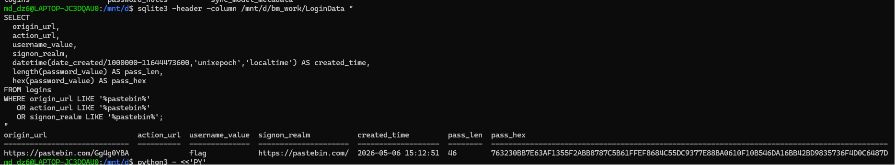
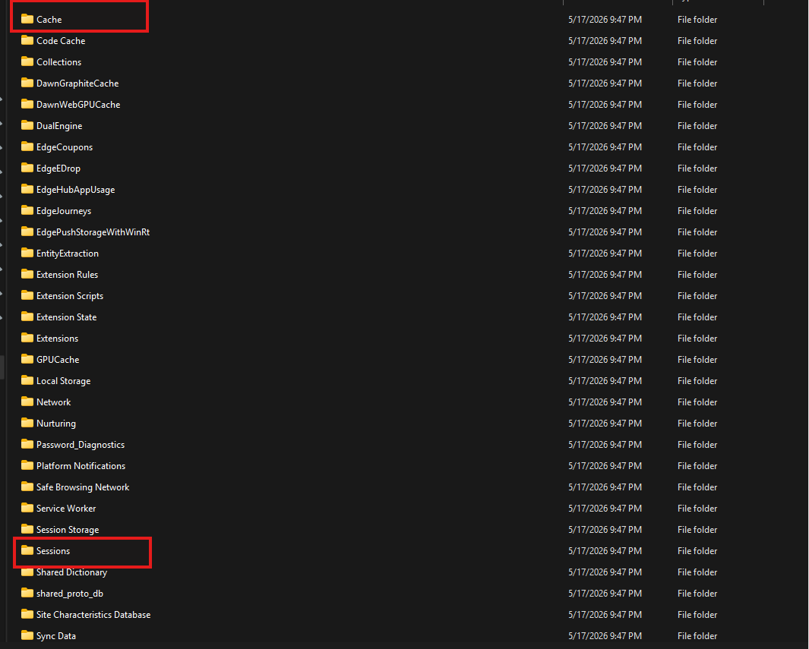
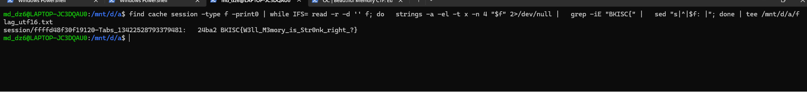
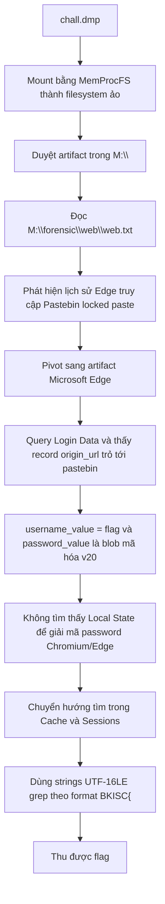

# Challenge Beatiful Memory

## 1. Đầu vào challenge

Sử dụng **MemProcFS** để mount file memory dump `chall.dmp` thành một filesystem ảo. 




Từ `M:\forensic\web\web.txt`, kiểm tra lịch sử duyệt web của Edge và thấy một URL rất đáng chú ý:

```text
https://pastebin.com/Gg4g0YBA
```


Dòng history cho biết trang này có title là `Pastebin.com - Locked Paste`. Đây là pivot chính của bài, vì ban đầu hint nói về “precious memory”, còn trong memory lại có dấu vết người dùng truy cập một locked paste trên Pastebin. Vậy đây là artifact của Microsoft Edge như History, Web Data, Login Data, Sessions, Local Storage và cache để tìm password hoặc nội dung đã được unlock của paste này.

## 2. Pivot sang artifact của Microsoft Edge

Vậy có thể nghĩ tới rằng flag đã được lưu trong phần password của Pastebin. Khi query bảng `logins` trong file `Login Data`, mình thấy một record rất đáng nghi: `origin_url` trỏ tới `https://pastebin.com/Gg4g0YBA`, `username_value` là `flag`, còn `password_value` là một blob được mã hóa bắt đầu bằng `v20`.



### Phân tích

Điều này cho thấy flag nhiều khả năng chính là password đã lưu của tài khoản/form trên Pastebin. Tuy nhiên, để giải mã password của Chromium/Edge thì cần lấy key từ file `Local State` trong thư mục `User Data`. Khi check lại các artifact không thấy file `Local State`.

Vậy có thể chuyển sang pivot tìm trong nội dung cache/session của Microsoft Edge. Vì lúc truy cập locked paste, trình duyệt có thể lưu lại URL, title, form data hoặc một phần nội dung.

Trong đó, `Cache` và `Sessions` là hai hướng đáng chú ý nhất:

- `Cache` có thể chứa response hoặc script liên quan tới Pastebin.
- `Sessions` có thể lưu lại tab đang mở, URL `https://pastebin.com/Gg4g0YBA`, title của trang và một số state của trình duyệt trước khi dump được tạo.



## 3. Tìm flag trong cache/session

Sử dụng `strings` để đọc chuỗi dạng UTF-16LE rồi grep theo format flag thì thu được flag.

```bash
find cache session -type f -print0 | while IFS= read -r -d '' f; do   strings -a -el -t x -n 4 "$f" 2>/dev/null |   grep -iE "BKISC{" |   sed "s|^|$f: |"; done
```



## 4. Flag

Flag là:

```text
BKISC{W3ll_M3mory_is_Str0nk_right_?}
```

## 5. Flow


