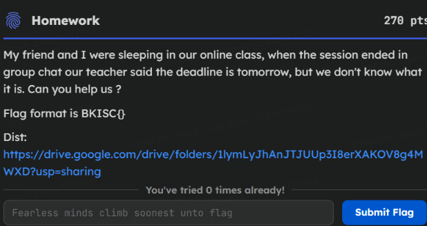
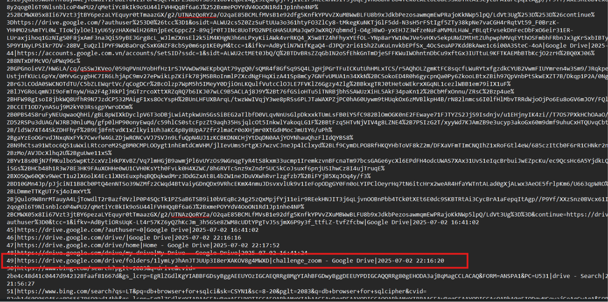
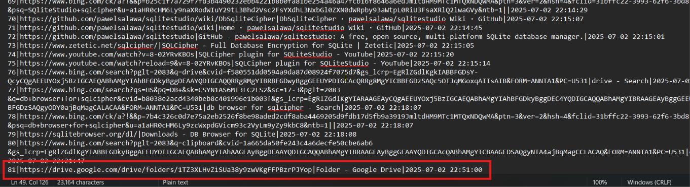
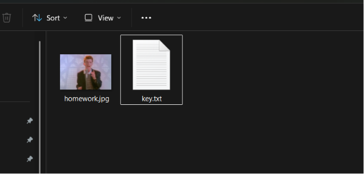
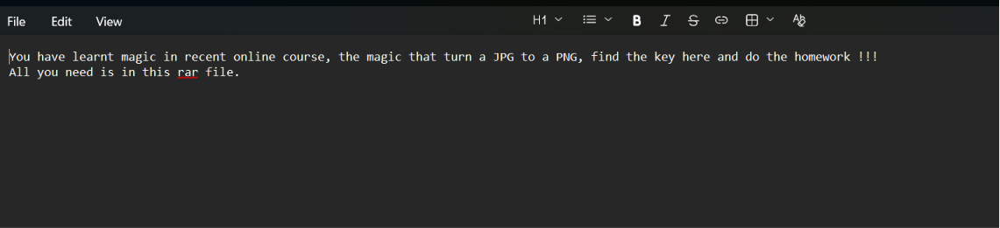
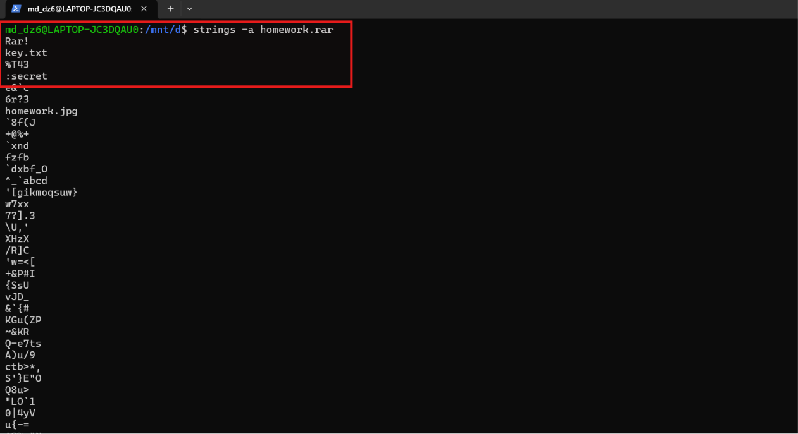
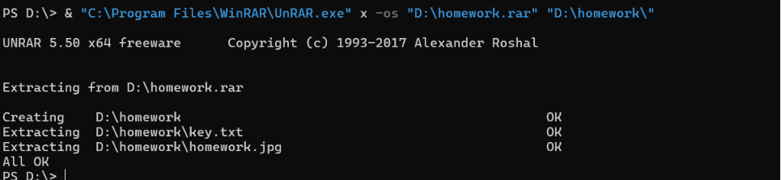
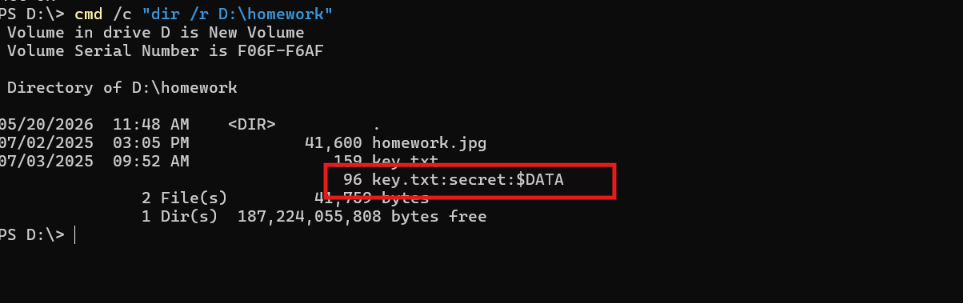
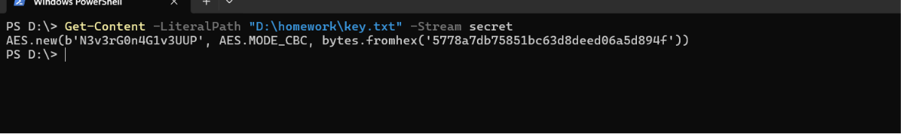
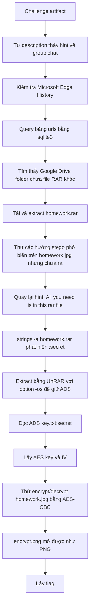

# Challenge Homework

## 1. Đầu vào challenge

Từ description của challenge có nhắc tới **group chat**, vậy nơi đầu tiên nghi ngờ tới là browser, đặc biệt là file `History` của Microsoft Edge ở đường dẫn:

```text
Users\KangTheConq\AppData\Local\Microsoft\Edge\User Data\Default
```



Sau khi có file `History`, sử dụng `sqlite3` để query bảng `urls`:

```bash
sqlite3 History "SELECT id, url, title, datetime(last_visit_time/1000000 - 11644473600, 'unixepoch', 'localtime') AS visit_time FROM urls"
```

Sau khi query xong thu được bảng chứa các URL được truy cập, chú ý hơn vào 2 URL này.





Trong đó:

```text
https://drive.google.com/drive/folders/1lymLyJhAnJTJUUp3I8erXAKOV8g4MWXD
```

là URL dùng để truy cập tới folder Drive chứa file `chall.ad1` gốc của challenge.

Còn URL:

```text
https://drive.google.com/drive/folders/1TZ3XLHvZiSUa38y9zwVKgFFPBzrPJYop
```

lại là URL chứa file RAR khác của challenge. Vậy đây sẽ là pivot mới.

Sau khi tải file RAR và extract thì thu được 2 file này.





---

## 2. Kiểm tra file RAR và hint

Vậy khả năng tới đây là stego từ file ảnh `homework.jpg`, nhưng dù đã thử rất nhiều hướng phổ biến như `strings`, `binwalk`, `exiftool`, `steghide`, kiểm tra metadata hay tìm dữ liệu append sau JPEG đều chưa ra kết quả.

Quay lại hint trong `key.txt`, câu:

```text
All you need is in this rar file
```

nên thử kiểm tra lại chính file RAR.



Khi chạy `strings -a` trên file `homework.rar` thấy xuất hiện chuỗi `:secret` nằm gần khu vực của `key.txt`. Vậy là có ADS gắn với `key.txt`.

Vậy giờ cần extract lại để giữ được NTFS Alternate Data Stream.

```powershell
"C:\Program Files\WinRAR\UnRAR.exe" x -os "D:\homework.rar" "D:\homework\"
```



Check lại ADS bằng:

```powershell
dir /r
```



Đọc stream `secret`:

```powershell
Get-Content -LiteralPath "D:\homework\key.txt" -Stream secret
```



Nội dung ADS trả về một đoạn code khởi tạo AES-CBC. Từ đây lấy được:

```text
key = N3v3rG0n4G1v3UUP
IV  = 5778a7db75851bc63d8deed06a5d894f
```

Đây chính là “key” mà `key.txt` đã hint tới.

---

## 3. Thử biến đổi `homework.jpg` bằng AES-CBC

Với hint trong `key.txt` là:

```text
You have learnt magic in recent online course, the magic that turn a JPG to a PNG...
```

và key vừa nhận được thì có thể nghĩ ra 2 hướng:

- Encrypt file `homework.jpg` bằng AES-CBC với key/IV trên.
- Decrypt file `homework.jpg` bằng AES-CBC.
Sử dụng script để thử cả 2 hướng:

```python
from Crypto.Cipher import AES
from pathlib import Path

key = b"N3v3rG0n4G1v3UUP"
iv = bytes.fromhex("5778a7db75851bc63d8deed06a5d894f")

data = Path("homework.jpg").read_bytes()

cipher = AES.new(key, AES.MODE_CBC, iv)
Path("encrypt.png").write_bytes(cipher.encrypt(data))

cipher = AES.new(key, AES.MODE_CBC, iv)
Path("decrypt.png").write_bytes(cipher.decrypt(data))
```

Cuối cùng, sau khi thử cả hai hướng, file tạo ra từ phép **encrypt** là file có thể mở được như PNG.

---

## 4. Flag

Flag là:

```text
BKISCTF{Y0u_G0t_A_F0r_Th1s_St3g4n0gr4phy_Cl4ss}
```

---

## 5. Flow


