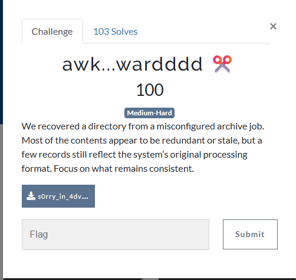
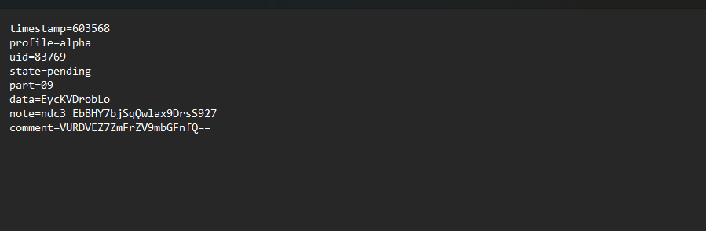
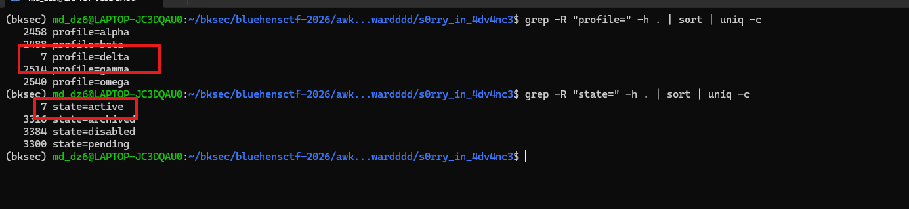
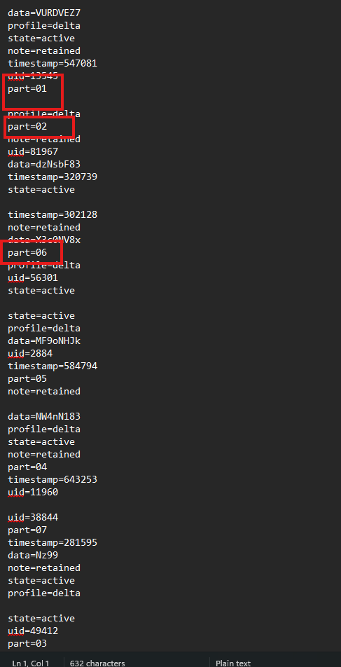
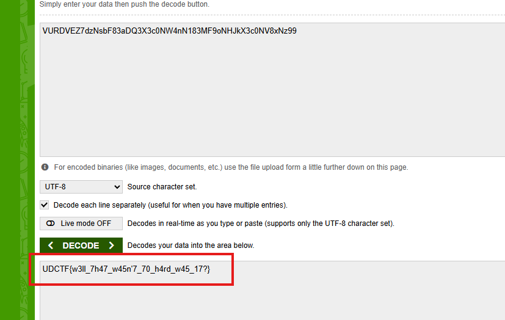
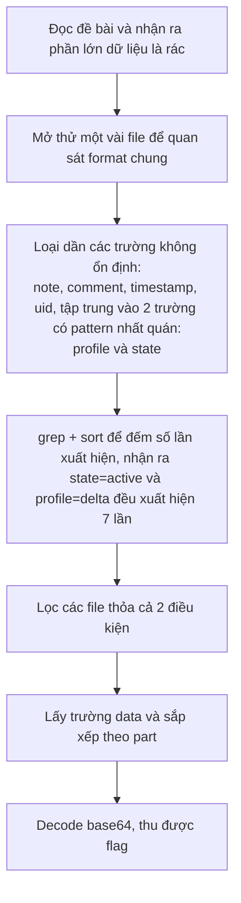

# Challenge awk...wardddd

## 1. Đầu vào challenge



Từ đề bài có thể thấy **“Most contents are redundant or stale. Focus on what remains consistent”**, phần lớn dữ liệu là rác, cần phải tìm ra những record có pattern nhất quán.

Mở thử 1 vài file thấy phần lớn các file đều có cấu trúc như này.



## 2. Tìm các trường có pattern ổn định

Thử `grep` và `sort` xem các trường xuất hiện trong format. Chú ý `note` và `comment` thì cũng khó để nhìn ra text thường, `timestamp` khó vì các file đôi khi có thể lệch nhau và có cả phần mili giây, `part` thì có thể nghĩ là các phần của flag nhưng có nhiều file rác sinh ra nên đôi khi file rác và file thật có thể trùng `part` nhau, `uid` là mã id của từng file nên tất cả sẽ khác nhau.

Vậy chỉ còn trường `profile` và `state` đáng để thử `grep` và `sort`.

```bash
grep -R "profile=" -h . | sort | uniq -c
grep -R "state=" -h . | sort | uniq -c
```



Thấy được `state=active` và `profile=delta` đều xuất hiện `7` lần, vậy giờ lấy tên file và nội dung của các file chứa cả 2 giá trị `state` và `profile` đó.

```bash
grep -R -l 'state=active' . | xargs grep -l 'profile=delta' | while read f; do
  cat "$f"
  echo
done
```



## 3. Ghép dữ liệu theo trường `part`

Sắp xếp trường `data` dựa vào trường `part` thu được 1 đoạn base64, decode thì thu được flag là `UDCTF{w3ll_7h47_w45n'7_70_h4rd_w45_17?}`.



## 4. Flag

```text
UDCTF{w3ll_7h47_w45n'7_70_h4rd_w45_17?}
```

## 5. Flow


