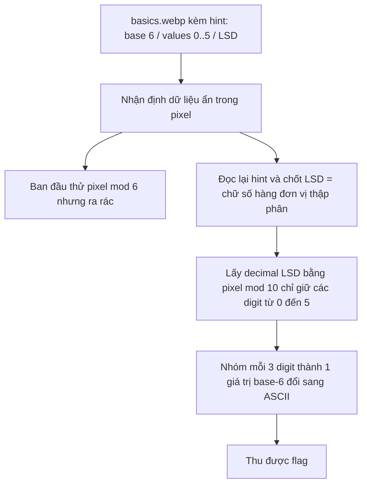

# Challenge Basics

## 1. Đầu vào challenge

Challenge cung cấp file `basics.webp`.

Từ tên challenge là **Basics**, cùng với các hint như:

- `in baseball, there is no base 6...`
- `values can only be 0 through 5`
- `doing LSD`

---

## 2. Phân tích hint và hướng suy nghĩ ban đầu

Từ các hint, có thể rút ra mấy ý quan trọng:

- **base 6**  
  dữ liệu sau cùng sẽ được biểu diễn bằng các chữ số từ `0` đến `5`

- **values can only be 0 through 5**  
  nghĩa là ở đâu đó trong ảnh sẽ phải tách ra được một dãy digit chỉ gồm `0..5`

- **LSD**  
  lúc đầu rất dễ nghĩ tới **Least Significant Bit** hoặc hiểu kiểu mod theo base-6, nhưng thực ra ở đây phải chú ý kỹ hơn: `LSD` là **Least Significant Digit**, tức là **chữ số hàng đơn vị trong hệ thập phân**

Vì vậy, hướng hợp lý là:
- lấy giá trị pixel
- rút ra chữ số hàng đơn vị
- chỉ giữ các giá trị hợp lệ `0..5`
- ghép lại theo cơ số 6 để decode ra text

---

## 3. Hướng thử ban đầu và vì sao chưa đúng

Ban đầu rất dễ đi theo hướng:

```python
pixel % 6
```

rồi ghép 3 chữ số base-6 thành 1 byte ASCII.

Cách này nhìn qua thì hợp lý vì hint có nhắc tới `base 6`, nhưng khi thử thì kết quả ra toàn ký tự rác. Điều đó cho thấy:

- cách nhóm 3 digit không sai
- nhưng nguồn digit đang lấy ra chưa đúng

Ngoài ra, các hướng như:

- LSB steganography kiểu truyền thống
- thử trên từng channel R/G/B
- thử grayscale / HSV
- thử đọc chunk ẩn trong file WebP

đều không cho ra kết quả có ý nghĩa.

Vậy điểm cần sửa không phải ở bước decode cuối, mà là ở cách hiểu chữ **LSD**.

---

## 4. Chốt lại ý nghĩa thật của LSD

Điểm mấu chốt của bài là:

**LSD ở đây không phải bit thấp nhất, mà là chữ số hàng đơn vị trong hệ thập phân.**

Tức là với mỗi pixel, thay vì lấy:

```python
pixel % 6
```

thì phải lấy:

```python
pixel % 10
```

để thu được **decimal least significant digit**.

Sau đó mới:

- chỉ giữ các digit `<= 5`
- coi chúng là các chữ số hợp lệ trong base-6
- nhóm 3 digit lại để đổi thành ASCII

Đây cũng chính là chỗ chơi chữ của đề:
- hint nhắc tới **base 6**
- nhưng dữ liệu không nằm trực tiếp ở `mod 6`
- mà nằm ở **digit cuối của biểu diễn thập phân**, rồi mới lọc về miền `0..5`

---

## 5. Script giải

```python
from PIL import Image
import numpy as np
import re

img = Image.open("basics.webp").convert("RGB")
arr = np.array(img)
pixels = arr.flatten()

# Lấy chữ số hàng đơn vị trong hệ thập phân
decimal_digits = [int(p) % 10 for p in pixels]

# Chỉ giữ các giá trị hợp lệ của base-6
valid_digits = [d for d in decimal_digits if d <= 5]

# Ghép mỗi 3 digit base-6 thành 1 ký tự
chars = []
for i in range(0, len(valid_digits) - 2, 3):
    val = valid_digits[i] * 36 + valid_digits[i + 1] * 6 + valid_digits[i + 2]
    if 32 <= val <= 126:
        chars.append(chr(val))

decoded = ''.join(chars)
print(decoded)

flags = re.findall(r'[A-Z0-9_]+\{[^}]+\}', decoded)
print(flags)
```

---

## 6. Flag

```text
UDCTF{Flaggy_Flag}
```

---

## 7. Flow


