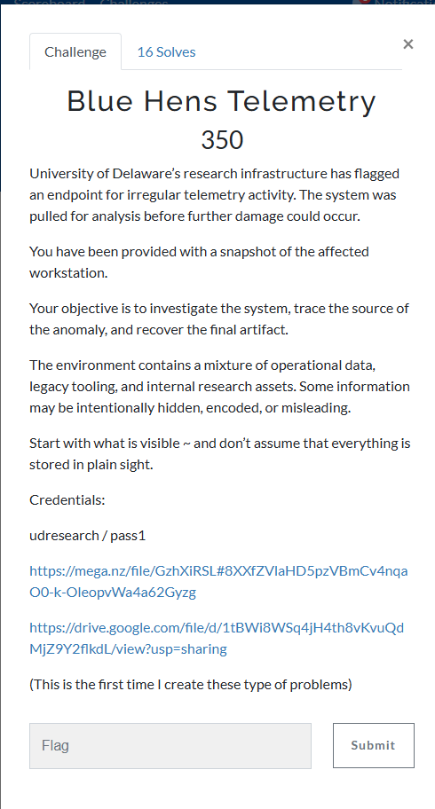
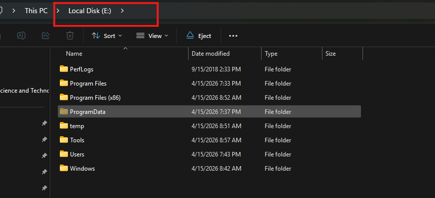
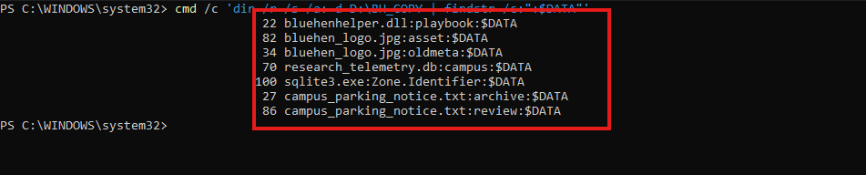
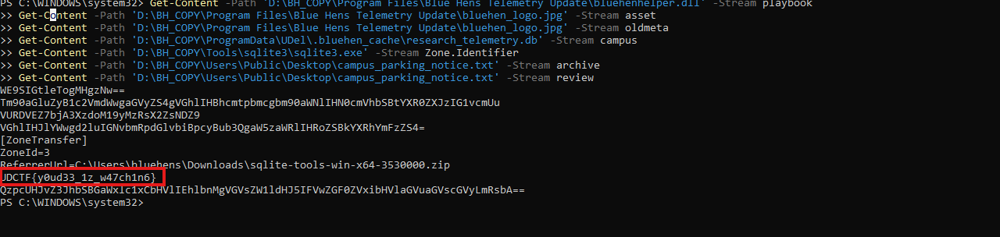
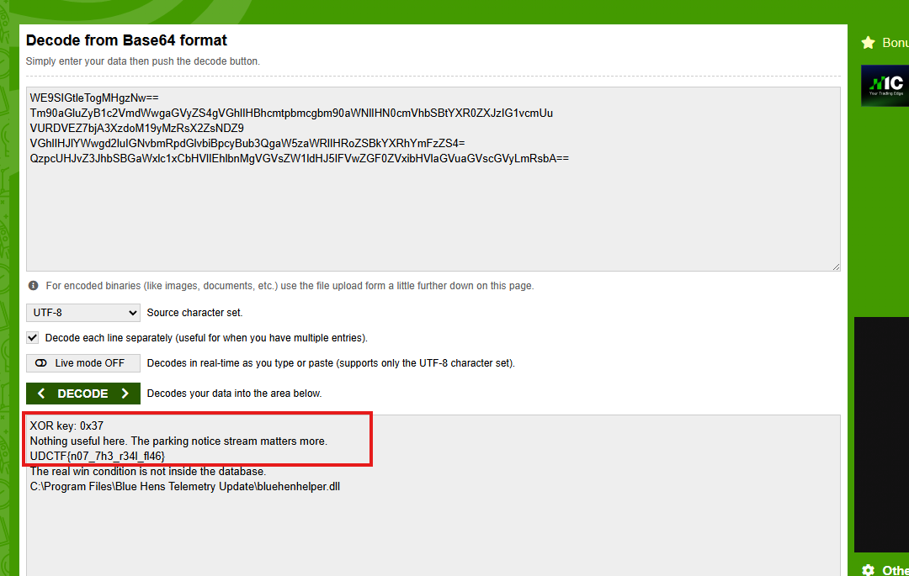
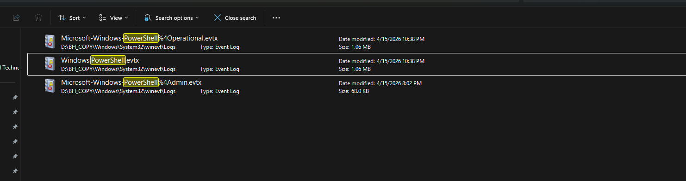
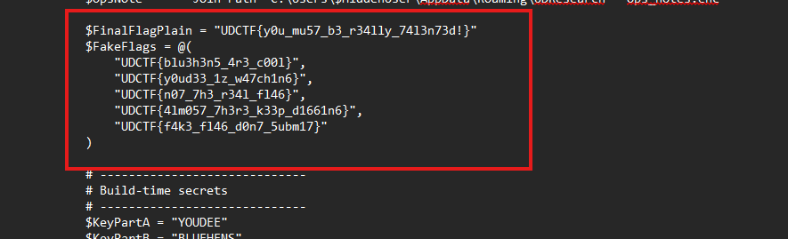
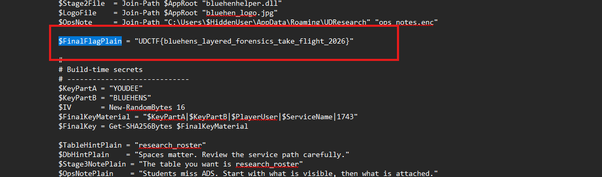
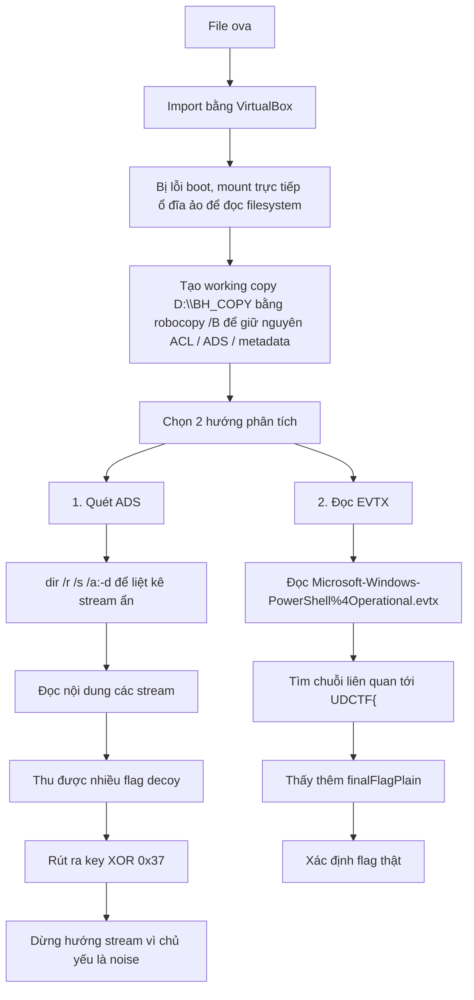

# Challenge Blue Hens Telemetry



## 1. Đầu vào challenge

Đầu vào challenge cho 1 file `.ova`. Khi thử import để mở qua VirtualBox thì không được vì cứ lỗi boot, vì vậy thử mount thẳng trực tiếp ổ đĩa bên trong máy ảo để đọc filesystem. 

### Cách làm

1. **Import file `.ova` vào VirtualBox** để lấy ra file ổ đĩa ảo `.vdi`.
2. **Chuyển file `.vdi` sang `.vhd`** để Windows có thể attach trực tiếp:

```powershell
& "C:\Program Files\Oracle\VirtualBox\VBoxManage.exe" clonemedium disk "C:\Users\admin\.VirtualBox\vm\bluehens-disk1.vdi" "C:\Users\admin\.VirtualBox\vm\bluehens-disk1.vhd" --format VHD
```

Attach file `.vhd` trong Disk Management của Windows. Sau khi attach thành công, Windows nhận ra phân vùng dữ liệu và gán cho nó một ký tự ổ đĩa, trong trường hợp này là `E:`.

### Giải thích

Khi mở ổ đĩa bằng VirtualBox, ta đang **khởi động toàn bộ hệ điều hành Windows bên trong máy ảo**, nên Windows sẽ chạy đầy đủ cơ chế đăng nhập và yêu cầu mật khẩu của tài khoản người dùng. 

Ngược lại, khi mount file ổ đĩa ảo ra một phân vùng như `E:`, hệ điều hành Windows trên máy thật chỉ coi đó là **một ổ dữ liệu NTFS bình thường** và truy cập trực tiếp vào filesystem, chứ không khởi chạy Windows bên trong ổ đó. Vì vậy lúc này sẽ **không xuất hiện màn hình đăng nhập** và cũng không cần mật khẩu tài khoản của máy ảo.



## 2. Tạo working copy trên phân vùng NTFS

Vì ổ `E:` là bản mount của image gốc, đồng thời nhiều artifact quan trọng của bài nằm trong **ACL** và **ADS** nên không phân tích trực tiếp trên ổ này. 

Thay vào đó, copy toàn bộ dữ liệu cần thiết sang một working copy trên phân vùng **NTFS** (`D:\BH_COPY`) bằng `robocopy /B` để giữ nguyên metadata, quyền truy cập và ADS, đồng thời tránh làm thay đổi evidence gốc.

```powershell
# Tạo working copy
New-Item -ItemType Directory -Path 'D:\BH_COPY' -Force | Out-Null

# Copy từ image gốc sang working copy, giữ nguyên ACL/ADS/metadata
robocopy "E:\Users\Public" "D:\BH_COPY\Users\Public" /B /E /COPYALL /DCOPY:DAT /R:0 /W:0 /XJ /NFL /NDL /NP
robocopy "E:\Users\udresearch" "D:\BH_COPY\Users\udresearch" /B /E /COPYALL /DCOPY:DAT /R:0 /W:0 /XJ /NFL /NDL /NP
robocopy "E:\Program Files\Blue Hens Telemetry Update" "D:\BH_COPY\Program Files\Blue Hens Telemetry Update" /B /E /COPYALL /DCOPY:DAT /R:0 /W:0 /XJ /NFL /NDL /NP
robocopy "E:\ProgramData\UDel" "D:\BH_COPY\ProgramData\UDel" /B /E /COPYALL /DCOPY:DAT /R:0 /W:0 /XJ /NFL /NDL /NP
robocopy "E:\ProgramData\UniversityOfDelaware" "D:\BH_COPY\ProgramData\UniversityOfDelaware" /B /E /COPYALL /DCOPY:DAT /R:0 /W:0 /XJ /NFL /NDL /NP
robocopy "E:\Windows\System32\config" "D:\BH_COPY\Windows\System32\config" /B /E /COPYALL /DCOPY:DAT /R:0 /W:0 /XJ /NFL /NDL /NP
robocopy "E:\Windows\System32\winevt\Logs" "D:\BH_COPY\Windows\System32\winevt\Logs" /B /E /COPYALL /DCOPY:DAT /R:0 /W:0 /XJ /NFL /NDL /NP
robocopy "E:\Tools\sqlite3" "D:\BH_COPY\Tools\sqlite3" /B /E /COPYALL /DCOPY:DAT /R:0 /W:0 /XJ /NFL /NDL /NP

robocopy "E:\ProgramData\Microsoft\Windows" "D:\BH_COPY\ProgramData\Microsoft\Windows" bluehen.flag.enc /B /COPYALL /R:0 /W:0 /NFL /NDL /NP
robocopy "E:\Windows\System32" "D:\BH_COPY\Windows\System32" bluehen.flag.enc /B /COPYALL /R:0 /W:0 /NFL /NDL /NP
```

Chỉ copy vài folder/file có thể được gài flag và dễ bị thay đổi.

## 3. Hai hướng phân tích nên thử trước

Vì challenge này liên quan tới **NTFS** nên 2 hướng nên thử trước:

1. Quét tất cả các file có stream ẩn  
2. Đọc các file log `.evtx`

## 4. Quét các file có ADS

Quét các file có ADS:

```powershell
cmd /c 'dir /r /s /a:-d D:\BH_COPY | findstr /c:":$DATA"'
```



Tiếp tục đọc nội dung của các stream.



Có thu được 1 flag nhưng flag này chỉ là decoy.

Tiếp tục decode các đoạn base64 kia thì thu được 1 flag decoy tiếp.



Ở đây thấy được thêm 2 thứ.

Đầu tiên dòng `Nothing useful here. The parking notice stream matters more.` có thể chỉ ra rằng hướng đọc nội dung từ stream là hướng noise, chủ yếu sẽ dẫn ra các flag decoy.

Đồng thời cùng tìm được key xor là `0x37`.

Vậy sau bước này dừng lại tìm ở stream và nhận được key xor.

## 5. Đọc các file log EVTX

Trước tiên do không có file Sysmon nên đọc file `Microsoft-Windows-PowerShell%4Operational.evtx` trước.




```powershell
Get-WinEvent -Path 'D:\BH_COPY\Windows\System32\winevt\Logs\Microsoft-Windows-PowerShell%4Operational.evtx' |
  Format-List TimeCreated, Id, ProviderName, Message
```

Sau khi lưu file ra file `.txt`, tìm các chuỗi liên quan tới flag `UDCTF{`.

Thì thấy được:



Nhưng còn thấy thêm 1 `finalFlagPlain` nữa.



## 6. Flag

Nhưng cuối cùng flag đúng là:

```text
UDCTF{y0u_mu57_b3_r34lly_74l3n73d!}
```

Bựa vl, challenge có 7 cái flag =)))))

## 7. Flow


