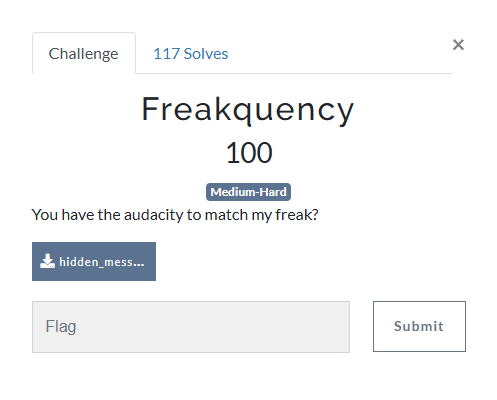
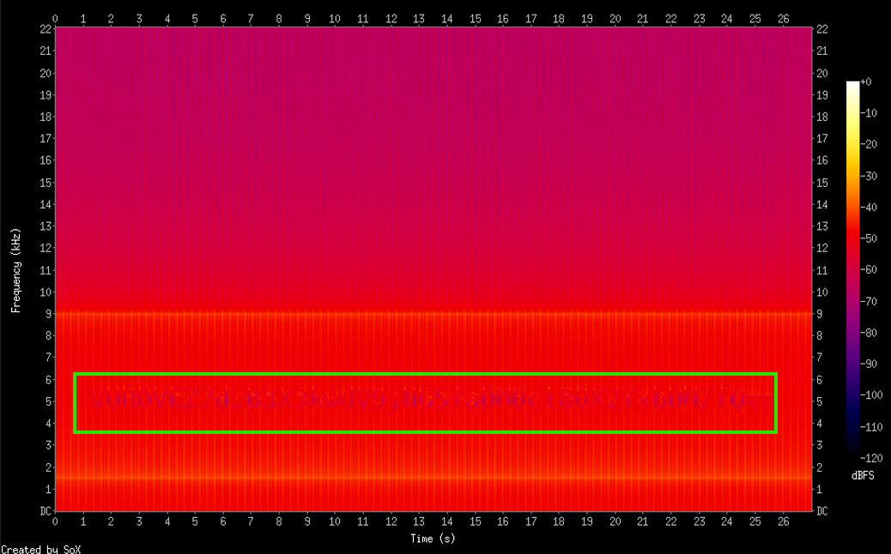
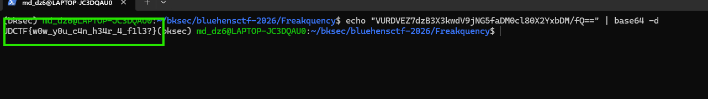
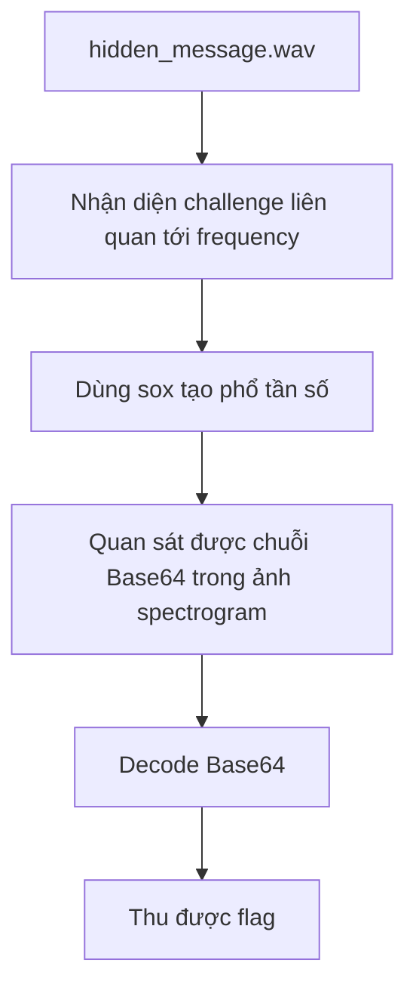

# Challenge Freakquency



## 1. Đầu vào challenge

Đầu vào challenge cung cấp file `wav`.

Từ tên challenge cũng biết bài liên quan đến tần số (`frequency`), khả năng cao flag được giấu trong spectrogram của file âm thanh.

Thử chuyển file âm thanh thành phổ tần số:

```bash
sox hidden_message.wav -n spectrogram -o spec.png
```



## 2. Phân tích kết quả

Nhìn kĩ thấy có 1 dòng chữ cụ thể là:

```text
VURDVEZ7dzB3X3kwdV9jNG5faDM0cl80X2YxbDM/fQ==
```

Đây là chuỗi Base64, decode thì thu được flag là:

```text
UDCTF{w0w_y0u_c4n_h34r_4_f1l3?}
```



## 3. Flag

```text
UDCTF{w0w_y0u_c4n_h34r_4_f1l3?}
```

## 4. Flow


