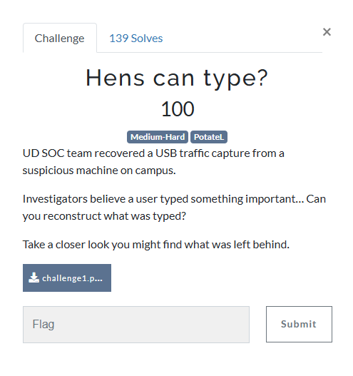
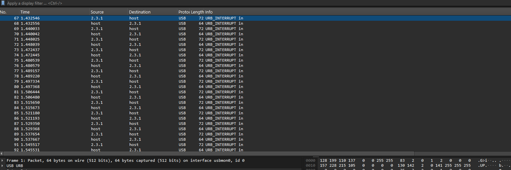
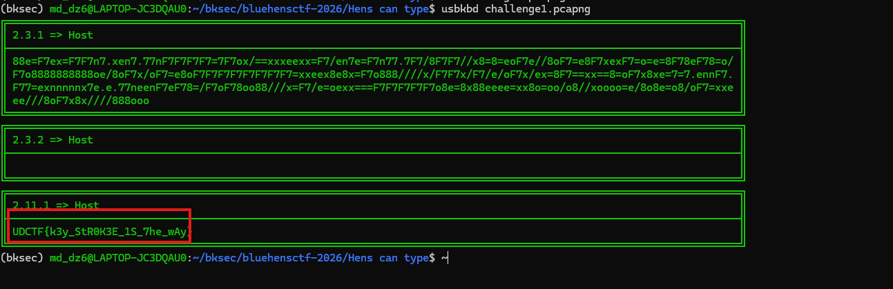
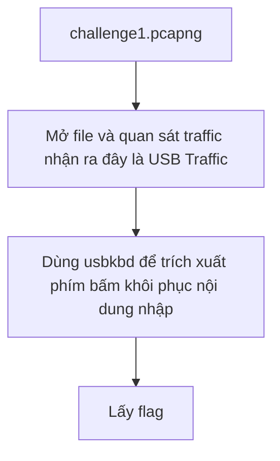

# Challenge Hens can type?



## 1. Đầu vào challenge

Đầu vào challenge cung cấp file `pcapng`.



Nhìn thấy ngay file chỉ chứa các traffic là **USB Traffic** vì vậy challenge thường phân tích dữ liệu **USB HID / keystroke của bàn phím** để lấy được flag.

## 2. Trích xuất phím bấm

Sử dụng tool `usbkbd` để trích xuất các phím bấm từ file `challenge1.pcapng`:

```bash
usbkbd challenge1.pcapng
```

Cuối cùng thu được flag là `UDCTF{k3y_StR0K3E_1S_7he_wAy}`.



## 3. Flag

```text
UDCTF{k3y_StR0K3E_1S_7he_wAy}
```

## 4. Flow


