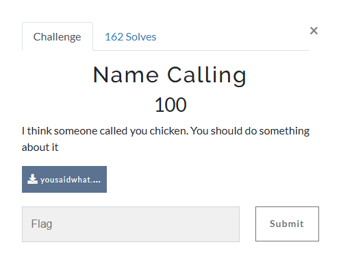
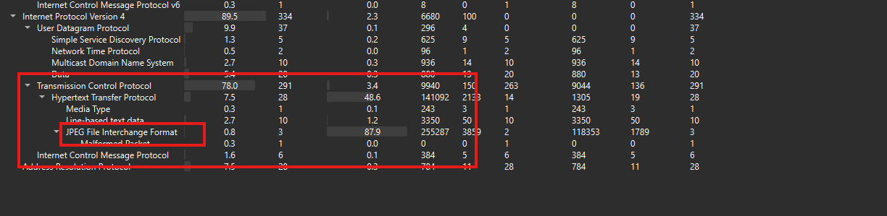
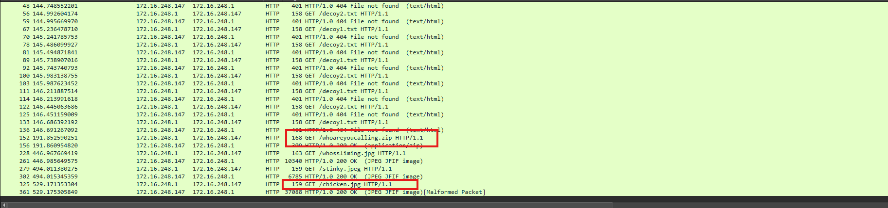
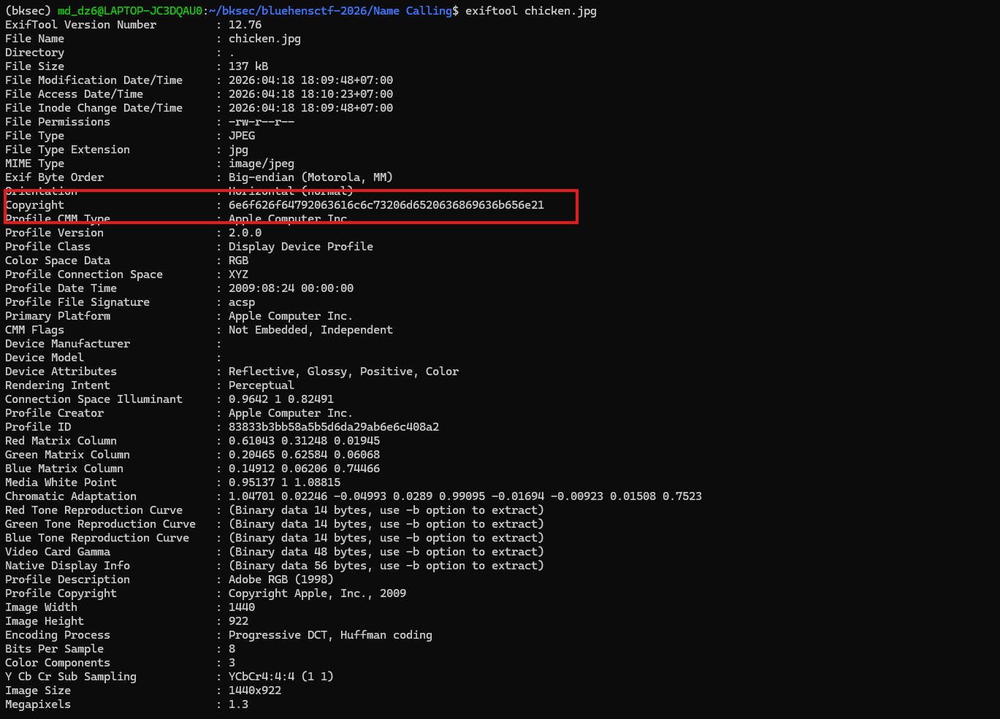
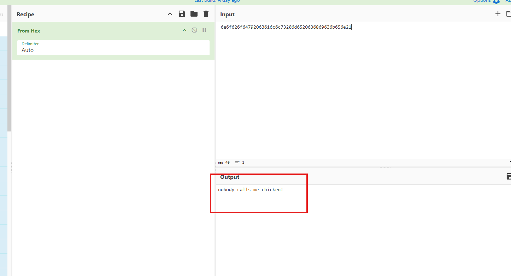
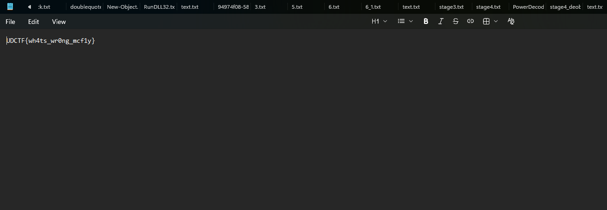
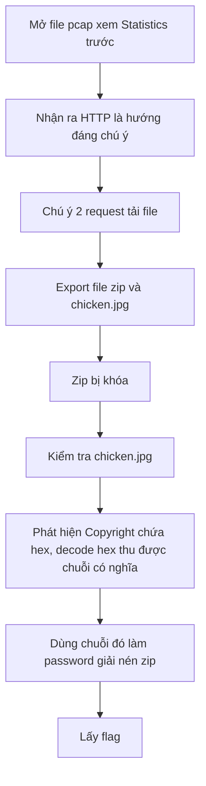

# Challenge Name Calling

## 1. Đầu vào challenge

Đầu vào challenge cung cấp file `pcap`.

Từ statistic thấy hướng tìm kiếm đầu tiên nên là các traffic `http` vì có ảnh `jpeg` nhưng ghi nhận là `malformed`.

Chú ý hơn về 2 request này.

Có các request để tải 1 file `zip`, cũng như lấy 1 ảnh tên là `chicken.jpg`, ảnh này cũng nghi là `malformed` và ở đề bài của challenge cũng gợi ý qua câu “called you chicken”.

## 2. Export các file đáng ngờ

Giờ thử export 2 file đó ra xem thử.

File zip hiện tại đang bị khóa, và khi check file `chicken.jpg` thì thấy được dòng `Copyright` đang chứa hex. Thường `Copyright` của ảnh là text, vì vậy decode thử.

Ra được chuỗi có nghĩa, thử dùng chuỗi này làm password để extract file zip thì thu được flag.

## 3. Flag

Ra được flag là `UDCTF{wh4ts_wr0ng_mcf1y}`.

## 4. Flow

