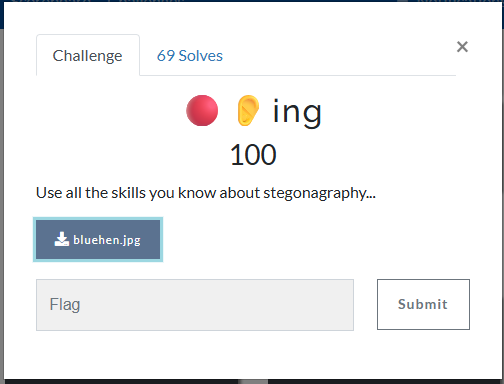
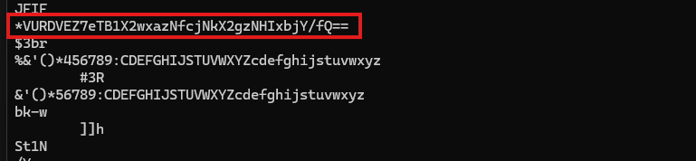
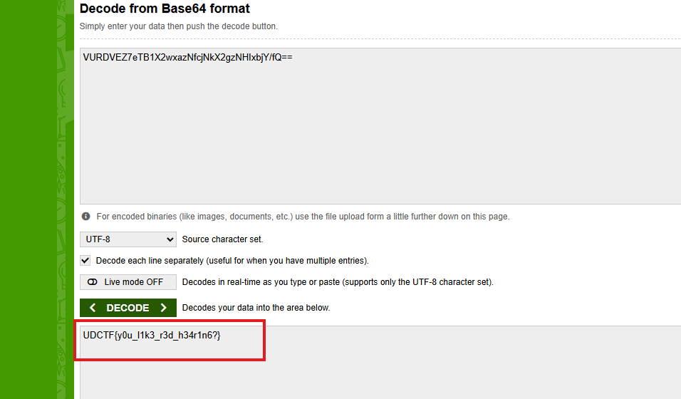
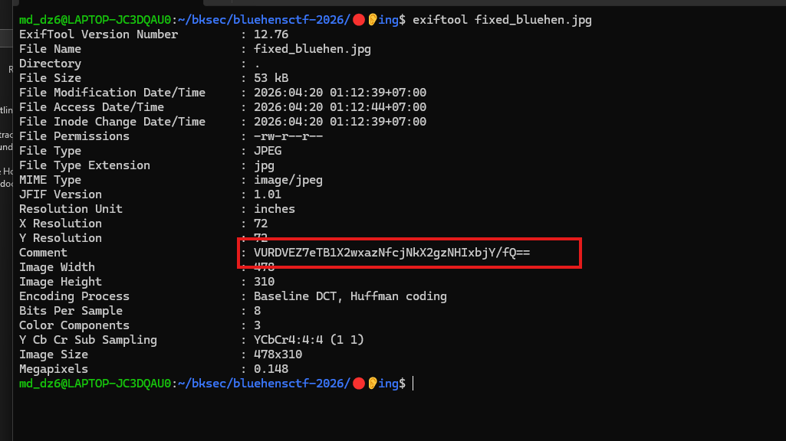
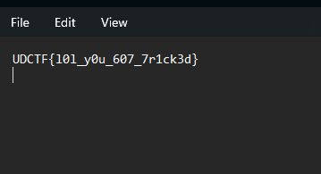
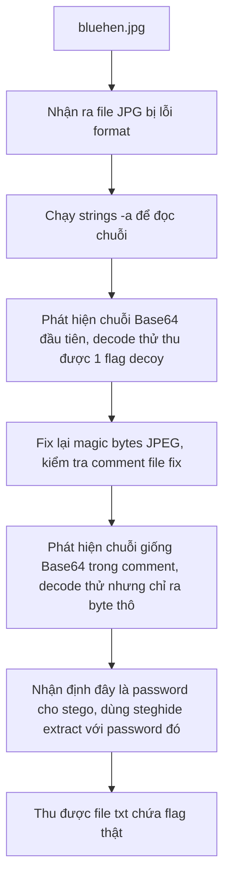

# Challenge 🔴👂ing



## 1. Đầu vào challenge

Đầu vào cho 1 file jpg nhưng đang bị lỗi fomart.

Thử `strings -a bluehen.jpg` xem có chuỗi nào đọc được, phát hiện ra có chuỗi base64.



## 2. Decode chuỗi base64 đầu tiên

Decode thì thu được:



Nhưng flag này là decoy, nên thử fix file ảnh trước.

## 3. Fix lại file JPEG

```bash
printf '\xff\xd8\xff' > fixed_bluehen.jpg && cat bluehen.jpg >> fixed_bluehen.jpg
```

Ghi đúng 3 magic bytes của định dạng JPEG.

Sau khi fix xong check được file này có comment lạ trong data của file.



## 4. Kiểm tra comment và trích xuất stego

Nhìn giống base64 nhưng decode chỉ thu được các byte thô.

Vì vậy nghĩ ngay tới khả năng đây là password dùng để trích xuất stego.

Sử dụng `steghide` để trích xuất dữ liệu ẩn khỏi ảnh JPEG.

```bash
steghide extract -sf fixed_bluehen.jpg -p 'VURDVEZ7eTB1X2wxazNfcjNkX2gzNHIxbjY/fQ=='
```

## 5. Flag

Cuối cùng thu được file txt chứa flag là `UDCTF{l0l_y0u_607_7r1ck3d}`.



## 6. Flow


