# Challenge The click that may have fixed / Autonomous / Ping Pong / Start Me Up

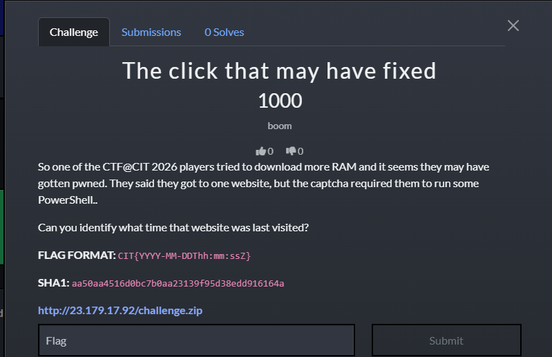

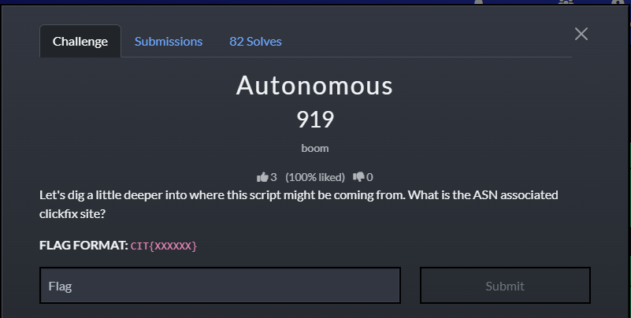


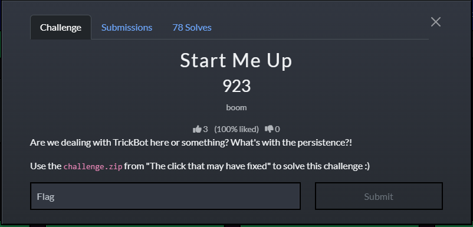

Đây là 4 cụm challenge liên quan tới nhau.

## 1. The click that may have fixed

Với challenge đầu tiên.

Đề cho biết nạn nhân vào một website rồi bị yêu cầu chạy PowerShell như một kiểu “captcha”.
Câu hỏi cần trả lời là:

**Website đó được truy cập lần cuối vào thời điểm nào?**

Vì vậy, hướng đúng là đi tìm artifact lịch sử trình duyệt chứ không phải cố đọc toàn bộ nội dung script trước.

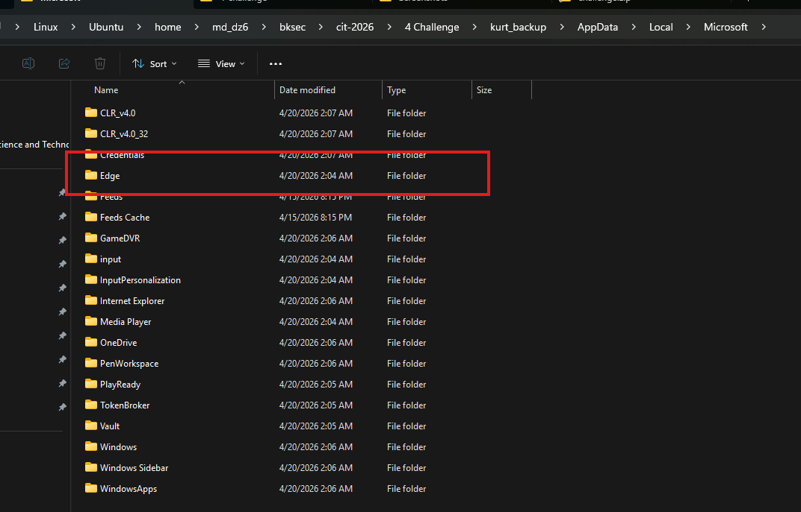

Tìm thấy folder `Edge` ở `kurt_backup\AppData\Local\Microsoft`.

Tiếp tục đào sâu hơn rồi tìm thấy file `History` (SQLite database).

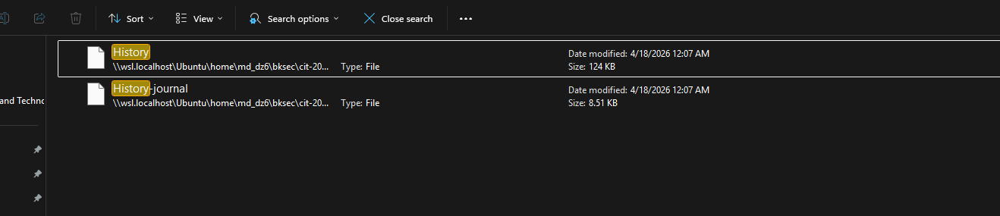

ở `kurt_backup\AppData\Local\Microsoft\Edge\User Data\Default`.

vì vậy sử dụng SQLite để trích xuát dữ liệu. 

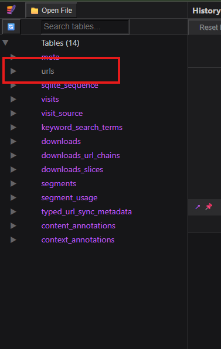

Nhận thấy có bảng `urls`, mà như đề nói cần tìm thời điểm mà user sử dụng web lần cuối, thử xem trong bảng `urls` này có những cột nào.

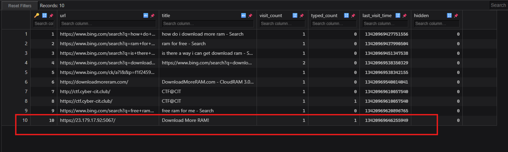

Vậy xác định được url được truy cập cuối cũng như thời gian.

Giờ chỉ cần đổi thời gian từ **WebKit timestamp** sang **UTC datetime** để lấy đúng format của flag.

```python
from datetime import datetime, timedelta, timezone

ts = 13420969646255949
dt = datetime(1601, 1, 1, tzinfo=timezone.utc) + timedelta(microseconds=ts)

print(dt)
print(dt.strftime('%Y-%m-%dT%H:%M:%SZ'))
```

Vậy flag là `CIT{2026-04-18T07:07:26Z}`.

## 2. Autonomous

Tiếp tục challenge 2.

Từ yêu cầu của challenge cũng như đáp án của challenge 1, có thể tìm ASN từ IP mà request cuối cùng gửi tới.

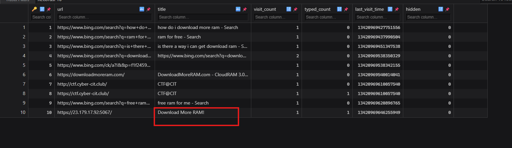

Sau khi tra cứu bằng IP trong url cuối thấy được.

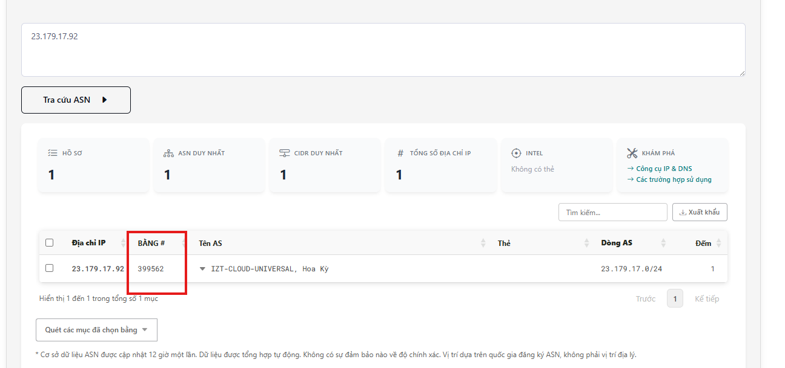

Vậy tra cứu ASN của IP `23.179.17.92` cho kết quả ASN là `399562`.

Flag là `CIT{399562}`.

## 3. Ping Pong

Tiếp tục challenge **Ping Pong**, challenge đề cập trực tiếp tới script PowerShell, vì vậy có thể nghĩ tới việc tìm tới `ConsoleHost_history.txt` ở `AppData\Roaming\Microsoft\Windows\PowerShell\PSReadLine`.

### Kiến thức ngoài lề

Trong PowerShell trên Windows, file lịch sử lệnh interactive thường nằm ở:

```text
%APPDATA%\Microsoft\Windows\PowerShell\PSReadLine\ConsoleHost_history.txt
```

mà `%APPDATA%` chính là:

```text
AppData\Roaming
```

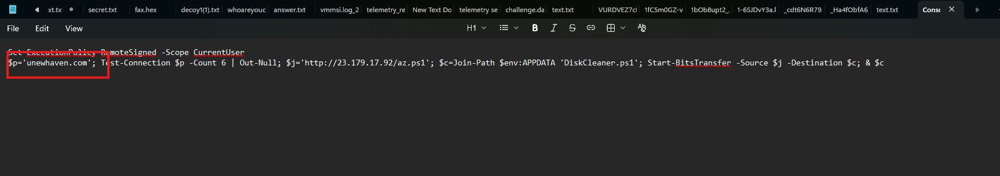

Vậy có thể thấy được trong `ConsoleHost_history.txt` có lệnh:

```powershell
$p='unewhaven.com'; Test-Connection $p -Count 6 | Out-Null; ...
```

Biến `$p` được gán giá trị là `unewhaven.com` và sau đó được đưa vào lệnh `Test-Connection` để ping. Do đó website mà PowerShell script thực hiện ping tới là `unewhaven.com`.

Flag là `CIT{unewhaven.com}`.

## 4. Start Me Up

Tiếp tục challenge **Start Me Up**.

Đề bài nhắc tới từ khóa **persistence**, nên có thể nghĩ ngay tới các cơ chế tự khởi động cùng Windows.
Vị trí rất phổ biến là thư mục `Startup` của user:

```text
AppData\Roaming\Microsoft\Windows\Start Menu\Programs\Startup
```

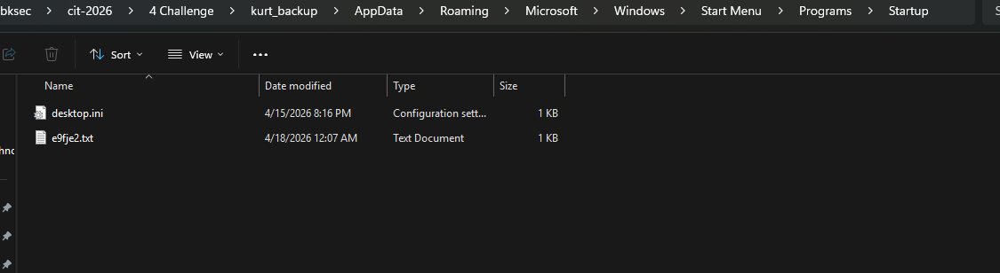

Trong folder này có file `e9fje2.txt` khá lạ, khi mở ra có chuỗi nghi base64.

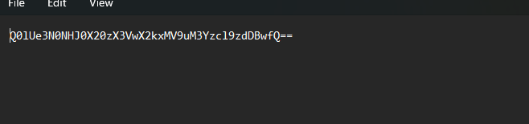

Decode thì thu được flag.

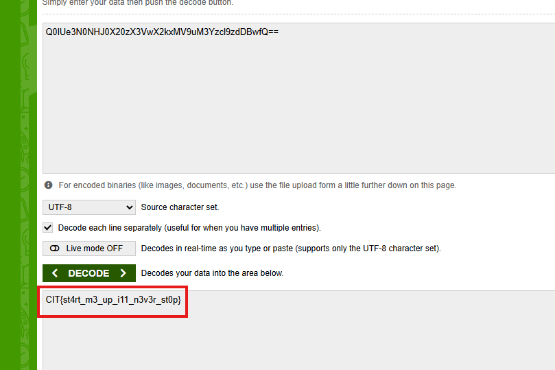

Flag là `CIT{st4rt_m3_up_i11_n3v3r_st0p}`.

## 5. Flow

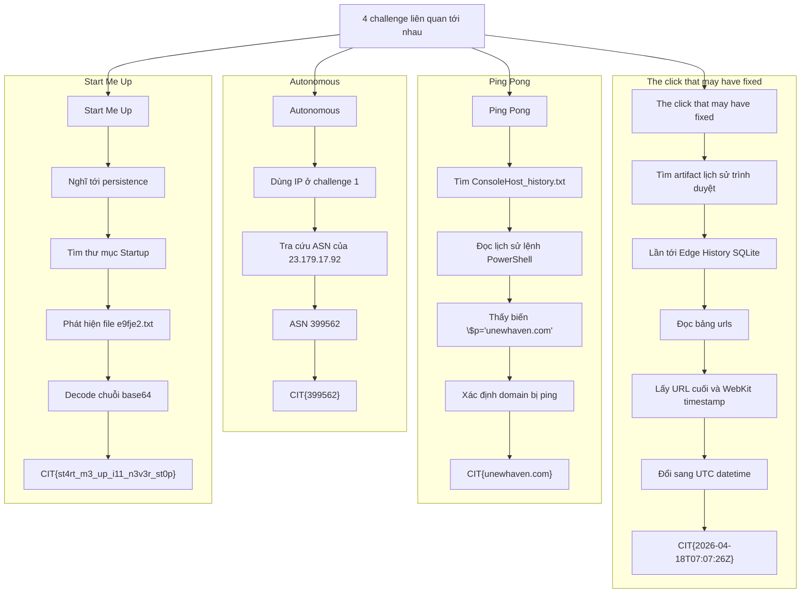
