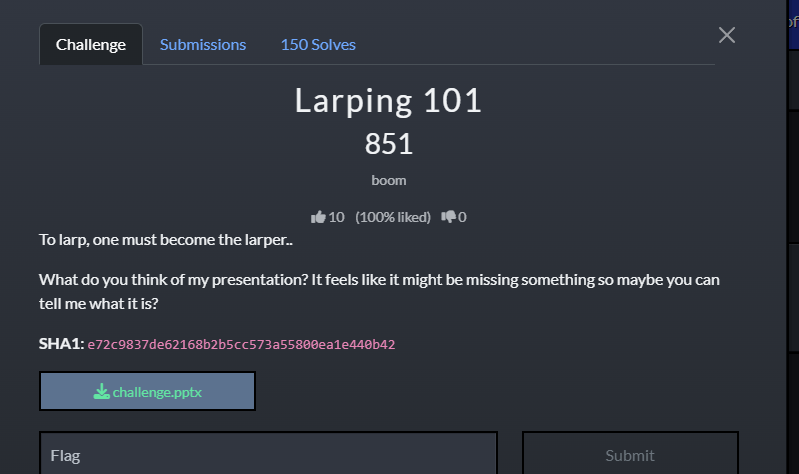
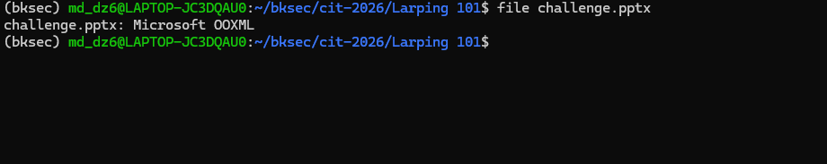
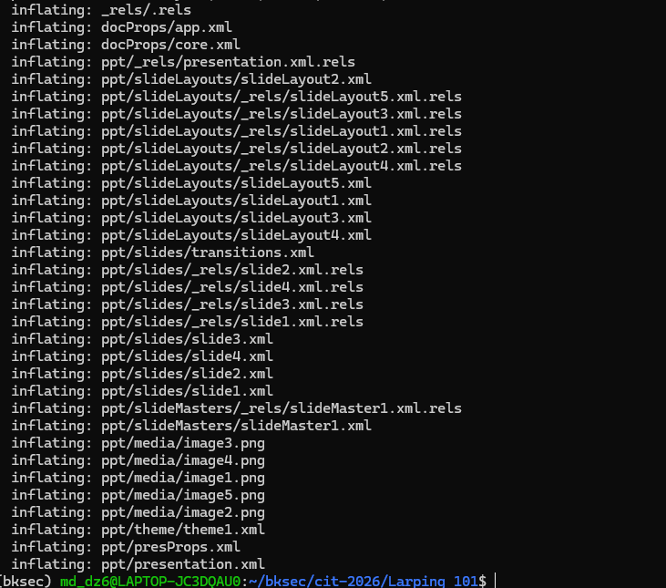
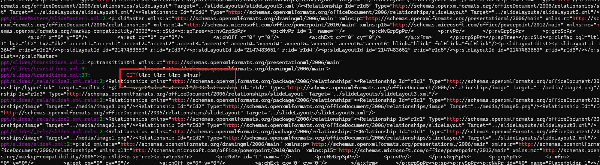
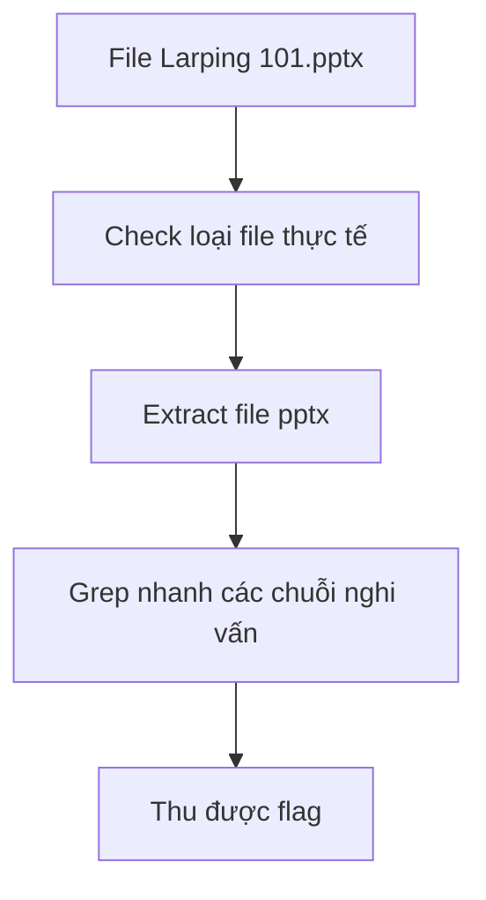

# Challenge Larping 101



## 1. Đầu vào challenge

Đầu vào challenge cung cấp file `pptx`.

## 2. Check thử file này thực sự là gì

Check thử file này thực sự là gì.



## 3. Extract file `pptx`

Thử extract file `pptx` để lấy các file XML ra để xem có điều gì đặc biệt.



## 4. Tìm nhanh các chuỗi nghi vấn

Thấy được rất nhiều file được extract ra, thử grep nhanh các chuỗi nghi vấn:

```bash
grep -RniE 'CIT\{|flag\{|ctf\{|eval|base64|b64decode|rev|http'
```

Thấy được luôn flag là `CIT{l4rp_l4rp_l4rp_s4hur}`.



## 5. Flag

```text
CIT{l4rp_l4rp_l4rp_s4hur}
```

## 6. Flow


