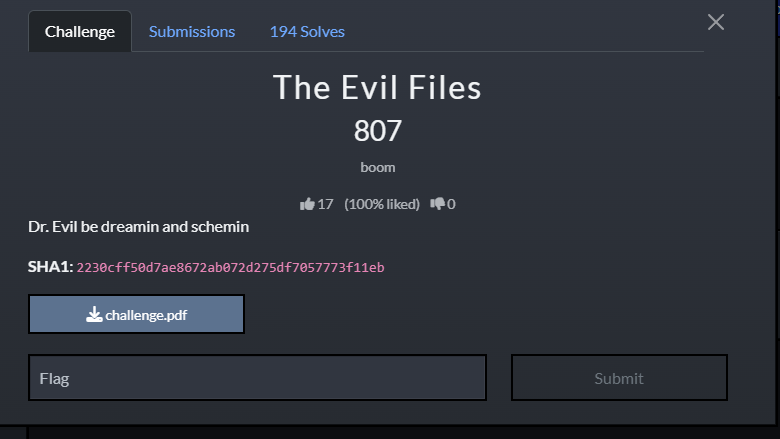
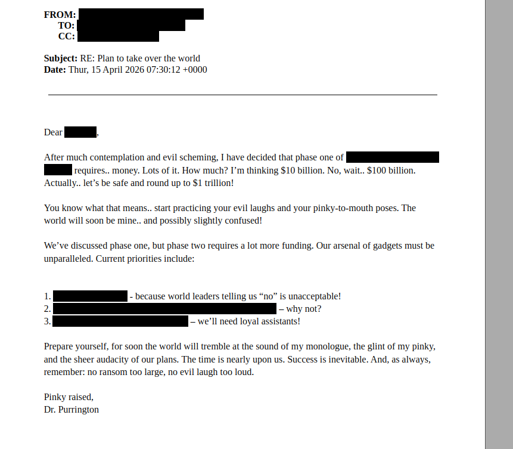
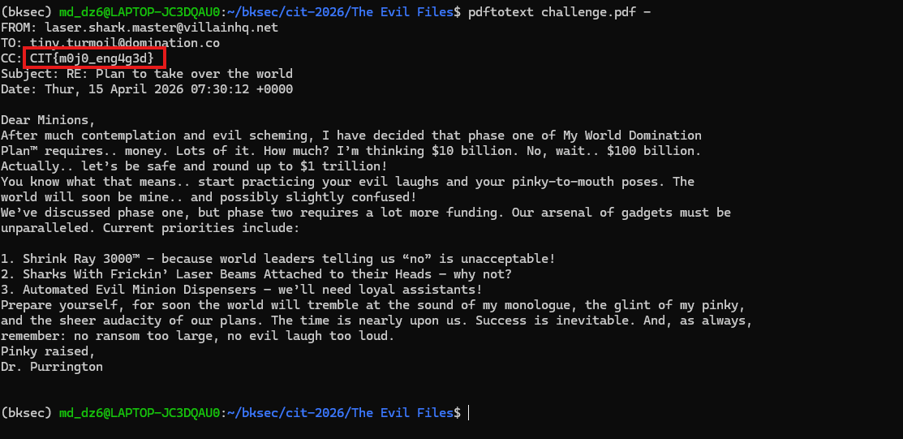
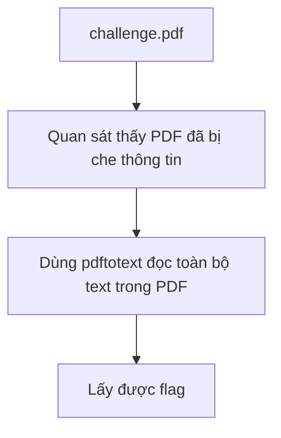

# Challenge The Evil Files



## 1. Đầu vào challenge

Đầu vào challenge cho file `pdf` nhưng hiện đã bị che các thông tin.



## 2. Đọc text ẩn trong PDF

Thử đọc toàn bộ text trong file PDF bằng tool `pdftotext`:

```bash
pdftotext challenge.pdf -
```

Thấy được flag là `CIT{m0j0_eng4g3d}`.

## 3. Flag

```text
CIT{m0j0_eng4g3d}
```



## 4. Flow


