# Challenge Transmission from 1993

## 1. Đầu vào challenge

Đầu vào challenge cho file `pcap`, mở bằng Wireshark và xem mục **Statistics** trước.

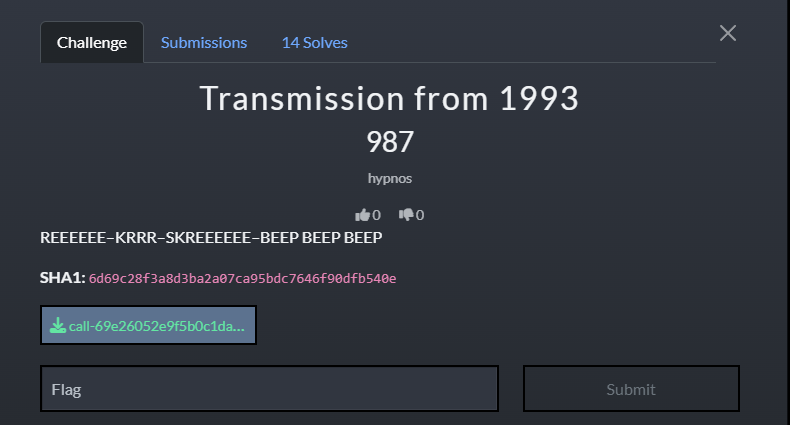

Có `T.38` xuất hiện rõ ràng, nên đây là bài **fax** chứ không chỉ là audio. Vì vậy bước tiếp theo là bám theo **SIP call flow** để chốt thời điểm cuộc gọi chuyển sang chế độ fax rồi dựng lại nội dung đã truyền.

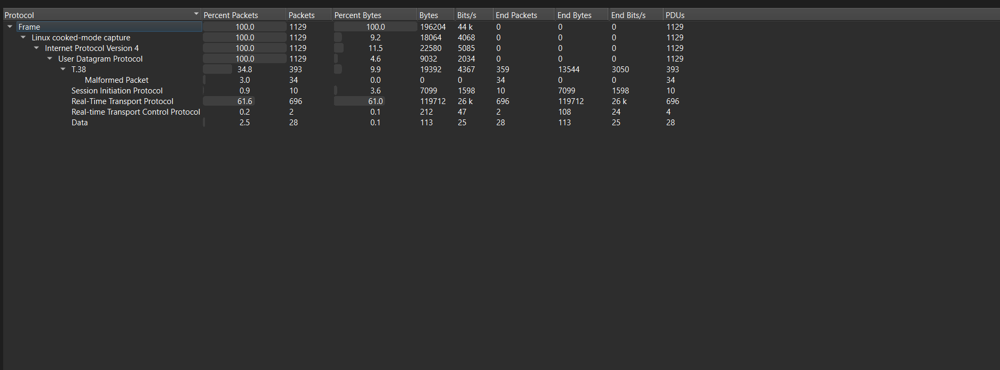

---

## 2. Xác định thời điểm cuộc gọi chuyển sang fax T.38

Sử dụng filter `sip` để xem toàn bộ call flow và xác định packet `re-INVITE` tại thời điểm cuộc gọi chuyển từ audio sang fax `T.38`.

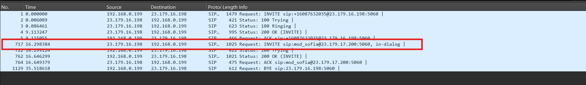

Rồi vào **SIP Call** để xem chi tiết thì thấy được:

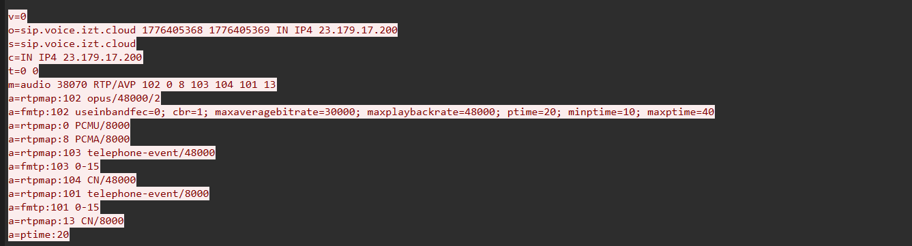

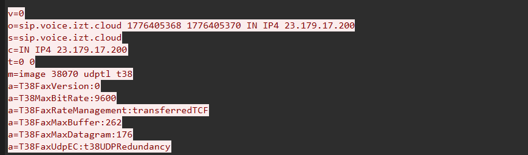

Từ đây có thể thấy luồng ban đầu dùng audio `RTP/AVP` trên port `38070`, nhưng sau đó SDP đã đổi sang:

```text
m=image 38070 udptl t38
```

kèm các tham số `T38FaxVersion:0`, `T38MaxBitRate:9600`, `T38FaxRateManagement:transferredTCF`.

Điều này cho thấy cuộc gọi đã được chuyển sang chế độ truyền fax qua `T.38`, nên hướng điều tra tiếp theo là tập trung vào luồng fax để khôi phục nội dung truyền đi.

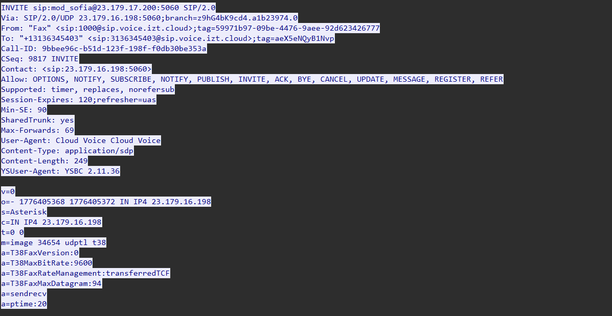

Đồng thời thấy được phía `23.179.16.198` đã gửi `re-INVITE` chuyển cuộc gọi sang:

```text
m=image 34654 udptl t38
```

Tiếp tục dùng filter:

```text
t38 && (udp.port == 34654 || udp.port == 38070)
```

để cô lập riêng luồng fax `T.38` cần phân tích.

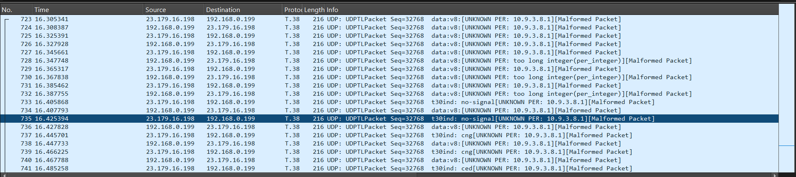

---

## 3. Tách riêng phiên fax cần phân tích

Sau đó export toàn bộ displayed packets ra file `fax.pcap` chứa riêng phiên fax `T.38` cần phân tích.

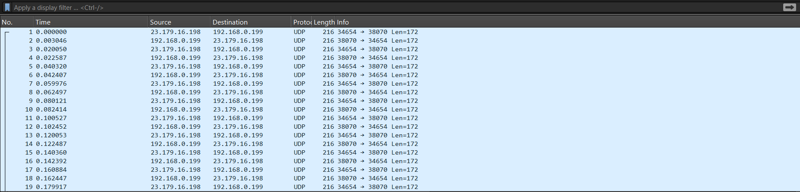

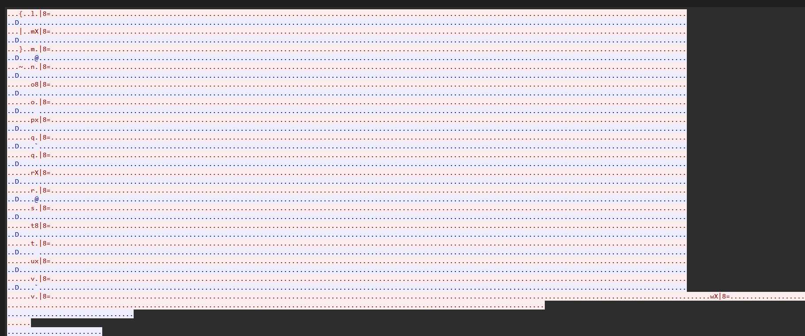

Các nội dung này đang ở dạng dữ liệu thô/binary của phiên fax, chưa thể đọc trực tiếp thành văn bản nên cần khôi phục nội dung fax thực sự.

---

## 4. Lấy payload fax từ phiên T.38

Sử dụng 2 script để lấy payload fax từ `fax.pcap` rồi giải mã thành ảnh fax.

### Script 1: parse `fax.pcap` và trích payload ra `payload.bin`

```python
import struct
import socket
import sys

PCAP = sys.argv[1] if len(sys.argv) > 1 else 'fax.pcap'
OUT = sys.argv[2] if len(sys.argv) > 2 else 'payload.bin'

rev_table = bytes(int(f'{i:08b}'[::-1], 2) for i in range(256))

def revbits_bytes(b: bytes) -> bytes:
    return bytes(rev_table[x] for x in b)

def decode_length(buf: bytes, idx: int):
    b = buf[idx]
    if (b & 0x80) == 0:
        return b, idx + 1
    if (b & 0x40) == 0:
        return ((b & 0x3F) << 8) | buf[idx + 1], idx + 2
    raise ValueError('fragmented length unsupported')

def decode_open_type(buf: bytes, idx: int):
    n, idx = decode_length(buf, idx)
    return buf[idx:idx + n], idx + n

def parse_udptl(buf: bytes):
    seq = (buf[0] << 8) | buf[1]
    primary, idx = decode_open_type(buf, 2)
    return seq, primary, buf[idx:]

def parse_vendor_v29_primary(prim: bytes):
    assert prim[0] == 0xC8
    pos = 2
    elems = []

    if pos < len(prim):
        tag = prim[pos]
        if tag in (0x80, 0xE0, 0xF0, 0xC0):
            pos += 1
            if pos + 2 > len(prim):
                return elems, pos
            n = (prim[pos] << 8 | prim[pos + 1]) + 1
            pos += 2
            dat = prim[pos:pos + n]
            pos += n
            typ = {0x80: 'hdlc-data', 0xE0: 'ext12', 0xF0: 'ext14', 0xC0: 'ext?'}[tag]
            elems.append((typ, dat))
        elif tag in (0x20, 0x28):
            pos += 1
            elems.append(({0x20: 'ok-end', 0x28: 'bad-end'}[tag], b''))

    while pos < len(prim):
        tag = prim[pos]
        if tag in (0x20, 0x28):
            elems.append(({0x20: 'ok-end', 0x28: 'bad-end'}[tag], b''))
            pos += 1
        else:
            if pos + 2 > len(prim):
                break
            n = (prim[pos] << 8 | prim[pos + 1]) + 1
            pos += 2
            dat = prim[pos:pos + n]
            pos += n
            elems.append(('hdlc-data', dat))
    return elems, pos

def read_udp_packets(pcap_path: str):
    data = open(pcap_path, 'rb').read()
    if data[:4] != b'\xd4\xc3\xb2\xa1':
        raise ValueError('Expected little-endian pcap')
    off = 24
    packets = []
    while off + 16 <= len(data):
        ts_sec, ts_usec, incl_len, orig_len = struct.unpack_from('<IIII', data, off)
        off += 16
        pkt = data[off:off + incl_len]
        off += incl_len
        if len(pkt) < 16 + 20:
            continue
        if struct.unpack('!H', pkt[14:16])[0] != 0x0800:
            continue
        ip = pkt[16:]
        ihl = (ip[0] & 0x0F) * 4
        if ip[9] != 17 or len(ip) < ihl + 8:
            continue
        src = socket.inet_ntoa(ip[12:16])
        dst = socket.inet_ntoa(ip[16:20])
        up = ip[ihl:]
        sport, dport, ulen, _ = struct.unpack('!HHHH', up[:8])
        payload = up[8:ulen] if ulen <= len(up) else up[8:]
        packets.append((src, sport, dst, dport, payload))
    return packets

def main():
    udp_packets = read_udp_packets(PCAP)
    fax_packets = []
    for src, sport, dst, dport, payload in udp_packets:
        if {sport, dport} == {34654, 38070} and payload and payload[0] == 0x00:
            seq, prim, _ = parse_udptl(payload)
            fax_packets.append((src, sport, dst, dport, seq, prim))
    seen = {}
    for src, sport, dst, dport, seq, prim in fax_packets:
        if sport == 38070 and dport == 34654 and seq not in seen:
            seen[seq] = prim

    local = [(seq, seen[seq]) for seq in sorted(seen)]

    frames = []
    cur = b''
    start = None

    for seq, prim in local:
        if seq < 79 or seq > 112:
            continue
        if not prim or prim[0] != 0xC8:
            continue
        elems, _ = parse_vendor_v29_primary(prim)
        for typ, dat in elems:
            if typ == 'hdlc-data':
                if start is None:
                    start = seq
                cur += dat
            elif typ in ('bad-end', 'ok-end'):
                frames.append({'start': start, 'end_seq': seq, 'end': typ, 'data': cur})
                cur = b''
                start = None

    if len(frames) < 8:
        raise RuntimeError(f'Not enough reconstructed frames: {len(frames)}')

    clean = b''.join(revbits_bytes(f['data'])[4:] for f in frames[:8])
    with open(OUT, 'wb') as f:
        f.write(clean)

    print(f'Wrote {len(clean)} bytes to {OUT}')
    for i, f in enumerate(frames[:8]):
        print(i, f['start'], f['end_seq'], f['end'], len(f['data']))

if __name__ == '__main__':
    main()
```

Script Python này dùng để parse file `fax.pcap`, xác định các packet thuộc phiên fax `T.38`, ghép lại phần payload liên quan đến dữ liệu trang fax, sau đó ghi ra file trung gian `payload.bin`.

### Script 2: giải mã `payload.bin` bằng `libjbig`

```c
#include <stdio.h>
#include <stdlib.h>
#include <jbig.h>

int main(int argc, char **argv) {
    if (argc < 3) {
        fprintf(stderr, "usage: %s input.bin out.pbm\n", argv[0]);
        return 1;
    }

    FILE *f = fopen(argv[1], "rb");
    if (!f) {
        perror("fopen in");
        return 1;
    }

    fseek(f, 0, SEEK_END);
    long len = ftell(f);
    fseek(f, 0, SEEK_SET);

    unsigned char *buf = malloc(len);
    fread(buf, 1, len, f);
    fclose(f);

    struct jbg_dec_state s;
    jbg_dec_init(&s);
    jbg_dec_maxsize(&s, 10000, 10000);

    size_t cnt = 0;
    int rc = jbg_dec_in(&s, buf, len, &cnt);
    fprintf(stderr,
            "rc=%d consumed=%zu/%ld err=%s width=%lu height=%lu planes=%d size=%lu\n",
            rc, cnt, len, jbg_strerror(rc), jbg_dec_getwidth(&s),
            jbg_dec_getheight(&s), jbg_dec_getplanes(&s), jbg_dec_getsize(&s));

    if (rc != JBG_EOK && rc != JBG_EOK_INTR) {
        jbg_dec_free(&s);
        free(buf);
        return 2;
    }

    unsigned long w = jbg_dec_getwidth(&s);
    unsigned long h = jbg_dec_getheight(&s);
    unsigned long sz = jbg_dec_getsize(&s);
    unsigned char *img = jbg_dec_getimage(&s, 0);

    FILE *o = fopen(argv[2], "wb");
    if (!o) {
        perror("fopen out");
        return 1;
    }

    fprintf(o, "P4\n%lu %lu\n", w, h);
    fwrite(img, 1, sz, o);
    fclose(o);

    jbg_dec_free(&s);
    free(buf);
    return 0;
}
```

Script C này để đọc file `payload.bin` và dùng thư viện `libjbig` để giải mã dữ liệu `JBIG` bên trong, từ đó khôi phục ảnh fax.

---

## 5. Khôi phục ảnh fax và lấy flag

Sau khi chạy và thu được file `payload.pbm`, có thể xác nhận dữ liệu `JBIG` đã được giải mã thành công thành một ảnh fax. Tuy nhiên đây là PBM thô nên xem trực tiếp được. Sử dụng các dịch vụ mở file `.pbm`, hoặc convert sang ảnh `.png` để xem nội dung thì thu được flag:

```text
CIT{fL3x_Y0ur_F4xiNG}
```

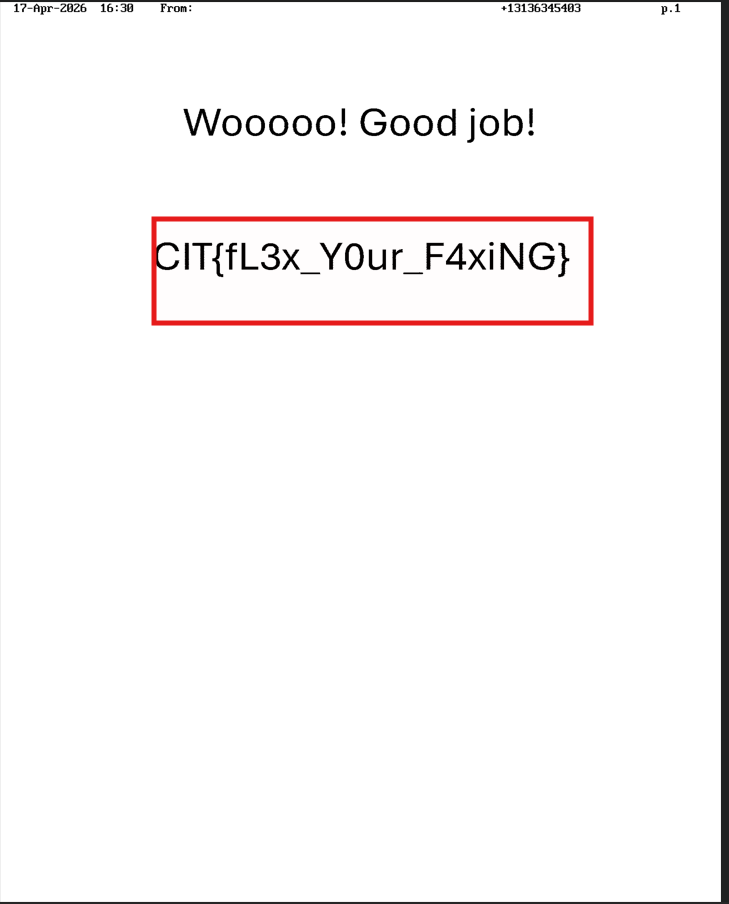

---

## 6. Flow

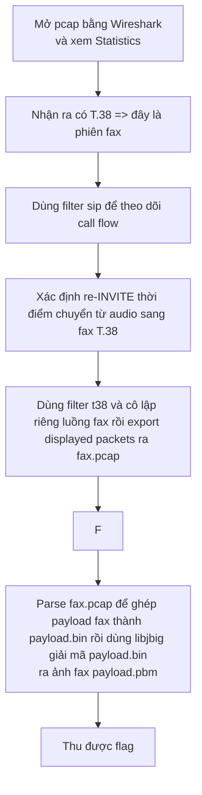
