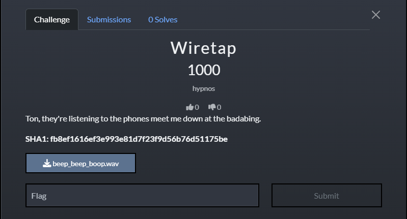
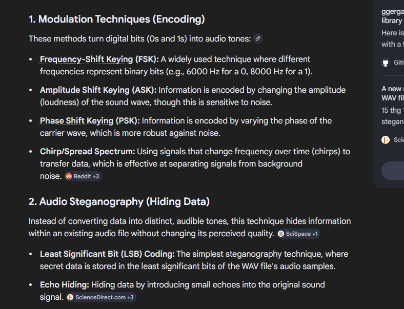
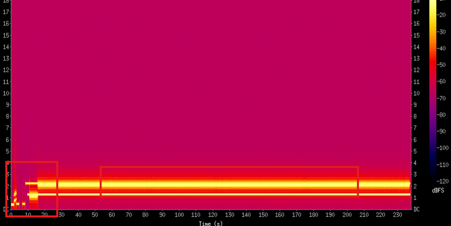
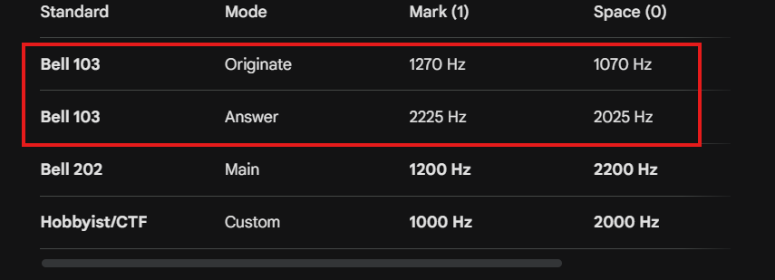
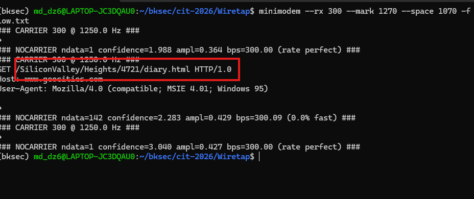
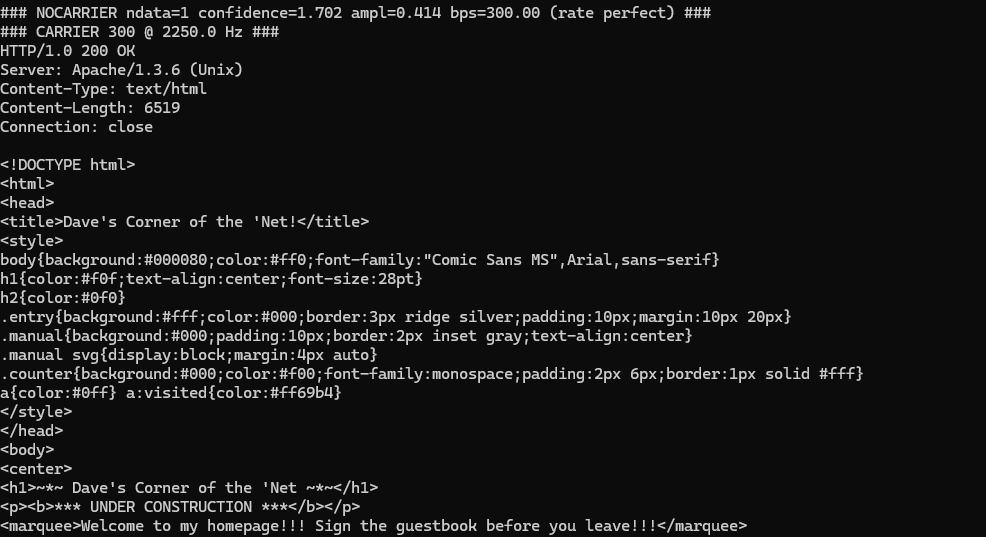
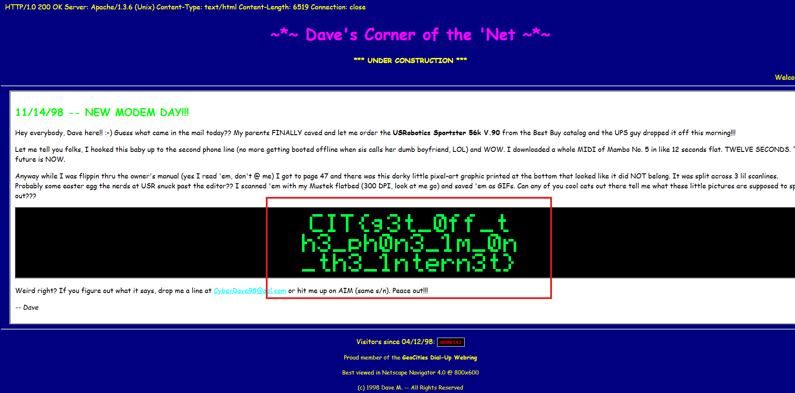
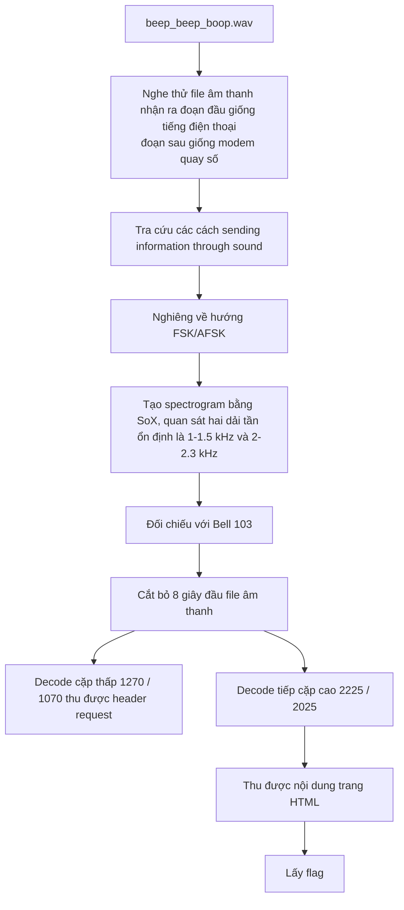

# Challenge Wiretap



## 1. Đầu vào challenge

Đầu vào challenge cung cấp file `wav`, nghe thử thì thấy đoạn đầu giống tiếng điện thoại, đoạn sau giống tiếng modem quay số.

Vậy có thể là dữ liệu được truyền qua đường điện thoại.

Thử tra cứu một vài cách **sending information through sound**.



Vì file âm thanh chứa các tiếng beep/tone và phần sau nghe giống tín hiệu modem truyền dữ liệu, nên nghiêng về hướng dữ liệu được encode trực tiếp thành âm thanh, cụ thể là **FSK/AFSK** hơn là audio steganography kiểu LSB.

## 2. Kiểm tra spectrogram

Thử kiểm tra spectrogram để kiểm chứng:

```bash
sox beep_beep_boop.wav -n spectrogram -o spec.png
```



Từ biểu đồ thấy được:

- Vùng đầu của file có tín hiệu ngắn, thay đổi nhiều và chưa ổn định. Đây có thể là đoạn beep mở đầu trước khi truyền dữ liệu.
- Vùng ở giữa cho thấy sau đó tín hiệu trở nên rất ổn định, gần như chỉ còn hai dải tần nổi bật kéo dài liên tục. Đây là dấu hiệu dữ liệu được truyền bằng âm thanh.

Vậy giờ cần thử decode file bằng modem decoder với các tham số tần số phù hợp, từ biểu đồ cũng thấy được dải tần số ổn định nằm loanh quanh ở `1 -> 1.5 kHz` và `2 -> 2.3 kHz`.



Sau khi tra thêm thấy được modem **Bell 103** là modem phù hợp do các cặp tần số của chuẩn này khá khớp với những dải tần quan sát được trên spectrogram.

## 3. Thử decode theo Bell 103

Cắt bỏ `8s` đầu vào của sound:

```bash
sox beep_beep_boop.wav modem.wav trim 8
```

Tiếp tục thử decode cặp thấp dựa vào dải gốc đã tìm kiếm được:

```bash
minimodem --rx 300 --mark 1270 --space 1070 -f modem.wav | tee low.txt
```



Thấy được sau khi decode nhận được header của request, nhưng chưa thấy nội dung gì thêm.

Tiếp tục thử decode cặp cao dựa vào dải gốc đã tìm kiếm được:

```bash
minimodem --rx 300 --mark 2225 --space 2025 -f modem.wav | tee high.txt
```



Thu được nội dung của trang html, thử đổi đuôi file rồi mở xem có gì đặc biệt thì thu được flag.

## 4. Flag

Cuối cùng thu được flag là:

```text
CIT{g3t_0ff_th3_ph0n3_1m_0n_th3_1ntern3t}
```



## 5. Flow


