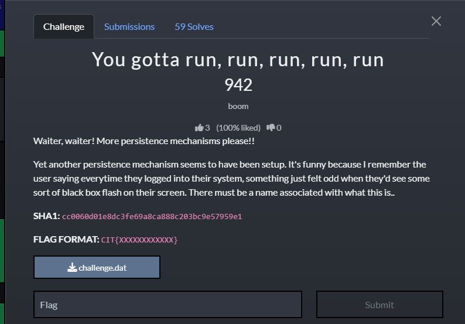
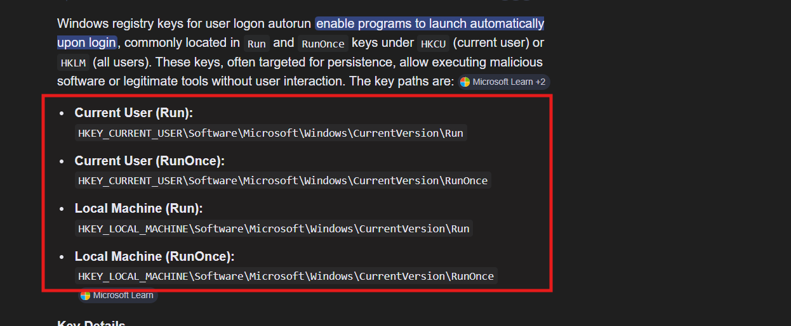
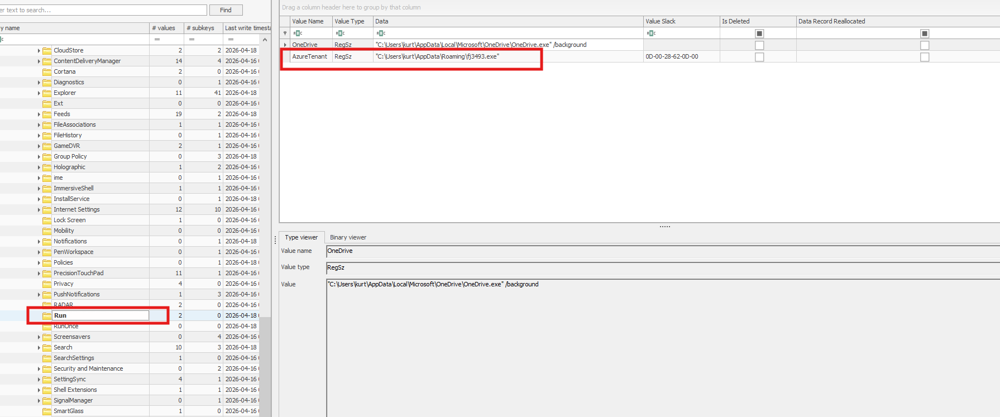
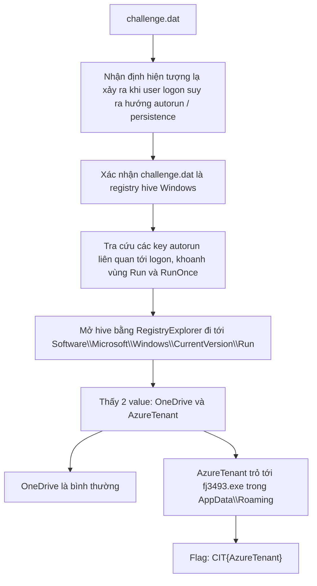

# Challenge You gotta run, run, run, run, run

## 1. Đầu vào challenge

Challenge cung cấp file `challenge.dat`.

Ngay từ đề bài challenge đã nhắc tới việc mỗi lần user đăng nhập lại thấy hiện tượng bất thường, nên có thể suy ra đây nhiều khả năng là một cơ chế **autorun / persistence** chạy tại thời điểm logon.



Đồng thời sau khi check file `challenge.dat`, xác nhận đây là file **registry hive** của Windows.

---

## 2. Khoanh vùng các key autorun liên quan tới logon

Sau khi tra cứu về các Windows registry keys liên quan tới user logon autorun, có thể thấy nhóm key đáng chú ý là:

- `Software\Microsoft\Windows\CurrentVersion\Run`
- `Software\Microsoft\Windows\CurrentVersion\RunOnce`

Đây là các vị trí rất phổ biến để malware hoặc persistence thêm entry tự chạy mỗi khi user đăng nhập.



---

## 3. Mở hive và kiểm tra key Run

Sử dụng `RegistryExplorer.exe` để mở file hive registry và tìm tới:

```text
Software\Microsoft\Windows\CurrentVersion\Run
```



Thấy được trong key này có 2 value là `OneDrive` và `AzureTenant`.

Trong đó:

- `OneDrive` là entry bình thường của hệ thống
- `AzureTenant` trỏ tới file thực thi đáng ngờ:

```text
C:\Users\kurt\AppData\Roaming\fj3493.exe
```

Vì vậy có thể kết luận `AzureTenant` chính là entry autorun bất thường mà challenge muốn tìm.

---

## 4. Flag

```text
CIT{AzureTenant}
```

---

## 5. Flow


