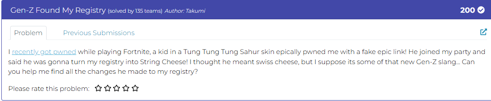
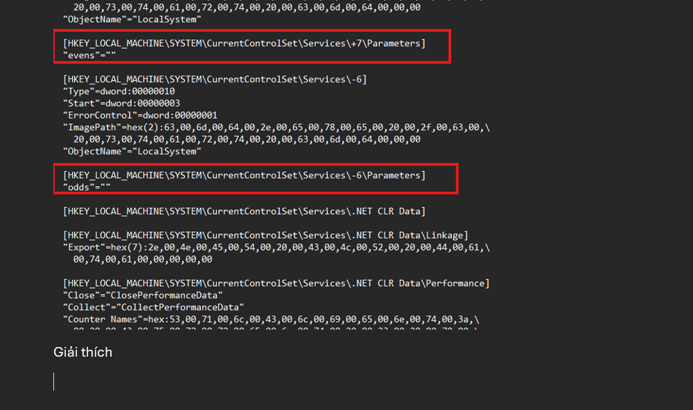
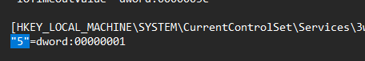
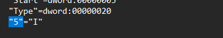
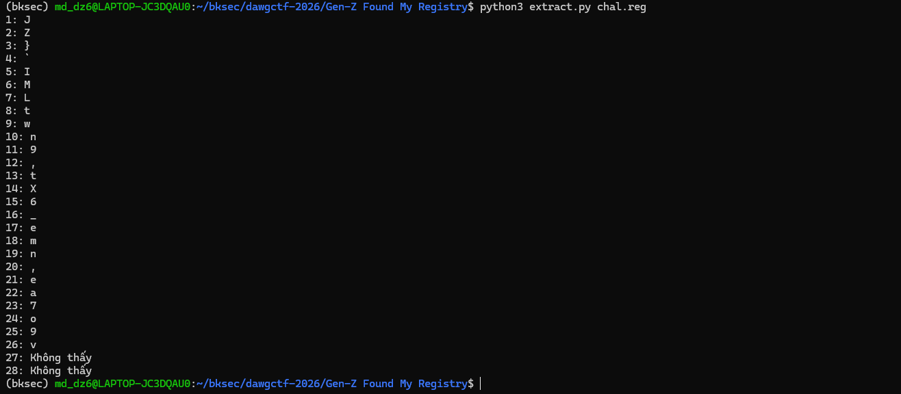
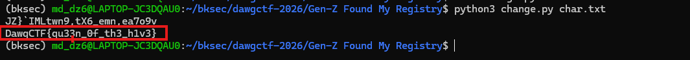

# Challenge Gen-Z Found My Registry



## 1. Đầu vào challenge

Đầu vào challenge cho 1 file `chal.reg`. Mở file ngay ở đầu thấy được 2 dòng hint.



```reg
[HKEY_LOCAL_MACHINE\SYSTEM\CurrentControlSet\Services\-6\Parameters]
"odds"=""
```

### Giải thích

- `Services\-6` là một service.
- Trong `Parameters` lại có value tên là `odds`.
- Có thể đoán rằng các ký tự ở vị trí lẻ dịch lùi `6` ký tự theo ASCII.

Tương tự với:

```reg
[HKEY_LOCAL_MACHINE\SYSTEM\CurrentControlSet\Services\+7\Parameters]
"evens"=""
```

thì các ký tự ở vị trí chẵn dịch tiến `7` ký tự theo ASCII.

Sau khi đọc một lúc thấy được có các value của `5`, nhưng trong đó chỉ có một trường hợp là:

```reg
"5"="I"
```





Mà như đã nghi ngờ là các kí tự được dịch tiến/lùi dựa vào tính chẵn lẻ của vị trí.

## 2. Extract các ký tự từ file registry

Vì vậy thử sử dụng script để extract.

```python
import re
import sys

if len(sys.argv) != 2:
    print("Usage: python3 extract_reg_chars.py chal.reg")
    sys.exit(1)

path = sys.argv[1]

data = open(path, "rb").read()
try:
    text = data.decode("utf-16le")
except UnicodeDecodeError:
    text = data.decode("utf-8", errors="ignore")

pattern = re.compile(r'^"(\d+)"="(.)"\s*$', re.MULTILINE)
found = {}

for m in pattern.finditer(text):
    idx = int(m.group(1))
    ch = m.group(2)
    if len(ch) == 1:
        found.setdefault(idx, []).append(ch)

result = []
miss = 0
i = 1

while True:
    if i in found:
        chars = found[i]

        if len(chars) > 1:
            print(f"Vị trí {i} có nhiều ký tự 1-char: {chars}")

        ch = chars[0]
        print(f"{i}: {ch}")
        result.append(ch)

        miss = 0
    else:
        print(f"{i}: không thấy")
        miss += 1
        if miss >= 2:
            break

    i += 1
```

### Giải thích script

- Đọc nội dung file `chal.reg` rồi tìm dòng có dạng `"số"="1 ký tự"`.
- Bỏ qua các dòng cùng tên số nhưng không phải ký tự.
- Lưu ký tự theo số thứ tự tương ứng cho đến khi không thấy 2 số liên tiếp thì dừng.

Sau khi chạy xong thu được:



## 3. Obfuscate theo quy tắc chẵn lẻ

Tiếp tục sử dụng script để dịch các ký tự theo quy tắc:

- vị trí chẵn dịch tiến `7` ký tự
- vị trí lẻ dịch lùi `6` ký tự

```python
import sys

if len(sys.argv) != 2:
    sys.exit(1)

path = sys.argv[1]

chars = {}

with open(path, "r", encoding="utf-8") as f:
    for line in f:
        if ":" not in line:
            continue

        idx, ch = line.strip().split(":", 1)
        idx = int(idx.strip())
        ch = ch.strip()

        if len(ch) == 1:
            chars[idx] = ch

obfuscate = "".join(chars[i] for i in sorted(chars))

deobfuscate = []
for pos, ch in enumerate(obfuscate, start=1):
    if pos % 2 == 1:
        deobfuscate.append(chr(ord(ch) - 6))
    else:
        deobfuscate.append(chr(ord(ch) + 7))

print(obfuscate)
print("".join(deobfuscate))
```

## 4. Flag

Cuối cùng thu được flag là:

```text
DawgCTF{qu33n_0f_th3_h1v3}
```



## 5. Flow

```text
chal.reg
   |
   v
mở file registry và đọc các hint ở đầu file
   |
   v
thấy Services\\-6\\Parameters với value odds
   |
   v
suy ra ký tự ở vị trí lẻ dịch lùi 6 ký tự ASCII
   |
   v
thấy Services\\+7\\Parameters với value evens
   |
   v
suy ra ký tự ở vị trí chẵn dịch tiến 7 ký tự ASCII
   |
   v
đọc các value dạng "số"="ký tự"
   |
   v
lọc bỏ các value không phải 1 ký tự
   |
   v
ghép ký tự theo thứ tự vị trí 1, 2, 3, ...
   |
   v
chạy script decode theo quy tắc chẵn/lẻ
   |
   v
thu được flag
```
---