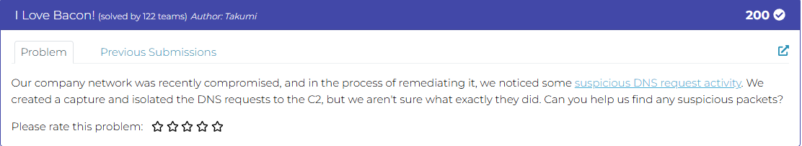
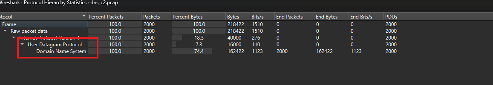
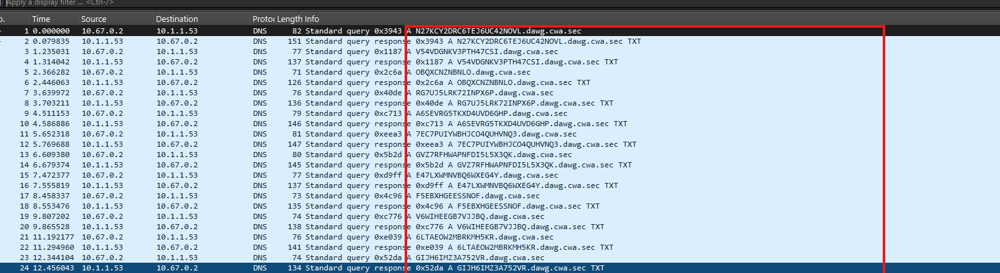
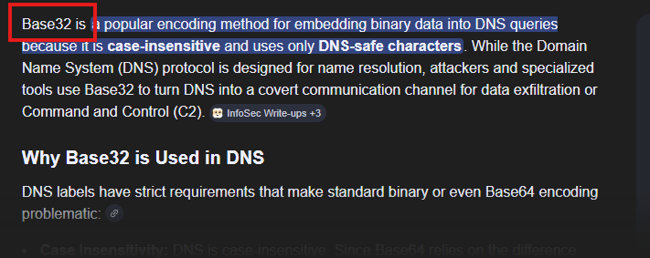
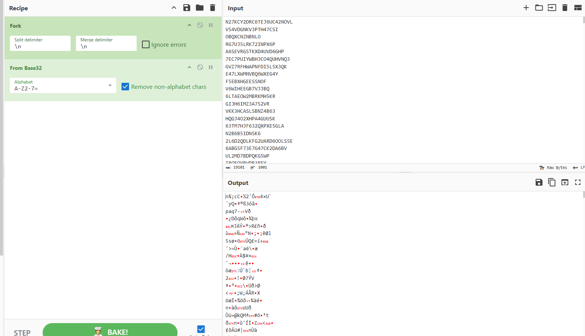
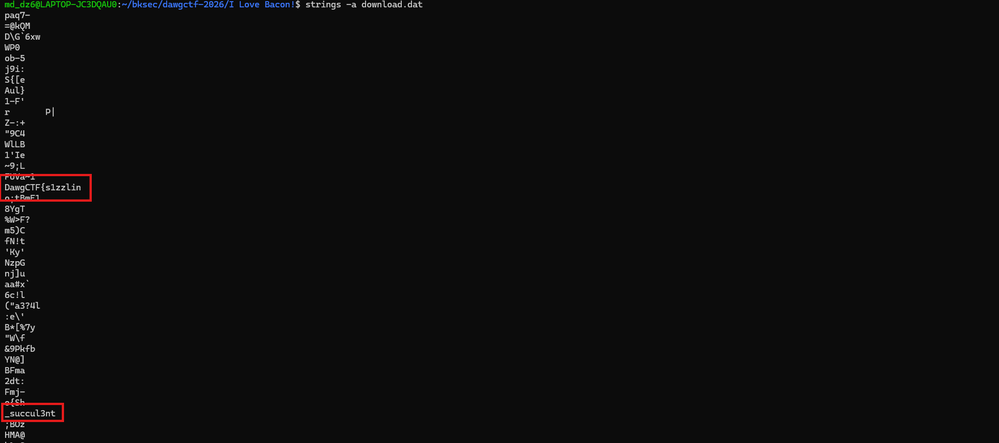
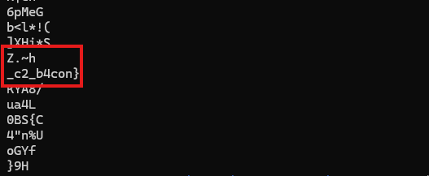

# Challenge I Love Bacon!

## 1. Đầu vào challenge



Đầu vào challenge cung cấp file pcap, mở bằng whireshark rồi vào mục statistic để quan sát trước.



Vậy các traffic chủ yếu là các gói DNS query.



Đồng thời nhìn thấy được các query đều có dạng:

```text
<chuỗi-random>.dawg.cwa.sec
```

## 2. Trích xuất phần dữ liệu từ DNS query

Từ các chuỗi random đó thấy rất giông các chuỗi base-32, vì vậy thử lấy toàn bộ phần strings random của mỗi query, lọc trùng, cắt phần `.dawg.cwa.sec` rồi thử decode bằng base32.



```bash
tshark -r dns_c2.pcap -Y "dns.flags.response == 0 && dns.qry.name" -T fields -e dns.qry.name | sed 's/\.dawg\.cwa\.sec$//' > query.txt
```

Sau khi decode thu được dữ liệu như sau.



## 3. Đọc phần dữ liệu sau khi decode

Nhận thấy decode xong còn đang chứa nhiều byte thô chưa đọc được và khó nhìn nên tải file về rồi dùng:

```bash
strings -a download.dat
```

Để đọc các chuỗi có thể đọc được thì thu được 3 mảnh của flag.





## 4. Flag

Vậy flag là:

```text
DawgCTF{s1zzlin_succul3nt_c2_b4con}
```

## 5. Flow

```text
dns_c2.pcap
   |
   v
mở Statistics để quan sát tổng quan traffic
   |
   v
nhận ra phần lớn là DNS query
   |
   v
chú ý các query có dạng
<chuỗi-random>.dawg.cwa.sec
   |
   v
nghi ngờ phần chuỗi random là dữ liệu base32
   |
   v
dùng tshark để trích toàn bộ dns.qry.name
   |
   v
cắt phần .dawg.cwa.sec
   |
   v
decode base32
   |
   v
thu được dữ liệu còn chứa nhiều byte thô
   |
   v
dùng strings -a download.dat
   |
   v
lấy ra 3 mảnh của flag
   |
   v
ghép lại thành flag hoàn chỉnh
```
---