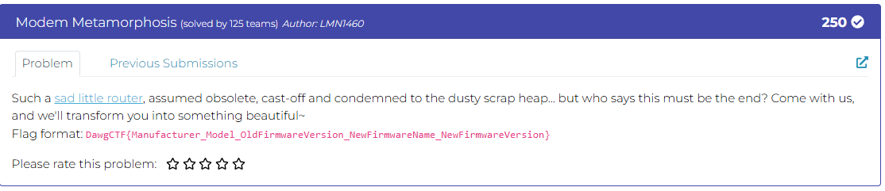
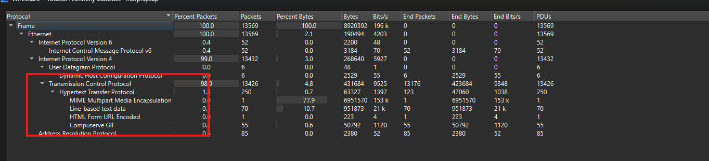
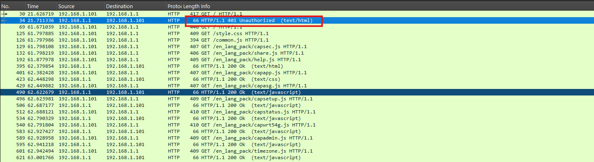
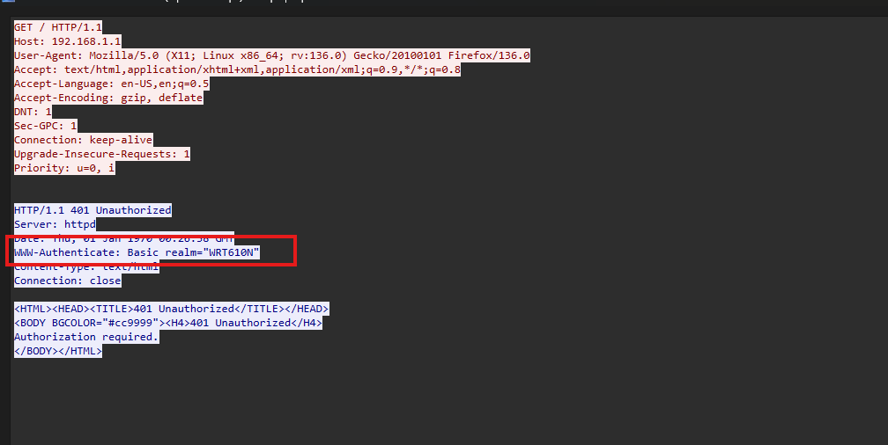
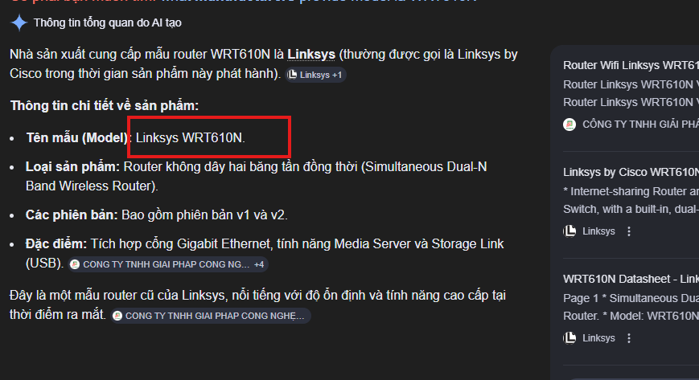
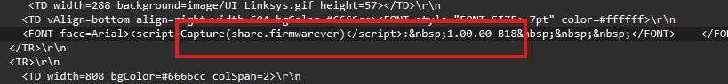
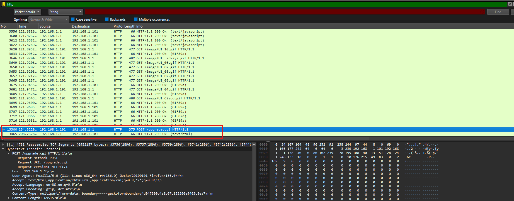
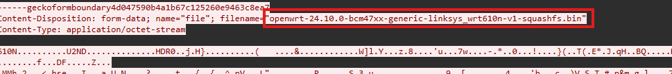

# Challenge Modem Metamorphosis

## 1. Đầu vào challenge



Đầu vào challenge cung cấp file `pcap`.

Cần tìm đủ 5 mảnh:

1. Manufacturer
2. Model
3. Old firmware version
4. New firmware name
5. New firmware version

Check phần statistic trước thấy chủ yếu traffics là các HTTP request.



---

## 2. Xác định model và manufacturer

Sử dụng filter:

```text
http
```

Nhận thấy chỉ có 1 request trả về `401`, còn lại đều `200`, mở thử `tcp stream` để xem thử có data gì đặc biệt.





Xác định được model của router là `WRT610N` thông qua header xác thực:

```text
WWW-Authenticate: Basic realm="WRT610N"
```

Vì đã biết model là `WRT610N` nên thử tra cứu xem Manufacturer nào cung cấp model này thì biết được có hãng tên `Linksys` -> Manufacturer là `Linksys`.



---

## 3. Xác định firmware version hiện tại

Vì đã xác định được các thông tin như model và firmware version đều xuất hiện trong HTTP response, đồng thời cũng biết thiết bị cần phân tích có IP là `192.168.1.1`, nên tiếp tục sử dụng filter kèm find strings:

```text
http.response && ip.src == 192.168.1.1
```

```
firmware
```

Từ đó xác định được `FirmwareVersion` của thiết bị là `1.00.00 B18`.



---

## 4. Tìm old version, new firmware name và new version

Vì cần phải tìm cả `newversion` và `oldversion` nên giờ cần tìm tiếp các response liên quan tới:

```text
Firmwareversion
```

hoặc:

```text
upgrade version
```

Quay lại với filter `http`, đọc lướt qua thấy có request tới `ugrade.cgi`, mở `tcp stream` xem thử.



Mở `tcp stream` xem thử.



Vậy biết được:

- `OldFirmwareVersion = 1.00.00 B18`
- `NewFirmwareVersion = 24.10.0`
- `New Firmware Name = openwrt`

---

## 5. Tổng hợp

1. Manufacturer = `Linksys`
2. Model = `WRT610N`
3. Old firmware version = `1.00.00 B18`
4. New firmware name = `openwrt`
5. New firmware version = `24.10.0`

---

## 6. Flag

Vậy flag là:

```text
DawgCTF{Linksys_WRT610N_1.00.00_B18_OpenWrt_24.10.0}
```

---

## 7. Flow

```text
pcap
   |
   v
mở Statistics
   |
   v
nhận thấy chủ yếu là HTTP traffic
   |
   v
lọc bằng http
   |
   v
thấy request 401 đáng chú ý
   |
   v
mở tcp stream
   |
   v
lấy được model WRT610N từ WWW-Authenticate
   |
   v
tra cứu ra manufacturer là Linksys
   |
   v
lọc tiếp các HTTP response từ 192.168.1.1
   |
   v
xác định firmware version hiện tại là 1.00.00 B18
   |
   v
tìm các response liên quan tới firmware / upgrade
   |
   v
mở tcp stream tương ứng
   |
   v
xác định old firmware version, new firmware name và new firmware version
   |
   v
ghép đủ 5 mảnh
   |
   v
lấy flag
```
---