# Challenge Stomach Bug

## 1. Đầu vào challenge

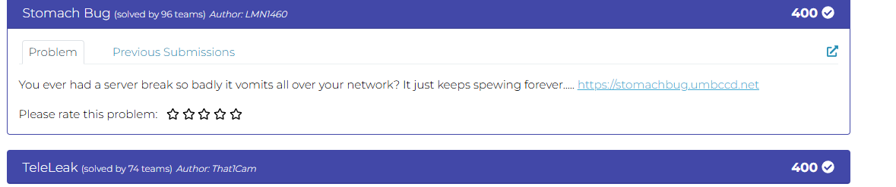

Ngay từ phần mô tả, challenge đã gợi ý rằng server “spewing forever”, tức là khi bấm tải file thì dữ liệu sẽ không kết thúc như một file bình thường mà bị trả ra liên tục. Thử lấy một đoạn dữ liệu đầu để quan sát logic file mà server đang trả về.

```bash
timeout 20 curl -s https://stomachbug.umbccd.net > spew.txt
```

Khi đọc phần đầu của dữ liệu thấy mỗi dòng có dạng:

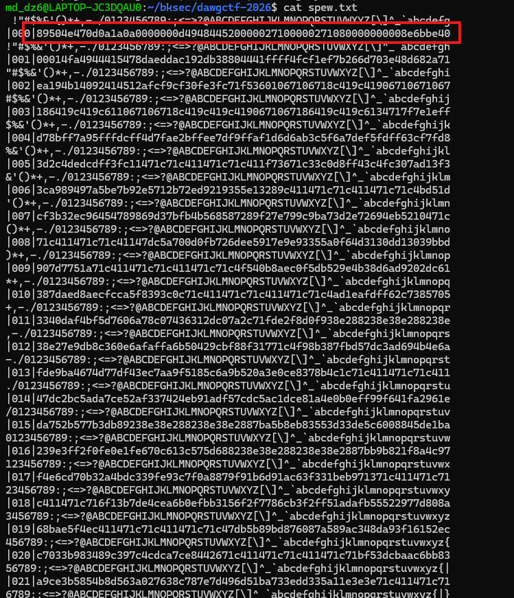

## 2. Nhận diện dữ liệu và khôi phục PNG đầu tiên

### Phân tích

các ký tự như `!"#$%...` hoặc `ABCDEFG...` chỉ là dữ liệu nhiễu được chèn xen kẽ,
chú ý hơn về chuỗi byte dài thì biết được đây là magic byte của loại file PNG.

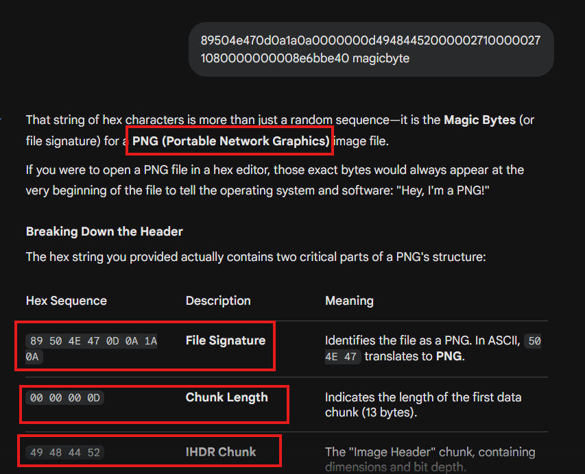

Vậy mục tiêu bây giờ là deobfuscate file, khôi phục lại chuỗi hex thật của file, byte `49454e44ae426082` đặc trưng của marker kết thúc PNG là `IEND` để xác định điểm cắt và dựng lại file PNG hoàn chỉnh.

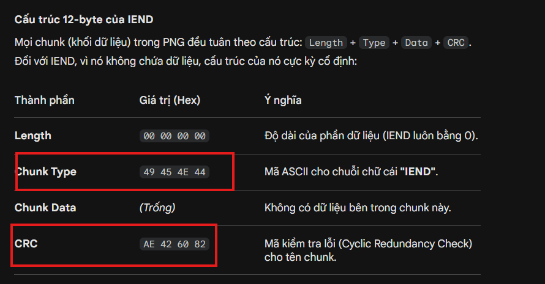

### Script deobfuscate nhanh

```python
import re

def deobfuscate(data: str) -> str:
    hex_parts = []
    for line in data.splitlines():
        m = re.match(r'^\|\d+\|([0-9a-fA-F]+)$', line)
        if m:
            hex_parts.append(m.group(1))
    return ''.join(hex_parts)

with open("spew.txt", "r", encoding="utf-8", errors="ignore") as f:
    data = f.read()

hex_data = deobfuscate(data)

with open("hex.txt", "w") as f:
    f.write(hex_data)
```

Sau khi deobfuscate xong và chạy `grep` để xem các chuỗi kết thúc thấy được các chuỗi byte kết thúc được lặp lại 4 lần.

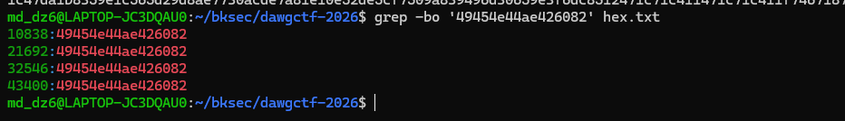

vì vậy cắt các byte từ đầu đến byte kết thúc gần nhất ra file png để xem dữ liệu như nào.

```bash
dd if=hex.txt of=png.hex bs=1 count=10854 status=none
```

Sau đó chuyển chuỗi hex đó về lại dữ liệu nhị phân để khôi phục file PNG thật:

```bash
xxd -r -p png.hex stomach.png
```

Cuối cùng thu được 1 ảnh chứa mã qr.

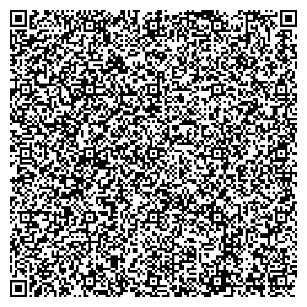

## 3. Trích payload từ mã QR đầu tiên

Sau khi quét mã QR này, có thể thấy dữ liệu bên trong là một file PNG khác.

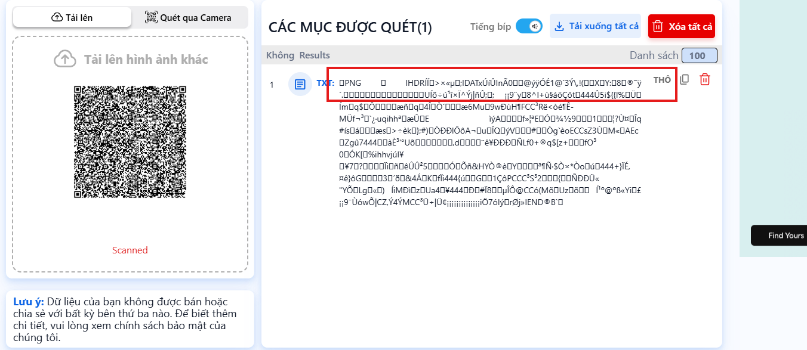

Vì vậy, bước tiếp theo là dùng `zbarimg --raw` để trích xuất trực tiếp payload của QR và ghi nó ra thành một file riêng để xử lý tiếp.

```bash
zbarimg --raw stomach.png > qr.png
```

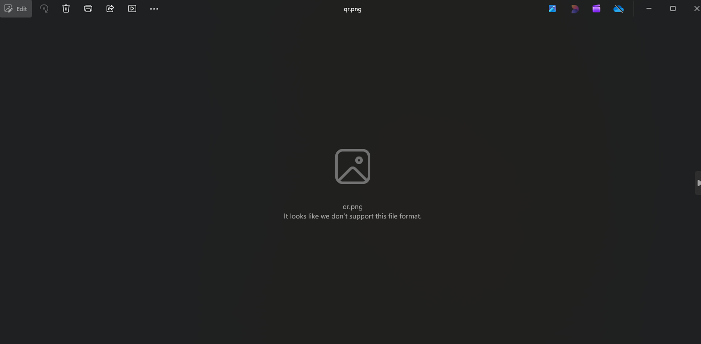

Thử mở file thu được sau khi trích xuất payload từ QR thì vẫn chưa xem. Kiểm tra bằng `xxd` cho thấy file có các marker đặc trưng của PNG như `PNG`, `IHDR`, `IDAT`, `IEND`, nhưng phần magic bytes ở đầu file lại không còn ở dạng chuẩn `89 50 4E 47 0D 0A 1A 0A`. Thay vào đó, nó xuất hiện thành `C2 89 50 4E 47 0D 0A 1A 0A`, cho thấy dữ liệu nhị phân của PNG đã bị tool xử lý như văn bản UTF-8, khiến một số byte bị biến đổi.

Vì vậy file thu được chưa phải PNG hợp lệ và cần khôi phục lại các byte gốc trước khi tiếp tục phân tích.

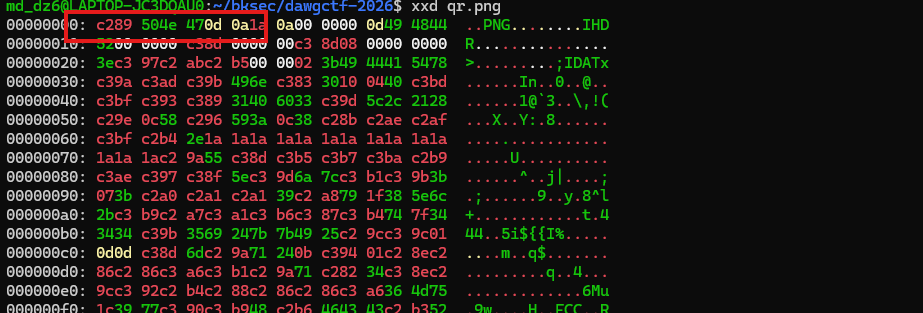

## 4. Sửa magic bytes của PNG thứ hai

Sử dụng script ngắn để:

```python
raw = open("qr.png", "rb").read()
fixed = raw.decode("utf-8").encode("latin1")
open("qr.png", "wb").write(fixed)
```

Thu được 1 mã qr khác.

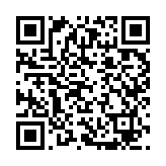

## 5. Giải mã nội dung cuối cùng

Quét nó để lấy được nội dung trong đó thì thu được 1 đoạn base64.

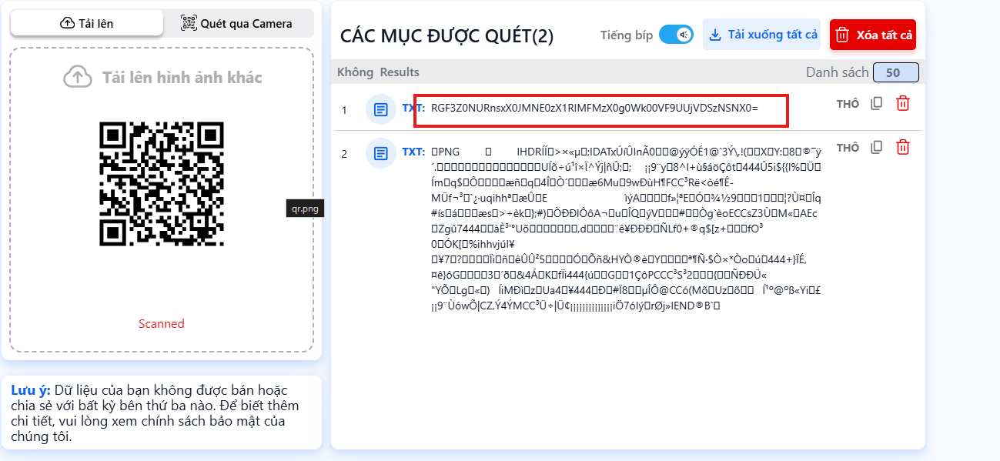

decode thử thu được flag là `DawgCTF{1_BL4M3_TH0S3_H4ZM4T_TR5CK3R5}`.

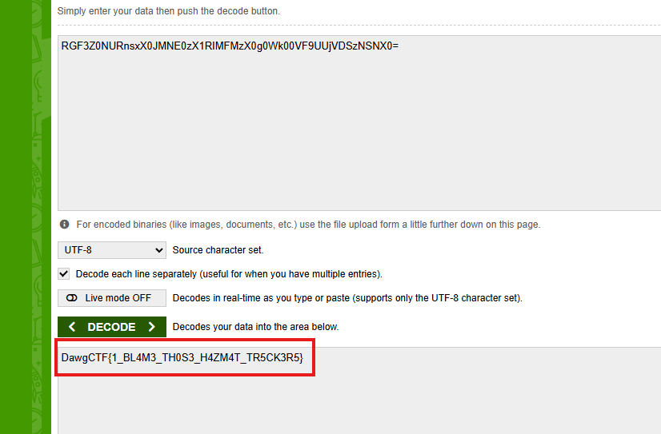

## 6. Flag

```text
DawgCTF{1_BL4M3_TH0S3_H4ZM4T_TR5CK3R5}
```

## 7. Flow

```text
stomachbug.umbccd.net
   |
   v
challenge gợi ý server trả dữ liệu liên tục
   |
   v
curl lấy một đoạn dữ liệu đầu
   |
   v
nhận ra dữ liệu thật là các chuỗi hex bị chèn nhiễu
   |
   v
thấy magic byte của PNG trong dữ liệu
   |
   v
viết script deobfuscate để ghép lại chuỗi hex thật
   |
   v
xác định marker kết thúc IEND
   |
   v
cắt phần dữ liệu PNG hợp lệ
   |
   v
đổi hex về file nhị phân
   |
   v
thu được ảnh QR đầu tiên
   |
   v
quét QR và lấy raw payload bằng zbarimg
   |
   v
thu được một file PNG khác nhưng bị lỗi magic bytes
   |
   v
kiểm tra bằng xxd và nhận ra dữ liệu bị xử lý như UTF-8
   |
   v
khôi phục lại byte gốc bằng decode utf-8 rồi encode latin1
   |
   v
thu được QR thứ hai
   |
   v
quét QR để lấy chuỗi base64
   |
   v
base64 decode
   |
   v
lấy flag
```
---