# Challenge TeleLeak

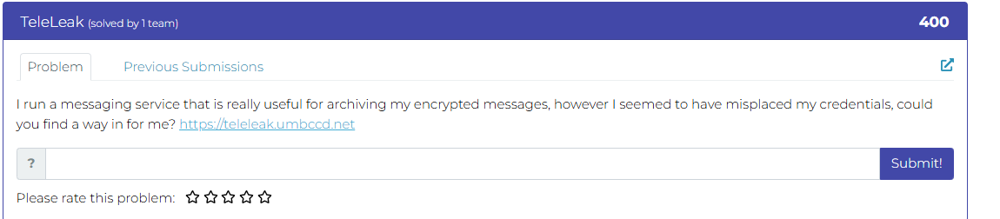

## 1. Đầu vào challenge

Sử dụng `curl -i https://teleleak.umbccd.net/` để xem các path được gọi.

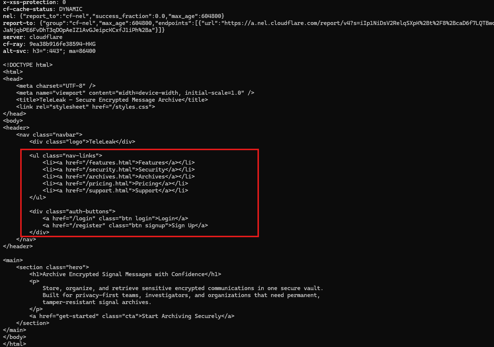

Các path liên quan tới html không có gì đặc biệt.

Chú ý tới `login` và `register` thì thấy được logic băm mật khẩu bằng `SHA-256` trong js.

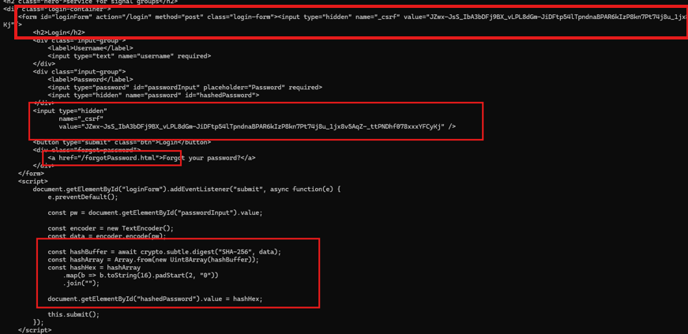

Phân tích, đoạn js quan trọng này đang dùng `TextEncoder()` để chuyển thành dạng byte. Sau đó, hàm `crypto.subtle.digest("SHA-256", data)` được gọi để băm mật khẩu bằng `SHA-256`. Kết quả hash được đổi sang chuỗi hex và gán vào input ẩn `hashedPassword`, rồi form mới được submit lại bằng `this.submit()`.

Ngoài ra, trong form còn xuất hiện trường ẩn `_csrf` là CSRF token để chống giả mạo request nhưng nó đang được render lặp lại 2 lần với cùng tên.

Đồng thời còn có cả 1 path mới là `/forgotPassword.html`, thử curl thì chỉ hiện được nội dung, chưa biết là hint hay gì nên chưa cần quan tâm.

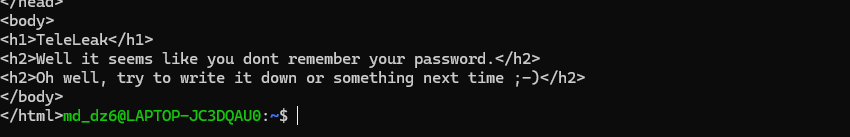

## 2. Thử đăng ký, đăng nhập và tìm path mới

Vậy giờ thử đăng ký rồi login để xem có gì đặc biệt thì phát hiện thêm 1 path mới.

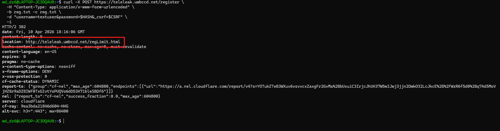

Thử curl path `/regLimit.html` thì thu được nội dung.

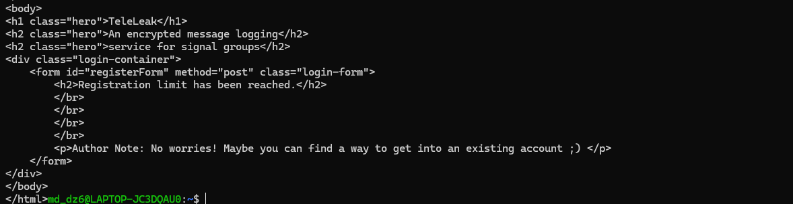

Đây có thể là hint để cố gắng tìm thử flag trong những tài khoản có sẵn. Nhưng hiện tại chưa biết server có lưu những tài khoản nào.

Đến đây thì hơi bí. Quay lại nhìn header mỗi lần curl, thắc mắc tại sao csrf lại được render tới 2 lần, đồng thời biết được header của mỗi request đều có CSRF token chống giả mạo request và còn có cả token của cookie là `JSESSIONID`.

Vì vậy thử tra cứu xem framework nào sử dụng đồng thời CSRF token và `JSESSIONID`.

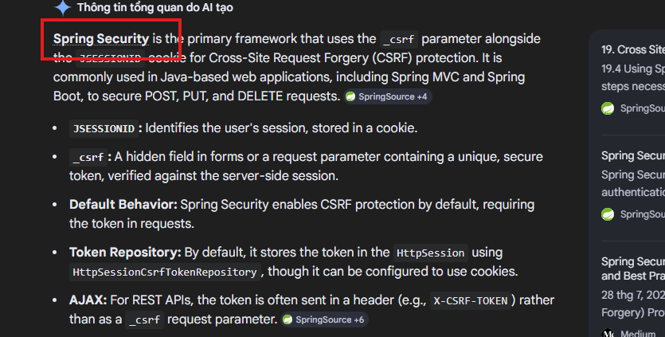

## 3. Nghi ngờ framework và lần theo actuator endpoint

Biết được có framework tên là `Spring Security`. Có thể đoán được đây là framework hệ thống sử dụng, thử tra cứu xem có những vul nào của framework này đã được phát hiện.

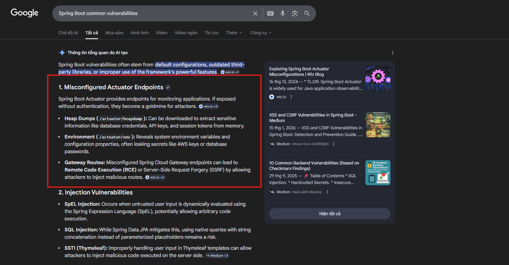

Ngay ở đầu thấy được các vul của framework này liên quan tới bộ endpoint quản trị/giám sát của `Spring Boot` không được khóa quyền truy cập.

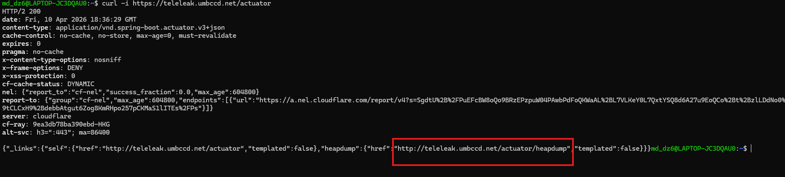

Thử curl các endpoint này xem có nội dung gì được trả về không.

Thấy được endpoint `dump` — ảnh chụp bộ nhớ của ứng dụng, đồng thời như vừa tìm kiếm đây cũng là vul quan trọng của framework này.

Tiếp tục tải dump về để phân tích.

```bash
curl https://teleleak.umbccd.net/actuator/heapdump -o heapdump.dump
```

Sau khi tải được file dump về, check file.

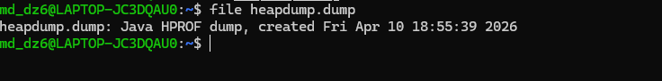

## 4. Phân tích heap dump Java

### Kiến thức ngoài lề

- Java HPROF dump nghĩa là file chụp lại bộ nhớ heap của một chương trình Java tại một thời điểm.
- Thường nó chứa:
  - object đang nằm trong memory
  - String
  - Map, List, Session
  - quan hệ tham chiếu giữa các object
  - thông tin giúp tìm memory leak hoặc dữ liệu còn nằm trong RAM

Tool dùng để đọc là **Eclipse Memory Analyzer Tool (MAT)**.

Chức năng chính của nó là mở và phân tích heap dump của Java như file `.hprof`, để xem ứng dụng Java đã dùng bộ nhớ như thế nào tại thời điểm dump.

Nó thường dùng để:
- tìm memory leak
- xem object/class nào đang chiếm RAM nhiều nhất
- xem object nào đang giữ object khác sống trong heap
- lần theo GC roots
- phân tích `String`, `Map`, `List`, `Session`, `byte[]`, v.v.
- tìm dữ liệu còn nằm trong memory như token, username, hash, session data

Vì ta đã biết challenge hint sử dụng tài khoản có sẵn ở server để có thể lấy thêm thông tin,
đồng thời cũng có được file Java heapdump, nơi chứa các object và dữ liệu còn tồn tại trong bộ nhớ user object, username và password hash, vì vậy bây giờ cần mở file Java heapdump bằng Eclipse Memory Analyzer Tool để phân tích.

Trước hết sử dụng **Histogram** để xem các class đang tồn tại trong heap, vì mục tiêu là lấy được username kèm password, nên sử dụng filter `User` để xem tồn tại những class nào liên quan tới user.

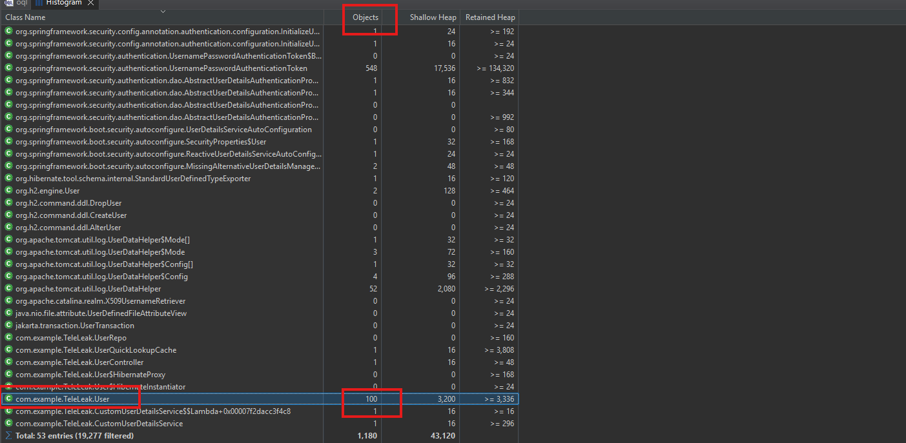

## 5. Query object user trong heap

Thấy được `com.example.TeleLeak.User` có `100` object nên thử sử dụng `OQL` để query trực tiếp lấy các chuỗi và object liên quan tới tài khoản của các user, ưu tiên kiểm tra field `password` trong class này trước.

```sql
SELECT toString(s.username), toString(s.password)
FROM com.example.TeleLeak.User s
```

Sau khi query thấy được có tài khoản của `admin` và password là:

```text
f374e70b2d71eb718c0ceda0b6a13d47ca5abd681118de48354f003d8af534f5
```
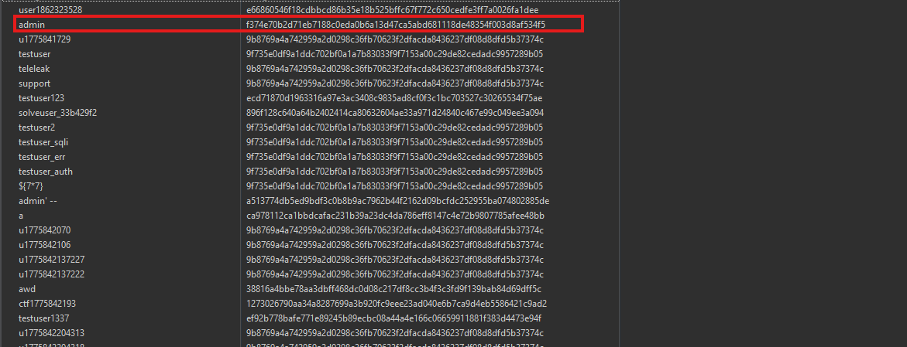

Như phân tích trước, hệ thống không dùng mật khẩu gốc để so sánh mà dùng trực tiếp giá trị sau khi băm sang `SHA-256` rồi mới submit để đăng nhập, vì vậy ta thử login với tài khoản `admin` bằng chuỗi hash đã tìm được.

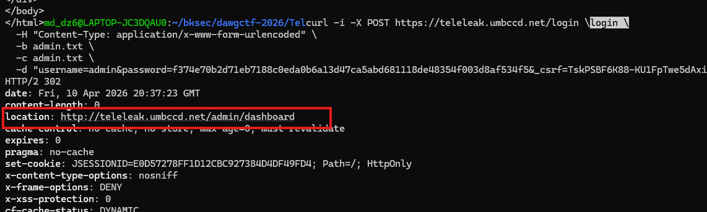


## 6. Lấy flag

Tiếp tục thấy được path mới, curl thử thì tìm được flag là:

```text
Dawgctf{w3b_m3m_Dumpz!}
```

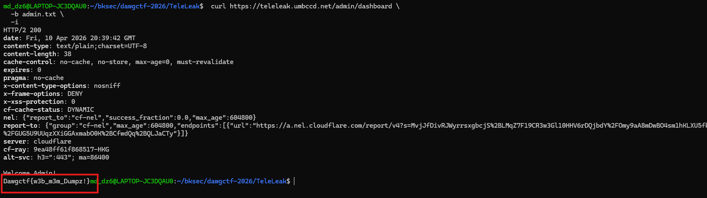

## 7. Flow

```text
teleleak.umbccd.net
   |
   v
curl -i để xem các path và response header
   |
   v
chú ý login / register dùng SHA-256 ở phía client
   |
   v
thấy _csrf xuất hiện lặp lại và cookie JSESSIONID
   |
   v
đăng ký, đăng nhập thử để tìm thêm path
   |
   v
phát hiện regLimit.html
   |
   v
nghi hệ thống dùng Spring Security / Spring Boot
   |
   v
tra cứu các endpoint quản trị phổ biến
   |
   v
phát hiện actuator/heapdump truy cập được
   |
   v
tải heap dump về máy
   |
   v
mở bằng Eclipse MAT
   |
   v
xem Histogram và filter class User
   |
   v
thấy com.example.TeleLeak.User
   |
   v
query OQL lấy username và password hash
   |
   v
thu được tài khoản admin
   |
   v
login bằng chuỗi hash SHA-256 đã tìm thấy
   |
   v
phát hiện path mới
   |
   v
curl path đó và lấy flag
```
---