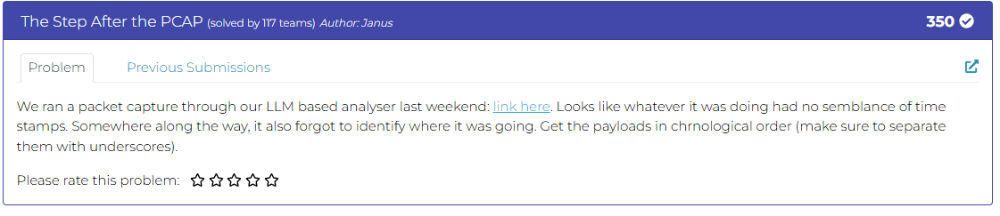
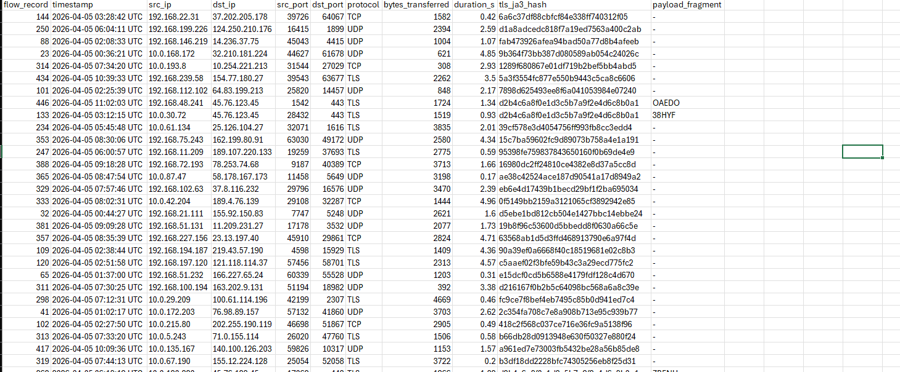
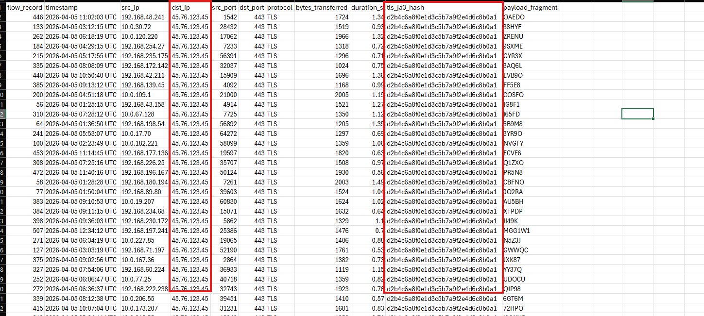
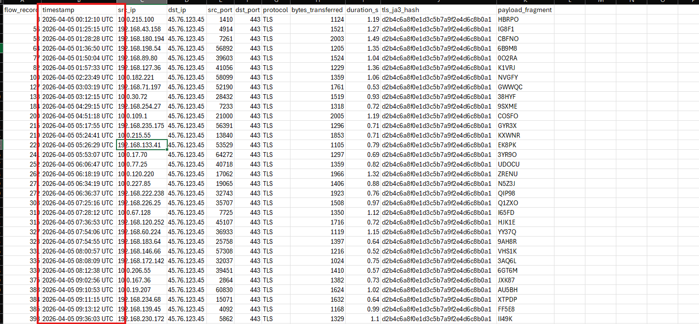

# Challenge The Step After the PCAP

## 1. Đầu vào challenge

Challenge yêu cầu trích xuất các `payload fragment` và sắp xếp chúng theo đúng thứ tự thời gian để thu được chuỗi kết quả cuối cùng.



Trước ta thử convert file log này thành csv để sau dễ query bằng tool `csvsql` và dễ quan sát hơn.

### Script convert

```python
#!/usr/bin/env python3
import re
import csv
import sys
from pathlib import Path

DELIM = "------------------------------------------------------------"

FIELDS = [
    "flow_record",
    "timestamp",
    "src_ip",
    "dst_ip",
    "src_port",
    "dst_port",
    "protocol",
    "bytes_transferred",
    "duration_s",
    "tls_ja3_hash",
    "payload_fragment",
]

PATTERNS = {
    "flow_record": r"--- Flow Record #(\d+) ---",
    "timestamp": r"Timestamp:\s*(.+)",
    "src_ip": r"Src IP:\s*(.+)",
    "dst_ip": r"Dst IP:\s*(.+)",
    "src_port": r"Src Port:\s*(.+)",
    "dst_port": r"Dst Port:\s*(.+)",
    "protocol": r"Protocol:\s*(.+)",
    "bytes_transferred": r"Bytes Transferred:\s*(.+)",
    "duration_s": r"Duration \(s\):\s*(.+)",
    "tls_ja3_hash": r"TLS JA3 Hash:\s*(.+)",
    "payload_fragment": r"Payload Fragment:\s*(.+)",
}

def parse_block(block: str):
    block = block.strip()
    if not block.startswith("--- Flow Record #"):
        return None

    row = {k: "" for k in FIELDS}
    for key, pattern in PATTERNS.items():
        m = re.search(pattern, block, flags=re.MULTILINE)
        if m:
            row[key] = m.group(1).strip()
    return row

def main():
    if len(sys.argv) != 3:
        print(f"Usage: {Path(sys.argv[0]).name} <input.log> <output.csv>")
        sys.exit(1)

    input_path = Path(sys.argv[1])
    output_path = Path(sys.argv[2])

    text = input_path.read_text(encoding="utf-8", errors="replace")
    blocks = text.split(DELIM)

    rows = []
    for block in blocks:
        row = parse_block(block)
        if row:
            rows.append(row)

    with output_path.open("w", newline="", encoding="utf-8") as f:
        writer = csv.DictWriter(f, fieldnames=FIELDS)
        writer.writeheader()
        writer.writerows(rows)

    print(f"[+] Wrote {len(rows)} rows to {output_path}")

if __name__ == "__main__":
    main()
```



## 2. Trích xuất các bản ghi có chứa `payload_fragment`

Dựa vào yêu cầu của challenge, dùng `csvsql` để truy vấn các bản ghi có chứa `payload_fragment` và lấy toàn bộ các trường để quan sát.

```bash
csvsql -d "," --query "
select *
from forensics
where payload_fragment != '-'
" forensics.csv > payload.csv
```



Thấy được các bản ghi chứa `payload_fragment` đều trỏ tới cùng một `dst_ip` là `45.76.123.45` và đều có cùng `tls_ja3_hash` là `d2b4c6a8f0e1d3c5b7a9f2e4d6c8b0a1`. nhưng hiện tại cột thời gian đang chưa được sắp xếp đúng thứ tự nên sử dụng:

```bash
csvsort -c timestamp payload.csv > time.csv
```



## 3. Ghép các mảnh payload theo thứ tự thời gian

Vậy giờ cột `timestamp` đã được sắp xếp, giờ chỉ cần ghép payload lại.

```bash
csvcut -c payload_fragment time.csv | tail -n +2 | paste -sd "_" -
```

## 4. Flag

Cuối cùng thu được flag là:

```text
DawgCTF{HBRPO_IG8F1_CBFNO_6B9M8_0O2RA_K1VRJ_NVGFY_GWWQC_38HYF_9SXME_COSFO_GYR3X_KXWNR_EK8PK_3YR9O_UDOCU_ZRENU_N5Z3J_QIP98_Q1ZXO_I65FD_HJK1E_YY37Q_9AH8R_VHS1K_3AQ6L_6GT6M_JXK87_AU5BH_XTPDP_FF5E8_II49K_Q71N8_MTZX2_72HPO_EVB9O_OAEDO_ECVE6_PR5N8_I4P40_MGG1W1}
```

## 5. Flow

```text
flow log
   |
   v
convert sang csv
   |
   v
dùng csvsql để lọc các bản ghi có payload_fragment
   |
   v
xác định các fragment liên quan tới cùng một đích
   |
   v
sắp xếp lại theo timestamp bằng csvsort
   |
   v
trích riêng cột payload_fragment
   |
   v
ghép toàn bộ fragment theo đúng thứ tự
   |
   v
thu được flag
```
---