# Challenge COMfortable exfiltration

## 1. Đầu vào challenge

Challenge cung cấp 3 file:

- `mem.elf`
- `User.ad1`
- `User.ad2`

Mount sẵn file `mem.elf` sang ổ `M:\` bằng MemProcFS:

```powershell
.\MemProcFS.exe -device "D:\challenge_for\mem.elf" -mount M -forensic 2
```

---

## 2. Task 1 - There is an installed Service disguised as a Microsoft Component; What is the full path of the executable?

Ở câu hỏi này cần tìm file executable được đăng ký bởi một installed service giả dạng Microsoft Component, với các dấu hiệu:

- Tên service/binary nghe giống thành phần Microsoft hoặc updater hợp pháp
- Binary không nằm trong `C:\Windows\System32`
- Path nằm ở vị trí bất thường như `Temp/Cache`

Ngay khi đi vào phân tích, cụ thể pivot ở folder `forensic\files` của MemProcFS, thấy ngay artifact tại:

```text
M:\forensic\files\ROOT\Temp\Microsoft Cache\ffffbc8fe107e180-updater.exe
```

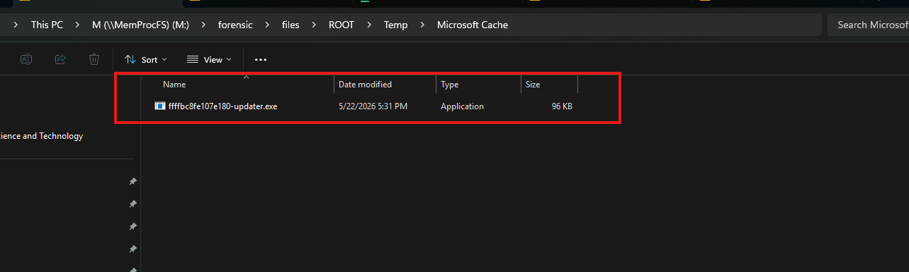

File này có đầy đủ đặc điểm đáng nghi: tên là `updater.exe`, nằm trong thư mục giả giống Microsoft Cache nhưng lại ở dưới `C:\Temp`, không phải `C:\Windows\System32`.

**Đáp án là:** `C:\Temp\Microsoft Cache\updater.exe`

---

## 3. Task 2 - The injector shadows an object into the HKCU registry. Using its CLSID, what is the name of the Object?

Ở đây cần tìm COM object hợp pháp nào của Windows/app bị malware “shadow” để lợi dụng chạy code.

### Kiến thức ngoài lề

COM object là một component Windows được đăng ký trong registry, thường nằm ở:

```text
HKLM\Software\Classes\CLSID\{...}
HKCU\Software\Classes\CLSID\{...}
```

Mỗi COM object thường có:

```text
CLSID = mã định danh dạng GUID
(Default) = tên object
InprocServer32 = DLL thật sự được load
AppID = cấu hình chạy qua surrogate/dllhost nếu có
```

Ví dụ logic chung:

```text
Một chương trình gọi COM object X
→ Windows nhìn CLSID của X trong registry
→ Windows xem DLL nào cần load
→ DLL đó được chạy
```

Vậy từ câu 1 đã biết và có file executable nghi vấn là `updater.exe`.

Sử dụng `strings` và `grep` để tìm nhanh các chuỗi liên quan đến COM registry trong binary, đặc biệt là `Software\Classes\CLSID`, vì nếu malware có thao tác COM hijacking/shadowing thì nó thường phải ghi hoặc tham chiếu tới các key CLSID trong registry.

Command:

```bash
strings -el updater.exe | grep -iE "Software\\\\Classes\\\\CLSID"
```

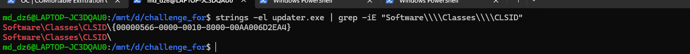

Thấy được trong `updater.exe` có hardcode đường dẫn registry:

```text
Software\Classes\CLSID\{00000566-0000-0010-8000-00AA006D2EA4}
```

Di chuyển tới:

```text
M:\registry\HKLM\SOFTWARE\Classes\CLSID\{00000566-0000-0010-8000-00AA006D2EA4}
```

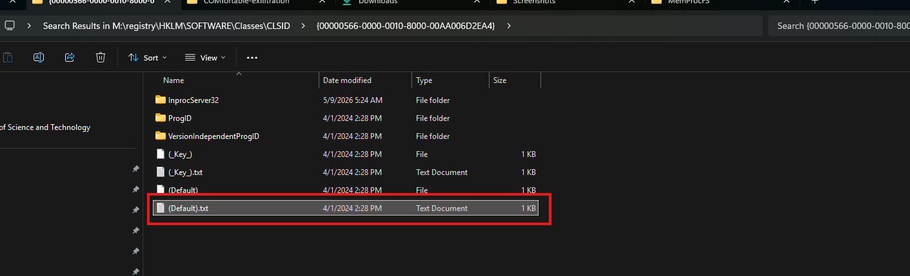

Chú ý hơn vào file `(Default).txt` vì nó chứa giá trị mặc định của CLSID trong registry. Với COM registration, `(Default)` thường là tên hiển thị/tên object của COM class.

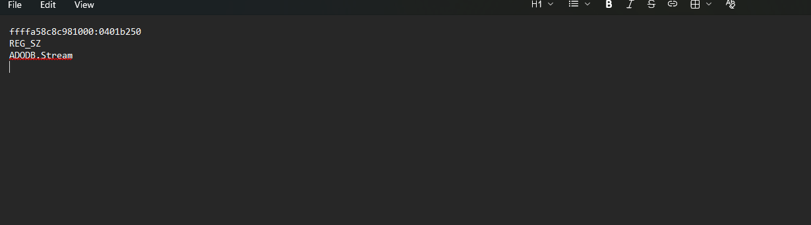

Từ `(Default).txt` xác định được COM object gốc là `ADODB.Stream`.

**Đáp án là:** `ADODB.Stream`

---

## 4. Task 3 - Following its self-duplication, the malware drops a secondary file onto the system. What is the filename of this secondary file?

Để check hành vi drop secondary file, sử dụng IDA để phân tích `updater.exe`, sau đó tìm tới hàm `main()` vì đây là nơi thể hiện flow chính của loader.

```c++
int __fastcall main(int argc, const char **argv, const char **envp)
main proc near

var_178= dword ptr -178h
var_174= dword ptr -174h
hResInfo= qword ptr -170h
var_168= qword ptr -168h
var_160= qword ptr -160h
var_158= qword ptr -158h
var_150= qword ptr -150h
var_148= qword ptr -148h
var_140= qword ptr -140h
var_138= qword ptr -138h
var_130= qword ptr -130h
var_128= qword ptr -128h
var_120= qword ptr -120h
var_118= byte ptr -118h
var_F8= byte ptr -0F8h
var_D8= byte ptr -0D8h
var_B8= byte ptr -0B8h
var_98= byte ptr -98h
var_78= byte ptr -78h
var_58= byte ptr -58h
var_38= byte ptr -38h
var_18= qword ptr -18h

; __unwind { // __GSHandlerCheck_EH4
sub     rsp, 198h
mov     rax, cs:__security_cookie
xor     rax, rsp
mov     [rsp+198h+var_18], rax
lea     rdx, aCTempMicrosoft ; "C:\\Temp\\Microsoft Cache\\"
lea     rcx, [rsp+198h+var_38]
call    sub_1400042C0
nop
lea     rdx, aUpdaterExe ; "updater.exe"
lea     rcx, [rsp+198h+var_58]
call    sub_1400042C0
nop
;   try {
lea     rdx, [rsp+198h+var_58]
lea     rcx, [rsp+198h+var_38]
call    sub_140006870
lea     rdx, aCProgramdataWi ; "C:\\ProgramData\\WindowsSupport\\Packag"...
lea     rcx, [rsp+198h+var_78]
call    sub_1400042C0
nop
;   } // starts at 14000CFE3
;   try {
lea     r8, aKathcjazQuh ; "\\kathcjaz.quh"
lea     rdx, [rsp+198h+var_78]
lea     rcx, [rsp+198h+var_98]
call    sub_1400012A0
nop
;   } // starts at 14000D00D
;   try {
lea     r8, Type        ; "RAW_DLL"
mov     edx, 68h ; 'h'  ; lpName
xor     ecx, ecx        ; hModule
call    cs:FindResourceW
mov     [rsp+198h+hResInfo], rax
mov     rdx, [rsp+198h+hResInfo] ; hResInfo
xor     ecx, ecx        ; hModule
call    cs:SizeofResource
mov     [rsp+198h+var_178], eax
mov     rdx, [rsp+198h+hResInfo] ; hResInfo
xor     ecx, ecx        ; hModule
call    cs:LoadResource
mov     [rsp+198h+var_148], rax
call    sub_140008920
call    sub_140008AA0
nop
lea     rax, [rsp+198h+var_118]
mov     [rsp+198h+var_168], rax
lea     rdx, [rsp+198h+var_78]
mov     rcx, [rsp+198h+var_168]
call    sub_140004220
mov     [rsp+198h+var_160], rax
mov     rcx, [rsp+198h+var_160]
call    sub_1400073F0
nop
lea     rax, [rsp+198h+var_F8]
mov     [rsp+198h+var_158], rax
mov     eax, [rsp+198h+var_178]
mov     [rsp+198h+var_150], rax
lea     rdx, [rsp+198h+var_98]
mov     rcx, [rsp+198h+var_158]
call    sub_140004220
mov     [rsp+198h+var_140], rax
mov     rax, [rsp+198h+var_150]
mov     r8, rax
mov     rdx, [rsp+198h+var_148]
mov     rcx, [rsp+198h+var_140]
call    sub_140006A10
nop
lea     rax, [rsp+198h+var_D8]
mov     [rsp+198h+var_138], rax
lea     rdx, [rsp+198h+var_98]
mov     rcx, [rsp+198h+var_138]
call    sub_140004220
mov     [rsp+198h+var_130], rax
mov     rcx, [rsp+198h+var_130]
call    sub_1400078B0
nop
lea     rax, [rsp+198h+var_B8]
mov     [rsp+198h+var_128], rax
lea     r8, [rsp+198h+var_58]
lea     rdx, [rsp+198h+var_38]
mov     rcx, [rsp+198h+var_128]
call    sub_1400011B0
mov     [rsp+198h+var_120], rax
mov     rcx, [rsp+198h+var_120]
call    sub_140006CA0
nop
call    sub_140006EC0
call    sub_140007040
mov     rax, cs:qword_140015548
mov     rax, [rax]
mov     rcx, cs:qword_140015548
call    qword ptr [rax+10h]
mov     rax, cs:pProxy
mov     rax, [rax]
mov     rcx, cs:pProxy
call    qword ptr [rax+10h]
call    cs:CoUninitialize
nop
mov     [rsp+198h+var_174], 0
;   } // starts at 14000D02A
;   try {
lea     rcx, [rsp+198h+var_98] ; void *
call    sub_140005320
nop
;   } // starts at 14000D18C
;   try {
lea     rcx, [rsp+198h+var_78] ; void *
call    sub_140005320
nop
;   } // starts at 14000D19A
lea     rcx, [rsp+198h+var_58] ; void *
call    sub_140005320
nop
lea     rcx, [rsp+198h+var_38] ; void *
call    sub_140005320
mov     eax, [rsp+198h+var_174]
mov     rcx, [rsp+198h+var_18]
xor     rcx, rsp        ; StackCookie
call    __security_check_cookie
add     rsp, 198h
retn
; } // starts at 14000CFA0
main endp
```

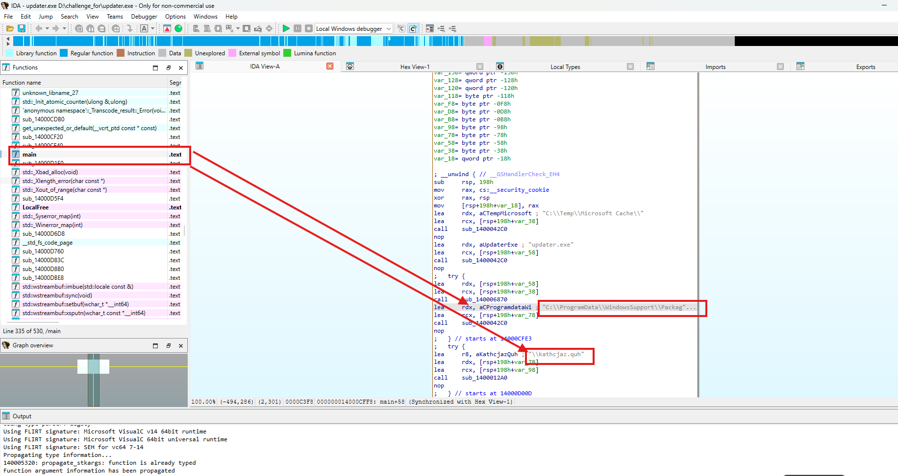

Từ hàm `main()` thấy được binary hardcode nhiều chuỗi path quan trọng. Đầu tiên nó tạo/nhắc tới thư mục `C:\Temp\Microsoft Cache\` và file `updater.exe` phục vụ phần self-duplication ở Task 1.

Sau đó tiếp tục thấy một path khác trỏ tới thư mục dưới:

```text
C:\ProgramData\WindowsSupport\Packages\Drivers\
```

kèm filename lạ là:

```text
kathcjaz.quh
```

Vậy khả năng file `kathcjaz.quh` là file mà `updater.exe` drop ra và nó được ghi vào:

```text
C:\ProgramData\WindowsSupport\Packages\Drivers\
```

**Đáp án là:** `kathcjaz.quh`

---

## 5. Task 4 - What is the (C#) Class Name and the corresponding CLSID that's exposed to the COM API (Name:{GUID})?

### Kiến thức ngoài lề

Với .NET/C#, một class bình thường không tự động được gọi qua COM. Muốn class C# có thể được native program hoặc COM client gọi, class đó phải được expose ra COM bằng các attribute như:

- `[ComVisible(true)]`: cho phép class được COM nhìn thấy/gọi được
- `[Guid("...")]`: GUID/CLSID định danh class đó trong COM
- `[ClassInterface(...)]`: quy định cách COM expose interface của class

Vì vậy, khi câu hỏi hỏi “C# Class Name and corresponding CLSID exposed to the COM API”, ta cần tìm trong .NET assembly class nào có `[ComVisible(true)]`, rồi lấy tên class đó cùng GUID trong `[Guid("...")]`.

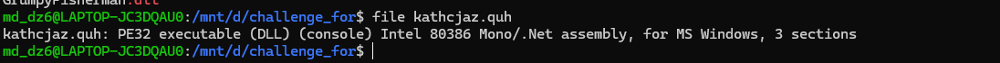

Khi check bằng `file`, thấy `kathcjaz.quh` là PE32 executable dạng DLL và là Mono/.NET assembly cho Windows. Dùng ILSpy để đọc .NET assembly.

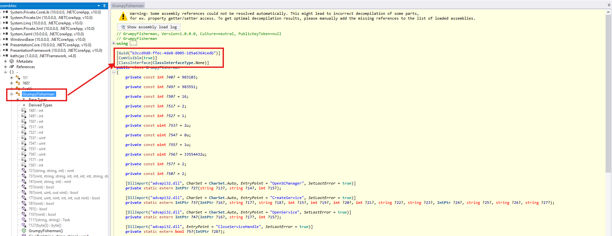

Chú ý hơn vào class `GrumpyFisherman`, vì nó có đúng cấu trúc của một C# class được expose ra COM:

- `[Guid("b3ccd9d8-ffec-4de0-8005-185a6364cedb")]`
- `[ComVisible(true)]`
- `[ClassInterface(ClassInterfaceType.None)]`

Trong đó, `ComVisible(true)` chứng minh class này được COM nhìn thấy/gọi được. `Guid(...)` là CLSID/GUID tương ứng của class khi expose qua COM. Tên class lấy trực tiếp từ khai báo `public class GrumpyFisherman`.

Vì các attribute này gắn trực tiếp lên class `GrumpyFisherman`, nên đây là class C# được expose to COM API.

**Đáp án là:** `GrumpyFisherman:{b3ccd9d8-ffec-4de0-8005-185a6364cedb}`

---

## 6. Task 5 - What is the CLSID responsible for calling the .NET function that installs the malicious Service? ({GUID})

Ở câu hỏi này cần xác định CLSID nào chịu trách nhiệm gọi function trong .NET để cài service độc hại.

Sử dụng script để tìm nhanh các CLSID có liên quan tới `GrumpyFisherman` trong registry:

```python
from pathlib import Path
import sys

BASE = Path(r"M:\registry\HKLM\SOFTWARE\Classes\CLSID")
TARGET = "GrumpyFisherman"

def read_text_safe(path: Path) -> str:
    try:
        data = path.read_bytes()
    except Exception:
        return ""

    for enc in ("utf-8", "utf-16-le", "utf-16", "latin-1"):
        try:
            return data.decode(enc, errors="ignore")
        except Exception:
            continue

    return ""

def main():
    base = Path(sys.argv[1]) if len(sys.argv) > 1 else BASE

    if not base.exists():
        print(f"Path not found: {base}")
        return

    for guid_folder in base.iterdir():
        if not guid_folder.is_dir():
            continue

        if not (guid_folder.name.startswith("{") and guid_folder.name.endswith("}")):
            continue

        found = False

        for default_file in guid_folder.rglob("(Default).txt"):
            content = read_text_safe(default_file)

            if TARGET.lower() in content.lower():
                found = True
                break

        if found:
            print(guid_folder.name)

if __name__ == "__main__":
    main()
```

Cuối cùng tìm được 3 CLSID.

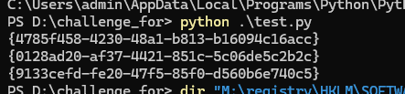

Nhưng khi tìm tới folder của 3 CLSID này đều có:

- `InprocServer32 = mscoree.dll`
- `ProgID = GrumpyFisherman`
- `CodeBase = kathcjaz.quh`
- `DllSurrogate = ""` từ `AppID`
- `Timestamp = 22:22:21`

Registry giống hệt nhau, không thể xác định CLSID nào là CLSID chính.

Vì registry không đủ để phân biệt, quay trở lại tìm trong binary của `updater.exe` — đây là file thực thi chính của malware, nơi chứa logic gọi COM.

Trong IDA sử dụng **View → Open Subviews → Imports** để tìm `CLSIDFromString` vì code hardcode GUID.

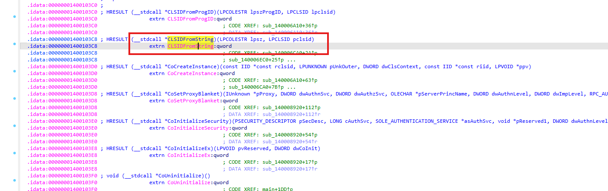

Sau đó tìm xem danh sách các nơi gọi hàm này.

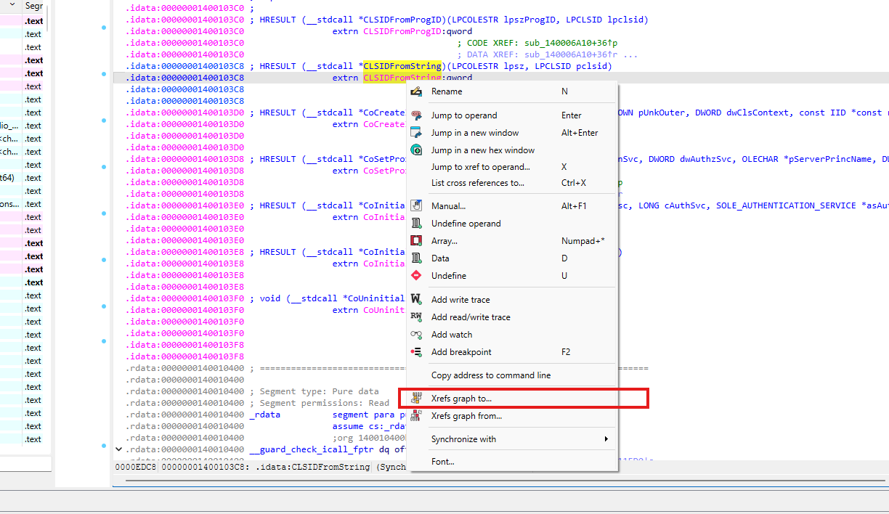

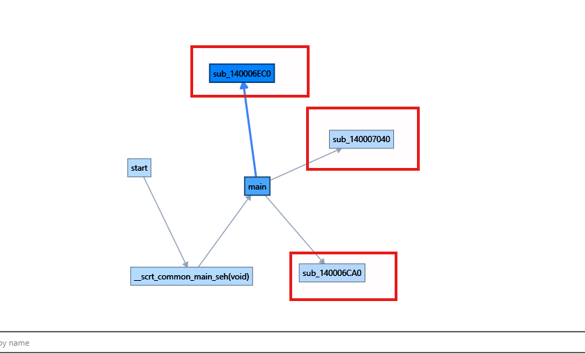

Chú ý hơn vào 3 hàm `sub_140006EC0`, `sub_140007040`, `sub_140006CA0` được gọi trực tiếp từ `main()`.

### Phân tích 3 hàm COM được main gọi

Trong `main()`, malware chuẩn bị các string liên quan đến service executable:

- `C:\Temp\Microsoft Cache\`
- `updater.exe`

Sau đó gọi `sub_1400011B0` để ghép thành full path, rồi truyền kết quả qua `rcx` vào `sub_140006CA0`:

```c++
lea     r8, [rsp+198h+var_58]      ; "updater.exe"
lea     rdx, [rsp+198h+var_38]     ; "C:\\Temp\\Microsoft Cache\\"
mov     rcx, [rsp+198h+var_128]
call    sub_1400011B0
mov     [rsp+198h+var_120], rax
mov     rcx, [rsp+198h+var_120]
call    sub_140006CA0
```

Ngay sau đó, `main()` gọi thêm hai hàm COM khác nhưng không truyền argument trực tiếp:

```c++
call    sub_140006EC0
call    sub_140007040
```

Vì vậy cần phân tích từng hàm để xem CLSID nào nằm trong nhánh nhận service executable path.

### 6.1. `sub_140006EC0`

```c++
sub_140006EC0 proc near

ppv= qword ptr -78h
var_70= qword ptr -70h
var_68= dword ptr -68h
var_64= dword ptr -64h
var_60= dword ptr -60h
var_58= qword ptr -58h
pclsid= CLSID ptr -50h
var_40= VARIANTARG ptr -40h
pvarg= VARIANTARG ptr -28h
var_10= qword ptr -10h

; __unwind { // __GSHandlerCheck
sub     rsp, 98h
mov     rax, cs:__security_cookie
xor     rax, rsp
mov     [rsp+98h+var_10], rax
lea     rdx, [rsp+98h+pclsid] ; pclsid
lea     rcx, a9133cefdFe2047 ; "{9133cefd-fe20-47f5-85f0-d560b6e740c5}"
call    cs:CLSIDFromString
mov     [rsp+98h+var_58], 0
mov     edx, 2
mov     ecx, 1
call    unknown_libname_42
mov     edx, 4
mov     ecx, eax
call    unknown_libname_42
mov     edx, 10h
mov     ecx, eax
call    unknown_libname_42
lea     rcx, [rsp+98h+var_58]
mov     [rsp+98h+ppv], rcx ; ppv
lea     r9, riid        ; riid
mov     r8d, eax        ; dwClsContext
xor     edx, edx        ; pUnkOuter
lea     rcx, [rsp+98h+pclsid] ; rclsid
call    cs:CoCreateInstance
mov     [rsp+98h+var_64], eax
cmp     [rsp+98h+var_64], 0
jl      loc_14000701A
```

### Phân tích

Hàm này gọi `CLSIDFromString` với GUID hardcoded:

```text
{9133cefd-fe20-47f5-85f0-d560b6e740c5}
```

Sau đó CLSID vừa parse được truyền trực tiếp vào `CoCreateInstance`.

Mapping tham số của `CoCreateInstance` theo Windows x64 calling convention:

```text
rcx = &pclsid      -> CLSID {9133cefd-fe20-47f5-85f0-d560b6e740c5}
rdx = 0            -> pUnkOuter = NULL
r8d = eax          -> dwClsContext
r9  = &riid        -> interface ID cần lấy
ppv = &var_58      -> nơi nhận COM object pointer
```

Vì vậy, `sub_140006EC0` có nhiệm vụ activate COM object bằng CLSID `{9133cefd-fe20-47f5-85f0-d560b6e740c5}`.

Tuy nhiên, trong `main()`, hàm này được gọi trực tiếp bằng:

```asm
call sub_140006EC0
```

không có argument service path được truyền vào trước đó. Vì vậy, chỉ từ flow của main, hàm này không phải nhánh nhận path `C:\Temp\Microsoft Cache\updater.exe` để cài service.

### 6.2. `sub_140007040`

```c++
sub_140007040 proc near

ppv= qword ptr -58h
var_50= qword ptr -50h
var_48= dword ptr -48h
var_40= qword ptr -40h
pclsid= CLSID ptr -38h
pvarg= VARIANTARG ptr -28h
var_10= qword ptr -10h

; __unwind { // __GSHandlerCheck
sub     rsp, 78h
mov     rax, cs:__security_cookie
xor     rax, rsp
mov     [rsp+78h+var_10], rax
lea     rdx, [rsp+78h+pclsid] ; pclsid
lea     rcx, a4785f458423048 ; "{4785f458-4230-48a1-b813-b16094c16acc}"
call    cs:CLSIDFromString
mov     [rsp+78h+var_40], 0
mov     edx, 2
mov     ecx, 1
call    unknown_libname_42
mov     edx, 4
mov     ecx, eax
call    unknown_libname_42
mov     edx, 10h
mov     ecx, eax
call    unknown_libname_42
lea     rcx, [rsp+78h+var_40]
mov     [rsp+78h+ppv], rcx ; ppv
lea     r9, riid        ; riid
mov     r8d, eax        ; dwClsContext
xor     edx, edx        ; pUnkOuter
lea     rcx, [rsp+78h+pclsid] ; rclsid
call    cs:CoCreateInstance
mov     [rsp+78h+var_48], eax
cmp     [rsp+78h+var_48], 0
jl      short loc_14000710C
```

### Phân tích

Hàm này cũng có cùng pattern COM activation:

```asm
CLSIDFromString("{4785f458-4230-48a1-b813-b16094c16acc}", &pclsid)
CoCreateInstance(&pclsid, NULL, dwClsContext, &riid, &ppv)
```

CLSID được activate trong hàm này là:

```text
{4785f458-4230-48a1-b813-b16094c16acc}
```

Tuy nhiên, trong `main()`, hàm này cũng được gọi trực tiếp bằng:

```asm
call sub_140007040
```

không có argument service path được truyền vào. Stack frame của hàm này cũng nhỏ hơn và số local ít hơn so với `sub_140006CA0`, cho thấy đây là một nhánh COM invocation khác, nhưng không phải nhánh nhận path service executable từ main.

### 6.3. `sub_140006CA0`

```c++
sub_140006CA0 proc near

ppv= qword ptr -0B8h
var_B0= qword ptr -0B0h
var_A8= dword ptr -0A8h
var_A4= dword ptr -0A4h
var_A0= dword ptr -0A0h
var_98= qword ptr -98h
pclsid= CLSID ptr -90h
var_80= VARIANTARG ptr -80h
pvarg= VARIANTARG ptr -68h
var_18= qword ptr -18h
arg_0= qword ptr  8

; __unwind { // __GSHandlerCheck_EH4
mov     [rsp+arg_0], rcx
sub     rsp, 0D8h
mov     rax, cs:__security_cookie
xor     rax, rsp
mov     [rsp+0D8h+var_18], rax
lea     rdx, [rsp+0D8h+pclsid] ; pclsid
lea     rcx, sz         ; "{0128ad20-af37-4421-851c-5c06de5c2b2c}"
call    cs:CLSIDFromString
mov     [rsp+0D8h+var_98], 0
mov     edx, 2
mov     ecx, 1
call    unknown_libname_42
mov     edx, 4
mov     ecx, eax
call    unknown_libname_42
mov     edx, 10h
mov     ecx, eax
call    unknown_libname_42
lea     rcx, [rsp+0D8h+var_98]
mov     [rsp+0D8h+ppv], rcx ; ppv
lea     r9, riid        ; riid
mov     r8d, eax        ; dwClsContext
xor     edx, edx        ; pUnkOuter
lea     rcx, [rsp+0D8h+pclsid] ; rclsid
call    cs:CoCreateInstance
mov     [rsp+0D8h+var_A4], eax
cmp     [rsp+0D8h+var_A4], 0
jl      loc_140006E92
```

### Phân tích

Hàm này khác hai hàm còn lại ở điểm quan trọng: nó nhận argument qua `rcx` từ caller và lưu lại ngay đầu hàm:

```asm
mov [rsp+arg_0], rcx
```

Trong `main()`, argument truyền vào `sub_140006CA0` được tạo từ:

```text
"C:\Temp\Microsoft Cache\"
+
"updater.exe"
```

tức full path của malicious service executable:

```text
C:\Temp\Microsoft Cache\updater.exe
```

Sau đó `main()` gọi:

```asm
mov rcx, [rsp+198h+var_120]
call sub_140006CA0
```

Vì vậy, `sub_140006CA0` là hàm COM duy nhất trong ba hàm nhận trực tiếp service executable path từ `main()`.

Bên trong `sub_140006CA0`, hàm gọi:

```asm
CLSIDFromString("{0128ad20-af37-4421-851c-5c06de5c2b2c}", &pclsid)
```

rồi truyền CLSID này vào:

```asm
CoCreateInstance(...)
```

Mapping tham số:

```text
rcx = &pclsid      -> CLSID {0128ad20-af37-4421-851c-5c06de5c2b2c}
rdx = 0            -> pUnkOuter = NULL
r8d = eax          -> dwClsContext
r9  = &riid        -> interface ID cần lấy
ppv = &var_98      -> nơi nhận COM object pointer
```

Do đó, `sub_140006CA0` vừa nhận service executable path, vừa activate COM object bằng CLSID `{0128ad20-af37-4421-851c-5c06de5c2b2c}` chịu trách nhiệm gọi .NET function cài malicious service.

**Đáp án là:** `{0128ad20-af37-4421-851c-5c06de5c2b2c}`

---

## 7. Task 6 - One of the .NET code's functionalities is disabling BitLocker Protection. What _WINDOWS_ CLSID is responsible for that? ({GUID})

Ở câu này cần tìm CLSID của Windows COM object mà malware gọi để disable BitLocker.

Trước tiên chú ý hơn vào interface `IFveUiDispatch`.

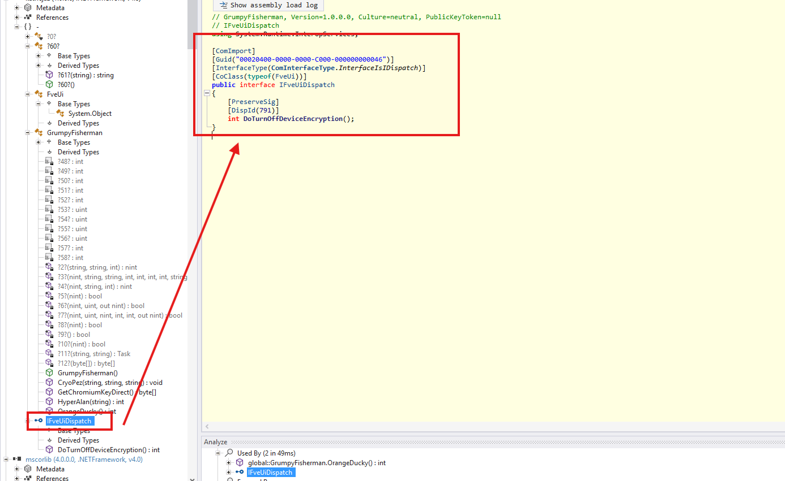

Đây là interface được dùng để gọi chức năng BitLocker thông qua COM. Interface này có các attribute:

```csharp
[ComImport]
[Guid("00020400-0000-0000-C000-000000000046")]
[InterfaceType(ComInterfaceType.InterfaceIsIDispatch)]
[CoClass(typeof(FveUi))]
```

Điều này cho biết `IFveUiDispatch` là một COM dispatch interface. Tuy nhiên GUID `00020400-0000-0000-C000-000000000046` ở đây là IID của `IDispatch`, không phải Windows CLSID.

Điểm quan trọng là attribute `[CoClass(typeof(FveUi))]`. Nó cho biết interface này được gắn với COM class `FveUi`. Bên trong interface có method:

```csharp
DoTurnOffDeviceEncryption()
```

Tên method này thể hiện rõ chức năng tắt Device Encryption/BitLocker Protection.

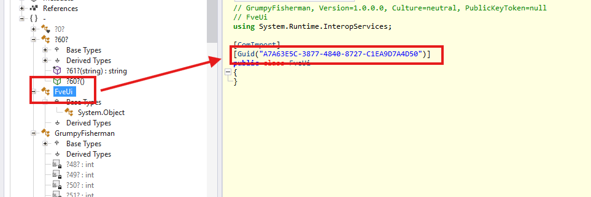

Tìm tới class `FveUi` thì thấy class này có attribute:

```csharp
[ComImport]
[Guid("A7A63E5C-3877-4840-8727-C1EA9D7A4D50")]
public class FveUi
```

Ở đây `FveUi` là CoClass được gắn với interface `IFveUiDispatch`. Trước đó, interface này có method `DoTurnOffDeviceEncryption()`, thể hiện rõ chức năng tắt Device Encryption/BitLocker Protection.

**Đáp án là:** `{A7A63E5C-3877-4840-8727-C1EA9D7A4D50}`

---

## 8. Task 7 - What is the (complete) exfiltration URL (without the key, http[s]://URL:PORT/PATH/)?

Từ ILSpy thấy được nhiều nội dung, hàm, class đang bị obfuscate, trong đó có hàm sau:

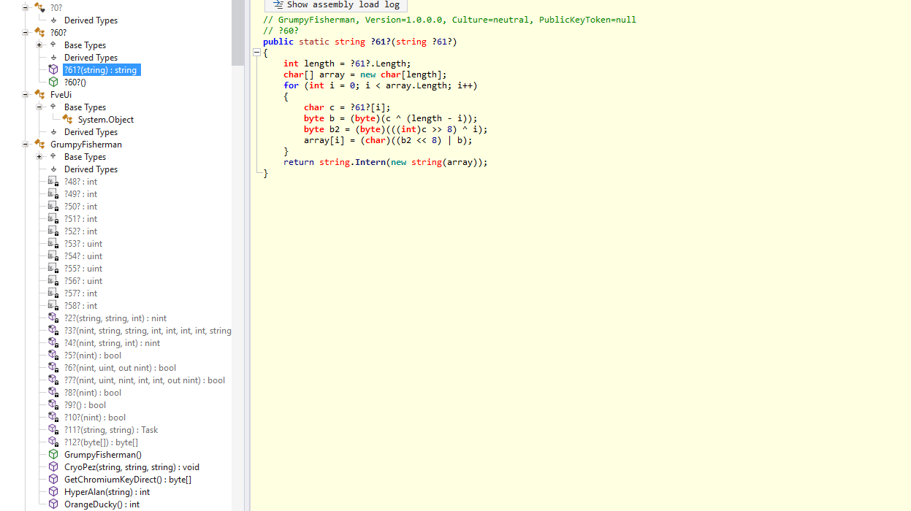

```csharp
// GrumpyFisherman, Version=1.0.0.0, Culture=neutral, PublicKeyToken=null
// ?60?
public static string ?61?(string ?61?)
{
    int length = ?61?.Length;
    char[] array = new char[length];
    for (int i = 0; i < array.Length; i++)
    {
        char c = ?61?[i];
        byte b = (byte)(c ^ (length - i));
        byte b2 = (byte)(((int)c >> 8) ^ i);
        array[i] = (char)((b2 << 8) | b);
    }
    return string.Intern(new string(array));
}
```

Hàm `?61?` nhận một string đầu vào, lấy độ dài string, tạo một mảng char output, rồi lặp qua từng ký tự. Với mỗi ký tự, nó tách xử lý low byte và high byte:

- low byte = ký tự hiện tại XOR với `(length - index)`
- high byte = high byte của ký tự hiện tại XOR với `index`
- sau đó ghép lại thành char mới

Nên khả năng cao hàm này là hàm deobfuscate.

Analyze xem hàm `?61?` được sử dụng ở đâu.

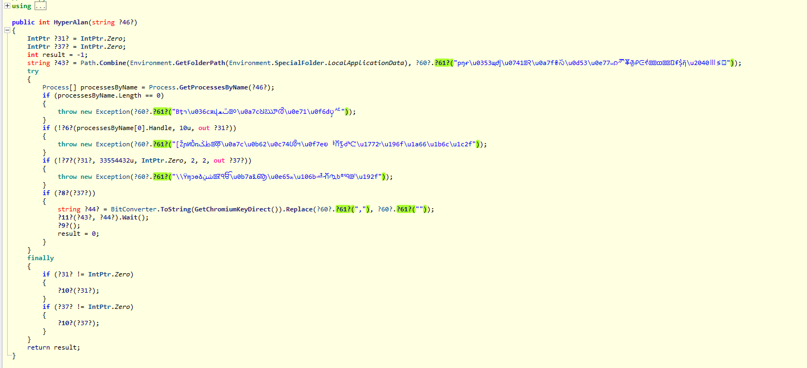

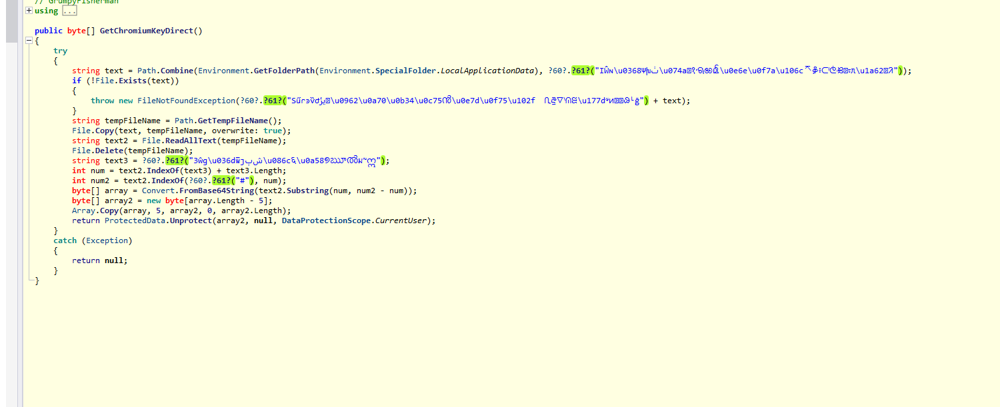

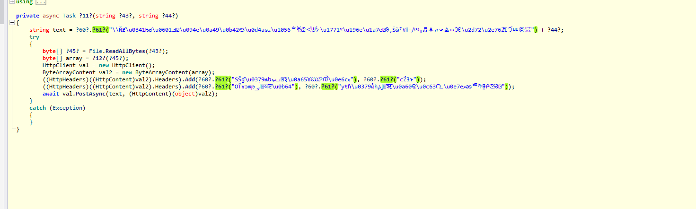

Thấy rất nhiều chuỗi đang bị obfuscate, sử dụng script với logic hàm `?61?` để deobfuscate:

```python
def deob(s):
    n = len(s)
    out = []

    for i, ch in enumerate(s):
        c = ord(ch)

        low = (c ^ (n - i)) & 0xff
        high = ((c >> 8) ^ i) & 0xff

        out.append(chr((high << 8) | low))

    return ''.join(out)

strings = [
    "SűɾͽѷԺيݬࡶ\u0962\u0a70\u0b34\u0c75ൻ\u0e7d\u0f75\u102fᅠቢ፸ᐫᕬᙦ\u177dᡩᥢᨥ᭥ᱷᴸḡ",
    "IŴɴ\u0368Ѱխٺ\u074aࡀ१੶ୠఱൔ\u0e6e\u0f7a\u106cᅐቇ፥ᑪᕩᙫᜦᡖᥰ\u1a62᭶ᱤ",
    "3ŵɡ\u036dѿյٻݾ\u086c६\u0a58୭ౠൽม༸ဣ",
    "pŋɍ\u0353щժٳ\u0741ࡉ२\u0a7f୫స\u0d53\u0e77ཡၵᅏቖ፴ᑶᕮᙻᝡᡸᥗᩆ᭦ᱯᵮṨἥ\u2040Ⅲ≶⍠",
    "Bţɿ\u036cѫվٿܫࡤ०\u0a7cଧౠ൪\u0e71\u0f6dၦᄯ",
    "[ŽɲͶѼռطݢࡺऴ\u0a7c\u0b62\u0c74ൾฯ\u0f7eၿᅣቨ፯ᑺᕻᘧ\u1772ᡪ\u196f\u1a66\u1b6c\u1c2f",
    "\\Ÿɱͻѳձشݧࡽऱੴ\u0b7a౾ൡ\u0e65ཨ\u106bᅽቭጧᑲᕪᙯᝦᡬ\u192f",
    "\\ŇɆ\u0341ЊԀ\u0601ݎࡄ\u094e\u0a49\u0b42ఆ\u0d4a๏ཆ\u1056ᅌቑፎᑆᕫᙽ\u1771ᡳ\u196e\u1a7e᭪ᱽᵥṠὼ⁷ⅶ≡⌿⑸╻♬✷⠴⤻⨺⬹Ⱗ\u2d72\u2e76⽡づㅷ㉧㌮",
    "SŠɠ\u0379ѩեپܤࡍ३\u0a65୪ౠ൪\u0e6cས",
    "cŹɫͱ",
    "OŤɤͽѭթٲܨࡐॺੲ\u0b64",
    "yŧɦ\u0379ѽհٳݥࡹॠ\u0a60ଢ\u0c63൨\u0e7eཬၼᄪት፱ᑶᕦᙣᝬ",
]

for idx, s in enumerate(strings, 1):
    decoded = deob(s)
    print(f"[{idx}] {decoded}")
```

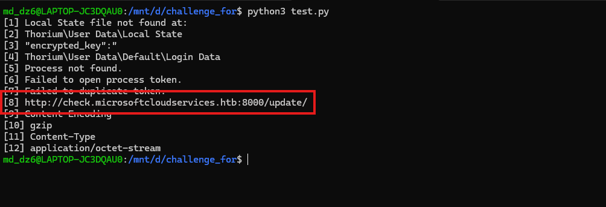

Cuối cùng thu được URL sau khi deobfuscate.

**Đáp án là:** `http://check.microsoftcloudservices.htb:8000/update/`

---

## 9. Task 8 - What is the exfiltrated username:password?

Từ những gì decrypt được ở trên, thấy được hướng tìm password và username là lấy từ `Login Data` và `Local State`.

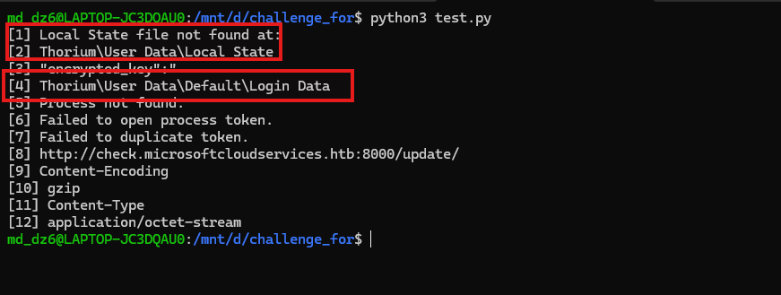

Cụ thể tìm thấy:

```text
M:\forensic\files\ROOT\Users\m.thorne\AppData\Local\Thorium\User Data\Local State
M:\forensic\files\ROOT\Users\m.thorne\AppData\Local\Thorium\User Data\Default\Login Data
```

Sau khi có file `Login Data`, sử dụng `sqlite3` để check password, username:

```bash
sqlite3 "Login Data" "SELECT username_value, password_value FROM logins;"
```

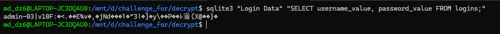

Vậy biết được password đang được mã hóa theo format Chromium/Thorium `v10`.

Flow để decrypt password là:

### Bước 1 - Query `Login Data`

Query `Login Data` để lấy:

- `username_value`: `admin-03`
- `hex(password_value)`:

```text
76313046013AFF3C2EB5B7452576A32CF96A4E64F3F704A4DDB4BA2233D780FF1D5DC8795C96AD04509FE1DF87E6BA8B285840A8A97DE992
```

### Bước 2 - Đọc `Local State` để lấy DPAPI blob

Chạy script đọc `Local State`:

- lấy `os_crypt.encrypted_key`
- base64 decode
- bỏ prefix `DPAPI`
- ghi ra file DPAPI blob

Script:

```python
import json
import base64
from pathlib import Path

local_state = Path("Local State")
output = Path("chrome_dpapi.bin")

j = json.loads(local_state.read_text(errors="ignore"))
raw = base64.b64decode(j["os_crypt"]["encrypted_key"])

blob = raw[5:] if raw.startswith(b"DPAPI") else raw
output.write_bytes(blob)

print(output)
```

### Bước 3 - Tìm DPAPI masterkey của user `m.thorne`

Tìm DPAPI masterkey của user `m.thorne` trong:

```text
AppData\Roaming\Microsoft\Protect\<SID>\
```

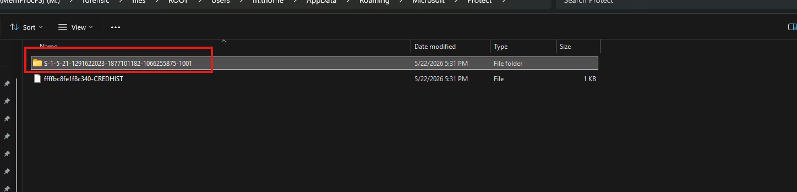

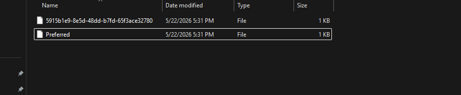

Xác định được DPAPI Protect folder của user `m.thorne` tại:

```text
AppData\Roaming\Microsoft\Protect\S-1-5-21-1291622023-1877101182-1066255875-1001
```

Bên trong có masterkey file:

```text
5915b1e9-8e5d-48dd-b7fd-65f3ace32780
```

Đây là DPAPI masterkey cần dùng để decrypt blob lấy từ `Local State`.

### Bước 4 - Lấy NTLM hash và crack password

Có 2 cách để lấy được NTLM hash của user `m.thorne`.

#### Cách 1: dùng Volatility 3

```bash
vol -f mem.elf windows.hashdump
```

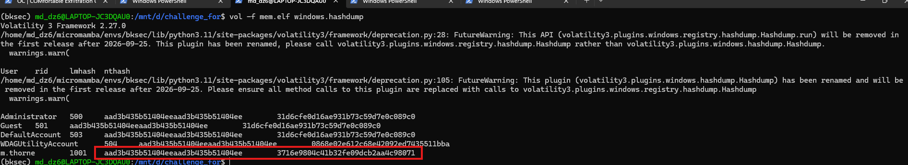

Xác định được NTLM hash của user `m.thorne` là:

```text
3716e9804c41b32fe09dcb2aa4c98071
```

Hash này sẽ được dùng để crack Windows password của user `m.thorne`.

#### Cách 2: dùng `secretsdump.py`

Sử dụng `secretsdump.py` để lấy NTLM hash trực tiếp từ các registry hive.

Cụ thể trong case này 3 file `SYSTEM`, `SAM`, `SECURITY` lấy từ:

```text
M:\registry\hive_files\0xffffa58c8c28c000-SYSTEM-unknown.reghive
M:\registry\hive_files\0xffffa58c8c98b000-SAM-unknown.reghive
M:\registry\hive_files\0xffffa58c8c97c000-SECURITY-unknown.reghive
```

Sau đây sử dụng `secretsdump.py` để dump local SAM hash từ các hive `SAM`, `SECURITY`, `SYSTEM`:

```bash
secretsdump.py -sam SAM -security SECURITY -system SYSTEM LOCAL
```

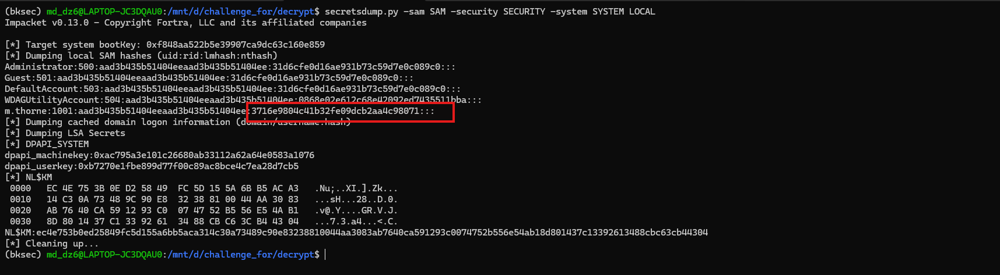

Cũng thu được NTLM hash của user `m.thorne`:

```text
3716e9804c41b32fe09dcb2aa4c98071
```

Sau khi có NTLM hash, dùng hashcat mode `1000` để crack:

```bash
echo '3716e9804c41b32fe09dcb2aa4c98071' > mthorne_ntlm.hash
hashcat -m 1000 -a 0 mthorne_ntlm.hash /usr/share/seclists/Passwords/Leaked-Databases/rockyou.txt --status
```

Kết quả crack được Windows password của user `m.thorne` là:

```text
BlueAngel25
```

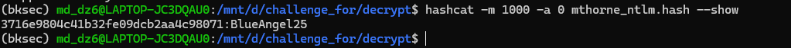

### Bước 5 - Dùng Windows password/NTLM của user để decrypt DPAPI masterkey

Sử dụng Mimikatz để decrypt DPAPI masterkey:

```text
dpapi::masterkey /in:"D:\challenge_for\decrypt\S-1-5-21-1291622023-1877101182-1066255875-1001\5915b1e9-8e5d-48dd-b7fd-65f3ace32780" /sid:S-1-5-21-1291622023-1877101182-1066255875-1001 /password:BlueAngel25
```

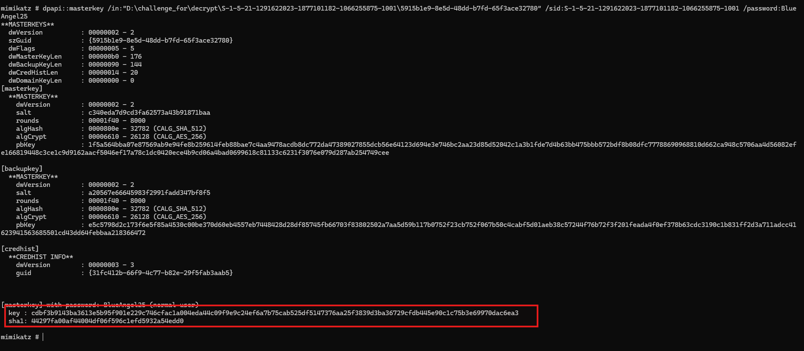

Trong output:

```text
key  = cdbf3b9143ba3613e5b95f901e229c746cfac1a004eda44c09f9e9c24ef6a7b75cab525df5147376aa25f3839d3ba36729cfdb445e90c1c75b3e69970dac6ea3
sha1 = 44297fa00af44004df06f596c1efd5932a54edd0
```

### Giải thích

- `key`: masterkey plaintext sau khi đã decrypt thành công. Đây là nội dung key thật của DPAPI masterkey.
- `sha1`: hash SHA1 của masterkey plaintext, dùng như identifier để Mimikatz tham chiếu masterkey này ở lệnh tiếp theo.

Ở bước sau chỉ cần dùng giá trị `sha1` với `dpapi::blob /masterkey:<sha1>` để decrypt DPAPI blob lấy từ `Local State`.

### Bước 6 - Decrypt DPAPI blob từ `Local State` để lấy Chromium/Thorium AES key

Tiếp tục sử dụng Mimikatz để decrypt file `chrome_dpapi.bin`.

File `chrome_dpapi.bin` là DPAPI blob được tách ra từ `Local State`. Dùng masterkey SHA1 đã decrypt ở bước trước để giải mã blob này:

```text
dpapi::blob /in:"D:\challenge_for\decrypt\chrome_dpapi.bin" /masterkey:44297fa00af44004df06f596c1efd5932a54edd0
```

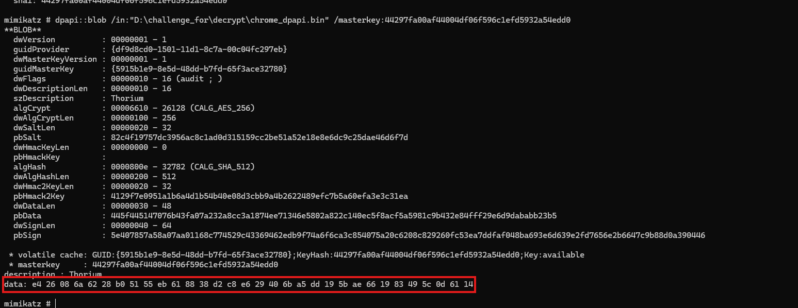

Thu được Chromium/Thorium AES key ở trường `data`:

```text
e4 26 08 6a 62 28 b0 51 55 eb 61 88 38 d2 c8 e6 29 40 6b a5 dd 19 5b ae 66 19 83 49 5c 0d 61 14
```

Ghép các byte lại thành hex key:

```text
e426086a6228b05155eb618838d2c8e629406ba5dd195bae661983495c0d6114
```

Đây là AES key dùng để decrypt `password_value` trong `Login Data` bằng AES-GCM.

### Bước 7 - Dùng AES key decrypt `password_value` trong `Login Data` bằng AES-GCM

Sử dụng script để bỏ prefix `v10`, lấy 12 bytes tiếp theo làm nonce, phần còn lại làm ciphertext + tag rồi decrypt bằng AES-GCM với key lấy từ `Local State`.

```python
from cryptography.hazmat.primitives.ciphers.aead import AESGCM

AES_KEY_HEX = "e426086a6228b05155eb618838d2c8e629406ba5dd195bae661983495c0d6114"
ENCRYPTED_PASSWORD_HEX = "76313046013AFF3C2EB5B7452576A32CF96A4E64F3F704A4DDB4BA2233D780FF1D5DC8795C96AD04509FE1DF87E6BA8B285840A8A97DE992"

key = bytes.fromhex(AES_KEY_HEX)
blob = bytes.fromhex(ENCRYPTED_PASSWORD_HEX)

if blob.startswith(b"v10"):
    nonce = blob[3:15]
    ct_tag = blob[15:]
    password = AESGCM(key).decrypt(nonce, ct_tag, None).decode()
    print(password)
```

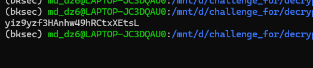

Vậy password sau khi decrypt là:

```text
yiz9yzf3HAnhw49hRCtxXEtsL
```

**Đáp án là:** `admin-03:yiz9yzf3HAnhw49hRCtxXEtsL`

---

## 10. Bảng câu hỏi - đáp án

| Task | Câu hỏi | Đáp án |
|---|---|---|
| 1 | There is an installed Service disguised as a Microsoft Component; What is the full path of the executable? | `C:\Temp\Microsoft Cache\updater.exe` |
| 2 | The injector shadows an object into the HKCU registry. Using its CLSID, what is the name of the Object? | `ADODB.Stream` |
| 3 | Following its self-duplication, the malware drops a secondary file onto the system. What is the filename of this secondary file? | `kathcjaz.quh` |
| 4 | What is the C# Class Name and the corresponding CLSID exposed to the COM API? | `GrumpyFisherman:{b3ccd9d8-ffec-4de0-8005-185a6364cedb}` |
| 5 | What is the CLSID responsible for calling the .NET function that installs the malicious Service? | `{0128ad20-af37-4421-851c-5c06de5c2b2c}` |
| 6 | One of the .NET code's functionalities is disabling BitLocker Protection. What Windows CLSID is responsible for that? | `{A7A63E5C-3877-4840-8727-C1EA9D7A4D50}` |
| 7 | What is the complete exfiltration URL without the key? | `http://check.microsoftcloudservices.htb:8000/update/` |
| 8 | What is the exfiltrated username:password? | `admin-03:yiz9yzf3HAnhw49hRCtxXEtsL` |

---

## 11. Flow

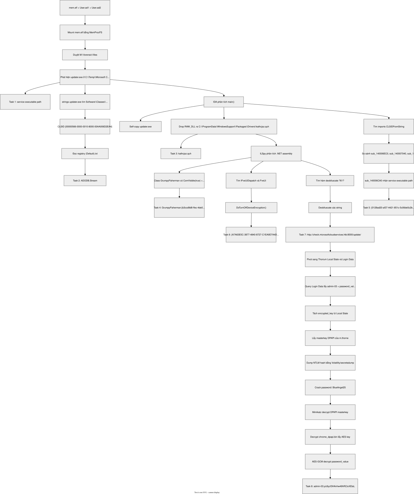

