# Challenge Trust n Betrayal


## 1. Task 1 - What is the filename of the malicious file that executed the first stage of the attack?

Với câu hỏi này đi từ event log trước, cụ thể là file:

```text
Microsoft-Windows-Sysmon%4Operational.evtx
```

nằm trong:

```text
C:\Windows\System32\winevt\logs
```

Sysmon log ghi nhận process creation, command line, parent process và working directory.

Sử dụng `EvtxECmd.exe` để convert file `.evtx` sang `.csv` để quan sát:

```powershell
.\EvtxECmd.exe -f ".\Microsoft-Windows-Sysmon%4Operational.evtx" --csv . --csvf "sysmon.csv"
```

Ở cột `ExecutableInfo`, sau khi đọc một lúc thấy được một đoạn `CommandLine` khá lạ. Cụ thể có các lệnh liên quan đến `npm/node`.

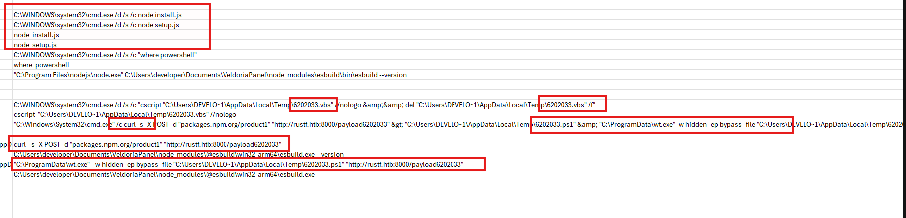

Ngoài ra còn thấy các command đáng ngờ khác như `curl` tải payload từ domain `rustf.htb`, `wscript` chạy file `.vbs` và `wt.exe` chạy ẩn với PowerShell bypass.

Đồng thời khi nhìn qua `ParentCommandLine` thấy được các process đáng ngờ phía sau đều có liên quan đến `node setup.js`.

Cụ thể, sau khi `node setup.js` được chạy, nó tiếp tục tạo ra các command như:

```cmd
C:\WINDOWS\system32\cmd.exe /d /s /c "where powershell"

```
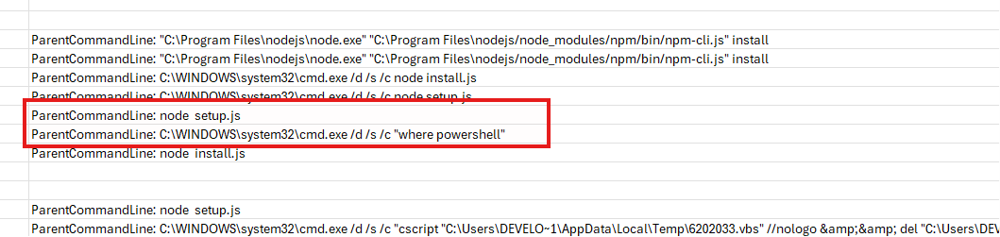


và sau đó là các lệnh chạy `cscript`, `curl` để tải payload, rồi thực thi thêm stage tiếp theo. Điều này cho thấy `setup.js` không chỉ xuất hiện trong log, mà còn là process cha dẫn đến các hành vi đáng ngờ phía sau.


Vậy có thể hiểu flow của attacker là: trong lúc `npm install`, một script JavaScript trong `node_modules` được tự động chạy. Script này là `setup.js`. Sau khi chạy, nó kiểm tra sự tồn tại của PowerShell bằng lệnh `where powershell`, sau đó tiếp tục tải payload từ domain bên ngoài và gọi các script khác để thực hiện stage tiếp theo của attack.

Vậy file thực hiện stage đầu tiên là `setup.js`.

**Đáp án là:** `setup.js`

---

## 2. Task 2 - What is the name of the malicious library or package that contained the file identified in the previous question?

Từ cột `Payload` của `CommandLine` ở câu 1 hoặc dùng `csvsql` query nhanh:

```bash
csvsql --query "
SELECT Payload
FROM sysmon
WHERE ExecutableInfo LIKE '%C:\WINDOWS\system32\cmd.exe /d /s /c node setup.js%';
" sysmon.csv | csvjson | jq .
```

thấy được nội dung:

```json
{
  "EventData": {
    "Data": [
      {
        "@Name": "RuleName",
        "#text": "-"
      },
      {
        "@Name": "UtcTime",
        "#text": "2026-05-07 16:58:41.821"
      },
      {
        "@Name": "ProcessGuid",
        "#text": "5bb49afa-c4c1-69fc-f500-000000001500"
      },
      {
        "@Name": "ProcessId",
        "#text": "6828"
      },
      {
        "@Name": "Image",
        "#text": "C:\\Windows\\System32\\cmd.exe"
      },
      {
        "@Name": "FileVersion",
        "#text": "10.0.26100.4202 (WinBuild.160101.0800)"
      },
      {
        "@Name": "Description",
        "#text": "Windows Command Processor"
      },
      {
        "@Name": "Product",
        "#text": "Microsoft® Windows® Operating System"
      },
      {
        "@Name": "Company",
        "#text": "Microsoft Corporation"
      },
      {
        "@Name": "OriginalFileName",
        "#text": "Cmd.Exe"
      },
      {
        "@Name": "CommandLine",
        "#text": "C:\\WINDOWS\\system32\\cmd.exe /d /s /c node setup.js"
      },
      {
        "@Name": "CurrentDirectory",
        "#text": "C:\\Users\\developer\\Documents\\VeldoriaPanel\\node_modules\\simple-crypto-js\\"
      },
      {
        "@Name": "User",
        "#text": "WIN-1VE69EPCP1O\\developer"
      },
      {
        "@Name": "LogonGuid",
        "#text": "5bb49afa-c3ab-69fc-6202-030000000000"
      },
      {
        "@Name": "LogonId",
        "#text": "0x30262"
      },
      {
        "@Name": "TerminalSessionId",
        "#text": "1"
      },
      {
        "@Name": "IntegrityLevel",
        "#text": "High"
      },
      {
        "@Name": "Hashes",
        "#text": "MD5=621CE4969D075555A5FA392020A70AF4,SHA256=F19653F003D2FD2046BF6CCC3FDB2D182E9B2CFCFF62C0A4155A31F4CCFDF53A,IMPHASH=4E4BD045D7AA40BF798F4D85F28D0A0F"
      },
      {
        "@Name": "ParentProcessGuid",
        "#text": "5bb49afa-c49c-69fc-ef00-000000001500"
      },
      {
        "@Name": "ParentProcessId",
        "#text": "3272"
      },
      {
        "@Name": "ParentImage",
        "#text": "C:\\Program Files\\nodejs\\node.exe"
      },
      {
        "@Name": "ParentCommandLine",
        "#text": "\"C:\\Program Files\\nodejs\\node.exe\" \"C:\\Program Files\\nodejs/node_modules/npm/bin/npm-cli.js\" install"
      },
      {
        "@Name": "ParentUser",
        "#text": "WIN-1VE69EPCP1O\\developer"
      }
    ]
  }
}
```

Từ trường `CurrentDirectory` của event này thấy process được chạy trong thư mục:

```text
C:\Users\developer\Documents\VeldoriaPanel\node_modules\simple-crypto-js\
```

Trong project Node.js, các package được cài đặt sẽ nằm trong thư mục `node_modules`, và tên thư mục ngay sau `node_modules` chính là tên package. Vì `setup.js` nằm trong `node_modules\simple-crypto-js\`, nên malicious library/package chứa file `setup.js` là `simple-crypto-js`.

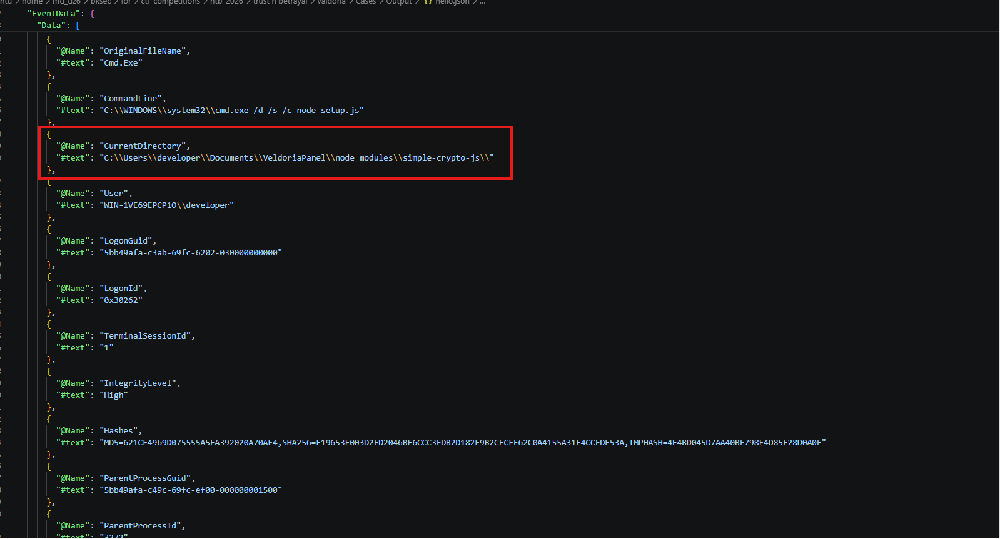

**Đáp án là:** `simple-crypto-js`

---

## 3. Task 3 - What is the name of the top-level package that was compromised by pulling in the malicious dependency?

Ở câu 2 đã biết được package chứa file malicious là `simple-crypto-js`, giờ cần tiếp tục tìm package top-level nào đã kéo `simple-crypto-js` vào project.

Đối với `npm`, khi cài các package/dependency, thông tin dependency tree thường nằm ở file `package-lock.json` và `package.json`.

Sử dụng command tìm nhanh 2 file:

```bash
find . -name "package.json" -o -name "package-lock.json"
```
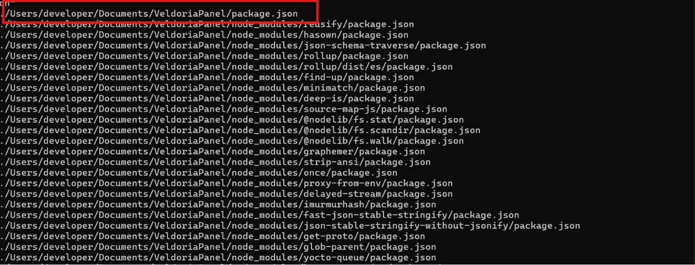

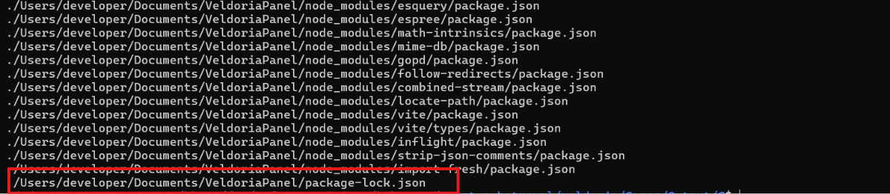

Cụ thể trong `package-lock.json` chứa nội dung cho thấy package `axios` có dependency trỏ tới `simple-crypto-js`.

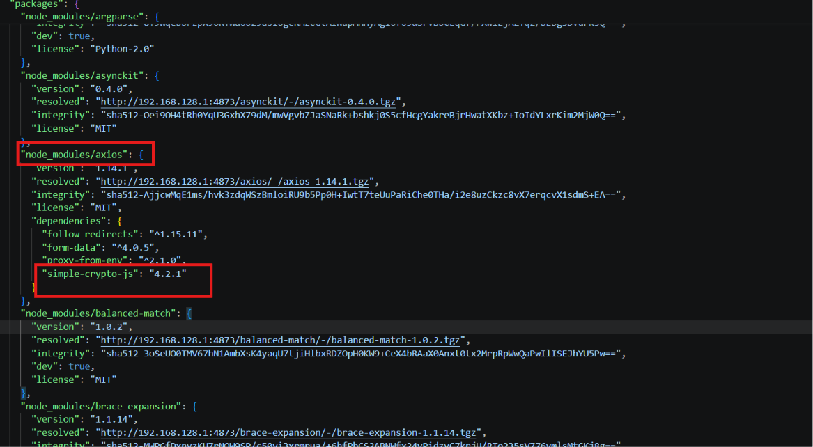

Vậy có thể thấy `axios` là package top-level đã bị compromise do kéo theo malicious dependency `simple-crypto-js`.

**Đáp án là:** `axios`

---

## 4. Task 4 - What is the domain name used for data exfiltration or payload retrieval?

Từ câu 1, khi check từ file CSV convert từ file log Sysmon thấy được flow attacker có tải payload từ bên ngoài.

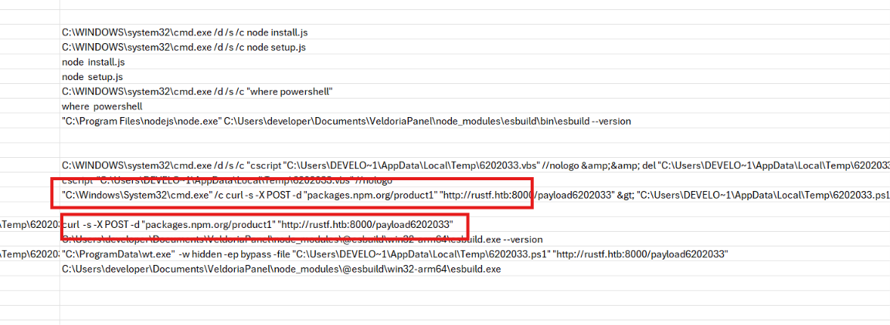

Trong command line có thể thấy lệnh `curl` truy cập tới:

```text
http://rustf.htb:8000/payload6202033
```

Vậy domain là `rustf.htb`.

**Đáp án là:** `rustf.htb`

---

## 5. Task 5 - What is the filename of the VBScript used to execute the next stage of the attack?

Vẫn trong file CSV cũng thấy được VBScript được sử dụng để chạy stage tiếp theo của attack.

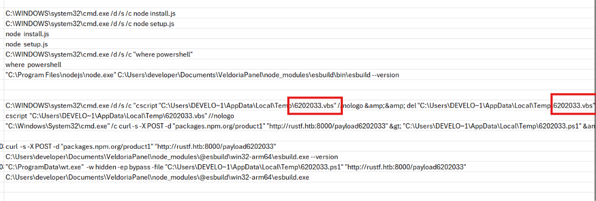

**Đáp án là:** `6202033.vbs`

---

## 6. Task 6 - What was the original name of the binary before it was renamed by the attacker to evade detection?

Chú ý hơn vào command line này có thể thấy binary được chạy là:

```text
C:\ProgramData\wt.exe
```
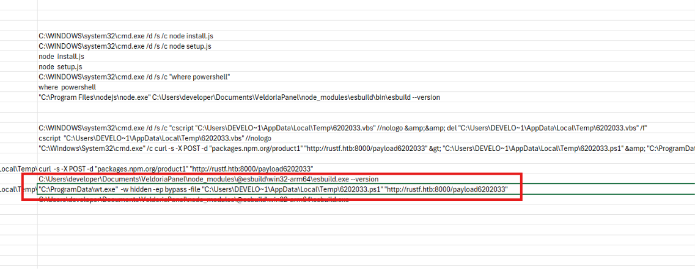

Các tham số phía sau lại rất giống PowerShell, ví dụ:

```text
-w hidden
-ep bypass
-file C:\Users\DEVELO~1\AppData\Local\Temp\6202033.ps1
```

Trong đó `-ep bypass` và `-file` là các option thường gặp khi chạy `powershell.exe` để bypass execution policy và thực thi file `.ps1`.

Khi tìm tới thông tin trong cột `Payload` của `ExecutableInfo` thấy được trường `OriginalFileName`.

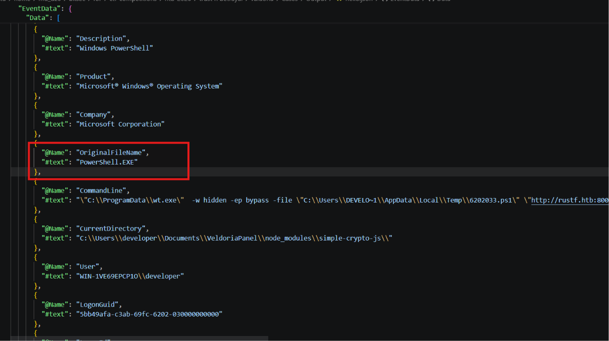

Thấy được trường `OriginalFileName` là `PowerShell.EXE`. Vậy `wt.exe` tên gốc trong metadata là `PowerShell.EXE`. Điều này cho thấy attacker đã đổi tên `powershell.exe` thành `wt.exe` để tránh bị phát hiện.

**Đáp án là:** `PowerShell.EXE`

---

## 7. Task 7 - Based on the initial entry point you identified, what is the MITRE ATT&CK Technique ID for this specific method of compromise? (TXXXX.YYY)

Từ các câu trước đã xác định được initial entry point không phải là user tải malware, mà malware được chạy trong quá trình `npm install`.

Cụ thể, Sysmon cho thấy `npm install` đã gọi:

```text
node setup.js
```

và `setup.js` nằm trong package:

```text
node_modules\simple-crypto-js\
```

Sau đó khi kiểm tra `package-lock.json`, thấy `simple-crypto-js` được kéo vào project thông qua package `axios`.

Cho thấy đây là kiểu tấn công supply chain, attacker compromise dependency/package trong hệ sinh thái `npm` để khi developer cài package thì malicious script được thực thi.

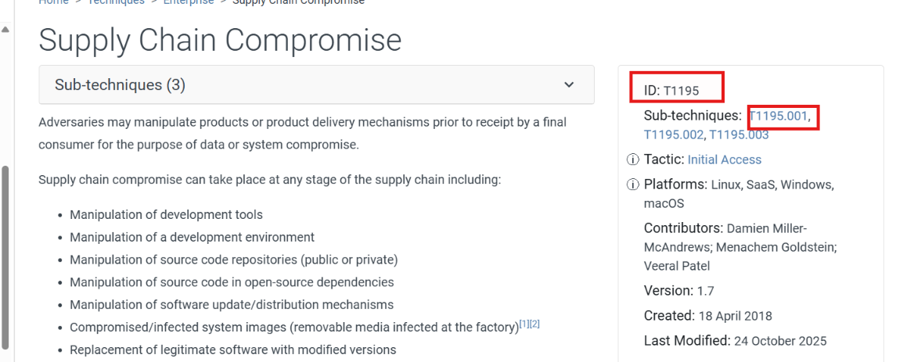

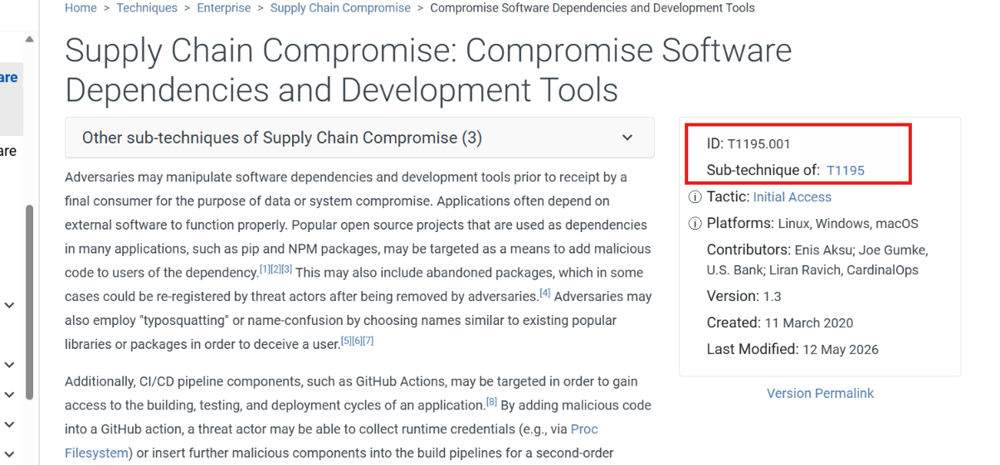

### Giải thích

MITRE ATT&CK `T1195` là **Supply Chain Compromise**, tức attacker không tấn công trực tiếp vào máy nạn nhân ngay từ đầu, mà compromise một thành phần trong chuỗi cung ứng phần mềm.

Trong case này, attacker đưa malicious code vào dependency/package trong hệ sinh thái `npm`. Khi developer chạy `npm install`, package độc hại được tải về và script `setup.js` tự động được thực thi.

Cụ thể hơn, sub-technique `T1195.001` là **Compromise Software Dependencies and Development Tools**. Kỹ thuật này mô tả việc attacker compromise thư viện, package, dependency hoặc công cụ phát triển phần mềm để từ đó thực thi mã độc trên máy của developer hoặc trong môi trường build.

**Đáp án là:** `T1195.001`

---

## 8. Task 8 - What is the Registry Key (including the Hive) that was modified to establish persistence for the malicious binary? (HKLM....)

Biết được các malware thường chỉnh sửa Registry Run key để tạo persistence trên Windows. Các key này thường nằm ở:

```text
HKCU\Software\Microsoft\Windows\CurrentVersion\Run
HKCU\Software\Microsoft\Windows\CurrentVersion\RunOnce
HKLM\Software\Microsoft\Windows\CurrentVersion\Run
HKLM\Software\Microsoft\Windows\CurrentVersion\RunOnce
```
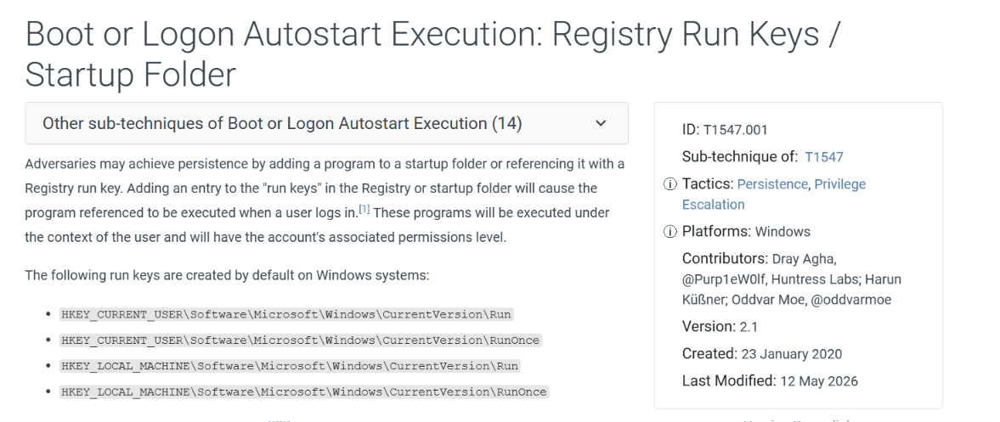

Khi một value được ghi vào Run key, chương trình được trỏ tới trong value đó sẽ tự động chạy lại khi user đăng nhập.

Sử dụng `csvsql` để query nhanh:

```bash
csvsql --query "
SELECT EventId, MapDescription, PayloadData2, PayloadData3, PayloadData4, PayloadData5, PayloadData6
FROM sysmon
WHERE PayloadData5 LIKE '%Software\Microsoft\Windows\CurrentVersion\Run%'
  OR PayloadData5 LIKE '%Software\Microsoft\Windows\CurrentVersion\RunOnce%';
" sysmon.csv | csvjson | jq .
```

Chú ý hơn vào event đầu tiên trong kết quả query.

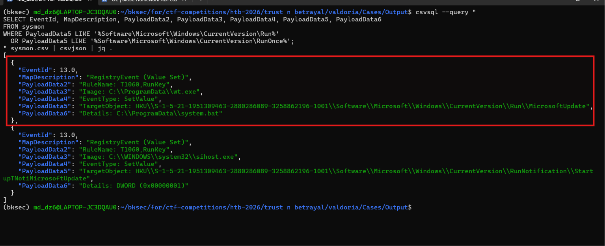

Ở trường `PayloadData3` của event đầu tiên đang sử dụng binary:

```text
C:\ProgramData\wt.exe
```

mà ở câu 6 đã khẳng định là attacker đổi tên từ `powershell.exe` thành `wt.exe` để né detection.

Đồng thời ở `PayloadData6` thấy đường dẫn được ghi vào registry value là:

```text
C:\ProgramData\system.bat
```

Điều này cho thấy khi user đăng nhập, Run key này sẽ gọi `system.bat` để tiếp tục chạy malicious binary.

Trong event này, `PayloadData5` là `TargetObject`, tức registry key/value bị chỉnh sửa. Vì vậy registry key dùng để persistence là:

```text
HKU\S-1-5-21-1951309463-2880286089-3258862196-1001\Software\Microsoft\Windows\CurrentVersion\Run\MicrosoftUpdate
```

**Đáp án là:** `HKU\S-1-5-21-1951309463-2880286089-3258862196-1001\Software\Microsoft\Windows\CurrentVersion\Run\MicrosoftUpdate`

---

## 9. Bảng câu hỏi - đáp án

| Task | Câu hỏi | Đáp án |
|---|---|---|
| 1 | What is the filename of the malicious file that executed the first stage of the attack? | `setup.js` |
| 2 | What is the name of the malicious library or package that contained the file identified in the previous question? | `simple-crypto-js` |
| 3 | What is the name of the top-level package that was compromised by pulling in the malicious dependency? | `axios` |
| 4 | What is the domain name used for data exfiltration or payload retrieval? | `rustf.htb` |
| 5 | What is the filename of the VBScript used to execute the next stage of the attack? | `6202033.vbs` |
| 6 | What was the original name of the binary before it was renamed by the attacker to evade detection? | `PowerShell.EXE` |
| 7 | Based on the initial entry point you identified, what is the MITRE ATT&CK Technique ID for this specific method of compromise? | `T1195.001` |
| 8 | What is the Registry Key that was modified to establish persistence for the malicious binary? | `HKU\S-1-5-21-1951309463-2880286089-3258862196-1001\Software\Microsoft\Windows\CurrentVersion\Run\MicrosoftUpdate` |

---


