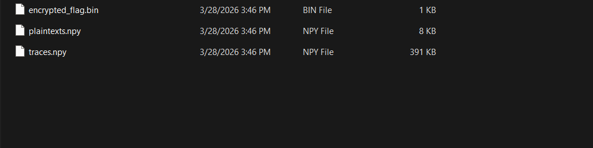
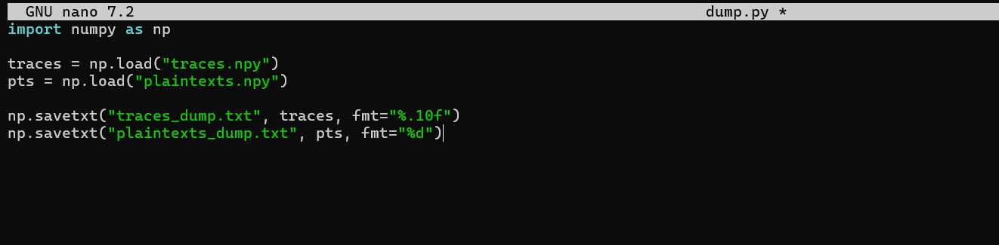
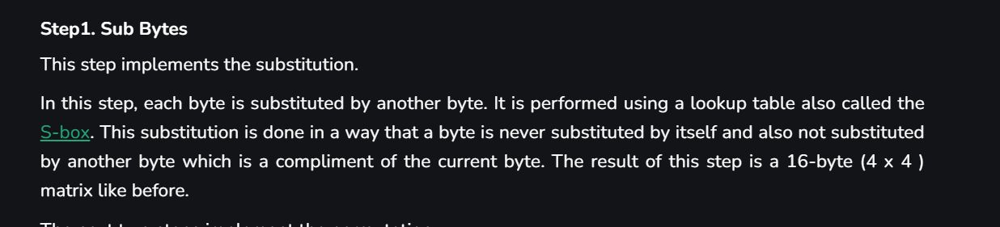
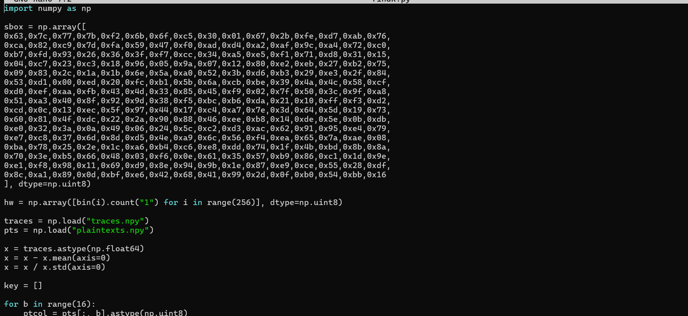
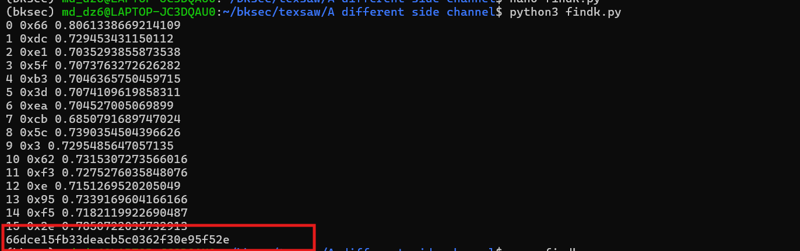
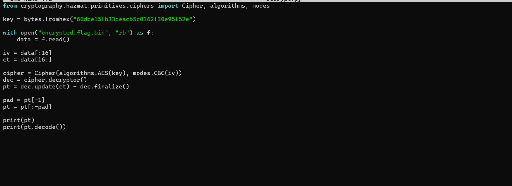
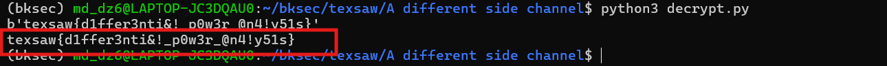

# Challenge A Different Side Channel

## 1. Đầu vào challenge

Challenge cung cấp 3 file.



Từ tên file có thể dự đoán:

- `encrypted_flag.bin` là flag đã bị mã hóa
- `traces.npy` là các trace dùng cho side-channel attack
- `plaintexts.npy` là plaintext tương ứng với từng lần đo

Vì vậy, bước đầu tiên là kiểm tra hai file `.npy` để hiểu cấu trúc dữ liệu trước.

---

## 2. Kiểm tra cấu trúc dữ liệu trong `.npy`

Sau khi dump metadata của hai file `.npy`, thấy:

- `plaintexts.npy` chứa **500 plaintext**
- mỗi plaintext dài **16 byte**
- `traces.npy` chứa **500 trace đo**
- mỗi trace có **100 sample**



### Nhận định ban đầu

Từ đây có thể suy ra:

- vì plaintext có kích thước đúng **16 byte**, thuật toán mục tiêu rất có thể là **AES**
- các trace được dùng để thực hiện **side-channel attack**
- mục tiêu là khôi phục **16 byte khóa bí mật**, rồi dùng khóa đó để giải mã `encrypted_flag.bin`


### Kiến thức ngoài lề

Trong side-channel attack, **trace** là “dấu vết” thu được khi thiết bị đang thực hiện mã hóa. Trace thường biểu diễn:

- mức tiêu thụ điện năng
- hoặc một dạng rò rỉ vật lý khác theo thời gian

Mỗi lần thiết bị mã hóa một plaintext, ta thu được một dãy số thực; dãy số đó chính là một trace.

Vì vậy, khi thấy dữ liệu có dạng:

```text
(500, 100)
```

thì có thể hiểu là:

- có **500 lần đo**
- mỗi lần đo gồm **100 điểm mẫu** (*sample*)

Mỗi trace sẽ tương ứng với một plaintext. Từ đó có thể đem so sánh mô hình rò rỉ giả định với trace thật để suy ra khóa bí mật.

---

## 3. Hướng tiếp cận: CPA trên bước đầu của AES

Vì nghi đây là AES và đề đã cung cấp plaintext, ta tận dụng tính chất của vòng đầu AES:

- mỗi byte plaintext sẽ được XOR với byte khóa tương ứng
- kết quả đó đi qua **S-box**
- giá trị trung gian này thường tạo ra rò rỉ vật lý có liên hệ với **Hamming Weight**

Vì chưa biết byte khóa đúng là gì, có thể thử toàn bộ:

```text
0..255
```

Với mỗi giá trị khóa giả định `k`:

1. tính giá trị trung gian `Sbox[p ^ k]`
2. chuyển nó sang **Hamming Weight**
3. dùng đó làm mô hình rò rỉ giả định
4. so sánh với trace thật bằng **correlation**

Byte khóa nào cho correlation lớn nhất sẽ được chọn là byte đúng.



### Ý nghĩa

Vì AES-128 có **16 byte khóa**, nên chỉ cần lặp lại quá trình này cho đủ 16 vị trí là có thể khôi phục toàn bộ khóa.

---

## 4. Script CPA để khôi phục khóa

Vì vậy, bước tiếp theo là viết script để thử toàn bộ 256 khả năng cho từng byte khóa và chọn giá trị có correlation lớn nhất.



```python
import numpy as np

sbox = np.array([
    0x63,0x7c,0x77,0x7b,0xf2,0x6b,0x6f,0xc5,0x30,0x01,0x67,0x2b,0xfe,0xd7,0xab,0x76,
    0xca,0x82,0xc9,0x7d,0xfa,0x59,0x47,0xf0,0xad,0xd4,0xa2,0xaf,0x9c,0xa4,0x72,0xc0,
    0xb7,0xfd,0x93,0x26,0x36,0x3f,0xf7,0xcc,0x34,0xa5,0xe5,0xf1,0x71,0xd8,0x31,0x15,
    0x04,0xc7,0x23,0xc3,0x18,0x96,0x05,0x9a,0x07,0x12,0x80,0xe2,0xeb,0x27,0xb2,0x75,
    0x09,0x83,0x2c,0x1a,0x1b,0x6e,0x5a,0xa0,0x52,0x3b,0xd6,0xb3,0x29,0xe3,0x2f,0x84,
    0x53,0xd1,0x00,0xed,0x20,0xfc,0xb1,0x5b,0x6a,0xcb,0xbe,0x39,0x4a,0x4c,0x58,0xcf,
    0xd0,0xef,0xaa,0xfb,0x43,0x4d,0x33,0x85,0x45,0xf9,0x02,0x7f,0x50,0x3c,0x9f,0xa8,
    0x51,0xa3,0x40,0x8f,0x92,0x9d,0x38,0xf5,0xbc,0xb6,0xda,0x21,0x10,0xff,0xf3,0xd2,
    0xcd,0x0c,0x13,0xec,0x5f,0x97,0x44,0x17,0xc4,0xa7,0x7e,0x3d,0x64,0x5d,0x19,0x73,
    0x60,0x81,0x4f,0xdc,0x22,0x2a,0x90,0x88,0x46,0xee,0xb8,0x14,0xde,0x5e,0x0b,0xdb,
    0xe0,0x32,0x3a,0x0a,0x49,0x06,0x24,0x5c,0xc2,0xd3,0xac,0x62,0x91,0x95,0xe4,0x79,
    0xe7,0xc8,0x37,0x6d,0x8d,0xd5,0x4e,0xa9,0x6c,0x56,0xf4,0xea,0x65,0x7a,0xae,0x08,
    0xba,0x78,0x25,0x2e,0x1c,0xa6,0xb4,0xc6,0xe8,0xdd,0x74,0x1f,0x4b,0xbd,0x8b,0x8a,
    0x70,0x3e,0xb5,0x66,0x48,0x03,0xf6,0x0e,0x61,0x35,0x57,0xb9,0x86,0xc1,0x1d,0x9e,
    0xe1,0xf8,0x98,0x11,0x69,0xd9,0x8e,0x94,0x9b,0x1e,0x87,0xe9,0xce,0x55,0x28,0xdf,
    0x8c,0xa1,0x89,0x0d,0xbf,0xe6,0x42,0x68,0x41,0x99,0x2d,0x0f,0xb0,0x54,0xbb,0x16
], dtype=np.uint8)

hw = np.array([bin(i).count("1") for i in range(256)], dtype=np.uint8)

traces = np.load("traces.npy")
pts = np.load("plaintexts.npy")

x = traces.astype(np.float64)
x = x - x.mean(axis=0)
x = x / x.std(axis=0)

key = []

for b in range(16):
    ptcol = pts[:, b].astype(np.uint8)
    best_k = 0
    best_corr = -1.0

    for k in range(256):
        hyp = hw[sbox[np.bitwise_xor(ptcol, k)]].astype(np.float64)
        hyp = hyp - hyp.mean()
        hyp = hyp / hyp.std()

        corr = np.abs((hyp[:, None] * x).mean(axis=0)).max()

        if corr > best_corr:
            best_corr = corr
            best_k = k

    key.append(best_k)
    print(b, hex(best_k), best_corr)

print(bytes(key).hex())
```

---

## 5. Giải thích chi tiết script

### 5.1. Bảng `sbox`

```python
sbox = np.array([...], dtype=np.uint8)
```

Đây là bảng thay thế của AES ở bước **SubBytes**, gồm 256 giá trị ứng với 256 khả năng của một byte.

Trong CPA, ta cần mô phỏng đúng giá trị trung gian của AES, nên `sbox` là thành phần bắt buộc.

---

### 5.2. Bảng `hw`

```python
hw = np.array([bin(i).count("1") for i in range(256)], dtype=np.uint8)
```

Bảng này lưu **Hamming Weight** của từng giá trị từ `0..255`.

Ví dụ:

- `0x00` có Hamming Weight = `0`
- `0x01` có Hamming Weight = `1`
- `0xFF` có Hamming Weight = `8`

---

### 5.3. Lặp qua từng byte khóa

```python
for b in range(16):
```

AES-128 có **16 byte khóa**, nên script xử lý từng vị trí byte một. Với mỗi `b`, ta lấy toàn bộ byte plaintext ở vị trí đó:

```python
ptcol = pts[:, b].astype(np.uint8)
```

`ptcol` là một vector dài 500 phần tử, tương ứng với 500 plaintext ở cùng vị trí byte `b`.

---

### 5.4. Thử toàn bộ 256 khóa giả định

```python
for k in range(256):
```

Với mỗi byte khóa, ta thử toàn bộ các giá trị từ `0..255`. Brute-force trên **một byte**.

---

### 5.5. Tạo mô hình rò rỉ giả định

```python
hyp = hw[sbox[np.bitwise_xor(ptcol, k)]].astype(np.float64)
```

Đây là dòng quan trọng nhất của CPA.

Flow của nó là:

1. tính `ptcol ^ k`
2. đưa kết quả qua `sbox`
3. lấy Hamming Weight của giá trị sau S-box

Tức là mô hình hóa rò rỉ:

```text
HW(Sbox[p ^ k])
```

với:

- `p` là plaintext byte
- `k` là khóa giả định

Nếu `k` là byte khóa đúng, mô hình này sẽ tương quan mạnh hơn với trace thật.

---

### 5.6. Chuẩn hóa mô hình giả định

```python
hyp = hyp - hyp.mean()
hyp = hyp / hyp.std()
```

Giống như trace, vector giả định `hyp` cũng được chuẩn hóa để việc tính correlation ổn định hơn.

---

### 5.7. Tính correlation với toàn bộ trace

```python
corr = np.abs((hyp[:, None] * x).mean(axis=0)).max()
```

Ý nghĩa:

- `hyp[:, None]` biến vector `hyp` thành cột
- nhân với toàn bộ trace `x`
- lấy trung bình theo trục mẫu đo
- thu được correlation giữa mô hình giả định và từng sample point
- lấy giá trị tuyệt đối lớn nhất làm điểm số của khóa giả định đó
- khóa nào khớp mạnh nhất sẽ lấy.

---

### 5.8. Chọn khóa tốt nhất cho từng byte

```python
if corr > best_corr:
    best_corr = corr
    best_k = k
```

Sau khi thử hết `0..255`, khóa có correlation lớn nhất sẽ được chọn là byte khóa đúng cho vị trí hiện tại.

Cuối cùng:

```python
key.append(best_k)
print(b, hex(best_k), best_corr)
```

lưu byte khóa vào danh sách `key`.

---

## 6. Kết quả khôi phục khóa

Sau khi chạy script, thu được khóa:

```text
66dce15fb33deacb5c0362f30e95f52e
```



Đây chính là **AES key** cần dùng để giải mã file `encrypted_flag.bin`.

---

## 7. Giải mã `encrypted_flag.bin`

Sau khi có được key, bước tiếp theo là dùng key đó để decrypt file `.bin`.



Mục tiêu ở bước này là:

- dùng đúng AES key vừa tìm được
- giải mã dữ liệu trong `encrypted_flag.bin`
- lấy ra flag ở dạng plaintext

---

## 8. Flag

Kết quả cuối cùng thu được flag:

```text
texsaw{d1ffer3nti&!_p0w3r_@n4!y51s}
```



---

## 9. Tóm tắt flow phân tích

```text
encrypted_flag.bin + traces.npy + plaintexts.npy
   |
   v
dump metadata của traces.npy và plaintexts.npy
   |
   v
nhận ra:
- 500 plaintext, mỗi plaintext 16 byte
- 500 trace, mỗi trace 100 sample
   |
   v
suy đoán thuật toán là AES
   |
   v
dùng CPA trên bước đầu:
HW(Sbox[p ^ k])
   |
   v
với mỗi byte khóa:
thử toàn bộ k = 0..255
   |
   v
so sánh mô hình rò rỉ giả định với trace thật bằng correlation
   |
   v
chọn byte khóa có correlation lớn nhất
   |
   v
lặp đủ 16 vị trí để thu toàn bộ AES key
   |
   v
thu được key:
66dce15fb33deacb5c0362f30e95f52e
   |
   v
dùng key để giải mã encrypted_flag.bin
   |
   v
lấy flag
```

---


