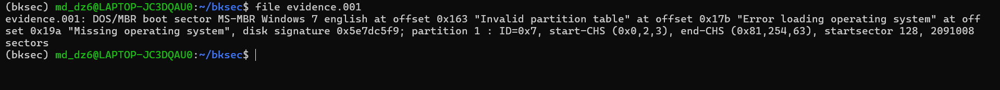
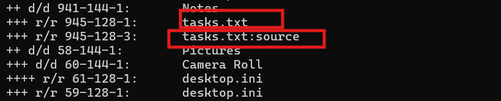
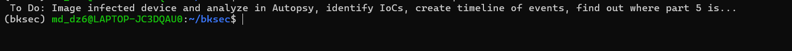
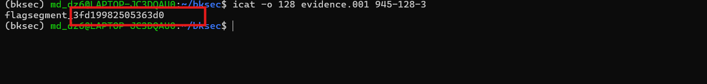
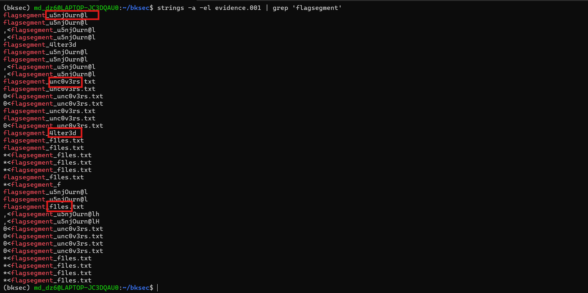

# Challenge Journal

## 1. Đầu vào challenge

Đầu vào challenge cung cấp 1 file:

```text
evidence.001
```

Thử kiểm tra nhanh loại file bằng lệnh:

```bash
file evidence.001
```

Kết quả trả về cho thấy đây là một **raw disk image** có **MBR**.



---

## Kiến thức ngoài lề 

### DOS/MBR boot sector

**MBR** (*Master Boot Record*) là sector đầu tiên của ổ đĩa, thường là **512 byte đầu tiên**.  
Nó chứa hai thành phần chính:

- **boot code**: đoạn mã dùng để khởi động máy
- **partition table**: bảng mô tả các phân vùng trên đĩa

### Boot sector

**Boot sector** là vùng đầu của ổ đĩa hoặc đầu của một phân vùng, chứa thông tin phục vụ quá trình khởi động.

### Disk signature

Trong kết quả có:

```text
disk signature 0x5e7dc5f9
```

Đây là một giá trị nhận dạng đĩa trong MBR, thường được Windows dùng để phân biệt các disk với nhau.

---

## 2. Phân tích thông tin phân vùng

Kết quả còn cho thấy:

- **partition 1**
- **ID = 0x7**

Partition type `0x07` thường tương ứng với:

- **NTFS**
- **exFAT**
- hoặc **HPFS** cũ

### NTFS

**NTFS** (*New Technology File System*) là filesystem rất phổ biến trên Windows hiện đại.

#### Đặc điểm chính

- hỗ trợ file lớn và phân vùng lớn
- có phân quyền file / folder
- có journal để ghi lại thay đổi
- hỗ trợ các tính năng như:
  - nén
  - mã hóa
  - **ADS** (*Alternate Data Streams*)

### exFAT

**exFAT** (*Extended File Allocation Table*) là filesystem Microsoft thiết kế cho:

- USB
- thẻ nhớ
- ổ di động

#### Đặc điểm chính

- hỗ trợ file lớn hơn FAT32
- đơn giản hơn NTFS
- tương thích tốt với nhiều thiết bị
- thường dùng trên USB, SD card, external drive

### HPFS

**HPFS** (*High Performance File System*) là filesystem cũ do IBM/Microsoft dùng cho **OS/2** từ rất lâu.


Kết quả còn cho biết:

```text
startsector 128
```

Điều này có nghĩa là **phân vùng 1 bắt đầu tại sector 128**.

- sector `0` là MBR
- phân vùng 1 **không** bắt đầu ngay từ đầu file image nó bắt đầu tại **sector 128**

Ngoài ra còn có:

```text
2091008 sectors
```

Đây là kích thước của phân vùng 1, tính theo số sector.

Phần:

```text
start-CHS ... end-CHS ...
```

là thông tin địa chỉ kiểu **CHS**:

- **Cylinder**
- **Head**
- **Sector**

Đây là cách biểu diễn cũ của bảng phân vùng.

---

## 3. Nhận định từ kết quả `file`

Từ toàn bộ output trên, có thể kết luận:

- đây là một **raw disk image**
- image có **MBR**
- phân vùng 1 bắt đầu tại **sector 128**
- phân vùng đó có **partition type 0x7**
- nên nhiều khả năng đây là một phân vùng **NTFS**

Từ đây, hướng xử lý hợp lý là dùng **Sleuth Kit** để đọc trực tiếp disk image.

## Kiến thức ngoài lề về Sleuth Kit

**Sleuth Kit** là bộ công cụ thường được dùng để:

- đọc trực tiếp dữ liệu từ disk image
- liệt kê file / folder
- trích xuất nội dung file
- phân tích các artifact filesystem

---

## 4. Liệt kê toàn bộ file trong phân vùng

Để liệt kê toàn bộ file / folder có trong phân vùng 1, dùng lệnh:

```bash
fls -r -o 128 evidence.001
```

Trong đó:

- `fls` dùng để liệt kê file / thư mục
- `-r` là đệ quy
- `-o 128` là chỉ ra offset sector nơi phân vùng bắt đầu



Từ kết quả liệt kê, thấy file:

```text
tasks.txt
```

đi kèm với stream tên:

```text
source
```

---

## 5. Phân tích

Trên NTFS, một file có thể có:

- **main data stream**: dữ liệu chính
- và thêm các **ADS**: nơi có thể giấu dữ liệu phụ

Nếu `tasks.txt` có kèm stream `source`, thì có khả năng dữ liệu ẩn được giấu trong ADS này.

Do đó, Nên đọc nội dung chính của `tasks.txt`. Dùng lệnh:

```bash
icat -o 128 evidence.001 945-128-1
```



### Giải thích

- `945-128-1` là entry tương ứng với **main data stream** của `tasks.txt`

Trong nội dung có đoạn `find out where part 5 is` cho thấy phần thứ 5 của flag không nằm ngay trong nội dung chính và nó đang được giấu ở một vị trí khác

---

## 6. Đọc ADS `source`

Thử đọc stream phụ bằng lệnh:

```bash
icat -o 128 evidence.001 945-128-3
```




### Kết quả

Từ stream này, tìm được **part 5** là:

```text
3fd19982505363d0
```

---

## 7. Tìm các phần còn lại của flag

Sau khi đã có `part5`, tiếp tục dựa vào format của challenge.

Vì biết các mảnh flag đi kèm chuỗi `flagsegment`, thử dùng `strings` kết hợp `grep` để đi tìm các phần còn lại trong image:

```bash
strings -a -el evidence.001 | grep 'flagsegment'
```



### Kết quả

Từ đây thu được **4 mảnh còn lại của flag**.

---

## 12. Flag

Sau khi ghép toàn bộ các mảnh lại, flag là:

```text
texsaw{u5njOurn@l_unc0v3rs_4lter3d_f1les_3fd19982505363d0}
```

---

## 13. Tóm tắt flow phân tích

```text
evidence.001
   |
   v
dùng `file` để kiểm tra loại image
   |
   v
xác định đây là raw disk image có MBR
   |
   v
nhận ra partition 1 bắt đầu tại sector 128
   |
   v
suy ra cần dùng offset 128 khi phân tích
   |
   v
dùng `fls -r -o 128` để liệt kê file
   |
   v
phát hiện tasks.txt có kèm ADS source
   |
   v
dùng `icat -o 128 ... 945-128-1` đọc nội dung chính
   |
   v
thấy gợi ý "find out where part 5 is"
   |
   v
dùng `icat -o 128 ... 945-128-3` đọc ADS source
   |
   v
lấy được part5 = 3fd19982505363d0
   |
   v
dùng `strings -a -el` + `grep flagsegment`
   |
   v
tìm 4 phần còn lại
   |
   v
ghép thành flag hoàn chỉnh
```

---

