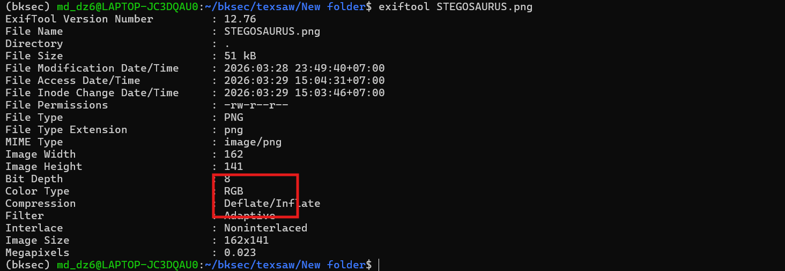
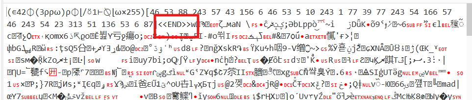
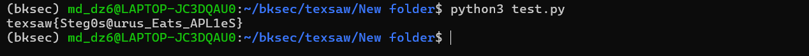

# Challenge Jurrasic Parse

## 1. Đầu vào challenge

Challenge cung cấp 1 file `STEGOSAURUS.png` đầu vào.

Bước đầu tiên là check bằng `exiftool` trước để lấy thông tin cơ bản của ảnh.

```bash
exiftool STEGOSAURUS.png
```

Từ đây thấy được **color type** của ảnh.



---

## 2. Nhận định ban đầu

Đồng thời, từ tên file có thể đoán được challenge liên quan tới các challenge stego, cụ thể là kiểu giấu thông tin bằng **LSB**.

Vì vậy, thử extract LSB.



## Kiến thức ngoài lề

**LSB** (*Least Significant Bit*) là bit có trọng số thấp nhất trong một giá trị nhị phân.  
Với ảnh số, việc thay đổi bit này chỉ làm giá trị màu đổi rất nhỏ, gần như không thể nhận ra bằng mắt thường.

LSB thường được lợi dụng để giấu thông tin bên trong ảnh.

---

## 3. Kết quả sau khi extract LSB

Sau khi extract LSB, mình thấy xuất hiện chuỗi:

```text
<<END>>
```

Đây là một dấu hiệu cho thấy dữ liệu ẩn đã được trích ra, và phần nội dung nằm trước marker này nhiều khả năng chính là payload cần phân tích.

---

## 4. Phân tích payload thu được

Payload thu được là một biểu thức **APL**.

### Giải thích

Biểu thức APL chứa các ký hiệu đặc trưng của APL như:

- `∊`
- `⌽`
- `⍴`
- `⍵`
- `⍉`

Trong đó, `⍵` biểu thị đầu vào của hàm, ở đây chính là ảnh gốc.

Biểu thức này thực hiện một loạt phép biến đổi trên ma trận pixel của ảnh như:

- đưa giá trị màu về dạng số nguyên
- đảo trục
- lấy giá trị nhỏ nhất theo kênh màu
- đảo / rotate dữ liệu
- reshape lại mảng
- rồi flatten thành vector 1 chiều

Cuối cùng, dãy chỉ số trong ngoặc vuông được dùng để lấy ra các phần tử cụ thể từ vector đó; các giá trị thu được chính là mã ASCII của flag.

Vì vậy, bước tiếp theo là viết script để mô phỏng lại flow của biểu thức APL này trên dữ liệu ảnh.

---

## 5. Script mô phỏng biểu thức APL

```python
from PIL import Image
import numpy as np
import re

payload = "(∊42⌽(3⍴⍴⍵)⍴⌽⌊/⍤1⊢⍉⌊⍵×255)[46 53 88 243 57 43 156 6 46 53 5 10 243 1 77 39 77 243 54 166 57 46 243 54 23 313 51 136 53 6 87]"
image_path = "STEGOSAURUS.png"

idx = list(map(int, re.search(r"\[(.*?)\]", payload).group(1).split()))

img = np.array(Image.open(image_path)).astype(np.float64) / 255.0

w = np.transpose(img, (2, 0, 1))
x = np.transpose(np.floor(w * 255).astype(int))
x = x.min(axis=-1)
x = np.flip(x, axis=-1)
x = np.resize(x.flatten(), w.size).reshape(w.shape)
x = np.roll(x, -42, axis=-1)

flag = ''.join(chr(x.flatten()[i - 1]) for i in idx)
print(flag)
```
---

## 6. Kết quả cuối

Chạy script trên thì ra được flag là:

```text
texsaw{Steg0s@urus_Eats_APL1eS}
```


---

## 7. Flow phân tích

```text
STEGOSAURUS.png
   |
   v
dùng `exiftool` để kiểm tra thông tin cơ bản của ảnh
   |
   v
nhận ra ảnh có dấu hiệu phù hợp để nghi stego kiểu LSB
   |
   v
extract LSB
   |
   v
thu được payload có chứa marker `<<END>>`
   |
   v
xác định phần trước marker là dữ liệu cần phân tích
   |
   v
nhận ra payload là một biểu thức APL
   |
   v
phân tích ý nghĩa các toán tử APL:
đảo trục -> lấy min theo kênh màu -> flip/rotate -> reshape -> flatten
   |
   v
viết script Python mô phỏng lại đúng flow của biểu thức APL trên dữ liệu ảnh
   |
   v
lấy danh sách chỉ số trong ngoặc vuông
   |
   v
áp dụng toàn bộ phép biến đổi lên ma trận pixel
   |
   v
dùng các chỉ số đó để lấy giá trị từ vector cuối cùng
   |
   v
chuyển các giá trị thu được thành mã ASCII
   |
   v
ghép lại thành flag
```
---