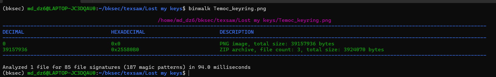
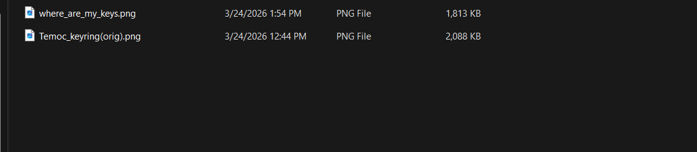
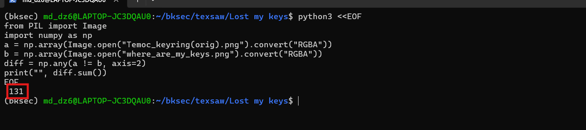
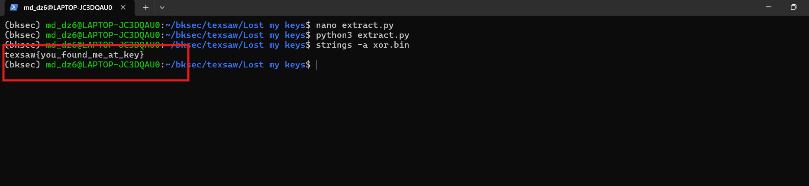

# Challenge Lost My Key

## 1. Đầu vào challenge

Challenge cung cấp file:

```text
Temoc_keyring.png
```

check xem có gì ẩn dưới file không:

```bash
binwalk Temoc_keyring.png
```



---

## 2. Cắt phần ZIP bị giấu ở cuối file

Thử dùng lệnh:

```bash
dd if=Temoc_keyring.png of=hidden.zip bs=1 skip=39157936
```

Sau khi extract, thu được **2 file mới**.



---

## 3. So sánh hai ảnh sau khi extract

Khi mở 2 ảnh mới ra thì trông **giống hệt nhau**, nhưng dung lượng file lại khác nhau khá nhiều. Vì vậy, bước tiếp theo là kiểm tra xem hai ảnh khác nhau **bao nhiêu pixel**. Thử so sánh trực tiếp từng pixel:

```python
from PIL import Image
import numpy as np

a = np.array(Image.open("Temoc_keyring(orig).png").convert("RGBA"))
b = np.array(Image.open("where_are_my_keys.png").convert("RGBA"))

diff = np.any(a != b, axis=2)
print(diff.sum())
```

Kết quả cho thấy hai ảnh chỉ khác nhau ở `131 pixel`



---

## 4. Trích dữ liệu bit từ sự khác nhau giữa hai ảnh

### Nhận định

Nếu coi mỗi pixel là 1 bit thì khi xor 2 ảnh này với nhau, các bit giống nhau khi xor ra 0, các bit khác nhau xor ra 1 rồi ghi vào 1 file bin rồi đọc dữ liệu từ file bin đó.

```python
from PIL import Image
import numpy as np

a = np.array(Image.open("Temoc_keyring(orig).png").convert("RGBA"))
b = np.array(Image.open("where_are_my_keys.png").convert("RGBA"))

diff = np.any(a != b, axis=2).astype(np.uint8)
bits = ''.join(str(x) for x in diff.flatten())

n = (len(bits) // 8) * 8
raw = bytes(int(bits[i:i+8], 2) for i in range(0, n, 8))

with open("xor.bin", "wb") as f:
    f.write(raw)
```

Kết quả là thu được file `xor.bin`

---

## 5. Đọc dữ liệu trong `xor.bin`

Sau khi có file nhị phân, chỉ cần đọc các chuỗi có thể in ra được

```bash
strings -a xor.bin
```

Từ đó thu được flag:

```text
texsaw{you_found_me_at_key}
```



---

## 8. Tóm tắt flow phân tích

```text
Temoc_keyring.png
   |
   v
dùng binwalk kiểm tra cấu trúc file
   |
   v
phát hiện ZIP bị nhúng ở cuối PNG
   |
   v
dùng dd cắt phần ZIP ra thành hidden.zip
   |
   v
extract ZIP và thu được 2 ảnh
   |
   v
nhận ra 2 ảnh nhìn giống nhau nhưng dung lượng khác nhau
   |
   v
so sánh pixel
   |
   v
phát hiện khác 131 pixel
   |
   v
xor 2 file
   |
   v
ghi ra xor.bin
   |
   v
dùng strings đọc chuỗi trong xor.bin
   |
   v
lấy flag
```

---
