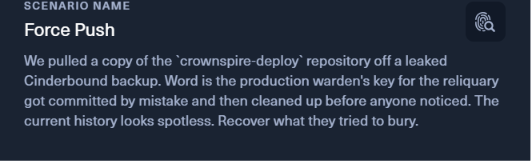
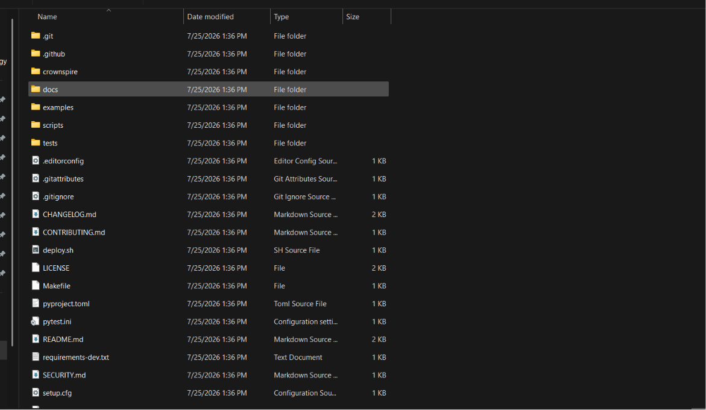
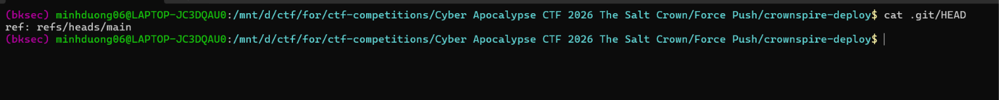
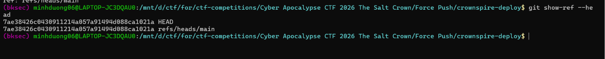
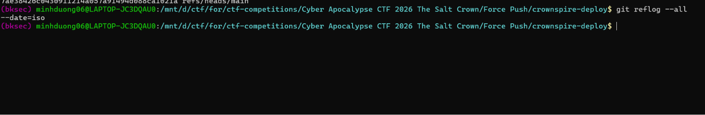
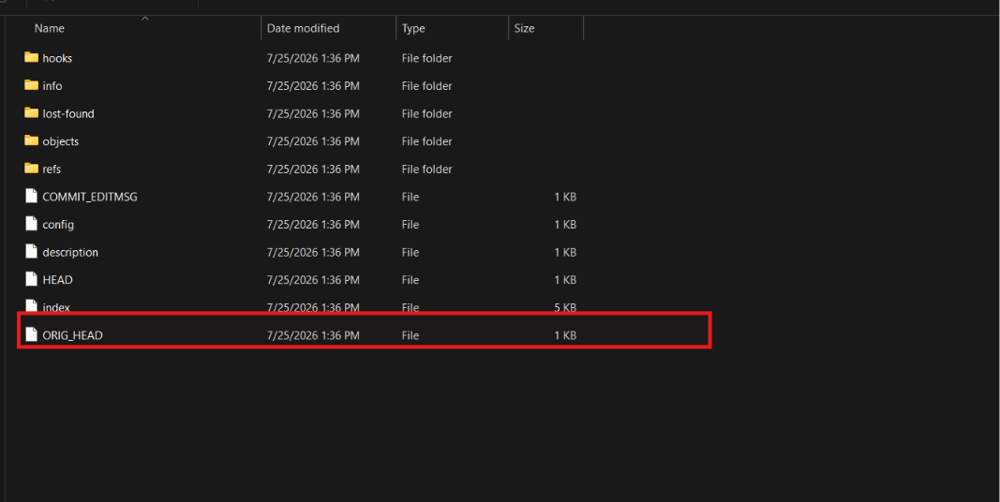
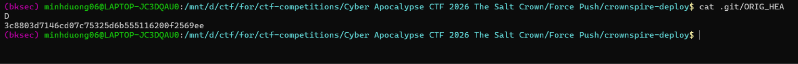
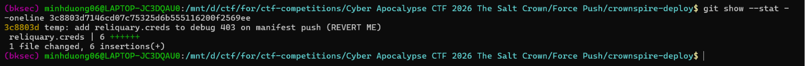
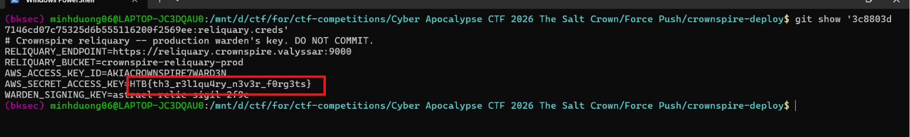

# Challenge Force Push

## 1. Đầu vào challenge

Một bản sao của repository crownspire-deploy đã được lấy từ bản backup Cinderbound bị rò rỉ. Khóa production của warden dùng để truy cập reliquary từng bị commit nhầm, sau đó người quản trị đã xóa commit và force-push lại repository nên lịch sử hiện tại trông hoàn toàn sạch.



Vì vậy, Khả năng mục tiêu của challenge là kiểm tra dữ liệu Git còn sót lại để khôi phục nội dung mà họ đã cố che giấu.



## 2. Phân tích các manh mối trong repository

### 2.1. Phân tích `README.md`

Trước tiên,  đọc `README.md` để hiểu chức năng của repository và xác định loại dữ liệu cần tìm.

README cho biết `crownspire-deploy` là công cụ dùng để ký các manifest rồi đẩy chúng lên một kho lưu trữ có tên là `reliquary`:

> “The reliquary is an S3-compatible store; every manifest is signed with the wardens' key...”
Như vậy, repository này sử dụng hai nhóm thông tin nhạy cảm:

- Khóa của warden dùng để ký manifest.
- Credential dùng để truy cập reliquary.
README cũng cho biết credential được lấy từ biến môi trường:

> “Credentials are read from the environment.”
Khi chạy ở môi trường local, các credential được lưu trong file `.env`. Tuy nhiên, README nhấn mạnh rằng credential không được phép tồn tại trong repository:

> “Credentials never live in the repo.”
Đặc biệt, README còn cảnh báo:

> “If you ever see a `.env` or `*.creds` file tracked here, something has gone wrong -- rotate the warden's key immediately (`scripts/rotate-key.sh`)...”
Từ đây có thể rút ra manh mối đầu tiên: file bị commit nhầm nhiều khả năng là `.env` hoặc một file có phần mở rộng `.creds`.

---

### 2.2. Phân tích `CONTRIBUTING.md`

Tiếp theo, đọc `CONTRIBUTING.md` để kiểm tra các quy tắc dành cho người đóng góp vào repository.

File này ghi rõ:

> “Never commit secrets. Credentials live in the warden's vault, in CI secrets, or in your untracked `.env`.”
Điều này xác nhận rằng credential chỉ được phép nằm ở một trong ba nơi:

- Warden's vault.
- CI repository secrets.
- File `.env` không được Git theo dõi.
Ngay sau đó, file tiếp tục cảnh báo:

> “`.env` and `*.creds` are gitignored -- do not `git add -f` them ‘just to test something’.”
Cụm từ `git add -f` rất đáng chú ý. Vì `.env` và `*.creds` đã nằm trong `.gitignore`, muốn commit chúng thì người dùng phải cố tình ép Git thêm file bằng tùy chọn `-f`.

Cụm “just to test something” cũng gợi ý một tình huống có thể đã xảy ra: một developer từng ép thêm file credential vào commit để debug hoặc kiểm thử, sau đó mới nhận ra sai sót và cố xóa nó khỏi lịch sử.

Vì vậy, `CONTRIBUTING.md` củng cố giả thuyết rằng file bị lộ có thể là:

- `.env`; hoặc
- một file mang tên nào đó với phần mở rộng `.creds`.
---

### 2.3. Phân tích `SECURITY.md`

Sau đó, tôi đọc `SECURITY.md`. Đây là file quan trọng nhất vì nó mô tả gần như chính xác cách sự cố trong đề bài có thể đã được xử lý.

Đầu tiên, file xác định rõ dữ liệu nào là bí mật:

> “The warden's signing key and the reliquary access keys are secrets.”
Các bí mật này được lưu trong vault, CI secrets hoặc local `.env`:

> “They live in the warden's vault, in CI repository secrets, and (locally, for development only) in an untracked `.env`.”
File tiếp tục nhắc lại:

> “`.env` and `*.creds` are gitignored. Never `git add -f` them.”
Quan trọng nhất là phần hướng dẫn xử lý khi secret bị đưa vào một commit:

> “If a secret ever lands in a commit:
> 1. Rotate it immediately.
> 2. Scrub it from history (`git filter-repo` / BFG) and force-push.
> 3. Remember that rewriting history does not delete the old objects until a `gc`/`prune` runs.”
Đoạn này mô tả đúng tình huống trong đề bài:

1. Credential bị commit nhầm.
2. Người quản trị scrub commit khỏi lịch sử.
3. Repository được force-push để lịch sử hiện tại trông sạch.
4. Tuy nhiên, các Git object cũ chưa chắc đã bị xóa.
Việc rewrite history chỉ làm cho commit cũ không còn được tham chiếu bởi branch hiện tại. Nội dung commit và blob cũ vẫn có thể tồn tại trong `.git/objects` cho tới khi Git chạy garbage collection hoặc prune.

Để hiểu vì sao dữ liệu đã bị xóa khỏi lịch sử vẫn có thể được khôi phục, trước hết cần hiểu cách Git biểu diễn một repository bên trong thư mục `.git`.

Git không lưu mỗi commit như một bản sao thư mục độc lập. Thay vào đó, Git sử dụng nhiều loại object liên kết với nhau:

```text
File trong repository
        |
        | Nội dung file được Git băm
        v
+-------------------------+
| Blob object             |
|                         |
| Chỉ chứa nội dung file  |
| Không chứa tên file     |
+-------------------------+
        ^
        |
        | Tree lưu tên file và SHA của blob
        |
+-----------------------------------+
| Tree object                       |
|                                   |
| secret.creds  ---> Blob B1        |
| README.md     ---> Blob B2        |
| src/          ---> Tree T2        |
+-----------------------------------+
        ^
        |
        | Commit trỏ tới tree đại diện
        | cho toàn bộ snapshot
        |
+-----------------------------------+
| Commit object                     |
|                                   |
| tree   -> Tree T1                 |
| parent -> Commit trước đó         |
| author, thời gian, commit message |
+-----------------------------------+
        ^
        |
        | Branch chỉ là một ref chứa
        | SHA của commit hiện tại
        |
+---------------------+
| refs/heads/main     |
|        -> Commit C1 |
+---------------------+
```

Mối quan hệ giữa các object có thể rút gọn như sau:

```text
refs/heads/main
       |
       v
   Commit C1
       |
       +------> Parent commit
       |
       v
    Tree T1
       |
       +------> README.md       -> Blob B2
       |
       +------> secret.creds    -> Blob B1
       |
       +------> src/            -> Tree T2
```

Điểm quan trọng là nội dung credential nằm trong `Blob B1`. Dù file không còn xuất hiện trong working tree, blob đó vẫn có thể tồn tại trong `.git/objects`.

Khi lịch sử bị rewrite, Git không chỉnh sửa trực tiếp commit cũ vì Git object là bất biến: chỉ cần nội dung, tree hoặc parent thay đổi thì SHA của object cũng thay đổi. Công cụ rewrite sẽ tạo ra một chuỗi commit mới không chứa file secret:

```text
Lịch sử cũ:

refs/heads/main
       |
       v
A ---- B ---- C
             |
             v
          Tree T1
             |
             v
          Blob B1
       chứa credential

Lịch sử mới sau khi rewrite:

refs/heads/main
       |
       v
A' --- B' --- C'
              |
              v
           Tree T1'
      không còn đường dẫn
         tới Blob B1
```

Các commit `A'`, `B'`, `C'` có SHA khác lịch sử cũ vì tree hoặc parent của chúng đã thay đổi.

Sau khi force-push, branch trên remote được chuyển sang commit mới:

```text
Trước force-push:

refs/heads/main ---> Commit C

Sau force-push:

refs/heads/main ---> Commit C'
```

Tuy nhiên, việc branch không còn trỏ tới commit cũ không có nghĩa các object cũ đã bị xóa vật lý:

```text
                    refs/heads/main
                           |
                           v
A' -------- B' ----------- C'       reachable

A --------- B ------------ C        unreachable
                            |
                            v
                         Tree T1
                            |
                            v
                         Blob B1
                   vẫn chứa credential
```

Trong trạng thái này:

- `C'` là commit reachable vì branch `main` có thể đi tới nó.
- `C` không còn branch hoặc tag tham chiếu nên trở thành unreachable commit.
- Tree và blob chỉ được lịch sử cũ sử dụng cũng có thể trở thành unreachable.
- Các object unreachable vẫn có thể còn trong `.git/objects`.
Chỉ khi Git thực hiện garbage collection và các object đã hết thời gian lưu giữ, chúng mới có thể bị xóa:

```text
Unreachable commit
        |
        v
Unreachable tree
        |
        v
Unreachable blob
        |
        | Git garbage collection / prune
        v
Object có thể bị xóa vật lý khỏi `.git/objects`
```

Như vậy, force-push chỉ làm lịch sử hiện tại trông sạch bằng cách thay đổi con trỏ branch. Nếu bản backup còn giữ Git object database trước khi các object cũ bị garbage collection, commit, tree và blob chứa credential vẫn có khả năng được khôi phục.

---

## 3. Kết luận

Từ ba file trên, có thể xây dựng chuỗi suy luận như sau:

1. Repository sử dụng warden signing key và reliquary access credentials.
2. Các credential này thường nằm trong `.env` hoặc một file `*.creds`.
3. Những file đó đã được gitignore và không được phép commit.
4. Tuy nhiên, developer có thể đã dùng `git add -f` để ép commit file credential trong lúc debug hoặc kiểm thử.
5. Sau khi phát hiện sai sót, họ scrub commit khỏi lịch sử và force-push repository.
6. Lịch sử hiện tại vì thế trông sạch, nhưng commit hoặc blob cũ vẫn có thể còn trong Git object database nếu chưa chạy `gc` hoặc `prune`.
## 4. Kiểm tra dấu vết còn lại trong Git

Từ các manh mối đã phân tích,  không tiếp tục tìm credential trong các file hiện tại. Thay vào đó, cần kiểm tra xem Git còn lưu tham chiếu hoặc object nào thuộc lịch sử cũ hay không.

Luồng kiểm tra sẽ được thực hiện theo thứ tự:

```text
Lịch sử hiện tại trông sạch
            |
            v
Kiểm tra các ref và reflog
            |
            +---- tìm thấy SHA cũ ----+
            |                         |
            |                         v
            |                  Mở commit cũ
            |                         |
            |                         v
            |               Kiểm tra file đã thay đổi
            |
            +---- không tìm thấy -----+
                                      |
                                      v
                        Quét Git object database
                                      |
                                      v
                     Tìm dangling/unreachable commit
                                      |
                                      v
                       Mở tree và blob của commit
```

### 4.1. Kiểm tra các Git ref hiện tại

Trước tiên, kiểm tra `HEAD` đang trỏ tới đâu:

```bash
cat .git/HEAD
```

Kết quả:

```text
ref: refs/heads/main
```



Điều này cho biết `HEAD` đang trỏ gián tiếp tới branch `main`.

Tiếp theo, tôi liệt kê toàn bộ ref mà Git hiện còn nhận diện:

```bash
git show-ref --head
```

Kết quả:

```text
7ae38426c0430911214a057a91494d088ca1021a HEAD
7ae38426c0430911214a057a91494d088ca1021a refs/heads/main
```



Cả `HEAD` và branch `main` đều đang trỏ tới commit `7ae38426c0430911214a057a91494d088ca1021a`. Không có branch, tag hoặc ref thông thường nào trỏ tới một commit cũ khác.

---

### 4.2. Kiểm tra reflog

Tiếp theo, kiểm tra reflog để xem `HEAD` hoặc các branch đã từng trỏ tới commit nào trước đó:

```bash
git reflog --all --date=iso
```

Lệnh không trả về kết quả.



Điều này cho thấy repository hiện không còn bản ghi reflog có thể sử dụng.

---

### 4.3. Kiểm tra `ORIG_HEAD`

Quan sát bên trong thư mục `.git`, tôi thấy vẫn tồn tại file `ORIG_HEAD`.



Đây là một pseudo-ref mà Git có thể dùng để lưu vị trí trước đó của `HEAD` sau một số thao tác làm thay đổi lịch sử. đọc nội dung file này:

```bash
cat .git/ORIG_HEAD
```

Kết quả:

```text
3c8803d7146cd07c75325d6b555116200f2569ee
```



Trong khi branch `main` hiện tại trỏ tới `7ae38426c0430911214a057a91494d088ca1021a, `ORIG_HEAD` lại lưu một SHA khác là `3c8803d7146cd07c75325d6b555116200f2569ee Vì vậy, đây là commit cũ cần được kiểm tra.

---

### 4.4. Mở commit cũ

xem thông tin tổng quát và thống kê thay đổi của commit:

```bash
git show --stat --oneline 3c8803d7146cd07c75325d6b555116200f2569ee
```

Kết quả:

```text
3c8803d temp: add reliquary.creds to debug 403 on manifest push (REVERT ME)
 reliquary.creds | 6 ++++++
 1 file changed, 6 insertions(+)
```



Commit message cho biết một file tên `reliquary.creds` đã được thêm tạm thời để debug lỗi `403` khi đẩy manifest, đồng thời có ghi chú `REVERT ME`.

Chi tiết này khớp với những manh mối trước đó:

- credential có thể nằm trong file `*.creds`;
- file loại này không được phép commit;
- developer có thể từng ép thêm file chỉ để kiểm thử hoặc debug;
- sau đó commit bị loại khỏi lịch sử hiện tại.
---

### 4.5. Đọc file trực tiếp từ commit cũ

File này không còn trong working tree hiện tại, nhưng Git vẫn có thể đọc blob của nó thông qua cú pháp:

```text
<commit>:<đường_dẫn_file>
```

đọc trực tiếp file bằng:

```bash
git show '3c8803d7146cd07c75325d6b555116200f2569ee:reliquary.creds'
```

Kết quả:

```text
# Crownspire reliquary -- production warden's key. DO NOT COMMIT.
RELIQUARY_ENDPOINT=https://reliquary.crownspire.valyssar:9000
RELIQUARY_BUCKET=crownspire-reliquary-prod
AWS_ACCESS_KEY_ID=AKIACROWNSPIRE7WARD3N
AWS_SECRET_ACCESS_KEY=HTB{th3_r3l1qu4ry_n3v3r_f0rg3ts}
WARDEN_SIGNING_KEY=astrael-relic-sigil-2f9c
```

File này chứa đầy đủ credential production của reliquary, bao gồm endpoint, bucket, access key, secret access key và warden signing key.

Flag nằm trong giá trị của biến `AWS_SECRET_ACCESS_KEY`:

```text
HTB{th3_r3l1qu4ry_n3v3r_f0rg3ts}
```



## 5. Flag

Vậy flag là: 
```text
HTB{th3_r3l1qu4ry_n3v3r_f0rg3ts}
```
---