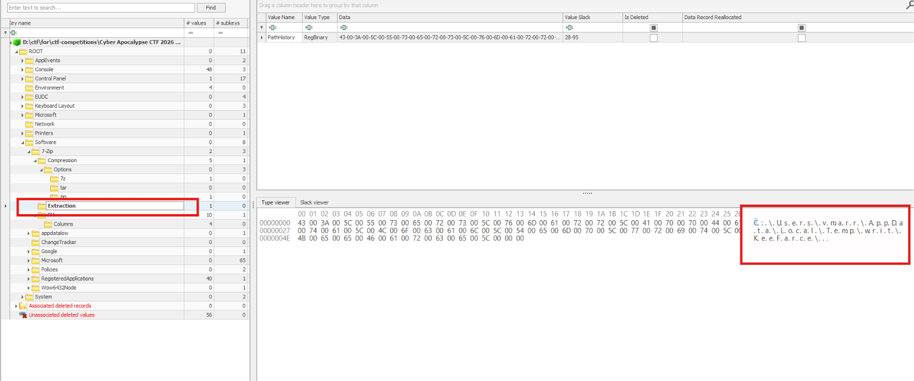
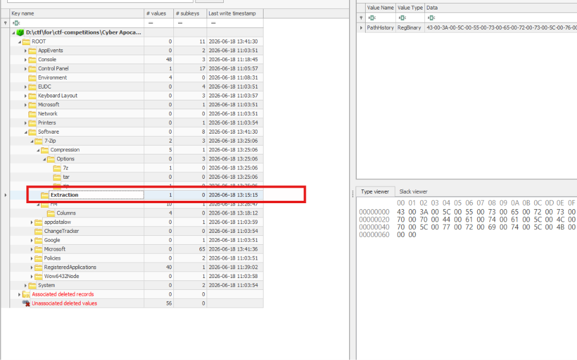
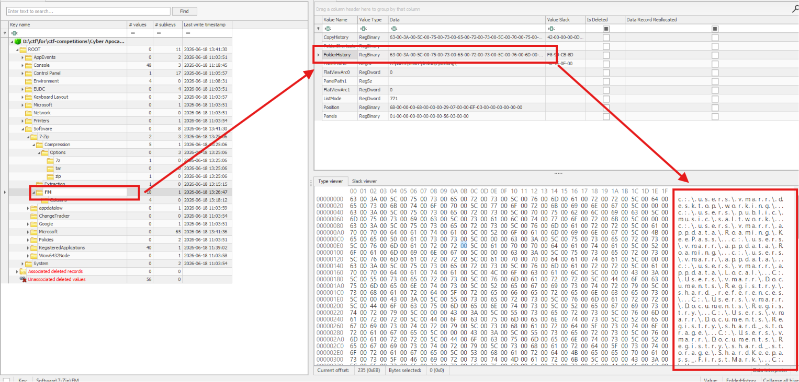
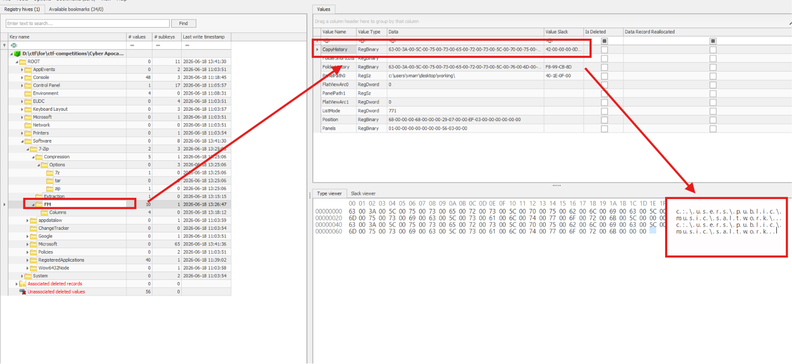
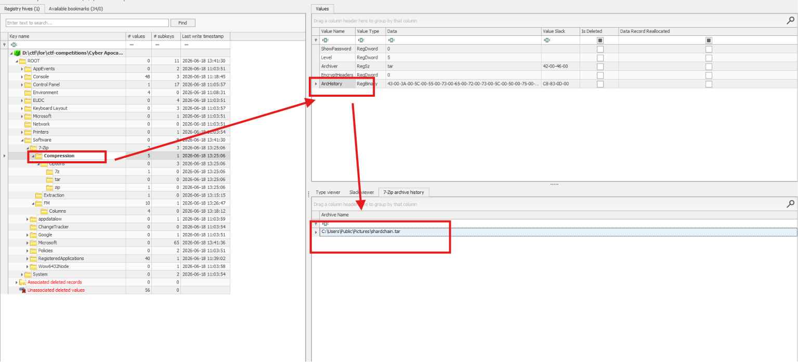
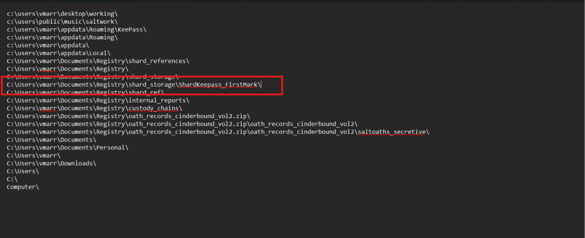
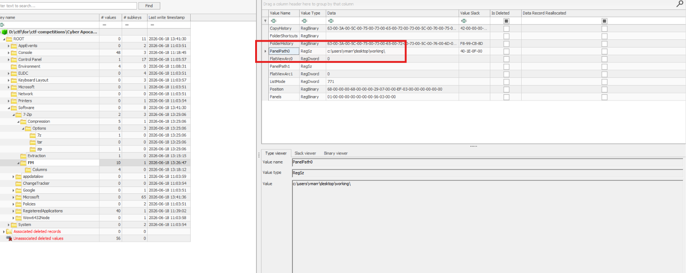

# Challenge The Compressed Truth

Challenge cung cấp các file Registry, vì vậy sử dụng `RegistryExplorer.exe` để đọc và phân tích các hive.

---

## Task 1 - CROWQUILL did not break the lock — they took the key while it was still held. A tool was brought for one purpose: extract secrets from memory before they could be put away. What is its name?

### Hướng phân tích

Challenge chỉ cung cấp các file Registry nên sử dụng `RegistryExplorer.exe` để đọc các file này. Trong câu hỏi có nhắc tới **“extract secrets”** nên nghĩ ngay tới các tool sử dụng để extract file.

### Artifact cần kiểm tra

Kiểm tra các file hive, trong file `NTUSER.DAT` của user `vmarr`, tại mục `Software` có dấu vết của công cụ 7-Zip. Khi mở sâu hơn theo đường dẫn:

```text
Software\7-Zip\Extraction
```

và xem giá trị:

```text
PathHistory
```

thấy đường dẫn:

```text
C:\Users\vmarr\AppData\Local\Temp\writ\KeeFarce\
```



### Kết quả

Tên thư mục cuối cùng cho biết công cụ đã được giải nén là `KeeFarce`.

### Đáp án

```text
KeeFarce
```

---

## Task 2 - The Registry keeps time as faithfully as it keeps names. The moment CROWQUILL's tool first touched the system is preserved in the artifact. When was the tool extracted? (YYYY-MM-DD hh:mm:ss)

### Hướng phân tích

Câu hỏi này cần lấy **Last Write Time** của Registry key:

```text
Software\7-Zip\Extraction
```

Cụ thể có thể lấy được ở cột `Last write timestamp`.



### Đáp án

```text
2026-06-18 13:15:15
```

---

## Task 3 - One archive file caught the operative's eye during enumeration, its contents inspected before staging began. What is the deepest folder that was enumerated inside the archive file?

### Hướng phân tích

Câu này hỏi về thư mục sâu nhất mà CROWQUILL đã duyệt bên trong một file archive. Với 7-Zip, `FM` (File Manager) là thành phần giao diện dùng để mở archive và duyệt các thư mục bên trong 7-Zip.

Trong đó:

```text
FolderHistory
```

lưu lịch sử những đường dẫn mà người dùng đã duyệt bằng 7-Zip File Manager, kể cả đường dẫn ảo bên trong file `.zip`.

### Artifact cần kiểm tra



Parse giá trị `FolderHistory` cho dễ đọc thì thu được đường dẫn:

```text
c:\users\vmarr\desktop\working\
c:\users\public\music\saltwork\
c:\users\vmarr\appdata\Roaming\KeePass\
c:\users\vmarr\appdata\Roaming\
c:\users\vmarr\appdata\
c:\users\vmarr\appdata\Local\
C:\Users\vmarr\Documents\Registry\shard_references\
C:\Users\vmarr\Documents\Registry\
C:\Users\vmarr\Documents\Registry\shard_storage\
C:\Users\vmarr\Documents\Registry\shard_storage\ShardKeepass_FirstMark\
C:\Users\vmarr\Documents\Registry\shard_ref\
C:\Users\vmarr\Documents\Registry\internal_reports\
C:\Users\vmarr\Documents\Registry\custody_chains\
C:\Users\vmarr\Documents\Registry\oath_records_cinderbound_vol2.zip\
C:\Users\vmarr\Documents\Registry\oath_records_cinderbound_vol2.zip\oath_records_cinderbound_vol2\
C:\Users\vmarr\Documents\Registry\oath_records_cinderbound_vol2.zip\oath_records_cinderbound_vol2\saltoaths_secretive\
C:\Users\vmarr\Documents\
C:\Users\vmarr\Documents\Personal\
C:\Users\vmarr\
C:\Users\vmarr\Downloads\
C:\Users\
C:\
Computer\
```

### Kết quả

Thư mục nằm sâu nhất trong archive là `saltoaths_secretive` ở đường dẫn:

```text
C:\Users\vmarr\Documents\Registry\oath_records_cinderbound_vol2.zip\oath_records_cinderbound_vol2\saltoaths_secretive\
```

### Đáp án

```text
saltoaths_secretive
```

---

## Task 4 - Before exfiltration comes collection — files pulled from their places and gathered where the operative controls. Where did CROWQUILL stage the stolen records?

### Hướng phân tích

Với 7-Zip, `CopyHistory` được dùng để lưu lịch sử các đường dẫn đích trong thao tác Copy của 7-Zip File Manager.

Vì câu hỏi yêu cầu xác định nơi các file bị thu thập và tập trung trước khi exfiltration nên tìm tới value:

```text
CopyHistory
```



### Kết quả

Vậy thư mục đích được sử dụng để gom các file trước khi nén là:

```text
C:\Users\Public\Music\saltwork
```

### Đáp án

```text
C:\Users\Public\Music\saltwork
```

---

## Task 5 - The stolen records were compressed and sealed for the journey out — made small enough for channels that do not ask questions. What is the name of the archive prepared for exfiltration?

### Hướng phân tích

Câu hỏi nhắc đến việc nén dữ liệu và tạo archive, nên thay vì kiểm tra `FM` ở `Extraction`, chuyển sang nhánh:

```text
Software\7-Zip\Compression
```

Trong đó, value:

```text
ArcHistory
```

lưu lịch sử đường dẫn và tên các archive từng được tạo bằng 7-Zip.



### Đáp án

```text
C:\Users\Public\Pictures\shardchain.tar
```

---

## Task 6 - One file above all others — holding keys to every shard, every custodian, every oath. Whoever holds this holds the right to reconstruct authority older than any crown. Where was it stored?

### Hướng phân tích

Câu hỏi hỏi file quan trọng đó được lưu ở đâu, còn artifact chỉ có Registry chứ không có toàn bộ filesystem.

Như đã giải thích, trong 7-Zip, value:

```text
Software\7-Zip\FM\FolderHistory
```

lưu các thư mục mà người dùng đã mở hoặc duyệt bằng 7-Zip File Manager.

### Kết quả

Trong danh sách các đường dẫn tìm được ở câu 3, chú ý hơn vào:

```text
C:\Users\vmarr\Documents\Registry\shard_storage\ShardKeepass_FirstMark\
```



Tên thư mục `ShardKeepass_FirstMark` phù hợp với mô tả trong câu hỏi về một kho giữ các khóa quan trọng.

### Đáp án

```text
C:\Users\vmarr\Documents\Registry\shard_storage\ShardKeepass_FirstMark\
```

---

## Task 7 - When staging was complete and the archive sealed, the trail ends in one folder — where enumeration stopped. Where did CROWQUILL conclude their operations while using the 7zip?

### Hướng phân tích

Vì câu hỏi hỏi **“where enumeration stopped”** — tức vị trí cuối cùng còn mở trong giao diện 7-Zip — nên cần tìm trạng thái của panel trong 7-Zip File Manager, không chỉ lịch sử các thư mục từng đi qua.

Tìm tới Registry key:

```text
Software\7-Zip\FM
```

Trong đó:

- `PanelPath0`: đường dẫn đang được lưu cho panel thứ nhất của File Manager.
- `PanelPath1`: đường dẫn của panel thứ hai nếu dùng giao diện hai panel.

### Kết quả

Khi kiểm tra value `PanelPath0`, thấy được nơi cuối cùng đang mở trong File Manager là:

```text
C:\Users\vmarr\Desktop\working\
```



Do `PanelPath0` lưu đường dẫn hiện tại của panel thứ nhất, nên đây là thư mục nơi CROWQUILL kết thúc quá trình enumeration bằng 7-Zip.

### Đáp án

```text
C:\Users\vmarr\Desktop\working\
```

---

## Tổng hợp các artifact trong 7-Zip

```text
Extraction\PathHistory
└── Lịch sử đường dẫn giải nén.

FM\FolderHistory
└── Lịch sử thư mục hoặc archive đã duyệt.

FM\CopyHistory
└── Lịch sử đường dẫn đích của thao tác Copy.

Compression\ArcHistory
└── Lịch sử tên và đường dẫn archive đã tạo.

FM\PanelPath0
└── Đường dẫn cuối cùng đang mở trong panel thứ nhất.

FM\PanelPath1
└── Đường dẫn của panel thứ hai nếu dùng giao diện hai panel.
```

## Bảng câu hỏi - đáp án

| Task | Nội dung cần tìm | Đáp án |
|---|---|---|
| 1 | Công cụ extract secrets từ memory | `KeeFarce` |
| 2 | Thời điểm công cụ được giải nén | `2026-06-18 13:15:15` |
| 3 | Thư mục sâu nhất đã được duyệt trong archive | `saltoaths_secretive` |
| 4 | Thư mục dùng để stage dữ liệu | `C:\Users\Public\Music\saltwork` |
| 5 | Tên archive chuẩn bị cho exfiltration | `C:\Users\Public\Pictures\shardchain.tar` |
| 6 | Nơi lưu file giữ các key quan trọng | `C:\Users\vmarr\Documents\Registry\shard_storage\ShardKeepass_FirstMark\` |
| 7 | Thư mục cuối cùng còn mở trong 7-Zip | `C:\Users\vmarr\Desktop\working\` |
