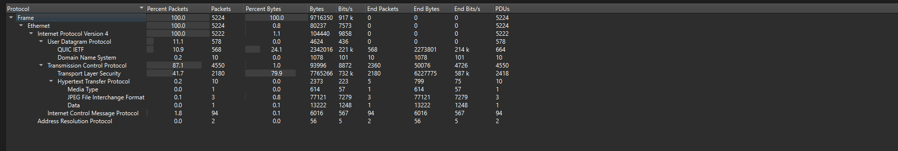
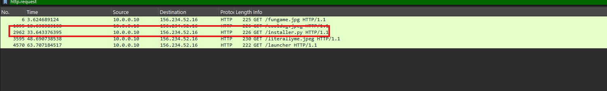
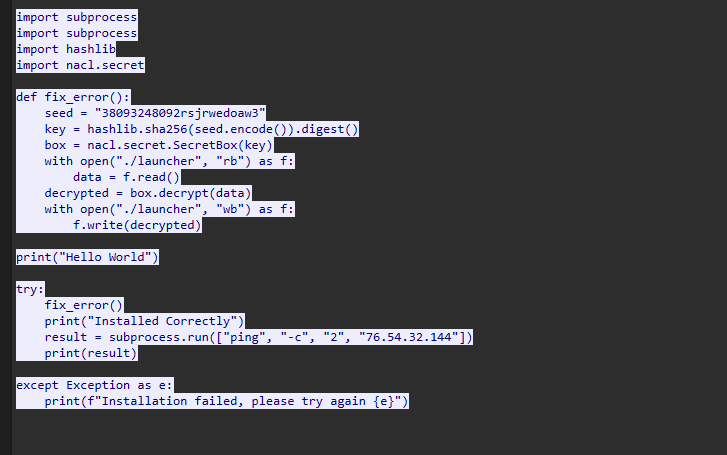
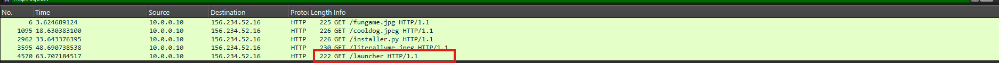
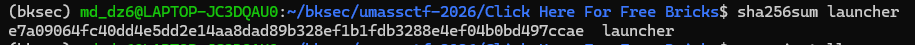

# Challenge Click Here For Free Bricks

## 1. Đầu vào challenge

Challenge cung cấp file `pcap`.


Mở file pcap bằng **Wireshark**, rồi vào mục **Statistics** để quan sát trước.



Có thấy được request liên quan tới HTTP có data. Đồng thời challenge cũng nói đến **malicious download**, nên thử dùng filter `http.request` để xem có những file gì được tải xuống.



---

## 2. Tìm file được tải xuống

Chú ý vào request có file `installer.py`, thử mở TCP stream của request đó để xem thử.



Thấy được file này chỉ có tác dụng là dùng chuỗi `seed` để tạo key rồi giải mã file `launcher`.

Vì vậy tải file `launcher` về và sử dụng `installer.py` để decrypt nó.



---

## 3. Decrypt file `launcher`

Script decrypt:

```python
import subprocess
import subprocess
import hashlib
import nacl.secret


def fix_error():
    seed = "38093248092rsjrwedoaw3"
    key = hashlib.sha256(seed.encode()).digest()
    box = nacl.secret.SecretBox(key)
    with open("./launcher", "rb") as f:
        data = f.read()
    decrypted = box.decrypt(data)
    with open("./launcher", "wb") as f:
        f.write(decrypted)
```

Sau khi decrypt xong thì chạy command:

```bash
sha256sum launcher
```

để tính hash của file `launcher`.

---

## 4. Flag

Cuối cùng flag theo format là:

```text
UMASS{e7a09064fc40dd4e5dd2e14aa8dad89b328ef1b1fdb3288e4ef04b0bd497ccae}
```


---

## 5. Flow

```text
pcap
   |
   v
mở bằng Wireshark
   |
   v
vào Statistics để quan sát tổng quan traffic
   |
   v
nhận thấy có HTTP request chứa data
   |
   v
challenge gợi ý malicious download
   |
   v
lọc bằng http.request
   |
   v
phát hiện file installer.py được tải xuống
   |
   v
mở TCP stream của installer.py
   |
   v
thấy installer.py dùng seed để tạo key
   |
   v
key được dùng để giải mã file launcher
   |
   v
tải file launcher về
   |
   v
sử dụng logic trong installer.py để decrypt launcher
   |
   v
tính sha256 của launcher sau khi decrypt
   |
   v
ghép theo format flag
   |
   v
lấy flag
```
---