# Challenge Lost and Found

## 1. Đầu vào challenge

Mở file bằng Vmware Workstation.


Sau khi đăng nhập vào xong chạy:

```bash
ls -la /root
```

Để check xem ở root có những file nào.

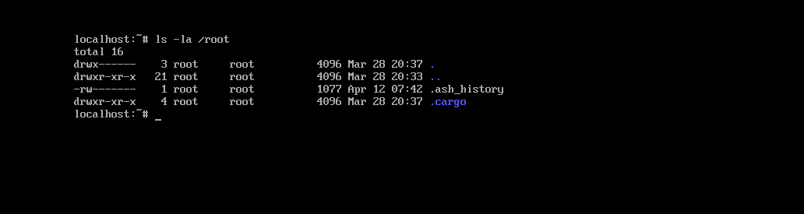

Thấy được 1 file `.ash_history`, đọc thử file đó.

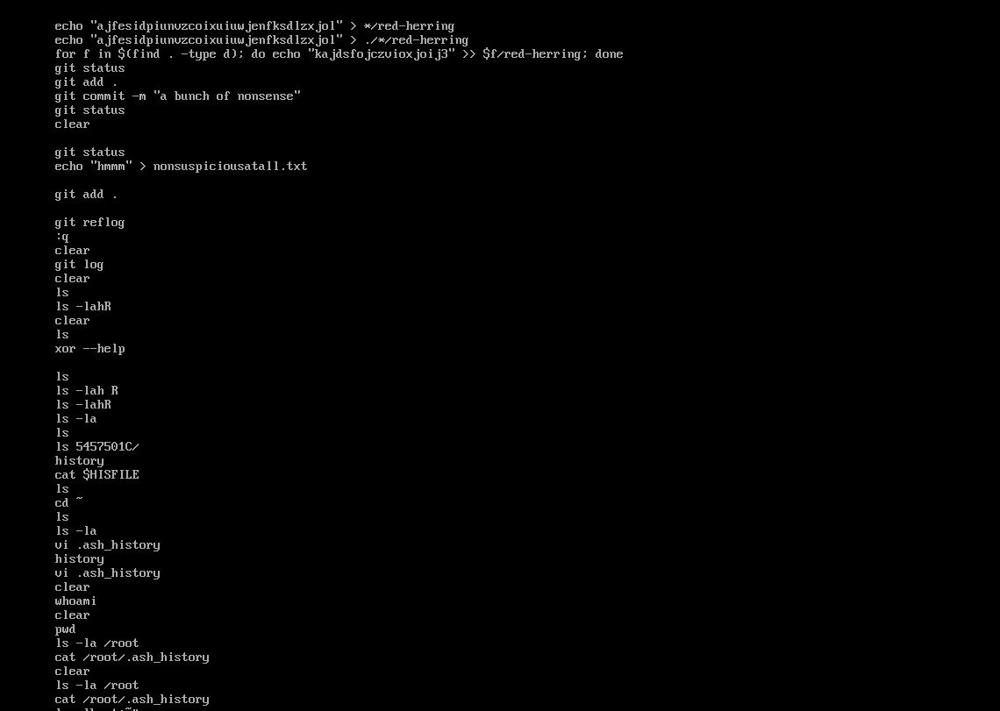

Thấy được vài thứ lạ.

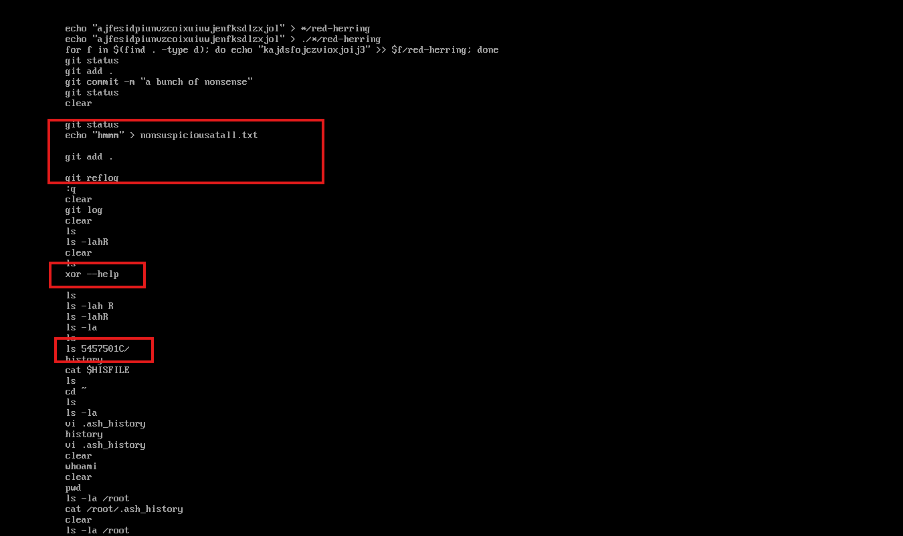

- Có repo Git:

```bash
git status
git add .
git commit -m "a bunch of nonsense"
git status
git reflog
```

=> Quan trọng nhất là Git history/reflog. Có thể flag từng tồn tại trong commit cũ, rồi bị thay bằng file rác.

- Có thư mục lạ:

```bash
ls 5457501C/
```

=> Đây rất có thể là thư mục làm việc chính của challenge.

- Có tool/lệnh lạ:

```bash
xor --help
```

=> Có khả năng flag hoặc dữ liệu bị XOR mã hóa, nhưng chưa nên đoán vội. Cần xem trong repo có file nào cần XOR không.

Trước tiên tìm vị trí chính xác của folder `5457501C`.


Giờ di chuyển tới folder đó:

```bash
cd /home/5457501C
ls -la
```

Kết quả cho thấy bên trong có rất nhiều file và thư mục có tên dạng hex, ví dụ như `08555D451D131A075A5D0E`, `135E5D0D0D`, `3275782C`,... Các tên này không giống tên file bình thường, nên khả năng cao dữ liệu đã bị làm rối hoặc mã hóa và có thể chính thư mục này cũng đang là một phần dữ liệu bị XOR.

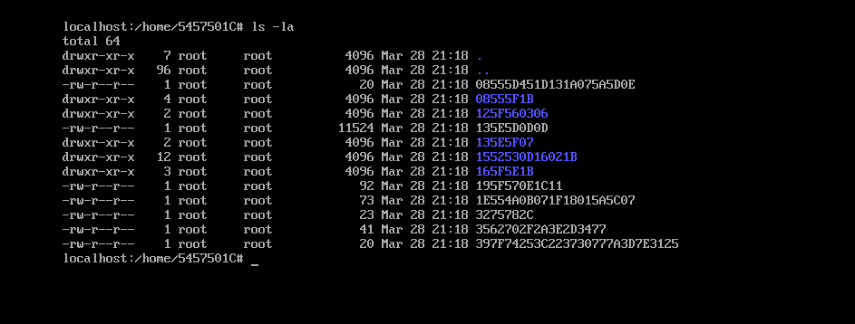

Đồng thời khi chạy:

```bash
find /home -exec basename {} \; | sort | uniq -c | sort -nr | head -5000
```

để xem tên nào xuất hiện lặp lại nhiều nhất.

Thấy được tên `08555D451D131A075A5D0E` được lặp đi lặp lại nhiều nhất.

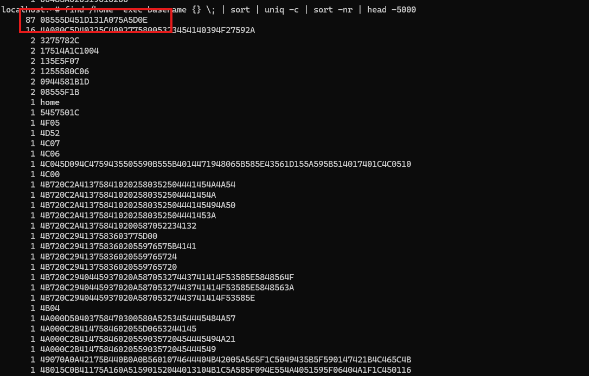

Mà tên file `red-herring` cũng được lặp đi lặp lại nhiều lần trong `.ash_history`.
Ngoài ra, `red-herring` dài `11` ký tự, còn chuỗi hex `08555D451D131A075A5D0E` dài `22` ký tự, tức là đúng `11` byte dữ liệu mã hóa.

Vì challenge có nhắc tới `xor`, mình thử giả định:

```text
08555D451D131A075A5D0E <=> red-herring sau khi bị XOR
```

Ta có công thức XOR:

```text
cipher = plaintext XOR key
=> key = cipher XOR plaintext
```

Chạy thử script:

```python
enc = bytes.fromhex("08555D451D131A075A5D0E")
plain = b"red-herring"

key = bytes([a ^ b for a, b in zip(enc, plain)])
print(key.decode())
```

thu được key `z09huvhu33i`.

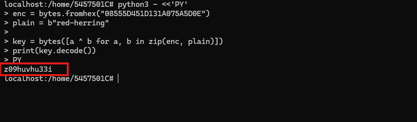

## 2. Thử dùng fragment key để giải tên file

Sau khi lấy được phần đầu của key là `z09huvhu33i`, thử dùng phần đầu của key để xem có thể tìm ra các tên file/thư mục quen thuộc của Git hay không.

```python
python3 - <<'PY'
KEY = b"z09huvhu33i"

names = [
"4A080C5D40325C40027758005323454140394F27592A",
"3275782C",
"17514A1C1004",
"135E5F07",
"1255580C06",
"0944581B1D",
"08555F1B",
"5457501C",
"4F05",
"4D52",
"4C07",
"4C06",
"4C045D094C4759435505590B555B4014471948065B585E43561D155A595B514017401C4C0510",
"4C00",
"4B720C2A413758410202580352504441454A4A54",
"4B720C2A413758410202580352504441454A",
"4B720C2A41375841020258035250444145494A50",
"4B720C2A413758410202580352504441453A",
"4B720C2A413758410200587052234132",
"4B720C294137583603775D00",
"4B720C294137583602055976575B4141",
"4B720C2941375836020559765724",
"4B720C2941375836020559765720",
"4B720C2940445937020A58705327443741414F53585E5848564F",
"4B720C2940445937020A58705327443741414F53585E5848563A",
"4B720C2940445937020A58705327443741414F53585E",
"4B04",
"4A000D50403758470300580A5253454445484A57",
"4A000C2B4147584602055D0653244145",
"4A000C2B41475846020559035720454445494A21",
"4A000C2B4147584602055903572045444549",
"49070A0A42175B440B0A0B5601074644404B42005A565F1C5049435B5F590147421B4C465C4B",
"48015C0B41175A160A51590152044013104B1C5A585F094E554A4051595F06404A1F1C450116",
"43085C5844470B41040558560651474344484B5A585B5142051A445E5B590447101F1D420646",
"4256",
"397F74253C223730777A3D7E3125",
"3562702F2A3E2D3477",
"1F485A0400120D",
"1F04",
"1E554A0B071F18015A5C07",
"1C015C594C150E4D570B5F5157504C43474E4D565F090A42021B17515B5C0247401A404C024A",
"1B5B4A04131C0A45",
"1B5B4A04131C0A4405",
"1B5B4A04131C0A4401",
"1B5B4A04131C0A41",
"1B5B4A041110021707",
"1B5B4A041110021705",
"1B5B4A041110021703",
"1B5B4A04111002170205",
"1B5B4A04111002170202",
"1B5B4A04111002170201",
"1B5B4A04111002170105",
"1B5B4A04111002170102",
"1B5B4A041110021701",
"1B5B4A0411100217",
"1B5A521B191C1E1A49501106",
"1B5A521B191C1E1A49501104",
"1B5A521B191C1E1A49501103",
"1B5A521B191C1E1A4950110252",
"1B5A521B191C1E1A4950110251",
"1B5A521B191C1E1A49501102",
"1B5A521B191C1E1A4950110157",
"1B5A521B191C1E1A4950110152",
"1B5A4A0C160E5D",
"1B5A4A0C160E5A47",
"1B5A4A0C160E5A44",
"1B5A4A0C160E5A42",
"1B5A4A0C160E5A",
"1B5A4A0C160E5946",
"1B5A4A0C160E5942",
"1B5A4A0C160E5940",
"1B5A4A0C160E59",
"1B5A4A0C160E51",
"1B5A4A0C160E",
"1B5A4A0C0D4F",
"1B5A4A0C0D475F",
"1B5A4A0C0D475B",
"1B5A4A0C0D47",
"1B545A5C4D46094D55005857500614154448435A0A090A18534B17510A095142161C4C435D15",
"1B4049040C060901505B445E11055B0514150A0F0C",
"1B01090D454E5F4151050D0055034D144C1B48075E5F5C4C5B1C4F580E5A514F114E41160246",
"195F570E1C11",
"195F54051C02451840544740030F051A10",
"19090E504647501450555B0051041147424E1F050D5E5C1E531C175A59095716471849450511",
"165F5E1B",
"1552530D16021B",
"135E5D0D0D",
"125F560306",
"0F405D0901134606525E195F07",
"0E515E1B",
"0A5F4A1C5803181152470C1D11031806191D",
"0A515D1B1C030C4707",
"0A515D1B1C030C45",
"0A515D1B1C030C440B",
"0A515D1B1C030C4401",
"0A515D1B1C030C43",
"0A515D1B1C030C",
"0A515A03",
"0A454A0058020758505B0C50090D00025B0B1B0E19030D",
"0A425C4518131A12561E0A5C0F0F1C025B0B1B0E19030D",
"0A425C45161905185A474740030F051A10",
"0A425C45140618194A430847010A5B0514150A0F0C",
"0A425C4507130B105A450C1D11031806191D",
"0A425C4507130A1440564740030F051A10",
"0A425C4505031B1D1D40085E120E10",
"0A425C1814040D58505C045E0B16581B061F54100802181606",
"0955570C101B091C5F1E1F520E0B1117011D54100802181606",
"005C410316451F47",
"005C410316451F440B",
"005C410316451F4407",
"005C410316451F4403",
"005C410316005B020B",
"005C410316005B0207",
"005C410316005B0205",
"005C410316005B02020B",
"005C410316005B020207",
"005C410316005B020205",
"005C410316005B020203",
"005C410316005B020200",
"005C410316005B020101",
"005C410316005B020100",
"005C410316005B0200",
"005C410316005B02",
"00485A0203191F4604",
"00485A0203191F46020A",
"00485A0203191F460206",
"00485A0203191F460202",
"00485A0203191F4600",
"00485A0203190102000A",
"00485A02031901020007",
"00485A02031901020006",
"00485A020319010200025E",
"00485A020319010200025D",
"00485A020319010200025C",
"00485A0203190102000258",
"00485A0203190102000250",
"00485A020319010200015D",
"00485A020319010200015A",
"00485A0203190102000150",
"00485A02031901020000",
]

def xor_hex_name(hexname):
    enc = bytes.fromhex(hexname)
    dec = bytes(b ^ KEY[i % len(KEY)] for i, b in enumerate(enc))
    return dec.decode(errors="replace")

for name in names:
    print(f"{name} => {xor_hex_name(name)}")
PY
```

Ra được rất nhiều chuỗi nhưng chú ý hơn vào các chuỗi này.

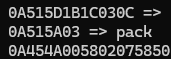

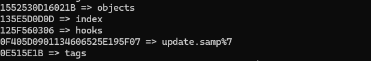

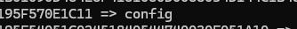

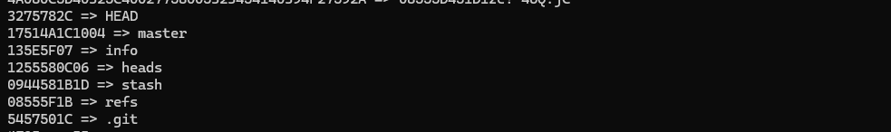

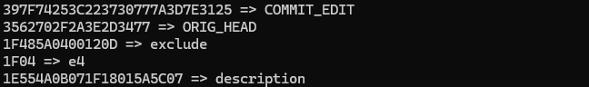

Có thể nhận định rằng:

- cùng một plaintext `red-herring` xuất hiện nhiều lần trong history, và trong cây file cũng có đúng một ciphertext tên hex lặp đi lặp lại nhiều lần.
- khi XOR cặp đó, ta lấy được fragment `z09huvhu33i`.
- fragment này không chỉ đúng cho đúng 1 file, mà còn giải được hàng loạt tên khác ở cùng vị trí byte đầu:
  - `.git`
  - `HEAD`
  - `master`
  - `refs`
  - `heads`
  - `config`
  - `description`
  - `info`
  - `exclude`

Tức là cùng một fragment key đang được tái sử dụng cho nhiều tên khác nhau.

fragment `11` byte giải đúng hoàn toàn các tên ngắn, nhưng với tên dài hơn như `COMMIT_EDITMSG` thì chỉ đúng phần đầu rồi sai phần sau.

Điều đó loại trừ trường hợp:
- `single-byte XOR`: nếu là 1 byte thì pattern sai sẽ khác hẳn
- `fixed 11-byte key full`: nếu key thật chỉ dài `11` byte thì tên dài hơn cũng phải giải đúng hết
- `one-time pad / stream khác nhau mỗi file`: nếu mỗi file dùng stream khác nhau thì fragment từ `red-herring` sẽ không thể áp sang các tên khác mà vẫn ra `.git`, `HEAD`, `config`...

## 3. Recovery full stream key

Sau khi hỏi thêm để biết nguồn nên dùng để recovery stream key thì thấy 2 nguồn đáng dùng là:

- `.git/description`
- `.git/info/exclude`

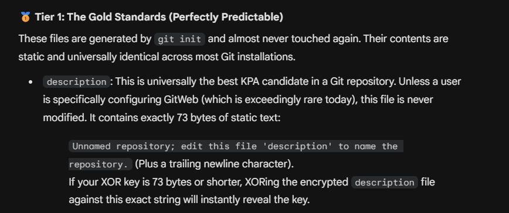

Và:

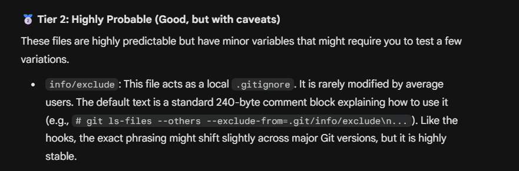

Vậy với những plaintext được đề xuất thử với `.git/description` trước.

```python
python3 - <<'PY'
from pathlib import Path

enc = Path("/home/5457501C/1E554A0B071F18015A5C07").read_bytes()
plain = b"Unnamed repository; edit this file 'description' to name the repository.\n"

n = min(len(enc), len(plain))
ks = bytes(c ^ p for c, p in zip(enc[:n], plain[:n]))

print("keystream/prefix:")
print(ks.decode(errors="replace"))
print("length =", len(ks))
PY
```

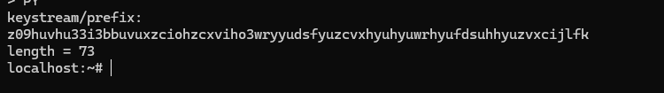

Thu được key dài `73` byte.

Tiếp tục tới `.git/info/exclude`.

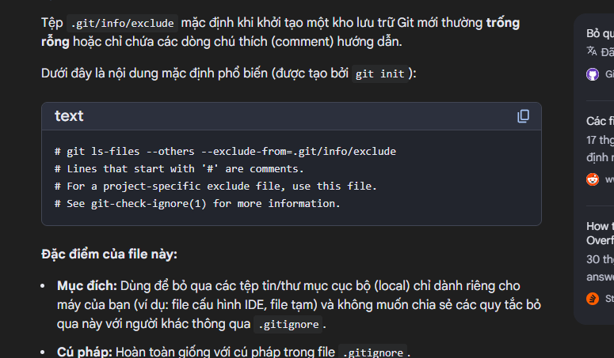

```python
python3 - <<'PY'
from pathlib import Path

enc = Path("/home/5457501C/135E5F07/1F485A0400120D").read_bytes()

plain = (
    b"# git ls-files --others --exclude-from=.git/info/exclude\n"
    b"# Lines that start with '#' are comments.\n"
    b"# For a project mostly in C, the following would be a good set of\n"
    b"# exclude patterns (uncomment them if you want to use them):\n"
)

n = min(len(enc), len(plain))
ks = bytes(c ^ p for c, p in zip(enc[:n], plain[:n]))

def min_period(data: bytes) -> int:
    for p in range(1, len(data) + 1):
        if all(data[i] == data[i % p] for i in range(len(data))):
            return p
    return len(data)

p = min_period(ks)
key = ks[:p]

print("period =", p)
print("key    =", key.decode(errors="replace"))
PY
```

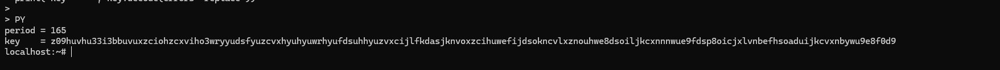

Ra được streamkey:

```text
z09huvhu33i3bbuvuxzciohzcxviho3wryyudsfyuzcvxhyuhyuwrhyufdsuhhyuzvxcijlfkdasjknvoxzcihuwefijdsokncvlxznouhwe8dsoiljkcxnnnwue9fdsp8oicjxlvnbefhsoaduijkcvxnbywu9e8f0d9
```

trong khi đó plaintext truyền vào dài tới `226` byte.

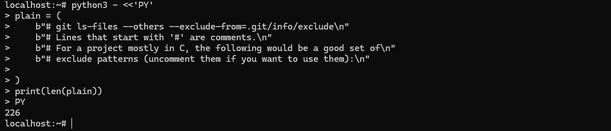

Vì vậy có thể kết luận đây là full XOR key dùng để giải mã toàn bộ cây thư mục.

## 4. Recover lại toàn bộ cây thư mục

```python
python3 - <<'PY'
from pathlib import Path

KEY = b"z09huvhu33i3bbuvuxzciohzcxviho3wryyudsfyuzcvxhyuhyuwrhyufdsuhhyuzvxcijlfkdasjknvoxzcihuwefijdsokncvlxznouhwe8dsoiljkcxnnnwue9fdsp8oicjxlvnbefhsoaduijkcvxnbywu9e8f0d9"

SRC = Path("/home")
DST = Path("/tmp/recovered")

def xor_data(data: bytes) -> bytes:
    return bytes(b ^ KEY[i % len(KEY)] for i, b in enumerate(data))

def dec_name(name: str) -> str:
    try:
        raw = bytes.fromhex(name)
        return xor_data(raw).decode()
    except Exception:
        return name

def walk(src: Path, dst: Path):
    dst.mkdir(parents=True, exist_ok=True)
    for p in src.iterdir():
        q = dst / dec_name(p.name)
        if p.is_dir():
            walk(p, q)
        elif p.is_file():
            q.write_bytes(xor_data(p.read_bytes()))

walk(SRC, DST)
PY
```

Sau khi recover xong thử kiểm tra repo.

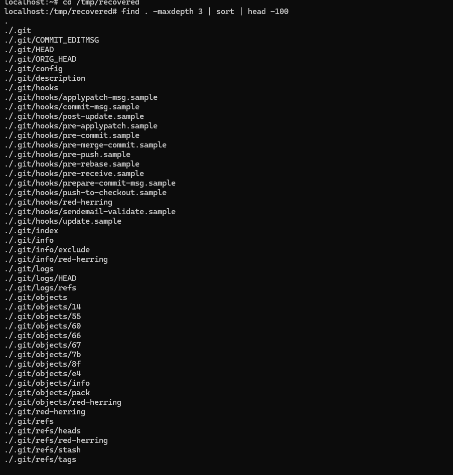

```bash
git status
```

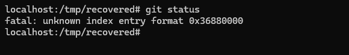

Cho thấy metadata của repo vẫn còn bị nhiễu.

Check tiếp bằng:

```bash
git log --decorate --all
```

Để xem lịch sử commit của Git thì thấy được:

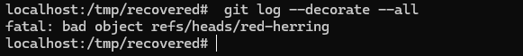

Cho thấy trong `.git` vẫn còn ref giả (`red-herring`) trỏ tới object không tồn tại → làm Git bị lỗi và không đọc được history.

Vì vậy xóa các ref giả (`red-herring`) trong `.git` đó đi:

```bash
find .git -name red-herring -type f -delete
```

rồi check lại log để xem lịch sử commit đã hiện được chưa thì thấy được flag là `UMASS{h3r35_7h3_c4rg0_vr00m}`.

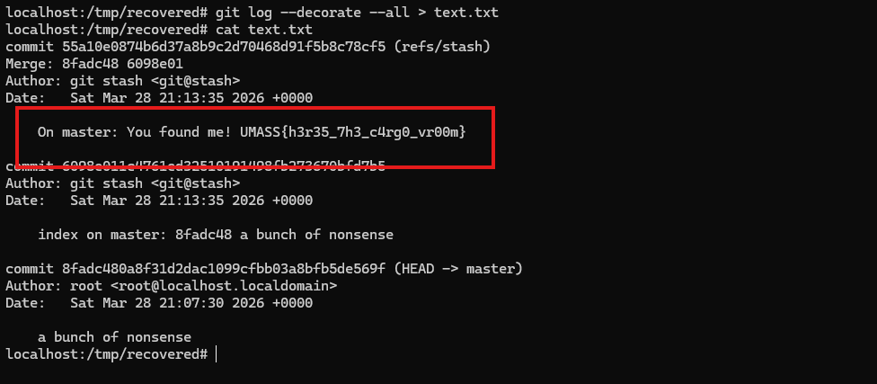

## 5. Flag

```text
UMASS{h3r35_7h3_c4rg0_vr00m}
```

## 6. Flow

```text
mở máy ảo
   |
   v
đọc .ash_history
   |
   v
nhận ra có thư mục hex + Git history + gợi ý xor
   |
   v
đi vào /home/5457501C
   |
   v
thấy rất nhiều tên file/thư mục dạng hex
   |
   v
đếm tần suất tên xuất hiện
   |
   v
ghép ciphertext lặp lại nhiều nhất với plaintext red-herring
   |
   v
thu được fragment key z09huvhu33i
   |
   v
dùng fragment này thử giải tên file
   |
   v
nhận ra hàng loạt tên quen thuộc của Git
   |
   v
suy ra đây không phải key 11 byte cố định
   |
   v
chọn các file Git có nội dung mặc định ổn định để recovery stream key
   |
   v
dùng .git/description lấy được prefix key
   |
   v
dùng .git/info/exclude lấy được full XOR key
   |
   v
viết script recover toàn bộ cây thư mục và nội dung file
   |
   v
mở repo đã recover
   |
   v
thấy vẫn còn ref giả red-herring trong .git
   |
   v
xóa các ref giả
   |
   v
đọc lại git log
   |
   v
lấy flag
```
---