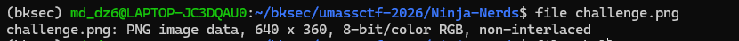
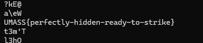

# Challenge Ninja-Nerds

## 1. Đầu vào challenge


Đầu vào challenge cho 1 file `png`, check bằng `file`, `binwalk`, `strings`, `exiftool` chưa thấy gì đặc biệt.



## 2. Chuyển sang hướng steganography trong pixel

Sau khi xác định ảnh không có metadata hay appended data đáng ngờ, chuyển sang hướng steganography trong pixel. Lần lượt thử LSB của cả ba kênh `R`, `G`, `B`.

```python
from PIL import Image

def extract(img_path):
    img = Image.open(img_path).convert("RGB")
    channels = {
        "R": list(img.getchannel("R").getdata()),
        "G": list(img.getchannel("G").getdata()),
        "B": list(img.getchannel("B").getdata()),
    }
    for name, pixels in channels.items():
        bits = [p & 1 for p in pixels]
        out = bytearray()
        for i in range(0, len(bits), 8):
            chunk = bits[i:i+8]
            if len(chunk) < 8:
                break
            value = 0
            for bit in chunk:
                value = (value << 1) | bit
            out.append(value)
        out_name = f"{name}_lsb.bin"
        with open(out_name, "wb") as f:
            f.write(out)

if __name__ == "__main__":
    extract("challenge.png")
```

### Giải thích

Script này lấy giá trị pixel của từng kênh màu `R`, `G`, `B`, sau đó mỗi pixel chỉ giữ lại bit thấp nhất (`LSB`). Rồi ghép các bit lại theo từng nhóm `8 bit` để tạo thành `1 byte`, rồi ghi lần lượt ra các file cho từng kênh `R_lsb.bin`, `G_lsb.bin`, `B_lsb.bin`.

## 3. Đọc kết quả sau khi extract

Sau đó dùng:

```bash
strings -a R_lsb.bin
strings -a G_lsb.bin
strings -a B_lsb.bin
```

Thì thấy được flag là `UMASS{perfectly-hidden-ready-to-strike}` ở file `B_lsb.bin`.

## 4. Flag

```text
UMASS{perfectly-hidden-ready-to-strike}
```



## 5. Flow

```text
challenge.png
   |
   v
check bằng file / binwalk / strings / exiftool
   |
   v
không thấy metadata hay appended data đáng ngờ
   |
   v
chuyển sang hướng steganography trong pixel
   |
   v
thử LSB của cả ba kênh R, G, B
   |
   v
extract bit thấp nhất của từng pixel
   |
   v
ghép lại thành các file R_lsb.bin, G_lsb.bin, B_lsb.bin
   |
   v
dùng strings đọc nội dung các file
   |
   v
phát hiện flag trong B_lsb.bin
```
---