# Challenge Chase

## 1. Đầu vào challenge

Đầu vào challenge là một file:

- `chase.pcapng`

Bước đầu tiên là mở file này bằng **Wireshark**, sau đó vào mục **Statistics** để nhìn tổng quan loại traffic xuất hiện trong pcap.

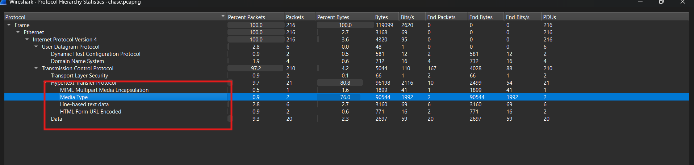

---

## 2. Nhận định ban đầu

Từ góc nhìn ban đầu, có thể đoán attacker đang tấn công thông qua tương tác với web.  
Vì vậy, bước tiếp theo hợp lý là dùng filter:

```text
http
```

Khi kiểm tra traffic HTTP, thấy attacker truy cập nhiều tài nguyên web khác nhau.  
Có khá nhiều request lạ, nhưng điểm đáng chú ý nhất là xuất hiện các request **POST** đang cố gắng upload một thứ gì đó lên server.

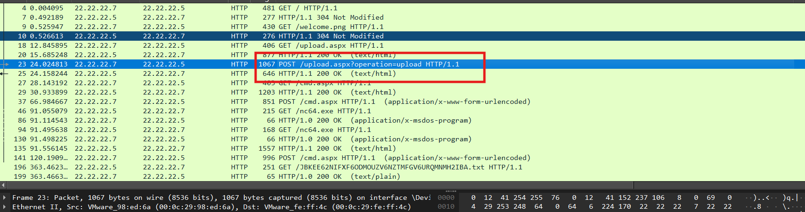

---

## 3. Phát hiện file webshell được upload

Thử mở **HTTP Stream** của request đáng ngờ thì thấy attacker dùng `auth key` là:

```text
admin
```

để upload một file tên:

```text
cmd.aspx
```

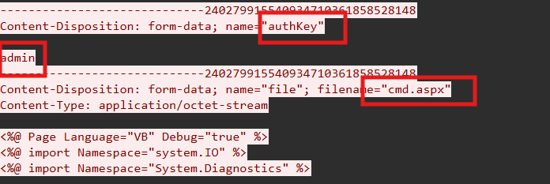

### Nhận định

Điều này cho thấy attacker nhiều khả năng đang cố đưa một **webshell** lên máy chủ web.

---

## 4. Attacker sử dụng `cmd.aspx`

Tiếp tục theo dõi các request sau đó, thấy attacker truy cập lại file `cmd.aspx` vừa upload và gửi lệnh thông qua webshell này.

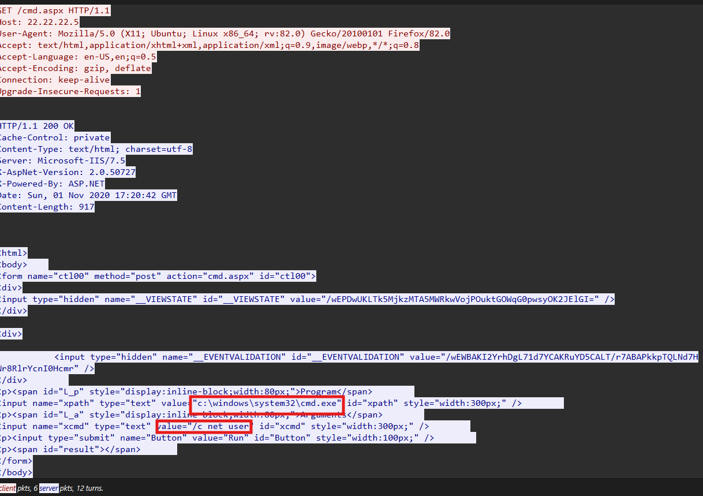

Ngay phía dưới có thể thấy rõ hơn cách file này hoạt động.

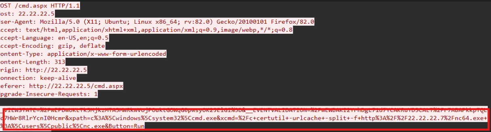

### Phân tích

Attacker mở file `cmd.aspx` vừa upload.  
Phía server sẽ xử lý file này như một trang ASP.NET động, sau đó chương trình mặc định gọi tiếp `cmd.exe` để thực thi lệnh mà attacker gửi vào webshell.

Flow:

- attacker upload `cmd.aspx`
- IIS / ASP.NET thấy đuôi `.aspx`
- server xử lý nó như một trang web động
- code bên trong trang lại gọi tiếp `cmd.exe`
- từ đó attacker có thể thực thi command trên máy nạn nhân

---

## 5. Tải `nc64.exe` bằng `certutil`

Tiếp tục kiểm tra request POST kế tiếp thì thấy attacker yêu cầu server chạy lệnh dùng `certutil` để tải file:

```text
nc64.exe
```

từ địa chỉ:

```text
22.22.22.7
```

và lưu xuống máy nạn nhân tại:

```text
c:\users\public\nc.exe
```
Response trả về cho thấy lệnh này thực hiện thành công.

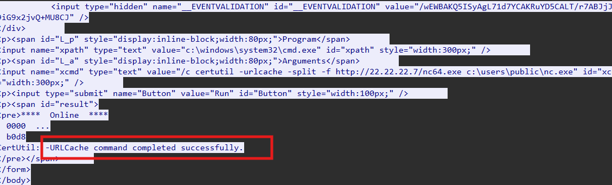

### Kiến thức ngoài lề

`certutil` là một công cụ hợp pháp có sẵn trên Windows, thường dùng để làm việc với chứng chỉ.  
Tuy nhiên, trong thực tế nó cũng hay bị attacker lạm dụng để tải file từ xa về máy nạn nhân.

---

## 6. Từ webshell sang reverse shell

Tiếp tục truy vết request POST sau đó, thấy attacker đang chạy chính file netcat vừa tải về.

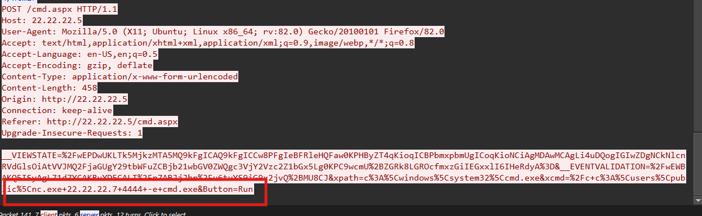

Ở đây attacker yêu cầu máy nạn nhân:

- chạy `nc.exe`
- kết nối ngược về máy attacker `22.22.22.7:4444`
- gắn `cmd.exe` vào kết nối đó

-> **reverse shell**.

---

## 7. Theo dõi kênh reverse shell

Vì đã xác định được cổng reverse shell là `4444`, nên tiếp theo dùng filter:

```text
ip.addr == 22.22.22.7 && tcp.port == 4444
```
Sau đó vào **TCP Stream** thì thấy rất nhiều command đáng ngờ mà attacker đã thực thi trong phiên shell này.

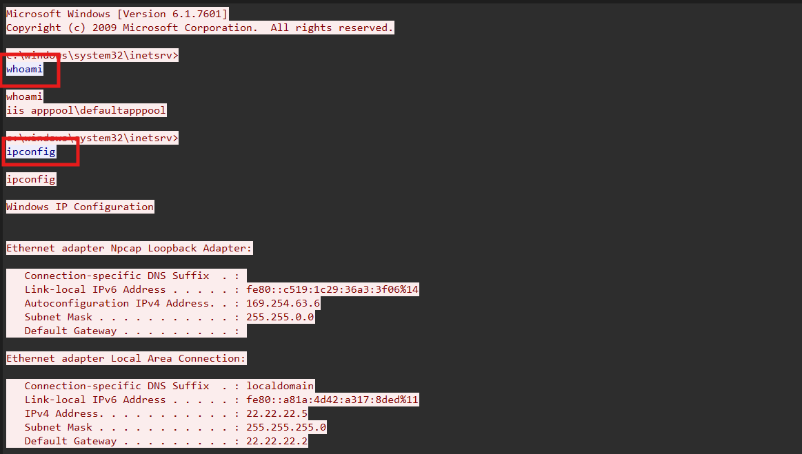

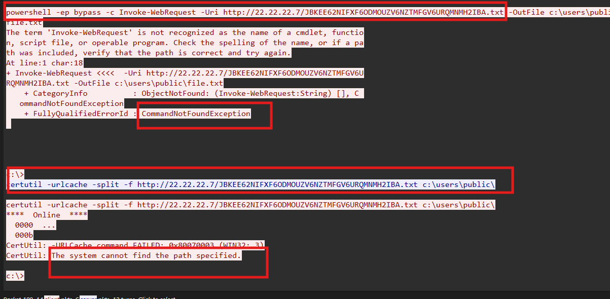

---

## 8. Dấu hiệu về file `.txt`

Quan sát kỹ command trong reverse shell, nhận ra attacker đang cố tải một file `.txt` từ máy của hắn về máy nạn nhân.

Attacker đã thử nhiều cách, cụ thể gồm:

- `Invoke-WebRequest`
- `certutil`

Tuy nhiên cả hai đều bị fail ở bước lưu file xuống máy nạn nhân.

Dù vậy, khi dùng filter HTTP thì vẫn xem được nội dung file này, vì phía máy nạn nhân đã load được nội dung file `.txt`, chỉ là chưa lưu thành công xuống đĩa.

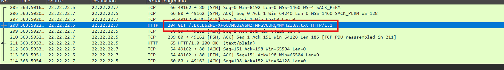

---

## 9. Lấy flag

Nội dung file chỉ là:

```text
Hey, there!
```
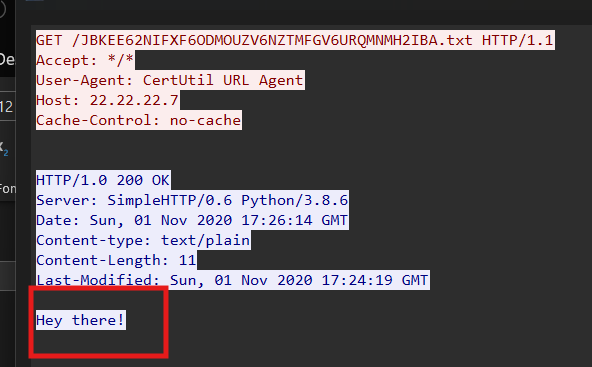

Nhưng cần chú ý thêm vào **tên file**. Tên file này nhìn không giống Base64 thuần. Thử đưa vào **CyberChef** rồi dùng chế độ **Magic** để auto-detect, sẽ nhận ra đây là chuỗi đã được **encode bằng Base32**.

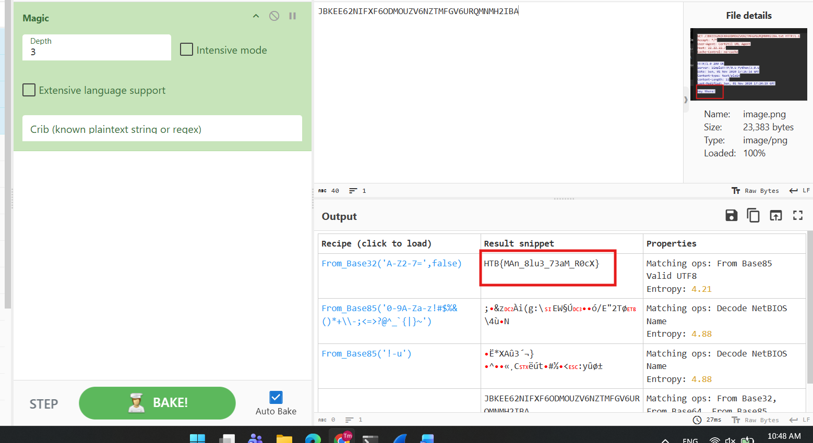

Sau khi decode tên file đó, thu được flag:

```text
HTB{MAn_8lu3_73aM_R0cX}
```

---

## 10. Tóm tắt flow tấn công

```text
capture.pcap
   |
   v
mở bằng Wireshark
   |
   v
lọc HTTP
   |
   v
phát hiện request POST upload file cmd.aspx
   |
   v
nhận ra cmd.aspx là webshell ASP.NET
   |
   v
attacker gửi command qua webshell
   |
   v
dùng certutil tải nc64.exe từ 22.22.22.7
   |
   v
lưu thành c:\users\public\nc.exe
   |
   v
chạy netcat và tạo reverse shell về 22.22.22.7:4444
   |
   v
lọc traffic cổng 4444
   |
   v
theo dõi command trong TCP Stream
   |
   v
phát hiện attacker cố tải file .txt
   |
   v
xem được nội dung file và tên file qua HTTP
   |
   v
decode tên file bằng Base32
   |
   v
lấy flag
```

---

