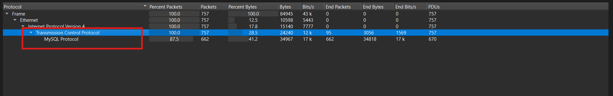
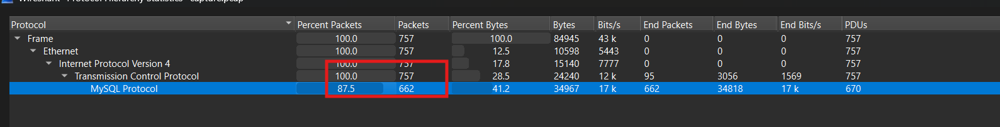
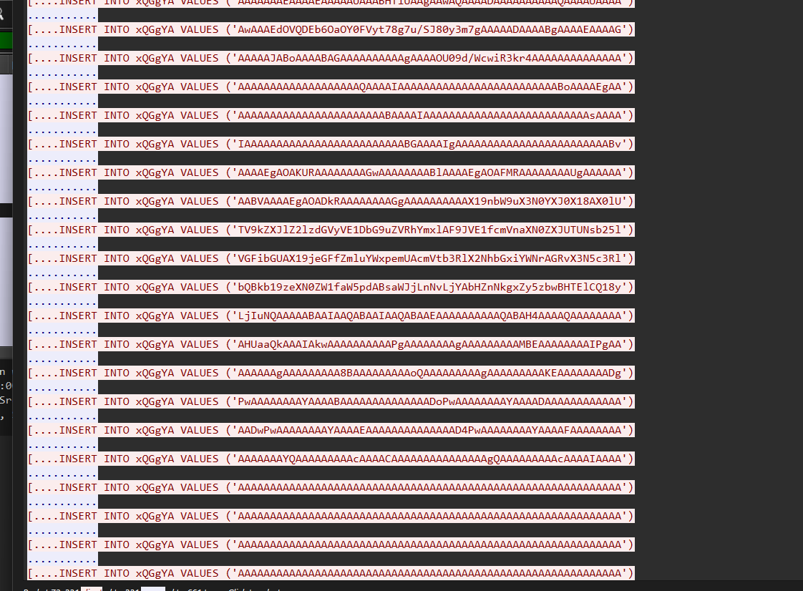
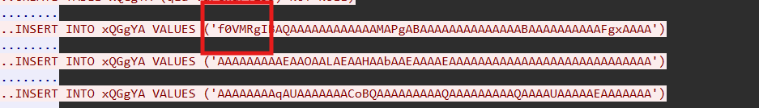
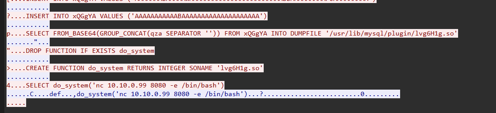
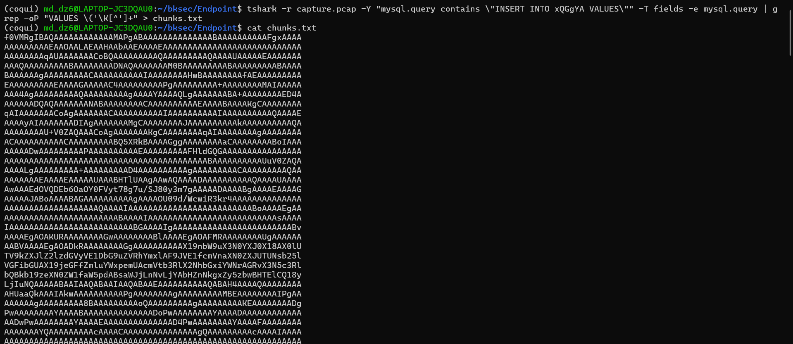
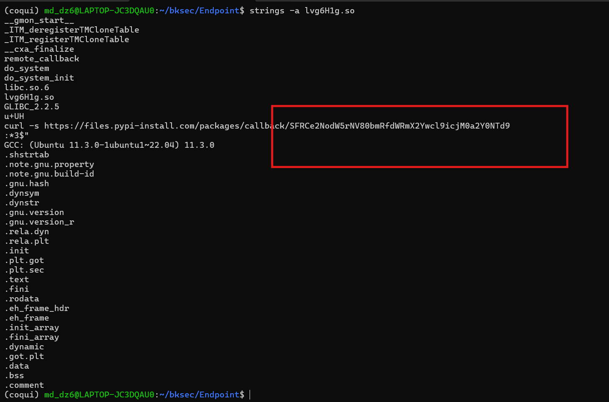

# Challenge Endpoint

## 1. Đầu vào challenge

Đầu vào challenge cung cấp 1 file:

- `capture.pcap`

Mở file này trong **Wireshark** và kiểm tra phần **Statistics** trước để có cái nhìn tổng quan về loại traffic xuất hiện trong pcap.



---

## 2. Nhận định ban đầu

Quan sát ban đầu cho thấy có traffic **MySQL** trong pcap.

Điều này đáng chú ý vì:

- MySQL thường là database nội bộ
- việc nó xuất hiện trong pcap có thể cho thấy:
  - có hoạt động theo dõi traffic nội bộ
  - hoặc attacker đang tương tác trực tiếp với server database

Ngoài ra, trong tổng số **757 packets** thì có tới **662 packets** liên quan tới MySQL.

Từ đó có thể suy ra rằng phần trọng tâm của challenge nhiều khả năng nằm ở traffic MySQL.



---

## 3. Bắt đầu lọc truy vấn MySQL

Bước tiếp theo là thử dùng filter:

```text
mysql.query
```

sau đó kết hợp xem **Follow TCP Stream** để đọc rõ nội dung các câu truy vấn.



---

## 4. Dấu hiệu bất thường trong các truy vấn

Khi kiểm tra phần query, nhận thấy có rất nhiều lệnh:

- `INSERT`
- cùng ghi vào **một bảng**
- và chủ yếu vào **một cột duy nhất**

Điều này là một dấu hiệu khá lạ, vì nó gợi ý rằng attacker có thể đang:

1. chia dữ liệu thành nhiều **chunk**
2. insert từng phần vào database
3. rồi ghép chúng lại về sau

Đồng thời, có một đoạn dữ liệu được insert nhìn rất giống **Base64**.



---

## 5. Câu truy vấn quan trọng

Kéo xuống dưới sẽ thấy một đoạn truy vấn quan trọng.



Từ đó có thể đọc ra được:

- cột dữ liệu là `qza`
- bảng được dùng là `xQGgYA`

Và đặc biệt xuất hiện câu lệnh:

```sql
select from_base64(group_concat(qza separator '')) from xQGgYA into dumpfile '/usr/lib/mysql/plugin/lvg6H1g.so'
```

### Ý nghĩa

Câu lệnh trên đang thực hiện chuỗi thao tác sau:

1. dùng `GROUP_CONCAT(qza SEPARATOR '')` để nối toàn bộ các chunk lại thành **một chuỗi hoàn chỉnh**
2. dùng `FROM_BASE64(...)` để **decode Base64**
3. dùng `INTO DUMPFILE` để ghi kết quả ra file:

```text
/usr/lib/mysql/plugin/lvg6H1g.so
```

---

## 6. File mới 

File vừa được ghi ra là:

```text
lvg6H1g.so
```

Đây là một file **shared object** trên Linux.

Với MySQL, attacker có thể đặt file `.so` vào thư mục plugin để MySQL load nó như một **UDF**.

### Kiến thức ngoài lề

- **UDF (User-Defined Function)** là một hàm do người dùng tự bổ sung vào MySQL để mở rộng chức năng.
- File **`.so`** trên Linux (hoặc **`.dll`** trên Windows) là thư viện dùng chung mà chương trình có thể load vào lúc chạy.

### Suy luận

Vậy ở đây attacker có thể đã:

1. Insert các chunk Base64 vào database
2. Ghép chúng lại
3. Decode thành file `.so`
4. Ghi file đó vào thư mục plugin của MySQL
5. Load nó để tạo UDF như `do_system`
6. Từ đó thực thi **lệnh hệ thống** trên máy chủ MySQL

---

## 7. Trích xuất các chunk từ pcap

Để lấy phần nội dung đã được insert trong các truy vấn, có thể dùng lệnh:

```bash
tshark -r capture.pcap -Y "mysql.query contains \"INSERT INTO xQGgYA VALUES\"" -T fields -e mysql.query | grep -oP "VALUES \('\K[^']+" > chunks.txt
```



Lệnh này có tác dụng:

- đọc file pcap bằng `tshark`
- lọc các query chứa `INSERT INTO xQGgYA VALUES`
- chỉ lấy phần dữ liệu nằm trong `VALUES ('...')`
- ghi toàn bộ các chunk ra file `chunks.txt`

---

## 8. Ghép và decode dữ liệu

Sau khi có các chunk, bước tiếp theo là xóa ký tự xuống dòng rồi ghép chúng lại thành một chuỗi liên tục.

```bash
tr -d '\n' < chunks.txt > strings.txt
base64 -d strings.txt > lvg6H1g.so
```

---

## 9. Phân tích file `.so`

Sau khi có file `lvg6H1g.so`, có thể dùng lệnh:

```bash
strings -a lvg6H1g.so
```

để quét toàn bộ các chuỗi có thể đọc được trong file nhị phân.



Từ đó thu được một chuỗi đáng chú ý.

---

## 10. Lấy flag

Thử decode Base64 chuỗi vừa tìm được trong file `.so`, ta sẽ thu được flag:

```text
HTB{chunk5_4nd_udf_f0r_br34kf457}
```


---

## 11. Tóm tắt flow tấn công

```text
capture.pcap
   |
   v
lọc mysql.query trong Wireshark / tshark
   |
   v
phát hiện nhiều lệnh INSERT vào cùng bảng và cột
   |
   v
suy ra attacker chia dữ liệu thành nhiều chunk
   |
   v
dùng GROUP_CONCAT để ghép các chunk
   |
   v
dùng FROM_BASE64 để decode
   |
   v
ghi kết quả ra file /usr/lib/mysql/plugin/lvg6H1g.so
   |
   v
file .so được dùng làm plugin / UDF cho MySQL
   |
   v
attacker có thể mở rộng chức năng MySQL để thực thi lệnh hệ thống
   |
   v
dùng strings để quét file .so
   |
   v
decode chuỗi Base64 bên trong
   |
   v
lấy flag
```

---
