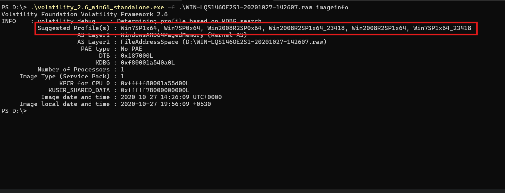
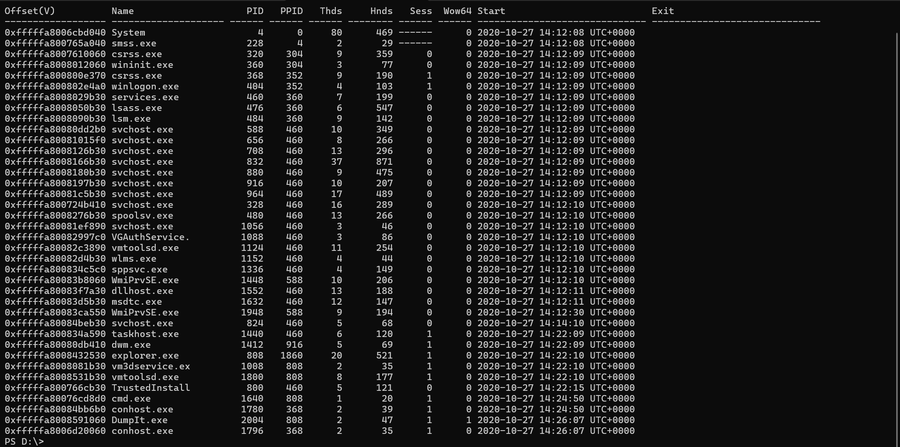
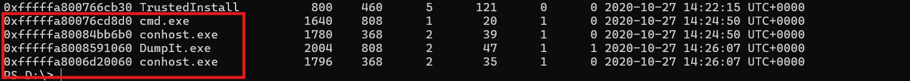
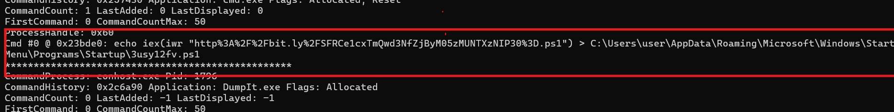
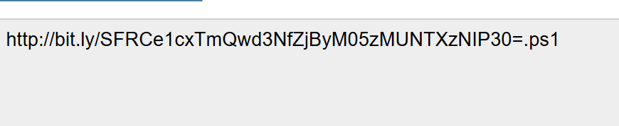
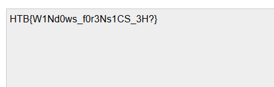
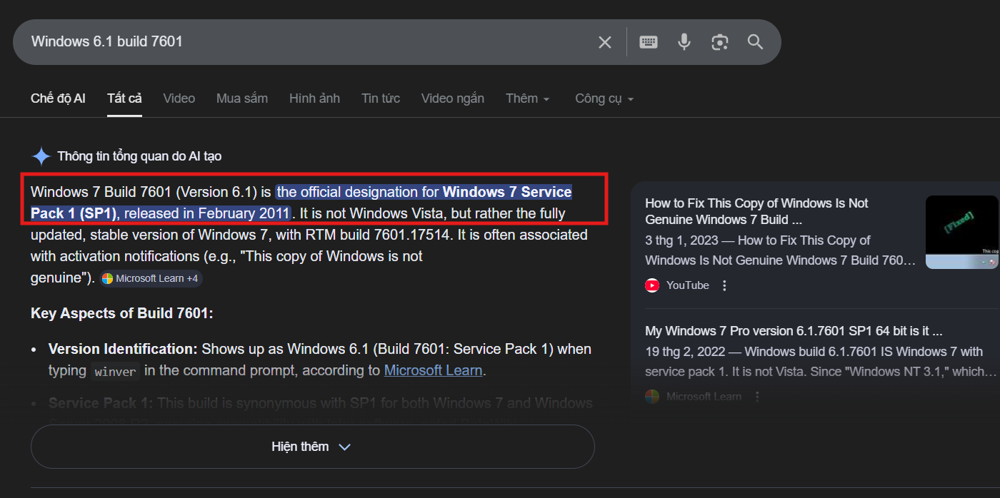

# Challenge Export

## 1. Đầu vào challenge

Đầu vào challenge là 1 file dump bộ nhớ:

```text
WIN-LQS146OE2S1-20201027-142607.raw
```

Nhận định ban đầu: đây có thể là 1 file **raw memory dump** từ một máy Windows, nên hướng tiếp cận hợp lý là dùng **Volatility** để nhận diện hệ điều hành, profile và các tiến trình đang hoạt động tại thời điểm chụp RAM.

---

## 2. Nhận diện hệ thống

Thử kiểm tra thông tin hệ điều hành bằng lệnh:

```powershell
.\volatility_2.6_win64_standalone.exe -f .\WIN-LQS146OE2S1-20201027-142607.raw imageinfo
```


Kết quả cho thấy:

- đây là memory dump của một máy **Windows x64**

Từ đây có thể tiếp tục phân tích process đang chạy trong thời điểm chụp dump.

---

## 3. Kiểm tra danh sách process

Kiểm tra các process đang hoạt động:

```powershell
.\volatility_2.6_win64_standalone.exe -f .\WIN-LQS146OE2S1-20201027-142607.raw --profile=Win7SP1x64 pslist
```

Mục tiêu:

- tiến trình tương tác trực tiếp với user
- console process
- công cụ dump RAM

---

## 4. Đáng chú ý trong `pslist`

Khi xem danh sách process:


- `cmd.exe` có **PID 1640**
- process này chạy trong **Session 1**
- thời điểm tạo là: `2020-10-27 14:24:50 UTC`

Ngoài ra còn thấy:

- `conhost.exe` xuất hiện cùng cùng thời gian, cho thấy có một cửa sổ console thực sự đã được mở
- `DumpIt.exe` xuất hiện trên Desktop vào lúc: `2020-10-27 14:26:07 UTC`

### Suy luận

Từ các dấu vết này có thể suy ra:

- user đã mở `cmd.exe`
- sau đó dùng môi trường console này để tiến hành chụp RAM bằng `DumpIt.exe`

Vì vậy, bước tiếp theo hợp lý là kiểm tra lịch sử lệnh đã được gõ trong cửa sổ `cmd`.

---

## 5. Truy vết lệnh bằng `cmdscan`

Để lấy lại nội dung lệnh đã nhập trong console, dùng:

```powershell
.\volatility_2.6_win64_standalone.exe -f .\WIN-LQS146OE2S1-20201027-142607.raw --profile=Win7SP1x64 cmdscan
```

Thử khôi phục lại các command mà user đã gõ trước thời điểm chụp dump.

Kết quả cho thấy có một đoạn:

- `echo ...`



Bên trong đoạn này có chứa một **URL**.

---

## 6. Xử lý chuỗi nghi vấn

Từ kết quả `cmdscan`, thử:

1. URL decode chuỗi tìm được
2. Nhận ra bên trong có một đoạn Base64
3. Tiếp tục decode Base64






Sau khi giải mã chuỗi này, thu được flag.

---

## 7. Flag

```text
HTB{W1Nd0ws_f0r3Ns1CS_3H?}
```

---

## 8. Tóm tắt

```text
.raw memory dump
    |
    v
Dùng Volatility nhận diện hệ điều hành
    |
    v
Xác định đây là Windows x64
    |
    v
Dùng pslist để xem process đang chạy
    |
    v
Chú ý cmd.exe + conhost.exe + DumpIt.exe
    |
    v
Suy ra user đã mở cmd để chụp RAM
    |
    v
Dùng cmdscan để lấy lịch sử lệnh
    |
    v
Phát hiện chuỗi echo chứa URL
    |
    v
URL decode
    |
    v
Lấy được chuỗi Base64
    |
    v
Decode Base64
    |
    v
Thu được flag
```

---

## 9. Chú ý 
Khi thử chạy hai lệnh sau bằng **Volatility 3**:

```bash
vol -f WIN-LQS146OE2S1-20201027-142607.raw windows.cmdscan
vol -f WIN-LQS146OE2S1-20201027-142607.raw windows.consoles
```

thì cả hai đều trả về cùng một lỗi:

```text
This version of Windows is not supported: 6.1 15.7601
```

Nguyên nhân là do Volatility 3 muốn phân tích được `cmdscan` hoặc `windows.consoles` thì nó phải hiểu đúng cấu trúc nội bộ của console / conhost trong RAM.

Các cấu trúc này không cố định cho mọi phiên bản Windows, mà thay đổi theo từng version / build. Vì vậy tool không thể chỉ phải:

- Nhận diện đúng version Windows
- Chọn đúng layout cấu trúc dữ liệu tương ứng

Cụ thể trong trường hợp này máy dump RAM thuộc nhánh:

```
Windows 6.1 build 7601
(Tương ứng Windows 7 SP1)
```


Trong quá trình chạy, plugin windows.cmdscan thực tế sẽ gọi sang phần xử lý trong consoles.py. Tại bước này, Volatility 3 cần ánh xạ version Windows sang đúng layout của các cấu trúc console / conhost trong bộ nhớ. Nhưng nếu bản Volatility 3 đang dùng không có phần hỗ trợ phù hợp cho 6.1.7601 thì kết quả là plugin sẽ dừng thẳng bằng: `NotImplementedError`
