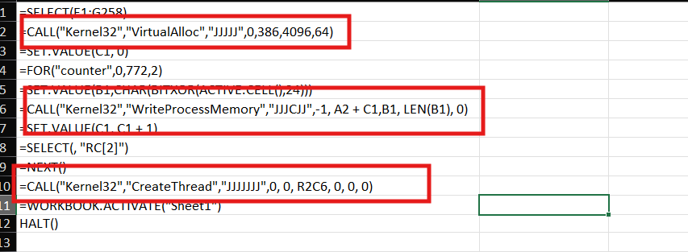
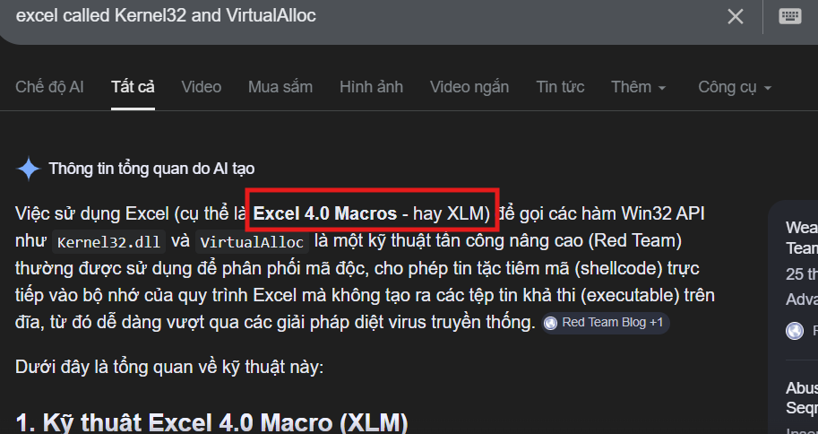
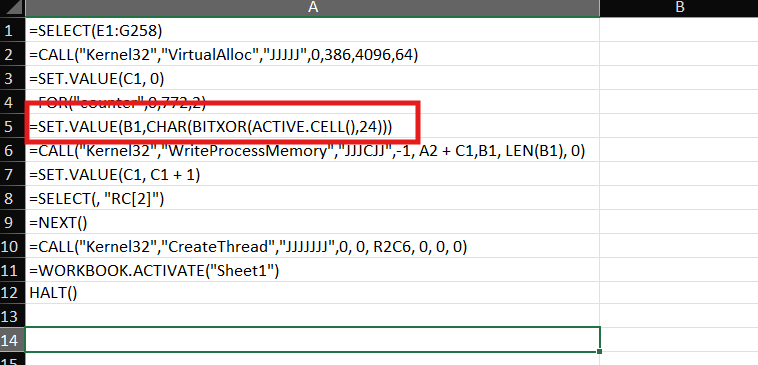
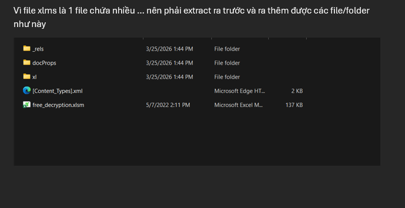
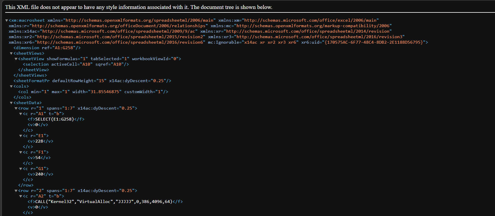
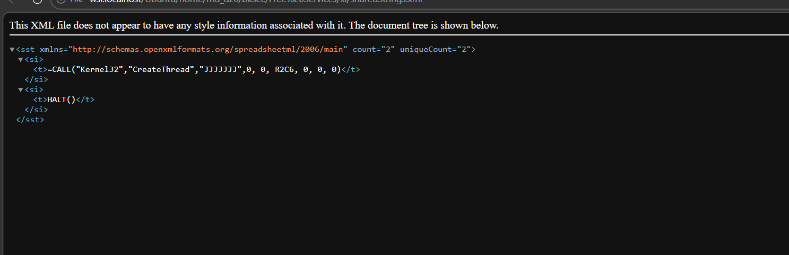
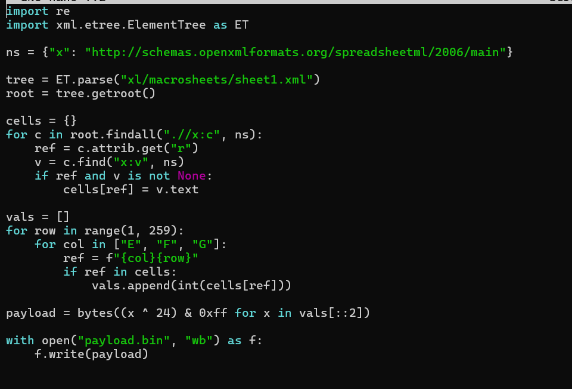
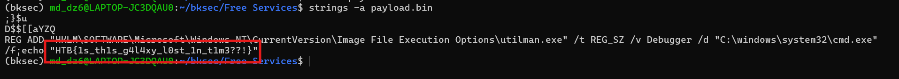

# Challenge Free services

## 1. Đầu vào challenge

Challenge cung cấp một file `xlms`. Có thể thấy đây **không phải** file Excel thông thường dạng `xlsx`, nên cần đặt nghi vấn rằng file có thể chứa macro độc hại.



---

## 2. Nhận diện kỹ thuật được dùng

Mở file ra và quan sát các lệnh bên trong, sau đó tra cứu thêm thì phát hiện file này đang sử dụng **Excel 4.0 Macros**.





### Nhận định 

Macro trong file đang thực hiện chuỗi hành động sau:

- lấy từng giá trị số trong sheet
- XOR với `24`
- chuyển kết quả thành byte
- ghi byte đó vào vùng nhớ
- cuối cùng tạo thread để thực thi payload đã được khôi phục trong memory

Đây là một flow **giải mã shellcode / payload rồi chạy trực tiếp trong bộ nhớ**.

---

## 3. Flow mà macro thực hiện

- `A1 = SELECT(E1:G258)`  
  Chọn vùng chứa dữ liệu đã bị mã hóa.

- `A2 = CALL("Kernel32","VirtualAlloc",...)`  
  Cấp phát vùng nhớ để chuẩn bị ghi payload.

- `A3 = SET.VALUE(C1,0)`  
  Khởi tạo biến đếm ban đầu bằng `0`.

- `A4 = FOR("counter",0,772,2)`  
  Bắt đầu vòng lặp qua dữ liệu.

- `A5 = SET.VALUE(B1,CHAR(BITXOR(ACTIVE.CELL(),24)))`  
  Lấy giá trị của ô hiện tại, XOR với `24`, rồi đổi thành `1` byte.

- `A6 = CALL("Kernel32","WriteProcessMemory",...)`  
  Ghi byte đó vào vùng nhớ vừa cấp phát.

- `A7 = SET.VALUE(C1,C1+1)`  
  Tăng offset ghi.

- `A8 = SELECT(,"RC[2]")`  
  Di chuyển sang ô dữ liệu kế tiếp.

- `A9 = NEXT()`  
  Quay lại vòng lặp.

- `A10 = CALL("Kernel32","CreateThread",...)`  
  Tạo thread để thực thi payload đã được nạp vào memory.

---

## 4. Extract file `xlms`

File `xlms` thực chất là một gói nén theo chuẩn **Office Open XML**. Bên trong nó chứa nhiều file XML, metadata và các thư mục thành phần, nên cần extract ra trước để kiểm tra cấu trúc. Sau khi giải nén, thu được thêm các file và folder như sau.



---

## 5. Xác định nơi chứa phần macro thực thi

Sau khi kiểm tra cấu trúc bên trong, phát hiện trong thư mục `xl/macrosheets` có file `sheet1.xml`, đồng thời còn có file `sharestring.xml`.

Hai file này chính là nơi để xem được phần thực thi của macro.





### Nhận định

Từ các file XML này có thể lần ra:

- vùng dữ liệu đang chứa payload bị mã hóa
- công thức macro dùng để xử lý dữ liệu
- flow giải mã và thực thi trong memory

---

## 6. Mô phỏng lại đúng flow của macro

Từ logic trong macro sheet, có thể viết script để mô phỏng lại những gì macro đang làm:

1. đọc dữ liệu đã mã hóa
2. XOR từng giá trị với `24`
3. ghép lại thành chuỗi byte hoàn chỉnh
4. xuất ra thành file nhị phân



Sau khi chạy script, thu được file:

```text
payload.bin
```

---

## 7. Trích xuất kết quả cuối

Tiếp tục, dùng lệnh:

```bash
strings -a payload.bin
```

để quét toàn bộ file nhị phân và tìm các chuỗi có thể đọc được.

Kết quả thu được flag:

```text
HTB{1s_th1s_g4l4xy_l0st_1n_t1m3??!}
```



---

## 8. Tóm tắt flow phân tích

```text
file .xlms
   |
   v
nhận ra đây không phải xlsx thông thường
   |
   v
xác định có sử dụng Excel 4.0 Macros
   |
   v
đọc flow macro:
SELECT -> XOR -> ghi memory -> CreateThread
   |
   v
extract file .xlms theo chuẩn Office Open XML
   |
   v
phân tích sheet1.xml và sharestring.xml
   |
   v
mô phỏng lại quá trình giải mã payload
   |
   v
xuất ra payload.bin
   |
   v
dùng strings để quét chuỗi
   |
   v
lấy flag
```

---
