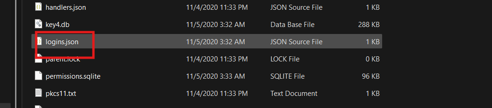
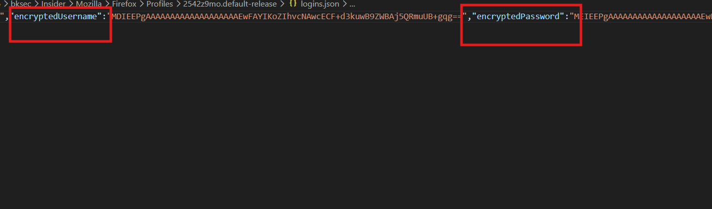
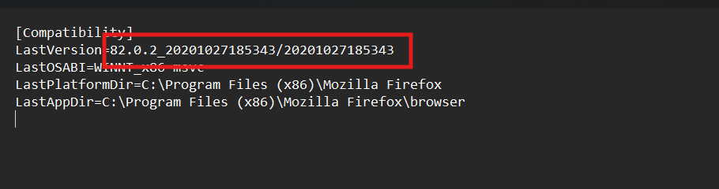
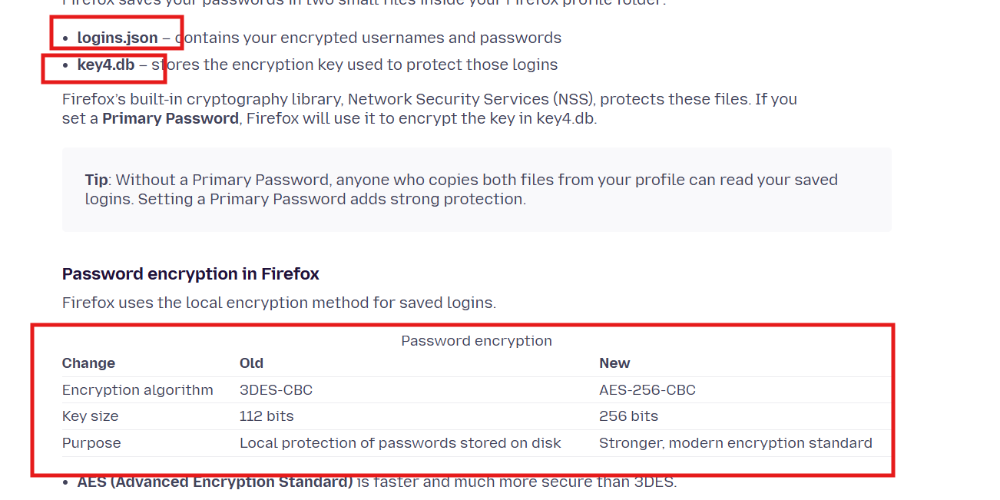
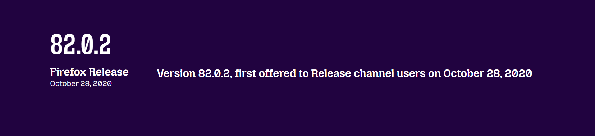
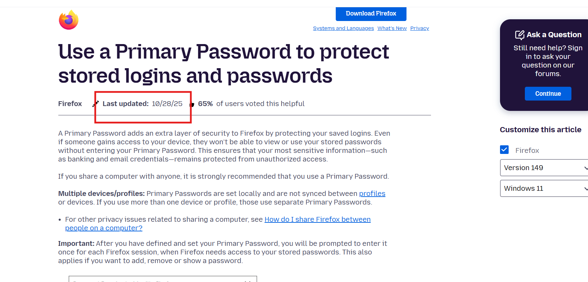
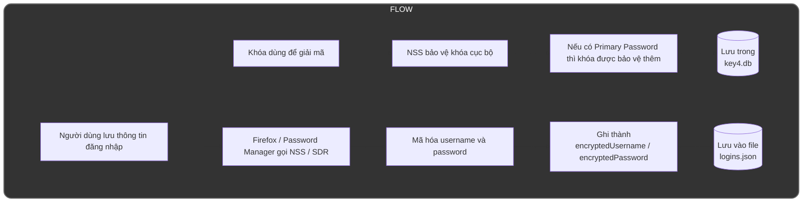
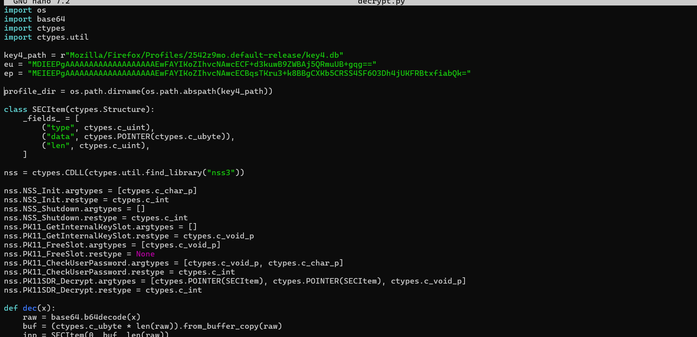
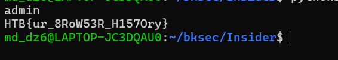

# Challenge Insider

## 1. Đầu vào challenge

Challenge cung cấp một folder tên **Mozilla**, nên có thể đoán đây là dữ liệu liên quan tới **Firefox profile**.

Lục kỹ hơn thì thấy file:

- `logins.json`



---

## 2. Dấu hiệu ban đầu trong `logins.json`

Mở file `logins.json` ra xem thì thấy phần **username** và **password** đang ở trạng thái **encrypt**, chưa thể đọc trực tiếp được.



Điều này cho thấy cần phải tìm hiểu cơ chế Firefox lưu và bảo vệ thông tin đăng nhập trước khi thử giải mã.

---

## 3. Xác định version Firefox

Tiếp tục kiểm tra file `compatibility.ini` thì thấy version Firefox của profile này là:

```text
82.0.2
```




---

## 4. Cách Firefox lưu credential

Tra cứu cách Firefox encrypt username và password thì biết được:

- file `logins.json` chứa **username** và **password** ở dạng đã mã hóa
- file `key4.db` chứa **key** dùng để phục vụ việc decrypt hai thành phần đó
- đồng thời Firefox có **hai cách encrypt**, tương ứng với hai giai đoạn cũ và mới



### Nhận định

---

## 5. Đối chiếu version với mốc thời gian

Tra cứu tiếp thì biết được **Firefox 82.0.2** được phát hành vào:

```text
28/10/2020
```



Trong khi đó, cách encrypt mới được công bố ở mốc thời gian muộn hơn nhiều.



### Suy luận

Từ đây có thể kết luận rằng:

- **Firefox 82.0.2** vẫn dùng **cách encrypt cũ**
- vì vậy cần chọn đúng flow và đúng công cụ / script tương ứng với cơ chế cũ để decrypt
  
### Flow 



---


## 6. Script để decrypt username và password

Phần script được dùng để decrypt username và password:



- Cách làm là lấy hai chuỗi `encryptedUsername` và `encryptedPassword` từ `logins.json`, sau đó **Base64 decode** chúng để đưa về blob nhị phân gốc mà Firefox đã lưu. 

- Tiếp theo, script khởi tạo thư viện **NSS** bằng thư mục profile Firefox chứa `key4.db`. 

- Sau khi NSS được nạp, script gọi `PK11_GetInternalKeySlot()` để lấy **internal key slot**. nơi NSS quản lý các key nội bộ cần thiết cho việc xử lý dữ liệu được bảo vệ. 
  
- Sau đó dùng `PK11_CheckUserPassword()` để kiểm tra trạng thái **Primary password** của profile. Trong trường hợp profile không đặt Primary password, script có thể truyền chuỗi rỗng `b""`. Nếu profile có Primary password thật mà không biết đúng giá trị, bước này sẽ thất bại và không thể giải mã tiếp.

- Sau đó nó gọi `PK11SDR_Decrypt()`. Giải mã thành công, NSS trả về một `SECItem` đầu ra chứa dữ liệu plaintext. 

### Kiến thức ngoài lề
- **NSS**(**Network Security Services**). Đây là bộ thư viện crypto của Mozilla, cung cấp các chức năng liên quan tới thao tác mật mã.
- **SECItem** là một kiểu struct rất cơ bản trong NSS để chứa một khối dữ liệu.

---

## 8. Kết quả cuối

Sau khi decrypt được, thu được:

- **user đăng nhập:** `admin`
- **mật khẩu / flag:** `HTB{ur_8RoW53R_H157Ory}`



---

## 9. Flag

```text
HTB{ur_8RoW53R_H157Ory}
```

---


## 6. Flow xử lý của bài

Từ các dữ kiện trên, flow giải bài có thể tóm tắt như sau:

```text
folder Mozilla
   |
   v
phát hiện logins.json
   |
   v
nhận ra username/password đang bị mã hóa
   |
   v
kiểm tra compatibility.ini
   |
   v
xác định Firefox version = 82.0.2
   |
   v
tra cứu cơ chế Firefox lưu credential
   |
   v
biết rằng:
- logins.json chứa dữ liệu mã hóa
- key4.db chứa key giải mã
   |
   v
đối chiếu version với mốc thời gian
   |
   v
kết luận version này dùng cơ chế mã hóa cũ
   |
   v
decrypt username và password
```
