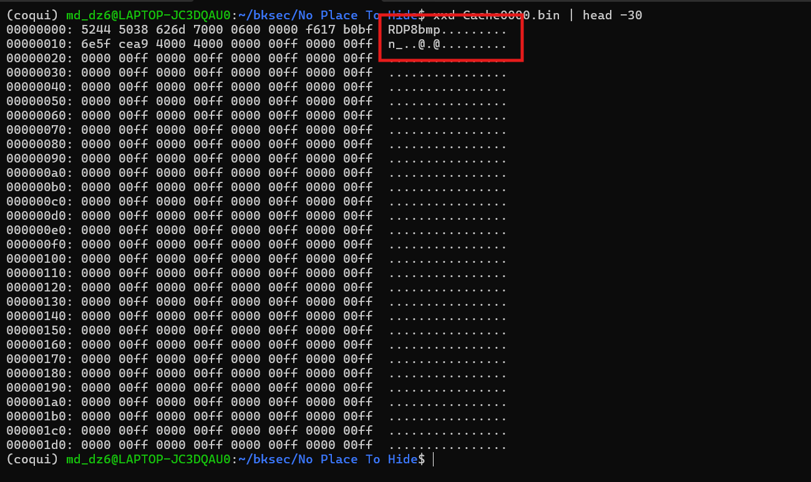
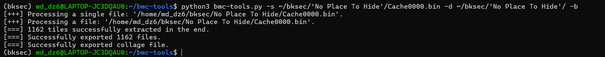
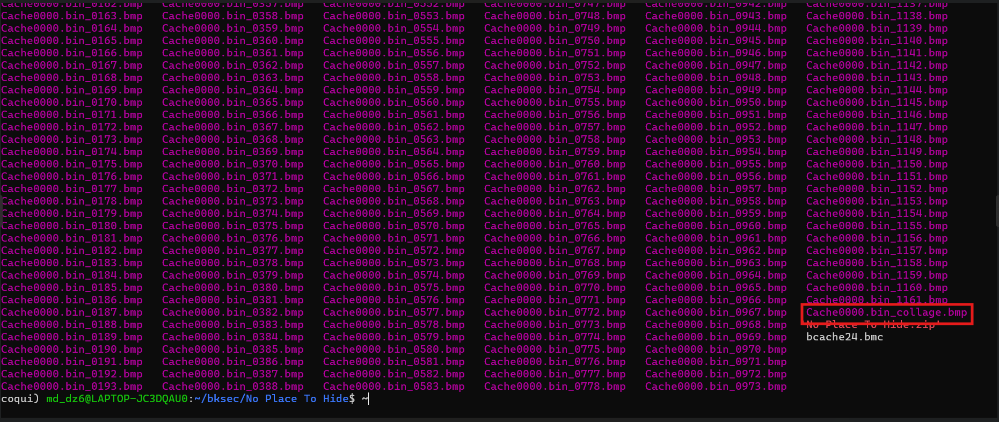
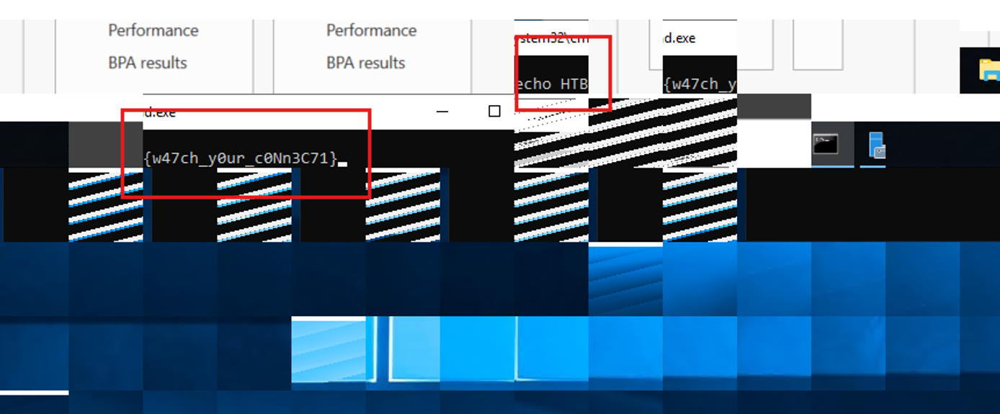

# Challenge no place to hide

## 1. Đầu vào challenge

Đầu vào của challenge gồm 2 file:

- `Cache0000.bin`
- `bcache24.bmc`

Tuy nhiên, file `bcache24.bmc` rỗng (`0KB`).

---

## 2. Nhận định ban đầu

`bcache24.bmc` và `Cache0000.bin` là 2 file thuộc **RDP Bitmap Cache**, thường được Windows lưu tại:

```text
%localappdata%\Microsoft\Terminal Server Client\Cache\
```

trong quá trình client kết nối **RDP** tới một máy khác. Vì vậy, hướng phân tích hợp lý là kiểm tra xem các file này có đúng thuộc định dạng RDP Bitmap Cache hay không.

---

## 3. Kiểm tra magic bytes

Thử kiểm tra trực tiếp bằng cách xem **magic bytes** của file.



Kết quả thu được chuỗi:

```text
RDP8bmp
```

Điều này xác nhận rằng đây đúng là file thuộc **RDP Bitmap Cache**.

---

## Kiến thức ngoài lề

### RDP Bitmap Cache là gì?

**RDP Bitmap Cache** là một bộ nhớ tạm thời được lưu trên máy **client** khi sử dụng **Remote Desktop Protocol (RDP)** để kết nối tới một máy **server**.

Mục đích của nó là:

- lưu lại các tile bitmap đã hiển thị
- giảm lượng dữ liệu cần truyền lại
- giúp phiên remote hiển thị nhanh hơn

- **`bcache24.bmc`**
  - là file **index / metadata**
  - số `24` đại diện cho **bit-depth 24-bit**

- **`Cache0000.bin`**
  - là file lưu các **tile bitmap thực tế**
  - số `0000` cho thấy đây là cache của phiên RDP đầu tiên

---

## 4. Hướng xử lý phù hợp

Với challenge liên quan tới **RDP bitmap cache**, có thể dùng tool:

```text
bmc-tools
```

Đây là công cụ dùng để:

- đọc các file `cachexxxx.bin`
- tách từng tile ra thành các file `.bmp`
- ghép chúng lại thành một ảnh lớn để quan sát nội dung màn hình của phiên RDP

---

## 5. Lệnh thực hiện

Dùng lệnh để extract ra các file bmp và file bmp tổng:

```bash
python3 bmc-tools.py -s ~/bksec/'No Place To Hide'/Cache0000.bin -d ~/bksec/'No Place To Hide'/ -b
```





---

## 6. Kết quả

Sau khi dùng `bmc-tools`, có thể phục hồi lại nội dung hình ảnh từ phiên RDP và thu được flag.

```text
HTB{w47ch_y0ur_c0Nn3C71}
```


