# Challenge TrueSecrets

## 1. Đầu vào challenge

Đầu vào là một file dump bộ nhớ:

```text
TrueSecrets.raw
```

Nhìn ban đầu có thể nghi ngờ đây là file **memory dump**, nên bước đầu tiên là kiểm tra thông tin hệ điều hành bằng Volatility.

```bash
vol -f TrueSecrets.raw windows.info
```

Kết quả xác nhận đây là file dump từ máy:

- **Windows 7 SP1**

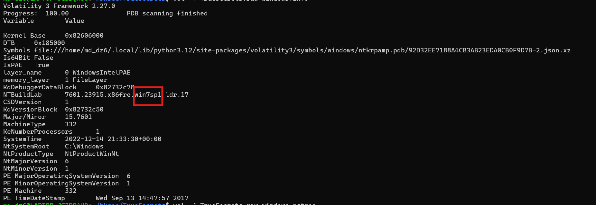

---

## 2. Kiểm tra các process đang chạy

Sau khi xác nhận đây là memory dump Windows, bước tiếp theo là kiểm tra các process đang chạy tại thời điểm RAM được chụp.

```bash
vol -f TrueSecrets.raw windows.pstree
```

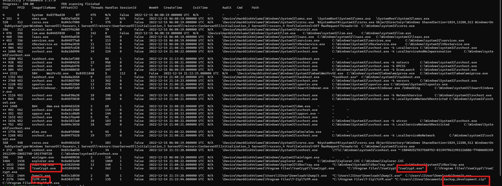

### Nhận định

Ở đây cần chú ý các process liên quan tới:

- `TrueCrypt.exe`
- `7zFM.exe`
- `DumpIt.exe`

Từ các process này có thể suy ra khả năng cao user đã:

1. dùng **TrueCrypt** để mã hóa một dữ liệu nào đó
2. dùng **7zFM.exe** để thao tác với file `backup_development.zip`
3. sau đó dùng **DumpIt.exe** để chụp RAM

Điểm quan trọng là `TrueCrypt.exe` vẫn còn chạy trước thời điểm `DumpIt.exe` thực hiện dump, nên có thể thử kiểm tra xem **passphrase TrueCrypt có còn bị cache trong bộ nhớ hay không**.

---

## 3. Thử lấy passphrase TrueCrypt từ RAM

Tiếp theo, thử dùng plugin TrueCrypt của Volatility:

```bash
vol -f TrueSecrets.raw windows.truecrypt
```

Kết quả cho thấy có thể lấy được **password**.

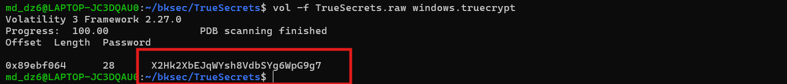

### Ý nghĩa

Nếu passphrase vẫn còn trong RAM, thì khả năng rất cao có thể dùng nó để mở container TrueCrypt sau này.

---

## 4. Truy vết file `backup_development.zip`

Bước tiếp theo là quay sang file: `backup_development.zip` Mục tiêu là lấy địa chỉ `FILE_OBJECT` từ process liên quan tới `7zFM.exe`.

```bash
vol -f TrueSecrets.raw windows.handles --pid 2176
```

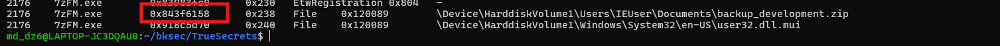

---

## 5. Trích xuất file từ cache bộ nhớ

Sau khi đã có địa chỉ `FILE_OBJECT`, tiếp tục dùng địa chỉ đó để thử trích xuất nội dung file từ cache bộ nhớ.

```bash
vol -f TrueSecrets.raw windows.dumpfiles --virtaddr 0x843f6158
```

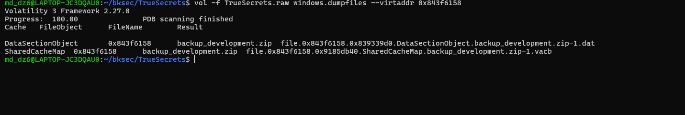

Kết quả thu được 2 file, và từ đó lấy ra được file:

```text
development.tc
```

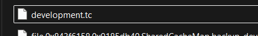

### Kiến thức ngoài lề: file `.tc` là gì?

File `.tc` có thể hiểu là một **ổ đĩa mã hóa được đóng gói bên trong một file**.

Khi mount file này bằng **TrueCrypt** hoặc **VeraCrypt**, rồi mở khóa bằng đúng password, hệ điều hành sẽ nhìn thấy nó như một ổ đĩa mới. Bên trong ổ đĩa đó có thể chứa thêm nhiều thư mục và file khác.

---

## 6. Mount file `development.tc`

Vì vậy, bước tiếp theo là mount được file `development.tc` bằng password đã tìm được từ RAM. Khi mount thành công, sẽ xuất hiện một ổ đĩa mới. Bên trong ổ đó có thư mục: `malware`

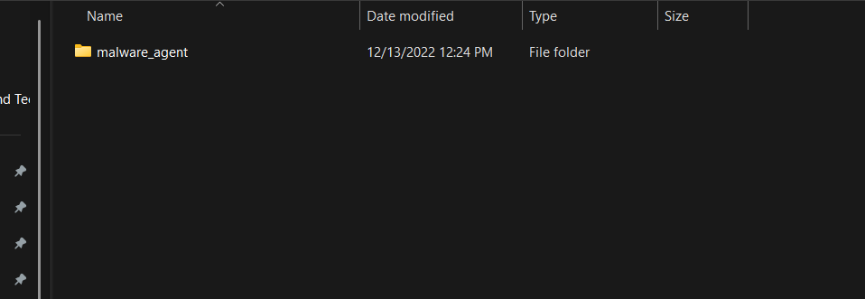

Mở sâu hơn thì thu được file: `AgentServer.cs`

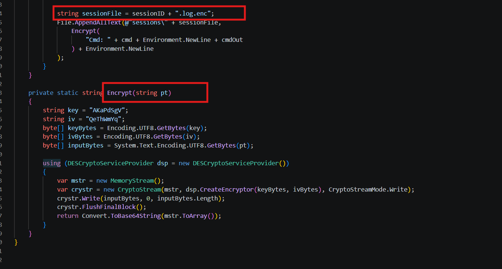

---

## 8. Vai trò của `AgentServer.cs`

Từ nội dung phân tích, file `AgentServer.cs` có chức năng:

- encrypt output bằng **DES-CBC**
- sau đó encode thêm một lớp **Base64**
- rồi lưu kết quả ra các file: `.log.enc`

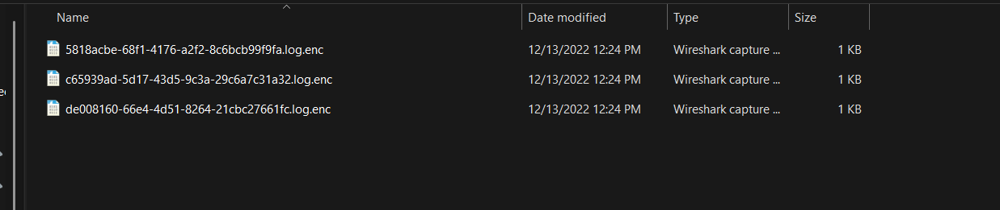

Vậy để đọc được nội dung các file `.log.enc`, cần làm ngược lại đúng flow mà chương trình đã dùng:

1. **Base64 decode**
2. **DES-CBC decrypt**

---

## 9. Thông tin giải mã

Để giải mã các file `.log.enc`, cần dùng:

```text
key: AKaPdSgV
iv:  QeThWmYq
```

Vì vậy chỉ cần:

- Base64 decode
- rồi DES-CBC decrypt bằng đúng `key` và `iv` trên

là có thể đọc được nội dung trong các file log đã mã hóa.

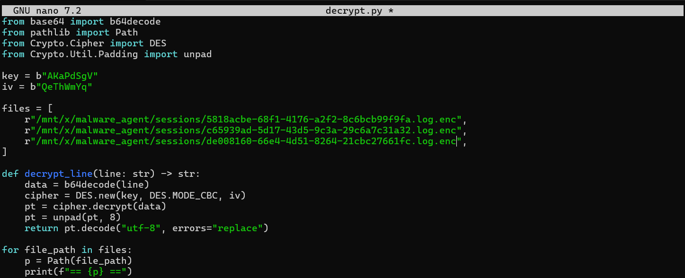

---

## 10. Flag

Sau khi giải mã được nội dung các file `.log.enc`, thu được flag:

```text
HTB{570r1ng_53cr37_1n_m3m0ry_15_n07_g00d}
```

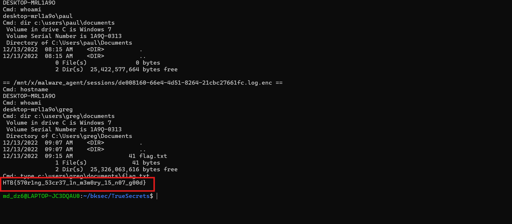

---

## 11. Tóm tắt flow phân tích

```text
TrueSecrets.raw
   |
   v
dùng windows.info để xác nhận hệ điều hành
   |
   v
xác định đây là Windows 7 SP1 32-bit
   |
   v
dùng windows.pstree để xem process
   |
   v
chú ý TrueCrypt.exe + 7zFM.exe + DumpIt.exe
   |
   v
dùng windows.truecrypt để kiểm tra passphrase cache trong RAM
   |
   v
lấy được password TrueCrypt
   |
   v
dùng windows.handles với PID của 7zFM.exe
   |
   v
lấy FILE_OBJECT liên quan tới backup_development.zip
   |
   v
dùng windows.dumpfiles để trích xuất file từ cache bộ nhớ
   |
   v
thu được development.tc
   |
   v
mount file .tc bằng password đã tìm được
   |
   v
mở ổ đĩa mới và lấy AgentServer.cs
   |
   v
xác định file này mã hóa log bằng:
Base64 + DES-CBC
   |
   v
dùng key / iv để giải mã các file .log.enc
   |
   v
thu được flag
```

---